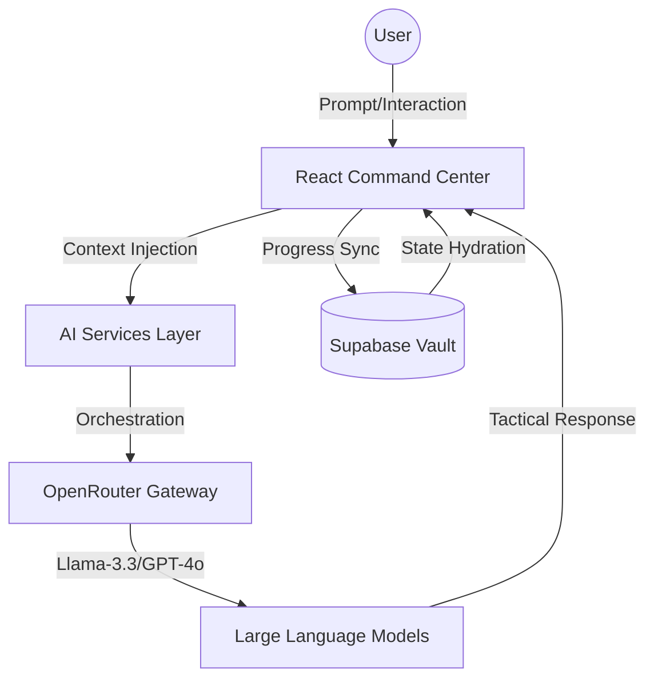

<p align="center">
  
  
  
  
</p>

---

# 🌌 GenAI Academy: The Intelligence Hub

> **"Bridging the singularity between theoretical AI and industrial engineering."**

GenAI Academy is not just a learning platform—it's a **tactical command center** for the next generation of AI engineers. Built with a focus on immersive UX and deep-tech simulators, it provides the tools needed to design, simulate, and master complex autonomous systems.

---

## ⚡ The Intelligence Loop
Our architecture is designed as a self-reinforcing learning loop. 



---

## 🖼️ Feature Showcase

### 🏗️ System Design Simulator
*The ultimate playground for distributed architecture.*
Drag, drop, and simulate. Witness real-time traffic flows, latency bottlenecks, and system failures through our high-fidelity canvas engine.

<p align="center">
  
</p>

### 🧠 AI Study Suite
*Transform research into mastery.*
Generate massive mind maps, tactical flashcards, and instant quizzes from any repository or whitepaper. Our Socratic AI tutor guides you through every roadblock.

<p align="center">
  
</p>

---

## 🧭 Navigation Hub

| Sector | ID | Operational Capability |
| :--- | :--- | :--- |
| **Curriculum Map** | `Net-01` | Multi-path visualization of Data Science through Agentic AI. |
| **Practice IDE** | `Lab-01` | Full-screen Python 3.x environment (Pyodide) with terminal. |
| **The Laboratory** | `Lab-02` | Natural Language to Architecture generation engine. |
| **Simulator** | `Sim-01` | Real-time traffic simulation with performance scoring. |
| **Admin Control** | `Cmd-01` | System-wide content moderation and user auth. |

---

## 🔑 Operational Config (API Keys)

To initialize the Command Center, populate your `.env.local` with the following pulses:

### 🤖 OpenRouter Gateway
Primary gateway for LLM orchestration. Supports 100+ models with automatic failover.
- **Key**: `VITE_OPENROUTER_API_KEY`
- **Source**: [OpenRouter API Keys](https://openrouter.ai/keys)

### ⚡ Supabase Vault
The persistent memory of the platform. Handles Auth and Knowledge State.
- **URL**: `VITE_SUPABASE_URL`
- **Key**: `VITE_SUPABASE_ANON_KEY`

---

## 🛠️ Tactical Stack
- **Interface**: React 18 / Vite
- **Visuals**: ReactFlow / Canvas API
- **State**: Supabase Real-time / Context API
- **Auth**: Supabase Auth
- **Execution**: Pyodide (In-browser Python)
- **Styling**: Premium Obsidian Design System (Custom CSS)

---

## ⚙️ Deployment Sequence

```bash
# Initialize Platform
git clone <repository-url> && cd genai-roadmap-src

# Hydrate Dependencies
npm install

# Connect Pulses
cp .env.example .env.local

# Ignite
npm run dev
```

---

## 🎨 Design Tokens
The GenAI Academy identity is built on the **Obsidian/Neon** palette:
- **Primary**: Pitch Black `#000000`
- **Accent 1**: Emerald Pulse `#00ff88`
- **Accent 2**: Cobalt Flow `#0088ff`
- **Surface**: Glassmorphic Slate `#1a1a1a`

---

## 📄 License
Privately developed for engineering excellence.