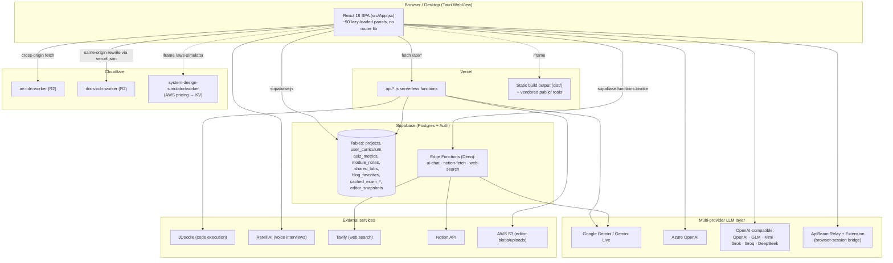
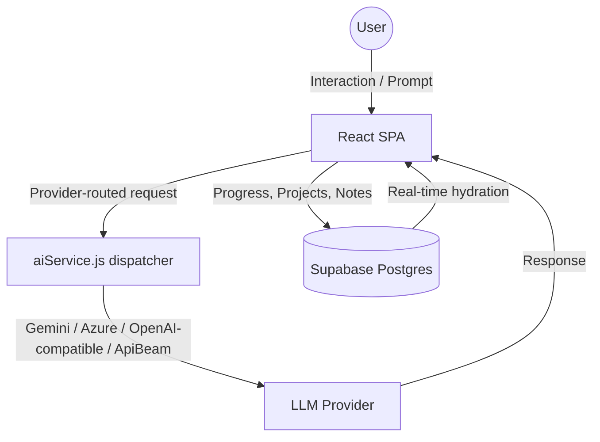
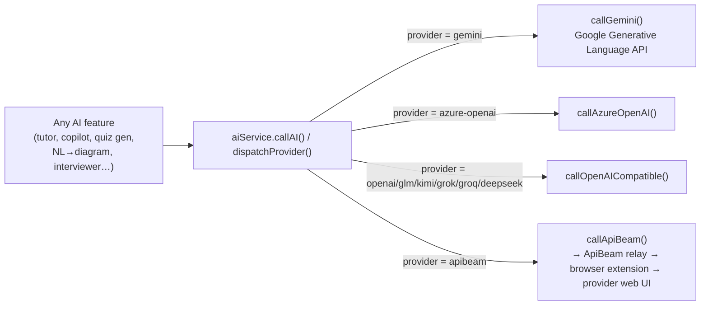
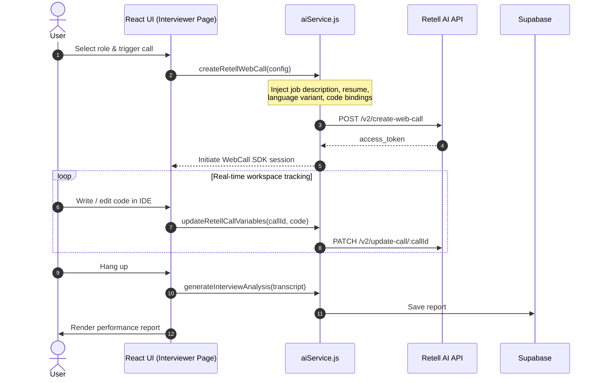
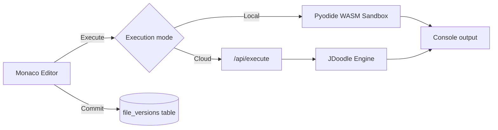
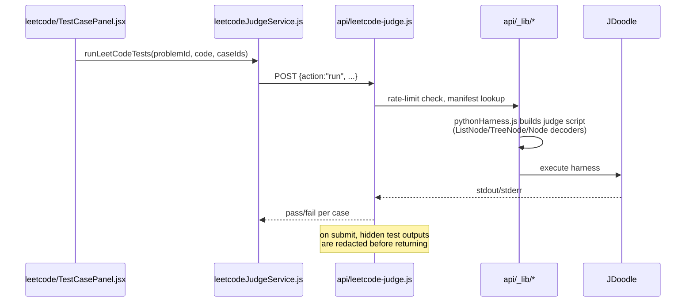
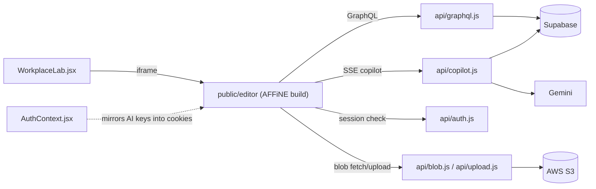
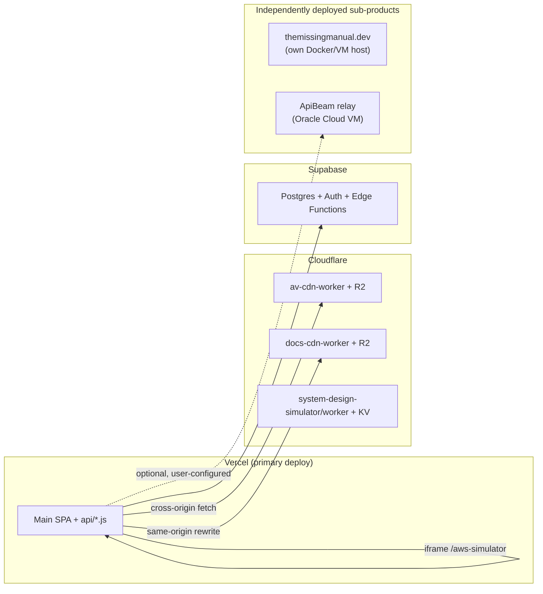

# 🌌 GenAI Academy

> A single-page, all-in-one AI/ML & software-engineering learning platform: curriculum roadmaps, an AI study companion, a cloud IDE, algorithm/system-design simulators, mock voice interviews, a LeetCode-style judge, and a dozen vendored/self-built interactive tools — all served from one Vite/React SPA and a thin layer of Vercel/Supabase/Cloudflare backend glue.

<p align="center">
  
  
  
  
  
  
</p>

---

## Table of Contents

1. [What this repository actually is](#1-what-this-repository-actually-is)
2. [High-level architecture](#2-high-level-architecture)
3. [Repository map](#3-repository-map)
4. [The main SPA (`src/`)](#4-the-main-spa-src)
5. [Backend: Vercel serverless functions (`api/`)](#5-backend-vercel-serverless-functions-api)
6. [Data layer: Supabase (`supabase/`)](#6-data-layer-supabase-supabase)
7. [Standalone sub-projects](#7-standalone-sub-projects)
8. [Vendored/embedded tools (`public/`)](#8-vendoredembedded-tools-public)
9. [Cloudflare Workers (CDN edge)](#9-cloudflare-workers-cdn-edge)
10. [Desktop app (Tauri)](#10-desktop-app-tauri)
11. [Key data & sequence flows](#11-key-data--sequence-flows)
12. [Build pipeline, explained step by step](#12-build-pipeline-explained-step-by-step)
13. [Environment variables (full reference)](#13-environment-variables-full-reference)
14. [Local setup](#14-local-setup)
15. [Deployment topology](#15-deployment-topology)
16. [Database schema reference](#16-database-schema-reference)
17. [Project documentation index](#17-project-documentation-index)
18. [Known quirks & gotchas](#18-known-quirks--gotchas)

---

## 1. What this repository actually is

`GenAIAcademy` is **not** one small app — it is a monorepo containing:

- **One primary product**: a large, client-heavy React SPA ("GenAI Academy") that is a learning hub for AI/ML, GenAI, data structures & algorithms, system design, and cloud-adjacent certifications (AWS, Claude, Amazon Connect). It has no router library — navigation is a hand-rolled state machine in `src/App.jsx` toggling ~90 lazily-loaded full-screen panels.
- **A thin serverless backend** (`api/`, Vercel functions) that exists almost entirely to (a) keep third-party API keys off the client, and (b) emulate two external product APIs (AFFiNE's GraphQL/copilot API) so a vendored third-party app can run against this backend instead of its own.
- **A Postgres data layer** (Supabase) for auth, curriculum progress, cloud-IDE file storage, exam-bank caching, community chat, and notes — protected end-to-end with Row Level Security.
- **Several fully independent products living inside the same repo**, each with its own package manager, build system, and (in some cases) its own separate deployment: an AWS system-design traffic simulator (Angular + Cloudflare Worker), a from-scratch content platform called "The Missing Manual" (Rust + SvelteKit + Docker), a Claude-certification study app (React/Vite), and a browser-extension + relay server system ("ApiBeam") for routing AI calls through a logged-in browser tab instead of a paid API key.
- **A pile of vendored/pre-built third-party or previously-built tools** dropped into `public/` and iframed into the SPA: an Angular AWS simulator, a diagram-as-code tool (OpenFlowKit), a Next.js Git-learning game (GitMastery), a Kubernetes 3D simulator, a codebase-visualizer (CodeFlow), and a full self-hosted AFFiNE (Notion/Miro-style workspace) instance repurposed as an in-app notes editor.
- **A Tauri desktop shell** that just wraps the same Vite build in a native WebView window — no separate desktop codebase.

If you only read one thing to understand "what is this app," it is: **a single React SPA is the front door; almost everything else in this repo either (a) generates data/content that gets baked into that SPA at build time, (b) is a separately-built static bundle iframed inside it at runtime, or (c) is an independent product that happens to share this git history.**

---

## 2. High-level architecture


```mermaid
graph TB
    subgraph Client["Browser / Desktop (Tauri WebView)"]
        SPA["React 18 SPA (src/App.jsx)<br/>~90 lazy-loaded panels, no router lib"]
    end

    subgraph Vercel["Vercel"]
        API["api/*.js serverless functions"]
        STATIC["Static build output (dist/)<br/>+ vendored public/ tools"]
    end

    subgraph Supabase["Supabase (Postgres + Auth)"]
        DB[("Tables: projects, user_curriculum,<br/>quiz_metrics, module_notes, shared_labs,<br/>blog_favorites, cached_exam_*, editor_snapshots")]
        EdgeFn["Edge Functions (Deno):<br/>ai-chat · notion-fetch · web-search"]
    end

    subgraph AI["Multi-provider LLM layer"]
        Gemini["Google Gemini / Gemini Live"]
        Azure["Azure OpenAI"]
        OpenAICompat["OpenAI-compatible:<br/>OpenAI · GLM · Kimi · Grok · Groq · DeepSeek"]
        ApiBeamRelay["ApiBeam Relay + Extension<br/>(browser-session bridge)"]
    end

    subgraph Edge["Cloudflare"]
        AVWorker["av-cdn-worker (R2)"]
        DocsWorker["docs-cdn-worker (R2)"]
        PricingWorker["system-design-simulator/worker<br/>(AWS pricing → KV)"]
    end

    subgraph ThirdParty["External services"]
        JDoodle["JDoodle (code execution)"]
        Retell["Retell AI (voice interviews)"]
        Tavily["Tavily (web search)"]
        Notion["Notion API"]
        S3["AWS S3 (editor blobs/uploads)"]
    end

    SPA -->|fetch /api/*| API
    SPA -->|supabase-js| DB
    SPA -->|supabase.functions.invoke| EdgeFn
    SPA -.->|iframe| STATIC

    API --> Gemini
    API --> JDoodle
    API --> S3
    API --> DB
    SPA --> Azure
    SPA --> OpenAICompat
    SPA --> ApiBeamRelay
    SPA --> Retell

    EdgeFn --> Gemini
    EdgeFn --> Tavily
    EdgeFn --> Notion

    SPA -->|same-origin rewrite via vercel.json| DocsWorker
    SPA -->|cross-origin fetch| AVWorker
    SPA -.->|iframe /aws-simulator| PricingWorker
```

**Core design decisions worth knowing up front:**

- **No React Router.** Every "page" is a `useState` boolean toggled from the sidebar/search palette; every panel is `React.lazy()`-loaded. This keeps the initial bundle small at the cost of `App.jsx` being ~2,150 lines of view-state plumbing.
- **Multi-provider AI, client-orchestrated.** `src/services/aiService.js` is a single dispatcher that can call Gemini, Azure OpenAI, or any OpenAI-compatible endpoint (OpenAI/GLM/Kimi/Grok/Groq/DeepSeek), or relay through the ApiBeam browser extension — selected per-user via `src/config/aiProviders.js` and stored credentials in `AuthContext`.
- **Heavy data is fetched, not bundled.** Multi-MB datasets (Analytics Vidhya archive, blog catalog, interview-prep bank, docs archives) are deliberately kept out of the JS bundle and lazy-fetched from `public/data/*.json` or a Cloudflare Worker/R2 CDN at runtime — several `*_PLAN.md` docs in the repo root record this optimization work.
- **Secrets never reach the browser for execution-adjacent features.** Code execution (JDoodle or HackerEarth, user-selectable per run), Gemini Live tokens, and file uploads all proxy through `api/*.js` specifically so `JDOODLE_CLIENT_ID/SECRET`, `HACKEREARTH_CLIENT_SECRET`, `GEMINI_API_KEY`, and AWS credentials stay server-side.
- **A vendored third-party app (AFFiNE) is repointed at this backend.** `api/graphql.js` and `api/copilot.js` re-implement just enough of AFFiNE's own server API for the iframed `public/editor/` build to work as an in-app "Workspace Notes" tool talking to Supabase instead of a real AFFiNE server.

---

## 3. Repository map

```
GenAIAcademy/
├── src/                         # Main React SPA source
├── api/                         # Vercel serverless functions (Node)
├── supabase/                    # Postgres migrations + Deno edge functions
├── src-tauri/                   # Tauri desktop shell (wraps the same SPA)
├── public/                      # Static assets + vendored/iframed sub-apps
│   ├── aws-simulator/           # ← built from system-design-simulator/frontend
│   ├── flow-design/             # ← built from a gitignored flow-design/ source
│   ├── git-visualizer/          # ← built from a gitignored "Git Visualizer/" source
│   ├── k8sgames/                # vendored Three.js Kubernetes simulator
│   ├── codeflow/                # vendored codebase-visualizer
│   ├── editor/                  # vendored AFFiNE build ("Workspace Notes")
│   ├── claude-certificate/      # ← built from "Claude Certeficate 3/"
│   ├── reference/                # ← generated from reference/ (Hexo cheat-sheet source)
│   ├── labs/                    # standalone interactive HTML labs
│   └── data/                    # generated JSON datasets (AV archive, blogs, exams…)
├── scripts/                     # Python/Node build & data-pipeline scripts
├── system-design-simulator/     # Independent product: AWS traffic simulator
├── api_beam/                    # Independent product: browser-session AI relay
├── themissingmanual/            # Independent product: content platform (Rust+Svelte)
├── design-system/               # Design-system spec (docs only, no code)
├── av-cdn-worker/               # Cloudflare Worker: AV archive CDN
├── docs-cdn-worker/             # Cloudflare Worker: docs archive CDN
├── Claude Certeficate 3/        # Independent product: Claude cert study app
├── reference/                   # Hexo blog project — source of public/reference cheat sheets
├── micro-workspace-protocol-nextjs/  # Orphaned experimental landing page (unused)
├── tests/                       # Node test files (concurrency quest, LeetCode judge)
├── docs/                        # Engineering notes (judge coverage, mobile redesign)
└── *_PLAN.md, *_SETUP.md        # Root-level planning/runbook docs (see §17)
```

---

## 4. The main SPA (`src/`)

### Entry & shell

- **`src/main.jsx`** — mounts `<App/>`; nothing else (Monaco's loader config is intentionally kept out of this file to avoid pulling it into the entry chunk).
- **`src/App.jsx`** (~2,150 lines) — the whole app shell:
  - `AuthProvider` → `ThemeProvider` → `Suspense` → `MainApp`.
  - `MainApp` owns curriculum state keyed by roadmap id (`ds`, `genai`, `agentic`, `aicxm_aws/azure/databricks`, plus utility keys like `workspace`, `videoIntelligence`, `saved_algos`, `onboarding`, `appearance`, `leetcode`), hydrated from and debounce-synced back to Supabase's `user_curriculum` table.
  - ~90 `React.lazy()` imports code-split nearly every feature into its own chunk.
  - View state and the active lab id persist to `localStorage`; a `LAB_IDS` set of ~140 `lab_*` ids drives the huge interactive-lab catalog.
  - Global Cmd/Ctrl+K search palette built from `buildSearchIndex(pathsData)`.
  - Onboarding chatbot, guided walkthrough tour, mobile header/bottom-nav, and a top-level error boundary.

### `src/components/` — feature areas (representative, not exhaustive; ~88 files + 7 subfolders)

| Area | Notable components |
|---|---|
| **Dashboards** | `HomeDashboard`, `Home2Dashboard`/`Home2Voyage`, `FeatureHome`, `IntelligenceHub` (central hub, 1,891 lines), `KnowledgeGalaxy` |
| **Curriculum views** | `RoadmapGraph`, `Roadmap2`/`Roadmap2NodeView`, `CurriculumTreePanel`, `ModulePanel`, `TopicContentPanel`, `ProgressTracker` |
| **AI study tools** | `AIStudyPanel`/`AIStudyContent` (AI quiz/flashcards/mindmap/summary), `AITutorPanel` (Socratic chat), `MindMap`, `ProjectIdeasPanel`, `QuizApp` |
| **Cloud IDE** | `Projects/ProjectIDE`, `EditorPane`, `FileExplorer`, `GitPanel`, `AIAssistant`, `BottomPanel`, `ImportGitHubModal`, `NotebookViewer`, `VersionHistory` — plus standalone `PythonIDE` |
| **Visualizers/simulators** | `AlgoVisualizer` (3,349 lines, largest component), `DSAAnimator`, `CodeVisualizer`, `PythonVisualizer`, `SqlLab` (in-browser Postgres via pglite + EXPLAIN ANALYZE), `ConcurrencyLab`, `K8sGames`/`GitVisualizer`/`FlowDesign` (iframe wrappers) |
| **Algorithm competition** | `AlgoWarArena` (real-time coding battles) |
| **Interview/career** | `InterviewPrep` (996 lines), `OnboardingChatbot` |
| **Docs viewers** | `AgentCoreViewer`, `LangChainDocs`, `StrandsDocs`, `ManualViewer`/`ManualTree`, `ReferenceViewer`, `SampleViewer`, `MermaidDiagram` |
| **Community** | `Community/Community` — chat/groups |
| **GitHub integration** | `GitHubHub` + `github/` subfolder (`RepoManager`, `FileTreeExplorer`, `CodeFlowViewer`, `ContributionTracker`, `ReadmeViewer`, `TrendingFeed`) |
| **Notion embed** | `notion/NotionRenderer` + per-block renderers (callout, code, table, toggle, todo, columns, database, image, video, bookmark, quote…) |
| **Exam bank** | `quiz/ExamPractice` + `quiz/examBank/*` — front-end for `api/exam.js` |
| **LeetCode judge** | `leetcode/TestCasePanel` — talks to `leetcodeJudgeService.js` → `api/leetcode-judge.js` |
| **Voice/AI companions** | `AimlCompanion` (848 lines), `FullContextChatbot` ("Atlas", 560 lines), `VoiceOrb3D`/`Orb` (three.js/OGL shader visualizers for Gemini Live & Retell) |
| **Admin/settings/auth** | `AdminManagement`, `AppearanceSettings` (585 lines), `AuthInterface`, `AppWalkthrough`, `ProviderIcon` |
| **Navigation** | `Sidebar` (legacy, 1,708 lines) / `SidebarModern` (current, 1,043 lines), `GlobalSearchPalette` |
| **Production tools** | `WorkplaceLab` (2,514 lines, second-largest component — notes/tasks + the embedded AFFiNE editor), `FocusPulse` (1,103 lines), `ResourceManager`, `LinksCompanion`, `AgentLibrary` |

### `src/pages/`

- `LandingPage`/`NewLandingPage`/`LandingWrapper`, `HomePage3`, `KnowledgeGraph`, `LeetCodePage`
- `blog/` — `BlogPage`, `AVArticle` (renders the Analytics Vidhya archive), `AdminBlogEditor`
- `emotional-support/EmotionalSupportPage` — "Solace" AI companion
- `gemini-interviewer/` — `GeminiInterviewerPage` (real-time voice via `geminiLiveService.js`), `InterviewAnalyticsReport`
- `interviewer/InterviewerPage` — Retell-based voice mock interviewer
- `playground/` — `SystemDesignPlayground`, `ArchitectureDesign`, `NLFlowGenerator` (natural language → ReactFlow diagram)
- `playground2/` — `GenAIPlayground2`, `WhiteboardNodes` (newer whiteboard playground)
- `roadmap/` — `Roadmap3` (scroll-driven "fly through your path"), `RoadmapMobile`
- `simulator/` — `SystemDesignSimulator`, `AWSSystemDesignSimulator` (wraps the Angular sub-app)

### `src/labs/`, `src/contexts/`, `src/config/`, `src/services/`, `src/store/`, `src/data/`, `src/prompts/`, `src/utils/`

- **`src/labs/`** — `LabKit` (shared CSS/primitives), `AdvancedLabsA`/`AdvancedLabsB` (self-contained mini-simulators), `ConceptSimulator` (generic simulator shell).
- **`src/contexts/AuthContext.jsx`** — Supabase auth (email/password, Google OAuth, mock admin sign-in), admin/locked-user lists, and per-user AI provider credentials mirrored into both `localStorage` and cookies so the same-origin iframed AFFiNE editor can read a signed-in visitor's own AI keys without custom headers.
- **`src/contexts/ThemeContext.jsx`** — 13 dark + 4 light palettes, font pickers, layout density, background patterns, 9 curated presets, OS dark-mode sync, JSON export/import; persists to `localStorage` + an `appearance` column on `user_curriculum`.
- **`src/contexts/ProjectsContext.jsx`** — Cloud IDE state (open tabs, file tree, git status, AI assistant chat/diffs, GitHub PAT).
- **`src/config/aiProviders.js`** — the single source of truth for every LLM provider (`gemini`, `azure-openai`, `openai`, `apibeam`, `glm`, `kimi`, `grok`, `groq`, `deepseek`), consumed by `aiService.js`, `AuthContext`, and every settings UI.
- **`src/config/supabaseClient.js`** — Supabase client with a hardcoded project URL/anon key plus a `readPersistedSession()` helper to hydrate the session synchronously from `localStorage` before first paint.
- **`src/services/aiService.js`** (~1,538 lines) — the multi-provider dispatcher: `callGemini`, `callAzureOpenAI`, `callOpenAICompatible`, `callApiBeam`, unified via `dispatchProvider`/`callAI`; high-level generators for tutoring, emotional support, project ideas, NL→diagram generation, study content, video intelligence, interview coaching, and Retell web-call creation.
- **`src/services/geminiLiveService.js`** — `GeminiLiveSession` wrapping the Gemini Live WebSocket API: mic capture/downsampling, PCM playback scheduling, barge-in detection, pitch estimation for the voice orb, and short-lived tokens minted via `/api/gemini-live-token`.
- **`src/services/pathfinderService.js`**, **`leetcodeJudgeService.js`**, **`jdoodleService.js`** — clients for the onboarding recommender, the LeetCode judge API, and the JDoodle code-execution proxy respectively.
- **`src/services/codelabProblemService.js`** — the one way to reach a Code Lab problem: a shared cache over `/codelab/problems/<slug>.json`, plus `findCodelabProblem()` which resolves a Pattern Wise DSA topic (category/pattern/title) to its problem through `/codelab/topicMap.json`, fetched on first use. Used by both `LeetCodePage` and the study path's `TopicContentPanel`.
- **Other services**: `curriculumCache.js` (dedupes the `user_curriculum` fetch across App/Auth/Theme), `blogCatalogService.js`/`avArchiveService.js` (fetch-on-demand JSON, kept out of the bundle deliberately — see `PERFORMANCE_PLAN.md`), `githubService.js`/`githubIDEService.js`, `projectService.js` (Cloud IDE CRUD), `agentLibraryService.js`, `labCatalogService.js`, `webSearchService.js`.
- **`src/store/`** — `customProblemsStore.js`, `favoriteBlogsStore.js` (Supabase for signed-in users, localStorage for guests), `savedStudyStore.js`.
- **`src/data/`** — large static/generated curriculum data: `roadmap.js` (the default `PATHS` for every track), `dsa_path.js`, `manual_path.generated.json` (build-time derived), `aicxm_aws/azure/databricks_path.js`, `dsa_part1.js`–`dsa_part9.js`, `agentcoreData.js`/`langchainDocsData.js`/`strandsDocsData.js` (all generated by `scripts/build_*.py`), plus lab/quiz/interview datasets.
- **`src/prompts/`** — role-playbook prompt templates for the AI mock interviewer and the emotional-support companion.
- **`src/utils/`** — `buildSearchIndex.js` (Cmd+K index), `disposeThreeScene.js` (WebGL context cleanup — browsers cap ~16 live contexts), `labTaxonomy.js`, `tiptapToText.js`.

---

## 5. Backend: Vercel serverless functions (`api/`)

| Endpoint | Method | Talks to | Purpose |
|---|---|---|---|
| `api/auth.js` | GET | — | Stub session/methods responses so the iframed AFFiNE editor's auth check resolves cleanly instead of 404ing |
| `api/blob.js` | GET | AWS S3 | Streams editor attachment blobs by `?key=` |
| `api/copilot.js` | SSE stream | Supabase, Gemini, Azure OpenAI | AI copilot sidebar backend for the embedded "Workspace Notes" editor |
| `api/exam.js` | GET | `open-exam-prep.com` scraper, Supabase cache | Consolidated Exam Bank endpoint (`?resource=scrape\|flashcards\|resources\|studyguide\|videos\|export`) — merged from 7 functions to stay under Vercel's Hobby function-count cap |
| `api/execute.js` | POST | JDoodle | Code execution proxy for the Practice IDE (python3/nodejs/java/cpp17/go) |
| `api/gemini-live-token.js` | POST | Google Generative Language API | Mints a ≤30-minute ephemeral token for Gemini Live so the raw key never reaches the browser |
| `api/graphql.js` | POST | Supabase | Partial AFFiNE-compatible GraphQL server (`serverConfig`, `currentUser`, copilot sessions/messages) |
| `api/leetcode-judge.js` | POST | in-process Python harness | Combined run/submit judge for Code Lab, rate-limited per IP (30 runs/min, 12 submits/min) |
| `api/prices.js` | GET | Cloudflare KV | AWS pricing data by region for the System Design Simulator |
| `api/regions.js` | (module) | — | Shared `SUPPORTED_REGIONS` allowlist |
| `api/upload.js` | POST | AWS S3 | Raw file-upload proxy for the editor |
| `api/youtube-playlist.js` | GET | YouTube Data API v3 | Fetches all videos (title/channel/duration/views) in a playlist by `?url=` for the Resources panel's playlist import |

`api/_lib/` holds the shared logic: `examScraper.js` (scrape/parse/cache), `leetcodeJudge.js` (manifest lookup, rate limiting, hidden-test redaction), `pythonHarness.js` (generates the Python judge harness with `ListNode`/`TreeNode`/`Node` decoders). `api/_data/` mirrors judge manifests (`codelabManifests.json`, `leetcodeManifests.json`) generated at build time from `src/data/`.

---

## 6. Data layer: Supabase (`supabase/`)

### Edge Functions (Deno, `supabase/functions/`)

| Function | Purpose |
|---|---|
| `ai-chat` | Proxies Gemini chat completions, keeps `GEMINI_API_KEY` server-side |
| `notion-fetch` | Fetches a Notion page/block tree for the in-app Notion renderer |
| `web-search` | Proxies Tavily search, trims results to `{title, url, content}` |

### Migrations (chronological)

| Migration | What it adds |
|---|---|
| `20260708_projects.sql` | `projects`, `project_files`, `file_versions` (Cloud IDE), RLS + indexes |
| `20260715_exam_bank.sql` | `cached_exam_questions` (Exam Bank scrape cache) |
| `20260716_exam_bank_resources.sql` | `cached_exam_resources` (flashcards/studyguide/videos availability) |
| `20260729_editor_snapshots.sql` | `editor_snapshots` (Workspace Notes document snapshots) |
| `20260729_module_notes.sql` | `module_notes` (per-module user notes) |
| `20260807_shared_labs.sql` | `shared_labs` (community-submitted lab HTML) |
| `20260809_perf_indexes_and_split.sql` | `appearance` jsonb column on `user_curriculum` (splits theme data out of the monolithic blob) + perf indexes across `messages`/`channels`/`community_members`/`quiz_metrics`/`user_curriculum` + `active_chat_users()` function |
| `20260810_blog_favorites.sql` | `blog_favorites` (favorite-blogs store) |
| `20260811_custom_resources.sql` | `user_custom_resources` (synced "My Folders" custom resource library, Resources sidebar) |

Full column-level schema for the core tables is in [§16](#16-database-schema-reference).

---

## 7. Standalone sub-projects

These live inside the repo but are **independent products** — separate package managers, separate (or no) deploy pipelines, not built by the root `npm run build`.

### 7.1 ApiBeam (`api_beam/`)

A browser-session AI bridge: lets the app send prompts through a browser tab already signed into ChatGPT/Claude/z.ai, as an alternative to a paid API key.

- `apibeam-main` — Chrome/Firefox MV3 extension (React 19 + TS + Tailwind 4 + Vite 6), content scripts on `chatgpt.com`/`claude.ai`/`chat.z.ai` that inject prompts and scrape streamed responses.
- `apibeam-api-server-main` — NestJS + Socket.IO relay server. Exposes `/app/:roomId/*` HTTP routes; holds a request open, forwards it over WebSocket to the extension in a "room," and resolves the HTTP response when the extension replies (60s timeout).
- Flow: `App → HTTP → Relay server → WebSocket → Extension → provider web UI → response bubbles back`.
- Production reference deployment (per `README/documentation/API_BEAM_NEW_LAPTOP_SETUP.md`): relay on an Oracle Cloud VM behind Caddy, extension on the Chrome Web Store, frontend on Vercel.
- Run locally:
  ```bash
  cd api_beam/apibeam-api-server-main && yarn && NODE_ENV=dev yarn start:dev   # relay, port 3000
  cd api_beam/apibeam-main && yarn && yarn build:chrome                        # load dist_chrome unpacked
  ```
  Then in the extension: Settings → Custom API Base URL → `http://localhost:3000/` → connect → copy the `/app/<room-id>` URL → paste into the app's AI Credentials as the ApiBeam API URL.

### 7.2 System Design Simulator (`system-design-simulator/`)

An interactive AWS architecture sketchbook and deterministic traffic/cost simulator ("Sr. Architect"): drag/connect 60+ AWS services, run a real-time simulation engine (queueing, bottlenecks, server collapse), see live cost estimates, and solve guided design challenges graded by a rule engine.

- `frontend/` — Angular 19 (standalone components, signals, RxJS, `@foblex/flow` canvas).
- `worker/` — Cloudflare Worker with a weekly CRON job pulling live AWS Pricing API rates into KV; exposes `/status`, `/pricing/{region}`, `/trigger`.
- `backend/` — Express reader serving regional pricing from KV.
- Data-driven core: `aws-services.json`, `service-cost-model.json`, `challenges.json` (validated by `npm run validate:challenges`).
- **This is the one sub-project that IS wired into the root build**: `npm run build:aws-simulator` runs `ng build --base-href /aws-simulator/` and copies the output into `public/aws-simulator/`, served as `AWSSystemDesignSimulator.jsx`.

### 7.3 The Missing Manual (`themissingmanual/`)

A large, free, ad-free, text-first learning library (`themissingmanual.dev`) — 350 guides / 1,384 phases / 27 categories (Git, OS internals, networking, databases, architecture, security, DevOps, 7 languages, 30+ frameworks, math/physics/logic). Interactive playgrounds, inline quizzes, a citation-grounded AI tutor, spaced repetition, EPUB export, PWA offline support, and an MCP server for AI-agent access.

- `guides/<category>/<slug>/` — Markdown source of truth.
- `platform/core` — Rust `content-core` (SQLite via `rusqlite`, full-text search via Tantivy).
- `platform/server` — Rust `axum` API server (argon2 auth, multipart uploads).
- `platform/web` — SvelteKit (Svelte 5) SSR frontend + admin CMS, CodeMirror playgrounds, `isomorphic-git`, in-browser Postgres (`pglite`).
- Entirely self-hosted via `docker-compose.yml` (`api` + `web` + optional `cloudflared` tunnel for zero-open-ports HTTPS). Not built by the root package.json, not copied into `public/` — a fully separate deployed product sharing this git history.
  ```bash
  docker compose up -d --build          # local dev: api :3000, web :5173
  docker compose --profile prod up -d --build   # + Cloudflare Tunnel
  ```

### 7.4 Design System (`design-system/genai-academy/`)

Documentation only, no runtime code. `MASTER.md` defines the visual design system for the main app (dark, cinematic developer-tool aesthetic — color tokens, spacing, component CSS specs, motion rules, anti-patterns, a pre-delivery checklist). `pages/` holds page-specific overrides that take precedence over the master spec. Used as an instruction set for human or AI-assisted UI work.

### 7.5 Claude Certificate study app (`Claude Certeficate 3/`)

An interactive study site for Claude Certified Associate/Developer/Architect certification tracks (course material viewer + quiz engine + a docked, context-grounded Study Assistant chatbot). React 18 + Vite, no persistence by design (all client-side state). The chatbot proxies an OpenAI-compatible model through a Vite server-side proxy (`server/chat-proxy.mjs`) so the API key never reaches the bundle.

- Root build: `npm run build:claude-certificate` — builds with `base=/claude-certificate/`, copies only `dist/assets` into `public/claude-certificate/assets` (the `index.html` shell there is committed separately).
- **Embedded via iframe**, not a route: `src/components/quiz/ExamPractice.jsx` renders `<iframe src="/claude-certificate/index.html?theme=..." />`.

### 7.6 `micro-workspace-protocol-nextjs/`

A single orphaned Next.js page component (`page.tsx`, ~680 lines) plus a video asset — a cyberpunk-themed marketing landing page for a mechanical-keyboard/dev-workspace product concept. No `package.json`, no Next.js project scaffolding, no references from anywhere else in the repo. Appears to be a leftover AI-generated design exploration that was never wired into a real project — safe to ignore or remove if cleaning up the repo.

### 7.7 `reference/` (Hexo blog project)

A separate cloned Hexo-based blog/site project (`source/_posts/*.md`, `themes/`, `gulpfile.js`). This is the **source of truth** for the ~215 cheat-sheet Markdown files in `public/reference/` — `scripts/build_reference_data.py` reads each post's frontmatter, copies the raw Markdown into `public/reference/`, and writes the generated index to `src/data/referenceData.js`, consumed by `ReferenceViewer.jsx`.

---

## 8. Vendored/embedded tools (`public/`)

These are pre-built static bundles (some from sources checked out elsewhere in this repo, some gitignored/external) that the SPA iframes at runtime rather than importing as React code.

| Path | What it is | Wired to | Wrapper component |
|---|---|---|---|
| `public/aws-simulator/` | Angular production build of `system-design-simulator/frontend` | `npm run build:aws-simulator` | `AWSSystemDesignSimulator.jsx` |
| `public/flow-design/` | **OpenFlowKit** — open-source local-first "Diagram-as-Code" tool (React/ReactFlow/Zustand) | `npm run build:flow-design` from a **gitignored** `flow-design/` source dir (`.gitignore` excludes it; only the built output is committed) | `FlowDesign.jsx` (iframe); icons also consumed directly by `playground2` |
| `public/git-visualizer/` | **GitMastery** — Next.js static export, interactive Git-learning platform (branches/rebase/merge/stash/playground) | `npm run build:git` from a **gitignored** `Git Visualizer/Git-Mastery` source dir | `GitVisualizer.jsx` (iframe) |
| `public/k8sgames/` | Three.js-based 3D Kubernetes simulator (Campaign/Chaos/Sandbox/Challenges modes, `kubectl`-style command bar, RBAC simulation), upstream OSS project | vendored as-is, no build step | `K8sGames.jsx` (iframe) |
| `public/codeflow/` | Client-side codebase architecture/dependency visualizer (blast-radius analysis, security scanner, health score), upstream OSS project | vendored as-is | `github/CodeFlowViewer.jsx` (iframe, optional `?repo=` param) |
| `public/editor/` | Self-hosted **AFFiNE** build (rebranded "Workspace Notes" in-app) — the largest vendored bundle (~131 MB, multiple WASM modules for local-first storage) | talks to `api/graphql.js` + `api/copilot.js` as its "server," and `AuthContext` mirrors AI keys into cookies so it can use the visitor's own provider | `WorkplaceLab.jsx` (iframe) |
| `public/claude-certificate/` | See [§7.5](#75-claude-certificate-study-app-claude-certeficate-3) | `npm run build:claude-certificate` | `quiz/ExamPractice.jsx` (iframe) |
| `public/reference/` | ~215 generated cheat-sheet Markdown files | `npm run build:reference` from `reference/source/_posts/*.md` | `ReferenceViewer.jsx` (fetches raw `.md`) |
| `public/labs/` | Standalone interactive HTML labs: 5 top-level (`agent-anatomy-lab.html`, `chunking-bench.html`, `retrieval-lab.html`, `token-cost-lab.html`, `enterprise-ai-agent-problems.html`) + `data-science/` (30 stats/ML labs) + `python/artifacts/` (50 numbered Python-concept labs) | catalogued directly in `LabsHub.jsx`; data-science set generated from `dataScienceLabCatalog.js`; taxonomy via `labTaxonomy.js` | `LabsHub.jsx` |
| `public/uploads/` | Static downloadable PDFs (Python MCQ bank, cheat sheets) | referenced directly by URL | — |
| `public/data/` | Generated JSON datasets: `av-<year>.json` (Analytics Vidhya archive index, 2013–2026), `blog-catalog.json`, `exam-list.json`, `interview-prep.json` (+ trimmed `-index.json`) | built by `scripts/build_av_archive.py`, `scripts/process_blogs.py`, `scripts/build_interview_index.mjs` | `avArchiveService.js`, `blogCatalogService.js`, `ExamPractice.jsx`, `InterviewPrep.jsx` |

---

## 9. Cloudflare Workers (CDN edge)

Deployed **separately** from the Vercel app — both `package.json`s state "never part of the main build."

- **`av-cdn-worker/`** — serves the Analytics Vidhya archive (markdown + `.webp` images) from a *private* R2 bucket (`av-archive`) instead of the rate-limited public `pub-*.r2.dev` endpoint. Routes: `/av/md/<slug>.md`, `/av/img/<slug>/<n>.webp`. CORS-restricted to `localhost:5173/4173` and `*.vercel.app`. Fed by `npm run build:av` + `npm run upload:av`; read at runtime by `avArchiveService.js`.
- **`docs-cdn-worker/`** — serves AgentCore/LangChain/Strands/guides documentation archives and the Data Science Labs mirror from a separate private R2 bucket (`docs-archive`). Reached only via a same-origin `vercel.json` rewrite (`/agentcore/*`, `/langchain/*`, `/strands/*`, `/guides/*`, `/datascience/*` → the Worker), so there's no browser CORS involved. The `/datascience/*` prefix additionally resolves extension-less URLs to their `.html` file, because that mirror is a prerendered SPA whose router addresses routes without an extension.
- **`system-design-simulator/worker/`** — weekly-CRON AWS Pricing API scraper into Cloudflare KV, read by `api/prices.js`.

---

## 10. Desktop app (Tauri)

`src-tauri/` is a **pure WebView shell** around the same Vite build — not a separate codebase.

- `tauri.conf.json`: `frontendDist: "../dist"`, `devUrl: http://localhost:5173`, `beforeDevCommand: npm run dev`, `beforeBuildCommand: npm run build`. Window: 1440×900, min 1024×700. Product `GenAI Academy`, identifier `com.nandanpatkar.genaiacademy`.
- `src-tauri/src/lib.rs` — a `tauri::Builder` with only the `tauri_plugin_log` plugin (debug builds). **No custom native commands, no other plugins.**
- Run: `npm run desktop:dev` (dev) / `npm run desktop:build` (production installer via `tauri build`).

---

## 11. Key data & sequence flows

### 11.1 Core intelligence & sync loop


```mermaid
graph TD
    User((User)) -->|Interaction / Prompt| UI[React SPA]
    UI -->|Provider-routed request| AIS[aiService.js dispatcher]
    AIS -->|Gemini / Azure / OpenAI-compatible / ApiBeam| LLM[LLM Provider]
    LLM -->|Response| UI
    UI -->|Progress, Projects, Notes| DB[(Supabase Postgres)]
    DB -->|Real-time hydration| UI
```

### 11.2 Multi-provider AI dispatch

`src/services/aiService.js` is the single chokepoint every AI feature in the app calls through. The active provider is chosen per user (stored via `AuthContext`, defined in `aiProviders.js`):


```mermaid
flowchart LR
    Feature["Any AI feature<br/>(tutor, copilot, quiz gen,<br/>NL→diagram, interviewer…)"] --> Dispatch["aiService.callAI() / dispatchProvider()"]
    Dispatch -->|provider = gemini| Gemini["callGemini()<br/>Google Generative Language API"]
    Dispatch -->|provider = azure-openai| Azure["callAzureOpenAI()"]
    Dispatch -->|provider = openai/glm/kimi/grok/groq/deepseek| Compat["callOpenAICompatible()"]
    Dispatch -->|provider = apibeam| Beam["callApiBeam()<br/>→ ApiBeam relay → browser extension → provider web UI"]
```

### 11.3 Voice mock interview (Retell)


```mermaid
sequenceDiagram
    autonumber
    actor User
    participant UI as React UI (Interviewer Page)
    participant AIS as aiService.js
    participant Retell as Retell AI API
    participant DB as Supabase

    User->>UI: Select role & trigger call
    UI->>AIS: createRetellWebCall(config)
    Note over AIS: Inject job description, resume,<br/>language variant, code bindings
    AIS->>Retell: POST /v2/create-web-call
    Retell-->>AIS: access_token
    AIS-->>UI: Initiate WebCall SDK session
    loop Real-time workspace tracking
        User->>UI: Write / edit code in IDE
        UI->>AIS: updateRetellCallVariables(callId, code)
        AIS->>Retell: PATCH /v2/update-call/:callId
    end
    User->>UI: Hang up
    UI->>AIS: generateInterviewAnalysis(transcript)
    AIS->>DB: Save report
    UI->>User: Render performance report
```

### 11.4 Dual-engine code execution


```mermaid
graph LR
    Editor[Monaco Editor] -->|Execute| Dispatcher{Execution mode}
    Dispatcher -->|Local| Pyodide[Pyodide WASM Sandbox]
    Dispatcher -->|Cloud| Proxy["/api/execute"]
    Proxy --> JDoodle[JDoodle Engine]
    Pyodide --> Terminal[Console output]
    JDoodle --> Terminal
    Editor -->|Commit| Versioning[(file_versions table)]
```

### 11.5 Code Lab / LeetCode judge


```mermaid
sequenceDiagram
    participant UI as leetcode/TestCasePanel.jsx
    participant Svc as leetcodeJudgeService.js
    participant API as api/leetcode-judge.js
    participant Lib as api/_lib/*
    participant JD as JDoodle

    UI->>Svc: runLeetCodeTests(problemId, code, caseIds)
    Svc->>API: POST {action:"run", ...}
    API->>Lib: rate-limit check, manifest lookup
    Lib->>Lib: pythonHarness.js builds judge script<br/>(ListNode/TreeNode/Node decoders)
    Lib->>JD: execute harness
    JD-->>API: stdout/stderr
    API-->>Svc: pass/fail per case
    Note over API: on submit, hidden test outputs<br/>are redacted before returning
```

### 11.6 Embedded "Workspace Notes" (AFFiNE) editor


```mermaid
flowchart LR
    WorkplaceLab["WorkplaceLab.jsx"] -->|iframe| Editor["public/editor (AFFiNE build)"]
    Editor -->|GraphQL| GraphQLAPI["api/graphql.js"]
    Editor -->|SSE copilot| CopilotAPI["api/copilot.js"]
    Editor -->|session check| AuthAPI["api/auth.js"]
    Editor -->|blob fetch/upload| BlobAPI["api/blob.js / api/upload.js"]
    GraphQLAPI --> Supabase[(Supabase)]
    CopilotAPI --> Supabase
    CopilotAPI --> Gemini
    BlobAPI --> S3[(AWS S3)]
    AuthContext["AuthContext.jsx"] -.->|mirrors AI keys into cookies| Editor
```

---

## 12. Build pipeline, explained step by step

`npm run build` runs, **in this exact order**:

```
build:reference → build:manual-path → build:interview-index → build:codelab
  → build:codelab-map → validate:codelab → build:aws-simulator → vite build
```

1. **`build:reference`** (`scripts/build_reference_data.py`) — parses frontmatter from `reference/source/_posts/*.md`, copies each into `public/reference/`, writes `REFERENCE_STRUCTURE` to `src/data/referenceData.js`.
2. **`build:manual-path`** (`scripts/build_manual_path.mjs`) — esbuild-bundles `src/data/manual_path.source.js` (which transforms the 848KB `manualData.js`), runs it in Node, writes `src/data/manual_path.generated.json` so the runtime never re-transforms the large source at load time.
3. **`build:interview-index`** (`scripts/build_interview_index.mjs`) — strips HTML/text bodies from the 13.4MB `interview-prep.json` down to a ~137KB title/hierarchy-only index used only by the search palette.
4. **`build:codelab`** (`scripts/build_codelab_guard.mjs`) — if a gitignored raw scrape directory `dsanew/` is present locally, regenerates the Code Lab catalog/manifests; otherwise a no-op (production always reuses committed artifacts, since `dsanew/` never exists on Vercel).
5. **`build:codelab-map`** (`scripts/build_codelab_topic_map.mjs`) — pairs every Pattern Wise DSA topic (`src/data/dsa_part*.js`) with its Code Lab problem and writes `public/codelab/topicMap.json` (served next to the problem payloads it points at), so a study-path topic can render the same statement, starter code and reference solution the Code Lab serves. The catalog keeps each pattern's problems in curriculum order, so the join is positional per pattern, falling back to the curated LeetCode URL and then to titles if the two ever drift. `npm run test:codelab-map` asserts all 384 topics still resolve to a payload that exists.
6. **`validate:codelab`** — sanity-checks the generated manifest JSON.
7. **`build:aws-simulator`** — Angular production build of `system-design-simulator/frontend`, copied into `public/aws-simulator/`.
8. **`vite build`** — the actual SPA build (Rollup, manual chunk splitting for `react-vendor`/`supabase`/`motion`, `modulePreload: false`).

**Scripts run separately/manually** (not part of the default `npm run build`):

| Script | What it produces |
|---|---|
| `build:flow-design` | Builds the gitignored `flow-design/` source, copies to `public/flow-design/` |
| `build:git` | Runs `export-to-main` in the gitignored `Git Visualizer/Git-Mastery`, output to `public/git-visualizer/` |
| `build:claude-certificate` | Builds `Claude Certeficate 3/`, copies assets to `public/claude-certificate/assets` |
| `build:langchain` (`scripts/build_langchain_docs.py`) | `src/data/langchainDocsData.js` + `public/langchain/md/*` from a Mintlify docs export |
| `build:strands` (`scripts/build_strands_docs.py`) | `src/data/strandsDocsData.js` + `public/strands/` from the Strands Agents docs archive |
| `build:datascience` (`scripts/build_datascience_course.py` + `_mirror.py`) | `src/data/dataScienceCourseData.js` (4 tracks, 111 lessons, 382 exercises) + the staged `public/datascience/` mirror, from a local copy of `datascience.chaicode.com` |
| `build:chaivisual` (`scripts/build_chaivisual_course.py` + `_mirror.py`) | `src/data/chaiVisualCourseData.js` (4 tracks, 282 lessons, plus the home-screen card metadata) + the staged `public/chai-visual/` mirror, from a local copy of `dsa.chaicode.com`. Surfaces in the sidebar as **Visual Learning** |
| `fetch:chaivisual` (`scripts/fetch_chaivisual_content.mjs`) | Captures the paywalled Chai Visual lessons into `.chaivisual-fetched/` using a signed-in browser profile at `.chaivisual-session/`. Run before `build:chaivisual`; without it 270 of the 282 lessons stage as "This chapter is locked" |
| `build:av` (`scripts/build_av_archive.py`) | Incremental AV archive build: `public/data/av-*.json` + optimized `.webp` images |
| `upload:av` / `deploy:av-cdn` | Uploads the AV archive to R2, deploys `av-cdn-worker/` |
| `desktop:dev` / `desktop:build` | Tauri dev/build |

Adjacent scripts not wired to `npm run` (invoked manually as needed): `scripts/build_agentcore_samples.py`, `scripts/build_leetcode_manifests.py`, `scripts/process_blogs.py`, `scripts/check_r2.mjs`, `scripts/upload_docs_archive.mjs`.

---

## 13. Environment variables (full reference)

> **Note:** no `.env.example` exists at the repo root today even though it's referenced in help text — copy the table below into a `.env.local` when setting up.

### Client-side (`VITE_*`, exposed to the browser bundle)

| Variable | Used by | Purpose |
|---|---|---|
| `VITE_GEMINI_API_KEY` | Documented in-app help text | Legacy/optional — per-user Gemini keys are normally stored via `AuthContext`/`aiProviders` instead |
| `VITE_RETELL_API_KEY` | `aiService.js` | Retell voice-interview API key |
| `VITE_RETELL_AGENT_ID` | `aiService.js` | Default (English) Retell interview agent id |
| `VITE_RETELL_HINDI_AGENT_ID` | `aiService.js` | Hinglish Retell interview agent id |
| `VITE_GITHUB_TOKEN` | `githubService.js` | Optional default GitHub PAT for higher API rate limits |
| `VITE_AV_CDN_BASE` | `avArchiveService.js`, `AVArticle.jsx`, `scripts/build_av_archive.py` | Public base URL for the AV archive's R2/CDN-hosted images |

> `VITE_SUPABASE_URL`/`VITE_SUPABASE_ANON_KEY` are **hardcoded** in `src/config/supabaseClient.js` rather than read from env — set your own project's values directly in that file if forking.

### Server-side (Vercel functions, `process.env.*`)

| Variable | Used by | Purpose |
|---|---|---|
| `GEMINI_API_KEY` | `api/gemini-live-token.js`, `api/copilot.js` | Server-held key for Gemini Live tokens and copilot fallback |
| `JDOODLE_CLIENT_ID` / `JDOODLE_CLIENT_SECRET` | `api/execute.js`, `api/_lib/leetcodeJudge.js` | JDoodle code-execution credentials (default provider) |
| `HACKEREARTH_CLIENT_SECRET` | `api/execute.js`, `api/_lib/leetcodeJudge.js`, `api/_lib/hackerearth.js` | HackerEarth code-execution credentials (selectable 2nd provider) |
| `AWS_REGION` / `AWS_ACCESS_KEY_ID` / `AWS_SECRET_ACCESS_KEY` / `AWS_S3_BUCKET_NAME` | `api/blob.js`, `api/upload.js` | S3 storage for editor blobs/uploads |
| `CF_ACCOUNT_ID` / `CF_KV_NAMESPACE_ID` / `CF_API_TOKEN` | `api/prices.js` | Cloudflare KV credentials for AWS pricing cache |
| `YOUTUBE_API_KEY` | `api/youtube-playlist.js` | YouTube Data API v3 key for the Resources panel's "Import Playlist" feature |
| `SUPABASE_URL` / `SUPABASE_SERVICE_ROLE_KEY` | `api/graphql.js`, `api/copilot.js`, `api/exam.js` | Server-side Supabase access bypassing RLS for cache writes |
| `VITE_SUPABASE_URL` / `VITE_SUPABASE_ANON_KEY` | same functions (fallback) | Reused server-side if service-role vars are unset |
| `AI_PROVIDER`, `VITE_AZURE_OPENAI_API_VERSION/DEPLOYMENT/ENDPOINT/KEY` | `api/copilot.js`/`api/graphql.js` | Legacy/global AI provider config fallbacks |

### Supabase Edge Function secrets (`supabase secrets set`)

| Variable | Function | Purpose |
|---|---|---|
| `GEMINI_API_KEY` | `ai-chat` | Gemini key |
| `NOTION_API_KEY` | `notion-fetch` | Notion integration token |
| `TAVILY_API_KEY` | `web-search` | Tavily search API key |

### Build/deploy-time only (never read at app runtime)

| Variable | Used by |
|---|---|
| `R2_ACCOUNT_ID` / `R2_BUCKET` / `R2_ACCESS_KEY_ID` / `R2_SECRET_ACCESS_KEY` | `scripts/check_r2.mjs`, `scripts/upload_av_archive.mjs`, `scripts/upload_docs_archive.mjs` |
| `GOOGLE_NOTEBOOKLM_TOKEN`, `OPENROUTER_API_KEY` | `scripts/notebooklm_api.py` (standalone tooling) |

---

## 14. Local setup

### 14.1 Standard (macOS / Linux)

```bash
git clone <repository-url> && cd GenAIAcademy
npm install
cp .env.example .env.local   # create this from §13 if it doesn't exist yet, then fill in keys
npm run build:reference      # generates src/data/referenceData.js (needed before first `dev`)
npm run dev                  # http://localhost:5173
```

`vite.config.js` runs a custom `apiMiddleware()` plugin during `vite dev` that dynamically imports the matching `api/*.js` handler for any `/api/*` request — so serverless functions work locally without `vercel dev`.

### 14.2 Windows

> Don't copy `node_modules` across machines — always run a fresh `npm install` on Windows.

```cmd
npm install
npm run build:reference
npm run dev
```
Then open `http://localhost:5173/`.

### 14.3 Full production build (mirrors CI/Vercel)

```bash
npm run build     # runs the full 7-step pipeline described in §12
npm run preview   # serve the dist/ build locally
```

### 14.4 Desktop app

```bash
npm run desktop:dev     # Tauri dev window
npm run desktop:build   # native installer
```

### 14.5 Deploying the Supabase web-search edge function

```bash
supabase secrets set TAVILY_API_KEY=your_tavily_api_key
supabase functions deploy web-search
```
Verify from the browser console:
```javascript
const { data, error } = await supabase.functions.invoke('web-search', { body: { query: 'latest RAG techniques 2026' } });
console.log(data, error);
```

### 14.6 ApiBeam (optional AI provider)

See [§7.1](#71-apibeam-api_beam) and [the centralized ApiBeam guide](README/documentation/API_BEAM.md) for the full extension + relay setup.

---

## 15. Deployment topology


```mermaid
graph LR
    subgraph Vercel["Vercel (primary deploy)"]
        MainApp["Main SPA + api/*.js"]
    end
    subgraph CF["Cloudflare"]
        AVCdn["av-cdn-worker + R2"]
        DocsCdn["docs-cdn-worker + R2"]
        PricingCdn["system-design-simulator/worker + KV"]
    end
    subgraph Supa["Supabase"]
        SupaDB["Postgres + Auth + Edge Functions"]
    end
    subgraph Other["Independently deployed sub-products"]
        TMM["themissingmanual.dev<br/>(own Docker/VM host)"]
        Beam["ApiBeam relay<br/>(Oracle Cloud VM)"]
    end

    MainApp -->|same-origin rewrite| DocsCdn
    MainApp -->|cross-origin fetch| AVCdn
    MainApp -->|iframe /aws-simulator| MainApp
    MainApp --> SupaDB
    MainApp -.->|optional, user-configured| Beam
```

- **Main app**: Vercel (static `dist/` + `api/*.js` serverless functions). `vercel.json` rewrites `/agentcore*`, `/langchain`, `/strands`, `/guides` to `docs-cdn-worker`, `/graphql` → `api/graphql.js`, `/api/copilot/*` → `api/copilot.js`, `/api/auth/*` → `api/auth.js`, and permanently redirects `/draw` → `/k8sgames/draw.html`.
- **Data**: Supabase (hosted Postgres, Auth, and 3 Deno edge functions).
- **CDN/edge**: three independent Cloudflare Workers, each deployed on its own (`av-cdn-worker`, `docs-cdn-worker`, `system-design-simulator/worker`), each backed by its own R2 bucket or KV namespace.
- **Independent products**: `themissingmanual/` (its own Docker Compose stack on its own domain) and the ApiBeam relay (a separate VM) are not part of the Vercel deploy at all.
- **Desktop**: Tauri build artifacts distributed separately (not through Vercel).

---

## 16. Database schema reference

All tables live in the `public` schema in Supabase Postgres. Row Level Security is enabled everywhere.

### `projects`
Cloud IDE workspaces. RLS: `auth.uid() = user_id`.

| Column | Type | Description |
|---|---|---|
| `id` | uuid PK | Project id |
| `user_id` | uuid | Owner (`auth.users`) |
| `name`, `description` | text | Project metadata |
| `github_repo`, `github_owner`, `github_branch` | text | Linked repo |
| `default_language` | text | Editor syntax default |
| `env_vars` | jsonb | Sandboxed env vars |
| `build_command`, `run_command` | text | Build/run scripts |
| `file_count` | integer | Cached file count |
| `created_at`, `updated_at` | timestamptz | |

### `project_files`
File/folder tree per project. RLS: project owner only. Unique index on `(project_id, file_path)`.

| Column | Type | Description |
|---|---|---|
| `id` | uuid PK | |
| `project_id` | uuid FK → `projects.id` | |
| `parent_folder`, `filename`, `file_path` | text | Hierarchy |
| `file_type` | text | `file` \| `folder` |
| `content` | text | Raw content |
| `language` | text | Editor syntax |
| `version` | integer | Edit counter |

### `file_versions`
Historical file snapshots. RLS: via parent project ownership.

| Column | Type | Description |
|---|---|---|
| `id` | uuid PK | |
| `file_id` | uuid FK → `project_files.id` | |
| `content` | text | Snapshot |
| `version` | integer | Sequence number |

### `user_curriculum`
Per-user (or global) curriculum + progress + appearance state.

| Column | Type | Description |
|---|---|---|
| `id` | uuid PK | User id or global config id |
| `paths_data` | jsonb | Roadmap/progress payload |
| `appearance` | jsonb | Theme config (added in `20260809`) |
| `updated_at` | timestamptz | |

### `quiz_metrics`
Assessment performance history.

| Column | Type | Description |
|---|---|---|
| `id` | uuid PK | |
| `user_id` | uuid | |
| `quiz_name` | text | |
| `score_percentage`, `correct_count`, `wrong_count`, `total_questions` | integer | |
| `created_at` | timestamptz | |

### `module_notes`
Per-module rich-text notes (TipTap).

| Column | Type | Description |
|---|---|---|
| `id` | uuid PK | |
| `user_id` | uuid | |
| `module_id` | text | |
| `content` | jsonb | Document structure |
| `updated_at` | timestamptz | |

### Other tables (added in later migrations)

- `cached_exam_questions`, `cached_exam_resources` — Exam Bank scrape cache.
- `editor_snapshots` — Workspace Notes (AFFiNE) document snapshots.
- `shared_labs` — community-submitted lab HTML.
- `blog_favorites` — favorited blog posts per user.

---

## 17. Project documentation index

The repo root carries several standing planning/runbook docs — read these for the *why* behind specific engineering decisions:

| Doc | Covers |
|---|---|
| `GEMINI.md` | Foundational project instructions/standards for all contributors (human and AI) |
| `AV_ARCHIVE_PLAN.md` | Analytics Vidhya corpus (2013–2026) integration design |
| `DEPLOY_WEB_SEARCH.md` | Tavily/Supabase web-search edge function deployment steps |
| `GEMINI_LIVE_SETUP.md` | Running the Gemini Live data-science interviewer locally |
| `LANGCHAIN_DOCS_PLAN.md` | LangChain docs sidebar integration (shipped) |
| `PERFORMANCE_PLAN.md` | Client/bundle/render performance remediation plan |
| `SUPABASE_PERFORMANCE_PLAN.md` | Data-layer (Supabase) performance companion to the above |
| `WINDOWS_SETUP.md` | Windows-specific setup steps |
| `Data_science_interview_question.md` | Interview question bank content source |
| `docs/LEETCODE_JUDGE_COVERAGE.md` | Code Lab judge dataset coverage (backed by gitignored `dsanew/`) |
| `docs/MOBILE_REDESIGN.md` | Mobile UI redesign phase notes |
| `README/documentation/API_BEAM_NEW_LAPTOP_SETUP.md` | ApiBeam production deployment reference (Oracle VM + Caddy + Vercel) |
| `README/documentation/API_BEAM_RELAY_TROUBLESHOOTING.md` | ApiBeam timeout, 502, WebSocket, and slow-VM recovery runbook |
| `README/documentation/API_BEAM_ORACLE_VERCEL_IMPLEMENTATION_PLAN.md` | ApiBeam hardening/security plan (auth, rate limiting, CORS) |
| `system-design-simulator/docs/ARCHITECTURE.md`, `docs/CHALLENGES.md` | Simulator's layered architecture and design-challenge format |
| `Claude Certeficate 3/README-CHATBOT.md`, `design.md`, `plan.md` | Claude cert app's chatbot design and original build plan |

---

## 18. Known quirks & gotchas

- **No `.env.example` exists** despite being referenced in-app — use [§13](#13-environment-variables-full-reference) as the source of truth when setting up.
- **`flow-design/` and `Git Visualizer/` source directories are gitignored** — only their pre-built output in `public/flow-design/` and `public/git-visualizer/` is committed. Their `build:*` npm scripts will fail on a fresh clone unless those source folders are obtained separately.
- **`dsanew/` (raw Code Lab scrape corpus) is gitignored and absent on Vercel** — `build:codelab` silently no-ops in that case and production reuses the already-committed manifests in `src/data/codelab/` and `api/_data/`.
- **Supabase URL/anon key are hardcoded** in `src/config/supabaseClient.js`, not read from `VITE_SUPABASE_URL`/`VITE_SUPABASE_ANON_KEY` — forking the app means editing that file directly.
- **`api/graphql.js` and `api/copilot.js` are not full AFFiNE servers** — they implement just enough of AFFiNE's schema/SSE contract for the vendored `public/editor/` bundle to function as "Workspace Notes"; upgrading that vendored build may break compatibility.
- **`micro-workspace-protocol-nextjs/`** is an orphaned, unreferenced experiment — not part of any build or route.
- **The desktop app has zero native Rust logic** — if you need OS-level integration (file system, native menus, etc.), it needs to be added to `src-tauri/src/lib.rs`; today it's a plain WebView.
- **`themissingmanual/` and `api_beam/`'s relay server are independently deployed products** sharing this repo's history — do not expect `npm run build` at the root to touch either of them.

---
