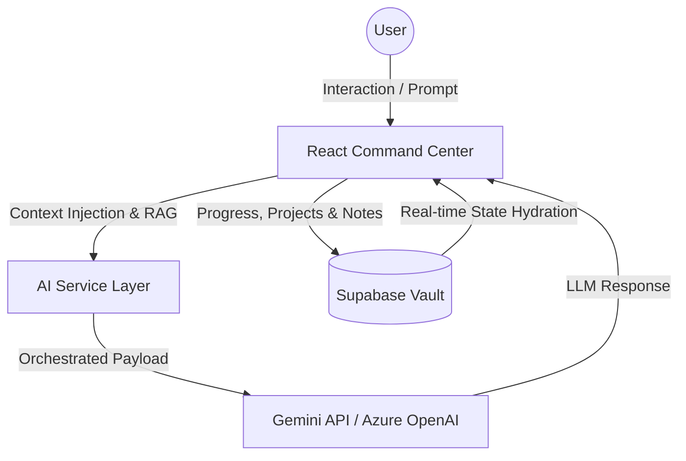
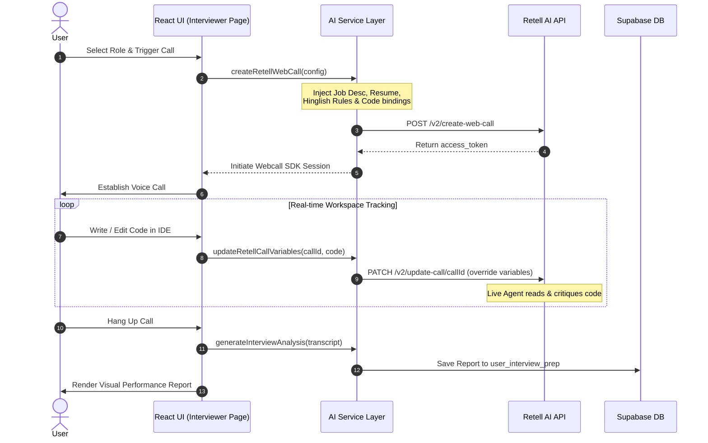

# 🌌 GenAI Academy: The Tactical Intelligence Hub

<p align="center">
  
  
  
  
  
</p>

---

## 📖 Executive Summary & Concept

**GenAI Academy** is a comprehensive, high-fidelity tactical command center designed specifically for AI/ML and GenAI engineers. Moving beyond the limitations of standard static educational resources, it provides a unified platform that integrates **interactive deep-tech system simulators**, a **fully functional in-browser Python IDE**, **AI-driven Socratic study suites**, and **real-time voice coaching agents**. 

The entire experience is wrapped in a premium **Obsidian/Neon** visual design, engineered to offer immersive dashboards, low-latency code execution, and dynamic flow mapping.

## ApiBeam browser-session provider

Atlas can optionally use a connected ChatGPT, Claude, or z.ai browser session through ApiBeam. See the [ApiBeam setup and extension guide](api_beam/README.md) for installation and usage instructions.

---

## 🖼️ System Architecture & Data Flows

### 1. Core Intelligence & Sync Loop
The platform operates as a self-reinforcing, low-latency intelligence loop. Every user interaction hydrates client-side state, feeds context into Google Gemini, and synchronizes real-time progress into the Supabase database.


```mermaid
graph TD
    User((User)) -->|Interaction / Prompt| UI[React Command Center]
    UI -->|Context Injection & RAG| AI[AI Service Layer]
    AI -->|Orchestrated Payload| GEM[Gemini API / Azure OpenAI]
    GEM -->|LLM Response| UI
    UI -->|Progress, Projects & Notes| DB[(Supabase Vault)]
    DB -->|Real-time State Hydration| UI
```

### 2. Telephony & Code-Monitoring Voice Coach Sequence
When practicing interviews, the application establishes a dual-channel session. Voice stream data is handled by Retell AI, while the current workspace code is parsed client-side and dynamically synchronized to update variables on the active voice call session.


```mermaid
sequenceDiagram
    autonumber
    actor User
    participant UI as React UI (Interviewer Page)
    participant AIS as AI Service Layer
    participant Retell as Retell AI API
    participant DB as Supabase DB

    User->>UI: Select Role & Trigger Call
    UI->>AIS: createRetellWebCall(config)
    Note over AIS: Inject Job Desc, Resume,<br/>Hinglish Rules & Code bindings
    AIS->>Retell: POST /v2/create-web-call
    Retell-->>AIS: Return access_token
    AIS-->>UI: Initiate Webcall SDK Session
    UI->>User: Establish Voice Call
    loop Real-time Workspace Tracking
        User->>UI: Write / Edit Code in IDE
        UI->>AIS: updateRetellCallVariables(callId, code)
        AIS->>Retell: PATCH /v2/update-call/callId (override variables)
        Note over Retell: Live Agent reads & critiques code
    end
    User->>UI: Hang Up Call
    UI->>AIS: generateInterviewAnalysis(transcript)
    AIS->>DB: Save Report to user_interview_prep
    UI->>User: Render Visual Performance Report
```

### 3. Dual-Engine Code Execution Flow
The coding workspace supports both in-browser client execution using Pyodide (Wasm-based compilation) and remote cloud execution using a jdoodle proxy endpoint `/api/execute` supporting multiple runtimes.

```mermaid
graph LR
    Editor[Monaco Editor] -->|Execute Code| Dispatcher{Execution Mode}
    Dispatcher -->|Local Mode| Pyodide[Pyodide WebAssembly Sandbox]
    Dispatcher -->|Cloud Mode| Proxy[/api/execute Proxy API]
    Proxy -->|Run Code| JDoodle[JDoodle Core Engine]
    Pyodide -->|Stdout/Stderr| Terminal[Console Outputs]
    JDoodle -->|Stdout/Stderr| Terminal
    Editor -->|Commit File| Versioning[(file_versions DB)]
```

---

## 🛠️ Simulation Engines & Algorithms

### 1. System Design Simulator Engine
The Canvas Simulator uses a flow-propagation engine that evaluates system designs created with ReactFlow. It estimates latency, throughput, and capacity constraints based on a graph topology of connected elements (API Gateways, Load Balancers, Web Servers, Databases, Caches).

#### Formulas & Rules
- **Effective QPS Limit**:
  \[
  QPS_{effective} = QPS_{max} \times Replicas
  \]
  If $QPS_{effective}$ is 0, utilization is treated as 0. Otherwise, node utilization is calculated as:
  \[
  Utilization\ (u) = \frac{QPS_{incoming}}{QPS_{effective}}
  \]

- **Latency Computation**: Base latency is affected by overload conditions when node utilization exceeds a threshold.
  \[
  L(u) = 
  \begin{cases} 
  L_{base} & \text{if } u \leq T \\
  L_{base} \times (1 + \max(0, u - T) \times M) & \text{if } u > T 
  \end{cases}
  \]
  Where:
  - $T$ (Latency Spike Threshold) = `0.8` (80% utilization)
  - $M$ (Latency Spike Multiplier) = `3.0`
  - $L_{base}$ = Node base latency (milliseconds)

- **Flow Propagation & Splitters**: 
  - Subsystems like `load-balancer` or `api-gateway` split incoming requests evenly among outgoing branches:
    \[
    QPS_{child} = \frac{QPS_{output}}{\text{number of children}}
    \]
  - Other components (such as standard servers or queues) duplicate the QPS downstream to all connected targets.

- **System Design Scoring Rules**:
  Designs are graded out of 100 points based on five key metrics:
  1. **Scalability (20 pts)**: Load Balancer (+8 pts), Cache (+6 pts), Message Queue/Pub-Sub (+6 pts).
  2. **Reliability (20 pts)**: Monitoring (+8 pts), Circuit Breaker (+6 pts), Authentication Service (+6 pts).
  3. **Performance (20 pts)**: Penalized based on the fraction of nodes that are bottlenecked:
     \[
     Score = 20 \times \left(1 - \frac{\text{Bottlenecked Nodes}}{\text{Total Nodes}}\right)
     \]
  4. **Component Coverage (20 pts)**: Match ratio against the problem's reference solution nodes.
  5. **Connections (20 pts)**: Percentage of nodes that are not isolated (have at least one input or output edge).

---

## 🧭 Navigational Directory & Component Mapping

Below is the directory of all React files and custom UI modules supporting the SPA:

### 1. Dashboards & Core Navigators
*   **[IntelligenceHub.jsx](file:///Users/nandanpatkar/Downloads/genai-roadmap-src/src/components/IntelligenceHub.jsx)** (54 KB)  
    The primary central dashboard. Synthesizes user metrics, weekly study targets, active coding projects, saved resources, and community chat activities.
*   **[Sidebar.jsx](file:///Users/nandanpatkar/Downloads/genai-roadmap-src/src/components/Sidebar.jsx)** (37.3 KB)  
    The control navigation bar. Implements smooth Framer Motion transitions, responsive responsive collapse layouts, custom neon badges, and active tab triggers.
*   **[GlobalSearchPalette.jsx](file:///Users/nandanpatkar/Downloads/genai-roadmap-src/src/components/GlobalSearchPalette.jsx)** (9.5 KB)  
    Spotlight search utility (`Cmd+K`). Dynamically compiles references, files, subtopics, and configurations to let users search modules instantly.
*   **[AppWalkthrough.jsx](file:///Users/nandanpatkar/Downloads/genai-roadmap-src/src/components/AppWalkthrough.jsx)** (11.8 KB)  
    A guided tour overlay utilizing visual step highlights to onboard engineers and explain interactive tools.

### 2. Deep-Tech Simulators
*   **[SystemDesignSimulator.jsx](file:///Users/nandanpatkar/Downloads/genai-roadmap-src/src/pages/simulator/SystemDesignSimulator.jsx)** (76.9 KB)  
    Interactive system playground built with ReactFlow. Supports replica scaling, latency simulations, bottleneck identification, capacity alerts, and structural scoring.
*   **[AWSSystemDesignSimulator.jsx](file:///Users/nandanpatkar/Downloads/genai-roadmap-src/src/pages/simulator/AWSSystemDesignSimulator.jsx)** (2.9 KB)  
    Wrapper component hosting the Angular-based AWS System Design simulator pointing to `public/aws-simulator`.
*   **[SystemDesignPlayground.jsx](file:///Users/nandanpatkar/Downloads/genai-roadmap-src/src/pages/playground/SystemDesignPlayground.jsx)** (59.9 KB)  
    Vibrant architect canvas leveraging **NLFlowGenerator** for converting natural language descriptions into node-graph templates using Gemini AI.
*   **[DSAAnimator.jsx](file:///Users/nandanpatkar/Downloads/genai-roadmap-src/src/components/DSAAnimator.jsx)** (24 KB)  
    Algorithm tracer embedding problem structures from `dsaanimator.com` inside styled panels, complete with code tricks and boundary guidelines.
*   **[K8sGames.jsx](file:///Users/nandanpatkar/Downloads/genai-roadmap-src/src/components/K8sGames.jsx)** (3.7 KB)  
    Hosts the Kubernetes Deployment Game (iframe wrapper pointing to `public/k8sgames`) for practicing scheduling, replicasets, and node sizing.
*   **[GitVisualizer.jsx](file:///Users/nandanpatkar/Downloads/genai-roadmap-src/src/components/GitVisualizer.jsx)** (0.5 KB)  
    Visualizer wrapper for exploring branch topology, rebase logs, merge trees, and git histories.
*   **[KnowledgeGalaxy.jsx](file:///Users/nandanpatkar/Downloads/genai-roadmap-src/src/components/KnowledgeGalaxy.jsx)** (17.2 KB)  
    Dynamic interactive canvas layout mapping computer science subjects in a 3D-like cluster view.

### 3. Integrated Coding Environments (IDEs)
*   **[ProjectIDE.jsx](file:///Users/nandanpatkar/Downloads/genai-roadmap-src/src/components/Projects/ProjectIDE.jsx)** (11.5 KB)  
    Primary workspace controller for cloud projects. Connects the file tree, Monaco Editor workspace, Git commits dashboard, and execution logs.
*   **[FileExplorer.jsx](file:///Users/nandanpatkar/Downloads/genai-roadmap-src/src/components/Projects/FileExplorer.jsx)** (16.8 KB)  
    Handles directory navigation, file creation/renames, deletion hooks, and state-refresh triggers in the cloud workspace.
*   **[EditorPane.jsx](file:///Users/nandanpatkar/Downloads/genai-roadmap-src/src/components/Projects/EditorPane.jsx)** (26 KB)  
    Hosts the main Monaco Editor. Implements autosave triggers, custom syntax highlight configurations, file tab switching, and version rollbacks.
*   **[AIAssistant.jsx](file:///Users/nandanpatkar/Downloads/genai-roadmap-src/src/components/Projects/AIAssistant.jsx)** (20.7 KB)  
    Sidebar chatbot integrated into the IDE. Reads open file contexts to offer inline debugs, refactoring tips, and unit test generation.
*   **[GitPanel.jsx](file:///Users/nandanpatkar/Downloads/genai-roadmap-src/src/components/Projects/GitPanel.jsx)** (13.3 KB)  
    Handles client-to-GitHub commits. Tracks unstaged files, prompts commit inputs, and calls push APIs.
*   **[PythonIDE.jsx](file:///Users/nandanpatkar/Downloads/genai-roadmap-src/src/components/PythonIDE.jsx)** (30.2 KB)  
    Local-first playground with an output console, saving snippet directories directly to the browser's LocalStorage.

### 4. Socratic Study Suites
*   **[AIStudyContent.jsx](file:///Users/nandanpatkar/Downloads/genai-roadmap-src/src/components/AIStudyContent.jsx)** (19 KB)  
    Hosts the suite of study utilities. Includes mindmap expanders, flashcard decks, and quiz apps.
*   **[AITutorPanel.jsx](file:///Users/nandanpatkar/Downloads/genai-roadmap-src/src/components/AITutorPanel.jsx)** (10 KB)  
    A floating tutor sidebar that reads current topic contexts and code files to guide users Socratically.
*   **[InterviewerPage.jsx](file:///Users/nandanpatkar/Downloads/genai-roadmap-src/src/pages/interviewer/InterviewerPage.jsx)** (47.2 KB)  
    Telephonic interview coach. Configures seniorities, parses uploaded resumes, initiates WebCall sockets with Retell AI, and displays analysis reports.
*   **[QuizApp.jsx](file:///Users/nandanpatkar/Downloads/genai-roadmap-src/src/components/QuizApp.jsx)** (45.1 KB)  
    Hosts generative assessments. Records statistics (wrong count, correct count, time limits) and sends them to the database.
*   **[MindMap.jsx](file:///Users/nandanpatkar/Downloads/genai-roadmap-src/src/components/MindMap.jsx)** (37.4 KB)  
    Generates detailed, expandable node graphs based on curriculum topics using customized canvas layouts.
*   **[ModuleNotes.jsx](file:///Users/nandanpatkar/Downloads/genai-roadmap-src/src/components/ModuleNotes.jsx)** (12.3 KB)  
    Note-taking canvas integrated with the TipTap editor, supporting autosave to the cloud.

### 5. Utilities & Management
*   **[AdminManagement.jsx](file:///Users/nandanpatkar/Downloads/genai-roadmap-src/src/components/AdminManagement.jsx)** (36.4 KB)  
    Admin Panel dashboard for global configuration overrides, key vaults updates, log reviews, and user account status moderation.
*   **[FocusPulse.jsx](file:///Users/nandanpatkar/Downloads/genai-roadmap-src/src/components/FocusPulse.jsx)** (44.3 KB)  
    Timer suite offering Pomodoro tracking, target achievements, and ambient white-noise playlists.
*   **[ProgressTracker.jsx](file:///Users/nandanpatkar/Downloads/genai-roadmap-src/src/components/ProgressTracker.jsx)** (21.6 KB)  
    Aggregates metrics from `quiz_metrics` and curriculum maps to render study statistics and trends.

---

## 🗄️ Database Schemas & Data Model

All schemas are hosted under the `public` schema in the Supabase PostgreSQL database. Row Level Security (RLS) is enabled across tables to ensure data isolation.

### 1. Projects Table (`projects`)
Tracks active cloud coding workspaces created by users.
*   **Permissions (RLS)**: Read/Write allowed only if `auth.uid() = user_id`.

| Column | Data Type | Nullable | Default | Description |
| :--- | :--- | :---: | :--- | :--- |
| `id` | `uuid` | NO | `gen_random_uuid()` | Unique Project ID (PRIMARY KEY). |
| `user_id` | `uuid` | NO | - | Owner ID (Foreign key references `auth.users`). |
| `name` | `text` | NO | - | Name of the project directory. |
| `description` | `text` | YES | `''` | Summary of project intent. |
| `github_repo` | `text` | YES | `''` | Linked GitHub repository name. |
| `github_branch` | `text` | YES | `'main'` | Active deployment/commit branch. |
| `github_owner` | `text` | YES | `''` | Owner username of linked GitHub repository. |
| `default_language`| `text` | YES | `'python'` | Language syntax selection. |
| `env_vars` | `jsonb` | YES | `'{}'` | Sandboxed key-value environment variables. |
| `build_command` | `text` | YES | `''` | Script or command to run on project build. |
| `run_command` | `text` | YES | `''` | Script or command to execute application. |
| `file_count` | `integer` | YES | `0` | Number of files stored within workspace. |
| `created_at` | `timestamptz` | YES | `now()` | Date created. |
| `updated_at` | `timestamptz` | YES | `now()` | Last modified date. |

### 2. Project Files Table (`project_files`)
Holds individual file nodes and folder trees inside projects.
*   **Permissions (RLS)**: Allowed if project owner is `auth.uid()`.
*   **Indexes**: Unique combination index `idx_project_files_project` on `(project_id, file_path)`.

| Column | Data Type | Nullable | Default | Description |
| :--- | :--- | :---: | :--- | :--- |
| `id` | `uuid` | NO | `gen_random_uuid()` | File ID (PRIMARY KEY). |
| `project_id` | `uuid` | NO | - | Parent Project (Foreign key references `projects.id`). |
| `parent_folder` | `text` | YES | `'/'` | Target parent path hierarchy. |
| `filename` | `text` | NO | - | Basename of the file (e.g. `main.py`). |
| `file_path` | `text` | NO | - | Absolute path within project workspace. |
| `file_type` | `text` | YES | `'file'` | File type classification (`'file'` or `'folder'`). |
| `content` | `text` | YES | `''` | Raw content string. |
| `storage_path` | `text` | YES | `''` | Optional path mapping in physical storage buckets. |
| `language` | `text` | YES | `'plaintext'` | Code syntax (for editor highlight). |
| `version` | `integer` | YES | `1` | Incrementing tracker for edits. |
| `created_at` | `timestamptz` | YES | `now()` | Date created. |
| `updated_at` | `timestamptz` | YES | `now()` | Last modified date. |

### 3. File Versions Table (`file_versions`)
Stores historical snapshots of individual files.
*   **Permissions (RLS)**: User must own the parent project containing the target file.

| Column | Data Type | Nullable | Default | Description |
| :--- | :--- | :---: | :--- | :--- |
| `id` | `uuid` | NO | `gen_random_uuid()` | Version ID (PRIMARY KEY). |
| `file_id` | `uuid` | NO | - | Parent File (Foreign key references `project_files.id`). |
| `content` | `text` | YES | - | File contents snapshot. |
| `version` | `integer` | NO | - | Version sequence number. |
| `created_at` | `timestamptz` | YES | `now()` | Snapshot creation timestamp. |

### 4. Curriculum Progress Table (`user_curriculum`)
*   **Permissions (RLS)**: Accessible only if matching `auth.uid()`. Global configs are open.

| Column | Data Type | Nullable | Default | Description |
| :--- | :--- | :---: | :--- | :--- |
| `id` | `uuid` | NO | - | User ID / Global Config ID (PRIMARY KEY). |
| `paths_data` | `jsonb` | NO | - | Large configuration containing paths, logs, and locked profiles. |
| `updated_at` | `timestamptz` | NO | - | Last modified date. |

### 5. Quiz Performance Metrics Table (`quiz_metrics`)
Tracks student performance on generated assessments.

| Column | Data Type | Nullable | Default | Description |
| :--- | :--- | :---: | :--- | :--- |
| `id` | `uuid` | NO | `gen_random_uuid()` | Metric ID (PRIMARY KEY). |
| `user_id` | `uuid` | YES | - | Reference to `auth.users`. |
| `quiz_name` | `text` | NO | - | Title of curriculum module quizzed. |
| `score_percentage`| `integer` | NO | - | Percentage score achieved. |
| `correct_count` | `integer` | NO | - | Number of correct selections. |
| `wrong_count` | `integer` | NO | - | Number of incorrect selections. |
| `total_questions` | `integer` | NO | - | Total questions in assessment. |
| `created_at` | `timestamptz` | YES | `now()` | Date completed. |

### 6. Module Notes Table (`module_notes`)
Autosaved student notebooks.

| Column | Data Type | Nullable | Default | Description |
| :--- | :--- | :---: | :--- | :--- |
| `id` | `uuid` | NO | `gen_random_uuid()` | Note ID (PRIMARY KEY). |
| `user_id` | `uuid` | NO | - | Reference to `auth.users`. |
| `module_id` | `text` | NO | - | Target curriculum module code. |
| `content` | `jsonb` | YES | - | Document content structure. |
| `updated_at` | `timestamptz` | YES | `now()` | Last saved timestamp. |

---

## 🔑 Operational Environment Config

Create a `.env.local` file in the root directory and configure the variables:

```bash
# 🤖 Google Gemini AI Gateway
VITE_GEMINI_API_KEY=your_gemini_api_key_here

# ⚡ Supabase Vault Credentials
VITE_SUPABASE_URL=https://your_project_id.supabase.co
VITE_SUPABASE_ANON_KEY=your_anonymous_key_here

# 🗣️ Voice Coach - Retell Telephony API
VITE_RETELL_API_KEY=your_retell_key_here
VITE_RETELL_AGENT_ID=agent_f530318a167b9cdefc0de07c24        # English Technical Lead
VITE_RETELL_HINDI_AGENT_ID=agent_c3b45b8978dd12ea7400171947  # Romanized Hinglish Lead
```

---

## ⚙️ Setup & Deployment Sequence

### 1. Standard Machine Setup (macOS / Linux)

```bash
# Clone the repository
git clone <repository-url> && cd genai-roadmap-src

# Hydrate the project dependencies
npm install

# Copy env template and customize keys
cp .env.example .env.local

# Build references and start development server
npm run build:reference
npm run dev
```

### 2. Windows-Specific Setup

> [!TIP]
> Do not copy the `node_modules` directory across machines. Always run fresh installs on Windows environments.

1. Install **Node.js (LTS version)** from [nodejs.org](https://nodejs.org/).
2. Copy the project folder to a localized directory.
3. Open `CMD` or `PowerShell` in the project root, then run:
   ```cmd
   npm install
   npm run build:reference
   npm run dev
   ```
4. Access the interface via `http://localhost:5173/` in your browser.

---

## 🌐 Deploying Supabase Edge Functions (Web Search)

To leverage the real-time search RAG features, the Tavily API must be stored as an encrypted secret, and the `web-search` edge function deployed to Supabase.

1. **Set Tavily API key inside Supabase Secrets**:
   ```bash
   supabase secrets set TAVILY_API_KEY=your_tavily_api_key
   ```
2. **Deploy the Search Edge Function**:
   ```bash
   supabase functions deploy web-search
   ```
3. **Verify Deployment**:
   Run the following query within your client browser developer tools to verify search results:
   ```javascript
   const { data, error } = await supabase.functions.invoke('web-search', {
     body: { query: 'latest RAG techniques 2026' }
   });
   console.log(data, error);
   ```

---

## 🎨 System Design Tokens (Obsidian/Neon)

To maintain consistent styling, use the pre-defined CSS tokens in your code layouts:

```css
:root {
  --bg: #000000;            /* Pitch Black primary surface */
  --bg2: #12151c;           /* Glassmorphic Secondary Slate */
  --bg3: #1a1e2a;           /* Accent Card Surface */
  
  --accent1: #00ff88;       /* Emerald Pulse (Interactive glow) */
  --accent2: #0088ff;       /* Cobalt Flow (Informational highlights) */
  --border: #252a38;        /* Slate Border */
  
  --font: 'Outfit', sans-serif;
  --font-mono: 'DM Mono', monospace;
}
```

---

## 📄 License
This command center is privately developed and maintained. Under strict review for engineering excellence.
