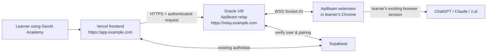

# ApiBeam on Oracle Cloud while GenAI Academy stays on Vercel

This is the production implementation plan for using ApiBeam as an **optional** Atlas provider. It deliberately leaves the existing GenAI Academy frontend on Vercel. Oracle Cloud runs only the always-on ApiBeam relay that connects the Vercel browser app to a user's installed browser extension.

This plan assumes that the Oracle Free Tier account has already been claimed. It does **not** require moving the Vercel project, Supabase project, or primary frontend domain to Oracle.

> **Important boundary:** the extension has to run in the learner's own Chrome browser because it uses that browser's signed-in ChatGPT/Claude/z.ai session. An Oracle server cannot install an extension into visitors' browsers or impersonate their individual sessions. The correct production experience is a one-time Chrome Web Store installation, then automatic extension updates and automatic reconnection.

## 1. Target architecture



### Responsibilities

| Component | Hosting | Responsibility |
|---|---|---|
| GenAI Academy React/Vite app | Vercel | Atlas UI, provider selection, context toggle, user onboarding, authenticated API calls |
| Existing data and authentication | Supabase | Current user identity plus ApiBeam pairing/connection records |
| ApiBeam NestJS server | One Oracle Always Free VM | HTTP-to-WebSocket relay, authorization, pairing, request queue, timeout and connection state |
| Reverse proxy | Same Oracle VM | HTTPS certificates, WebSocket forwarding and public port exposure |
| ApiBeam Chrome extension | User's Chrome profile | Connects to the relay and operates the provider website in that user's signed-in browser |
| Chrome Web Store | Google | One-time installation and automatic release updates |

### Production URLs to choose before starting

Replace these values consistently throughout this document.

| Placeholder | Example | Purpose |
|---|---|---|
| `APP_ORIGIN` | `https://app.example.com` | Vercel production URL or custom Vercel domain |
| `RELAY_HOST` | `relay.example.com` | New DNS subdomain pointing to Oracle |
| `RELAY_ORIGIN` | `https://relay.example.com` | Public URL configured in extension and frontend |
| `OCI_PUBLIC_IP` | `129.80.10.20` | Reserved public IPv4 address for the Oracle VM |
| `EXTENSION_ID` | `abcdefghijklmnopabcdefghijklmnop` | Stable Chrome Web Store extension ID after publishing |
| `OCI_USER` | `ubuntu` | Login user when using Ubuntu on OCI |

Use a subdomain such as `relay.example.com`, not a path such as `app.example.com/apibeam`. A separate origin makes DNS, TLS, CORS, WebSockets, deploys, and incident isolation much simpler.

## 2. What stays on Vercel and what moves to Oracle

### Keep on Vercel

- The entire existing GenAI Academy frontend.
- The Atlas chatbot interface and its ApiBeam provider option.
- The context toggle, which remains off by default.
- Existing non-ApiBeam providers such as direct OpenAI, Azure, Gemini, and so on.
- Your current Vercel deployment workflow, domain, environment variables, and previews.

### Deploy to Oracle

- Only `api_beam/apibeam-api-server-main` and its production support files.
- Caddy (or Nginx) as an HTTPS reverse proxy.
- Optional health monitoring and log rotation.

### Do not use in production

- `http://localhost:3000` outside local development.
- The Vite `/apibeam-hosted` proxy outside local development. It exists only to work around the upstream hosted relay's CORS behavior while developing locally.
- `https://apibeam.bitsmall.in` as a dependency for your public product.
- The current unauthenticated room-ID endpoint as a multi-user public API.

## 3. Security decision: harden the relay before public release

The bundled server works for a personal/local test but is not yet a safe multi-user public relay. Its current implementation has these relevant characteristics:

- `src/main.ts` can restrict HTTP CORS with `ALLOWED_ORIGINS`.
- `src/socket/socket.gateway.ts` currently uses `cors: { origin: '*' }` for Socket.IO, which must be removed for production.
- A random `roomId` is enough to join a room and submit requests; it is effectively a bearer secret but is neither authenticated nor rotated.
- `/connect/:roomId` trusts the caller-provided Socket.IO ID.
- Pending responses are indexed only by room, so two simultaneous prompts for one room can overwrite each other.
- There is no per-user rate limit, pairing expiry, audit log, or revocation mechanism.

Do not publish the Vercel URL or Web Store install link broadly until the following implementation work is complete.

### Required backend changes

| Priority | Change | Concrete implementation target |
|---|---|---|
| P0 | Verify users | Require the Supabase access JWT (`Authorization: Bearer <token>`) on every frontend chat request. Validate it using the Supabase server-side JWT verification/JWKS flow. |
| P0 | Secure the extension | Give every installed extension a device token during pairing. The extension sends this token in its Socket.IO authentication handshake; never accept a room name alone. |
| P0 | Pair safely | Replace the public `GET /connect/:roomId?socketId=...` flow with a short-lived, one-use pairing code and an authenticated connection endpoint. Expire pairing codes in 10 minutes. |
| P0 | Map user to connection | Store `user_id`, hashed device token, extension ID, provider, `connected_at`, and `last_seen_at` in Supabase. Only route a user’s prompt to that user’s active extension connection. |
| P0 | Fix concurrency | Generate a `requestId` per chat request. Store pending requests by `requestId`, send it to the extension, and require it in `clientResponse`. This permits safely handling multiple prompts. |
| P0 | Restrict origins | Apply the exact allowlist to both Nest HTTP CORS and `@WebSocketGateway` CORS: `APP_ORIGIN` and `chrome-extension://EXTENSION_ID`. No wildcard origins in production. |
| P0 | Enforce limits | Add a per-user request rate limit, maximum request body size, maximum concurrent requests per user, timeout, and response-size limits. Return JSON errors, not HTML, to API clients. |
| P1 | Revoke and recover | Add disconnect, unpair, reconnect, and token rotation endpoints. Show "Extension disconnected" in Atlas instead of waiting for a long 504. |
| P1 | Observe | Add structured logs with request ID and user ID (never prompt contents or tokens by default), `/healthz`, `/readyz`, and a connection-status endpoint. |

### Suggested API contract after hardening

The browser frontend should not send a room ID at all.

```text
POST https://relay.example.com/v1/chat/completions
Authorization: Bearer <Supabase access token>
Content-Type: application/json

{ "model": "gpt-4o", "messages": [...], "stream": false }
```

The relay obtains the user ID from the token, finds the active paired extension, and forwards an internal message such as:

```json
{
  "requestId": "uuid",
  "userId": "authenticated-user-id",
  "route": "v1/chat/completions",
  "body": { "model": "gpt-4o", "messages": [] }
}
```

The extension returns the same `requestId`. The relay returns the response only to the requesting authenticated user.

### Suggested Supabase schema

Create the tables through a migration and enable Row Level Security. The relay uses the service-role key only on Oracle; it must never be placed in the Vercel browser bundle or extension.

```sql
create table public.apibeam_devices (
  id uuid primary key default gen_random_uuid(),
  user_id uuid not null references auth.users(id) on delete cascade,
  extension_install_id uuid not null,
  token_hash text not null,
  provider text not null default 'chatgpt',
  display_name text,
  connected_at timestamptz,
  last_seen_at timestamptz,
  revoked_at timestamptz,
  created_at timestamptz not null default now(),
  unique (user_id, extension_install_id)
);

create table public.apibeam_pairing_codes (
  id uuid primary key default gen_random_uuid(),
  user_id uuid not null references auth.users(id) on delete cascade,
  code_hash text not null unique,
  expires_at timestamptz not null,
  consumed_at timestamptz,
  created_at timestamptz not null default now()
);
```

Use the relay to create, consume, and revoke rows. Browser users should not be given direct write privileges to the device table.

## 4. Oracle Free Tier plan and account setup

Oracle Always Free compute resources are available only in the tenancy’s home region. The Ampere A1 allowance is equivalent to up to 2 OCPUs and 12 GB RAM; capacity may be unavailable in a chosen availability domain. Confirm the current limits in Oracle’s [Always Free resources documentation](https://docs.oracle.com/en-us/iaas/Content/FreeTier/freetier_topic-Always_Free_Resources.htm?trk=public_post_comment-text) before creating the VM.

### 4.1 Account hardening

Do this first in the Oracle Cloud Console:

1. Sign in to Oracle Cloud and confirm the **home region** shown in the region selector.
2. Enable multi-factor authentication for the account that owns the tenancy.
3. Create a separate OCI user or group for day-to-day administration if the root/tenancy administrator is currently used for everything.
4. Add a budget alert so an email is sent if any non-free usage appears. Set a deliberately low threshold such as USD 1.
5. Record the tenancy name, home region, compartment name, and support email in your password manager or internal operations notes.
6. Do not enter payment-card data, Supabase service-role keys, ChatGPT credentials, or extension tokens into public issue trackers, chat screenshots, or Git.

### 4.2 Create an SSH key on your computer

On macOS/Linux, create a dedicated key for this server. Give the private-key file no broader access than your user.

```bash
ssh-keygen -t ed25519 -f ~/.ssh/genai-apibeam-oci -C "genai-apibeam-oci"
chmod 600 ~/.ssh/genai-apibeam-oci
```

Keep the private key private. Upload only the contents of `~/.ssh/genai-apibeam-oci.pub` to Oracle.

### 4.3 Create the virtual network

In Oracle Cloud Console:

1. Open **Networking → Virtual cloud networks**.
2. Select your application compartment.
3. Choose **Start VCN Wizard → Create VCN with Internet Connectivity**.
4. Name it `genai-apibeam-vcn` and accept a non-overlapping CIDR such as `10.0.0.0/16`.
5. Let the wizard create a public subnet, internet gateway, route table, and security list.
6. In the public subnet security list, add ingress rules:

| Source CIDR | Protocol | Port | Reason |
|---|---:|---:|---|
| Your fixed home/office IP `/32` | TCP | 22 | SSH administration. If your address changes frequently, update this rule; do not leave SSH open to the world long-term. |
| `0.0.0.0/0` | TCP | 80 | HTTP only for certificate issuance and redirect to HTTPS. |
| `0.0.0.0/0` | TCP | 443 | HTTPS and secure Socket.IO WebSockets. |

Do **not** add a public rule for port 3000. The Node relay is reached only through Caddy on the same VM.

### 4.4 Create the Oracle VM

1. Open **Compute → Instances → Create instance**.
2. Name it `genai-apibeam-relay-01`.
3. Select the VCN/public subnet above and enable **Assign a public IPv4 address**.
4. Use Ubuntu 24.04 LTS (or Oracle Linux 8/9 if you already administer Oracle Linux). The commands later in this document use Ubuntu.
5. For the shape, choose **VM.Standard.A1.Flex** where capacity is available. Start with **1 OCPU and 6 GB RAM**; increase only if operational metrics show a need. This sits within the Always Free A1 allowance.
6. Paste the SSH public key created above.
7. Create the instance and wait until its lifecycle state is **Running**.
8. Reserve/convert its public IP to a reserved public IP if the Console offers that option. This prevents an address change after stop/start operations.
9. Copy the public IP into the `OCI_PUBLIC_IP` value in the table above.

If A1 capacity is unavailable, retry a different availability domain, use an eligible E2 micro instance for a very small personal test, or try again later. Do not accidentally select a paid shape merely to bypass capacity constraints.

### 4.5 First SSH login and operating-system baseline

From your computer, connect using the public IP:

```bash
ssh -i ~/.ssh/genai-apibeam-oci ubuntu@OCI_PUBLIC_IP
```

On the VM, run the following baseline commands:

```bash
sudo apt-get update
sudo apt-get upgrade -y
sudo apt-get install -y ca-certificates curl git ufw fail2ban docker.io docker-compose-v2
sudo systemctl enable --now docker
sudo usermod -aG docker ubuntu
sudo ufw default deny incoming
sudo ufw default allow outgoing
sudo ufw allow 22/tcp
sudo ufw allow 80/tcp
sudo ufw allow 443/tcp
sudo ufw enable
```

Log out and back in after adding the Docker group, then validate:

```bash
docker --version
docker compose version
sudo ufw status verbose
```

The OCI security list and UFW must agree. OCI blocks unwanted traffic before it reaches the VM; UFW is defense in depth inside the VM.

## 5. DNS and HTTPS setup

### 5.1 Point the relay subdomain to Oracle

At the DNS provider that manages your domain, create:

```text
Type: A
Name: relay
Value: OCI_PUBLIC_IP
TTL: 300
```

Wait for this command to return the Oracle address before continuing:

```bash
dig +short relay.example.com
```

Do not proxy this DNS record through a service that does not explicitly support WebSocket forwarding. If using Cloudflare DNS, its proxy can support WebSockets, but start in DNS-only mode during initial certificate and Socket.IO testing to reduce variables.

### 5.2 TLS requirements

The production extension must use `https://relay.example.com`, which automatically gives Socket.IO `wss://relay.example.com`. Browsers should never use insecure `ws://` to a public relay.

Caddy is the recommended reverse proxy here because it automatically obtains and renews TLS certificates when ports 80/443 and DNS are correctly configured.

## 6. Prepare the relay code for deployment

The following items are planned files for the relay directory:

```text
api_beam/apibeam-api-server-main/
├── Dockerfile
├── compose.yaml
├── Caddyfile
├── .env.example
├── .env                         # server-only, never committed
└── src/
    ├── auth/                    # Supabase JWT and extension device auth
    ├── pairing/                 # short-lived pairing-code endpoints
    ├── socket/                  # authenticated gateway and request correlation
    └── health/                  # health/readiness endpoints
```

### 6.1 Required environment variables

Create `/opt/genai-apibeam/.env` on the VM with restrictive permissions. Do not create it in the Git checkout if the checkout could ever be copied or committed.

```dotenv
NODE_ENV=production
PORT=3000
APP_ORIGIN=https://app.example.com
RELAY_ORIGIN=https://relay.example.com
ALLOWED_ORIGINS=https://app.example.com,chrome-extension://EXTENSION_ID
SUPABASE_URL=https://YOUR_PROJECT.supabase.co
SUPABASE_SERVICE_ROLE_KEY=replace-with-server-only-secret
SUPABASE_JWT_ISSUER=https://YOUR_PROJECT.supabase.co/auth/v1
PAIRING_CODE_TTL_SECONDS=600
REQUEST_TIMEOUT_MS=60000
MAX_REQUESTS_PER_MINUTE=10
MAX_CONCURRENT_REQUESTS_PER_USER=1
LOG_LEVEL=info
```

Create the directory and lock down the secret file:

```bash
sudo mkdir -p /opt/genai-apibeam
sudo chown -R ubuntu:ubuntu /opt/genai-apibeam
cd /opt/genai-apibeam
umask 077
nano .env
chmod 600 .env
```

`SUPABASE_SERVICE_ROLE_KEY` bypasses Supabase Row Level Security. It belongs only on the relay VM. Never add it to Vercel variables prefixed with `VITE_`, frontend JavaScript, browser local storage, or the extension.

### 6.2 Dockerfile to add after relay hardening

Create `api_beam/apibeam-api-server-main/Dockerfile` with this production build pattern:

```dockerfile
FROM node:20-bookworm-slim AS build
WORKDIR /srv/app
COPY package.json yarn.lock ./
RUN corepack enable && yarn install --frozen-lockfile
COPY . .
RUN yarn build

FROM node:20-bookworm-slim
WORKDIR /srv/app
ENV NODE_ENV=production
COPY package.json yarn.lock ./
RUN corepack enable && yarn install --frozen-lockfile --production
COPY --from=build /srv/app/dist ./dist
EXPOSE 3000
CMD ["node", "dist/main"]
```

Add a `.dockerignore` that excludes at least `node_modules`, `dist`, `.git`, `.env`, coverage files, and OS metadata.

### 6.3 Compose file to add

Create `/opt/genai-apibeam/compose.yaml` (or keep it in a private deploy repository) with Caddy and the relay. The relay is intentionally bound to loopback only.

```yaml
services:
  relay:
    build:
      context: ./api_beam/apibeam-api-server-main
    env_file:
      - .env
    restart: unless-stopped
    expose:
      - "3000"
    ports:
      - "127.0.0.1:3000:3000"
    healthcheck:
      test: ["CMD", "node", "-e", "fetch('http://127.0.0.1:3000/healthz').then(r => process.exit(r.ok ? 0 : 1)).catch(() => process.exit(1))"]
      interval: 30s
      timeout: 5s
      retries: 3

  caddy:
    image: caddy:2-alpine
    restart: unless-stopped
    depends_on:
      relay:
        condition: service_healthy
    ports:
      - "80:80"
      - "443:443"
      - "443:443/udp"
    volumes:
      - ./Caddyfile:/etc/caddy/Caddyfile:ro
      - caddy_data:/data
      - caddy_config:/config

volumes:
  caddy_data:
  caddy_config:
```

The health check assumes you implement `GET /healthz` before deployment. Until then, remove the `healthcheck` and `depends_on.condition` lines for an internal-only proof of concept, but do not treat that as production-ready.

### 6.4 Caddy configuration to add

Create `/opt/genai-apibeam/Caddyfile`:

```caddyfile
relay.example.com {
    encode zstd gzip

    @health path /healthz /readyz
    reverse_proxy @health relay:3000

    reverse_proxy relay:3000 {
        flush_interval -1
    }

    log {
        output stdout
        format json
    }
}
```

Caddy’s `reverse_proxy` supports normal HTTP and WebSocket upgrade requests, including Socket.IO WebSockets. The `flush_interval -1` setting prevents proxy buffering from delaying streamed responses.

### 6.5 Correct CORS in both HTTP and WebSocket layers

After refactoring, create a single origin-list helper and use it in both files:

- `src/main.ts` — Nest HTTP CORS.
- `src/socket/socket.gateway.ts` — Socket.IO gateway CORS.

Production allowlist:

```text
https://app.example.com
chrome-extension://EXTENSION_ID
```

For a Vercel-only custom domain, add that exact custom domain. Do not use `https://*.vercel.app`: CORS does not accept wildcard subdomains in a secure origin allowlist. For Vercel preview deployments, use a separate staging relay or an explicit temporary preview origin only during testing.

## 7. Deploy the relay to the Oracle VM

### 7.1 Transfer code securely

Use a private Git repository or a deployment copy that excludes secrets and `node_modules`. On the VM:

```bash
cd /opt/genai-apibeam
git clone YOUR_PRIVATE_REPOSITORY_URL source
```

The intended final location is:

```text
/opt/genai-apibeam/
├── .env
├── Caddyfile
├── compose.yaml
└── source/
    └── api_beam/apibeam-api-server-main/
```

Adjust the compose build context to:

```yaml
context: ./source/api_beam/apibeam-api-server-main
```

If you use a repository deploy key, generate a separate read-only key on the VM and register only the public half with the repository host. Never copy your personal workstation private key to the server.

### 7.2 First deployment

From `/opt/genai-apibeam` on the Oracle VM:

```bash
docker compose build --no-cache
docker compose up -d
docker compose ps
docker compose logs --tail=100 caddy
docker compose logs --tail=100 relay
```

Expected results:

- Caddy obtains a certificate for `relay.example.com`.
- Caddy listens publicly on ports 80 and 443.
- The relay is only visible at `127.0.0.1:3000` inside the VM.
- `docker compose ps` shows services running/healthy.

Validate from your own computer:

```bash
curl -i https://relay.example.com/healthz
curl -I https://relay.example.com
```

`/healthz` should return a small JSON success response without exposing internal configuration, provider details, room names, or secrets.

### 7.3 Confirm Socket.IO connectivity

The extension’s connection must be to the HTTPS relay base URL, not to `ws://localhost:3000`.

Open the browser developer console after configuring the extension. A successful connection will use a URL similar to:

```text
wss://relay.example.com/socket.io/?EIO=4&transport=websocket
```

If the browser shows `ERR_CONNECTION_REFUSED`, check in this order:

1. DNS resolves `relay.example.com` to `OCI_PUBLIC_IP`.
2. Oracle security-list ingress permits TCP 443.
3. UFW permits TCP 443.
4. Caddy is running and has a valid certificate.
5. The Caddy upstream name/port reaches the `relay` container.
6. The extension’s configured URL has no `localhost`, port `3000`, or malformed path.

## 8. Configure the Vercel frontend

The Vercel deployment itself remains your existing deployment. Only its ApiBeam configuration changes.

### 8.1 Environment variable

Add an environment variable in Vercel for Production (and a different one for Preview only if you have a separate staging relay):

```dotenv
VITE_APIBEAM_RELAY_ORIGIN=https://relay.example.com
```

Never put a device token, room ID, Supabase service-role key, or extension secret in a `VITE_*` variable. Vite embeds all `VITE_*` values into public browser JavaScript.

### 8.2 Frontend code changes after the relay is hardened

Update the ApiBeam client in `src/services/aiService.js`:

1. Use the fixed `VITE_APIBEAM_RELAY_ORIGIN` rather than a user-supplied `/app/<roomId>` URL.
2. Get the current Supabase session access token.
3. Send it in `Authorization: Bearer <access-token>`.
4. Post to `/v1/chat/completions`.
5. Display a clear "Connect your extension" state if the relay reports no active device.
6. Preserve the current context toggle behavior: when off, send no roadmap, workspace, current-view path, node, module, topic, greeting history, notes, maps, or recent activity.

The frontend must never attempt to connect directly to the extension. All coordination occurs through the authenticated Oracle relay.

### 8.3 Vercel CORS implications

Because the browser makes a cross-origin request from Vercel to Oracle, the relay response must include:

```text
Access-Control-Allow-Origin: https://app.example.com
Access-Control-Allow-Headers: Authorization, Content-Type
Access-Control-Allow-Methods: POST, OPTIONS
```

When an `Authorization` header is added, browsers perform an OPTIONS preflight. Confirm the backend responds successfully to it. This is why CORS must be configured in both the HTTP app and the Socket.IO gateway.

## 9. Configure and distribute the Chrome extension

### 9.1 Production extension configuration

Before building the production extension:

1. Change the default relay base URL in `api_beam/apibeam-main/src/pages/background/index.ts` from `http://localhost:3000/` to `https://relay.example.com/`, or inject it at build time from a production environment variable.
2. Keep an editable setting only for developer/test builds. In the public build, either remove arbitrary relay overrides or validate that the override is HTTPS and on an allowlisted domain.
3. Change extension connection logic to send the device token during the Socket.IO handshake.
4. Implement the pairing screen: obtain a short code from the website, exchange it once with the relay, then store the resulting device token in `chrome.storage.local`.
5. On browser startup, reconnect automatically and report connected/disconnected status to the relay.
6. Do not store ChatGPT passwords, Supabase service-role keys, Vercel secrets, or raw user access tokens in the extension.

### 9.2 Chrome Web Store strategy

Publish the extension as **Unlisted** first:

1. Create a Chrome Web Store developer account.
2. Build the Chrome extension release package from `api_beam/apibeam-main`.
3. Upload it to the Chrome Web Store dashboard with a clear privacy policy and a description that explains the extension communicates with `relay.example.com` and uses the user’s selected provider tab.
4. Choose **Unlisted** while testing. Users with the install link can install it, but it is not discoverable in search.
5. After review, add the Chrome Web Store install URL to the Atlas ApiBeam onboarding screen.
6. Record the assigned `EXTENSION_ID`; it must be added to the Oracle relay origin allowlist.
7. For updates, increment the extension version, upload a new package to the same listing, and publish. Chrome updates existing installations automatically.

Chrome requires user consent for normal personal-browser installation. Self-hosted automatic installation or force-install is only appropriate for organization-managed browsers using enterprise policies. Read Chrome’s [extension installation guidance](https://developer.chrome.com/docs/extensions/how-to/distribute/install-extensions) and [distribution options](https://developer.chrome.com/docs/extensions/how-to/distribute) before choosing a release method.

### 9.3 User onboarding flow to build in Atlas

Create this exact user-visible sequence:

1. User selects **ApiBeam** in Atlas.
2. If no paired device exists, show **Install extension** linking to the unlisted Chrome Web Store listing.
3. After installation, show **Open extension and pair**.
4. The website calls the authenticated relay to create a 10-minute pairing code.
5. The user enters the code in the extension, or the extension opens a safe pairing page under `APP_ORIGIN`.
6. The extension receives only a device token, connects to the relay, and displays **Connected**.
7. Atlas enables sending. If a provider tab is not signed in, show a specific instruction to sign in within the extension’s browser profile.
8. Offer **Disconnect this device** and **Forget device** controls, which revoke the device token server-side.

The extension install happens once. Pairing happens once per browser profile/device, with a reconnect automatically attempted on later browser sessions.

## 10. Testing plan

Run every test in a staging environment or with an unlisted beta extension before making the feature available to general users.

### 10.1 Infrastructure tests

- [ ] `dig relay.example.com` returns the Oracle reserved public IP.
- [ ] HTTPS certificate is valid in an incognito browser.
- [ ] Only ports 80/443 are publicly reachable; port 3000 is not.
- [ ] `GET /healthz` returns 200.
- [ ] `docker compose restart` restores the relay and Caddy automatically.
- [ ] Oracle VM reboot restores services automatically.
- [ ] Caddy certificate renewal logs are clean.

### 10.2 Browser and CORS tests

- [ ] The Vercel production domain successfully completes an OPTIONS preflight and `POST /v1/chat/completions`.
- [ ] An unrelated origin is rejected by HTTP CORS.
- [ ] An unrelated origin is rejected by Socket.IO CORS.
- [ ] An extension with an invalid device token cannot join a room.
- [ ] A browser without the extension receives a short, actionable "extension not connected" error.
- [ ] A signed-out provider tab receives a short, actionable "sign in to provider" error.
- [ ] No console request uses `localhost`, `apibeam.bitsmall.in`, insecure `http`, or insecure `ws` in production.

### 10.3 Authorization and isolation tests

- [ ] User A cannot send a request through User B’s extension connection.
- [ ] User A cannot read User B’s device status, pairing code, or logs.
- [ ] A consumed pairing code cannot be reused.
- [ ] An expired pairing code is rejected.
- [ ] Revoking a device token immediately disconnects/blocks that device.
- [ ] Two simultaneous requests from one user are either correctly correlated by `requestId` or explicitly queued/rejected.
- [ ] Rate limits return a predictable JSON `429` response.

### 10.4 Functional chat tests

- [ ] ApiBeam normal Markdown replies render in Atlas.
- [ ] ApiBeam OpenAI-compatible JSON replies render in Atlas.
- [ ] A request timeout reports disconnected/provider-not-ready status without a misleading generic error.
- [ ] Full workspace context is **off by default** in a new chat.
- [ ] With context off, requests omit roadmap summaries, notes, maps, recent activity, path, node, module, topic, and the prior Atlas greeting.
- [ ] With context on, the intended limited project context is sent only after the user deliberately enables it.

## 11. Operational runbook

### Daily/weekly checks

```bash
cd /opt/genai-apibeam
docker compose ps
docker compose logs --since=24h relay
docker compose logs --since=24h caddy
df -h
free -h
```

Investigate repeated 401, 403, 429, 502, 504, certificate, or WebSocket disconnect entries. Do not log full prompts/responses by default: they may contain learner data.

### Deploy an approved relay update

```bash
cd /opt/genai-apibeam/source
git fetch --all --prune
git pull --ff-only
cd /opt/genai-apibeam
docker compose build
docker compose up -d
docker compose ps
docker compose logs --tail=100 relay
```

Before production updates, build and test the same commit locally or on a staging relay. Tag known-good release commits so you can return to a known version quickly.

### Backup and recovery

- Keep the infrastructure configuration (`compose.yaml`, `Caddyfile`, `.env.example`, migration files) in a private Git repository.
- Back up only the configuration necessary to recreate the VM and Supabase migration history. Never put the actual `.env` or private keys in Git.
- Supabase holds device/pairing metadata; use its normal database backup/export capabilities as appropriate for your plan.
- Document the current Oracle compartment, instance name, public IP, relay DNS record, and extension listing ID in a private operations document.

### Rollback

If a relay deploy breaks production:

1. Disable ApiBeam in the Vercel UI/config or show it as temporarily unavailable.
2. Roll the relay source back to the last tested Git tag/commit.
3. Rebuild and restart the Docker services.
4. Test `/healthz`, one extension connection, and one authenticated prompt.
5. Re-enable the provider only after the checks pass.

If the browser extension release breaks provider automation, publish a corrected extension update through the same Chrome Web Store listing. Do not distribute a different unpacked build to public users as an emergency workaround unless they are internal testers.

## 12. Costs, capacity, and limits

- Use an Always Free eligible shape only. Check the Oracle Console cost summary after creation and before accepting any shape change.
- Socket.IO needs a persistent process; do not try to move this relay to a serverless Vercel function.
- A single small A1 VM is appropriate for personal use and a small beta after rate limits and connection controls are in place. Measure CPU, RAM, open sockets, error rate, and timeout rate before expanding.
- The VM relays requests but does not provide model inference. The cost/availability and terms of the provider session used by each learner remain separate concerns.
- Provider web interfaces can change at any time. Keep official API integrations as your supported default and label ApiBeam as optional/experimental until it has been thoroughly maintained.

## 13. Completion checklist

### Before Oracle deployment

- [ ] Choose `APP_ORIGIN`, `RELAY_HOST`, and a DNS provider.
- [ ] Implement authentication, pairing, device tokens, request IDs, and rate limits.
- [ ] Implement `/healthz` and `/readyz`.
- [ ] Replace wildcard Socket.IO CORS.
- [ ] Add Dockerfile, `.dockerignore`, compose file, Caddyfile, and `.env.example`.
- [ ] Create and apply Supabase migration with RLS.

### Oracle setup

- [ ] Enable OCI MFA and budget alert.
- [ ] Create VCN/public subnet/security rules.
- [ ] Create always-free eligible VM and reserve public IP.
- [ ] Restrict SSH, configure UFW, install Docker, and confirm Docker starts on boot.
- [ ] Create relay DNS A record and wait for propagation.
- [ ] Deploy containers and confirm certificate/health checks.

### Vercel and extension

- [ ] Add the relay origin to Vercel production environment configuration.
- [ ] Change the frontend to use authenticated relay endpoints rather than raw room URLs.
- [ ] Build a production extension pointing to `RELAY_ORIGIN`.
- [ ] Publish it as an unlisted Chrome Web Store extension.
- [ ] Add `chrome-extension://EXTENSION_ID` to both relay CORS implementations.
- [ ] Add install/pair/status/disconnect UX to Atlas.

### Release

- [ ] Complete the infrastructure, CORS, isolation, and functional tests above.
- [ ] Test with at least two separate user accounts and two browser profiles.
- [ ] Verify context remains off by default.
- [ ] Write a short privacy disclosure and support/troubleshooting page for end users.
- [ ] Roll out first to a small beta group.

## 14. Useful official references

- [Oracle Always Free resources](https://docs.oracle.com/en-us/iaas/Content/FreeTier/freetier_topic-Always_Free_Resources.htm?trk=public_post_comment-text)
- [Oracle Free Tier overview](https://docs.oracle.com/en-us/iaas/Content/FreeTier/freetier.htm?Highlight=always+free)
- [Chrome extension installation and enterprise policies](https://developer.chrome.com/docs/extensions/how-to/distribute/install-extensions)
- [Chrome extension distribution options](https://developer.chrome.com/docs/extensions/how-to/distribute)
- [Chrome Web Store distribution settings](https://developer.chrome.com/docs/webstore/cws-dashboard-distribution?authuser=2&hl=en)
