# Okta Three-Tier Security Demo: User + Agent Runtime + Gateway + MCP Server

## Overview

Modern AI agent systems require secure, multi-tier authentication when orchestrating tool calls across
service boundaries. This tutorial demonstrates a complete three-tier Okta OAuth2 architecture on
Amazon Bedrock AgentCore, where each tier independently validates inbound JWTs and fetches its own
scoped token for downstream calls.

The core challenge addressed is per-tier token isolation with an external identity provider (Okta)
instead of IAM. Organizations using Okta need to enforce least-privilege scoping at every hop,
propagate end-user identity (email, group membership) through the entire chain for RBAC-based
access control, and exchange tokens at each tier boundary so no single token grants access to
multiple services.

This solution enables secure act-on-behalf patterns where each hop gets a separate scoped token,
end-to-end security header propagation via the Interceptor Lambda's `_meta` injection, group-based
RBAC enforcement at the MCP Server layer, clear audit trails through `_security_context` in every
tool response, and clean token isolation where no token is ever forwarded downstream.

```
User (Okta JWT) → Agent Runtime → AgentCore Gateway → MCP Server
     agent:invoke    gateway:invoke    mcp:invoke
```

### Tutorial Details

| Information          | Details                                                              |
|:---------------------|:---------------------------------------------------------------------|
| Tutorial type        | Interactive                                                          |
| AgentCore components | AgentCore Gateway, AgentCore Runtime (MCP Server + Agent Runtime)     |
| Gateway Target type  | MCP                                                                  |
| Inbound Auth         | Okta OAuth2 (Authorization Code for User, Client Credentials for services) |
| Outbound Auth        | Okta OAuth2 (Client Credentials) via Interceptor Lambda              |
| Tutorial components  | MCP Server, Gateway, Interceptor Lambda, Agent Runtime               |
| Tutorial vertical    | Real Estate                                                          |
| Example complexity   | Advanced                                                             |
| SDK used             | boto3, mcp, bedrock-agentcore-starter-toolkit                        |

### Tutorial Architecture

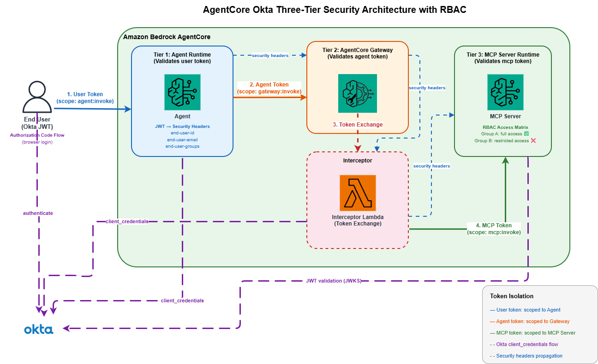

---

The architecture demonstrates:

1. **User**: Initiates requests with Okta JWT (scope: `agent:invoke`)
2. **Agent Runtime**: Validates user token, fetches its own token (scope: `gateway:invoke`), forwards security headers to Gateway
3. **AgentCore Gateway**: Validates agent token, routes requests through Interceptor Lambda
4. **Interceptor Lambda**: Exchanges agent token for MCP token (scope: `mcp:invoke`), injects security headers into JSON-RPC body `_meta`
5. **MCP Server**: Validates MCP token, extracts security context from `_meta`, executes tools with caller identity

This notebook creates:
- MCP Server with ASGI security header middleware, RBAC enforcement, and 3 real estate tools
- AgentCore Gateway with Okta OAuth2 Credential Provider and Interceptor Lambda
- Agent Runtime that proxies tool calls through the Gateway with security header forwarding
- End-to-end tests verifying token isolation, security header propagation, and RBAC (Alice vs Bob)
- All resources with timestamp for multiple runs

### Token Isolation

| Token | Scope | Issued To | Used For |
|-------|-------|-----------|----------|
| User Token | `agent:invoke` | End user | Call Agent Runtime |
| Agent Token | `gateway:invoke` | Agent Runtime | Call Gateway |
| MCP Token | `mcp:invoke` | Gateway Interceptor | Call MCP Server |

No token is ever forwarded downstream. Each tier fetches its own scoped token.

### Custom Security Headers (End-to-End)

Three custom headers propagate the end-user's identity from the caller all the way to the MCP Server:

| Header | Purpose |
|---|---|
| `X-Amzn-Bedrock-AgentCore-Runtime-Custom-End-User-Id` | Caller's user ID |
| `X-Amzn-Bedrock-AgentCore-Runtime-Custom-End-User-Email` | Caller's email (from JWT) |
| `X-Amzn-Bedrock-AgentCore-Runtime-Custom-End-User-Groups` | Caller's groups (from JWT) |

**Propagation flow:**
```
User (HTTP headers) → Agent Runtime → Gateway → Interceptor Lambda → MCP Server
```
The Interceptor Lambda extracts these headers from the inbound Gateway request and injects them
into the JSON-RPC body as `params._meta.security_context`. The MCP Server's ASGI middleware
reads from HTTP headers first, then falls back to the `_meta` body field, making the security
context available to every tool via `get_security_context()`.

Each tool response includes a `_security_context` field so callers can verify the headers arrived.

### RBAC (Role-Based Access Control)

The MCP Server enforces group-based access control using the caller's Okta group:

| Group | list_projects | property_details | budget_summary |
|---|:---:|:---:|:---:|
| `engineering-admin` | Yes | Yes | Yes |
| `finance-viewer` | Yes | No | Yes |
| (no group) | No | No | No |

Demo users: Alice (`engineering-admin`) has full access; Bob (`finance-viewer`) can list projects
and view budgets but cannot access property details.

### Steps
1. Install dependencies and configure environment
2. Deploy MCP Server to AgentCore Runtime (Tier 3)
3. Deploy AgentCore Gateway with Interceptor Lambda (Tier 2)
4. Deploy Agent Runtime (Tier 1)
5. Test the full chain: Alice (full access) vs Bob (limited access)
6. Verify token isolation
7. Cleanup all resources

### Prerequisites
- Python 3.10+
- AWS credentials configured with AgentCore permissions
- Okta developer account with 3 OAuth2 apps (Gateway, Agent, User) — see [Step-by-Step Okta Integration for Gateway Auth](https://github.com/awslabs/amazon-bedrock-agentcore-samples/blob/main/06-workshops/03-AgentCore-identity/08-IDP-examples/Okta/Step_by_Step_Okta_Integration_for_Gateway_Auth.ipynb) for detailed setup

---
## Okta Setup Reference

Below are screenshots showing the required Okta configuration for this demo.
For a detailed walkthrough, see the [Step-by-Step Okta Integration for Gateway Auth](https://github.com/awslabs/amazon-bedrock-agentcore-samples/blob/main/06-workshops/03-AgentCore-identity/08-IDP-examples/Okta/Step_by_Step_Okta_Integration_for_Gateway_Auth.ipynb) notebook.

### 1. Create Three OAuth2 Applications

Navigate to **Applications > Applications** and create three apps:
- **AgentCore Agent App** (API Service Integration) — used by the Agent Runtime to call the Gateway
- **AgentCore Gateway App** (API Service Integration) — used by the Interceptor Lambda to call the MCP Server
- **AgentCore User Web App** (Web Application) — used by the end-user to call the Agent Runtime. Add `http://localhost:8080/callback` as Sign-in redirect URI.

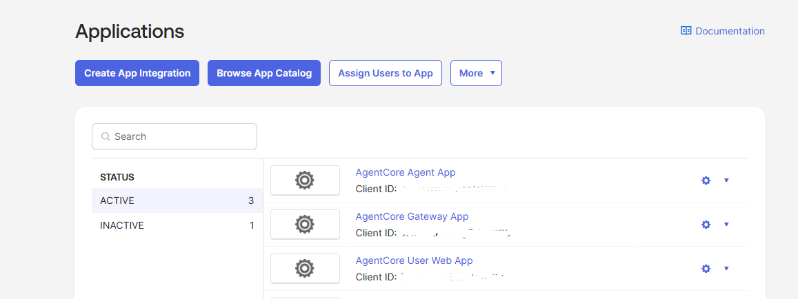

### 2. Create a Custom Authorization Server

Navigate to **Security > API** and create a custom authorization server (e.g. `AgentCore Demo`
with audience `agentcore-demo`).

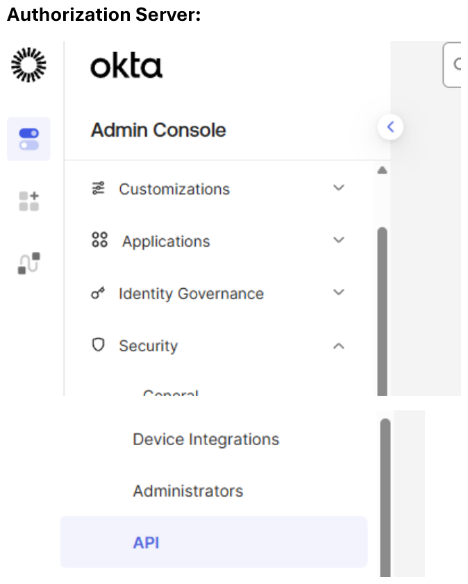

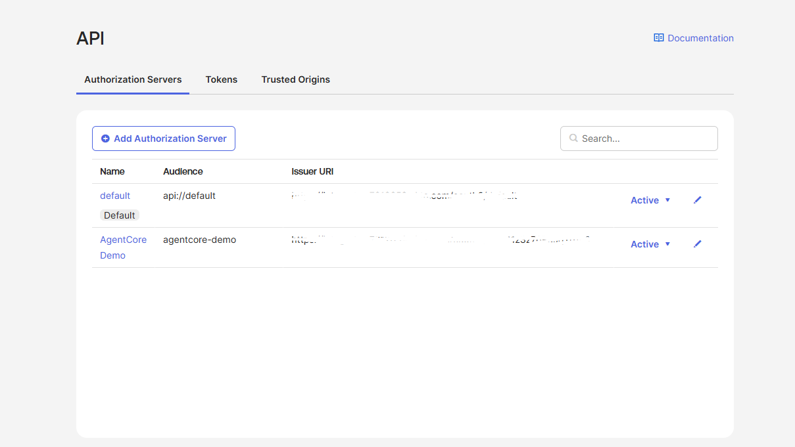

### 3. Define Scopes

On the authorization server, go to the **Scopes** tab and create three scopes:

| Scope | Purpose |
|---|---|
| `agent:invoke` | User calls Agent Runtime |
| `gateway:invoke` | Agent calls Gateway |
| `mcp:invoke` | Gateway calls MCP Server |
| `openid` | OIDC standard (required for Authorization Code) |
| `email` | Include user email in token claims |
| `groups` | Include user groups in token claims |

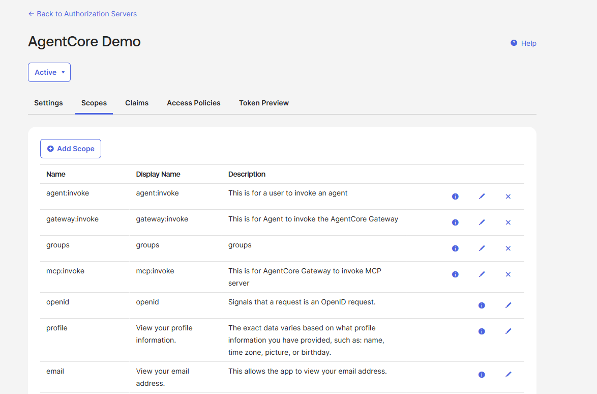

### 4. Add Claims and Access Policy

On the **Claims** tab, add the following claims (type: access, included: always):
- `client_id` — value: `app.clientId`
- `groups` — value: `groups` (matches regex `.*`)
- `email` — value: `user.email`

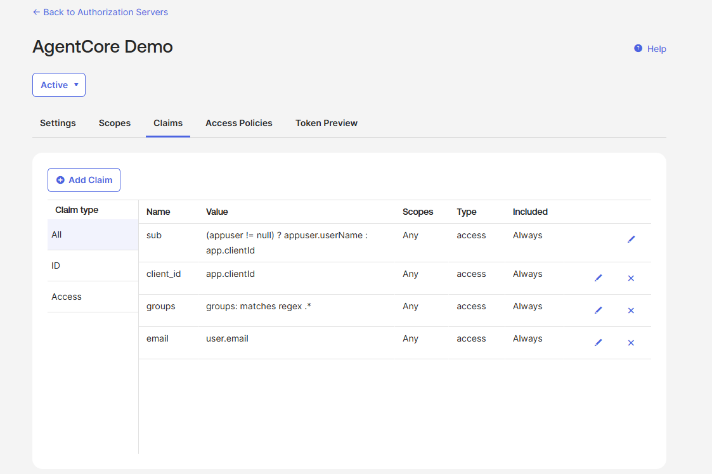

On the **Access Policies** tab, create a policy (e.g. `AgentCore Policy`) assigned to **All Clients**,
with three rules — one per application:

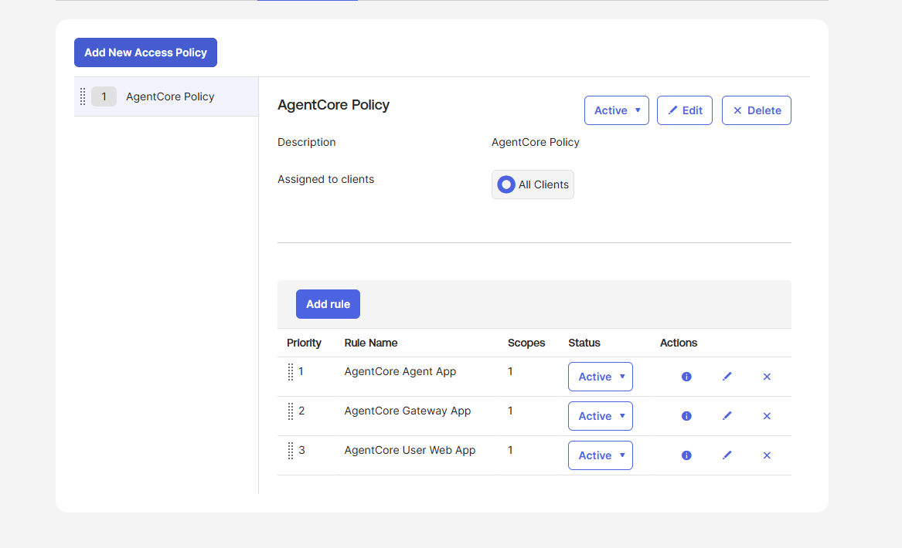

### 5. Access Policy Rules

Each rule restricts to specific grant types and scopes:

**AgentCore Agent App** — Client Credentials, scope: `gateway:invoke`

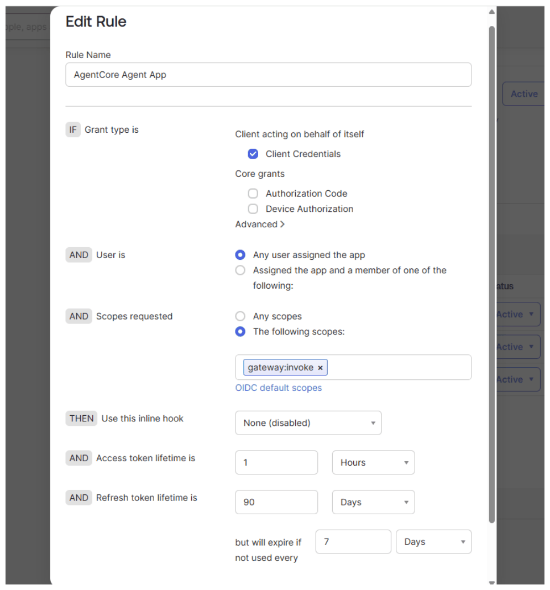

**AgentCore Gateway App** — Client Credentials, scope: `mcp:invoke`

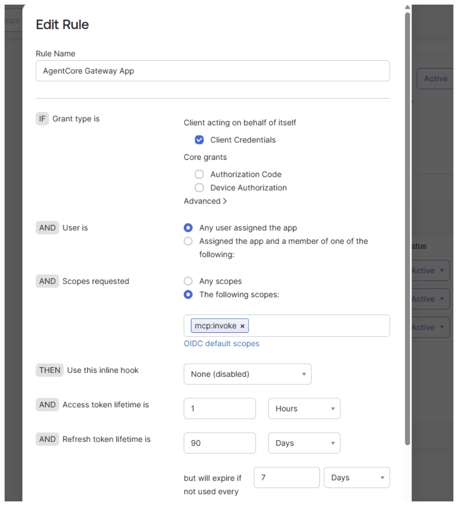

**AgentCore User Web App** — Authorization Code, scopes: `agent:invoke openid email groups`

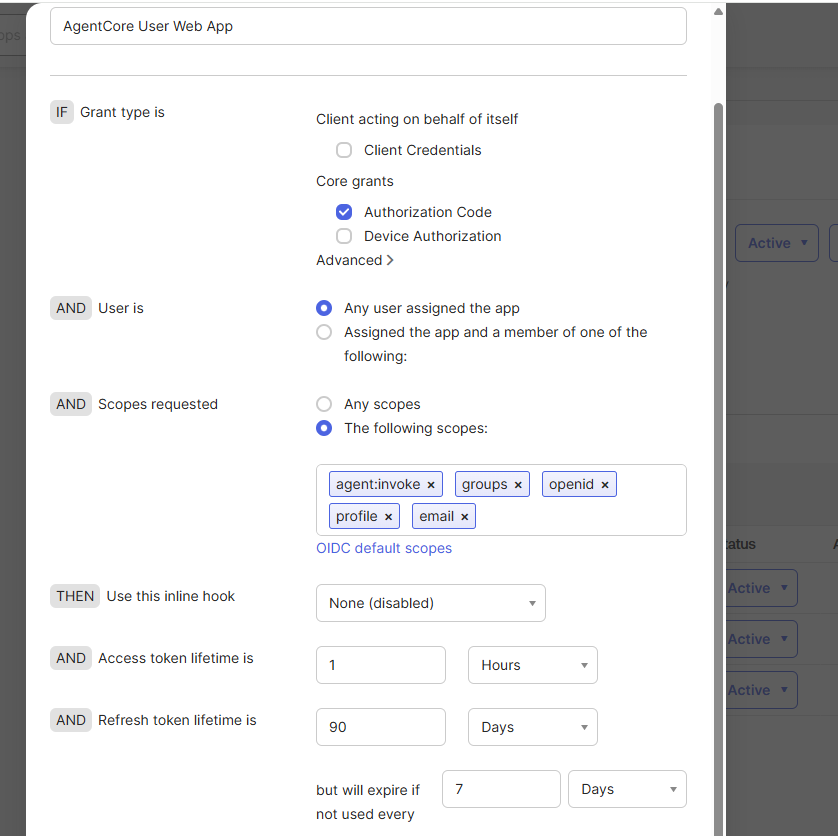

### 6. Create Users and Groups

Create two test users and assign them to role-based groups:
- `alice@example.com` → group `engineering-admin` (full access)
- `bob@example.com` → group `finance-viewer` (limited access)

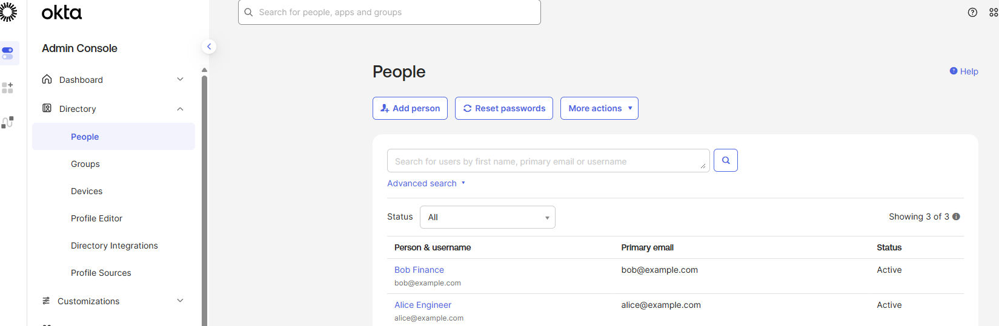
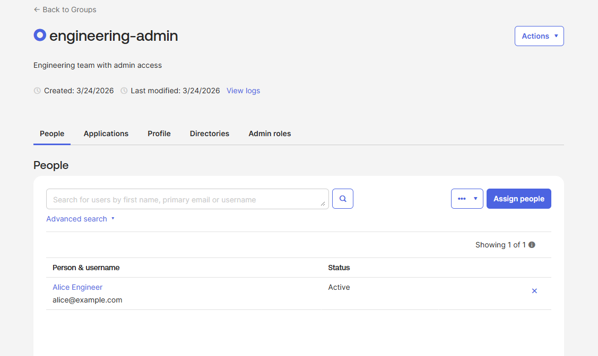
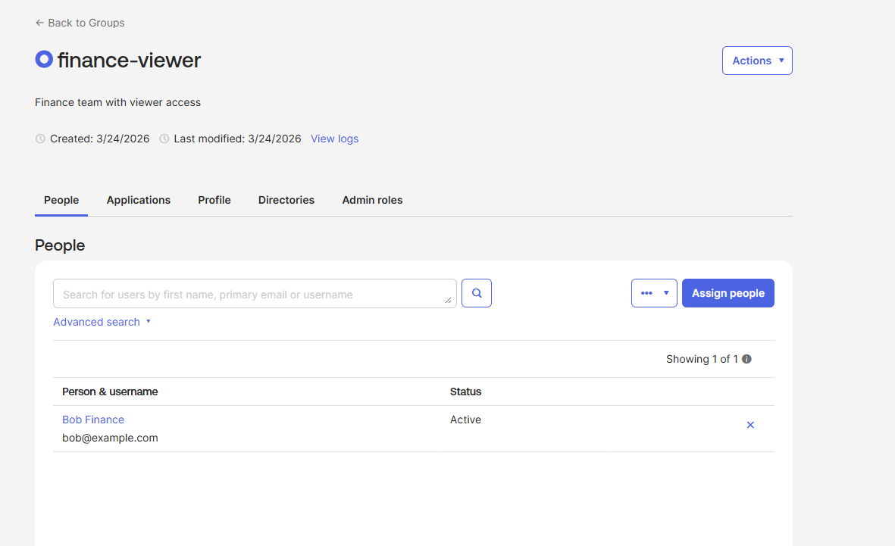

### 7. Authentication Policies (Test Users)

For demo/test users, configure password-only authentication (no MFA):

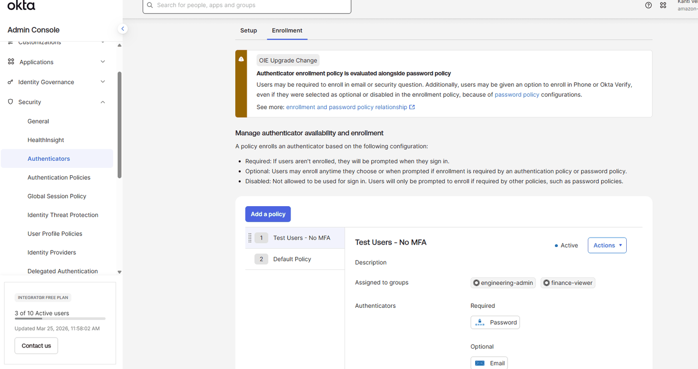
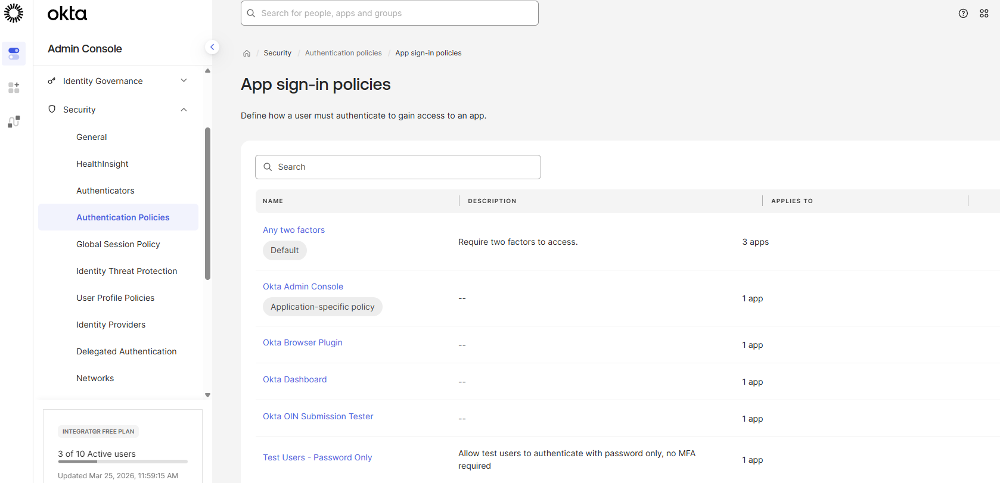
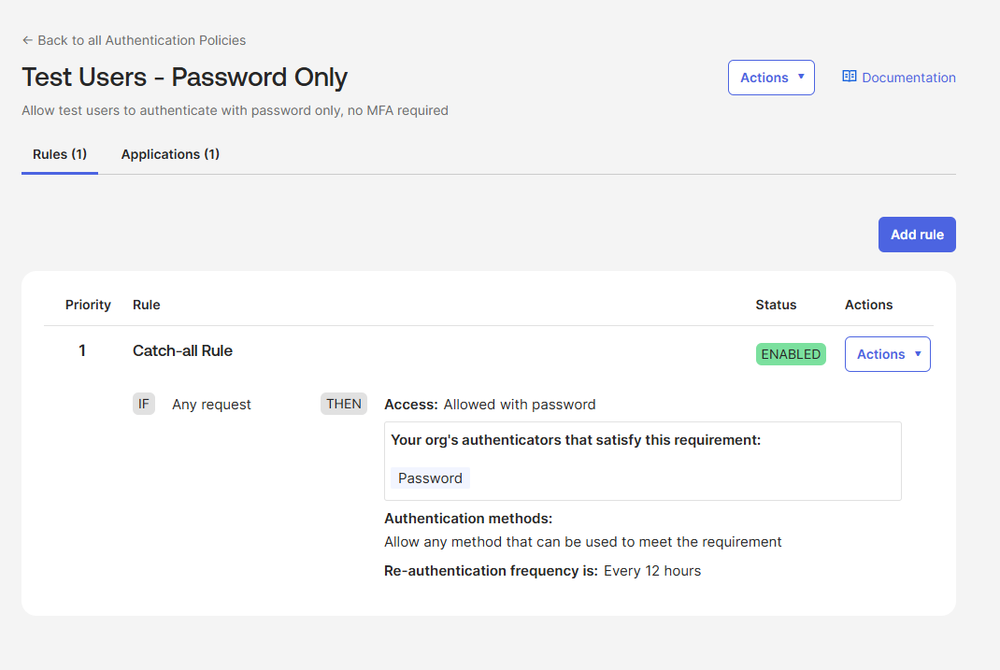

---
## Step 1: Install Dependencies and Configure Environment

```python
!pip install boto3 httpx mcp bedrock-agentcore bedrock-agentcore-starter-toolkit python-dotenv --quiet
```

```python
import boto3
import json
import os
import time
import base64
import zipfile
import io
import httpx
from datetime import datetime, timedelta
from pathlib import Path
from botocore.exceptions import ClientError
from dotenv import load_dotenv

# Load .env from project root (override=True ensures .env values take precedence)
load_dotenv(Path.cwd().parent / ".env", override=True)
load_dotenv(Path.cwd() / ".env", override=True)

# ── Okta Configuration ──────────────────────────────────────────────────────
OKTA_DOMAIN = os.environ["OKTA_DOMAIN"]
OKTA_AUTH_SERVER_ID = os.environ["OKTA_AUTH_SERVER_ID"]

# Gateway App (Gateway → MCP Server)
OKTA_GATEWAY_CLIENT_ID = os.environ["OKTA_GATEWAY_CLIENT_ID"]
OKTA_GATEWAY_CLIENT_SECRET = os.environ["OKTA_GATEWAY_CLIENT_SECRET"]
OKTA_MCP_SCOPE = os.environ["OKTA_MCP_SCOPE"]

# Agent App (Agent → Gateway)
OKTA_AGENT_CLIENT_ID = os.environ["OKTA_AGENT_CLIENT_ID"]
OKTA_AGENT_CLIENT_SECRET = os.environ["OKTA_AGENT_CLIENT_SECRET"]
OKTA_AGENT_SCOPE = os.environ["OKTA_AGENT_SCOPE"]

# User App (User → Agent)
OKTA_USER_CLIENT_ID = os.environ["OKTA_USER_CLIENT_ID"]
OKTA_USER_CLIENT_SECRET = os.environ["OKTA_USER_CLIENT_SECRET"]
OKTA_USER_SCOPE = os.environ["OKTA_USER_SCOPE"]

# Demo users for RBAC testing
OKTA_USER_ALICE_EMAIL = os.environ.get("OKTA_USER_ALICE_EMAIL", "alice@example.com")
OKTA_USER_BOB_EMAIL = os.environ.get("OKTA_USER_BOB_EMAIL", "bob@example.com")

# Derived URLs
OKTA_ISSUER = f"https://{OKTA_DOMAIN}/oauth2/{OKTA_AUTH_SERVER_ID}"
OKTA_DISCOVERY_URL = f"{OKTA_ISSUER}/.well-known/openid-configuration"
OKTA_TOKEN_ENDPOINT = f"{OKTA_ISSUER}/v1/token"

# ── AWS Setup ───────────────────────────────────────────────────────────────
boto_session = boto3.Session()
region = boto_session.region_name or os.environ.get("AWS_REGION", "us-east-1")
timestamp = datetime.now().strftime("%Y%m%d%H%M%S")

sts_client = boto3.client("sts", region_name=region)
account_id = sts_client.get_caller_identity()["Account"]

agentcore_client = boto3.client("bedrock-agentcore-control", region_name=region)
iam_client = boto3.client("iam", region_name=region)
lambda_client = boto3.client("lambda", region_name=region)
ssm_client = boto3.client("ssm", region_name=region)
secrets_client = boto3.client("secretsmanager", region_name=region)

print(f"AWS Region: {region} | Account: {account_id}")
print(f"Okta Issuer: {OKTA_ISSUER}")
print(f"Okta Discovery: {OKTA_DISCOVERY_URL}")
```

```python
# Helper: get Okta token
def get_okta_token(client_id: str, client_secret: str, scope: str) -> str:
    """Fetch OAuth2 client_credentials token from Okta"""
    credentials = base64.b64encode(f"{client_id}:{client_secret}".encode()).decode()
    response = httpx.post(
        OKTA_TOKEN_ENDPOINT,
        headers={
            "Authorization": f"Basic {credentials}",
            "Content-Type": "application/x-www-form-urlencoded",
        },
        data={"grant_type": "client_credentials", "scope": scope},
    )
    response.raise_for_status()
    token_data = response.json()
    print(f"  Token obtained (expires_in={token_data.get('expires_in')}s, scope={scope})")
    return token_data["access_token"]
```

```python
# Helper: get Okta user token via Authorization Code grant
# Spins up a temporary local HTTP server, opens browser for Okta login,
# captures the authorization code callback, and exchanges it for tokens.
import secrets
import hashlib
import webbrowser
import urllib.parse
from http.server import HTTPServer, BaseHTTPRequestHandler

_auth_result = {}


def get_user_token_authcode(login_hint: str = None) -> str:
    """Get Okta access token via Authorization Code + PKCE flow.
    Opens browser for interactive login. login_hint pre-fills the email field."""
    global _auth_result
    _auth_result = {}

    # PKCE: generate code_verifier and code_challenge
    code_verifier = secrets.token_urlsafe(64)[:128]
    code_challenge = base64.urlsafe_b64encode(hashlib.sha256(code_verifier.encode()).digest()).rstrip(b"=").decode()
    state = secrets.token_urlsafe(32)

    # Use fixed port so Okta redirect URI config is predictable
    port = 8080
    redirect_uri = f"http://localhost:{port}/callback"

    class CallbackHandler(BaseHTTPRequestHandler):
        def do_GET(self):
            global _auth_result
            params = urllib.parse.parse_qs(urllib.parse.urlparse(self.path).query)
            if "code" in params and params.get("state", [None])[0] == state:
                _auth_result = {"code": params["code"][0]}
                self.send_response(200)
                self.send_header("Content-Type", "text/html")
                self.end_headers()
                self.wfile.write(b"<h2>Login successful. You can close this tab.</h2>")
            elif "error" in params:
                _auth_result = {
                    "error": params["error"][0],
                    "desc": params.get("error_description", [""])[0],
                }
                self.send_response(400)
                self.send_header("Content-Type", "text/html")
                self.end_headers()
                self.wfile.write(f"<h2>Error: {_auth_result['error']}</h2>".encode())
            else:
                self.send_response(404)
                self.end_headers()

        def log_message(self, format, *args):
            pass  # suppress server logs

    server = HTTPServer(("127.0.0.1", port), CallbackHandler)
    server.timeout = 120

    # Build authorize URL
    params = {
        "response_type": "code",
        "client_id": OKTA_USER_CLIENT_ID,
        "redirect_uri": redirect_uri,
        "scope": OKTA_USER_SCOPE,
        "state": state,
        "code_challenge": code_challenge,
        "code_challenge_method": "S256",
        "prompt": "login",
    }
    if login_hint:
        params["login_hint"] = login_hint
    authorize_url = f"{OKTA_ISSUER}/v1/authorize?" + urllib.parse.urlencode(params)

    hint_msg = f" (login as {login_hint})" if login_hint else ""
    print(f"  Opening browser for Okta login{hint_msg}...")
    print(f"  Redirect URI: {redirect_uri}")
    webbrowser.open(authorize_url)

    # Wait for callback
    while not _auth_result:
        server.handle_request()
    server.server_close()

    if "error" in _auth_result:
        raise Exception(f"Okta auth error: {_auth_result['error']} - {_auth_result.get('desc', '')}")

    # Exchange code for tokens
    response = httpx.post(
        OKTA_TOKEN_ENDPOINT,
        headers={"Content-Type": "application/x-www-form-urlencoded"},
        data={
            "grant_type": "authorization_code",
            "code": _auth_result["code"],
            "redirect_uri": redirect_uri,
            "client_id": OKTA_USER_CLIENT_ID,
            "client_secret": OKTA_USER_CLIENT_SECRET,
            "code_verifier": code_verifier,
        },
    )
    if response.status_code != 200:
        print(f"  ERROR {response.status_code}: {response.text}")
        response.raise_for_status()
    token_data = response.json()
    user = login_hint or "user"
    print(f"  Token obtained for {user} (expires_in={token_data.get('expires_in')}s)")
    return token_data["access_token"]
```

```python
# Verify Okta discovery endpoint
print("Verifying Okta discovery endpoint...")
response = httpx.get(OKTA_DISCOVERY_URL)
if response.status_code == 200:
    discovery = response.json()
    print("✅ Discovery endpoint reachable")
    print(f"   issuer: {discovery.get('issuer')}")
    print(f"   jwks_uri: {discovery.get('jwks_uri')}")
else:
    raise Exception(f"❌ Discovery endpoint failed: {response.status_code}")
```

---
## Step 2: Deploy MCP Server to AgentCore Runtime (Tier 3)

The MCP Server is the innermost tier. It validates inbound JWTs with scope `mcp:invoke`.

### Write the MCP Server code

```python
%%writefile mcp_server.py
import json
import logging
from contextvars import ContextVar
from mcp.server.fastmcp import FastMCP

logger = logging.getLogger(__name__)
logging.basicConfig(level=logging.INFO)

# ── Security header capture via ASGI middleware ─────────────────────────────
HEADER_PREFIX = "x-amzn-bedrock-agentcore-runtime-custom-"
SECURITY_KEYS = ["end-user-id", "end-user-email", "end-user-groups"]
_security_ctx: ContextVar[dict] = ContextVar("security_ctx", default={})

# ── RBAC Rules ──────────────────────────────────────────────────────────────
# engineering-admin: full access to all projects, properties, and budgets
# finance-viewer: can list projects and view budgets, but no property details
RBAC = {
    "engineering-admin": {"list_projects": True, "property_details": True, "budget_summary": True},
    "finance-viewer":    {"list_projects": True, "property_details": False, "budget_summary": True},
}
DEFAULT_ACCESS = {"list_projects": False, "property_details": False, "budget_summary": False}


def check_access(security_ctx: dict, permission: str) -> bool:
    """Check if the caller has the required permission based on their group."""
    groups = security_ctx.get("end-user-groups", "")
    group_list = [g.strip() for g in groups.split(",")] if groups else []
    for group in group_list:
        access = RBAC.get(group, DEFAULT_ACCESS)
        if access.get(permission, False):
            return True
    return False


class SecurityHeaderMiddleware:
    """Raw ASGI middleware that captures security headers and body _meta into a ContextVar."""
    def __init__(self, app):
        self.app = app

    async def __call__(self, scope, receive, send):
        if scope["type"] == "http":
            # Try headers first
            headers = dict((k.decode(), v.decode()) for k, v in scope.get("headers", []))
            ctx = {}
            for key in SECURITY_KEYS:
                value = headers.get(f"{HEADER_PREFIX}{key}", "")
                if value:
                    ctx[key] = value
            # If no headers found, try reading _meta from JSON body
            if not ctx:
                # Read first message to get body
                first_msg = await receive()
                body_data = first_msg.get("body", b"")
                try:
                    parsed = json.loads(body_data)
                    meta = None
                    if isinstance(parsed, dict):
                        meta = parsed.get("params", {}).get("_meta", {}).get("security_context", {})
                    if meta:
                        ctx = meta
                        logger.info(f"Security context from body _meta: {json.dumps(ctx)}")
                except Exception:
                    pass
                # Replay the buffered message
                replayed = False
                orig_receive = receive
                async def replay_receive():
                    nonlocal replayed
                    if not replayed:
                        replayed = True
                        return first_msg
                    return await orig_receive()
                receive = replay_receive
            _security_ctx.set(ctx)
            if ctx:
                logger.info(f"Security context set: {json.dumps(ctx)}")
        await self.app(scope, receive, send)


mcp = FastMCP(host="0.0.0.0", stateless_http=True)


def get_security_context() -> dict:
    return _security_ctx.get()


@mcp.tool()
def get_property_details(property_id: str) -> str:
    """Get details for a real estate property by ID"""
    security_ctx = get_security_context()
    logger.info(f"get_property_details | caller={json.dumps(security_ctx)}")
    if not check_access(security_ctx, "property_details"):
        return json.dumps({"_security_context": security_ctx, "error": "Access denied: property details require engineering-admin group"}, indent=2)
    properties = {
        "PROP001": {"id": "PROP001", "address": "123 Main St, Austin TX", "type": "Commercial",
                    "status": "Under Construction", "completion_pct": 65, "contractor": "BuildCo Inc"},
        "PROP002": {"id": "PROP002", "address": "456 Oak Ave, Dallas TX", "type": "Residential",
                    "status": "Planning", "completion_pct": 0, "contractor": "TexasBuild LLC"},
    }
    result = properties.get(property_id, {"error": f"Property {property_id} not found"})
    return json.dumps({"_security_context": security_ctx, **result}, indent=2)


@mcp.tool()
def list_active_projects(status: str = "all") -> str:
    """List active real estate projects, optionally filtered by status"""
    security_ctx = get_security_context()
    logger.info(f"list_active_projects | caller={json.dumps(security_ctx)}")
    if not check_access(security_ctx, "list_projects"):
        return json.dumps({"_security_context": security_ctx, "error": "Access denied: no group with list_projects permission"}, indent=2)
    projects = [
        {"id": "PROJ001", "name": "Downtown Office Tower", "status": "Under Construction", "budget_usd": 5000000},
        {"id": "PROJ002", "name": "Riverside Condos", "status": "Planning", "budget_usd": 12000000},
        {"id": "PROJ003", "name": "Industrial Park Phase 2", "status": "Completed", "budget_usd": 3500000},
    ]
    filtered = projects if status == "all" else [p for p in projects if p["status"].lower() == status.lower()]
    return json.dumps({"_security_context": security_ctx, "projects": filtered}, indent=2)


@mcp.tool()
def get_project_budget_summary(project_id: str) -> str:
    """Get budget summary for a real estate project"""
    security_ctx = get_security_context()
    logger.info(f"get_project_budget_summary | caller={json.dumps(security_ctx)}")
    if not check_access(security_ctx, "budget_summary"):
        return json.dumps({"_security_context": security_ctx, "error": "Access denied: budget details require engineering-admin or finance-viewer group"}, indent=2)
    budgets = {
        "PROJ001": {"allocated": 5000000, "spent": 3250000, "remaining": 1750000, "variance_pct": -2.1},
        "PROJ002": {"allocated": 12000000, "spent": 450000, "remaining": 11550000, "variance_pct": 0.0},
        "PROJ003": {"allocated": 3500000, "spent": 3480000, "remaining": 20000, "variance_pct": -0.6},
    }
    result = budgets.get(project_id, {"error": f"Project {project_id} not found"})
    return json.dumps({"_security_context": security_ctx, **result}, indent=2)


if __name__ == "__main__":
    # Wrap the MCP ASGI app with security header middleware
    import uvicorn
    app = mcp.streamable_http_app()
    app = SecurityHeaderMiddleware(app)
    uvicorn.run(app, host="0.0.0.0", port=8000)
```

```python
%%writefile requirements.txt
mcp>=1.9.0
bedrock-agentcore>=0.1.0
bedrock-agentcore-starter-toolkit>=0.1.0
boto3>=1.38.0
httpx>=0.28.0
uvicorn>=0.30.0
```

### Configure and Launch MCP Server

```python
from bedrock_agentcore_starter_toolkit import Runtime

mcp_runtime = Runtime()

# Okta JWT authorizer: only Gateway tokens (scope: mcp:invoke) are accepted
mcp_auth_config = {
    "customJWTAuthorizer": {
        "discoveryUrl": OKTA_DISCOVERY_URL,
        "allowedClients": [OKTA_GATEWAY_CLIENT_ID],
    }
}

print("Configuring MCP Server with Okta JWT authorizer...")
mcp_runtime.configure(
    entrypoint="mcp_server.py",
    auto_create_execution_role=True,
    auto_create_ecr=True,
    requirements_file="requirements.txt",
    region=region,
    authorizer_configuration=mcp_auth_config,
    protocol="MCP",
    agent_name="realestate_mcp_server",
    request_header_configuration={
        "requestHeaderAllowlist": [
            "X-Amzn-Bedrock-AgentCore-Runtime-Custom-End-User-Id",
            "X-Amzn-Bedrock-AgentCore-Runtime-Custom-End-User-Email",
            "X-Amzn-Bedrock-AgentCore-Runtime-Custom-End-User-Groups",
        ]
    },
)
print("✅ Configuration complete")
```

```python
print("Launching MCP Server to AgentCore Runtime...")
print("This may take 5-10 minutes...")
mcp_launch = mcp_runtime.launch(auto_update_on_conflict=True)
print("✅ MCP Server deployed")
print(f"   ARN: {mcp_launch.agent_arn}")
print(f"   ID:  {mcp_launch.agent_id}")

# Store ARN in SSM for Gateway to reference
ssm_client.put_parameter(
    Name="/agentcore/realestate-mcp/runtime/agent_arn",
    Value=mcp_launch.agent_arn,
    Type="String",
    Description="MCP Server ARN",
    Overwrite=True,
)
print("✅ ARN stored in SSM: /agentcore/realestate-mcp/runtime/agent_arn")
```

### Test MCP Server directly with Okta token

```python
from mcp import ClientSession
from mcp.client.streamable_http import streamablehttp_client

# Get a Gateway-scoped token to call MCP Server directly
print("Getting Okta token (scope: mcp:invoke)...")
mcp_token = get_okta_token(OKTA_GATEWAY_CLIENT_ID, OKTA_GATEWAY_CLIENT_SECRET, OKTA_MCP_SCOPE)

encoded_arn = mcp_launch.agent_arn.replace(":", "%3A").replace("/", "%2F")
mcp_url = f"https://bedrock-agentcore.{region}.amazonaws.com/runtimes/{encoded_arn}/invocations?qualifier=DEFAULT"


async def test_mcp_direct():
    headers = {
        "authorization": f"Bearer {mcp_token}",
        "Content-Type": "application/json",
        "X-Amzn-Bedrock-AgentCore-Runtime-Custom-End-User-Id": "demo-user-001",
        "X-Amzn-Bedrock-AgentCore-Runtime-Custom-End-User-Email": "alice@example.com",
        "X-Amzn-Bedrock-AgentCore-Runtime-Custom-End-User-Groups": "engineering-admin",
    }
    async with streamablehttp_client(mcp_url, headers, timeout=timedelta(seconds=120), terminate_on_close=False) as (
        read_stream,
        write_stream,
        _,
    ):
        async with ClientSession(read_stream, write_stream) as session:
            await session.initialize()
            print("✅ MCP session initialized")
            tools = await session.list_tools()
            print(f"\n📋 Tools ({len(tools.tools)}):")
            for t in tools.tools:
                print(f"  - {t.name}: {t.description}")
            result = await session.call_tool("list_active_projects", {"status": "all"})
            print(f"\n🧪 list_active_projects: {result.content[0].text[:300]}")


await test_mcp_direct()
```

---
## Step 3: Deploy AgentCore Gateway with Interceptor Lambda (Tier 2)

The Gateway validates Agent tokens and uses an Interceptor Lambda to exchange them
for fresh MCP-scoped tokens. This enforces token isolation:
- Agent token NEVER reaches MCP Server
- Interceptor fetches a fresh `mcp:invoke` token per request

### Create OAuth2 Credential Provider

```python
# OAuth2 credential provider for Gateway → MCP Server tool sync
provider_name = "okta-mcp-server-credentials"

try:
    resp = agentcore_client.create_oauth2_credential_provider(
        name=provider_name,
        credentialProviderVendor="CustomOauth2",
        oauth2ProviderConfigInput={
            "customOauth2ProviderConfig": {
                "oauthDiscovery": {
                    "authorizationServerMetadata": {
                        "issuer": OKTA_ISSUER,
                        "tokenEndpoint": OKTA_TOKEN_ENDPOINT,
                        "authorizationEndpoint": OKTA_TOKEN_ENDPOINT,
                    }
                },
                "clientId": OKTA_GATEWAY_CLIENT_ID,
                "clientSecret": OKTA_GATEWAY_CLIENT_SECRET,
            }
        },
    )
    oauth_provider_arn = resp["credentialProviderArn"]
    print(f"✅ OAuth2 credential provider created: {oauth_provider_arn}")
except ClientError as e:
    if "already exists" in str(e):
        resp = agentcore_client.get_oauth2_credential_provider(name=provider_name)
        oauth_provider_arn = resp["credentialProviderArn"]
        print(f"✅ OAuth2 credential provider exists: {oauth_provider_arn}")
    else:
        raise
```

### Create Interceptor Lambda

The interceptor runs on every Gateway request. It fetches a fresh Okta token
scoped to the MCP Server and injects it as the outbound Authorization header.

```python
INTERCEPTOR_CODE = """
import json
import os
import base64
import logging
import urllib3

logger = logging.getLogger()
logger.setLevel(logging.INFO)
http = urllib3.PoolManager()

def get_okta_token() -> str:
    client_id = os.environ["OKTA_CLIENT_ID"]
    client_secret = os.environ["OKTA_CLIENT_SECRET"]
    token_endpoint = os.environ["OKTA_TOKEN_ENDPOINT"]
    scope = os.environ["OKTA_SCOPE"]
    credentials = base64.b64encode(f"{client_id}:{client_secret}".encode()).decode()
    response = http.request(
        "POST", token_endpoint,
        headers={"Authorization": f"Basic {credentials}", "Content-Type": "application/x-www-form-urlencoded"},
        body=f"grant_type=client_credentials&scope={scope}"
    )
    if response.status != 200:
        raise Exception(f"Failed to obtain Okta token: HTTP {response.status}")
    token_data = json.loads(response.data.decode("utf-8"))
    logger.info(f"Fresh Okta token obtained (expires_in={token_data.get(\"expires_in\")}s)")
    return token_data["access_token"]

def lambda_handler(event, context):
    logger.info(f"Interceptor event keys: {list(event.keys())}")
    mcp_data = event.get("mcp", {})
    gateway_request = mcp_data.get("gatewayRequest", {})
    body = gateway_request.get("body", {})
    inbound_headers = gateway_request.get("headers", {})
    mcp_token = get_okta_token()

    # Extract security headers from inbound request
    outbound_headers = {"Authorization": f"Bearer {mcp_token}", "Content-Type": "application/json"}
    security_ctx = {}
    INBOUND_PREFIX = "x-amzn-bedrock-agentcore-runtime-custom-"
    for key, value in inbound_headers.items():
        if key.lower().startswith(INBOUND_PREFIX):
            suffix = key.lower()[len(INBOUND_PREFIX):]
            security_ctx[suffix] = value
            # Also forward as headers (in case requestHeaderAllowlist works)
            outbound_headers[key] = value
    logger.info(f"Security context extracted: {json.dumps(security_ctx)}")

    # Inject security context into JSON-RPC body _meta field
    # This bypasses the requestHeaderAllowlist issue
    if security_ctx and isinstance(body, dict):
        if "params" not in body:
            body["params"] = {}
        if isinstance(body.get("params"), dict):
            body["params"]["_meta"] = {"security_context": security_ctx}
            logger.info(f"Injected security context into body._meta")

    return {
        "interceptorOutputVersion": "1.0",
        "mcp": {
            "transformedGatewayRequest": {
                "headers": outbound_headers,
                "body": body
            }
        }
    }
"""

# Create IAM role for Lambda
interceptor_role_name = f"GatewayInterceptorRole-{timestamp}"
role = iam_client.create_role(
    RoleName=interceptor_role_name,
    AssumeRolePolicyDocument=json.dumps(
        {
            "Version": "2012-10-17",
            "Statement": [
                {
                    "Effect": "Allow",
                    "Principal": {"Service": "lambda.amazonaws.com"},
                    "Action": "sts:AssumeRole",
                }
            ],
        }
    ),
)
iam_client.attach_role_policy(
    RoleName=interceptor_role_name,
    PolicyArn="arn:aws:iam::aws:policy/service-role/AWSLambdaBasicExecutionRole",
)
interceptor_role_arn = role["Role"]["Arn"]
print(f"✅ Lambda role: {interceptor_role_arn}")
print("Waiting 10s for IAM propagation...")
time.sleep(10)

# Package and create Lambda
zip_buffer = io.BytesIO()
with zipfile.ZipFile(zip_buffer, "w", zipfile.ZIP_DEFLATED) as zf:
    zf.writestr("lambda_function.py", INTERCEPTOR_CODE)
zip_buffer.seek(0)

interceptor_function_name = f"agentcore-okta-interceptor-{timestamp}"
resp = lambda_client.create_function(
    FunctionName=interceptor_function_name,
    Runtime="python3.13",
    Role=interceptor_role_arn,
    Handler="lambda_function.lambda_handler",
    Code={"ZipFile": zip_buffer.read()},
    Environment={
        "Variables": {
            "OKTA_CLIENT_ID": OKTA_GATEWAY_CLIENT_ID,
            "OKTA_CLIENT_SECRET": OKTA_GATEWAY_CLIENT_SECRET,
            "OKTA_TOKEN_ENDPOINT": OKTA_TOKEN_ENDPOINT,
            "OKTA_SCOPE": OKTA_MCP_SCOPE,
        }
    },
    Description="Gateway interceptor: fetches scoped Okta token for MCP Server",
)
interceptor_lambda_arn = resp["FunctionArn"]
print(f"✅ Interceptor Lambda: {interceptor_lambda_arn}")
```

### Create Gateway IAM Role and Deploy Gateway

```python
# Create Gateway IAM role
gateway_role_name = f"AgentCoreGatewayRole-{timestamp}"
role = iam_client.create_role(
    RoleName=gateway_role_name,
    AssumeRolePolicyDocument=json.dumps(
        {
            "Version": "2012-10-17",
            "Statement": [
                {
                    "Effect": "Allow",
                    "Principal": {"Service": "bedrock-agentcore.amazonaws.com"},
                    "Action": "sts:AssumeRole",
                }
            ],
        }
    ),
)
iam_client.attach_role_policy(
    RoleName=gateway_role_name,
    PolicyArn="arn:aws:iam::aws:policy/BedrockAgentCoreFullAccess",
)
iam_client.put_role_policy(
    RoleName=gateway_role_name,
    PolicyName="LambdaInvokeInterceptor",
    PolicyDocument=json.dumps(
        {
            "Version": "2012-10-17",
            "Statement": [
                {
                    "Effect": "Allow",
                    "Action": ["lambda:InvokeFunction"],
                    "Resource": interceptor_lambda_arn,
                }
            ],
        }
    ),
)
iam_client.put_role_policy(
    RoleName=gateway_role_name,
    PolicyName="OAuth2CredentialProvider",
    PolicyDocument=json.dumps(
        {
            "Version": "2012-10-17",
            "Statement": [
                {
                    "Effect": "Allow",
                    "Action": "bedrock-agentcore:GetResourceOauth2Token",
                    "Resource": oauth_provider_arn,
                },
                {
                    "Effect": "Allow",
                    "Action": "secretsmanager:GetSecretValue",
                    "Resource": f"arn:aws:secretsmanager:{region}:{account_id}:secret:*",
                },
            ],
        }
    ),
)
gateway_role_arn = role["Role"]["Arn"]
print(f"✅ Gateway role: {gateway_role_arn}")
time.sleep(10)

# Create Gateway
gateway_name = f"realestate-gateway-{timestamp}"
resp = agentcore_client.create_gateway(
    name=gateway_name,
    description="AgentCore Gateway — Okta OAuth2 three-tier security",
    roleArn=gateway_role_arn,
    protocolType="MCP",
    protocolConfiguration={"mcp": {"supportedVersions": ["2025-03-26", "2025-06-18"]}},
    authorizerType="CUSTOM_JWT",
    authorizerConfiguration={
        "customJWTAuthorizer": {
            "discoveryUrl": OKTA_DISCOVERY_URL,
            "allowedClients": [OKTA_AGENT_CLIENT_ID],
            "allowedAudience": ["agentcore-demo"],
        }
    },
    interceptorConfigurations=[
        {
            "interceptor": {"lambda": {"arn": interceptor_lambda_arn}},
            "interceptionPoints": ["REQUEST"],
            "inputConfiguration": {"passRequestHeaders": True},
        }
    ],
)
gateway_id = resp.get("gatewayId") or resp.get("gateway", {}).get("gatewayId")
print(f"✅ Gateway created: {gateway_id}")

# Wait for READY
print("Waiting for Gateway to be READY...")
while True:
    status_resp = agentcore_client.get_gateway(gatewayIdentifier=gateway_id)
    status = status_resp.get("status")
    if status == "READY":
        gateway_url = status_resp.get("gatewayUrl")
        print(f"✅ Gateway READY: {gateway_url}")
        break
    print(f"  Status: {status}...")
    time.sleep(10)
```

### Create Gateway Target pointing to MCP Server

```python
# Create Gateway Target
encoded_mcp_arn = mcp_launch.agent_arn.replace(":", "%3A").replace("/", "%2F")
mcp_endpoint = (
    f"https://bedrock-agentcore.{region}.amazonaws.com/runtimes/{encoded_mcp_arn}/invocations?qualifier=DEFAULT"
)

resp = agentcore_client.create_gateway_target(
    gatewayIdentifier=gateway_id,
    name=f"mcp-{timestamp}",
    targetConfiguration={"mcp": {"mcpServer": {"endpoint": mcp_endpoint}}},
    credentialProviderConfigurations=[
        {
            "credentialProviderType": "OAUTH",
            "credentialProvider": {
                "oauthCredentialProvider": {
                    "providerArn": oauth_provider_arn,
                    "grantType": "CLIENT_CREDENTIALS",
                    "scopes": [OKTA_MCP_SCOPE],
                }
            },
        }
    ],
)
target_id = resp["targetId"]
print(f"✅ Gateway target created: {target_id}")

# Wait for target READY
print("Waiting for target to be READY...")
while True:
    t = agentcore_client.get_gateway_target(gatewayIdentifier=gateway_id, targetId=target_id)
    if t.get("status") not in ("Creating", "Updating"):
        print(f"✅ Target status: {t.get('status')}")
        break
    time.sleep(5)
```

### Save Gateway resources to SSM

```python
gateway_resources = {
    "timestamp": timestamp,
    "gateway_id": gateway_id,
    "gateway_url": gateway_url,
    "target_id": target_id,
    "interceptor_lambda_arn": interceptor_lambda_arn,
    "gateway_role_name": gateway_role_name,
    "interceptor_role_name": interceptor_role_name,
}
ssm_client.put_parameter(
    Name="/agentcore/realestate-mcp/gateway/resources",
    Value=json.dumps(gateway_resources),
    Type="String",
    Description="Gateway resources",
    Overwrite=True,
)
print("✅ Gateway resources saved to SSM")
print(json.dumps(gateway_resources, indent=2))
```

### Test Gateway with Agent token

```python
print("Getting Agent Okta token (scope: gateway:invoke)...")
agent_token = get_okta_token(OKTA_AGENT_CLIENT_ID, OKTA_AGENT_CLIENT_SECRET, OKTA_AGENT_SCOPE)


async def test_gateway():
    headers = {
        "authorization": f"Bearer {agent_token}",
        "Content-Type": "application/json",
        "X-Amzn-Bedrock-AgentCore-Runtime-Custom-End-User-Id": "demo-user-001",
        "X-Amzn-Bedrock-AgentCore-Runtime-Custom-End-User-Email": "alice@example.com",
        "X-Amzn-Bedrock-AgentCore-Runtime-Custom-End-User-Groups": "engineering-admin",
    }
    async with streamablehttp_client(
        gateway_url, headers, timeout=timedelta(seconds=120), terminate_on_close=False
    ) as (read_stream, write_stream, _):
        async with ClientSession(read_stream, write_stream) as session:
            await session.initialize()
            print("✅ Gateway MCP session initialized")
            tools = await session.list_tools()
            print(f"\n📋 Tools via Gateway ({len(tools.tools)}):")
            for t in tools.tools:
                print(f"  - {t.name}")
            # Find and call list_active_projects
            tool_name = next((t.name for t in tools.tools if "list_active_projects" in t.name), None)
            if tool_name:
                result = await session.call_tool(tool_name, {"status": "all"})
                print(f"\n🧪 {tool_name}: {result.content[0].text[:300]}")


await test_gateway()
```

---
## Step 4: Deploy Agent Runtime (Tier 1)

The Agent Runtime validates User tokens and proxies requests to the Gateway
using its own Agent-scoped token.

### Write Agent Runtime code

```python
import re

# Determine target prefix from gateway URL
match = re.search(r"realestate-gateway-(\d+)-", gateway_url)
target_prefix = f"mcp-{match.group(1)}" if match else f"mcp-{timestamp}"
print(f"Target prefix: {target_prefix}")

agent_code = f'''
import json
import base64
import httpx
import logging
from contextvars import ContextVar
from mcp.server.fastmcp import FastMCP

logger = logging.getLogger(__name__)
logging.basicConfig(level=logging.INFO)

GATEWAY_URL = "{gateway_url}"
OKTA_CLIENT_ID = "{OKTA_AGENT_CLIENT_ID}"
OKTA_CLIENT_SECRET = "{OKTA_AGENT_CLIENT_SECRET}"
OKTA_TOKEN_ENDPOINT = "{OKTA_TOKEN_ENDPOINT}"
OKTA_SCOPE = "{OKTA_AGENT_SCOPE}"
TARGET_PREFIX = "{target_prefix}"
HEADER_PREFIX = "x-amzn-bedrock-agentcore-runtime-custom-"
SECURITY_KEYS = ["end-user-id", "end-user-email", "end-user-groups"]
_security_ctx: ContextVar[dict] = ContextVar("security_ctx", default={{}})


class SecurityHeaderMiddleware:
    def __init__(self, app):
        self.app = app
    async def __call__(self, scope, receive, send):
        if scope["type"] == "http":
            headers = dict((k.decode(), v.decode()) for k, v in scope.get("headers", []))
            ctx = {{}}
            for key in SECURITY_KEYS:
                value = headers.get(f"{{HEADER_PREFIX}}{{key}}", "")
                if value:
                    ctx[key] = value
            _security_ctx.set(ctx)
            if ctx:
                logger.info(f"Security headers received at Agent: {{json.dumps(ctx)}}")
        await self.app(scope, receive, send)


mcp = FastMCP(host="0.0.0.0", stateless_http=True)

def get_security_headers() -> dict:
    """Get security headers from inbound request to forward downstream."""
    ctx = _security_ctx.get()
    return {{f"{{HEADER_PREFIX}}{{k}}": v for k, v in ctx.items()}}

async def get_agent_token() -> str:
    credentials = base64.b64encode(f"{{OKTA_CLIENT_ID}}:{{OKTA_CLIENT_SECRET}}".encode()).decode()
    async with httpx.AsyncClient() as client:
        response = await client.post(OKTA_TOKEN_ENDPOINT,
            headers={{"Authorization": f"Basic {{credentials}}", "Content-Type": "application/x-www-form-urlencoded"}},
            data={{"grant_type": "client_credentials", "scope": OKTA_SCOPE}}, timeout=30)
        response.raise_for_status()
        return response.json()["access_token"]

async def call_gateway(method: str, params: dict = None) -> dict:
    agent_token = await get_agent_token()
    security_hdrs = get_security_headers()
    logger.info(f"Forwarding security headers to Gateway: {{security_hdrs}}")
    hdrs = {{"Authorization": f"Bearer {{agent_token}}", "Content-Type": "application/json",
            "Accept": "application/json, text/event-stream"}}
    hdrs.update(security_hdrs)
    async with httpx.AsyncClient() as client:
        response = await client.post(GATEWAY_URL, headers=hdrs,
            json={{"jsonrpc": "2.0", "id": 1, "method": method, "params": params or {{}}}}, timeout=120)
        response.raise_for_status()
        return response.json()

@mcp.tool()
async def list_active_projects(status: str = "all") -> str:
    """List active real estate projects via Gateway"""
    result = await call_gateway("tools/call", {{"name": f"{{TARGET_PREFIX}}___list_active_projects", "arguments": {{"status": status}}}})
    if "error" in result: return json.dumps(result["error"])
    content = result.get("result", {{}}).get("content", [])
    return content[0].get("text", "") if content else "No results"

@mcp.tool()
async def get_property_details(property_id: str) -> str:
    """Get property details via Gateway"""
    result = await call_gateway("tools/call", {{"name": f"{{TARGET_PREFIX}}___get_property_details", "arguments": {{"property_id": property_id}}}})
    if "error" in result: return json.dumps(result["error"])
    content = result.get("result", {{}}).get("content", [])
    return content[0].get("text", "") if content else "No results"

@mcp.tool()
async def get_project_budget_summary(project_id: str) -> str:
    """Get project budget summary via Gateway"""
    result = await call_gateway("tools/call", {{"name": f"{{TARGET_PREFIX}}___get_project_budget_summary", "arguments": {{"project_id": project_id}}}})
    if "error" in result: return json.dumps(result["error"])
    content = result.get("result", {{}}).get("content", [])
    return content[0].get("text", "") if content else "No results"

if __name__ == "__main__":
    import uvicorn
    app = mcp.streamable_http_app()
    app = SecurityHeaderMiddleware(app)
    uvicorn.run(app, host="0.0.0.0", port=8000)
'''

os.makedirs("agent_runtime", exist_ok=True)
with open("agent_runtime/agent_server.py", "w") as f:
    f.write(agent_code)
with open("agent_runtime/requirements.txt", "w") as f:
    f.write("mcp>=1.0.0\nhttpx>=0.27.0\nuvicorn>=0.30.0\n")

# Verify files were written correctly
import time

time.sleep(1)  # Allow filesystem to sync
assert os.path.exists("agent_runtime/agent_server.py"), "agent_server.py not found"
assert os.path.exists("agent_runtime/requirements.txt"), "requirements.txt not found"
with open("agent_runtime/agent_server.py") as f:
    content = f.read()
    assert "YOUR_" not in content, "agent_server.py still has placeholder values"
    assert gateway_url in content, "gateway_url not injected into agent_server.py"
print("✅ Agent runtime files created and verified")
```

### Deploy Agent Runtime

```python
agent_runtime = Runtime()

# Brief pause to release file locks from MCP server deployment
import time
import gc

gc.collect()
time.sleep(2)

# Inbound: validate User tokens
agent_auth_config = {
    "customJWTAuthorizer": {
        "discoveryUrl": OKTA_DISCOVERY_URL,
        "allowedClients": [OKTA_USER_CLIENT_ID],
        "allowedAudience": ["agentcore-demo"],
    }
}

print("Configuring Agent Runtime...")
agent_runtime.configure(
    entrypoint="agent_runtime/agent_server.py",
    auto_create_execution_role=True,
    auto_create_ecr=True,
    requirements_file="agent_runtime/requirements.txt",
    region=region,
    authorizer_configuration=agent_auth_config,
    protocol="MCP",
    agent_name="realestate_agent_runtime",
    request_header_configuration={
        "requestHeaderAllowlist": [
            "X-Amzn-Bedrock-AgentCore-Runtime-Custom-End-User-Id",
            "X-Amzn-Bedrock-AgentCore-Runtime-Custom-End-User-Email",
            "X-Amzn-Bedrock-AgentCore-Runtime-Custom-End-User-Groups",
        ]
    },
)

print("Launching Agent Runtime (5-10 minutes)...")
agent_launch = agent_runtime.launch(auto_update_on_conflict=True)
print("✅ Agent Runtime deployed")
print(f"   ARN: {agent_launch.agent_arn}")
```

```python
# Build Agent URL and save to SSM
encoded_agent_arn = agent_launch.agent_arn.replace(":", "%3A").replace("/", "%2F")
agent_url = (
    f"https://bedrock-agentcore.{region}.amazonaws.com/runtimes/{encoded_agent_arn}/invocations?qualifier=DEFAULT"
)

agent_resources = {
    "timestamp": timestamp,
    "agent_arn": agent_launch.agent_arn,
    "agent_url": agent_url,
}
ssm_client.put_parameter(
    Name="/agentcore/realestate-mcp/agent/resources",
    Value=json.dumps(agent_resources),
    Type="String",
    Description="Agent Runtime resources",
    Overwrite=True,
)
print("✅ Agent resources saved to SSM")
print(f"   Agent URL: {agent_url}")
```

---
## Step 5: Test the Full Chain

User (Okta JWT) → Agent Runtime → Gateway → Interceptor → MCP Server

Each tier validates its own scoped token. No token is forwarded downstream.

```python
print("=" * 70)
print("Full Chain Test: User -> Agent -> Gateway -> MCP Server")
print("RBAC Demo: Alice (engineering-admin) vs Bob (finance-viewer)")
print("=" * 70)

# Step 1: Get user tokens via Authorization Code flow (opens browser)
print("\n[1] Getting Okta user tokens (authorization code flow)...")
print("    Two browser windows will open. Log in as each user.")
alice_token = get_user_token_authcode(login_hint=OKTA_USER_ALICE_EMAIL)
bob_token = get_user_token_authcode(login_hint=OKTA_USER_BOB_EMAIL)


async def test_user_chain(user_label, user_token, user_email, user_groups):
    """Test full chain as a specific user with RBAC headers."""
    print(f"\n{'─' * 60}")
    print(f"Testing as {user_label} ({user_groups})")
    print(f"{'─' * 60}")
    sec_headers = {
        "X-Amzn-Bedrock-AgentCore-Runtime-Custom-End-User-Id": user_label.lower().replace(" ", "-"),
        "X-Amzn-Bedrock-AgentCore-Runtime-Custom-End-User-Email": user_email,
        "X-Amzn-Bedrock-AgentCore-Runtime-Custom-End-User-Groups": user_groups,
    }
    headers = {
        "authorization": f"Bearer {user_token}",
        "Content-Type": "application/json",
    }
    headers.update(sec_headers)
    async with streamablehttp_client(agent_url, headers, timeout=timedelta(seconds=120), terminate_on_close=False) as (
        read_stream,
        write_stream,
        _,
    ):
        async with ClientSession(read_stream, write_stream) as session:
            await session.initialize()
            for tool_name, args in [
                ("list_active_projects", {"status": "all"}),
                ("get_property_details", {"property_id": "PROP001"}),
                ("get_project_budget_summary", {"project_id": "PROJ001"}),
            ]:
                result = await session.call_tool(tool_name, args)
                text = result.content[0].text[:300]
                denied = '"error": "Access denied' in text
                icon = "DENIED" if denied else "OK"
                print(f"  [{icon}] {tool_name}: {text[:200]}")


# Alice: engineering-admin -> full access to all 3 tools
await test_user_chain("Alice", alice_token, "alice@example.com", "engineering-admin")

# Bob: finance-viewer -> can list projects + budgets, but NOT property details
await test_user_chain("Bob", bob_token, "bob@example.com", "finance-viewer")

print(f"\n{'=' * 70}")
print("RBAC Results Summary:")
print("  Alice (engineering-admin): list_projects=OK, property_details=OK, budget=OK")
print("  Bob   (finance-viewer):    list_projects=OK, property_details=DENIED, budget=OK")
print("\nToken flow:")
print("  1. User token (agent:invoke) -> Agent Runtime validated it")
print("  2. Agent fetched its own token (gateway:invoke) -> Gateway validated it")
print("  3. Interceptor fetched fresh token (mcp:invoke) -> MCP Server validated it")
print("  4. No token was forwarded -- three-tier isolation achieved")
print("\nSecurity headers propagated end-to-end:")
print("  User -> Agent Runtime -> Gateway -> Interceptor -> MCP Server")
print("  Headers: end-user-id, end-user-email, end-user-groups")
print("=" * 70)
```

---
## Step 6: Verify Token Isolation

Confirm that only the correct token type is accepted at each tier.

```python
async def test_token(url, token, description):
    """Test if a token is accepted or rejected"""
    try:
        headers = {
            "authorization": f"Bearer {token}",
            "Content-Type": "application/json",
        }
        async with streamablehttp_client(url, headers, timeout=timedelta(seconds=30), terminate_on_close=False) as (
            read_stream,
            write_stream,
            _,
        ):
            async with ClientSession(read_stream, write_stream) as session:
                await session.initialize()
                return True
    except Exception:
        return False


print("Testing Agent Runtime token validation...")
print("Browser will open for user login...")
user_tok = get_user_token_authcode(login_hint=OKTA_USER_ALICE_EMAIL)
agent_tok = get_okta_token(OKTA_AGENT_CLIENT_ID, OKTA_AGENT_CLIENT_SECRET, OKTA_AGENT_SCOPE)
gw_tok = get_okta_token(OKTA_GATEWAY_CLIENT_ID, OKTA_GATEWAY_CLIENT_SECRET, OKTA_MCP_SCOPE)

r1 = await test_token(agent_url, user_tok, "User token → Agent")
r2 = await test_token(agent_url, agent_tok, "Agent token → Agent")
r3 = await test_token(agent_url, gw_tok, "Gateway token → Agent")
r4 = await test_token(agent_url, "invalid-token", "Invalid token → Agent")

print(f"\n{'=' * 60}")
print("Token Isolation Verification")
print(f"{'=' * 60}")
print(f"  ✅ User token → Agent:    {'ACCEPTED' if r1 else 'REJECTED'}  (expected: ACCEPTED)")
print(f"  🔒 Agent token → Agent:   {'ACCEPTED' if r2 else 'REJECTED'}  (expected: REJECTED)")
print(f"  🔒 Gateway token → Agent: {'ACCEPTED' if r3 else 'REJECTED'}  (expected: REJECTED)")
print(f"  🔒 Invalid token → Agent: {'ACCEPTED' if r4 else 'REJECTED'}  (expected: REJECTED)")

if r1 and not r2 and not r3 and not r4:
    print("\n✅ TOKEN ISOLATION WORKING CORRECTLY")
else:
    print("\n⚠️  Check authorizer configuration")
```

---
## Step 7: Cleanup

Delete all resources created in this notebook. Run these cells when you're done.

```python
# Delete Gateway target
try:
    agentcore_client.delete_gateway_target(gatewayIdentifier=gateway_id, targetId=target_id)
    print(f"✅ Deleted gateway target: {target_id}")
    # Wait for target deletion to propagate
    for i in range(15):
        time.sleep(5)
        try:
            targets = agentcore_client.list_gateway_targets(gatewayIdentifier=gateway_id)["items"]
            if not targets:
                print("  Target fully removed")
                break
            print(f"  Waiting for target deletion... ({i + 1})")
        except Exception:
            break
except Exception as e:
    print(f"⚠️  {e}")

# Delete Gateway
try:
    agentcore_client.delete_gateway(gatewayIdentifier=gateway_id)
    print(f"✅ Deleted gateway: {gateway_id}")
    time.sleep(2)
except Exception as e:
    print(f"⚠️  {e}")

# Delete OAuth2 credential provider
try:
    agentcore_client.delete_oauth2_credential_provider(name=provider_name)
    print(f"✅ Deleted OAuth2 provider: {provider_name}")
except Exception as e:
    print(f"⚠️  {e}")

# Delete Interceptor Lambda
try:
    lambda_client.delete_function(FunctionName=interceptor_function_name)
    print(f"✅ Deleted Lambda: {interceptor_function_name}")
except Exception as e:
    print(f"⚠️  {e}")

# Delete IAM roles
for role_name in [gateway_role_name, interceptor_role_name]:
    try:
        # Detach policies
        for p in iam_client.list_attached_role_policies(RoleName=role_name)["AttachedPolicies"]:
            iam_client.detach_role_policy(RoleName=role_name, PolicyArn=p["PolicyArn"])
        for p in iam_client.list_role_policies(RoleName=role_name)["PolicyNames"]:
            iam_client.delete_role_policy(RoleName=role_name, PolicyName=p)
        iam_client.delete_role(RoleName=role_name)
        print(f"✅ Deleted IAM role: {role_name}")
    except Exception as e:
        print(f"⚠️  {e}")

# Delete SSM parameters
for param in [
    "/agentcore/realestate-mcp/runtime/agent_arn",
    "/agentcore/realestate-mcp/gateway/resources",
    "/agentcore/realestate-mcp/agent/resources",
    "/agentcore/realestate-mcp/okta/config",
    "/agentcore/realestate-mcp/agent/config",
]:
    try:
        ssm_client.delete_parameter(Name=param)
        print(f"✅ Deleted SSM: {param}")
    except Exception as e:
        if "ParameterNotFound" not in str(e):
            print(f"⚠️  {e}")

# Delete AgentCore Runtimes (use agentcore CLI or starter toolkit)
print("\n⚠️  To delete the AgentCore Runtimes, run:")
print("  agentcore destroy  (from the mcp-server directory)")
print("  agentcore destroy  (from the agent_runtime directory)")

print("\n✅ Cleanup complete!")
```
