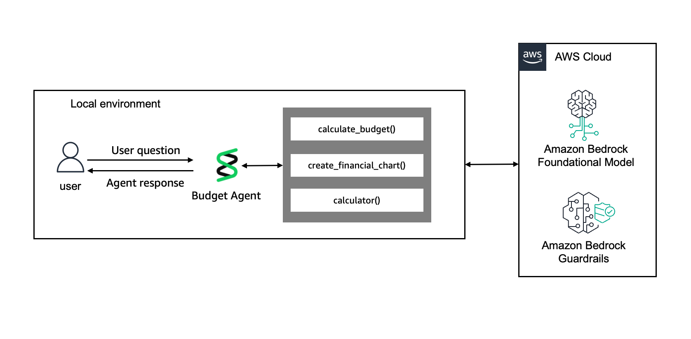
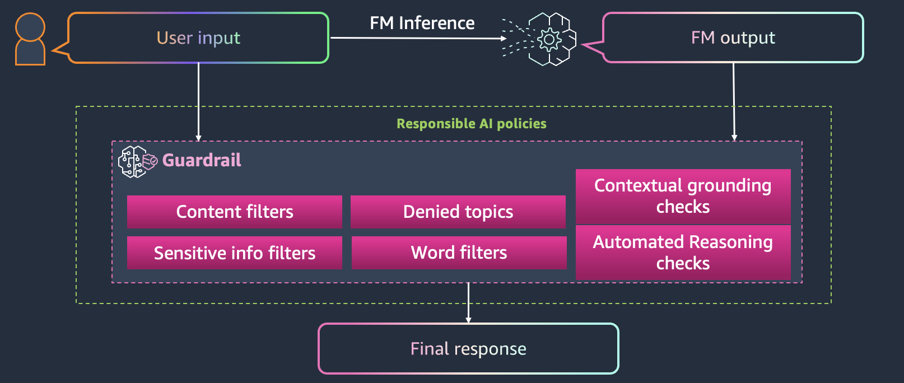

# Lab 1: Develop a personal budget assistant Strands agent

## Overview

In this lab, you'll create a sophisticated personal budget assistant using Strands Agents. We'll start with a basic conversational agent and progressively enhance it with advanced capabilities including model configuration, conversation management, custom tools, and structured outputs.

This lab demonstrates core Strands Agents concepts through practical implementation, showing how each feature builds upon the previous one to create a comprehensive financial advisory system. By the end, you'll have a production-ready agent capable of providing personalized budgeting advice, spending analysis, and financial recommendations.

We're creating a comprehensive **Budget Agent** that helps users manage their personal finances through intelligent conversation and specialized tools. The agent will provide budgeting guidance, analyze spending patterns, and offer actionable financial advice.



### Budget Agent Tools & Capabilities

| Tool | Description | Example Use Case |
|------|-------------|------------------|
| **calculate_budget** | Calculates 50/30/20 budget breakdown based on monthly income | "I make $5000/month, create a budget for me" |
| **create_financial_chart** | Generates pie charts and visualizations of financial data | "Visualize my spending across different categories" |
| **calculator** | Performs mathematical calculations for financial planning | "Calculate 15% of my monthly income for savings" |

### Agent Features Summary

Our Budget Agent will include:

- **Personalized Financial Guidance**: Tailored advice based on income and spending patterns
- **Interactive Budgeting**: Real-time budget calculations using the proven 50/30/20 rule
- **Visual Analytics**: Chart generation for better financial data comprehension
- **Conversation Memory**: Context retention across multiple interactions for personalized experiences
- **Structured Reporting**: Consistent, parseable financial reports with health scores and recommendations
- **Responsible AI**: Built-in guardrails and disclaimers for ethical financial advice

The agent focuses exclusively on budgeting and spending analysis, providing practical, actionable guidance without investment advice. It serves as the foundation for more complex multi-agent systems you'll build in subsequent labs.

```python
# Install required dependencies for Strands agents and tools
!pip install --force-reinstall -U -r requirements.txt --quiet
```

```python
# Import core Strands components and utilities for budget agent
from strands import Agent, tool
from strands.models import BedrockModel
from strands_tools import calculator
from utils import create_guardrail, pretty_print_messages
import time
import matplotlib.pyplot as plt
```

### Associate Amazon Bedrock Guardrail with Strands

Amazon Bedrock provides a [built-in guardrails framework](https://docs.aws.amazon.com/bedrock/latest/userguide/guardrails.html) that integrates directly with the Strands Agents SDK. If a guardrail is triggered, the Strands Agents SDK will automatically overwrite the user's input in the conversation history. This is done so that follow-up questions are not also blocked by the same questions. This can be configured with the guardrail_redact_input boolean, and the guardrail_redact_input_message string to change the overwrite message. Additionally, the same functionality is built for the model's output, but this is disabled by default. You can enable this with the guardrail_redact_output boolean, and change the overwrite message with the guardrail_redact_output_message string.

```python
# Create Bedrock guardrail for content filtering and safety
guardrail_id, guardrail_arn = create_guardrail()
```



Below is an example of how to leverage Bedrock guardrails in your code:

```python
# Configure Bedrock model with Claude Haiku 4.5 and guardrails
bedrock_model = BedrockModel(
    model_id="global.anthropic.claude-haiku-4-5-20251001-v1:0",
    region_name="us-west-2",
    temperature=0.0,  # Deterministic responses for financial advice
    guardrail_id=guardrail_id,  # Your Bedrock guardrail ID
    guardrail_version="DRAFT",  # Guardrail version
    guardrail_trace="enabled",
)
```

```python
# Create basic agent with configured Bedrock model
agent = Agent(model=bedrock_model)
```

```python
# Test basic agent functionality with general question
response_1 = agent("Hello! What can you do?")
```

```python
# Test guardrail blocking investment advice (should be filtered)
response_2 = agent("Bitcoin investment advice")
```

```python
# Display conversation history with formatting
pretty_print_messages(messages=agent.messages)
```

## Create Budget Agent

### Step 1: Define a System Prompt

```python
# Define system prompt for budget-focused financial assistant
BUDGET_SYSTEM_PROMPT = """You are a helpful personal finance assistant. 
You provide general strategies for creating budgets, tips on financial discipline to achieve financial milestones, and analyze financial trends. 
You do not provide any investment advice. Keep responses concise and actionable. Always provide 2-3 specific steps the user can take. Focus on practical budgeting and spending advice.
"""
```

```python
# Create budget agent with custom system prompt
budget_agent_sys = Agent(
    model=bedrock_model,
    system_prompt=BUDGET_SYSTEM_PROMPT,  # Associate a system prompt
)
```

```python
# Test budget agent with dining expense analysis
response_3 = budget_agent_sys("I spend $800/month on dining out. Is this too much for someone making $5000/month?")
```

### Step 2: Add Conversation Manager

In the Strands Agents SDK, context refers to the information provided to the agent for understanding and reasoning. This includes:

- User messages
- Agent responses
- Tool usage and results
- System prompts

As conversations grow, managing this context becomes increasingly important for several reasons:

- **Token Limits**: Language models have fixed context windows (maximum tokens they can process)
- **Performance**: Larger contexts require more processing time and resources
- **Relevance**: Older messages may become less relevant to the current conversation
- **Coherence**: Maintaining logical flow and preserving important information

#### Conversation Manager Types

Strands Agents provides three types of conversation managers to handle different context management needs:

1. **[SlidingWindowConversationManager](https://strandsagents.com/latest/documentation/docs/api-reference/agent/#strands.agent.conversation_manager.sliding_window_conversation_manager.SlidingWindowConversationManager)** (Default): Implements a sliding window strategy that maintains a fixed number of recent message pairs, automatically removing the oldest when the limit is reached. This is the default conversation manager used by the Agent class and is ideal for most applications where recent context is most important.

2. **[NullConversationManager](https://strandsagents.com/latest/documentation/docs/api-reference/agent/#strands.agent.conversation_manager.null_conversation_manager.NullConversationManager)**: A simple implementation that does not modify the conversation history. It's useful for short conversations that won't exceed context limits, debugging purposes, or cases where you want to manage context manually.

3. **[SummarizingConversationManager](https://strandsagents.com/latest/documentation/docs/api-reference/agent/#strands.agent.conversation_manager.summarizing_conversation_manager.SummarizingConversationManager)**: Implements intelligent conversation context management by summarizing older messages instead of simply discarding them. This approach preserves important information while staying within context limits, making it ideal for long-running conversations where historical context matters.

```python
# Import conversation manager for context handling
from strands.agent.conversation_manager import SummarizingConversationManager
```

```python
# Configure conversation manager to handle long conversations
conversation_manager = SummarizingConversationManager(
    summary_ratio=0.5,  # Summarize 50% of messages when context reduction is needed
    preserve_recent_messages=3,  # Always keep 3 most recent messages
)
```

```python
# Create agent with conversation management capabilities
budget_agent_manager = Agent(
    model=bedrock_model,
    system_prompt=BUDGET_SYSTEM_PROMPT,
    conversation_manager=conversation_manager,  # Associate a conversation manager
    callback_handler=None,
)
```

### Step 3: Async Iterators for Streaming

Strands Agents SDK provides support for asynchronous iterators through the [stream_async](https://strandsagents.com/latest/documentation/docs/api-reference/agent/#strands.agent.agent.Agent.stream_async) method, enabling real-time streaming of agent responses in asynchronous environments like web servers, APIs, and other async applications.

```python
# Demonstrate streaming responses with async iterator
async for event in budget_agent_manager.stream_async(
    "I make $5000/month and spend $800 on dining out. Is this too much?"
):
    if "data" in event:
        # Only stream text chunks to the client
        print(event["data"], end="")
        time.sleep(0.1)  # show streaming properly
```

### Step 4: Add Financial Tools

```python
# Define custom tool for 50/30/20 budget calculations
@tool
def calculate_budget(monthly_income: float) -> str:
    """Calculate 50/30/20 budget breakdown for the given monthly income."""
    needs = monthly_income * 0.50
    wants = monthly_income * 0.30
    savings = monthly_income * 0.20
    return f"💰 Budget for ${monthly_income:,.0f}/month:\n• Needs: ${needs:,.0f} (50%)\n• Wants: ${wants:,.0f} (30%)\n• Savings: ${savings:,.0f} (20%)"
```

```python
# Define tool for creating financial pie charts
@tool
def create_financial_chart(data_dict: dict, chart_title: str = "Financial Chart") -> str:
    """Create a pie chart visualization from financial data dictionary."""
    if not data_dict:
        return "❌ No data provided for chart"

    labels = list(data_dict.keys())
    values = list(data_dict.values())
    colors = ["#FF6B6B", "#4ECDC4", "#45B7D1", "#96CEB4", "#FECA57", "#FF9FF3"]

    plt.figure(figsize=(8, 6))
    plt.pie(
        values,
        labels=labels,
        autopct="%1.1f%%",
        colors=colors[: len(values)],
        startangle=90,
    )
    plt.title(f"📊 {chart_title}", fontsize=14, fontweight="bold")
    plt.axis("equal")
    plt.tight_layout()
    plt.show()

    return f"✅ {chart_title} visualization created!"
```

```python
# Create complete budget agent with all tools integrated
budget_agent = Agent(
    model=bedrock_model,
    system_prompt=BUDGET_SYSTEM_PROMPT,
    conversation_manager=conversation_manager,
    tools=[calculate_budget, create_financial_chart, calculator],
    callback_handler=None,
)
```

```python
# Test tool-enabled agent with streaming response
async for event in budget_agent.stream_async("I make $5000/month and spend $800 on dining out. Is this too much?"):
    if "data" in event:
        # Only stream text chunks to the client
        print(event["data"], end="")
        time.sleep(0.1)  # show streaming properly
```

### Step 5: Add Structured Output for Financial Reports

```python
# Import Pydantic for structured output models
from pydantic import BaseModel, Field
from typing import List
```

```python
# Define Pydantic models for structured financial reports
class BudgetCategory(BaseModel):
    name: str = Field(description="Budget category name")
    amount: float = Field(description="Dollar amount for this category")
    percentage: float = Field(description="Percentage of total income")


class FinancialReport(BaseModel):
    monthly_income: float = Field(description="Total monthly income")
    budget_categories: List[BudgetCategory] = Field(description="List of budget categories")
    recommendations: List[str] = Field(description="List of specific recommendations")
    financial_health_score: int = Field(ge=1, le=10, description="Financial health score from 1-10")
```

```python
# Generate structured financial report using Pydantic model
structured_response = budget_agent.structured_output(
    output_model=FinancialReport,
    prompt="Generate a comprehensive financial report for someone earning $6000/month with $800 dining expenses.",
)
```

```python
# Display structured report output in formatted way
print(f"Income: ${structured_response.monthly_income:,.0f}")
for category in structured_response.budget_categories:
    print(f"• {category.name}: ${category.amount:,.0f} ({category.percentage:.1f}%)")
print(f"\nFinancial Health Score: {structured_response.financial_health_score}/10")
print("\nRecommendations:")
for i, rec in enumerate(structured_response.recommendations, 1):
    print(f"{i}. {rec}")
```

```python
%%writefile budget_agent.py
# Export complete budget agent implementation to Python file
from strands import Agent, tool
from strands.models import BedrockModel
from strands_tools import calculator
from pydantic import BaseModel, Field
from typing import List
import matplotlib.pyplot as plt


# Define structured output models for financial data
class BudgetCategory(BaseModel):
    name: str = Field(description="Budget category name")
    amount: float = Field(description="Dollar amount for this category")
    percentage: float = Field(description="Percentage of total income")


class FinancialReport(BaseModel):
    monthly_income: float = Field(description="Total monthly income")
    budget_categories: List[BudgetCategory] = Field(
        description="List of budget categories"
    )
    recommendations: List[str] = Field(description="List of specific recommendations")
    financial_health_score: int = Field(
        ge=1, le=10, description="Financial health score from 1-10"
    )


# Enhanced system prompt for structured outputs
BUDGET_SYSTEM_PROMPT = """You are a helpful personal finance assistant. You help with budgeting, spending analysis, and financial discipline using the 50/30/20 rule or sensible custom allocations. You do not provide investment advice. Base your guidance on the user's income and spending, and keep it practical and actionable."""

# Continue with previous configurations
bedrock_model = BedrockModel(
    model_id="global.anthropic.claude-haiku-4-5-20251001-v1:0",
    region_name="us-west-2",
    temperature=0.0,  # Deterministic responses for financial advice
)


@tool
def calculate_budget(monthly_income: float) -> str:
    """Calculate 50/30/20 budget breakdown for the given monthly income."""
    needs = monthly_income * 0.50
    wants = monthly_income * 0.30
    savings = monthly_income * 0.20
    return f"💰 Budget for ${monthly_income:,.0f}/month:\n• Needs: ${needs:,.0f} (50%)\n• Wants: ${wants:,.0f} (30%)\n• Savings: ${savings:,.0f} (20%)"


@tool
def create_financial_chart(
    data_dict: dict, chart_title: str = "Financial Chart"
) -> str:
    """Create a pie chart visualization from financial data dictionary."""
    if not data_dict:
        return "❌ No data provided for chart"

    labels = list(data_dict.keys())
    values = list(data_dict.values())
    colors = ["#FF6B6B", "#4ECDC4", "#45B7D1", "#96CEB4", "#FECA57", "#FF9FF3"]

    plt.figure(figsize=(8, 6))
    plt.pie(
        values,
        labels=labels,
        autopct="%1.1f%%",
        colors=colors[: len(values)],
        startangle=90,
    )
    plt.title(f"📊 {chart_title}", fontsize=14, fontweight="bold")
    plt.axis("equal")
    plt.tight_layout()
    plt.show()

    return f"✅ {chart_title} visualization created!"


# Create our complete financial agent
budget_agent = Agent(
    model=bedrock_model,
    system_prompt=BUDGET_SYSTEM_PROMPT,
    tools=[calculate_budget, create_financial_chart, calculator],
    callback_handler=None,
)

if __name__ == "__main__":
    # Test structured output using structured_output_async
    print("\nStructured financial report:")
    structured_response = budget_agent.structured_output(
        output_model=FinancialReport,
        prompt="Generate a comprehensive financial report for someone earning $6000/month with $800 dining expenses.",
    )
    print(f"Income: ${structured_response.monthly_income:,.0f}")
    for category in structured_response.budget_categories:
        print(
            f"• {category.name}: ${category.amount:,.0f} ({category.percentage:.1f}%)"
        )
    print(f"\nFinancial Health Score: {structured_response.financial_health_score}/10")
    print("\nRecommendations:")
    for i, rec in enumerate(structured_response.recommendations, 1):
        print(f"{i}. {rec}")
```

```python
# Test the exported budget agent implementation
!python budget_agent.py
```
