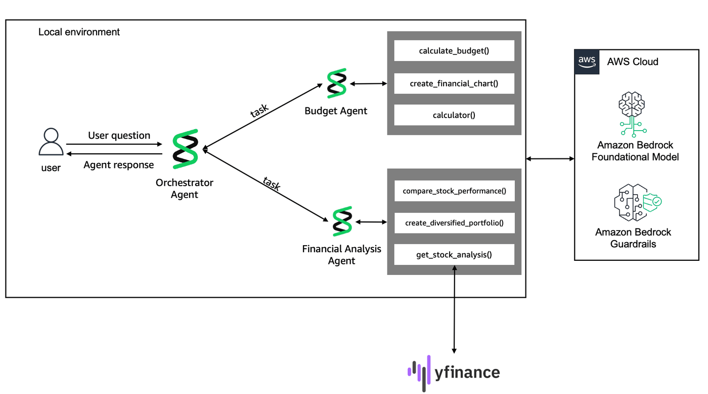

# Lab 2: Build multi-agent workflows with Strands

In this lab, you'll advance from single-agent systems to sophisticated multi-agent architectures using Strands Agents' ["Agents as Tools"](https://strandsagents.com/latest/documentation/docs/user-guide/concepts/multi-agent/agents-as-tools/) pattern. You'll create specialized financial agents that work together under an orchestrator to provide comprehensive financial guidance.

This lab demonstrates enterprise-grade agent coordination, where specialized agents collaborate to solve complex problems that exceed any single agent's capabilities. You'll learn hierarchical agent design, tool wrapping patterns, and intelligent request routing - skills essential for building production-scale AI systems.



### System Architecture

Our multi-agent system consists of three core components:

#### 1. Budget Agent (from Lab 1)
*Specializes in personal budgeting, spending analysis, and financial discipline*

| Tool | Description | Example Use Case |
| --- | --- | --- |
| **calculate_budget_breakdown** | 50/30/20 budget calculations for any income level | Create a budget for my $6000 monthly income |
| **analyze_spending_pattern** | Spending pattern analysis with personalized recommendations | Analyze my $800 dining expenses against $5000 income |
| **calculator** | Financial calculations and mathematical operations | Calculate 20% savings target for my budget |
  
#### 2. Financial Analysis Agent
*Focuses on investment research, portfolio management, and market analysis*

| Tool | Description | Example Use Case |
|------|-------------|------------------|
| **get_stock_analysis** | Real-time stock data and comprehensive analysis | Analyze Apple stock performance and metrics |
| **create_diversified_portfolio** | Risk-based portfolio recommendations with allocations | Create a moderate risk portfolio for $10,000 |
| **compare_stock_performance** | Multi-stock performance comparison over time periods | Compare Tesla, Apple, and Google over 6 months |

#### 3. Orchestrator Agent

*Coordinates specialized agents and synthesizes comprehensive responses*

| Capability | Description | Example Use Case |
|------------|-------------|------------------|
| **Agent Routing** | Intelligently determines which specialist(s) to consult | Routes budget questions to Budget Agent, investment queries to Financial Agent |
| **Multi-Agent Coordination** | Combines insights from multiple agents for complex queries | "Help me budget and invest" uses both agents together |
| **Response Synthesis** | Creates coherent responses from multiple agent outputs | Combines budget analysis with investment recommendations |
| **Context Management** | Maintains conversation flow across agent interactions | Remembers previous advice when making follow-up recommendations |

```python
# Install required dependencies for multi-agent system
!pip install --force-reinstall -U -r requirements.txt --quiet
```

```python
# Import dependencies for multi-agent system and stock analysis
from strands import Agent, tool
from strands.models import BedrockModel
from strands.agent.conversation_manager import SummarizingConversationManager
import yfinance as yf
from typing import List
from utils import create_guardrail
```

### Step 1: Wrap Budget Agent as a Tool

```python
# Wrap budget agent from Lab 1 as a tool for orchestration
from budget_agent import FinancialReport, budget_agent


@tool
def budget_agent_tool(query: str) -> FinancialReport:
    """Generate structured financial reports with budget analysis and recommendations."""
    try:
        structured_response = budget_agent.structured_output(output_model=FinancialReport, prompt=query)
        return structured_response
    except Exception as e:
        # Return a default structured response on error
        return FinancialReport(
            monthly_income=0.0,
            budget_categories=[],
            recommendations=[f"Error generating report: {str(e)}"],
            financial_health_score=1,
        )
```

### Step 2: Create the Financial Analysis Agent

```python
# Define system prompt for investment-focused financial analysis agent
FINANCIAL_ANALYSIS_PROMPT = """You are a specialized financial analysis agent focused on investment research and portfolio recommendations. Your role is to:

1. Research and analyze stock performance data
2. Create diversified investment portfolios
3. Provide data-driven investment recommendations

You do not provide specific investment advice but rather present analytical data to help users make informed decisions. Always include disclaimers about market risks and the importance of consulting financial advisors."""
```

```python
# Configure Bedrock model for financial analysis agent
bedrock_model = BedrockModel(
    model_id="global.anthropic.claude-haiku-4-5-20251001-v1:0",
    region_name="us-west-2",
    temperature=0.0,  # Deterministic responses for financial advice
)
```

```python
# Tool for comprehensive stock analysis using yfinance
@tool
def get_stock_analysis(symbol: str) -> str:
    """Get comprehensive analysis for a specific stock symbol."""
    try:
        stock = yf.Ticker(symbol)
        info = stock.info
        hist = stock.history(period="1y")

        # Calculate key metrics
        current_price = hist["Close"].iloc[-1]
        year_high = hist["High"].max()
        year_low = hist["Low"].min()
        avg_volume = hist["Volume"].mean()
        price_change = ((current_price - hist["Close"].iloc[0]) / hist["Close"].iloc[0]) * 100

        return f"""
📊 Stock Analysis for {symbol.upper()}:
• Current Price: ${current_price:.2f}
• 52-Week High: ${year_high:.2f}
• 52-Week Low: ${year_low:.2f}
• Year-to-Date Change: {price_change:.2f}%
• Average Daily Volume: {avg_volume:,.0f} shares
• Company: {info.get("longName", "N/A")}
• Sector: {info.get("sector", "N/A")}
"""
    except Exception as e:
        return f"❌ Unable to retrieve data for {symbol}: {str(e)}"
```

```python
# Tool for creating risk-based diversified investment portfolios
@tool
def create_diversified_portfolio(risk_level: str, investment_amount: float) -> str:
    """Create a diversified portfolio based on risk level (conservative, moderate, aggressive) and investment amount."""

    portfolios = {
        "conservative": {
            "stocks": ["AAPL", "MSFT", "JNJ", "PG", "KO"],
            "weights": [0.25, 0.25, 0.20, 0.15, 0.15],
            "description": "Focus on large-cap, dividend-paying stocks",
        },
        "moderate": {
            "stocks": ["AAPL", "GOOGL", "AMZN", "TSLA", "NVDA"],
            "weights": [0.30, 0.25, 0.20, 0.15, 0.10],
            "description": "Balanced mix of growth and stability",
        },
        "aggressive": {
            "stocks": ["TSLA", "NVDA", "AMZN", "GOOGL", "META"],
            "weights": [0.30, 0.25, 0.20, 0.15, 0.10],
            "description": "High-growth potential stocks",
        },
    }

    if risk_level.lower() not in portfolios:
        return "❌ Risk level must be: conservative, moderate, or aggressive"

    portfolio = portfolios[risk_level.lower()]

    result = f"""
🎯 {risk_level.upper()} Portfolio Recommendation (${investment_amount:,.0f}):
{portfolio["description"]}

Portfolio Allocation:
"""

    for stock, weight in zip(portfolio["stocks"], portfolio["weights"]):
        allocation = investment_amount * weight
        result += f"• {stock}: {weight * 100:.0f}% (${allocation:,.0f})\n"

    result += "\n⚠️ Disclaimer: This is for educational purposes only. Consult a financial advisor before investing."
    return result
```

```python
# Tool for comparing performance of multiple stocks over time periods
@tool
def compare_stock_performance(symbols: List[str], period: str = "1y") -> str:
    """Compare performance of multiple stocks over a specified period (1y, 6m, 3m, 1m)."""
    if len(symbols) > 5:
        return "❌ Please limit comparison to 5 stocks maximum"

    try:
        performance_data = {}

        for symbol in symbols:
            stock = yf.Ticker(symbol)
            hist = stock.history(period=period)
            if not hist.empty:
                start_price = hist["Close"].iloc[0]
                end_price = hist["Close"].iloc[-1]
                performance = ((end_price - start_price) / start_price) * 100
                performance_data[symbol] = performance

        result = f"📈 Stock Performance Comparison ({period}):\n"
        sorted_stocks = sorted(performance_data.items(), key=lambda x: x[1], reverse=True)

        for stock, performance in sorted_stocks:
            result += f"• {stock}: {performance:+.2f}%\n"

        return result

    except Exception as e:
        return f"❌ Error comparing stocks: {str(e)}"
```

```python
# Create financial analysis agent with investment tools
financial_analysis_agent = Agent(
    model=bedrock_model,  # Using the same bedrock_model from Step 1
    system_prompt=FINANCIAL_ANALYSIS_PROMPT,
    tools=[get_stock_analysis, create_diversified_portfolio, compare_stock_performance],
)
```

```python
# Test financial analysis agent with portfolio and stock analysis
response = financial_analysis_agent("Create a moderate risk portfolio for $10,000 and analyze Apple stock")
```

```python
%%writefile financial_analysis_agent.py
# Export financial analysis agent to standalone Python file

import yfinance as yf
from strands import Agent, tool
from typing import List
from strands.models import BedrockModel

# Financial Analysis Agent System Prompt
FINANCIAL_ANALYSIS_PROMPT = """You are a specialized financial analysis agent focused on investment research and portfolio recommendations. Your role is to:

1. Research and analyze stock performance data
2. Create diversified investment portfolios
3. Provide data-driven investment recommendations

You do not provide specific investment advice but rather present analytical data to help users make informed decisions. Always include disclaimers about market risks and the importance of consulting financial advisors."""

bedrock_model = BedrockModel(
    model_id="global.anthropic.claude-haiku-4-5-20251001-v1:0",
    region_name="us-west-2",
    temperature=0.0,  # Deterministic responses for financial advice
)


# Tool 1: Get Stock Analysis
@tool
def get_stock_analysis(symbol: str) -> str:
    """Get comprehensive analysis for a specific stock symbol."""
    try:
        stock = yf.Ticker(symbol)
        info = stock.info
        hist = stock.history(period="1y")

        # Calculate key metrics
        current_price = hist["Close"].iloc[-1]
        year_high = hist["High"].max()
        year_low = hist["Low"].min()
        avg_volume = hist["Volume"].mean()
        price_change = (
            (current_price - hist["Close"].iloc[0]) / hist["Close"].iloc[0]
        ) * 100

        return f"""
📊 Stock Analysis for {symbol.upper()}:
• Current Price: ${current_price:.2f}
• 52-Week High: ${year_high:.2f}
• 52-Week Low: ${year_low:.2f}
• Year-to-Date Change: {price_change:.2f}%
• Average Daily Volume: {avg_volume:,.0f} shares
• Company: {info.get("longName", "N/A")}
• Sector: {info.get("sector", "N/A")}
"""
    except Exception as e:
        return f"❌ Unable to retrieve data for {symbol}: {str(e)}"


# Tool 2: Create Diversified Portfolio
@tool
def create_diversified_portfolio(risk_level: str, investment_amount: float) -> str:
    """Create a diversified portfolio based on risk level (conservative, moderate, aggressive) and investment amount."""

    portfolios = {
        "conservative": {
            "stocks": ["AAPL", "MSFT", "JNJ", "PG", "KO"],
            "weights": [0.25, 0.25, 0.20, 0.15, 0.15],
            "description": "Focus on large-cap, dividend-paying stocks",
        },
        "moderate": {
            "stocks": ["AAPL", "GOOGL", "AMZN", "TSLA", "NVDA"],
            "weights": [0.30, 0.25, 0.20, 0.15, 0.10],
            "description": "Balanced mix of growth and stability",
        },
        "aggressive": {
            "stocks": ["TSLA", "NVDA", "AMZN", "GOOGL", "META"],
            "weights": [0.30, 0.25, 0.20, 0.15, 0.10],
            "description": "High-growth potential stocks",
        },
    }

    if risk_level.lower() not in portfolios:
        return "❌ Risk level must be: conservative, moderate, or aggressive"

    portfolio = portfolios[risk_level.lower()]

    result = f"""
🎯 {risk_level.upper()} Portfolio Recommendation (${investment_amount:,.0f}):
{portfolio["description"]}

Portfolio Allocation:
"""

    for stock, weight in zip(portfolio["stocks"], portfolio["weights"]):
        allocation = investment_amount * weight
        result += f"• {stock}: {weight * 100:.0f}% (${allocation:,.0f})\n"

    result += "\n⚠️ Disclaimer: This is for educational purposes only. Consult a financial advisor before investing."
    return result


# Tool 3: Compare Stock Performance
@tool
def compare_stock_performance(symbols: List[str], period: str = "1y") -> str:
    """Compare performance of multiple stocks over a specified period (1y, 6m, 3m, 1m)."""
    if len(symbols) > 5:
        return "❌ Please limit comparison to 5 stocks maximum"

    try:
        performance_data = {}

        for symbol in symbols:
            stock = yf.Ticker(symbol)
            hist = stock.history(period=period)
            if not hist.empty:
                start_price = hist["Close"].iloc[0]
                end_price = hist["Close"].iloc[-1]
                performance = ((end_price - start_price) / start_price) * 100
                performance_data[symbol] = performance

        result = f"📈 Stock Performance Comparison ({period}):\n"
        sorted_stocks = sorted(
            performance_data.items(), key=lambda x: x[1], reverse=True
        )

        for stock, performance in sorted_stocks:
            result += f"• {stock}: {performance:+.2f}%\n"

        return result

    except Exception as e:
        return f"❌ Error comparing stocks: {str(e)}"


# Create the Financial Analysis Agent
financial_analysis_agent = Agent(
    model=bedrock_model,  # Using the same bedrock_model from Step 1
    system_prompt=FINANCIAL_ANALYSIS_PROMPT,
    tools=[get_stock_analysis, create_diversified_portfolio, compare_stock_performance],
    callback_handler=None,
)

if __name__ == "__main__":
    # Test the Financial Analysis Agent
    response = financial_analysis_agent(
        "Create a moderate risk portfolio for $10,000 and analyze Apple stock"
    )
    print(response)
```

```python
# Test standalone financial analysis agent
!python financial_analysis_agent.py
```

### Step 3: Wrap Financial Analysis Agent as a Tool

```python
# Wrap financial analysis agent as tool for orchestrator
from financial_analysis_agent import financial_analysis_agent


@tool
def financial_analysis_agent_tool(query: str) -> str:
    """Handle investment analysis queries including stock research, portfolio creation, and performance comparisons."""
    try:
        response = financial_analysis_agent(query)
        return str(response)
    except Exception as e:
        return f"❌ Financial analysis error: {str(e)}"
```

### Step 4: Create the Orchestrator Agent

```python
# Define orchestrator system prompt for multi-agent coordination
ORCHESTRATOR_PROMPT = """You are a comprehensive financial advisor orchestrator that coordinates between specialized financial agents to provide complete financial guidance. 

Your specialized agents are:
1. **budget_agent**: Handles budgeting, spending analysis, savings recommendations, and expense tracking
2. **financial_analysis_agent_tool**: Handles investment analysis, stock research, portfolio creation, and performance comparisons

Guidelines for using your agents:
- Use **budget_agent** for questions about: budgets, spending habits, expense tracking, savings goals, debt management
- Use **financial_analysis_agent_tool** for questions about: stocks, investments, portfolios, market analysis, investment recommendations
- You can use both agents together for comprehensive financial planning
- Always provide a cohesive summary that combines insights from multiple agents when applicable
- Maintain a helpful, professional tone and include appropriate disclaimers about financial advice

When a user asks a question:
1. Determine which agent(s) are most appropriate
2. Call the relevant agent(s) with focused queries
3. Synthesize the responses into a coherent, comprehensive answer
4. Provide actionable next steps when possible"""
```

```python
# Create guardrail for orchestrator agent
guardrail_id, guardrail_arn = create_guardrail()
```

```python
# Configure Bedrock model for orchestrator with guardrails
bedrock_model = BedrockModel(
    model_id="global.anthropic.claude-haiku-4-5-20251001-v1:0",
    region_name="us-west-2",
    temperature=0.0,  # Deterministic responses for financial advice
    guardrail_id=guardrail_id,  # Your Bedrock guardrail ID
    guardrail_version="DRAFT",  # Guardrail version
    guardrail_trace="enabled",
)
```

```python
# Configure conversation manager for orchestrator
conversation_manager = SummarizingConversationManager(
    summary_ratio=0.3,  # Summarize 30% of messages when context reduction is needed
    preserve_recent_messages=5,  # Always keep 5 most recent messages
)
```

```python
# Create orchestrator agent with both specialized agent tools
orchestrator_agent = Agent(
    model=bedrock_model,
    system_prompt=ORCHESTRATOR_PROMPT,
    tools=[budget_agent_tool, financial_analysis_agent_tool],
    conversation_manager=conversation_manager,  # Associate a conversation manager
)
```

```python
# Test orchestrator with complex multi-agent query
response = orchestrator_agent(
    "Compare Tesla and Apple stocks, and tell me if I can afford to invest $2000 with my $4000 monthly income.",
)
```

```python
%%writefile main.py
# Export complete multi-agent system to main.py

from strands import Agent, tool
from strands.models import BedrockModel
from strands.agent.conversation_manager import SummarizingConversationManager

from budget_agent import FinancialReport, budget_agent
from financial_analysis_agent import financial_analysis_agent

from utils import get_guardrail_id

ORCHESTRATOR_PROMPT = """You are a comprehensive financial advisor orchestrator that coordinates between specialized financial agents to provide complete financial guidance. 

Your specialized agents are:
1. **budget_agent**: Handles budgeting, spending analysis, savings recommendations, and expense tracking
2. **financial_analysis_agent_tool**: Handles investment analysis, stock research, portfolio creation, and performance comparisons

Guidelines for using your agents:
- Use **budget_agent** for questions about: budgets, spending habits, expense tracking, savings goals, debt management
- Use **financial_analysis_agent_tool** for questions about: stocks, investments, portfolios, market analysis, investment recommendations
- You can use both agents together for comprehensive financial planning
- Always provide a cohesive summary that combines insights from multiple agents when applicable
- Maintain a helpful, professional tone and include appropriate disclaimers about financial advice

When a user asks a question:
1. Determine which agent(s) are most appropriate
2. Call the relevant agent(s) with focused queries
3. Synthesize the responses into a coherent, comprehensive answer
4. Provide actionable next steps when possible"""

# Add conversation management to maintain context
conversation_manager = SummarizingConversationManager(
    summary_ratio=0.3,  # Summarize 30% of messages when context reduction is needed
    preserve_recent_messages=5,  # Always keep 5 most recent messages
)

# Continue with previous configurations
bedrock_model = BedrockModel(
    model_id="global.anthropic.claude-haiku-4-5-20251001-v1:0",
    region_name="us-west-2",
    temperature=0.0,  # Deterministic responses for financial advice
    guardrail_id=get_guardrail_id(),
    guardrail_version="DRAFT",
    guardrail_trace="enabled",
)


@tool
def budget_agent_tool(query: str) -> FinancialReport:
    """Generate structured financial reports with budget analysis and recommendations."""
    try:
        structured_response = budget_agent.structured_output(
            output_model=FinancialReport, prompt=query
        )
        return structured_response
    except Exception as e:
        # Return a default structured response on error
        return FinancialReport(
            monthly_income=0.0,
            budget_categories=[],
            recommendations=[f"Error generating report: {str(e)}"],
            financial_health_score=1,
        )


# Wrap Financial Analysis Agent as a Tool
@tool
def financial_analysis_agent_tool(query: str) -> str:
    """Handle investment analysis queries including stock research, portfolio creation, and performance comparisons."""
    try:
        response = financial_analysis_agent(query)
        return str(response)
    except Exception as e:
        return f"❌ Financial analysis error: {str(e)}"


orchestrator_agent = Agent(
    model=bedrock_model,
    system_prompt=ORCHESTRATOR_PROMPT,
    tools=[budget_agent_tool, financial_analysis_agent_tool],
    conversation_manager=conversation_manager,
)

if __name__ == "__main__":
    orchestrator_agent = Agent(
        model=bedrock_model,
        system_prompt=ORCHESTRATOR_PROMPT,
        tools=[budget_agent_tool, financial_analysis_agent_tool],
    )

    response = orchestrator_agent("I make $6000/month and want to start investing $500/month. Help me create a budget and suggest an investment portfolio.")
```

```python
# Test complete multi-agent orchestrator system
!python main.py
```
