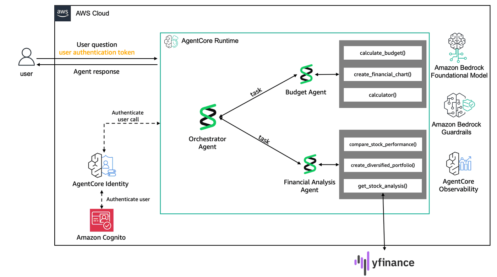
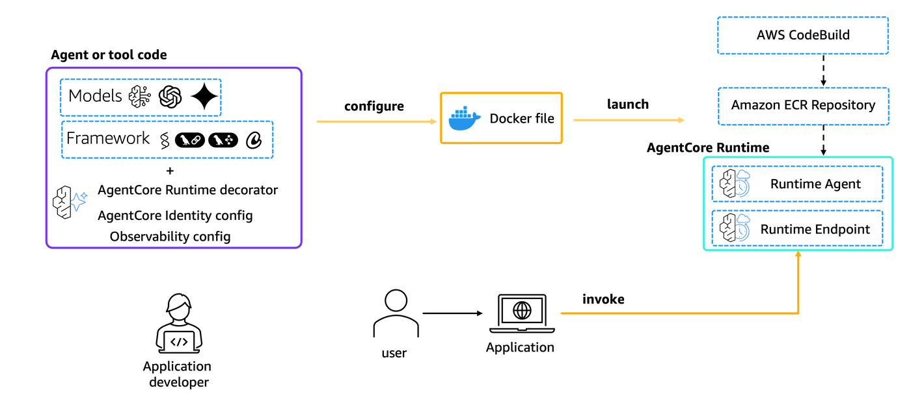

# Lab 3: Deploy agents on Amazon Bedrock AgentCore

In this final lab, you'll transition from local development to production deployment using Amazon Bedrock AgentCore. You'll take the sophisticated multi-agent financial advisory system built in [Lab 1](./lab1-develop_a_personal_budget_assistant_strands_agent.ipynb) and [Lab 2](./lab2-build_multi_agent_workflows_with_strands.ipynb) and deploy it to AWS's enterprise-grade agent hosting platform - AgentCore Runtime.



## What You Will Learn

You'll learn how to leverage AgentCore's purpose-built infrastructure for running agents at scale while maintaining security, performance, and reliability standards required for enterprise applications.

## Amazon Bedrock AgentCore Runtime

[Amazon Bedrock AgentCore Runtime](https://docs.aws.amazon.com/bedrock-agentcore/latest/devguide/agents-tools-runtime.html) provides a secure, serverless, and purpose-built hosting environment for deploying and running AI agents or tools, shortening the time to value from experiments to production-grade agents.

[Learn more about how AgentCore Runtime works](https://docs.aws.amazon.com/bedrock-agentcore/latest/devguide/runtime-how-it-works.html)

## Amazon Bedrock AgentCore Observability

[AgentCore Observability](https://docs.aws.amazon.com/bedrock-agentcore/latest/devguide/observability.html) helps you trace, debug, and monitor agent performance in production environments. It offers detailed visualizations of each step in the agent workflow, enabling you to inspect an agent's execution path, audit intermediate outputs, and debug performance bottlenecks and failures.

```python
# Install dependencies for AgentCore deployment
!pip install --force-reinstall -U -r requirements.txt --quiet
```

```python
# Import AgentCore Runtime deployment tools and utilities
import uuid
from utils import setup_cognito_user_pool, reauthenticate_user
from bedrock_agentcore_starter_toolkit import Runtime
from boto3.session import Session
from typing import Any, Optional
import urllib.parse
import requests
import json
```

```python
# Initialize AWS session and get current region
boto_session = Session()
region = boto_session.region_name
```

### Step 1: Preparing your agent for deployment on AgentCore Runtime

Let's now deploy our agents to `AgentCore Runtime`. To do so we need to:

- Import the Runtime App with `from bedrock_agentcore.runtime import BedrockAgentCoreApp`
- Initialize the App in our code with `app = BedrockAgentCoreApp()`
- Decorate the invocation function with the `@app.entrypoint` decorator
- Let AgentCore Runtime control the running of the agent with `app.run()`

```python
%%writefile main.py
# Create AgentCore-compatible deployment file with streaming endpoint

from strands import Agent, tool
from strands.models import BedrockModel
from strands.agent.conversation_manager import SummarizingConversationManager

from budget_agent import FinancialReport, budget_agent
from financial_analysis_agent import financial_analysis_agent
from bedrock_agentcore import BedrockAgentCoreApp

from utils import get_guardrail_id

app = BedrockAgentCoreApp()
agent = Agent()

ORCHESTRATOR_PROMPT = """You are a comprehensive financial advisor orchestrator that coordinates between specialized financial agents to provide complete financial guidance. 

Your specialized agents are:
1. **budget_agent**: Handles budgeting, spending analysis, savings recommendations, and expense tracking
2. **financial_analysis_agent_tool**: Handles investment analysis, stock research, portfolio creation, and performance comparisons

Guidelines for using your agents:
- Use **budget_agent** for questions about: budgets, spending habits, expense tracking, savings goals, debt management
- Use **financial_analysis_agent_tool** for questions about: stocks, investments, portfolios, market analysis, investment recommendations
- You can use both agents together for comprehensive financial planning
- Always provide a cohesive summary that combines insights from multiple agents when applicable
- Maintain a helpful, professional tone and include appropriate disclaimers about financial advice

When a user asks a question:
1. Determine which agent(s) are most appropriate
2. Call the relevant agent(s) with focused queries
3. Synthesize the responses into a coherent, comprehensive answer
4. Provide actionable next steps when possible"""

# Add conversation management to maintain context
conversation_manager = SummarizingConversationManager(
    summary_ratio=0.3,  # Summarize 30% of messages when context reduction is needed
    preserve_recent_messages=5,  # Always keep 5 most recent messages
)

# Continue with previous configurations
bedrock_model = BedrockModel(
    model_id="global.anthropic.claude-haiku-4-5-20251001-v1:0",
    region_name="us-west-2",
    temperature=0.0,  # Deterministic responses for financial advice
    guardrail_id=get_guardrail_id(),
    guardrail_version="DRAFT",
    guardrail_trace="enabled",
)


@tool
def budget_agent_tool(query: str) -> FinancialReport:
    """Generate structured financial reports with budget analysis and recommendations."""
    try:
        structured_response = budget_agent.structured_output(
            output_model=FinancialReport, prompt=query
        )
        return structured_response
    except Exception as e:
        # Return a default structured response on error
        return FinancialReport(
            monthly_income=0.0,
            budget_categories=[],
            recommendations=[f"Error generating report: {str(e)}"],
            financial_health_score=1,
        )


# Wrap Financial Analysis Agent as a Tool
@tool
def financial_analysis_agent_tool(query: str) -> str:
    """Handle investment analysis queries including stock research, portfolio creation, and performance comparisons."""
    try:
        response = financial_analysis_agent(query)
        return str(response)
    except Exception as e:
        return f"❌ Financial analysis error: {str(e)}"


orchestrator_agent = Agent(
    model=bedrock_model,
    system_prompt=ORCHESTRATOR_PROMPT,
    tools=[budget_agent_tool, financial_analysis_agent_tool],
    conversation_manager=conversation_manager,
)


@app.entrypoint
async def invoke(payload):
    """Your AI agent function"""
    user_message = payload["prompt"]
    async for event in orchestrator_agent.stream_async(user_message):
        if "data" in event:
            # Only stream text chunks to the client
            yield event["data"]


if __name__ == "__main__":
    app.run()
```

## What happens behind the scenes?

When you use `BedrockAgentCoreApp`, it automatically:

* Creates an HTTP server that listens on port 8080
* Implements the required `/invocations` endpoint for processing the agent's requirements
* Implements the `/ping` endpoint for health checks (very important for asynchronous agents)
* Handles proper content types and response formats
* Manages error handling according to AWS standards

### Step 2: Testing Locally

To test your Agent server locally:

1. **Terminal 1**: Start the Agent server
   ```bash
   python main.py
   ```
   
2. **Terminal 2**: Use the following command:
   ```bash
   curl -X POST http://localhost:8080/invocations \
      -H "Content-Type: application/json" \
      -d '{"prompt": "Hello!"}'
   ```

You should see your agent response.

### Step 3: Setting up Amazon Cognito for Authentication

AgentCore Runtime requires authentication. We'll use Amazon Cognito to provide JWT tokens for accessing our deployed agent server.

```python
# Set up Amazon Cognito for AgentCore Runtime authentication
print("Setting up Amazon Cognito user pool...")

cognito_config = setup_cognito_user_pool()

print("Cognito setup completed ✓")
print(f"User Pool ID: {cognito_config.get('user_pool_id', 'N/A')}")
print(f"Client ID: {cognito_config.get('client_id', 'N/A')}")
```

```python
# Configure JWT authorization for AgentCore Runtime
auth_config = {
    "customJWTAuthorizer": {
        "allowedClients": [cognito_config["client_id"]],
        "discoveryUrl": cognito_config["discovery_url"],
    }
}
```

### Step 4: Deploying the agent to AgentCore Runtime

The `CreateAgentRuntime` operation supports comprehensive configuration options, letting you specify container images, environment variables, and encryption settings. You can also configure protocol settings (HTTP, MCP) and authorization mechanisms to control how your clients communicate with the agent. 

**Note:** Operations best practice is to package code as a container and push to ECR using CI/CD pipelines and IaC.

In this tutorial, we will use the Amazon Bedrock AgentCore Python SDK to easily package your artifacts and deploy them to AgentCore Runtime.

### Step 4.1: Configure AgentCore Runtime deployment

First, we will use our starter toolkit to configure the AgentCore Runtime deployment with an entrypoint, the execution role we just created, and a requirements file. We will also configure the starter kit to auto-create the Amazon ECR repository on launch.

During the configure step, your Dockerfile will be generated based on your application code.



```python
# Configure AgentCore Runtime deployment settings
agentcore_runtime = Runtime()

agent_name = "personal_finance_agent"

print("Configuring AgentCore Runtime...")
response = agentcore_runtime.configure(
    entrypoint="main.py",
    auto_create_execution_role=True,
    auto_create_ecr=True,
    requirements_file="requirements.txt",
    region=region,
    agent_name=agent_name,
    authorizer_configuration=auth_config,
)

print("Configuration completed ✓")
```

### Step 4.2: Launching agent to AgentCore Runtime

Now that we have a Dockerfile, let's launch the agent to the AgentCore Runtime. This will create the Amazon ECR repository and the AgentCore Runtime.

```python
# Deploy agent to AgentCore Runtime (creates ECR repo and runtime)
print("Launching Agent server to AgentCore Runtime...")
print("This may take several minutes...")

launch_result = agentcore_runtime.launch(env_vars={"OTEL_PYTHON_EXCLUDED_URLS": "/ping,/invocations"})

print("Launch completed ✓")
print(f"Agent ARN: {launch_result.agent_arn}")
print(f"Agent ID: {launch_result.agent_id}")
```

### Step 5: Invoking AgentCore Runtime

Finally, we can invoke our AgentCore Runtime with a payload

```python
# Authenticate user and get bearer token for API access
bearer_token = reauthenticate_user(client_id=cognito_config["client_id"])
```

```python
def invoke_endpoint(
    agent_arn: str,
    payload,
    session_id: str,
    bearer_token: Optional[str],
    region: str = "us-west-2",
    endpoint_name: str = "DEFAULT",
) -> Any:
    """Invoke agent endpoint using HTTP request with bearer token."""
    escaped_arn = urllib.parse.quote(agent_arn, safe="")
    url = f"https://bedrock-agentcore.{region}.amazonaws.com/runtimes/{escaped_arn}/invocations"
    headers = {
        "Authorization": f"Bearer {bearer_token}",
        "Content-Type": "application/json",
        "X-Amzn-Bedrock-AgentCore-Runtime-Session-Id": session_id,
    }

    try:
        body = json.loads(payload) if isinstance(payload, str) else payload
    except json.JSONDecodeError:
        body = {"payload": payload}

    try:
        response = requests.post(
            url,
            params={"qualifier": endpoint_name},
            headers=headers,
            json=body,
            timeout=100,
            stream=True,
        )
        last_data = False
        for line in response.iter_lines(chunk_size=1):
            if line:
                line = line.decode("utf-8")
                if line.startswith("data: "):
                    last_data = True
                    line = line[6:]
                    line = line.replace('"', "")
                    yield line
                elif line:
                    line = line.replace('"', "")
                    if last_data:
                        yield "\n" + line
                    last_data = False

    except requests.exceptions.RequestException as e:
        print("Failed to invoke agent endpoint: %s", str(e))
        raise
```

```python
for chunk in invoke_endpoint(
    agent_arn=launch_result.agent_arn,
    payload={
        "prompt": "I make $6000/month and want to start investing $500/month. Help me create a budget and suggest an investment portfolio."
    },
    session_id=str(uuid.uuid4()),
    bearer_token=bearer_token,
):
    print(chunk.replace("\\n", "\n"), end="")
```

## Cleanup (Optional)

Let's now clean up the AgentCore Runtime resources created.

```python
## Optional: Clean up guardrail (commented out)
# delete_guardrail()
```

```python
## Optional: Clean up Cognito user pool (commented out)
# delete_cognito_user_pool()
```

```python
## Get deployment details for cleanup (commented out)
# launch_result.ecr_uri, launch_result.agent_id, launch_result.ecr_uri.split("/")[1]
```

```python
## Optional: Delete AgentCore Runtime and ECR repository (commented out)
# agentcore_control_client = boto3.client("bedrock-agentcore-control", region_name=region)
# ecr_client = boto3.client("ecr", region_name=region)

# runtime_delete_response = agentcore_control_client.delete_agent_runtime(
#     agentRuntimeId=launch_result.agent_id,
# )

# response = ecr_client.delete_repository(
#     repositoryName=launch_result.ecr_uri.split("/")[1], force=True
# )
```
