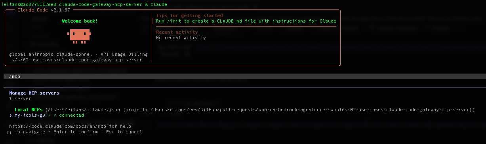
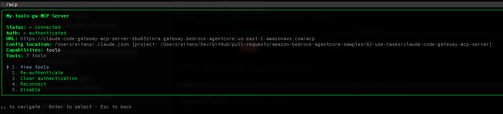
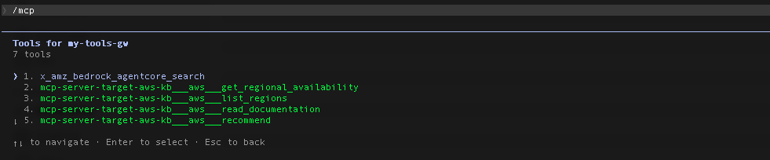

# Integrate Claude Code with MCP Server using AgentCore Gateway

## Overview

[Claude Code](https://docs.anthropic.com/en/docs/claude-code) is Anthropic's agentic coding tool that lives in your terminal and understands your codebase. It connects to external capabilities through MCP servers, but as the number of connected MCP servers grows, two problems emerge:

* **Context window overhead**: Every MCP server Claude Code connects to adds its tool definitions to the context window. With multiple servers, each exposing several tools, the context fills up fast, leaving less room for actual code reasoning and conversation. This directly impacts response quality and cost.
* **Central MCP server need**: In enterprise environments, teams maintain dozens of MCP servers across different domains. Without a central entry point, each developer must individually configure and authenticate against every server, leading to configuration sprawl and inconsistent access.

AgentCore Gateway solves both problems by acting as a **single, central MCP server** that aggregates multiple backend MCP servers behind one endpoint:

* **Dynamic tool loading**: The gateway uses semantic search to surface only the tools relevant to each request, rather than loading all tool definitions upfront. This dramatically reduces context overhead in Claude Code, keeping the context window focused on what matters.
* **One connection, many servers**: Claude Code connects to a single gateway URL instead of N separate MCP servers. The gateway routes requests to the appropriate backend target, simplifying configuration and centralizing authentication.
* **Unified auth and governance**: A single OAuth flow secures access to all backend tools, replacing per-server credential management.

### Solution Architecture

In this architecture, the [AWS Knowledge MCP Server](https://aws.amazon.com/about-aws/whats-new/2025/10/aws-knowledge-mcp-server-generally-available/) is exposed as an MCP target through AgentCore Gateway. Claude Code connects to the gateway using OAuth, enabling developers to securely access and retrieve knowledge in real time, with only the relevant tools loaded into context per request.


### Tutorial Details


| Information          | Details                                                   |
|:---------------------|:----------------------------------------------------------|
| Tutorial type        | Interactive                                               |
| AgentCore components | AgentCore Gateway, AgentCore Identity                     |
| Gateway Target type  | MCP server                                                |
| Inbound Auth IdP     | Amazon Cognito, but can use others                        |
| Tutorial components  | Creating AgentCore Gateway and Invoking AgentCore Gateway from Claude Code |
| Tutorial vertical    | Cross-vertical                                            |
| Example complexity   | Easy                                                      |
| SDK used             | boto3                                                     |

## Tutorial architecture

This tutorial walks through setting up AgentCore Gateway as a **central MCP server for Claude Code**, with dynamic tool loading via semantic search to keep context overhead low.

If you're new to AgentCore Gateway, start with the [MCP Server as a Gateway Target](https://github.com/awslabs/agentcore-samples/blob/main/06-workshops/02-AgentCore-gateway/05-mcp-server-as-a-target/01-mcp-server-target.ipynb) tutorial first — it covers the gateway fundamentals (creating gateways, adding targets, invoking tools) without the Claude Code integration layer.

## Prerequisites

Before running this tutorial, make sure you have the following in place:

**Environment**
* Python 3.10+ with Jupyter notebook (Python kernel)
* [Claude Code](https://docs.anthropic.com/en/docs/claude-code) CLI installed and authenticated (`claude` available in your terminal)

**AWS Account & Permissions**
* AWS credentials configured (via environment variables, AWS CLI profile, or SageMaker notebook role)
* IAM permissions to:
  * Create and manage IAM roles and policies (`iam:CreateRole`, `iam:PutRolePolicy`, `iam:PassRole`)
  * Create and manage Amazon Cognito user pools, resource servers, and app clients (`cognito-idp:*`)
  * Create and manage AgentCore Gateways and targets (`bedrock-agentcore:*`)

**AWS Services Used**
* Amazon Cognito — provides OAuth 2.0 client credentials flow for inbound gateway authorization
* Amazon Bedrock AgentCore Gateway — central MCP endpoint that Claude Code connects to
* AWS IAM — role assumed by the gateway to access backend targets

```python
# Install from the requirements file or pyproject.toml file in current directory
!pip install -U -r requirements.txt --quiet
```

```python
import os

# Set AWS credentials if not using SageMaker notebook
# os.environ['AWS_ACCESS_KEY_ID'] = '' # Set the access key
# os.environ['AWS_SECRET_ACCESS_KEY'] = '' # Set the secret key
os.environ["AWS_DEFAULT_REGION"] = os.environ.get("AWS_REGION", "us-east-1")
```

```python
# Import utils
import os
import utils

# Setup logging
import logging

# Configure logging for notebook environment
logging.basicConfig(
    level=logging.INFO,
    format="%(asctime)s | %(levelname)s | %(name)s | %(message)s",
    handlers=[logging.StreamHandler()],
)

# Set specific logger levels
logging.getLogger("strands").setLevel(logging.INFO)
```

## Create an IAM role for the Gateway to assume

```python
agentcore_gateway_iam_role = utils.create_agentcore_gateway_role("sample-claude-code-mcp-gateway")
print("Agentcore gateway role ARN: ", agentcore_gateway_iam_role["Role"]["Arn"])
```

## Create Amazon Cognito Pool for Inbound authorization to Gateway

AgentCore Gateway supports comprehensive authentication for both inbound (client to gateway) and outbound (gateway to tools) connections. This tutorial uses Amazon Cognito with OAuth 2.0 client credentials, but the gateway is flexible:

**Inbound Auth** (how Claude Code authenticates to the gateway):
* OAuth 2.0 authorization — the client must obtain a token from an OAuth authorizer before calling the gateway
* Identity providers — Amazon Cognito (used here), Auth0, or any OpenID Connect-compatible provider
* Allowed audiences/clients — control which applications can access your gateway

**Outbound Auth** (how the gateway authenticates to backend tools):
* IAM role-based — use the gateway's execution role to access AWS resources like Lambda functions
* API key — securely store and inject API keys for external services
* OAuth — handle token management for external services, including automatic token refresh
* Credential providers — create and manage credential providers for different authentication types

For Claude Code specifically, the inbound flow works like this: you obtain an access token from your IdP (Cognito in this case), then pass it as a `Bearer` token when registering the gateway as an MCP server with `claude mcp add`.

```python
# Creating Cognito User Pool
import os
import boto3

REGION = os.environ["AWS_DEFAULT_REGION"]
USER_POOL_NAME = "sample-agentcore-gateway-pool"
RESOURCE_SERVER_ID = "sample-agentcore-gateway-id"
RESOURCE_SERVER_NAME = "sample-agentcore-gateway-name"
CLIENT_NAME = "sample-agentcore-gateway-client"
SCOPES = [
    {
        "ScopeName": "invoke",  # Just 'invoke', will be formatted as resource_server_id/invoke
        "ScopeDescription": "Scope for invoking the agentcore gateway",
    },
]

scope_names = [f"{RESOURCE_SERVER_ID}/{scope['ScopeName']}" for scope in SCOPES]
scopeString = " ".join(scope_names)


cognito = boto3.client("cognito-idp", region_name=REGION)

print("Creating or retrieving Cognito resources...")
gw_user_pool_id = utils.get_or_create_user_pool(cognito, USER_POOL_NAME)
print(f"User Pool ID: {gw_user_pool_id}")

utils.get_or_create_resource_server(cognito, gw_user_pool_id, RESOURCE_SERVER_ID, RESOURCE_SERVER_NAME, SCOPES)
print("Resource server ensured.")

gw_client_id, gw_client_secret = utils.get_or_create_m2m_client(
    cognito, gw_user_pool_id, CLIENT_NAME, RESOURCE_SERVER_ID, scope_names
)

print(f"Client ID: {gw_client_id}")

# Get discovery URL
gw_cognito_discovery_url = (
    f"https://cognito-idp.{REGION}.amazonaws.com/{gw_user_pool_id}/.well-known/openid-configuration"
)
print(gw_cognito_discovery_url)
```

## Create the Gateway

```python
# CreateGateway with Cognito authorizer. Use the Cognito user pool created in the previous step
import boto3

gateway_client = boto3.client("bedrock-agentcore-control", region_name=REGION)
auth_config = {
    "customJWTAuthorizer": {
        "allowedClients": [
            gw_client_id
        ],  # Client MUST match with the ClientId configured in Cognito. Example: 7rfbikfsm51j2fpaggacgng84g
        "discoveryUrl": gw_cognito_discovery_url,
    }
}
create_response = gateway_client.create_gateway(
    name="claude-code-gateway-mcp-server",
    roleArn=agentcore_gateway_iam_role["Role"][
        "Arn"
    ],  # The IAM Role must have permissions to create/list/get/delete Gateway
    protocolType="MCP",
    protocolConfiguration={"mcp": {"supportedVersions": ["2025-03-26"], "searchType": "SEMANTIC"}},
    authorizerType="CUSTOM_JWT",
    authorizerConfiguration=auth_config,
    description="AgentCore Gateway with MCP Server target",
)
print(create_response)
# Retrieve the GatewayID used for GatewayTarget creation
gatewayID = create_response["gatewayId"]
gatewayURL = create_response["gatewayUrl"]
print(gatewayID)
```

```python
print(gatewayURL)
```

## Create an MCP server as target for AgentCore Gateway

### Create the AWS Knowledge Gateway Target

```python
import boto3

mcp_server_aws_kb_endpoint = "https://knowledge-mcp.global.api.aws"

gateway_client = boto3.client("bedrock-agentcore-control", region_name=REGION)
create_gateway_target_aws_kb_response = gateway_client.create_gateway_target(
    name="mcp-server-target-aws-kb",
    gatewayIdentifier=gatewayID,
    targetConfiguration={"mcp": {"mcpServer": {"endpoint": mcp_server_aws_kb_endpoint}}},
)
print(create_gateway_target_aws_kb_response)
```

#### Check that the Gateway target exists, and is READY

```python
list_targets_response = gateway_client.list_gateway_targets(gatewayIdentifier=gatewayID)
print(list_targets_response)
```

#### Request the access token from Amazon Cognito for inbound authorization

```python
print(
    "Requesting the access token from Amazon Cognito authorizer...May fail for some time till the domain name propagation completes"
)
token_response = utils.get_token(gw_user_pool_id, gw_client_id, gw_client_secret, scopeString, REGION)
token = token_response["access_token"]
print("Token response:", token)
```

### Add the AgentCore Gateway as MCP Server to Claude Code

```python
!claude mcp add --transport http my-tools-gw {gatewayURL}  --header "Authorization: Bearer {token}"
```

#### Check the AgentCore Gateway shows as Connected

```python
!claude mcp list
```

#### Lets check current directory

```python
print(os.getcwd())
```

#### Listing MCP Tools as targets in AgentCore Gateway in Claude Code

- Open Terminal and change directory into the current directory (from the previous cell you run). 
- Run `Claude` to open Claude Code
- Type `/mcp` to view the MCP Tools

  

- Choose `my-tools-gw`

  
- Choose `View tools`

  

- You should see `mcp-server-target-aws-kb___aws___` prefixed tools.

## Clean up
Additional resources are also created like IAM role, IAM Policies, Credentials provider, AWS Lambda functions, Cognito user pools, s3 buckets that you might need to manually delete as part of the clean up. This depends on the example you run.

### Delete the Gateway (Optional)

```python
utils.delete_gateway(gateway_client, gatewayID)
```

### Remove the AgentCore Gateway MCP Server from Claude Code (Optional)

```python
!claude mcp remove my-tools-gw
```
