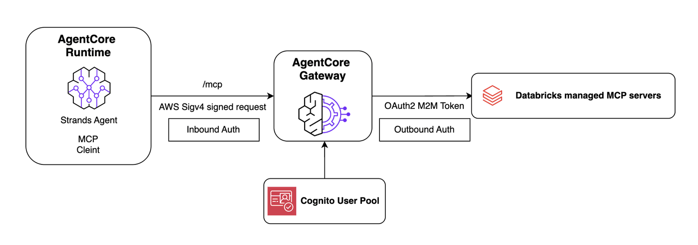
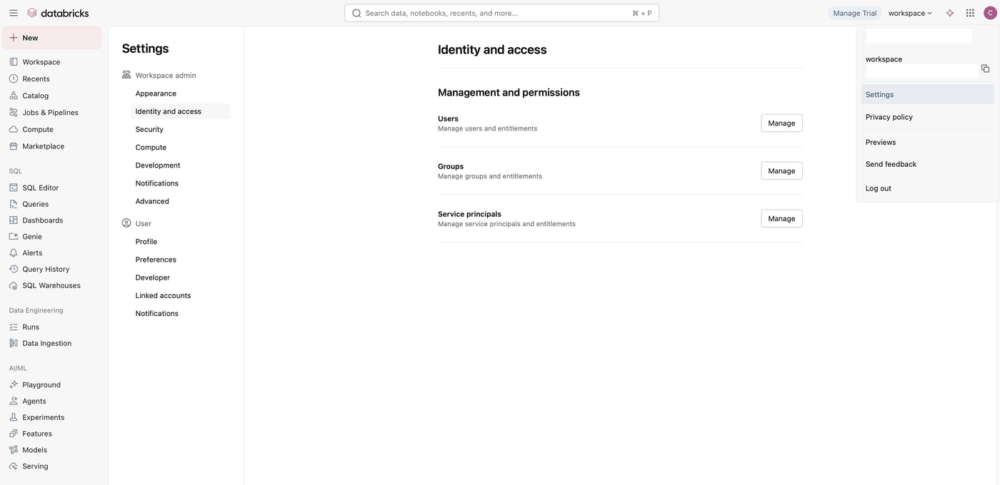
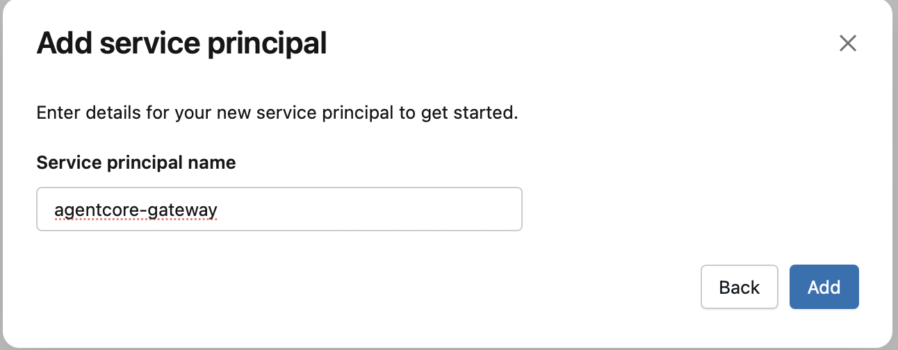
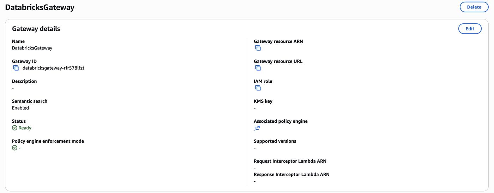

# Databricks SQL MCP Server with Amazon Bedrock AgentCore Gateway

This notebook demonstrates how to connect a [Databricks SQL (DBSQL) MCP server](https://docs.databricks.com/en/generative-ai/mcp/managed-mcp.html) to [Amazon Bedrock AgentCore Gateway](https://docs.aws.amazon.com/bedrock-agentcore/latest/devguide/gateway.html). AgentCore Gateway manages both inbound authentication (via Amazon Cognito) and outbound authentication (via Databricks OAuth2 M2M), so you don't need to write any custom auth code.




By the end of this notebook you will have:
1. Configured Databricks credentials for machine-to-machine (M2M) OAuth
2. Created (or reused) an AgentCore Gateway with Cognito-based inbound auth
3. Set up an OAuth2 credential provider for outbound Databricks auth via AgentCore Identity
4. Added the Databricks DBSQL MCP server as a gateway target
5. Tested the gateway locally with a Strands Agent
6. Deployed the agent to AgentCore Runtime for production use

## Databricks Managed MCP Servers Overview

Databricks provides [managed MCP servers](https://docs.databricks.com/en/generative-ai/mcp/managed-mcp.html) that expose platform capabilities — such as SQL querying, Unity Catalog, vector search, and Genie spaces — as MCP-compatible tools. These servers follow the Streamable HTTP transport and are hosted at endpoints like:

- `https://<workspace-host>/api/2.0/mcp/sql` — Run SQL queries against Unity Catalog tables
- `https://<workspace-host>/api/2.0/mcp/functions/<catalog>/<schema>` — Invoke Unity Catalog functions
- `https://<workspace-host>/api/2.0/mcp/vector-search/<catalog>/<schema>` — Query vector search indexes
- `https://<workspace-host>/api/2.0/mcp/genie/<genie_space_id>` — Interact with Genie spaces

In this notebook we use the **SQL MCP server** (`/api/2.0/mcp/sql`), which lets agents run SQL queries against any table the authenticated principal has access to in Unity Catalog.

## Amazon Bedrock AgentCore Gateway Overview

Amazon Bedrock AgentCore Gateway turns existing APIs and services into fully-managed MCP servers without needing to manage infrastructure or hosting. Gateway employs a dual authentication model:

- **Inbound Auth** — Validates and authorizes users attempting to access gateway targets (e.g., Cognito, Custom JWT)
- **Outbound Auth** — Enables the gateway to securely connect to backend resources on behalf of authenticated users (e.g., OAuth2 M2M via AgentCore Identity)

More details:
- [AgentCore Gateway documentation](https://docs.aws.amazon.com/bedrock-agentcore/latest/devguide/gateway.html)
- [AgentCore Gateway tutorials](https://github.com/awslabs/amazon-bedrock-agentcore-samples/tree/main/06-workshops/02-AgentCore-gateway)

## Prerequisites

Before running this notebook, ensure you have:

1. **AWS credentials** configured (`aws configure`) with permissions to create AgentCore resources, IAM roles, and Cognito user pools
2. **Databricks workspace** with Unity Catalog enabled
3. **Databricks service principal** with an OAuth secret (see [Setting up Databricks credentials](#setting-up-databricks-credentials) below)
4. **Python 3.10+**

```python
%pip install boto3 bedrock-agentcore bedrock-agentcore-starter-toolkit strands-agents strands-agents-tools mcp --quiet
```

## Setting up Databricks Credentials

To authenticate AgentCore Gateway with your Databricks workspace, you need a **service principal** with an OAuth secret. This enables machine-to-machine (M2M) authentication using the OAuth2 client credentials flow.

### Step 1: Create a Service Principal

1. In your Databricks workspace, go to **Settings** → **Identity and access** → **Service principals**



2. Click **Add service principal** and provide a name (e.g., `agentcore-gateway`)



3. After creation, note the **Application ID** — this is your `client_id`

### Step 2: Generate an OAuth Secret

1. Select the service principal you just created
2. Go to the **Secrets** tab and click **Generate secret**
3. Copy the **Secret** value immediately — it will not be shown again. This is your `client_secret`

### Step 3: Grant Permissions

Ensure the service principal has access to the Unity Catalog tables you want to query:

1. Go to **Catalog** → select your catalog/schema → **Permissions**
2. Grant `USE CATALOG`, `USE SCHEMA`, and `SELECT` permissions to the service principal

For more details, see the [Databricks OAuth M2M authentication documentation](https://docs.databricks.com/en/dev-tools/auth/oauth-m2m.html).

### Databricks Managed MCP Server Configuration

Databricks managed MCP servers are available out of the box — no additional setup is required beyond authentication. The SQL MCP server endpoint is:

```
https://<your-workspace-host>/api/2.0/mcp/sql
```

For a full list of available managed MCP servers and configuration options, see the [Databricks managed MCP documentation](https://docs.databricks.com/en/generative-ai/mcp/managed-mcp.html).

## Step 1: Configure Your Environment

Set your Databricks workspace host and service principal credentials. Replace the placeholder values below with your actual credentials.

```python
import os

# Databricks workspace URL (e.g., https://dbc-xxxxxxxx-xxxx.cloud.databricks.com)
DATABRICKS_HOST = ""

# Service principal credentials from the steps above
DATABRICKS_CLIENT_ID = ""  # Application ID of the service principal
DATABRICKS_CLIENT_SECRET = ""  # OAuth secret you generated

# AWS region for AgentCore resources
REGION = "us-east-1"

assert DATABRICKS_HOST != "https://REPLACE_ME.cloud.databricks.com", "Please set your Databricks workspace host"
assert DATABRICKS_CLIENT_ID != "REPLACE_ME", "Please set your Databricks client ID"
assert DATABRICKS_CLIENT_SECRET != "REPLACE_ME", "Please set your Databricks client secret"
```

```python
import json
import time
import logging

import boto3
from boto3.session import Session
from bedrock_agentcore_starter_toolkit.operations.gateway.client import GatewayClient

boto_session = Session()
sts = boto3.client("sts")
account_id = sts.get_caller_identity().get("Account")
agentcore = boto3.client("bedrock-agentcore-control", region_name=REGION)

print(f"AWS Account: {account_id}")
print(f"Region: {REGION}")
```

## Step 2: Create or Reuse an AgentCore Gateway

You have two options:
- **Option A**: Create a new gateway from scratch (run the cells in this section)
- **Option B**: Reuse an existing gateway by loading its configuration from `gateway_config.json`

If you already have a gateway deployed (e.g., from a previous run or from the standalone `setup.py` script), skip to **Option B** below.

### Option A: Create a New Gateway

```python
client = GatewayClient(region_name=REGION)
client.logger.setLevel(logging.INFO)

# Create Cognito authorizer for inbound authentication
print("Creating Cognito authorizer (inbound auth)...")
cognito = client.create_oauth_authorizer_with_cognito("DatabricksGateway")

# Create the MCP gateway
print("Creating Gateway...")
gateway = client.create_mcp_gateway(
    name="DatabricksGateway",
    role_arn=None,
    authorizer_config=cognito["authorizer_config"],
    enable_semantic_search=True,
)
client.fix_iam_permissions(gateway)

gateway_url = gateway["gatewayUrl"]
gateway_id = gateway["gatewayId"]

print(f"Gateway URL: {gateway_url}")
print(f"Gateway ID: {gateway_id}")
print("Waiting 30s for IAM propagation...")
time.sleep(30)
```



#### Create Databricks OAuth2 Credential Provider (Outbound Auth)

AgentCore Identity manages the outbound OAuth2 credentials so the gateway can authenticate with Databricks on behalf of your agent. We create a credential provider that stores the service principal's client ID and secret, and uses the Databricks OIDC token endpoint.

```python
host = DATABRICKS_HOST.rstrip("/")
token_endpoint = f"{host}/oidc/v1/token"

print("Creating Databricks OAuth2 credential provider...")
cred_provider = agentcore.create_oauth2_credential_provider(
    name="databricks-dbsql-oauth",
    credentialProviderVendor="CustomOauth2",
    oauth2ProviderConfigInput={
        "customOauth2ProviderConfig": {
            "oauthDiscovery": {
                "authorizationServerMetadata": {
                    "issuer": host,
                    "tokenEndpoint": token_endpoint,
                    "authorizationEndpoint": token_endpoint,
                }
            },
            "clientId": DATABRICKS_CLIENT_ID,
            "clientSecret": DATABRICKS_CLIENT_SECRET,
        }
    },
)

provider_arn = cred_provider["credentialProviderArn"]
secret_arn = cred_provider.get("secretArn") or cred_provider.get("clientSecretArn", {}).get("secretArn", "")
print(f"Credential provider ARN: {provider_arn}")
```

#### Update Gateway Role Permissions

The gateway's IAM role needs permissions to fetch workload access tokens, retrieve OAuth2 tokens from the credential provider, and read the stored secret.

```python
print("Updating gateway role permissions...")
gateway_details = agentcore.get_gateway(gatewayIdentifier=gateway_id)
role_arn = gateway_details["roleArn"]
role_name = role_arn.split("/")[-1]

iam = boto3.client("iam")
policy_doc = json.dumps(
    {
        "Version": "2012-10-17",
        "Statement": [
            {
                "Effect": "Allow",
                "Action": "bedrock-agentcore:GetWorkloadAccessToken",
                "Resource": [
                    f"arn:aws:bedrock-agentcore:{REGION}:*:workload-identity-directory/default",
                    f"arn:aws:bedrock-agentcore:{REGION}:*:workload-identity-directory/default/workload-identity/DatabricksGateway-*",
                ],
            },
            {
                "Effect": "Allow",
                "Action": "bedrock-agentcore:GetResourceOauth2Token",
                "Resource": provider_arn,
            },
            {
                "Effect": "Allow",
                "Action": "secretsmanager:GetSecretValue",
                "Resource": secret_arn,
            },
        ],
    }
)

iam.put_role_policy(
    RoleName=role_name,
    PolicyName="DatabricksOAuthAccess",
    PolicyDocument=policy_doc,
)
print(f"Updated role: {role_name}")
time.sleep(10)
```

#### Add Databricks DBSQL MCP Server as Gateway Target

Now we register the Databricks SQL MCP server as a target on the gateway. The gateway will use the OAuth2 credential provider we created to authenticate outbound requests to Databricks.

```python
mcp_url = f"{host}/api/2.0/mcp/sql"

print(f"Adding Databricks DBSQL MCP server target: {mcp_url}")
target = agentcore.create_gateway_target(
    gatewayIdentifier=gateway_id,
    name="DatabricksDBSQL",
    description="Databricks SQL MCP server - run SQL queries against Unity Catalog",
    targetConfiguration={
        "mcp": {
            "mcpServer": {
                "endpoint": mcp_url,
            }
        }
    },
    credentialProviderConfigurations=[
        {
            "credentialProviderType": "OAUTH",
            "credentialProvider": {
                "oauthCredentialProvider": {
                    "providerArn": provider_arn,
                    "grantType": "CLIENT_CREDENTIALS",
                    "scopes": ["all-apis"],
                }
            },
        }
    ],
)

target_id = target["targetId"]
print(f"Target ID: {target_id}")
```

```python
# Wait for the target to become ready
print("Waiting for target to be ready...")
for _ in range(24):
    t = agentcore.get_gateway_target(gatewayIdentifier=gateway_id, targetId=target_id)
    if t.get("status") not in ("Creating", "Updating"):
        break
    time.sleep(5)
print(f"Target status: {t.get('status')}")

# Synchronize tools from the Databricks MCP server
print("Synchronizing tools from Databricks...")
agentcore.synchronize_gateway_targets(
    gatewayIdentifier=gateway_id,
    targetIdList=[target_id],
)
print("Tools synchronized.")
```

#### Save Configuration

Save the gateway configuration to a JSON file. This file is used by both the local test agent and the AgentCore Runtime deployment.

```python
config = {
    "gateway_url": gateway_url,
    "gateway_id": gateway_id,
    "target_id": target_id,
    "region": REGION,
    "client_info": cognito["client_info"],
    "databricks_host": host,
}

with open("gateway_config.json", "w") as f:
    json.dump(config, f, indent=2)

print("Configuration saved to gateway_config.json")
print(json.dumps(config, indent=2))
```

### Option B: Reuse an Existing Gateway

If you already have a gateway deployed, load the configuration from `gateway_config.json`. This file is produced by either Option A above or the standalone `setup.py` script.

```python
# Load existing gateway configuration
with open("gateway_config.json") as f:
    config = json.load(f)

gateway_url = config["gateway_url"]
gateway_id = config["gateway_id"]
target_id = config["target_id"]
REGION = config["region"]
host = config["databricks_host"]

client = GatewayClient(region_name=REGION)
agentcore = boto3.client("bedrock-agentcore-control", region_name=REGION)

print(f"Loaded existing gateway: {gateway_id}")
print(f"Gateway URL: {gateway_url}")
print(f"Databricks host: {host}")
```

---
## Step 3: Test the Gateway Locally with a Strands Agent

Before deploying to AgentCore Runtime, let's verify the gateway works by running a Strands Agent locally.

### Get an Access Token

Obtain a Cognito access token to authenticate with the gateway.

```python
token = client.get_access_token_for_cognito(config["client_info"])
print("Access token obtained.")
```

### Connect MCP Client and List Available Tools

Create an MCP client pointing at the gateway URL and list the tools synchronized from the Databricks DBSQL MCP server.

```python
from mcp.client.streamable_http import streamablehttp_client
from strands.tools.mcp import MCPClient

mcp_client = MCPClient(
    lambda: streamablehttp_client(
        gateway_url,
        headers={"Authorization": f"Bearer {token}"},
    )
)

mcp_client.start()
tools = mcp_client.list_tools_sync()
print(f"Available tools: {[t.tool_name for t in tools]}")
```

### Create and Run the Agent Locally

```python
from strands import Agent
from strands.models import BedrockModel

agent = Agent(
    model=BedrockModel(model_id="us.anthropic.claude-sonnet-4-20250514-v1:0"),
    tools=tools,
    system_prompt="You query Databricks SQL via Unity Catalog. Be concise and return results in a readable format.",
)
```

### Run a Sample Query

Try asking the agent to list available catalogs or query a table. Adjust the prompt below to match your Unity Catalog setup.

```python
response = agent("List all available catalogs in this Databricks workspace.")
print(f"\nAgent: {response}")
```

```python
# Try a more specific query — adjust to match your tables
response = agent("Show me the first 5 rows from the default catalog.")
print(f"\nAgent: {response}")
```

```python
mcp_client.stop()
print("MCP client stopped.")
```

---
## Step 4: Deploy the Agent to AgentCore Runtime

Now that we've verified the gateway works locally, let's deploy the Strands Agent to [Amazon Bedrock AgentCore Runtime](https://docs.aws.amazon.com/bedrock-agentcore/latest/devguide/runtime.html) for production use. AgentCore Runtime provides a secure, serverless environment with automatic scaling and session management.

The deployment uses the AgentCore Runtime SDK (`bedrock-agentcore`) to wrap our agent as an HTTP service, and the starter toolkit CLI (`agentcore`) to build, containerize, and deploy it.

### Create the Agent Entrypoint

We write a `databricks_agent.py` file that:
1. Loads the gateway configuration
2. Obtains a Cognito access token
3. Connects to the gateway via MCP
4. Creates a Strands Agent with the gateway tools
5. Exposes it as an AgentCore Runtime entrypoint

```python
%%writefile databricks_agent.py
"""
Strands Agent deployed on AgentCore Runtime that queries Databricks SQL
through AgentCore Gateway.

The gateway handles all auth complexity:
  - Inbound: Cognito JWT validates agent requests
  - Outbound: OAuth2 M2M authenticates with Databricks
"""

import json
import os

from strands import Agent
from strands.models import BedrockModel
from strands.tools.mcp import MCPClient
from mcp.client.streamable_http import streamablehttp_client
from bedrock_agentcore.runtime import BedrockAgentCoreApp
from bedrock_agentcore_starter_toolkit.operations.gateway.client import GatewayClient

app = BedrockAgentCoreApp()

# Load gateway configuration
with open("gateway_config.json") as f:
    config = json.load(f)

gw_client = GatewayClient(region_name=config["region"])


def _get_tools():
    """Get MCP tools from the gateway."""
    token = gw_client.get_access_token_for_cognito(config["client_info"])
    mcp = MCPClient(
        lambda: streamablehttp_client(
            config["gateway_url"],
            headers={"Authorization": f"Bearer {token}"},
        )
    )
    mcp.start()
    return mcp, mcp.list_tools_sync()


# Initialize MCP client and tools at startup
mcp_client, tools = _get_tools()
print(f"Loaded {len(tools)} tools from gateway")


@app.entrypoint
def invoke(payload, context):
    """AgentCore Runtime entrypoint."""
    agent = Agent(
        model=BedrockModel(model_id="us.anthropic.claude-sonnet-4-20250514-v1:0"),
        tools=tools,
        system_prompt="You query Databricks SQL via Unity Catalog. Be concise and return results in a readable format.",
    )
    prompt = payload.get("prompt", "List available catalogs.")
    result = agent(prompt)
    return {"response": result.message.get("content", [{}])[0].get("text", str(result))}


if __name__ == "__main__":
    app.run()
```

### Create the Requirements File

```python
%%writefile requirements.txt
strands-agents
strands-agents-tools
bedrock-agentcore
bedrock-agentcore-starter-toolkit
mcp
boto3
```

### Configure and Deploy with the AgentCore CLI

Use the AgentCore starter toolkit CLI to configure and deploy the agent. The CLI handles container image building, ECR push, IAM role creation, and runtime deployment.

Run the following commands in your terminal (not in the notebook):

```bash
# Configure the agent — press Enter to auto-create roles and ECR repo
agentcore configure -e databricks_agent.py

# Deploy to AgentCore Runtime
agentcore deploy
```

The deployment takes a few minutes. Once complete, you'll see the agent's ARN in the output.

### Check Deployment Status

```python
# You can also check status programmatically
import subprocess

result = subprocess.run(["agentcore", "status"], capture_output=True, text=True)
print(result.stdout)
```

`[SCREENSHOT PLACEHOLDER: agentcore-status-output.png — Output of agentcore status showing the deployed agent details]`

### Test the Deployed Agent

Once deployed, invoke the agent using the AgentCore CLI or the boto3 SDK.

#### Option A: Test with the AgentCore CLI

```bash
agentcore invoke '{"prompt": "List all available catalogs in this Databricks workspace."}'
```

#### Option B: Test with boto3

```python
import boto3
import json

# Read the agent ARN from the AgentCore config
import yaml

with open(".bedrock_agentcore.yaml") as f:
    ac_config = yaml.safe_load(f)
agent_arn = ac_config.get("agent_runtime_arn", "")

if agent_arn:
    runtime_client = boto3.client("bedrock-agentcore", region_name=REGION)
    response = runtime_client.invoke_agent_runtime(
        agentRuntimeArn=agent_arn,
        runtimeSessionId="databricks-test-session-123456789012345",  # Must be 33+ chars
        payload=json.dumps({"prompt": "List all available catalogs."}).encode(),
        qualifier="DEFAULT",
    )
    response_body = response["response"].read()
    response_data = json.loads(response_body)
    print("Agent Response:", json.dumps(response_data, indent=2))
else:
    print("Agent ARN not found. Run agentcore deploy first.")
```

`[SCREENSHOT PLACEHOLDER: runtime-query-output.png — Agent response from AgentCore Runtime showing Databricks query results]`

## Conclusion

In this notebook we learned how to:
- Set up a Databricks service principal with OAuth credentials for M2M authentication
- Create an Amazon Bedrock AgentCore Gateway with Cognito-based inbound auth (or reuse an existing one)
- Configure an OAuth2 credential provider via AgentCore Identity for outbound Databricks auth
- Register the Databricks SQL MCP server as a gateway target and synchronize tools
- Test the agent locally with a Strands Agent
- Deploy the agent to AgentCore Runtime for production use

The gateway handles all authentication complexity — your agent code only needs a bearer token to access any tools exposed through the gateway. AgentCore Runtime provides secure, serverless hosting with automatic scaling.

## Cleanup

Run the cells below to delete all resources created in this notebook.

#### Destroy the AgentCore Runtime deployment

```bash
agentcore destroy
```

This removes the runtime endpoint, ECR repository, and IAM roles created by the CLI.

#### Delete the gateway target

```python
agentcore.delete_gateway_target(gatewayIdentifier=gateway_id, targetId=target_id)
print(f"Deleted target: {target_id}")
```

#### Delete the gateway and Cognito resources

```python
client.cleanup_gateway(gateway_id, config["client_info"])
print(f"Deleted gateway: {gateway_id}")
```

#### Delete the OAuth credential provider

```python
try:
    agentcore.delete_oauth2_credential_provider(name="databricks-dbsql-oauth")
    print("Deleted OAuth credential provider.")
except Exception as e:
    print(f"Could not delete credential provider: {e}")
```

#### Clean up the inline IAM policy

```python
try:
    gateway_details = agentcore.get_gateway(gatewayIdentifier=gateway_id)
    role_name = gateway_details["roleArn"].split("/")[-1]
    iam_client = boto3.client("iam")
    iam_client.delete_role_policy(
        RoleName=role_name,
        PolicyName="DatabricksOAuthAccess",
    )
    print(f"Deleted inline policy from role: {role_name}")
except Exception as e:
    print(f"Could not delete inline policy: {e}")

print("Cleanup complete.")
```

#### Remove generated files

```python
for f in [
    "databricks_agent.py",
    "requirements.txt",
    "gateway_config.json",
    ".bedrock_agentcore.yaml",
]:
    if os.path.exists(f):
        os.remove(f)
        print(f"Removed {f}")
```
