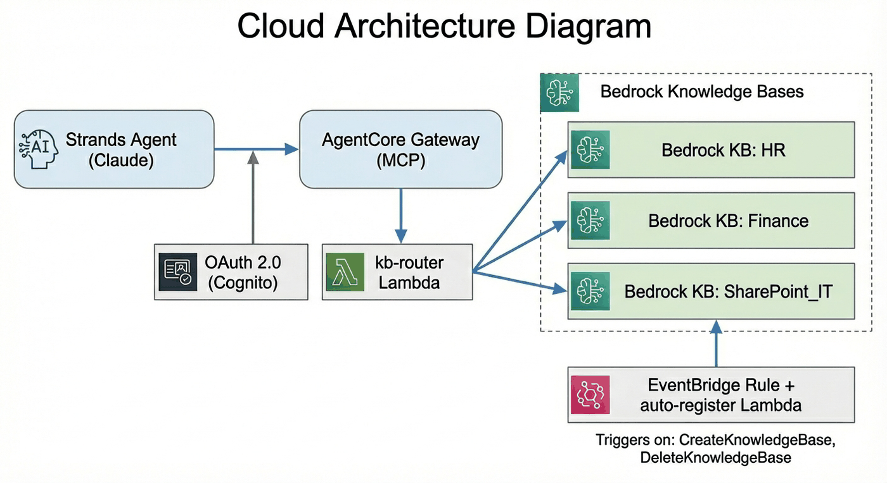

# Auto-Register Bedrock Knowledge Bases on AgentCore Gateway

Build a self-registering Knowledge Base gateway: when a new Bedrock Knowledge Base is created anywhere in the account, it automatically appears as an MCP tool on the AgentCore Gateway. Deleted KBs are automatically removed.



## How It Works

1. Deploy a Lambda function that routes MCP tool calls to the correct Bedrock Knowledge Base
2. Create an AgentCore Gateway with the Lambda as a target (starts with zero tools)
3. Deploy an EventBridge rule that watches for KB create/delete API calls via CloudTrail
4. When a KB is created, an auto-register Lambda adds it to the gateway's tool schema
5. When a KB is deleted, the tool is removed automatically
6. A Strands Agent connects to the gateway and discovers all available KB tools dynamically

## Prerequisites

Before running this notebook, ensure you have:

1. **AWS credentials** configured (`aws configure`) with permissions to create AgentCore resources, Lambda functions, IAM roles, EventBridge rules, and Cognito user pools
2. **CloudTrail** enabled in the account (required for EventBridge to detect KB lifecycle events)
3. **Bedrock model access** enabled for Claude Sonnet 4 and Titan Embeddings v2
4. **Python 3.10+**

```python
%pip install boto3 bedrock-agentcore-starter-toolkit strands-agents strands-agents-tools mcp httpx --quiet
```

## Step 1: Configure Your Environment

Set the AWS region and gateway name for the deployment.

```python
import os
import json
import time
import io
import zipfile
import logging

import boto3
import httpx

REGION = "us-east-1"
GATEWAY_NAME = "kb-gateway"

sts = boto3.client("sts", region_name=REGION)
ACCOUNT_ID = sts.get_caller_identity()["Account"]

print(f"AWS Account: {ACCOUNT_ID}")
print(f"Region: {REGION}")
print(f"Gateway Name: {GATEWAY_NAME}")
```

## Step 2: Deploy the KB Router Lambda

This Lambda function receives MCP tool calls from the gateway and routes them to the correct Bedrock Knowledge Base. It reads a `KB_CONFIG` environment variable to know which tool name maps to which KB ID.

We start with an empty config — the auto-register Lambda will populate it as KBs are created.

### Create the IAM Role

```python
ROUTER_FUNCTION_NAME = "agentcore-kb-router"
ROUTER_ROLE_NAME = "agentcore-kb-router-role"

iam = boto3.client("iam", region_name=REGION)

# Create the Lambda execution role
trust_policy = {
    "Version": "2012-10-17",
    "Statement": [
        {
            "Effect": "Allow",
            "Principal": {"Service": "lambda.amazonaws.com"},
            "Action": "sts:AssumeRole",
        }
    ],
}

try:
    role = iam.get_role(RoleName=ROUTER_ROLE_NAME)
    router_role_arn = role["Role"]["Arn"]
    print(f"Using existing role: {ROUTER_ROLE_NAME}")
except iam.exceptions.NoSuchEntityException:
    role = iam.create_role(
        RoleName=ROUTER_ROLE_NAME,
        AssumeRolePolicyDocument=json.dumps(trust_policy),
        Description="Role for AgentCore KB Router Lambda",
    )
    router_role_arn = role["Role"]["Arn"]
    print(f"Created role: {ROUTER_ROLE_NAME}")

# Attach basic Lambda execution policy
iam.attach_role_policy(
    RoleName=ROUTER_ROLE_NAME,
    PolicyArn="arn:aws:iam::aws:policy/service-role/AWSLambdaBasicExecutionRole",
)

# Inline policy for Bedrock KB access
iam.put_role_policy(
    RoleName=ROUTER_ROLE_NAME,
    PolicyName="bedrock-kb-access",
    PolicyDocument=json.dumps(
        {
            "Version": "2012-10-17",
            "Statement": [
                {
                    "Effect": "Allow",
                    "Action": [
                        "bedrock:RetrieveAndGenerate",
                        "bedrock:Retrieve",
                        "bedrock:InvokeModel",
                    ],
                    "Resource": "*",
                }
            ],
        }
    ),
)

print(f"Role ARN: {router_role_arn}")
print("Waiting 10s for IAM propagation...")
time.sleep(10)
```

### Deploy the Lambda Function

The router Lambda receives the tool call event from the gateway, looks up the KB ID from its routing table, and calls the Bedrock `RetrieveAndGenerate` or `Retrieve` API.

```python
%%writefile lambda_function.py
"""
Lambda that routes AgentCore Gateway tool calls to Bedrock Knowledge Bases.
The KB_CONFIG env var maps tool names to KB IDs.
"""

import json
import os
import logging
import boto3

logger = logging.getLogger()
logger.setLevel(logging.INFO)

bedrock_agent_runtime = boto3.client(
    "bedrock-agent-runtime",
    region_name=os.environ.get("AWS_REGION", "us-east-1"),
)

KB_ROUTING_TABLE = {}


def _load_kb_config():
    global KB_ROUTING_TABLE
    raw = os.environ.get("KB_CONFIG", "[]")
    try:
        for entry in json.loads(raw):
            KB_ROUTING_TABLE[entry["tool_name"]] = {
                "kb_id": entry["kb_id"],
                "model_id": entry.get("model_id", "anthropic.claude-sonnet-4-20250514"),
            }
        logger.info("Loaded %d KB routes: %s", len(KB_ROUTING_TABLE), list(KB_ROUTING_TABLE.keys()))
    except Exception as e:
        logger.error("Failed to parse KB_CONFIG: %s", e)


_load_kb_config()


def handler(event, context):
    logger.info("Received event: %s", json.dumps(event))

    tool_name = event.get("tool_name", "")
    query = event.get("query", "")
    mode = event.get("mode", "retrieve_and_generate")
    max_results = event.get("max_results", 5)

    if not query:
        return {"error": "Missing required parameter: query"}

    kb_config = KB_ROUTING_TABLE.get(tool_name)
    if not kb_config:
        return {"error": f"Unknown tool: \'{tool_name}\'. Available: {list(KB_ROUTING_TABLE.keys())}"}

    kb_id = kb_config["kb_id"]
    model_id = kb_config["model_id"]
    region = os.environ.get("AWS_REGION", "us-east-1")

    try:
        if mode == "retrieve":
            response = bedrock_agent_runtime.retrieve(
                knowledgeBaseId=kb_id,
                retrievalQuery={"text": query},
                retrievalConfiguration={"vectorSearchConfiguration": {"numberOfResults": max_results}},
            )
            results = []
            for r in response.get("retrievalResults", []):
                loc = r.get("location", {})
                results.append({
                    "content": r.get("content", {}).get("text", ""),
                    "source": loc.get("s3Location", {}).get("uri", "unknown"),
                    "score": r.get("score", 0),
                })
            return {"results": results}
        else:
            model_arn = f"arn:aws:bedrock:{region}::foundation-model/{model_id}"
            response = bedrock_agent_runtime.retrieve_and_generate(
                input={"text": query},
                retrieveAndGenerateConfiguration={
                    "type": "KNOWLEDGE_BASE",
                    "knowledgeBaseConfiguration": {
                        "knowledgeBaseId": kb_id,
                        "modelArn": model_arn,
                    },
                },
            )
            output_text = response.get("output", {}).get("text", "")
            citations = []
            for c in response.get("citations", []):
                for ref in c.get("retrievedReferences", []):
                    loc = ref.get("location", {})
                    citations.append({
                        "source": loc.get("s3Location", {}).get("uri", "unknown"),
                        "snippet": ref.get("content", {}).get("text", "")[:200],
                    })
            return {"answer": output_text, "citations": citations}
    except Exception as e:
        logger.error("Error querying KB %s: %s", kb_id, str(e))
        return {"error": f"Failed to query knowledge base: {str(e)}"}
```

```python
# Package and deploy the Lambda
buf = io.BytesIO()
with zipfile.ZipFile(buf, "w", zipfile.ZIP_DEFLATED) as zf:
    zf.write("lambda_function.py", "lambda_function.py")
zip_bytes = buf.getvalue()

lambda_client = boto3.client("lambda", region_name=REGION)

try:
    lambda_client.update_function_code(FunctionName=ROUTER_FUNCTION_NAME, ZipFile=zip_bytes)
    waiter = lambda_client.get_waiter("function_updated_v2")
    waiter.wait(FunctionName=ROUTER_FUNCTION_NAME)
    lambda_client.update_function_configuration(
        FunctionName=ROUTER_FUNCTION_NAME,
        Environment={"Variables": {"KB_CONFIG": "[]"}},
        Timeout=60,
    )
    print(f"Updated existing Lambda: {ROUTER_FUNCTION_NAME}")
except lambda_client.exceptions.ResourceNotFoundException:
    response = lambda_client.create_function(
        FunctionName=ROUTER_FUNCTION_NAME,
        Runtime="python3.12",
        Role=router_role_arn,
        Handler="lambda_function.handler",
        Code={"ZipFile": zip_bytes},
        Timeout=60,
        MemorySize=256,
        Environment={"Variables": {"KB_CONFIG": "[]"}},
        Description="Routes AgentCore Gateway tool calls to Bedrock Knowledge Bases",
    )
    print(f"Created Lambda: {response['FunctionArn']}")

func = lambda_client.get_function(FunctionName=ROUTER_FUNCTION_NAME)
router_lambda_arn = func["Configuration"]["FunctionArn"]
print(f"Lambda ARN: {router_lambda_arn}")
```

## Step 3: Create the AgentCore Gateway

Create an AgentCore Gateway with Cognito-based inbound authentication and register the KB router Lambda as a target. The gateway starts with an empty tool schema — tools are added automatically as Knowledge Bases are created.

```python
from bedrock_agentcore_starter_toolkit.operations.gateway.client import GatewayClient

client = GatewayClient(region_name=REGION)
client.logger.setLevel(logging.INFO)

# Create Cognito authorizer for inbound authentication
print("Creating Cognito authorizer (inbound auth)...")
cognito = client.create_oauth_authorizer_with_cognito(GATEWAY_NAME)

# Create the MCP gateway
print("Creating Gateway...")
gateway = client.create_mcp_gateway(
    name=GATEWAY_NAME,
    role_arn=None,
    authorizer_config=cognito["authorizer_config"],
    enable_semantic_search=True,
)
client.fix_iam_permissions(gateway)

gateway_url = gateway["gatewayUrl"]
gateway_id = gateway["gatewayId"]

print(f"Gateway URL: {gateway_url}")
print(f"Gateway ID: {gateway_id}")
print("Waiting 30s for IAM propagation...")
time.sleep(30)
```

### Add the Lambda Target

Register the KB router Lambda as a gateway target with an empty tool schema.

```python
print("Adding Lambda target (empty tool schema — KBs auto-register)...")
lambda_target = client.create_mcp_gateway_target(
    gateway=gateway,
    name="kb-router-lambda",
    target_type="lambda",
    target_payload={
        "lambdaArn": router_lambda_arn,
        "toolSchema": {"inlinePayload": []},
    },
    credentials=None,
)
print("Lambda target added.")
```

### Save Configuration

Save the gateway configuration to a JSON file for use by the agent and auto-register Lambda.

```python
config = {
    "gateway_url": gateway_url,
    "gateway_id": gateway_id,
    "region": REGION,
    "client_info": cognito["client_info"],
    "tools": [],
}

with open("gateway_config.json", "w") as f:
    json.dump(config, f, indent=2)

print("Configuration saved to gateway_config.json")
print(json.dumps(config, indent=2))
```

## Step 4: Deploy the Auto-Registration Automation

This is the key piece: an EventBridge rule watches for `CreateKnowledgeBase` and `DeleteKnowledgeBase` API calls via CloudTrail, and triggers a Lambda that:

1. Fetches the KB name and description from the Bedrock API
2. Adds/removes it from the router Lambda's `KB_CONFIG` environment variable
3. Updates the gateway target's tool schema with the new/removed tool

### Create the Auto-Register IAM Role

```python
AUTO_FUNCTION_NAME = "agentcore-kb-auto-register"
AUTO_ROLE_NAME = "agentcore-kb-auto-register-role"
RULE_NAME = "bedrock-kb-lifecycle-events"

try:
    role = iam.get_role(RoleName=AUTO_ROLE_NAME)
    auto_role_arn = role["Role"]["Arn"]
    print(f"Using existing role: {AUTO_ROLE_NAME}")
except iam.exceptions.NoSuchEntityException:
    role = iam.create_role(
        RoleName=AUTO_ROLE_NAME,
        AssumeRolePolicyDocument=json.dumps(
            {
                "Version": "2012-10-17",
                "Statement": [
                    {
                        "Effect": "Allow",
                        "Principal": {"Service": "lambda.amazonaws.com"},
                        "Action": "sts:AssumeRole",
                    }
                ],
            }
        ),
        Description="Role for KB auto-registration Lambda",
    )
    auto_role_arn = role["Role"]["Arn"]
    print(f"Created role: {AUTO_ROLE_NAME}")

iam.attach_role_policy(
    RoleName=AUTO_ROLE_NAME,
    PolicyArn="arn:aws:iam::aws:policy/service-role/AWSLambdaBasicExecutionRole",
)

iam.put_role_policy(
    RoleName=AUTO_ROLE_NAME,
    PolicyName="auto-register-permissions",
    PolicyDocument=json.dumps(
        {
            "Version": "2012-10-17",
            "Statement": [
                {
                    "Effect": "Allow",
                    "Action": [
                        "lambda:GetFunctionConfiguration",
                        "lambda:UpdateFunctionConfiguration",
                    ],
                    "Resource": f"arn:aws:lambda:{REGION}:{ACCOUNT_ID}:function:{ROUTER_FUNCTION_NAME}",
                },
                {
                    "Effect": "Allow",
                    "Action": [
                        "bedrock-agentcore:ListGatewayTargets",
                        "bedrock-agentcore:GetGatewayTarget",
                        "bedrock-agentcore:UpdateGatewayTarget",
                    ],
                    "Resource": "*",
                },
                {
                    "Effect": "Allow",
                    "Action": ["bedrock:GetKnowledgeBase"],
                    "Resource": "*",
                },
            ],
        }
    ),
)

print(f"Role ARN: {auto_role_arn}")
print("Waiting 10s for IAM propagation...")
time.sleep(10)
```

### Deploy the Auto-Register Lambda

This Lambda is triggered by EventBridge when a Knowledge Base is created or deleted. It updates both the router Lambda's configuration and the gateway's tool schema.

```python
%%writefile auto_register_handler.py
"""
EventBridge-triggered Lambda that auto-registers/unregisters Bedrock Knowledge Bases
as tools on the AgentCore Gateway.
"""

import json
import os
import logging
import boto3

logger = logging.getLogger()
logger.setLevel(logging.INFO)

REGION = os.environ["AWS_REGION"]
GATEWAY_ID = os.environ["GATEWAY_ID"]
ROUTER_LAMBDA_NAME = os.environ["ROUTER_LAMBDA_NAME"]
MODEL_ID = os.environ.get("DEFAULT_MODEL_ID", "anthropic.claude-sonnet-4-20250514")

lambda_client = boto3.client("lambda", region_name=REGION)
agentcore_client = boto3.client("bedrock-agentcore-control", region_name=REGION)
bedrock_client = boto3.client("bedrock-agent", region_name=REGION)


def _get_current_kb_config():
    func = lambda_client.get_function_configuration(FunctionName=ROUTER_LAMBDA_NAME)
    raw = func.get("Environment", {}).get("Variables", {}).get("KB_CONFIG", "[]")
    return json.loads(raw)


def _update_router_lambda(kb_config):
    func = lambda_client.get_function_configuration(FunctionName=ROUTER_LAMBDA_NAME)
    env_vars = func.get("Environment", {}).get("Variables", {})
    env_vars["KB_CONFIG"] = json.dumps(kb_config)
    lambda_client.update_function_configuration(
        FunctionName=ROUTER_LAMBDA_NAME,
        Environment={"Variables": env_vars},
    )
    logger.info("Updated router Lambda KB_CONFIG with %d entries", len(kb_config))


def _build_tool_schema(kb_config):
    tools = []
    for entry in kb_config:
        tools.append({
            "name": entry["tool_name"],
            "description": entry.get("description", f"Query the {entry['tool_name']} knowledge base."),
            "inputSchema": {
                "type": "object",
                "properties": {
                    "tool_name": {
                        "type": "string",
                        "description": f"Must be \'{entry['tool_name']}\'. Used for internal routing.",
                    },
                    "query": {
                        "type": "string",
                        "description": "The natural language question to search the knowledge base with.",
                    },
                    "mode": {
                        "type": "string",
                        "description": "Either \'retrieve_and_generate\' (default) or \'retrieve\' (raw chunks).",
                    },
                    "max_results": {
                        "type": "integer",
                        "description": "Max chunks in \'retrieve\' mode. Default 5.",
                    },
                },
                "required": ["tool_name", "query"],
            },
        })
    return tools


def _find_lambda_target():
    targets = agentcore_client.list_gateway_targets(gatewayIdentifier=GATEWAY_ID)
    for target in targets.get("items", []):
        try:
            detail = agentcore_client.get_gateway_target(
                gatewayIdentifier=GATEWAY_ID, targetId=target["targetId"],
            )
        except TypeError:
            detail = agentcore_client.get_gateway_target(
                gatewayIdentifier=GATEWAY_ID, targetIdentifier=target["targetId"],
            )
        if "lambda" in detail.get("targetConfiguration", {}).get("mcp", {}):
            return detail
    return None


def _update_gateway_target(target_detail, tool_schema):
    target_id = target_detail["targetId"]
    lambda_arn = target_detail["targetConfiguration"]["mcp"]["lambda"]["lambdaArn"]
    kwargs = {
        "gatewayIdentifier": GATEWAY_ID,
        "targetConfiguration": {
            "mcp": {
                "lambda": {
                    "lambdaArn": lambda_arn,
                    "toolSchema": {"inlinePayload": tool_schema},
                }
            }
        },
        "credentialProviderConfigurations": [{"credentialProviderType": "GATEWAY_IAM_ROLE"}],
    }
    try:
        agentcore_client.update_gateway_target(
            targetId=target_id, name=target_detail.get("name", "kb-router-lambda"), **kwargs
        )
    except TypeError:
        agentcore_client.update_gateway_target(
            targetIdentifier=target_id, name=target_detail.get("name", "kb-router-lambda"), **kwargs
        )
    logger.info("Updated Gateway target %s with %d tools", target_id, len(tool_schema))


def handler(event, context):
    logger.info("Received event: %s", json.dumps(event))
    detail = event.get("detail", {})
    event_name = detail.get("eventName", "")

    if event_name == "CreateKnowledgeBase":
        kb_info = detail.get("responseElements", {}).get("knowledgeBase", {})
        kb_id = kb_info.get("knowledgeBaseId", "")
        if not kb_id:
            return {"status": "error", "reason": "No knowledgeBaseId in event"}

        # CloudTrail masks fields, so fetch real KB details
        try:
            kb_detail = bedrock_client.get_knowledge_base(knowledgeBaseId=kb_id)
            kb_name = kb_detail["knowledgeBase"]["name"]
            kb_description = kb_detail["knowledgeBase"].get("description", "")
        except Exception as e:
            logger.warning("Could not fetch KB details for %s: %s", kb_id, e)
            kb_name = kb_id
            kb_description = ""

        safe_name = "".join(c if c.isalnum() else "_" for c in kb_name)
        tool_name = f"query_{safe_name}_knowledge_base"
        description = kb_description or f"Search the {kb_name} knowledge base."

        kb_config = _get_current_kb_config()
        if kb_id in {e["kb_id"] for e in kb_config}:
            logger.info("KB %s already registered", kb_id)
            return {"status": "skipped", "reason": "already registered"}

        kb_config.append({
            "tool_name": tool_name, "kb_id": kb_id,
            "model_id": MODEL_ID, "description": description,
        })
        _update_router_lambda(kb_config)

        target = _find_lambda_target()
        if target:
            _update_gateway_target(target, _build_tool_schema(kb_config))
        logger.info("Registered KB %s as tool %s", kb_id, tool_name)

    elif event_name == "DeleteKnowledgeBase":
        kb_id = detail.get("requestParameters", {}).get("knowledgeBaseId", "")
        if not kb_id:
            return {"status": "error", "reason": "No knowledgeBaseId in event"}

        kb_config = _get_current_kb_config()
        original_count = len(kb_config)
        kb_config = [e for e in kb_config if e["kb_id"] != kb_id]
        if len(kb_config) == original_count:
            return {"status": "skipped", "reason": "KB not registered"}

        _update_router_lambda(kb_config)
        target = _find_lambda_target()
        if target:
            _update_gateway_target(target, _build_tool_schema(kb_config))
        logger.info("Unregistered KB %s", kb_id)

    return {"status": "ok"}
```

```python
# Package and deploy the auto-register Lambda
buf = io.BytesIO()
with zipfile.ZipFile(buf, "w", zipfile.ZIP_DEFLATED) as zf:
    zf.write("auto_register_handler.py", "handler.py")
zip_bytes = buf.getvalue()

env_vars = {
    "GATEWAY_ID": gateway_id,
    "ROUTER_LAMBDA_NAME": ROUTER_FUNCTION_NAME,
    "DEFAULT_MODEL_ID": "anthropic.claude-sonnet-4-20250514",
}

try:
    lambda_client.update_function_code(FunctionName=AUTO_FUNCTION_NAME, ZipFile=zip_bytes)
    waiter = lambda_client.get_waiter("function_updated_v2")
    waiter.wait(FunctionName=AUTO_FUNCTION_NAME)
    lambda_client.update_function_configuration(
        FunctionName=AUTO_FUNCTION_NAME,
        Environment={"Variables": env_vars},
        Timeout=120,
    )
    print(f"Updated Lambda: {AUTO_FUNCTION_NAME}")
except lambda_client.exceptions.ResourceNotFoundException:
    response = lambda_client.create_function(
        FunctionName=AUTO_FUNCTION_NAME,
        Runtime="python3.12",
        Role=auto_role_arn,
        Handler="handler.handler",
        Code={"ZipFile": zip_bytes},
        Timeout=120,
        MemorySize=256,
        Environment={"Variables": env_vars},
        Description="Auto-registers new Bedrock KBs on AgentCore Gateway",
    )
    print(f"Created Lambda: {response['FunctionArn']}")

auto_func = lambda_client.get_function(FunctionName=AUTO_FUNCTION_NAME)
auto_lambda_arn = auto_func["Configuration"]["FunctionArn"]
print(f"Auto-register Lambda ARN: {auto_lambda_arn}")
```

### Create the EventBridge Rule

The EventBridge rule matches `CreateKnowledgeBase` and `DeleteKnowledgeBase` API calls captured by CloudTrail and triggers the auto-register Lambda.

```python
events_client = boto3.client("events", region_name=REGION)

event_pattern = {
    "source": ["aws.bedrock"],
    "detail-type": ["AWS API Call via CloudTrail"],
    "detail": {
        "eventSource": ["bedrock.amazonaws.com"],
        "eventName": ["CreateKnowledgeBase", "DeleteKnowledgeBase"],
    },
}

events_client.put_rule(
    Name=RULE_NAME,
    EventPattern=json.dumps(event_pattern),
    State="ENABLED",
    Description="Triggers auto-registration when Bedrock KBs are created or deleted",
)
print(f"Created EventBridge rule: {RULE_NAME}")

# Add Lambda as target
events_client.put_targets(
    Rule=RULE_NAME,
    Targets=[{"Id": "auto-register-lambda", "Arn": auto_lambda_arn}],
)

# Grant EventBridge permission to invoke the Lambda
try:
    lambda_client.add_permission(
        FunctionName=AUTO_FUNCTION_NAME,
        StatementId="eventbridge-invoke",
        Action="lambda:InvokeFunction",
        Principal="events.amazonaws.com",
        SourceArn=f"arn:aws:events:{REGION}:{ACCOUNT_ID}:rule/{RULE_NAME}",
    )
except lambda_client.exceptions.ResourceConflictException:
    pass  # Permission already exists

print("EventBridge rule linked to auto-register Lambda.")
print()
print("Auto-registration is now active!")
print("New KBs created in this account will automatically appear as gateway tools.")
```

## Step 5: Create a Test Knowledge Base (Optional)

Create a Bedrock Knowledge Base with S3 Vectors storage to test the auto-registration. Upload documents from a local folder, create the vector store, and start ingestion.

Set `KB_SOURCE_FOLDER` to a directory containing your documents (PDF, TXT, MD, etc.).

```python
# Configure the test KB
KB_SOURCE_FOLDER = os.environ.get("KB_SOURCE_FOLDER", "./sample-docs")
FOLDER_NAME = os.path.basename(os.path.normpath(KB_SOURCE_FOLDER)).lower().replace(" ", "-")
KB_NAME = os.environ.get("KB_NAME", f"{FOLDER_NAME}-kb")
KB_DESCRIPTION = os.environ.get("KB_DESCRIPTION", f"Knowledge base created from {FOLDER_NAME} documents")

SOURCE_BUCKET = f"kb-{FOLDER_NAME}-source-{ACCOUNT_ID}"
VECTOR_BUCKET = f"kb-{FOLDER_NAME}-vectors-{ACCOUNT_ID}"
VECTOR_INDEX = f"{FOLDER_NAME}-index"
KB_ROLE_NAME = f"bedrock-kb-{FOLDER_NAME}-role"
EMBEDDING_MODEL = "amazon.titan-embed-text-v2:0"
EMBEDDING_DIMENSIONS = 1024

print(f"KB Name: {KB_NAME}")
print(f"Source folder: {KB_SOURCE_FOLDER}")
print(f"Source bucket: {SOURCE_BUCKET}")
```

```python
# Create S3 bucket and upload documents
s3 = boto3.client("s3", region_name=REGION)

try:
    s3.head_bucket(Bucket=SOURCE_BUCKET)
    print(f"Source bucket exists: {SOURCE_BUCKET}")
except Exception:
    print(f"Creating source bucket: {SOURCE_BUCKET}")
    s3.create_bucket(Bucket=SOURCE_BUCKET)

if not os.path.isdir(KB_SOURCE_FOLDER):
    print(f"WARNING: Source folder not found: {KB_SOURCE_FOLDER}")
    print("Create the folder with some documents and re-run this cell.")
else:
    count = 0
    for root, _, files in os.walk(KB_SOURCE_FOLDER):
        for fname in files:
            if fname.startswith("."):
                continue
            filepath = os.path.join(root, fname)
            s3_key = os.path.relpath(filepath, KB_SOURCE_FOLDER)
            s3.upload_file(filepath, SOURCE_BUCKET, s3_key)
            count += 1
            print(f"  Uploaded: {s3_key}")
    print(f"{count} files uploaded.")
```

```python
# Create S3 vector bucket and index
s3vectors = boto3.client("s3vectors", region_name=REGION)

try:
    s3vectors.get_vector_bucket(vectorBucketName=VECTOR_BUCKET)
    print(f"Vector bucket exists: {VECTOR_BUCKET}")
except Exception:
    print(f"Creating vector bucket: {VECTOR_BUCKET}")
    s3vectors.create_vector_bucket(vectorBucketName=VECTOR_BUCKET)
    time.sleep(5)

try:
    s3vectors.get_index(vectorBucketName=VECTOR_BUCKET, indexName=VECTOR_INDEX)
    print(f"Vector index exists: {VECTOR_INDEX}")
except Exception:
    print(f"Creating vector index: {VECTOR_INDEX}")
    s3vectors.create_index(
        vectorBucketName=VECTOR_BUCKET,
        indexName=VECTOR_INDEX,
        dataType="float32",
        dimension=EMBEDDING_DIMENSIONS,
        distanceMetric="cosine",
    )
    time.sleep(10)

bucket_info = s3vectors.get_vector_bucket(vectorBucketName=VECTOR_BUCKET)
vector_bucket_arn = bucket_info["vectorBucket"]["vectorBucketArn"]
index_info = s3vectors.get_index(vectorBucketName=VECTOR_BUCKET, indexName=VECTOR_INDEX)
index_arn = index_info["index"]["indexArn"]

print(f"Vector bucket ARN: {vector_bucket_arn}")
print(f"Vector index ARN: {index_arn}")
```

```python
# Create IAM role for the Knowledge Base
try:
    role = iam.get_role(RoleName=KB_ROLE_NAME)
    kb_role_arn = role["Role"]["Arn"]
    print(f"Using existing role: {KB_ROLE_NAME}")
except iam.exceptions.NoSuchEntityException:
    role = iam.create_role(
        RoleName=KB_ROLE_NAME,
        AssumeRolePolicyDocument=json.dumps(
            {
                "Version": "2012-10-17",
                "Statement": [
                    {
                        "Effect": "Allow",
                        "Principal": {"Service": "bedrock.amazonaws.com"},
                        "Action": "sts:AssumeRole",
                        "Condition": {"StringEquals": {"aws:SourceAccount": ACCOUNT_ID}},
                    }
                ],
            }
        ),
        Description=f"Role for {KB_NAME} Bedrock Knowledge Base",
    )
    kb_role_arn = role["Role"]["Arn"]
    print(f"Created role: {KB_ROLE_NAME}")

iam.put_role_policy(
    RoleName=KB_ROLE_NAME,
    PolicyName="bedrock-kb-permissions",
    PolicyDocument=json.dumps(
        {
            "Version": "2012-10-17",
            "Statement": [
                {
                    "Effect": "Allow",
                    "Action": ["bedrock:InvokeModel"],
                    "Resource": f"arn:aws:bedrock:{REGION}::foundation-model/{EMBEDDING_MODEL}",
                },
                {
                    "Effect": "Allow",
                    "Action": ["s3:GetObject", "s3:ListBucket"],
                    "Resource": [
                        f"arn:aws:s3:::{SOURCE_BUCKET}",
                        f"arn:aws:s3:::{SOURCE_BUCKET}/*",
                    ],
                },
                {
                    "Effect": "Allow",
                    "Action": ["s3vectors:*"],
                    "Resource": [vector_bucket_arn, f"{vector_bucket_arn}/*"],
                },
            ],
        }
    ),
)

print(f"Role ARN: {kb_role_arn}")
print("Waiting 15s for IAM propagation...")
time.sleep(15)
```

```python
# Create the Knowledge Base
bedrock_agent = boto3.client("bedrock-agent", region_name=REGION)

print(f"Creating Knowledge Base: {KB_NAME}")
response = bedrock_agent.create_knowledge_base(
    name=KB_NAME,
    description=KB_DESCRIPTION,
    roleArn=kb_role_arn,
    knowledgeBaseConfiguration={
        "type": "VECTOR",
        "vectorKnowledgeBaseConfiguration": {
            "embeddingModelArn": f"arn:aws:bedrock:{REGION}::foundation-model/{EMBEDDING_MODEL}",
            "embeddingModelConfiguration": {"bedrockEmbeddingModelConfiguration": {"dimensions": EMBEDDING_DIMENSIONS}},
        },
    },
    storageConfiguration={
        "type": "S3_VECTORS",
        "s3VectorsConfiguration": {
            "vectorBucketArn": vector_bucket_arn,
            "indexName": VECTOR_INDEX,
        },
    },
)

kb_id = response["knowledgeBase"]["knowledgeBaseId"]
print(f"Knowledge Base ID: {kb_id}")

print("Waiting for KB to become ACTIVE...")
while True:
    kb = bedrock_agent.get_knowledge_base(knowledgeBaseId=kb_id)
    status = kb["knowledgeBase"]["status"]
    if status == "ACTIVE":
        break
    elif status == "FAILED":
        raise Exception(f"KB creation failed: {kb['knowledgeBase'].get('failureReasons', [])}")
    time.sleep(5)
print("KB is ACTIVE.")
```

```python
# Create data source and start ingestion
print("Creating data source...")
ds_response = bedrock_agent.create_data_source(
    knowledgeBaseId=kb_id,
    name=f"{FOLDER_NAME}-s3",
    description=f"Documents from {FOLDER_NAME}",
    dataSourceConfiguration={
        "type": "S3",
        "s3Configuration": {"bucketArn": f"arn:aws:s3:::{SOURCE_BUCKET}"},
    },
)
ds_id = ds_response["dataSource"]["dataSourceId"]
time.sleep(5)

print("Starting ingestion job...")
ingest_response = bedrock_agent.start_ingestion_job(knowledgeBaseId=kb_id, dataSourceId=ds_id)
job_id = ingest_response["ingestionJob"]["ingestionJobId"]

print("Waiting for ingestion to complete...")
while True:
    job = bedrock_agent.get_ingestion_job(knowledgeBaseId=kb_id, dataSourceId=ds_id, ingestionJobId=job_id)
    status = job["ingestionJob"]["status"]
    if status == "COMPLETE":
        stats = job["ingestionJob"].get("statistics", {})
        print("Ingestion complete!")
        print(f"  Documents scanned: {stats.get('numberOfDocumentsScanned', 'N/A')}")
        print(f"  Documents indexed: {stats.get('numberOfNewDocumentsIndexed', 'N/A')}")
        break
    elif status == "FAILED":
        raise Exception(f"Ingestion failed: {job['ingestionJob'].get('failureReasons', [])}")
    print(f"  Status: {status}...")
    time.sleep(10)

print()
print("The auto-register Lambda should detect this KB within a few minutes.")
print(f"Check logs: aws logs tail /aws/lambda/{AUTO_FUNCTION_NAME} --region {REGION} --since 5m")
```

## Step 6: Update Gateway Tool Schema (Manual Sync)

If you don't want to wait for the EventBridge event to propagate, you can manually sync the gateway's tool schema from the router Lambda's current `KB_CONFIG`.

```python
def build_tool_schema(kb_config):
    tools = []
    for entry in kb_config:
        tools.append(
            {
                "name": entry["tool_name"],
                "description": entry.get("description", f"Query the {entry['tool_name']} knowledge base."),
                "inputSchema": {
                    "type": "object",
                    "properties": {
                        "tool_name": {
                            "type": "string",
                            "description": f"Must be '{entry['tool_name']}'. Used for internal routing.",
                        },
                        "query": {
                            "type": "string",
                            "description": "The natural language question to search the knowledge base with.",
                        },
                        "mode": {
                            "type": "string",
                            "description": "Either 'retrieve_and_generate' (default) or 'retrieve' (raw chunks).",
                        },
                        "max_results": {
                            "type": "integer",
                            "description": "Max chunks in 'retrieve' mode. Default 5.",
                        },
                    },
                    "required": ["tool_name", "query"],
                },
            }
        )
    return tools


# Read current KB_CONFIG from the router Lambda
func_config = lambda_client.get_function_configuration(FunctionName=ROUTER_FUNCTION_NAME)
kb_config = json.loads(func_config["Environment"]["Variables"].get("KB_CONFIG", "[]"))
print(f"KB entries from router Lambda: {len(kb_config)}")

if kb_config:
    tool_schema = build_tool_schema(kb_config)
    agentcore_control = boto3.client("bedrock-agentcore-control", region_name=REGION)

    # Find the Lambda target
    targets = agentcore_control.list_gateway_targets(gatewayIdentifier=gateway_id)
    for target in targets.get("items", []):
        target_detail = agentcore_control.get_gateway_target(
            gatewayIdentifier=gateway_id,
            targetId=target["targetId"],
        )
        if "lambda" in target_detail.get("targetConfiguration", {}).get("mcp", {}):
            target_id = target_detail["targetId"]
            lambda_arn = target_detail["targetConfiguration"]["mcp"]["lambda"]["lambdaArn"]

            agentcore_control.update_gateway_target(
                gatewayIdentifier=gateway_id,
                targetId=target_id,
                name=target_detail.get("name", "kb-router-lambda"),
                targetConfiguration={
                    "mcp": {
                        "lambda": {
                            "lambdaArn": lambda_arn,
                            "toolSchema": {"inlinePayload": tool_schema},
                        }
                    }
                },
                credentialProviderConfigurations=[{"credentialProviderType": "GATEWAY_IAM_ROLE"}],
            )
            print(f"Updated gateway with {len(tool_schema)} tools:")
            for t in tool_schema:
                print(f"  - {t['name']}")
            break

    # Update local config
    config["tools"] = [t["name"] for t in tool_schema]
    with open("gateway_config.json", "w") as f:
        json.dump(config, f, indent=2)
    print("gateway_config.json updated.")
else:
    print("No KBs registered yet. Create a Knowledge Base and wait for auto-registration,")
    print("or re-run this cell after the EventBridge event fires.")
```

---
## Step 7: Test the Gateway with a Strands Agent

Connect a Strands Agent to the gateway and query your Knowledge Bases interactively.

### Get an Access Token

Obtain a Cognito access token to authenticate with the gateway.

```python
# Reload config in case it was updated
with open("gateway_config.json") as f:
    config = json.load(f)

gateway_url = config["gateway_url"]
client_info = config["client_info"]

print(f"Gateway URL: {gateway_url}")
print(f"Available tools: {config.get('tools', [])}")

# Get OAuth token from Cognito
token_response = httpx.post(
    client_info["token_endpoint"],
    data={
        "grant_type": "client_credentials",
        "client_id": client_info["client_id"],
        "client_secret": client_info["client_secret"],
        "scope": client_info["scope"],
    },
    headers={"Content-Type": "application/x-www-form-urlencoded"},
)
token_response.raise_for_status()
token = token_response.json()["access_token"]
print("Access token obtained.")
```

### Connect MCP Client and List Available Tools

```python
from mcp.client.streamable_http import streamablehttp_client
from strands.tools.mcp import MCPClient

mcp_client = MCPClient(
    lambda: streamablehttp_client(
        gateway_url,
        headers={"Authorization": f"Bearer {token}"},
    )
)

mcp_client.start()
tools = mcp_client.list_tools_sync()
print(f"Available tools: {[t.tool_name for t in tools]}")
```

### Create and Run the Agent

```python
from strands import Agent
from strands.models import BedrockModel

tool_list = "\n".join(f"- {t.tool_name}" for t in tools)
system_prompt = (
    "You are a helpful assistant with access to multiple knowledge bases.\n"
    "Use the appropriate knowledge base tool based on the user's question.\n\n"
    f"Available tools:\n{tool_list}\n\n"
    "Always cite the sources returned by the knowledge base."
)

agent = Agent(
    model=BedrockModel(model_id="us.anthropic.claude-sonnet-4-20250514-v1:0", region_name=REGION),
    tools=tools,
    system_prompt=system_prompt,
)
print("Agent ready.")
```

### Run Sample Queries

Adjust the prompts below to match the content of your Knowledge Bases.

```python
response = agent("What topics are covered in the knowledge bases available to you?")
print(f"\nAgent: {response}")
```

```python
# Try a more specific query matching your KB content
response = agent("Summarize the key points from the documents.")
print(f"\nAgent: {response}")
```

```python
mcp_client.stop()
print("MCP client stopped.")
```

## Conclusion

In this notebook we:
- Deployed a Lambda function that routes MCP tool calls to Bedrock Knowledge Bases
- Created an AgentCore Gateway with Cognito-based inbound authentication
- Set up EventBridge-based auto-registration so new KBs automatically appear as gateway tools
- Optionally created a test Knowledge Base with S3 Vectors storage
- Tested the gateway with a Strands Agent that queries KBs through the gateway

The auto-registration pattern means you never need to manually update the gateway when Knowledge Bases are added or removed — the system is fully self-managing.

## Cleanup

Run the cells below to delete all resources created in this notebook.

### Delete EventBridge Rule

```python
events_client = boto3.client("events", region_name=REGION)
try:
    events_client.remove_targets(Rule=RULE_NAME, Ids=["auto-register-lambda"])
    events_client.delete_rule(Name=RULE_NAME)
    print(f"Deleted EventBridge rule: {RULE_NAME}")
except Exception as e:
    print(f"Could not delete EventBridge rule: {e}")
```

### Delete Lambda Functions

```python
for fn in [AUTO_FUNCTION_NAME, ROUTER_FUNCTION_NAME]:
    try:
        lambda_client.delete_function(FunctionName=fn)
        print(f"Deleted Lambda: {fn}")
    except Exception as e:
        print(f"Could not delete {fn}: {e}")
```

### Delete IAM Roles

```python
for role_name, policy_name in [
    (AUTO_ROLE_NAME, "auto-register-permissions"),
    (ROUTER_ROLE_NAME, "bedrock-kb-access"),
]:
    try:
        iam.delete_role_policy(RoleName=role_name, PolicyName=policy_name)
        iam.detach_role_policy(
            RoleName=role_name,
            PolicyArn="arn:aws:iam::aws:policy/service-role/AWSLambdaBasicExecutionRole",
        )
        iam.delete_role(RoleName=role_name)
        print(f"Deleted role: {role_name}")
    except Exception as e:
        print(f"Could not delete {role_name}: {e}")
```

### Delete the Gateway and Cognito Resources

```python
try:
    client.cleanup_gateway(gateway_id, config["client_info"])
    print(f"Deleted gateway: {gateway_id}")
except Exception as e:
    print(f"Could not delete gateway: {e}")
```

### Remove Generated Files

```python
import os

for f in ["lambda_function.py", "auto_register_handler.py", "gateway_config.json"]:
    if os.path.exists(f):
        os.remove(f)
        print(f"Removed {f}")

print("Cleanup complete.")
```
