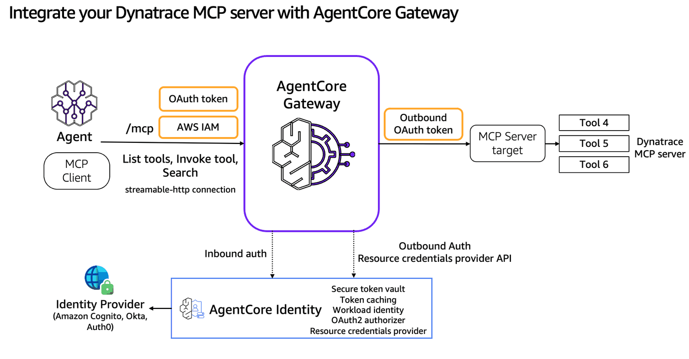

# Integrate Dynatrace MCP Server into AgentCore Gateway

## Overview

In large enterprises with thousands of development teams, each running multiple observability tools and monitoring systems, managing and discovering capabilities becomes a critical challenge:

* **Tool Discovery and Sharing**: Teams struggle to discover and consume observability tools across the organization. Should each team maintain separate gateways? How do you share gateway URLs and manage central registries without creating operational overhead?
* **Gateway Management**: Maintaining separate gateways for each observability system quickly becomes unmanageable at scale.
* **Authentication Complexity**: Managing authentication and authorization across multiple monitoring platforms becomes increasingly complex, especially with sensitive enterprise data.
* **Maintenance Overhead**: Keeping up with MCP specification updates requires continuous rework and testing across all implementations.

AgentCore Gateway now supports onboarding pre-existing MCP server implementations as targets, in addition to Lambda and OpenAPI tools. This tutorial demonstrates integrating Dynatrace's MCP server with AgentCore Gateway to provide centralized access to observability capabilities.



Once the AgentCore Gateway is integrated with the Dynatrace MCP server as a target, we'll search for tools through our integrated MCP server, then we'll use a Strands Agent to demonstrate the list tools and invoke tool functionality. More detail on each of these flows can be found below:


### Tutorial Details


| Information          | Details                                                   |
|:---------------------|:----------------------------------------------------------|
| Tutorial type        | Interactive                                               |
| AgentCore components | AgentCore Gateway, AgentCore Identity                     |
| Agentic Framework    | Strands Agents                                            |
| Gateway Target type  | MCP server                                                |
| Agent                | Strands                                                   |
| Inbound Auth IdP     | Amazon Cognito                                            |
| Outbound Auth        | OAuth2                                                    |
| LLM model            | Anthropic Claude Sonnet 4                                 |
| Tutorial components  | Creating AgentCore Gateway and Invoking AgentCore Gateway |
| Tutorial vertical    | Observability                                             |
| Example complexity   | Easy                                                      |
| SDK used             | boto3                                                     |

## Tutorial architecture

This tutorial serves as a practical example of the broader enterprise challenge: **How to integrate existing observability MCP servers into a centralized Gateway architecture.**

## Prerequisites

To execute this tutorial you will need:
* Jupyter notebook (Python kernel)
* AWS credentials
* Amazon Cognito
* Dynatrace environment with [MCP server endpoint](https://docs.dynatrace.com/docs/discover-dynatrace/platform/davis-ai/dynatrace-mcp)
* Create an [OAuth Client in Dynatrace](https://docs.dynatrace.com/docs/manage/identity-access-management/access-tokens-and-oauth-clients/oauth-clients)

```python
# Install from the requirements file
!pip install --force-reinstall -U -r requirements.txt --quiet
```

```python
import os

# Set AWS credentials if not using SageMaker notebook
# os.environ['AWS_ACCESS_KEY_ID'] = '' # Set the access key
# os.environ['AWS_SECRET_ACCESS_KEY'] = '' # Set the secret key
os.environ["AWS_DEFAULT_REGION"] = os.environ.get("AWS_REGION", "us-east-1")
```

```python
# Import utils
import os
import sys

# Get the directory of the current script
if "__file__" in globals():
    current_dir = os.path.dirname(os.path.abspath(__file__))
else:
    current_dir = os.getcwd()  # Fallback if __file__ is not defined (e.g., Jupyter)

# Navigate to the directory containing utils.py (one level up)
utils_dir = os.path.abspath(os.path.join(current_dir, ".."))

# Add to sys.path
sys.path.insert(0, utils_dir)

# Now you can import utils
import utils

# Setup logging
import logging

# Configure logging for notebook environment
logging.basicConfig(
    level=logging.INFO,
    format="%(asctime)s | %(levelname)s | %(name)s | %(message)s",
    handlers=[logging.StreamHandler()],
)

# Set specific logger levels
logging.getLogger("strands").setLevel(logging.INFO)
```

## Configuration

Configure your Dynatrace MCP Server details:

```python
# Dynatrace MCP Server Configuration
# replace $TENANT_ID with your individual ID – you can find it in the URL of your Dynatrace environment, e.g. https://abc12345.apps.dynatrace.com/
DYNATRACE_MCP_SERVER_URL = (
    "https://$TENANT_ID.apps.dynatrace.com/platform-reserved/mcp-gateway/v0.1/servers/dynatrace-mcp/mcp"
)
# OAUTH_CLIENT_ID (string, e.g., dt0s02.SAMPLE) - Dynatrace OAuth Client ID
DYNATRACE_OAUTH_CLIENT_ID = "XXXXX"
# OAUTH_CLIENT_SECRET (string, e.g., dt0s02.SAMPLE.abcd1234) - Dynatrace OAuth Client Secret
DYNATRACE_OAUTH_CLIENT_SECRET = "XXXXXXX"
DYNATRACE_OAUTH_DISCOVERY_URL = "https://sso.dynatrace.com/.well-known/openid-configuration"

# Convert scopes string to list for AWS API
DYNATRACE_OAUTH_SCOPES = [
    "mcp-gateway:servers:invoke",
    "mcp-gateway:servers:read",
    "davis-copilot:dql2nl:execute",
    "davis-copilot:nl2dql:execute",
    "davis-copilot:conversations:execute",
    "storage:buckets:read",
    "storage:bucket-definitions:write",
    "storage:spans:read",
    "storage:entities:read",
    "storage:user.events:read",
    "storage:user.sessions:read",
]
```

## Create an IAM role for the Gateway to assume

```python
agentcore_gateway_iam_role = utils.create_agentcore_gateway_role("dynatrace-mcpgateway")
print("Agentcore gateway role ARN: ", agentcore_gateway_iam_role["Role"]["Arn"])
```

## Create Amazon Cognito Pool for Inbound authorization to Gateway

```python
# Creating Cognito User Pool
import os
import boto3

REGION = os.environ["AWS_DEFAULT_REGION"]
USER_POOL_NAME = "dynatrace-agentcore-gateway-pool"
RESOURCE_SERVER_ID = "dynatrace-agentcore-gateway-id"
RESOURCE_SERVER_NAME = "dynatrace-agentcore-gateway-name"
CLIENT_NAME = "dynatrace-agentcore-gateway-client"
SCOPES = [
    {
        "ScopeName": "invoke",  # Just 'invoke', will be formatted as resource_server_id/invoke
        "ScopeDescription": "Scope for invoking the agentcore gateway",
    },
]

scope_names = [f"{RESOURCE_SERVER_ID}/{scope['ScopeName']}" for scope in SCOPES]
scopeString = " ".join(scope_names)


cognito = boto3.client("cognito-idp", region_name=REGION)

print("Creating or retrieving Cognito resources...")
gw_user_pool_id = utils.get_or_create_user_pool(cognito, USER_POOL_NAME)
print(f"User Pool ID: {gw_user_pool_id}")

utils.get_or_create_resource_server(cognito, gw_user_pool_id, RESOURCE_SERVER_ID, RESOURCE_SERVER_NAME, SCOPES)
print("Resource server ensured.")

gw_client_id, gw_client_secret = utils.get_or_create_m2m_client(
    cognito, gw_user_pool_id, CLIENT_NAME, RESOURCE_SERVER_ID, scope_names
)

print(f"Client ID: {gw_client_id}")

# Get discovery URL
gw_cognito_discovery_url = (
    f"https://cognito-idp.{REGION}.amazonaws.com/{gw_user_pool_id}/.well-known/openid-configuration"
)
print(gw_cognito_discovery_url)
```

## Create the Gateway

```python
# CreateGateway with Cognito authorizer. Use the Cognito user pool created in the previous step
import boto3

gateway_client = boto3.client("bedrock-agentcore-control", region_name=REGION)
auth_config = {
    "customJWTAuthorizer": {
        "allowedClients": [
            gw_client_id
        ],  # Client MUST match with the ClientId configured in Cognito. Example: 7rfbikfsm51j2fpaggacgng84g
        "discoveryUrl": gw_cognito_discovery_url,
    }
}
create_response = gateway_client.create_gateway(
    name="ac-gateway-dynatrace-mcp",
    roleArn=agentcore_gateway_iam_role["Role"][
        "Arn"
    ],  # The IAM Role must have permissions to create/list/get/delete Gateway
    protocolType="MCP",
    protocolConfiguration={"mcp": {"supportedVersions": ["2025-03-26"], "searchType": "SEMANTIC"}},
    authorizerType="CUSTOM_JWT",
    authorizerConfiguration=auth_config,
    description="AgentCore Gateway with Dynatrace MCP Server target",
)
print(create_response)
# Retrieve the GatewayID used for GatewayTarget creation
gatewayID = create_response["gatewayId"]
gatewayURL = create_response["gatewayUrl"]
print(gatewayID)
```

## Wait for Gateway to be ACTIVE

```python
import time

print("Waiting for gateway to be ACTIVE...")
while True:
    response = gateway_client.get_gateway(gatewayIdentifier=gatewayID)
    status = response["status"]
    print(f"Gateway status: {status}")

    if status == "READY":
        print("Gateway is now READY!")
        break
    elif status == "FAILED":
        print("Gateway creation failed!")
        break

    time.sleep(10)
```

## Create Dynatrace MCP Server as target for AgentCore Gateway

### Configure Outbound Auth

First, we will create an AgentCore Identity Resource Credential Provider for our AgentCore Gateway to use as outbound auth to our Dynatrace MCP server.

```python
import boto3

identity_client = boto3.client("bedrock-agentcore-control", region_name=REGION)

dynatrace_provider = identity_client.create_oauth2_credential_provider(
    name="ac-gateway-dynatrace-mcp-identity",
    credentialProviderVendor="CustomOauth2",
    oauth2ProviderConfigInput={
        "customOauth2ProviderConfig": {
            "oauthDiscovery": {
                "discoveryUrl": DYNATRACE_OAUTH_DISCOVERY_URL,
            },
            "clientId": DYNATRACE_OAUTH_CLIENT_ID,
            "clientSecret": DYNATRACE_OAUTH_CLIENT_SECRET,
        }
    },
)
dynatrace_provider_arn = dynatrace_provider["credentialProviderArn"]
print(dynatrace_provider_arn)
```

### Create the Gateway Target

```python
import boto3

gateway_client = boto3.client("bedrock-agentcore-control", region_name=REGION)
create_gateway_target_response = gateway_client.create_gateway_target(
    name="dynatrace-mcp-server-target",
    gatewayIdentifier=gatewayID,
    targetConfiguration={"mcp": {"mcpServer": {"endpoint": DYNATRACE_MCP_SERVER_URL}}},
    credentialProviderConfigurations=[
        {
            "credentialProviderType": "OAUTH",
            "credentialProvider": {
                "oauthCredentialProvider": {
                    "providerArn": dynatrace_provider_arn,
                    "scopes": DYNATRACE_OAUTH_SCOPES,
                }
            },
        },
    ],
)
print(create_gateway_target_response)
```

#### Check that the Gateway target exists, and is READY

```python
list_targets_response = gateway_client.list_gateway_targets(gatewayIdentifier=gatewayID)
print(list_targets_response)
```

#### Request the access token from Amazon Cognito for inbound authorization

```python
print(
    "Requesting the access token from Amazon Cognito authorizer...May fail for some time till the domain name propagation completes"
)
token_response = utils.get_token(gw_user_pool_id, gw_client_id, gw_client_secret, scopeString, REGION)
token = token_response["access_token"]
print("Token response:", token)
```

## Search for Dynatrace MCP Server tools through the Gateway

```python
import requests
import json


def search_tools(gateway_url, access_token, query):
    headers = {
        "Content-Type": "application/json",
        "Authorization": f"Bearer {access_token}",
    }

    payload = {
        "jsonrpc": "2.0",
        "id": "search-tools-request",
        "method": "tools/call",
        "params": {
            "name": "x_amz_bedrock_agentcore_search",
            "arguments": {"query": query},
        },
    }

    response = requests.post(gateway_url, headers=headers, json=payload)
    return response.json()


# Example usage
token_response = utils.get_token(gw_user_pool_id, gw_client_id, gw_client_secret, scopeString, REGION)
access_token = token_response["access_token"]
results = search_tools(gatewayURL, access_token, "problems")
print(json.dumps(results, indent=2))
```

## Use an agent to operate on Dynatrace via the Gateway

```python
import json

from strands.models import BedrockModel
from mcp.client.streamable_http import streamablehttp_client
from strands.tools.mcp.mcp_client import MCPClient
from strands import Agent


def get_token():
    token = utils.get_token(gw_user_pool_id, gw_client_id, gw_client_secret, scopeString, REGION)
    return token["access_token"]


def create_streamable_http_transport():
    return streamablehttp_client(gatewayURL, headers={"Authorization": f"Bearer {get_token()}"})


client = MCPClient(create_streamable_http_transport)

## The IAM group/user/ configured in ~/.aws/credentials should have access to Bedrock model
yourmodel = BedrockModel(
    model_id="us.anthropic.claude-sonnet-4-20250514-v1:0",  # may need to update model_id depending on region
    temperature=0.7,
    max_tokens=500,  # Limit response length
)

with client:
    # Call the listTools
    tools = client.list_tools_sync()
    # Create an Agent with the model and tools
    agent = Agent(model=yourmodel, tools=tools)  ## you can replace with any model you like
    # Invoke the agent with the sample prompt. This will only invoke MCP listTools and retrieve the list of tools the LLM has access to. The below does not actually call any tool.
    agent("Hi, can you list all tools available to you")
    # Simplified prompt and error handling
    result = agent("Show me top vulnerabilities in my Dynatrace environment")
```

## Clean up
Additional resources are also created like IAM role, IAM Policies, Credentials provider, Cognito user pools that you might need to manually delete as part of the clean up.

### Delete the Gateway (Optional)

```python
utils.delete_gateway(gateway_client, gatewayID)
```

### Delete the Identity Provider (Optional)

```python
identity_client.delete_oauth2_credential_provider(name="ac-gateway-dynatrace-mcp-identity")
```
