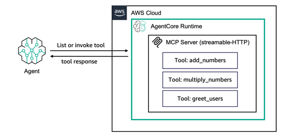
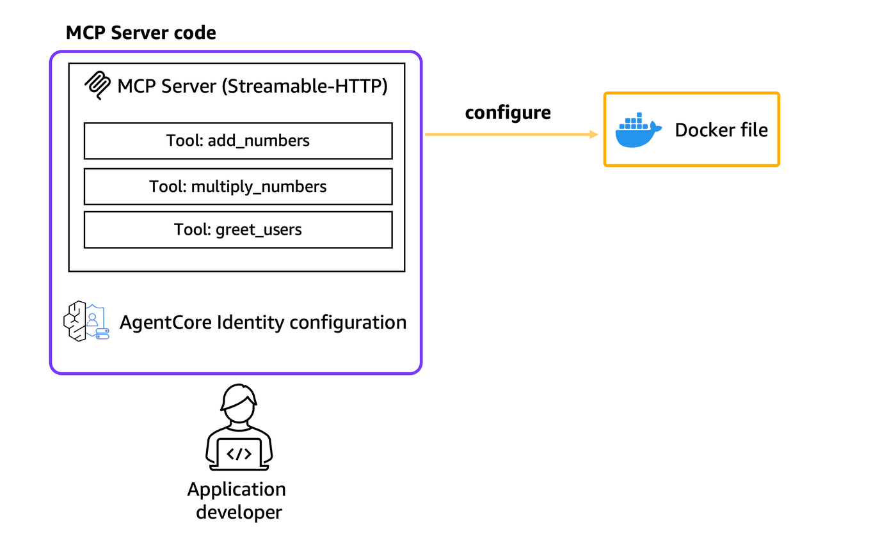
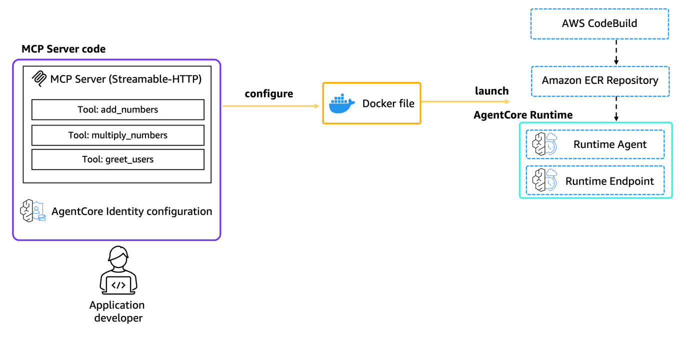

# Hosting MCP Server on Amazon Bedrock AgentCore Runtime - OAuth Inbound Authentication

## Overview

In this tutorial we will learn how to host MCP (Model Context Protocol) servers on Amazon Bedrock AgentCore Runtime. We will use the Amazon Bedrock AgentCore Python SDK to wrap MCP tools as an MCP server compatible with Amazon Bedrock AgentCore.

The Amazon Bedrock AgentCore Python SDK handles the MCP server implementation details so you can focus on your tools' core functionality. It transforms your code into the AgentCore standardized MCP protocol contracts for direct communication.

### Tutorial Details

| Information         | Details                                                   |
|:--------------------|:----------------------------------------------------------|
| Tutorial type       | Hosting Tools                                             |
| Tool type           | MCP server                                                |
| Tutorial components | Hosting MCP server on AgentCore Runtime                  |
| Tutorial vertical   | Cross-vertical                                            |
| Example complexity  | Easy                                                      |
| SDK used            | Amazon BedrockAgentCore Python SDK and MCP               |

### Tutorial Architecture

In this tutorial we will describe how to deploy an MCP server to AgentCore runtime.

For demonstration purposes, we will use a simple MCP server with 3 tools: `add_numbers`, `multiply_numbers` and `greet_user`

<div style="text-align:left">
    
</div>

### Tutorial Key Features

* Creating MCP servers with custom tools
* Testing MCP servers locally
* Hosting MCP servers on Amazon Bedrock AgentCore Runtime
* Invoking deployed MCP servers with authentication

## Prerequisites

To execute this tutorial you will need:
* Python 3.10+
* AWS credentials configured
* Amazon Bedrock AgentCore SDK
* MCP (Model Context Protocol) library
* Docker running

```python
!pip install --force-reinstall -U -r requirements.txt --quiet
```

```python
from boto3.session import Session

boto_session = Session()
region = boto_session.region_name

ssm_client = boto_session.client("ssm", region_name=region)
secrets_client = boto_session.client("secretsmanager", region_name=region)
agentcore_control_client = boto_session.client("bedrock-agentcore-control", region_name=region)

tool_name = "mcp_server_agentcore"
```

## Understanding MCP (Model Context Protocol)

MCP is a protocol that allows AI models to securely access external data and tools. Key concepts:

* **Tools**: Functions that the AI can call to perform actions
* **Streamable HTTP**: Transport protocol used by AgentCore Runtime
* **Session Isolation**: Each client gets isolated sessions via `Mcp-Session-Id` header
* **Stateless Operation**: Servers must support stateless operation for scalability

AgentCore Runtime expects MCP servers to be hosted on `0.0.0.0:8000/mcp` as the default path.

### Project Structure

Let's set up our project with the proper structure:

```
mcp_server_project/
├── mcp_server.py              # Main MCP server code
├── my_mcp_client.py          # Local testing client
├── my_mcp_client_remote.py   # Remote testing client
├── requirements.txt          # Dependencies
└── __init__.py              # Python package marker
```

## Creating MCP Server

Now let's create our MCP server with three simple tools. The server uses FastMCP with `stateless_http=True` which is required for AgentCore Runtime compatibility.

```python
%%writefile mcp_server.py
from mcp.server.fastmcp import FastMCP
from starlette.responses import JSONResponse

mcp = FastMCP(host="0.0.0.0", stateless_http=True)

@mcp.tool()
def add_numbers(a: int, b: int) -> int:
    """Add two numbers together"""
    return a + b

@mcp.tool()
def multiply_numbers(a: int, b: int) -> int:
    """Multiply two numbers together"""
    return a * b

@mcp.tool()
def greet_user(name: str) -> str:
    """Greet a user by name"""
    return f"Hello, {name}! Nice to meet you."

if __name__ == "__main__":
    mcp.run(transport="streamable-http")
```

### What This Code Does

* **FastMCP**: Creates an MCP server that can host your tools
* **@mcp.tool()**: Decorator that turns your Python functions into MCP tools
* **stateless_http=True**: Required for AgentCore Runtime compatibility
* **Tools**: Three simple tools demonstrating different types of operations

## Creating Local Testing Client

Before deploying to AgentCore Runtime, let's create a client to test our MCP server locally:

```python
%%writefile my_mcp_client.py
import asyncio
from datetime import timedelta

from mcp import ClientSession
from mcp.client.streamable_http import streamablehttp_client

async def main():
    mcp_url = "http://localhost:8000/mcp"
    headers = {}

    async with streamablehttp_client(mcp_url, headers, timeout=timedelta(seconds=120), terminate_on_close=False) as (
        read_stream,
        write_stream,
        _,
    ):
        async with ClientSession(read_stream, write_stream) as session:
            await session.initialize()
            tool_result = await session.list_tools()
            print("Available tools:")
            for tool in tool_result.tools:
                print(f"  - {tool.name}: {tool.description}")

if __name__ == "__main__":
    asyncio.run(main())
```

### Testing Locally

To test your MCP server locally:

1. **Terminal 1**: Start the MCP server
   ```bash
   python mcp_server.py
   ```
   
2. **Terminal 2**: Run the test client
   ```bash
   python my_mcp_client.py
   ```

You should see your three tools listed in the output.

## Setting up Amazon Cognito for Authentication

AgentCore Runtime requires authentication. We'll use Amazon Cognito to provide JWT tokens for accessing our deployed MCP server.

```python
import sys

sys.path.insert(0, "../..")
from utils import setup_cognito_user_pool

print("Setting up Amazon Cognito user pool...")
cognito_config = setup_cognito_user_pool()
print("Cognito setup completed ✓")
print(f"User Pool ID: {cognito_config.get('pool_id', 'N/A')}")
print(f"Client ID: {cognito_config.get('client_id', 'N/A')}")
```

## Configuring AgentCore Runtime Deployment

Next we will use our starter toolkit to configure the AgentCore Runtime deployment with an entrypoint, the execution role we just created and a requirements file. We will also configure the starter kit to auto create the Amazon ECR repository on launch.

During the configure step, your docker file will be generated based on your application code

<div style="text-align:left">
    
</div>

```python
import os
from bedrock_agentcore_starter_toolkit import Runtime

print(f"Using AWS region: {region}")

required_files = ["mcp_server.py", "requirements.txt"]
for file in required_files:
    if not os.path.exists(file):
        raise FileNotFoundError(f"Required file {file} not found")
print("All required files found ✓")

agentcore_runtime = Runtime()

auth_config = {
    "customJWTAuthorizer": {
        "allowedClients": [cognito_config["client_id"]],
        "discoveryUrl": cognito_config["discovery_url"],
    }
}

print("Configuring AgentCore Runtime...")
response = agentcore_runtime.configure(
    entrypoint="mcp_server.py",
    auto_create_execution_role=True,
    auto_create_ecr=True,
    requirements_file="requirements.txt",
    region=region,
    authorizer_configuration=auth_config,
    protocol="MCP",
    agent_name=tool_name,
)
print("Configuration completed ✓")
```

## Launching MCP Server to AgentCore Runtime

Now that we've got a docker file, let's launch the MCP server to the AgentCore Runtime. This will create the Amazon ECR repository and the AgentCore Runtime

<div style="text-align:left">
    
</div>

```python
print("Launching MCP server to AgentCore Runtime...")
print("This may take several minutes...")
launch_result = agentcore_runtime.launch()
print("Launch completed ✓")
print(f"Agent ARN: {launch_result.agent_arn}")
print(f"Agent ID: {launch_result.agent_id}")
```

## Storing Configuration for Remote Access

Before we can invoke our deployed MCP server, let's store the Agent ARN and Cognito configuration in AWS Systems Manager Parameter Store and AWS Secrets Manager for easy retrieval:

```python
import boto3
import json

ssm_client = boto3.client("ssm", region_name=region)
secrets_client = boto3.client("secretsmanager", region_name=region)

try:
    cognito_credentials_response = secrets_client.create_secret(
        Name="mcp_server/cognito/credentials",
        Description="Cognito credentials for MCP server",
        SecretString=json.dumps(cognito_config),
    )
    print("✓ Cognito credentials stored in Secrets Manager")
except secrets_client.exceptions.ResourceExistsException:
    secrets_client.update_secret(
        SecretId="mcp_server/cognito/credentials",
        SecretString=json.dumps(cognito_config),
    )
    print("✓ Cognito credentials updated in Secrets Manager")

agent_arn_response = ssm_client.put_parameter(
    Name="/mcp_server/runtime/agent_arn",
    Value=launch_result.agent_arn,
    Type="String",
    Description="Agent ARN for MCP server",
    Overwrite=True,
)
print("✓ Agent ARN stored in Parameter Store")

print("\nConfiguration stored successfully!")
print(f"Agent ARN: {launch_result.agent_arn}")
```

```python
import httpx


def stop_runtime_session_oauth(agent_arn, session_id, bearer_token, region):
    """Stop runtime session using OAuth bearer token"""
    encoded_arn = agent_arn.replace(":", "%3A").replace("/", "%2F")
    url = f"https://bedrock-agentcore.{region}.amazonaws.com/runtimes/{encoded_arn}/stopruntimesession"

    headers = {
        "Authorization": f"Bearer {bearer_token}",
        "Content-Type": "application/json",
    }

    body = {
        "runtimeSessionId": session_id,
        "agentRuntimeArn": agent_arn,
        "qualifier": "DEFAULT",
    }

    response = httpx.post(url, headers=headers, json=body, timeout=30.0)
    return response


print("✅ Helper function defined for OAuth session stopping")
```

### Session Lifecycle Demo: Stopping a Session

Now that the runtime is deployed, let's demonstrate stopping a session. We'll invoke the
MCP server with a custom session ID, then stop it using OAuth authentication.

```python
import uuid
from datetime import timedelta
from mcp import ClientSession
from mcp.client.streamable_http import streamablehttp_client

# Generate custom session ID
demo1_session_id = str(uuid.uuid4())
print(f"📝 Demo 1 - Generated mcpSessionId: {demo1_session_id}")

# Prepare headers
encoded_arn = launch_result.agent_arn.replace(":", "%3A").replace("/", "%2F")
mcp_url = f"https://bedrock-agentcore.{region}.amazonaws.com/runtimes/{encoded_arn}/invocations?qualifier=DEFAULT"

headers = {
    "authorization": f"Bearer {cognito_config['bearer_token']}",
    "Content-Type": "application/json",
    "Mcp-Session-Id": demo1_session_id,
}


# Invoke MCP server
async def test_session():
    async with streamablehttp_client(mcp_url, headers, timeout=timedelta(seconds=120), terminate_on_close=False) as (
        read,
        write,
        _,
    ):
        async with ClientSession(read, write) as session:
            await session.initialize()
            tools = await session.list_tools()
            print(f"✅ Session active with {len(tools.tools)} tools")


await test_session()

# Stop the session using OAuth
print(f"\n🛑 Stopping session '{demo1_session_id}'...")
response = stop_runtime_session_oauth(launch_result.agent_arn, demo1_session_id, cognito_config["bearer_token"], region)
print(f"✅ Session stopped (HTTP {response.status_code})")
print(f"   Response: {response.text}")
print("   MicroVM resources released")
print("💡 Runtime remains alive for new sessions")

# Note: You may see 'Session termination failed: 404' in the logs above.
# This is expected - it's the MCP client trying to auto-cleanup after we already stopped the session.
# The important part is the HTTP 200 response from our explicit stop_runtime_session_oauth call.
```

## Creating Remote Testing Client

Now let's create a client to test our deployed MCP server. This client will retrieve the necessary credentials from AWS and connect to the deployed server:

```python
%%writefile my_mcp_client_remote.py
import asyncio
import boto3
import json
import sys
import base64
import time
from boto3.session import Session
from datetime import timedelta
import traceback

from mcp import ClientSession
from mcp.client.streamable_http import streamablehttp_client

def get_refresh_token(client_id, refresh_token, region):
    """Refresh access token using refresh token"""
    cognito_client = boto3.client('cognito-idp', region_name=region)
    auth_response = cognito_client.initiate_auth(
        ClientId=client_id,
        AuthFlow='REFRESH_TOKEN_AUTH',
        AuthParameters={'REFRESH_TOKEN': refresh_token}
    )
    return auth_response['AuthenticationResult']['AccessToken']

def get_valid_token(bearer_token, client_id, refresh_token, region):
    """Check token expiry and refresh if needed"""
    try:
        payload = bearer_token.split('.')[1]
        payload += '=' * (4 - len(payload) % 4)
        decoded = json.loads(base64.b64decode(payload))
        
        current_time = int(time.time())
        if decoded['exp'] - current_time < 300:
            print("🔄 Token expiring soon, refreshing...")
            new_token = get_refresh_token(client_id, refresh_token, region)
            print("✓ Token refreshed successfully")
            return new_token
        
        return bearer_token
    except Exception as e:
        print("🔄 Invalid token, refreshing...", e)
        traceback.print_exc()
        return get_refresh_token(client_id, refresh_token, region)

async def main():
    boto_session = Session()
    region = boto_session.region_name
    
    print(f"Using AWS region: {region}")
    
    try:
        ssm_client = boto3.client('ssm', region_name=region)
        agent_arn_response = ssm_client.get_parameter(Name='/mcp_server/runtime/agent_arn')
        agent_arn = agent_arn_response['Parameter']['Value']
        print(f"Retrieved Agent ARN: {agent_arn}")

        secrets_client = boto3.client('secretsmanager', region_name=region)
        response = secrets_client.get_secret_value(SecretId='mcp_server/cognito/credentials')
        secret_value = response['SecretString']
        parsed_secret = json.loads(secret_value)
        bearer_token = parsed_secret['bearer_token']
        refresh_token = parsed_secret['refresh_token']
        client_id = parsed_secret['client_id']
        print("✓ Retrieved credentials from Secrets Manager")
        
        # Validate and refresh token if needed
        bearer_token = get_valid_token(bearer_token, client_id, refresh_token, region)
        
    except Exception as e:
        print(f"Error retrieving credentials: {e}")
        sys.exit(1)
    
    if not agent_arn or not bearer_token:
        print("Error: AGENT_ARN or BEARER_TOKEN not retrieved properly")
        sys.exit(1)
    
    encoded_arn = agent_arn.replace(':', '%3A').replace('/', '%2F')
    mcp_url = f"https://bedrock-agentcore.{region}.amazonaws.com/runtimes/{encoded_arn}/invocations?qualifier=DEFAULT"
    headers = {
        "authorization": f"Bearer {bearer_token}",
        "Content-Type": "application/json"
    }
    
    print(f"\nConnecting to: {mcp_url}")
    print("Headers configured ✓")

    try:
        async with streamablehttp_client(mcp_url, headers, timeout=timedelta(seconds=120), terminate_on_close=False) as (
            read_stream,
            write_stream,
            _,
        ):
            async with ClientSession(read_stream, write_stream) as session:
                print("\n🔄 Initializing MCP session...")
                await session.initialize()
                print("✓ MCP session initialized")
                
                print("\n🔄 Listing available tools...")
                tool_result = await session.list_tools()
                
                print("\n📋 Available MCP Tools:")
                print("=" * 50)
                for tool in tool_result.tools:
                    print(f"🔧 {tool.name}")
                    print(f"   Description: {tool.description}")
                    if hasattr(tool, 'inputSchema') and tool.inputSchema:
                        properties = tool.inputSchema.get('properties', {})
                        if properties:
                            print(f"   Parameters: {list(properties.keys())}")
                    print()
                
                print(f"✅ Successfully connected to MCP server!")
                print(f"Found {len(tool_result.tools)} tools available.")
                
    except Exception as e:
        print(f"❌ Error connecting to MCP server: {e}")
        sys.exit(1)

if __name__ == "__main__":
    asyncio.run(main())
```

## Testing Your Deployed MCP Server

Let's test our deployed MCP server using the remote client:

```python
print("Testing deployed MCP server...")
print("=" * 50)
!python my_mcp_client_remote.py
```

## Invoking MCP Tools Remotely

Now let's create an enhanced client that not only lists tools but also invokes them to demonstrate the full MCP functionality:

```python
%%writefile invoke_mcp_tools.py
import asyncio
import boto3
import json
import sys
import base64
import time
import uuid
import httpx
from boto3.session import Session
from datetime import timedelta

from mcp import ClientSession
from mcp.client.streamable_http import streamablehttp_client

def get_refresh_token(client_id, refresh_token, region):
    """Refresh access token using refresh token"""
    cognito_client = boto3.client('cognito-idp', region_name=region)
    auth_response = cognito_client.initiate_auth(
        ClientId=client_id,
        AuthFlow='REFRESH_TOKEN_AUTH',
        AuthParameters={'REFRESH_TOKEN': refresh_token}
    )
    return auth_response['AuthenticationResult']['AccessToken']

def get_valid_token(bearer_token, client_id, refresh_token, region):
    """Check token expiry and refresh if needed"""
    try:
        payload = bearer_token.split('.')[1]
        payload += '=' * (4 - len(payload) % 4)
        decoded = json.loads(base64.b64decode(payload))
        
        current_time = int(time.time())
        if decoded['exp'] - current_time < 300:
            print("🔄 Token expiring soon, refreshing...")
            new_token = get_refresh_token(client_id, refresh_token, region)
            print("✓ Token refreshed successfully")
            return new_token
        
        return bearer_token
    except:
        print("�� Invalid token, refreshing...")
        return get_refresh_token(client_id, refresh_token, region)

def stop_runtime_session_oauth(agent_arn, session_id, bearer_token, region):
    """Stop runtime session using OAuth bearer token via HTTP POST"""
    # Encode the ARN for URL path
    encoded_arn = agent_arn.replace(':', '%3A').replace('/', '%2F')
    url = f"https://bedrock-agentcore.{region}.amazonaws.com/runtimes/{encoded_arn}/stopruntimesession"
    
    headers = {
        "Authorization": f"Bearer {bearer_token}",
        "Content-Type": "application/json"
    }
    
    body = {
        "runtimeSessionId": session_id,
        "agentRuntimeArn": agent_arn,
        "qualifier": "DEFAULT"
    }
    
    response = httpx.post(url, headers=headers, json=body, timeout=30.0)
    return response

async def main():
    boto_session = Session()
    region = boto_session.region_name
    
    print(f"Using AWS region: {region}")
    
    try:
        ssm_client = boto3.client('ssm', region_name=region)
        agent_arn_response = ssm_client.get_parameter(Name='/mcp_server/runtime/agent_arn')
        agent_arn = agent_arn_response['Parameter']['Value']
        print(f"Retrieved Agent ARN: {agent_arn}")

        secrets_client = boto3.client('secretsmanager', region_name=region)
        response = secrets_client.get_secret_value(SecretId='mcp_server/cognito/credentials')
        secret_value = response['SecretString']
        parsed_secret = json.loads(secret_value)
        bearer_token = parsed_secret['bearer_token']
        refresh_token = parsed_secret['refresh_token']
        client_id = parsed_secret['client_id']
        print("✓ Retrieved credentials from Secrets Manager")
        
        bearer_token = get_valid_token(bearer_token, client_id, refresh_token, region)
        
    except Exception as e:
        print(f"Error retrieving credentials: {e}")
        sys.exit(1)
    
    encoded_arn = agent_arn.replace(':', '%3A').replace('/', '%2F')
    mcp_url = f"https://bedrock-agentcore.{region}.amazonaws.com/runtimes/{encoded_arn}/invocations?qualifier=DEFAULT"
    
    # Generate custom session ID
    mcp_session_id = str(uuid.uuid4())
    print(f"\n📝 Generated custom mcpSessionId: {mcp_session_id}")
    
    headers = {
        "authorization": f"Bearer {bearer_token}",
        "Content-Type": "application/json",
        "Mcp-Session-Id": mcp_session_id
    }
    
    print(f"\nConnecting to: {mcp_url}")

    try:
        async with streamablehttp_client(mcp_url, headers, timeout=timedelta(seconds=120), terminate_on_close=False) as (
            read_stream, write_stream, _
        ):
            async with ClientSession(read_stream, write_stream) as session:
                await session.initialize()
                print("✓ MCP session initialized")
                
                tool_result = await session.list_tools()
                print(f"\n📋 Found {len(tool_result.tools)} tools")
                
                # Test tools
                print("\n🧪 Testing tools...")
                add_result = await session.call_tool(name="add_numbers", arguments={"a": 5, "b": 3})
                print(f"   add_numbers(5, 3) = {add_result.content[0].text}")
                
                multiply_result = await session.call_tool(name="multiply_numbers", arguments={"a": 4, "b": 7})
                print(f"   multiply_numbers(4, 7) = {multiply_result.content[0].text}")
                
                greet_result = await session.call_tool(name="greet_user", arguments={"name": "Alice"})
                print(f"   greet_user('Alice') = {greet_result.content[0].text}")
                
                print("\n✅ MCP tool testing completed!")
        
        # Stop the session using OAuth bearer token
        print(f"\n🛑 Stopping session '{mcp_session_id}' (OAuth)...")
        response = stop_runtime_session_oauth(agent_arn, mcp_session_id, bearer_token, region)
        
        if response.status_code == 200:
            print(f"✅ Session stopped — microVM resources released")
            print(f"💡 Runtime remains alive for new sessions")
        else:
            print(f"⚠️  Status {response.status_code}: {response.text}")
                
    except Exception as e:
        print(f"❌ Error: {e}")
        import traceback
        traceback.print_exc()

if __name__ == "__main__":
    asyncio.run(main())
```

## Test Tool Invocation

Let's test our MCP tools by actually invoking them:

```python
print("Testing MCP tool invocation...")
print("=" * 50)
!python invoke_mcp_tools.py
```

### Session Lifecycle Demo: Stopping Between Tests

Let's demonstrate stopping a session between different test approaches.

```python
# Create and stop another session to show the pattern
demo2_session_id = str(uuid.uuid4())
print(f"📝 Demo 2 - Generated mcpSessionId: {demo2_session_id}")

headers2 = {
    "authorization": f"Bearer {cognito_config['bearer_token']}",
    "Content-Type": "application/json",
    "Mcp-Session-Id": demo2_session_id,
}


async def test_session2():
    async with streamablehttp_client(mcp_url, headers2, timeout=timedelta(seconds=120), terminate_on_close=False) as (
        read,
        write,
        _,
    ):
        async with ClientSession(read, write) as session:
            await session.initialize()
            print(f"✅ Session {demo2_session_id} created")


await test_session2()

print(f"🛑 Stopping session '{demo2_session_id}'...")
response = stop_runtime_session_oauth(launch_result.agent_arn, demo2_session_id, cognito_config["bearer_token"], region)
print(f"✅ Session stopped (HTTP {response.status_code})")
```

## Next Steps

Now that you have successfully deployed an MCP server to AgentCore Runtime, you can:

1. **Add More Tools**: Extend your MCP server with additional tools
2. **Custom Authentication**: Implement custom JWT authorizers
3. **Integration**: Integrate with other AgentCore services

## Session Lifecycle Best Practices

AgentCore Runtime costs are based on vCPU and Memory. A best practice to avoid undesired costs is to explicitly stop the session or set up a properly configured idle timeout, so the session will be terminated.

To manage costs effectively:

- **Configure idle timeout**: Set an appropriate idle timeout during session creation to automatically stop inactive sessions. Choose a value based on your use case (e.g., shorter for development/testing, longer for production workloads).
- **Stop sessions when done**: Use `stop_runtime_session` to release the microVM resources for a specific session while keeping the runtime alive for new sessions.

## Cleanup

Let's now clean up the AgentCore Runtime and associated resources. We delete the runtime first to avoid undesired costs, then clean up supporting resources like ECR repositories and Secrets Manager secrets.

```python
# --- Cleanup Resources ---
import boto3

agentcore_control_client = boto3.client("bedrock-agentcore-control", region_name=region)
ecr_client = boto3.client("ecr", region_name=region)

# Step 1: Delete Secrets Manager secret first to minimize credential exposure window
try:
    secrets_client.delete_secret(SecretId="mcp_server/cognito/credentials", ForceDeleteWithoutRecovery=True)
    print("✅ Secrets Manager secret deleted")
except secrets_client.exceptions.ResourceNotFoundException:
    print("ℹ️  Secrets Manager secret not found")

# Step 2: Delete Parameter Store parameter
try:
    ssm_client.delete_parameter(Name="/mcp_server/runtime/agent_arn")
    print("✅ Parameter Store parameter deleted")
except ssm_client.exceptions.ParameterNotFound:
    print("ℹ️  Parameter Store parameter not found")

# Step 3: Delete the agent runtime to stop incurring costs
# AgentCore Runtime costs are based on vCPU and Memory
try:
    agentcore_control_client.delete_agent_runtime(
        agentRuntimeId=launch_result.agent_id,
    )
    print(f"✅ Agent runtime '{launch_result.agent_id}' deleted")
except Exception as e:
    print(f"⚠️ Failed to delete agent runtime: {e}")

# Step 4: Delete the ECR repository
try:
    ecr_client.delete_repository(repositoryName=launch_result.ecr_uri.split("/")[1], force=True)
    print(f"✅ ECR repository '{launch_result.ecr_uri.split('/')[1]}' deleted")
except Exception as e:
    print(f"⚠️ Failed to delete ECR repository: {e}")

print("\n✅ Cleanup completed successfully!")
```

# 🎉 Congratulations!

You have successfully:

✅ **Created an MCP server** with custom tools  
✅ **Tested locally** using MCP client  
✅ **Set up authentication** with Amazon Cognito  
✅ **Deployed to AWS** using AgentCore Runtime  
✅ **Invoked remotely** with proper authentication  
✅ **Learned MCP concepts** and best practices  

Your MCP server is now running on Amazon Bedrock AgentCore Runtime and ready for production use!

## Summary

In this tutorial, you learned how to:
- Build MCP servers using FastMCP
- Configure stateless HTTP transport for AgentCore compatibility
- Set up JWT authentication with Amazon Cognito
- Deploy and manage MCP servers on AWS
- Test both locally and remotely
- Use MCP clients for tool invocation

The deployed MCP server can now be integrated into larger AI applications and workflows!
