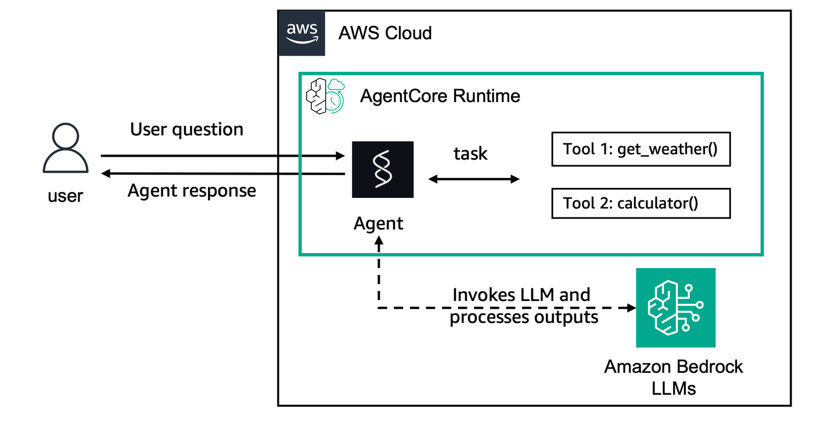
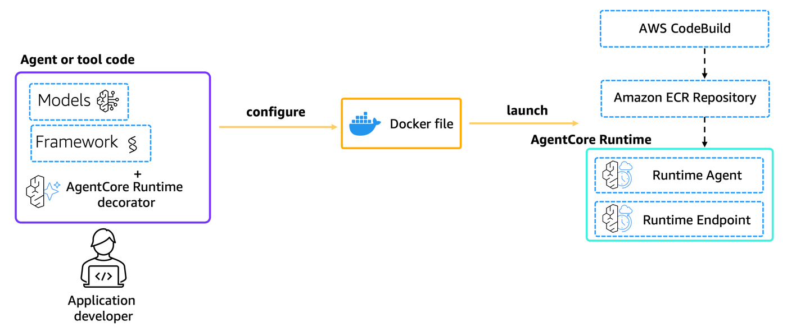

# Streaming Responses with Strands Agents in Amazon Bedrock AgentCore Runtime

## Overview

In this tutorial we will learn how to implement streaming responses using Amazon Bedrock AgentCore Runtime. This example demonstrates how to stream partial results as they become available, providing a more responsive user experience for operations that generate large amounts of content or take significant processing time.


### Tutorial Details

|Information| Details|
|:--------------------|:---------------------------------------------------------------------------------|
| Tutorial type       | Conversational with Streaming|
| Agent type          | Single         |
| Agentic Framework   | Strands Agents |
| LLM model           | Anthropic Claude Haiku 4.5 |
| Tutorial components | Streaming responses with AgentCore Runtime, Strands Agent and Amazon Bedrock Model |
| Tutorial vertical   | Cross-vertical                                                                   |
| Example complexity  | Easy                                                                             |
| SDK used            | Amazon BedrockAgentCore Python SDK and boto3|

### Tutorial Architecture

In this tutorial we will describe how to deploy a streaming agent to AgentCore runtime. 

For demonstration purposes, we will use a Strands Agent using Amazon Bedrock models with streaming capabilities.

In our example we will use a simple agent with two tools: `get_weather` and `get_time`, but with streaming response capabilities.

    
<div style="text-align:left">
    
</div>

### Tutorial Key Features

* Streaming responses from agents on Amazon Bedrock AgentCore Runtime
* Real-time partial result delivery
* Using Amazon Bedrock models with streaming
* Using Strands Agents with async streaming support

## Prerequisites

To execute this tutorial you will need:
* Python 3.10+
* AWS credentials
* Amazon Bedrock AgentCore SDK
* Strands Agents
* Docker running

```python
!pip install --force-reinstall -U -r requirements.txt --quiet
```

## Preparing your streaming agent for deployment on AgentCore Runtime

Let's now deploy our streaming agents to AgentCore Runtime. The streaming functionality is handled automatically by the AgentCore SDK when you use async generators or yield statements in your entrypoint function.

Key points for streaming implementation:
* Use `async def` for your entrypoint function
* Use `yield` to stream chunks as they become available
* The AgentCore SDK automatically handles the Server-Sent Events (SSE) format
* Clients will receive Content-Type: text/event-stream responses

### Strands Agents with Amazon Bedrock model and Streaming
Let's look at our streaming implementation for the Strands Agent using Amazon Bedrock model.

```python
%%writefile strands_claude_streaming.py
from strands import Agent, tool
from strands_tools import calculator # Import the calculator tool
import argparse
import json
from bedrock_agentcore.runtime import BedrockAgentCoreApp
from strands.models import BedrockModel
import asyncio
from datetime import datetime

app = BedrockAgentCoreApp()

# Create a custom tool 
@tool
def weather():
    """ Get weather """ # Dummy implementation
    return "sunny"

@tool
def get_time():
    """ Get current time """
    return datetime.now().strftime("%Y-%m-%d %H:%M:%S")

model_id = "global.anthropic.claude-haiku-4-5-20251001-v1:0"
model = BedrockModel(
    model_id=model_id,
)
agent = Agent(
    model=model,
    tools=[
        calculator, weather, get_time
    ],
    system_prompt="""You're a helpful assistant. You can do simple math calculations, 
    tell the weather, and provide the current time."""
)

@app.entrypoint
async def strands_agent_bedrock_streaming(payload):
    """
    Invoke the agent with streaming capabilities
    This function demonstrates how to implement streaming responses
    with AgentCore Runtime using async generators
    """
    user_input = payload.get("prompt")
    print("User input:", user_input)
    
    try:
        # Stream each chunk as it becomes available
        async for event in agent.stream_async(user_input):
            if "data" in event:
                yield event["data"]
            
    except Exception as e:
        # Handle errors gracefully in streaming context
        error_response = {"error": str(e), "type": "stream_error"}
        print(f"Streaming error: {error_response}")
        yield error_response

if __name__ == "__main__":
    app.run()
```

## Understanding Streaming in AgentCore Runtime

When you use streaming with AgentCore Runtime, several things happen automatically:

### Server-Sent Events (SSE) Format
* The AgentCore SDK automatically converts your yielded data into SSE format
* Each yield becomes a `data: ` event in the SSE stream
* The Content-Type is automatically set to `text/event-stream`

### Client Handling
* Clients receive real-time updates as your agent processes the request
* This enables progressive response display and better user experience
* Clients can process partial results before the complete response is ready

### Error Handling
* Streaming responses should include proper error handling
* Errors can be yielded as part of the stream
* The stream ends when the function completes or encounters an unhandled exception

## Deploying the streaming agent to AgentCore Runtime

The `CreateAgentRuntime` operation supports comprehensive configuration options, letting you specify container images, environment variables and encryption settings. You can also configure protocol settings (HTTP, MCP) and authorization mechanisms to control how your clients communicate with the agent. 

**Note:** Operations best practice is to package code as container and push to ECR using CI/CD pipelines and IaC

In this tutorial we will use the Amazon Bedrock AgentCode Python SDK to easily package your artifacts and deploy them to AgentCore runtime.

### Configure AgentCore Runtime deployment

Next we will use our starter toolkit to configure the AgentCore Runtime deployment with an entrypoint, the execution role we just created and a requirements file. We will also configure the starter kit to auto create the Amazon ECR repository on launch.

During the configure step, your docker file will be generated based on your application code

<div style="text-align:left">
    
</div>

```python
from bedrock_agentcore_starter_toolkit import Runtime
from boto3.session import Session

boto_session = Session()
region = boto_session.region_name
region

agentcore_runtime = Runtime()

response = agentcore_runtime.configure(
    entrypoint="strands_claude_streaming.py",
    auto_create_execution_role=True,
    auto_create_ecr=True,
    requirements_file="requirements.txt",
    region=region,
    agent_name="strands_claude_streaming",
)
response
```

### Launching streaming agent to AgentCore Runtime

Now that we've got a docker file, let's launch the streaming agent to the AgentCore Runtime. This will create the Amazon ECR repository and the AgentCore Runtime

<div style="text-align:left">
    
</div>

```python
launch_result = agentcore_runtime.launch()
```

### Checking for the AgentCore Runtime Status
Now that we've deployed the AgentCore Runtime, let's check for it's deployment status

```python
import time

status_response = agentcore_runtime.status()
status = status_response.endpoint["status"]
end_status = ["READY", "CREATE_FAILED", "DELETE_FAILED", "UPDATE_FAILED"]
while status not in end_status:
    time.sleep(10)
    status_response = agentcore_runtime.status()
    status = status_response.endpoint["status"]
    print(status)
status
```

### Invoking AgentCore Runtime with Streaming

Finally, we can invoke our AgentCore Runtime with a payload and receive streaming responses

<div style="text-align:left">
    
</div>

```python
invoke_response = agentcore_runtime.invoke({"prompt": "what the weather is like?"})
invoke_response
```

### Invoking AgentCore Runtime with boto3 for Streaming

Now that your AgentCore Runtime was created you can invoke it with any AWS SDK. For streaming responses, you'll need to handle the Server-Sent Events format.

```python
import boto3
import json
from IPython.display import Markdown, display

agent_arn = launch_result.agent_arn
agentcore_client = boto3.client("bedrock-agentcore", region_name=region)

# For streaming responses, we need to handle the EventStream
boto3_response = agentcore_client.invoke_agent_runtime(
    agentRuntimeArn=agent_arn,
    qualifier="DEFAULT",
    payload=json.dumps({"prompt": "How much is 2+1"}),
)

# Check if the response is streaming
if "text/event-stream" in boto3_response.get("contentType", ""):
    print("Processing streaming response with boto3:")
    content = []
    for line in boto3_response["response"].iter_lines(chunk_size=1):
        if line:
            line = line.decode("utf-8")
            if line.startswith("data: "):
                data = line[6:].replace('"', "")  # Remove "data: " prefix
                print(f"Received streaming chunk: {data}")
                content.append(data.replace('"', ""))

    # Display the complete streamed response
    full_response = " ".join(content)
    display(Markdown(full_response))
else:
    # Handle non-streaming response
    try:
        events = []
        for event in boto3_response.get("response", []):
            events.append(event)
    except Exception as e:
        events = [f"Error reading EventStream: {e}"]

    if events:
        try:
            response_data = json.loads(events[0].decode("utf-8"))
            display(Markdown(response_data))
        except:
            print(f"Raw response: {events[0]}")
```

## Benefits of Streaming Responses

Streaming responses provide several key advantages:

### User Experience
* **Immediate Feedback**: Users see partial results as they become available
* **Perceived Performance**: Responses feel faster even if total time is the same
* **Progressive Display**: Long responses can be displayed incrementally

### Technical Benefits
* **Memory Efficient**: Process large responses without loading everything into memory
* **Timeout Prevention**: Avoid timeouts on long-running operations
* **Real-time Processing**: Handle real-time data as it becomes available

### Use Cases
* **Content Generation**: Long-form writing, reports, documentation
* **Data Analysis**: Progressive results from complex calculations
* **Multi-step Workflows**: Show progress through complex agent reasoning
* **Real-time Monitoring**: Live updates from monitoring agents

## Cleanup (Optional)

Let's now clean up the AgentCore Runtime created

```python
launch_result.ecr_uri, launch_result.agent_id, launch_result.ecr_uri.split("/")[1]
```

```python
agentcore_control_client = boto3.client("bedrock-agentcore-control", region_name=region)
ecr_client = boto3.client("ecr", region_name=region)

runtime_delete_response = agentcore_control_client.delete_agent_runtime(
    agentRuntimeId=launch_result.agent_id,
)

response = ecr_client.delete_repository(repositoryName=launch_result.ecr_uri.split("/")[1], force=True)
```

# Congratulations!

You have successfully implemented and deployed a streaming agent using Amazon Bedrock AgentCore Runtime! 

## What you've learned:
* How to implement streaming responses using async generators
* How AgentCore Runtime automatically handles SSE format
* How to process streaming responses on the client side
* The benefits of streaming for user experience and performance

## Next steps:
* Experiment with different streaming patterns for your use cases
* Implement custom streaming logic for complex multi-step workflows
* Explore combining streaming with other AgentCore features like Memory and Gateway
* Consider implementing client-side streaming visualization for better UX
