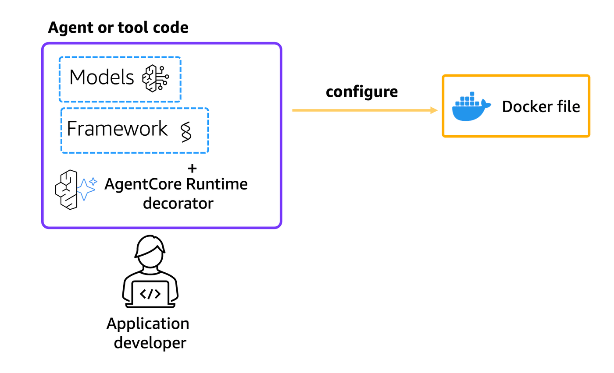

# Understanding Runtime Context and Session Management in AgentCore Runtime

## Overview

In this tutorial, we will learn how to understand and work with runtime context and session management in Amazon Bedrock AgentCore Runtime. This example demonstrates how AgentCore Runtime handles sessions, maintains context across multiple invocations, and how agents can access runtime information through the context object.

Amazon Bedrock AgentCore Runtime provides isolated sessions for each user interaction, enabling agents to maintain context and state across multiple invocations while ensuring complete security isolation between different users.

### Tutorial Details

|Information| Details|
|:--------------------|:---------------------------------------------------------------------------------|
| Tutorial type       | Context and Session Management|
| Agent type          | Single         |
| Agentic Framework   | Strands Agents |
| LLM model           | Anthropic Claude Haiku 4.5 |
| Tutorial components | Runtime Context, Session Management, AgentCore Runtime, Strands Agent and Amazon Bedrock Model |
| Tutorial vertical   | Cross-vertical                                                                   |
| Example complexity  | Intermediate                                                                     |
| SDK used            | Amazon BedrockAgentCore Python SDK and boto3|

### Tutorial Architecture

In this tutorial, we will explore how Amazon Bedrock AgentCore Runtime manages sessions and provides context to agents. We'll demonstrate:

1. **Session Continuity**: How the same session ID maintains context across multiple invocations
2. **Context Object**: How agents can access runtime information through the context parameter
3. **Session Isolation**: How different session IDs create completely isolated environments
4. **Payload Flexibility**: How to pass custom data to agents through the payload

For demonstration purposes, we will use a Strands Agent that showcases these session management capabilities.

    
<div style="text-align:left">
    
</div>

### Tutorial Key Features

* **Session-based Context Management**: Understanding how AgentCore Runtime maintains context within sessions
* **Runtime Session Lifecycle**: Learning about session creation, maintenance, and termination
* **Context Object Access**: Accessing runtime information like session ID through the context parameter
* **Session Isolation**: Demonstrating how different sessions provide complete isolation
* **Payload Handling**: Flexible data passing through custom payload structures
* **Cross-invocation State**: Maintaining agent state across multiple calls within the same session

## Prerequisites

To execute this tutorial you will need:
* Python 3.10+
* AWS credentials
* Amazon Bedrock AgentCore SDK
* Strands Agents
* Docker running

## Understanding Amazon Bedrock AgentCore Runtime Sessions

Before diving into the code, it's important to understand how Amazon Bedrock AgentCore Runtime manages sessions:

### Session Isolation and Security

AgentCore Runtime provides **complete session isolation** through dedicated microVMs:

- **Dedicated Resources**: Each session runs in its own microVM with isolated CPU, memory, and filesystem
- **Security Boundaries**: Complete separation between user sessions prevents data contamination
- **Deterministic Cleanup**: After session completion, the microVM is terminated and memory is sanitized

### Session Lifecycle

Sessions in AgentCore Runtime follow a specific lifecycle:

1. **Creation**: A new session is created on first invocation with a unique `runtimeSessionId`
2. **Active State**: Session processes requests and maintains context
3. **Idle State**: Session waits for next invocation while preserving context
4. **Termination**: Session ends due to:
   - Inactivity (15 minutes)
   - Maximum lifetime (8 hours)
   - Health check failures

**Tip: Session Lifecycle is [configurable](https://docs.aws.amazon.com/bedrock-agentcore/latest/devguide/runtime-lifecycle-settings.html#configuration-attributes), so, it's important to configure it based on your business needs!**

### Context Persistence

Within a session, AgentCore Runtime maintains:
- **Conversation History**: Previous interactions and responses
- **Application State**: Variables and objects created during execution
- **File System**: Any files created or modified during the session
- **Environment Variables**: Custom settings and configurations

### Session Management Best Practices

- **Unique Session IDs**: Generate unique session IDs for each user or conversation
- **Context Reuse**: Use the same session ID for related invocations to maintain context
- **Session Boundaries**: Use different session IDs for different users or unrelated conversations
- **Ephemeral Nature**: Don't rely on sessions for permanent data storage (use AgentCore Memory for persistence)

```python
!pip install --force-reinstall -U -r requirements.txt --quiet
```

## Preparing your agent for deployment on AgentCore Runtime

Let's now deploy our agent to AgentCore Runtime to demonstrate session management and context handling. Our agent will showcase how to:

1. **Access Runtime Context**: Use the `context` parameter to get session information
2. **Handle Custom Payloads**: Process structured data passed through the payload
3. **Maintain Session State**: Keep track of user interactions within a session
4. **Demonstrate Session Boundaries**: Show how different sessions are isolated

### Understanding the Context Object

The `context` object in AgentCore Runtime provides valuable information about the current execution environment:

- **session_id**: The current runtime session identifier
- **Runtime Metadata**: Information about the runtime environment
- **Execution Details**: Context about the current invocation

### Strands Agent with Context Handling

Let's look at our implementation that demonstrates session management and context handling:

```python
%%writefile strands_claude_context.py
from strands import Agent, tool
from strands_tools import calculator # Import the calculator tool
import argparse
import json
from bedrock_agentcore.runtime import BedrockAgentCoreApp
from strands.models import BedrockModel
import asyncio
from datetime import datetime

app = BedrockAgentCoreApp()

# Create a custom tool 
@tool
def weather():
    """ Get weather """ # Dummy implementation
    return "sunny"

@tool
def get_time():
    """ Get current time """
    return datetime.now().strftime("%Y-%m-%d %H:%M:%S")

model_id = "global.anthropic.claude-haiku-4-5-20251001-v1:0"
model = BedrockModel(
    model_id=model_id,
)
agent = Agent(
    model=model,
    tools=[
        calculator, weather, get_time
    ],
    system_prompt="""
    You're a helpful assistant. You can do simple math calculations, 
    tell the weather, and provide the current time.
    Always start by acknowledging the user's name 
    """
)

def get_user_name(user_id):
    users = {
        "1": "Maira",
        "2": "Mani",
        "3": "Mark",
        "4": "Ishan",
        "5": "Dhawal"
    }
    return users[user_id]
    
@app.entrypoint
def strands_agent_bedrock_handling_context(payload, context):
    """
    AgentCore Runtime entrypoint that demonstrates context handling and session management.
    
    Args:
        payload: The input payload containing user data and request information
        context: The runtime context object containing session and execution information
    
    Returns:
        str: The agent's response incorporating context information
    """
    user_input = payload.get("prompt")
    user_id = payload.get("user_id")
    user_name = get_user_name(user_id)
    
    # Access runtime context information
    print("=== Runtime Context Information ===")
    print("User id:", user_id)
    print("User Name:", user_name)
    print("User input:", user_input)
    print("Runtime Session ID:", context.session_id)
    print("Context Object Type:", type(context))
    print("=== End Context Information ===")
    
    # Create a personalized prompt that includes context information
    prompt = f"""My name is {user_name}. Here is my request: {user_input}
    
    Additional context: This is session {context.session_id}. 
    Please acknowledge my name and provide assistance."""
    
    response = agent(prompt)
    return response.message['content'][0]['text']

if __name__ == "__main__":
    app.run()
```

## Understanding Session Management in AgentCore Runtime

The code above demonstrates several key concepts about how AgentCore Runtime manages sessions and provides context to agents:

### Context Object Structure

The `context` parameter in your entrypoint function provides access to runtime information:

```python
@app.entrypoint
def strands_agent_bedrock_handling_context(payload, context):
    # Access session information
    session_id = context.session_id
    # Use context information in your agent logic
```

### Session Continuity Benefits

Within a single session, AgentCore Runtime provides:

1. **Persistent Environment**: Variables and state persist across invocations
2. **Context Preservation**: The agent can reference previous interactions
3. **Resource Reuse**: Initialized models and tools remain loaded
4. **Performance Benefits**: Reduced cold start times for subsequent invocations

### Session Isolation Guarantees

AgentCore Runtime ensures complete isolation between sessions:

- **Security**: Each session runs in its own microVM with isolated resources
- **Privacy**: No data leakage between different user sessions
- **Reliability**: Issues in one session don't affect others
- **Cleanup**: Complete memory sanitization after session termination

### Payload Flexibility

The `payload` parameter allows flexible data passing:

```python
# Example payload structures
payload = {
    "prompt": "User's question",
    "user_id": "1",
    "preferences": {...},
    "context_data": {...}
}
```

This enables rich, structured communication between clients and agents while maintaining the session context provided by the runtime.

### Configure AgentCore Runtime deployment

Next we will use our starter toolkit to configure the AgentCore Runtime deployment with an entrypoint, the execution role we just created and a requirements file. We will also configure the starter kit to auto create the Amazon ECR repository on launch.

During the configure step, your docker file will be generated based on your application code

<div style="text-align:left">
    
</div>

```python
from bedrock_agentcore_starter_toolkit import Runtime
from boto3.session import Session

boto_session = Session()
region = boto_session.region_name
region

agentcore_runtime = Runtime()

response = agentcore_runtime.configure(
    entrypoint="strands_claude_context.py",
    auto_create_execution_role=True,
    auto_create_ecr=True,
    requirements_file="requirements.txt",
    region=region,
    agent_name="strands_claude_context",
)
```

### Launching the context-aware agent to AgentCore Runtime

Now that we've got a docker file, let's launch our context-aware agent to the AgentCore Runtime. This will create the Amazon ECR repository and the AgentCore Runtime.

Our agent will demonstrate how AgentCore Runtime manages sessions and provides context information to agents.

<div style="text-align:left">
    
</div>

```python
launch_result = agentcore_runtime.launch()
```

### Checking for the AgentCore Runtime Status
Now that we've deployed the AgentCore Runtime, let's check for it's deployment status

```python
status_response = agentcore_runtime.status()
status_response.endpoint["status"]
```

## Demonstrating Session Management and Context Handling

Now let's demonstrate the key session management features of AgentCore Runtime by testing different scenarios:

### Scenario 1: Session Continuity
We'll use the same session ID for multiple invocations to show how context is maintained.

### Scenario 2: Session Isolation
We'll use different session IDs to demonstrate complete isolation between sessions.

### Scenario 3: Context Information Access
We'll show how agents can access runtime context information.

<div style="text-align:left">
    
</div>

Now, you are going to create first session, for user with ID = 1

```python
import uuid
from IPython.display import Markdown, display

# Create a session ID for demonstrating session continuity
session_id = uuid.uuid4()
print(f"📋 Starting Session 1: {session_id}")
print("👤 User: Maira (ID: 1)")
print("❓ First question about weather\n")

invoke_response = agentcore_runtime.invoke(
    {"prompt": "How is the weather outside?", "user_id": "1"},
    session_id=str(session_id),
)

response_data = invoke_response["response"][0]
display(Markdown(response_data))
```

And you can keep asking questions, with same session:

```python
# Continue with the same session ID to demonstrate session continuity
print(f"🔄 Continuing Session 1: {session_id}")
print("👤 Same user: Maira (ID: 1)")
print("❓ Follow-up question about math\n")

invoke_response = agentcore_runtime.invoke({"prompt": "How much is 2X5?", "user_id": "1"}, session_id=str(session_id))

response_data = invoke_response["response"][0]
display(Markdown(response_data))
```

Agent will have information on previous interaction, because it keeps working with same session

```python
# Continue with the same session ID - notice how the agent remembers the previous calculation
print(f"🔄 Continuing Session 1: {session_id}")
print("👤 Same user: Maira (ID: 1)")
print("❓ Building on previous answer - demonstrates context continuity\n")

invoke_response = agentcore_runtime.invoke({"prompt": "and that plus 34?", "user_id": "1"}, session_id=str(session_id))

response_data = invoke_response["response"][0]
display(Markdown(response_data))
```

#### Stop Session 1

Now that this interaction has finished, we can stop it using `stop_runtime_session` command. 

The [StopRuntimeSession](https://docs.aws.amazon.com/bedrock-agentcore/latest/devguide/runtime-stop-session.html) operation lets you immediately terminate active agent AgentCore Runtime sessions for proper resource cleanup and session lifecycle management.

This command will terminate the active session (microVM) that this user was interacting, so, if the user start a new conversation, the context will be missed. This can be configurable based on your business requirements, and it's a good practice to use it after your current workload finishes.

```python
# --- Inline Session Lifecycle Demo (Scenario 1) ---
# Now that we've finished the session continuity demo, stop this session.
# stop_runtime_session releases the microVM resources for this specific session
# while keeping the runtime alive for new sessions.

import boto3

agentcore_client = boto3.client("bedrock-agentcore", region_name=region)

agentcore_client.stop_runtime_session(
    agentRuntimeArn=launch_result.agent_arn,
    runtimeSessionId=str(session_id),
    qualifier="DEFAULT",
)
print(f"✅ Session 1 '{session_id}' stopped — microVM resources released")
```

Now that user 1 session was terminated, any new interaction will result in a new session (and microVM) without previous history.

```python
# NEW SESSION - Demonstrate session isolation
# Create a completely new session ID to show that context is lost
new_session_id = uuid.uuid4()
print(f"🆕 Starting NEW Session 2: {new_session_id}")
print("👤 Same user: Maira (ID: 1)")
print("❓ Attempting to reference previous calculation - should fail due to session isolation\n")

invoke_response = agentcore_runtime.invoke({"prompt": "And plus 10?", "user_id": "1"}, session_id=str(new_session_id))

response_data = invoke_response["response"][0]
display(Markdown(response_data))
```

Finally, let's terminate this new session

Now, to show session isolation, before finish this second session of the user 1, let's start a new conversation with user 2.

```python
# NEW SESSION AND USER - Demonstrate complete isolation
different_user_session = uuid.uuid4()
print(f"🆕 Starting Session 3: {different_user_session}")
print("👤 Different user: Mani (ID: 2)")
print("❓ Same question as first user - demonstrates user isolation\n")

invoke_response = agentcore_runtime.invoke(
    {"prompt": "How is the weather?", "user_id": "2"},
    session_id=str(different_user_session),
)

response_data = invoke_response["response"][0]
display(Markdown(response_data))
```

### Stopping both sessions

You'll want to stop individual sessions when they're no longer needed.

This releases the microVM resources for that session.

```python
# --- Inline Session Lifecycle Demo (Scenario 2) ---
# Stop the isolation demo session. Even though context was lost (by design),
# the microVM is still running. Stopping it releases those resources.

agentcore_client.stop_runtime_session(
    agentRuntimeArn=launch_result.agent_arn,
    runtimeSessionId=str(new_session_id),
    qualifier="DEFAULT",
)
print(f"✅ Session 2 '{new_session_id}' stopped — microVM resources released")
```

```python
# --- Inline Session Lifecycle Demo (Scenario 3) ---
# Stop the different-user session to complete the lifecycle demonstration.

agentcore_client.stop_runtime_session(
    agentRuntimeArn=launch_result.agent_arn,
    runtimeSessionId=str(different_user_session),
    qualifier="DEFAULT",
)
print(f"✅ Session 3 '{different_user_session}' stopped — microVM resources released")
print()
print("All demo sessions stopped. The runtime is still alive for new sessions.")
```

### Lifecycle Configuration Demo — Shorter Idle Timeout

Now let's create a second runtime with a smaller idle timeout to demonstrate
how lifecycle configuration works. Both runtimes will coexist — the original
one and this new one with a shorter timeout.

A shorter idle timeout helps avoid undesired costs by automatically terminating
sessions that are no longer active. In production, you should choose a timeout 
that is appropriate for your workload.

```python
# --- Create a second runtime with a shorter idle timeout ---
# Both runtimes will coexist: the first one and this new one.
# This demonstrates how you can configure different timeout values
# for different use cases within the same account.

agentcore_runtime_short_timeout = Runtime()

response = agentcore_runtime_short_timeout.configure(
    entrypoint="strands_claude_context.py",
    auto_create_execution_role=True,
    auto_create_ecr=True,
    requirements_file="requirements.txt",
    region=region,
    agent_name="strands_claude_context_short_timeout",
)
print("✅ Configured second runtime")
```

```python
# --- Launch the second runtime ---
launch_result_short = agentcore_runtime_short_timeout.launch()
print("✅ Second runtime launched")
print(f"   Agent ID: {launch_result_short.agent_id}")
print(f"   Agent ARN: {launch_result_short.agent_arn}")
```

```python
# --- Set a shorter idle timeout via boto3 update_agent_runtime ---
# The Starter Toolkit doesn't expose lifecycleConfiguration directly,
# so we use boto3 to set idleRuntimeSessionTimeout after creation.
# Default is 900s (15 min). We set 300s (5 min) for this demo.
# update_agent_runtime requires the full config, so we read it first.

agentcore_control_client = boto3.client("bedrock-agentcore-control", region_name=region)

# Get current runtime config to pass required fields back
runtime_info = agentcore_control_client.get_agent_runtime(agentRuntimeId=launch_result_short.agent_id)

agentcore_control_client.update_agent_runtime(
    agentRuntimeId=launch_result_short.agent_id,
    agentRuntimeArtifact=runtime_info["agentRuntimeArtifact"],
    roleArn=runtime_info["roleArn"],
    networkConfiguration=runtime_info["networkConfiguration"],
    lifecycleConfiguration={
        "idleRuntimeSessionTimeout": 300  # 5 minutes — shorter timeout for demo
    },
)
print("✅ Updated idle timeout to 300s (5 minutes) via lifecycleConfiguration")
```

```python
# check status to ensure it's ready
status_response = agentcore_runtime_short_timeout.status()
status = status_response.endpoint["status"]
status
```

```python
# --- Invoke the second runtime to verify it works ---
# This session will auto-terminate after 5 minutes of inactivity,
# unlike the original runtime which uses the default timeout of 15 minutes.

short_timeout_session = uuid.uuid4()
print(f"📋 Invoking runtime with shorter idle timeout (session: {short_timeout_session})")
print("   This session will auto-terminate after 5 minutes of inactivity\n")

invoke_response = agentcore_runtime_short_timeout.invoke(
    {"prompt": "What time is it?", "user_id": "1"},
    session_id=str(short_timeout_session),
)

response_data = invoke_response["response"][0]
display(Markdown(response_data))

print("\n✅ Both runtimes are running simultaneously:")
print(f"   Original runtime: {launch_result.agent_id} (default timeout)")
print(f"   Short-timeout runtime: {launch_result_short.agent_id} (5 min idle timeout)")
print("   The short-timeout session will auto-stop after 5 minutes of inactivity,")
print("   releasing microVM resources without manual intervention.")
```

## Understanding the Session Management Results

The demonstrations above showcase several key aspects of AgentCore Runtime's session management:

### 1. Session Continuity (Session 1)
- **First invocation**: Agent responds to weather question and acknowledges user name
- **Second invocation**: Agent performs calculation (2×5=10)
- **Third invocation**: Agent references previous result ("that plus 34" = 44)

**Key Learning**: The agent maintained context across multiple invocations within the same session, remembering the calculation result from the previous interaction.

### 2. Session Isolation (Session 2)
- **New session ID**: Created a completely new session
- **Same user**: Used the same user ID but different session
- **Context loss**: Agent cannot reference previous calculation

**Key Learning**: Even with the same user, a new session creates a completely isolated environment with no access to previous context.

### 3. User and Session Isolation (Session 3)
- **Different user**: Mani instead of Maira
- **New session**: Complete isolation from previous sessions
- **Fresh context**: Agent starts with clean state

**Key Learning**: Each session provides complete isolation, ensuring privacy and security between different users and interactions.

### 4. Context Object Usage
Throughout all invocations, the agent:
- Accessed the runtime context via `context.session_id`
- Processed custom payload data (`user_id`, `prompt`)
- Maintained logging and debugging information

**Key Learning**: The context object provides valuable runtime information that agents can use for enhanced functionality and debugging.

### Session Management Best Practices Demonstrated

1. **Use consistent session IDs** for conversational continuity
2. **Generate unique session IDs** for different users or conversations
3. **Leverage context information** for enhanced agent behavior
4. **Design for session boundaries** - don't assume persistence across sessions
5. **Handle graceful context loss** when sessions change or expire

## Session Lifecycle Best Practices

AgentCore Runtime costs are based on vCPU and Memory. A best practice to avoid undesired costs is to explicitly stop the session or set up a properly configured idle timeout, so the session will be terminated.

To manage costs effectively:

- **Configure idle timeout**: Set an appropriate idle timeout during session creation to automatically stop inactive sessions. Choose a value based on your use case (e.g., shorter for development/testing, longer for production workloads).
- **Stop sessions when done**: Use `stop_runtime_session` to release the microVM resources for a specific session while keeping the runtime alive for new sessions.

## Cleanup

Let's now clean up the AgentCore Runtime and associated resources. We delete the runtime first to avoid undesired costs, then clean up supporting resources like ECR repositories.

```python
launch_result.ecr_uri, launch_result.agent_id, launch_result.ecr_uri.split("/")[1]
```

```python
# --- Stop active sessions to release microVM resources ---
import boto3

agentcore_client = boto3.client("bedrock-agentcore", region_name=region)
agentcore_control_client = boto3.client("bedrock-agentcore-control", region_name=region)
ecr_client = boto3.client("ecr", region_name=region)

# Stop sessions from the original runtime (session continuity + isolation demos)
for sid in [session_id, new_session_id, different_user_session]:
    try:
        agentcore_client.stop_runtime_session(
            agentRuntimeArn=launch_result.agent_arn,
            runtimeSessionId=str(sid),
            qualifier="DEFAULT",
        )
        print(f"✅ Session '{sid}' stopped")
    except Exception as e:
        print(f"⚠️ Failed to stop session '{sid}': {e}")

# Stop session from the short-timeout runtime demo
try:
    agentcore_client.stop_runtime_session(
        agentRuntimeArn=launch_result_short.agent_arn,
        runtimeSessionId=str(short_timeout_session),
        qualifier="DEFAULT",
    )
    print(f"✅ Short-timeout session '{short_timeout_session}' stopped")
except Exception as e:
    print(f"⚠️ Failed to stop short-timeout session: {e}")

# --- Delete both runtimes ---
# Original runtime
try:
    agentcore_control_client.delete_agent_runtime(
        agentRuntimeId=launch_result.agent_id,
    )
    print(f"✅ Original runtime '{launch_result.agent_id}' deleted")
except Exception as e:
    print(f"⚠️ Failed to delete original runtime: {e}")

# Short-timeout runtime
try:
    agentcore_control_client.delete_agent_runtime(
        agentRuntimeId=launch_result_short.agent_id,
    )
    print(f"✅ Short-timeout runtime '{launch_result_short.agent_id}' deleted")
except Exception as e:
    print(f"⚠️ Failed to delete short-timeout runtime: {e}")

# --- Delete ECR repositories ---
for ecr_uri in set([launch_result.ecr_uri, launch_result_short.ecr_uri]):
    try:
        ecr_client.delete_repository(repositoryName=ecr_uri.split("/")[1], force=True)
        print(f"✅ ECR repository '{ecr_uri.split('/')[1]}' deleted")
    except Exception as e:
        print(f"⚠️ Failed to delete ECR repository: {e}")
```

# Congratulations!

You have successfully implemented and tested session management and context handling with Amazon Bedrock AgentCore Runtime! 

## What you've learned:

### Session Management Fundamentals
* **Session Continuity**: How the same session ID maintains context across multiple invocations
* **Session Isolation**: How different session IDs create completely isolated environments
* **Context Preservation**: How agents can maintain state and reference previous interactions
* **Security Boundaries**: How AgentCore Runtime ensures complete isolation between users

### Runtime Context Handling
* **Context Object Access**: How to access runtime information via the `context` parameter
* **Session Information**: How to retrieve and use session IDs in your agent logic
* **Payload Processing**: How to handle structured data passed through custom payloads
* **Runtime Metadata**: How agents can access execution environment information

### AgentCore Runtime Architecture
* **MicroVM Isolation**: Each session runs in its own isolated microVM
* **Resource Management**: Dedicated CPU, memory, and filesystem per session
* **Security Model**: Complete memory sanitization after session termination
* **Lifecycle Management**: Session states (active, idle, terminated) and timeouts

### Best Practices Implementation
* **Session ID Generation**: Creating unique identifiers for different conversations
* **Context Utilization**: Leveraging runtime context for enhanced agent behavior
* **State Management**: Understanding ephemeral vs persistent state
* **Error Handling**: Graceful handling of context loss and session boundaries
