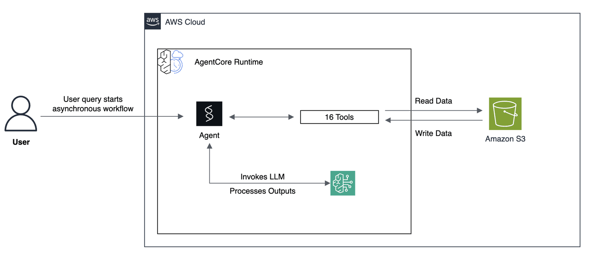
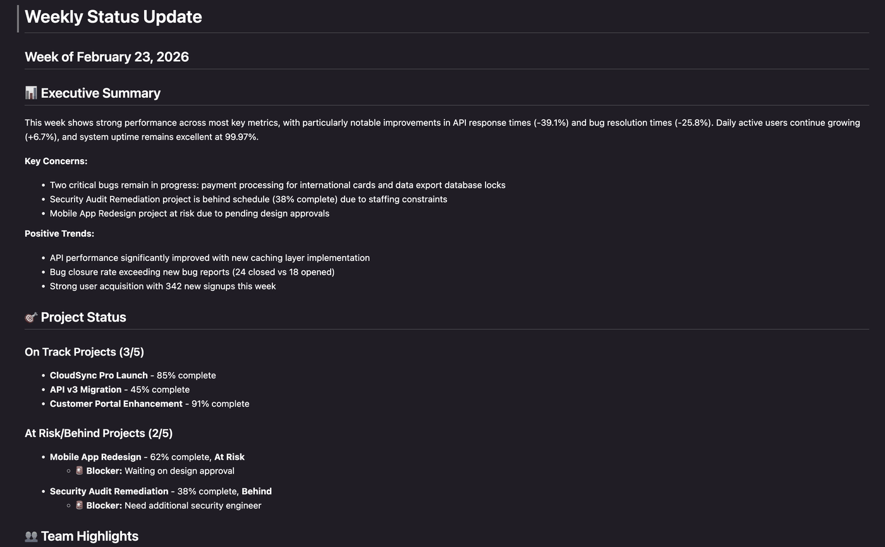

# Weekly Update Generator - AgentCore Deployment

## Overview

In this tutorial we will learn how to build and deploy an automated weekly status report generator using Amazon Bedrock AgentCore Runtime. The agent collects data from multiple sources (team updates, meeting notes, metrics, bug trackers), performs analysis, generates visualizations, and uploads comprehensive reports to S3.

### Architecture & Files



- **Agent Implementation**: `01_weekly_report_generator_async/agent/agent.py` - Main agent file that defines the Bedrock Agent Core application, agent configuration, and entrypoint
- **Tools**: `01_weekly_report_generator_async/agent/tools.py` - Contains 16 tools for data reading, analysis, visualization, and S3 upload
- **Demo Data**: `01_weekly_report_generator_async/demo_data/` directory containing:
  - `project_status/` - CSV files with project progress and blockers
  - `team_updates/` - Markdown files with individual team member updates
  - `metrics/` - CSV files with KPI data (current and historical)
  - `issues/` - JSON files with bug tracker data
  - `meeting_notes/` - Markdown files with meeting summaries

### How It Works

1. **Data Collection** - The agent dynamically discovers and reads the latest week's data:
   - Scans directories for files matching patterns like `projects_week_XX.csv`, `kpis_week_XX.csv`, `bug_tracker_week_XX.json`
   - Automatically uses the most recent week number found
   - Reads all team member markdown files and meeting notes

2. **Data Analysis** - The agent performs intelligent analysis:
   - Validates data quality and completeness across all sources
   - Cross-references information (e.g., matching project names in status files vs team updates)
   - Performs sentiment analysis on team updates to detect morale issues
   - Calculates risk scores based on project health, blockers, and bug severity

3. **Visualization Generation** - Creates PNG charts using matplotlib:
   - Bug severity distribution (pie/bar charts)
   - KPI metrics trends with historical comparison
   - Project timeline and progress visualization
   - Team velocity charts
   - Predictive forecast models for key metrics

4. **Report Synthesis** - Compiles a structured markdown report with:
   - Executive summary with key highlights and concerns
   - Detailed sections for projects, team updates, KPIs, bugs, and meetings
   - Risk analysis and blockers
   - Action items and next week priorities

5. **S3 Upload** - Automatically uploads to S3:
   - Final markdown report
   - All generated chart images
   - Organized by date in the S3 bucket for easy retrieval

### Tutorial Details

| Information         | Details                                                                          |
|:--------------------|:---------------------------------------------------------------------------------|
| Tutorial type       | Asynchronous agent                                                       |
| Agent type          | Single                                                                           |
| Agentic Framework   | Strands Agents                                                                   |
| LLM model           | Anthropic Claude Sonnet 4.5                                                        |
| Tutorial components | Multi-tool agent, data analysis, visualization, S3 integration, AgentCore Runtime|
| Tutorial vertical   | Business Operations & Reporting                                                  |
| Example complexity  | Intermediate                                                                     |
| SDK used            | Amazon BedrockAgentCore Python SDK, boto3, matplotlib, scikit-learn              |

### Tutorial Architecture

This tutorial demonstrates how to deploy an asynchronous reporting agent to AgentCore runtime. The agent orchestrates 16 different tools to create comprehensive weekly status reports automatically.

### Tutorial Key Features

* Hosting an asychronous, multi-tool agent on Amazon Bedrock AgentCore Runtime
* Using Amazon Bedrock models (Claude Sonnet 4)
* Using Strands Agents SDK
* S3 integration for data storage and report delivery

### Deployment

The agent runs as a Bedrock Agent Core application that can be:
- Invoked locally for testing
- Deployed to AWS Lambda for production use
- Called via API with async task tracking (returns immediately while processing in background)
- Monitored via ping endpoint that reports HEALTHY or HEALTHY_BUSY status


## Prerequisites
- AWS Account with access to Amazon Bedrock AgentCore
- AWS credentials
- Python 3.12+
- S3 bucket for storing demo data and reports

## Setup and Imports

```python
from bedrock_agentcore_starter_toolkit import Runtime
from boto3.session import Session
import time
import json
import boto3
from datetime import datetime, timedelta

print("✅ Imports successful!")
```

## Pre-deployment Configuration

```python
boto_session = Session()
region = boto_session.region_name
agent_name = "weekly_update_generator"

# TODO: Replace with your S3 bucket name
S3_BUCKET = "YOUR-BUCKET-NAME"
S3_PREFIX = "demo_data"

print(f"📍 Region: {region}")
print(f"🤖 Agent name: {agent_name}")
print(f"🪣 S3 Bucket: {S3_BUCKET}")
```

## Step 1: Update Demo Data and Upload to S3

```python
# Run the update script
!python update_demo_dates.py --bucket {S3_BUCKET} --prefix {S3_PREFIX}
```

## Step 2: Deploy Agent to AgentCore

The CreateAgentRuntime operation supports comprehensive configuration options, letting you specify container images, environment variables and encryption settings. You can also configure protocol settings (HTTP, MCP) and authorization mechanisms to control how your clients communicate with the agent.

In this tutorial can will the Amazon Bedrock AgentCore Python SDK to easily package your artifacts and deploy them to AgentCore runtime.

### Async Agent Implementation

The `01_weekly_report_generator_async/agent/agent.py` file implements an asynchronous agent that handles long-running report generation tasks. When invoked, the agent immediately returns a task ID and processes the request in a background thread. This allows the caller to continue without waiting for the entire report generation to complete.

The agent tracks active tasks using a counter and implements a `@app.ping` handler that reports the agent's status:

### Understanding the /ping Endpoint

The `/ping` endpoint is crucial for monitoring async agents. It returns one of two statuses:

- **`{"status": "Healthy"}`** - Agent is idle and ready to accept new tasks
- **`{"status": "HealthyBusy"}`** - Agent is actively processing tasks but still responsive

This allows clients to:
- Poll the agent to determine when tasks complete
- Monitor agent health without interfering with ongoing work
- Implement retry logic based on agent availability

For more details, see the [Asynchronous Agents documentation](https://docs.aws.amazon.com/bedrock-agentcore/latest/devguide/runtime-long-run.html).

### Configure AgentCore Runtime deployment
First we will use our starter toolkit to configure the AgentCore Runtime deployment with an entrypoint, the execution role we just created and a requirements file. We will also configure the starter kit to auto create the Amazon ECR repository on launch.

During the configure step, your docker file will be generated based on your application code. Tools are packaged with the agent so that the agent can access them at runtime.


```python
# Change to agent directory for configuration
import os

os.chdir("agent")
print(f"Working directory: {os.getcwd()}")
```

### Configure the agent

```python
agentcore_runtime = Runtime()

response = agentcore_runtime.configure(
    entrypoint="agent.py",
    auto_create_execution_role=True,
    auto_create_ecr=True,
    requirements_file="requirements.txt",
    region=region,
    agent_name=agent_name,
)

print("✅ Agent configured")
response
```

### Launch the agent to AgentCore Runtime

Now that we've got a docker file, let's launch the agent to the AgentCore Runtime. This will create the Amazon ECR repository and the AgentCore Runtime


```python
launch_result = agentcore_runtime.launch()

print("🚀 Agent launched")
print(f"Agent ARN: {launch_result.agent_arn}")
launch_result

# Change back to notebook directory
os.chdir("..")
print(f"Changed back to: {os.getcwd()}")
```

## Step 3: Wait for Agent to be Ready

Let's check the agent's deployment status to ensure it can be invoked succesfully

```python
status_response = agentcore_runtime.status()
status = status_response.endpoint["status"]
end_status = ["READY", "CREATE_FAILED", "DELETE_FAILED", "UPDATE_FAILED"]

print(f"Status: {status}")

while status not in end_status:
    time.sleep(10)
    status_response = agentcore_runtime.status()
    status = status_response.endpoint["status"]
    print(f"Status: {status}")

print(f"\n✅ Agent is {status}")
```

## Step 4: Add S3 Permissions to Execution Role

For this tutorial, we will read and write data stored in an Amazon S3 bucket. Now that our agent has been launched, we need to give the agent permission to access the S3 bucket.

```python
# Get execution role from agent runtime
agent_runtime_id = launch_result.agent_arn.split("/")[-1]
print(f"Agent Runtime ID: {agent_runtime_id}")

agentcore_client = boto3.client("bedrock-agentcore-control", region_name=region)


response = agentcore_client.get_agent_runtime(agentRuntimeId=agent_runtime_id, agentRuntimeVersion="1")

execution_role_arn = response.get("roleArn")

execution_role_name = execution_role_arn.split("/")[-1]
print(f"✓ Execution role: {execution_role_name}")

iam_client = boto3.client("iam")
policy_document = {
    "Version": "2012-10-17",
    "Statement": [
        {
            "Effect": "Allow",
            "Action": ["s3:GetObject", "s3:PutObject", "s3:ListBucket"],
            "Resource": [f"arn:aws:s3:::{S3_BUCKET}", f"arn:aws:s3:::{S3_BUCKET}/*"],
        }
    ],
}

iam_client.put_role_policy(
    RoleName=execution_role_name,
    PolicyName="WeeklyReportsS3Access",
    PolicyDocument=json.dumps(policy_document),
)

print("\n✅ S3 permissions added!")
print(f"   Role: {execution_role_name}")
print(f"   Bucket: {S3_BUCKET}")
```

## Step 5: Invoke the Agent

Finally, we can invoke our agent and have it generate our weekly report

```python
import time
import json

# Get current week info
today = datetime.now()
monday = today - timedelta(days=today.weekday())

print(f"🚀 Starting async agent invocation for week of {monday.strftime('%B %d, %Y')}...\n")

# Invoke the agent
start_time = time.time()
invoke_response = agentcore_runtime.invoke(
    {"prompt": f"Generate the weekly status report for the week of {monday.strftime('%B %d, %Y')}."}
)

print("✅ Agent invocation started")

# Extract task info from response
if "response" in invoke_response and invoke_response["response"]:
    task_info = json.loads(invoke_response["response"][0])
    task_id = task_info.get("task_id")
    print(f"📋 Task ID: {task_id}")
    print(f"📊 Initial Status: {task_info.get('status')}")
    print(f"💬 {task_info.get('message')}\n")

print("⏳ Polling agent status...\n")

poll_count = 0
time.sleep(5)  # Give agent time to start

while True:
    poll_count += 1
    elapsed = time.time() - start_time

    try:
        # Ping the agent to determine busy status"
        ping_response = agentcore_runtime.invoke({"method": "ping", "payload": {}})

        if "response" in ping_response and ping_response["response"]:
            response_data = json.loads(ping_response["response"][0])
            health_status = response_data.get("status", "Unknown")
            active_tasks = response_data.get("active_tasks", 0)

            print(f"Poll #{poll_count} ({elapsed:.1f}s): {health_status} (active tasks: {active_tasks})")

            # Check if agent is Healthy (no active tasks)
            if health_status == "Healthy":
                print(f"\n✅ Task completed in {elapsed:.1f} seconds")
                break

    except Exception as e:
        print(f"Poll #{poll_count} ({elapsed:.1f}s): Error - {e}")

    if elapsed > 600:
        print(f"\n⚠️ Timeout after {elapsed:.1f} seconds")
        break

    time.sleep(5)

# Printing report output path
week_num = today.isocalendar()[1]
year = today.year
week_folder = f"{year}/week_{week_num:02d}_{monday.strftime('%Y-%m-%d')}"
print(f"\n📁 Report should be at: s3://{S3_BUCKET}/weekly_reports/{week_folder}/weekly_report.md")
```

## 6. View the Agent's Output

Once the agent has created the weekly report, you will find it in S3 under the path of s3:/{your-bucket-name}/weekly_reports/{year}/{week}/weekly_report.md.



## Cleanup (Optional)
Let's now clean up the AgentCore Runtime created

```python
launch_result.ecr_uri, launch_result.agent_id, launch_result.ecr_uri.split("/")[1]

agentcore_control_client = boto3.client("bedrock-agentcore-control", region_name=region)

runtime_delete_response = agentcore_control_client.delete_agent_runtime(
    agentRuntimeId=launch_result.agent_id,
)
print("Deleting Runtime")
```

```python
repo_name = launch_result.ecr_uri.split("/")[-1].split(":")[0]

ecr_client = boto3.client("ecr", region_name=region)
response = ecr_client.delete_repository(repositoryName=repo_name, force=True)
print("Deleting ECR")
```
