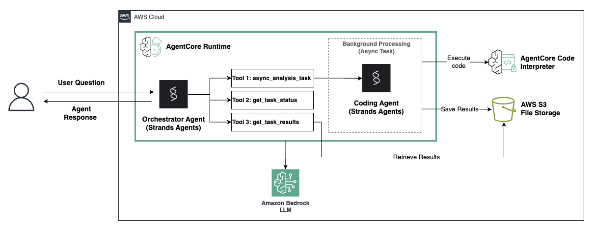

© 2025 Amazon Web Services, Inc. or its affiliates. All Rights Reserved
This AWS Content is provided subject to the terms of the AWS Customer Agreement available at http://aws.amazon.com/agreement or other written agreement between Customer and either Amazon Web Services, Inc. or Amazon Web Services EMEA SARL or both.


# Asynchronous Data Analysis Agent Tutorial

## Overview

In this tutorial, we'll build an asynchronous data analysis agent that can perform long-running analysis tasks in the background while maintaining a responsive conversation with the user. This demonstrates how to leverage Amazon Bedrock AgentCore's asynchronous capabilities with Strands to create agents that handle time-consuming operations gracefully.

### Use Case Details

| Information         | Details                                                                      |
|---------------------|------------------------------------------------------------------------------|
| Use case type       | Data Analysis Assistant                                                      |
| Agent type          | Asynchronous                                                                 |
| Agentic Framework   | Strands                                                                      |
| LLM models          | Anthropic Claude Sonnet 4 (primary agent) & Haiku 4.5 (coding agent)         |
| Components          | AgentCore Runtime, Async Tasks, Mock Analysis Tool                           |
| Example complexity  | Intermediate                                                                 |
| SDK used            | Amazon BedrockAgentCore Python SDK                                           |

### Use Case Architecture

This data analysis assistant demonstrates a powerful pattern for building responsive AI agents:

1. The user requests data analysis
2. The agent launches a background task using AgentCore's async capabilities
3. While the background task runs (~1 minute), the agent continues conversing
4. When results are ready, they're stored in a file
5. The agent retrieves and presents results when requested



### Agent Flow Diagram

```
               User Request
                    ↓
               Main Agent
                    ↓
               start_data_analysis_task()
                    ↓
              Returns immediately
              "Task started with ID: 12345"
                    ↓
         ┌──────────┴──────────┐
         │                     │
    Main Agent            Background Thread
    (responsive)          (async processing)
         │                     │
    Answers other              ↓
    questions              1. Download data from S3
         │                     ↓
    "What is the capital   2. Start Code Interpreter
     of France?"               ↓
         │                 3. Write data.csv to session
    Returns output             ↓
         │                 4. Coding Agent generates code
         │                    5-10s (LLM call)
         │                     ↓
         │                 5. Execute code in Code Interpreter
         │                    15-30s
         │                     ↓
         │                 6. Store results in AgentCore and S3
         │                     ↓
         │                 7. Mark task complete
         │                     │
         └─────────────────────┘
                    ↓
         User asks: "Show results"
                    ↓
               Main Agent
                    ↓
          get_task_status()
                    ↓
          get_task_result()
                    ↓
          Retrieves completed results
                    ↓
          Presents to user
```

#### Key Architectural Decision: Why Coding Agent is Inside the Async Task

The Coding Agent runs INSIDE the background task, not before it.

```
User → Main Agent → start_data_analysis_task() ← Returns in <1s
                         ↓
                    Background thread:
                      - Coding Agent generates code (5-10s)
                      - Execute code (variable time)
```
Benefit: User gets immediate "task started" response. ALL expensive operations (LLM calls, code execution) happen asynchronously. The entire code generation and revision process is truly asynchronous, keeping the main agent maximally responsive.

#### Agent Workflow Steps

1. **User Request**: User makes a data analysis query with S3 URI
2. **Main Agent**: Calls `start_data_analysis_task()` tool
3. **Immediate Return**: Main agent responds in <1 second with task ID
4. **Background Processing**: 
   - Downloads data from S3
   - Starts Code Interpreter session
   - Coding Agent generates Python code (LLM call happens here)
   - Executes code in isolated environment
   - Stores results in AgentCore
5. **Parallel Conversation**: Main agent continues answering questions
6. **Task Status Check**: Main agent calls `get_task_status()` to check task status
6. **Result Retrieval**: Main agent calls `get_analysis_tasks_info()` to retrieve results for completed tasks
7. **Presentation**: Main agent formats and presents results to user

### Key Features

* **Asynchronous Task Management**: Launch background tasks that don't block conversation
* **Code Interpreter Integration**: Execute Python code in isolated, secure environments
* **S3 Data Integration**: Automatic data download and result storage
* **Embedded Coding Agent**: LLM generates analysis code inside async tasks for maximum responsiveness
* **Task Status Monitoring**: Check active tasks and retrieve completed results

## Prerequisites

To execute this tutorial you will need:
* Python 3.10+
* AWS credentials with appropriate permissions
* Amazon Bedrock AgentCore SDK
* Strands
* Docker running (for local testing and deployment)


Now that we've covered the technical setup, it's crucial to address security considerations before we begin. Since this tutorial involves AI-generated code execution in an automated workflow, implementing proper security guardrails is essential to prevent malicious code injection and ensure safe operation.

## Security: Amazon Bedrock Guardrails for AI Code Generation

### Why Code Security Matters

When AI agents generate and execute code automatically, **security becomes critical**. Without proper safeguards, malicious prompts could trick the AI into generating dangerous code that:

- **Executes system commands** (rm -rf /, sudo commands)
- **Accesses sensitive data** (reading private files, environment variables)
- **Makes network requests** (data exfiltration, downloading malware)
- **Bypasses security controls** (prompt injection attacks)

### Amazon Bedrock Guardrails Standard Tier

This tutorial implements **Amazon Bedrock Guardrails Standard Tier** with **code domain protection** to prevent these risks:

#### 🛡️ **Content Filters**
- **Misconduct**: Blocks malware, keyloggers, security exploits
- **Violence**: Prevents code that could cause physical harm
- **Prompt Attacks**: Detects jailbreaks, injection attempts, prompt leakage

#### 🔍 **Code Domain Intelligence**
- **12 Programming Languages**: Python, JavaScript, Java, C#, C++, PHP, Shell, HTML, SQL, C, GO, TypeScript
- **Context Awareness**: Understands code vs. text, legitimate vs. malicious patterns
- **PII Protection**: Detects sensitive data in code comments, variables, strings

#### ⚡ **Performance Benefits**
- **Cross-Region Inference**: High availability and low latency
- **Fail-Safe Design**: Allows legitimate analysis while blocking real threats
- **AWS Native**: Professionally maintained, automatically updated

### Security Architecture

```
Flow: User Prompt → Bedrock Guardrails → AI Code Generation → Bedrock Guardrails → Code Execution

Example 1 (Legitimate Request): "Analyze data" → ✅ SAFE → Generates: "import pandas" → ✅ SAFE → ✓ Execute

Example 2 (Malicious Request): "rm -rf /" → ❌ BLOCKED → Would generate: "os.system('rm')" → ❌ BLOCKED → ✗ Prevent
```

This **dual validation** ensures both user inputs and AI-generated code are safe before execution.

### Setup Bedrock Guardrails

The following cell will automatically create and configure Bedrock Guardrails for this tutorial:

```python
# Install required packages
!pip install -r requirements.txt --quiet
```

```python
# Setup Amazon Bedrock Guardrails Standard Tier for Code Security
import boto3
import time
import os


def setup_bedrock_guardrails():
    """Create and configure Bedrock Guardrails with Standard Tier for code domain protection"""

    bedrock_client = boto3.client("bedrock", region_name="us-east-2")

    guardrail_config = {
        "name": "async-data-analysis-code-safety",
        "description": "Code domain protection for async data analysis agent",
        "topicPolicyConfig": {
            "topicsConfig": [
                {
                    "name": "Malicious Code Generation",
                    "definition": "Code designed for malicious activities including malware, keyloggers, security exploits, system manipulation, or unauthorized access.",
                    "examples": [
                        "Generate keylogger code",
                        "Create malware script",
                        "Bypass security systems",
                    ],
                    "type": "DENY",
                }
            ]
        },
        "contentPolicyConfig": {
            "filtersConfig": [
                {"type": "SEXUAL", "inputStrength": "HIGH", "outputStrength": "HIGH"},
                {"type": "VIOLENCE", "inputStrength": "HIGH", "outputStrength": "HIGH"},
                {"type": "HATE", "inputStrength": "HIGH", "outputStrength": "HIGH"},
                {
                    "type": "INSULTS",
                    "inputStrength": "MEDIUM",
                    "outputStrength": "MEDIUM",
                },
                {
                    "type": "MISCONDUCT",
                    "inputStrength": "HIGH",
                    "outputStrength": "HIGH",
                },
                {
                    "type": "PROMPT_ATTACK",
                    "inputStrength": "HIGH",
                    "outputStrength": "NONE",
                },
            ]
        },
        "sensitiveInformationPolicyConfig": {
            "piiEntitiesConfig": [
                {"type": "EMAIL", "action": "BLOCK"},
                {"type": "PHONE", "action": "BLOCK"},
                {"type": "NAME", "action": "BLOCK"},
                {"type": "US_SOCIAL_SECURITY_NUMBER", "action": "BLOCK"},
            ]
        },
        "blockedInputMessaging": "Request blocked by security guardrails for code safety.",
        "blockedOutputsMessaging": "Response blocked by security guardrails for code safety.",
        "tags": [{"key": "Purpose", "value": "AsyncDataAnalysis"}],
    }

    try:
        print("🛡️ Creating Bedrock Guardrails with Standard Tier...")
        response = bedrock_client.create_guardrail(**guardrail_config)

        guardrail_id = response["guardrailId"]
        print(f"✅ Guardrail created: {guardrail_id}")

        # Wait for guardrail to be ready
        while True:
            status_response = bedrock_client.get_guardrail(guardrailIdentifier=guardrail_id)
            if status_response["status"] == "READY":
                break
            time.sleep(5)

        # Set environment variable for the agent
        os.environ["BEDROCK_GUARDRAIL_ID"] = guardrail_id

        print(f"🔒 Bedrock Guardrails ready with ID: {guardrail_id}")
        print("✅ Code security protection enabled")

        return guardrail_id

    except Exception as e:
        if "already exists" in str(e) or "ConflictException" in str(e):
            # Guardrail already exists, get existing one
            guardrails = bedrock_client.list_guardrails()
            for guardrail in guardrails["guardrails"]:
                if guardrail["name"] == "async-data-analysis-code-safety":
                    guardrail_id = guardrail["id"]
                    os.environ["BEDROCK_GUARDRAIL_ID"] = guardrail_id
                    print(f"✅ Using existing guardrail: {guardrail_id}")
                    return guardrail_id

        print(f"❌ Error setting up guardrails: {e}")
        print("⚠️ Continuing without guardrails - security features will be limited")
        return None


# Setup guardrails automatically
guardrail_id = setup_bedrock_guardrails()
if guardrail_id:
    print(f"\n🎯 Environment variable set: BEDROCK_GUARDRAIL_ID={guardrail_id}")
    print("🔐 All AI-generated code will be validated for security before execution")
```

## Understanding the Code

Let's examine the key components of our asynchronous data analysis agent implementation.

**Key Components:**

1. **AgentCore Integration**: Initializes the BedrockAgentCoreApp for async task management
2. **Async Task Tool**: `async_analysis_task()` launches background threads with a coding agent
3. **Code Interpreter**: Executes generated Python code in isolated sessions with retry if an error is encountered

```python
# Display the entrypoint code with syntax highlighting
# !pygmentize async_data_analysis_agent.py
```

### Understanding the Agent Architecture

**Main Agent (Orchestrator):**
  - 🔧 Tool 1: `async_analysis_task` - Starts background tasks
  - 🔧 Tool 2: `get_task_status` - Checks task progress  
  - 🔧 Tool 3: `get_task_results` - Retrieves completed results
  - 📞 Calls: Amazon Bedrock LLM (Claude Sonnet 4)

  **Coding Agent (Background):**
  - 🔧 Tools: None
  - 💻 Purpose: Generates Python code based on user request
  - 📞 Calls: Amazon Bedrock LLM (Claude Haiku 4.5)
  - 🏃 Runs: Inside async background task only

### Creating Runtime Role

Before deploying our agent, we need to create an IAM role with **special permissions** for this advanced tutorial. 

**Why Manual Role Creation?**

Unlike basic agent tutorials, this asynchronous data analysis agent requires additional AWS permissions that aren't included in standard AgentCore role templates:

- 🔧 **Code Interpreter**: Execute Python code in isolated sessions
- 📦 **S3 Access**: Download input data and upload analysis results
- 🛡️ **Bedrock Guardrails**: Validate AI-generated code for security

The `create_agentcore_role()` function from `utils.py` creates the base role, and we'll enhance it with these additional capabilities using `add_permissions()`.

```python
import json
from utils import create_agentcore_role


# Add permissions
def add_permissions(role_name):
    """
    Add Code Interpreter and S3 permissions to an existing IAM role.

    Args:
        role_name: Name of the IAM role to update

    Returns:
        Response from put_role_policy
    """
    import boto3

    iam_client = boto3.client("iam")

    # Get account ID and region for specific resource ARNs
    boto3.client("sts").get_caller_identity()["Account"]
    boto3.Session().region_name or "us-east-2"

    policy = {
        "Version": "2012-10-17",
        "Statement": [
            {
                "Sid": "CodeInterpreterPermissions",
                "Effect": "Allow",
                "Action": [
                    "bedrock-agentcore:StartCodeInterpreterSession",
                    "bedrock-agentcore:StopCodeInterpreterSession",
                    "bedrock-agentcore:SendCodeInterpreterMessage",
                    "bedrock-agentcore:GetCodeInterpreterSession",
                    "bedrock-agentcore:InvokeCodeInterpreter",
                    "bedrock-agentcore:ListCodeInterpreterSessions",
                    "bedrock-agentcore:*",
                ],
                "Resource": "*",
            },
            {
                "Sid": "S3ReadWritePermissions",
                "Effect": "Allow",
                "Action": [
                    "s3:GetObject",
                    "s3:PutObject",
                    "s3:DeleteObject",
                    "s3:ListBucket",
                    "s3:GetBucketLocation",
                    "s3:ListAllMyBuckets",
                ],
                "Resource": "*",
            },
            {
                "Sid": "BedrockModelAccess",
                "Effect": "Allow",
                "Action": [
                    "bedrock:InvokeModel",
                    "bedrock:InvokeModelWithResponseStream",
                    "bedrock:ApplyGuardrail",
                    "bedrock:GetGuardrail",
                    "bedrock:ListGuardrails",
                    "bedrock:CreateGuardrail",
                    "bedrock:UpdateGuardrail",
                    "bedrock:CreateGuardrailVersion",
                    "bedrock:GetGuardrailVersion",
                ],
                "Resource": "*",
            },
            {
                "Sid": "CloudWatchLogsAccess",
                "Effect": "Allow",
                "Action": [
                    "logs:CreateLogGroup",
                    "logs:CreateLogStream",
                    "logs:PutLogEvents",
                ],
                "Resource": "*",
            },
        ],
    }

    try:
        response = iam_client.put_role_policy(
            RoleName=role_name,
            PolicyName="AsyncDataAnalysisPolicy",
            PolicyDocument=json.dumps(policy),
        )
        print(f"Code Interpreter and S3 permissions added to role: {role_name}")
        return response
    except Exception as e:
        print(f"Error adding Code Interpreter and S3 permissions: {e}")
        raise


agent_name = "data_analysis_agent"
agentcore_iam_role = create_agentcore_role(agent_name=agent_name)

# Add permissions
add_permissions(agentcore_iam_role["Role"]["RoleName"])
```

### Configure AgentCore Runtime Deployment

Now we'll use the AgentCore starter toolkit to configure the deployment of our agent.

```python
from bedrock_agentcore_starter_toolkit import Runtime
from boto3.session import Session

boto_session = Session()
region = boto_session.region_name
print(f"Using AWS region: {region}")

agentcore_runtime = Runtime()

response = agentcore_runtime.configure(
    entrypoint="async_data_analysis_agent.py",
    execution_role=agentcore_iam_role["Role"]["Arn"],
    auto_create_ecr=True,
    requirements_file="requirements.txt",
    region=region,
)
response
```

### Create Synthetic Data

Now we will create some synthetic time series data to use for our analysis. This data will be stored in an S3 bucket and will be used to test our agent. The data simulates monthly prices for five different products over a 6-year period (2010-2015): (1) Phone; (2) TV; (3) Shoes; (4) Refrigerator; and (5) Laptop.

The synthetic prices include a gradual upward trend, seasonal variations (higher in winter, lower in summer), and random noise. Prices are constrained to stay above 70% of each product's base price.

```python
# Simple time series data creation
import pandas as pd
import numpy as np
from datetime import datetime


def create_simple_time_series_data(seed=67):
    # Set seed for reproducibility
    np.random.seed(seed)
    products = ["Phone", "TV", "Shoes", "Refrigerator", "Laptop"]
    dates = pd.date_range(start="2010-01-01", end="2015-12-31", freq="M")
    data = []
    for product in products:
        # Simple base price for each product
        base_prices = {
            "Phone": 800,
            "TV": 1200,
            "Shoes": 120,
            "Refrigerator": 600,
            "Laptop": 1200,
        }
        base_price = base_prices[product]
        for i, date in enumerate(dates):
            # Simple trend (slight price increase over time)
            trend = i * 0.05
            # Simple seasonality (higher prices in winter, lower in summer)
            seasonal = 20 * np.sin(2 * np.pi * (date.dayofyear - 80) / 365)
            # Random noise
            noise = np.random.normal(0, 10)
            # Final price
            price = base_price + trend + seasonal + noise
            price = max(price, base_price * 0.7)  # Don't go below 70% of base price
            data.append(
                {
                    "date": date.strftime("%Y-%m-%d"),
                    "product": product,
                    "price": round(price, 2),
                }
            )
    return pd.DataFrame(data)


# Create the data
sample_df = create_simple_time_series_data()
sample_df["date"] = pd.to_datetime(sample_df["date"])
print(f"Created {len(sample_df)} records for {len(sample_df['product'].unique())} products")
print(f"Date range: {sample_df['date'].min()} to {sample_df['date'].max()}")
print("\nSample data:")
print(sample_df.head(10))
```

```python
sample_df.loc[sample_df["product"] == "Laptop"].plot(x="date", y="price", title="Laptop Price")
```

### Save Data to S3 Bucket

Now we will create an S3 bucket to which to save our data. Our agent will be able to access the S3 bucket and pass the data to the Code Interpreter.

```python
# Create s3 bucket

import io
import uuid
import pandas as pd
from botocore.exceptions import ClientError


def create_s3_bucket(bucket_name, region=None):
    """Create an S3 bucket in a specified region"""
    try:
        # Get current session region if not specified
        if region is None:
            session = boto3.Session()
            region = session.region_name or "us-west-2"

        print(f"Using region: {region}")
        s3_client = boto3.client("s3", region_name=region)

        if region == "us-east-1":
            # us-east-1 doesn't need LocationConstraint
            s3_client.create_bucket(Bucket=bucket_name)
        else:
            s3_client.create_bucket(
                Bucket=bucket_name,
                CreateBucketConfiguration={"LocationConstraint": region},
            )

        print(f"Bucket '{bucket_name}' created successfully in {region}")
        return True, region
    except ClientError as e:
        error_code = e.response["Error"]["Code"]
        if error_code == "BucketAlreadyOwnedByYou":
            print(f"Bucket '{bucket_name}' already exists and is owned by you")
            return True, region
        elif error_code == "BucketAlreadyExists":
            print(f"Bucket name '{bucket_name}' already exists globally")
            return False, region
        else:
            print(f"Error creating bucket: {e}")
            return False, region


sts = boto3.client("sts")
identity = sts.get_caller_identity()
# Generate a unique bucket name
account_id = identity.get("Account", "unknown") if "identity" in globals() else "unknown"
unique_id = str(uuid.uuid4())[:8]
bucket_name = f"my-data-bucket-{account_id}-{unique_id}"

print(f"Creating bucket: {bucket_name}")
bucket_created, bucket_region = create_s3_bucket(bucket_name)
```

```python
# Upload data to S3
file_key = f"data/sample_products_{datetime.now().strftime('%Y%m%d_%H%M%S')}.csv"

# Convert DataFrame to CSV string
csv_buffer = io.StringIO()
sample_df.to_csv(csv_buffer, index=False)

s3_client = boto3.client("s3")

# Upload to S3
s3_client.put_object(Bucket=bucket_name, Key=file_key, Body=csv_buffer.getvalue(), ContentType="text/csv")

# Get the S3 URI
s3_uri = f"s3://{bucket_name}/{file_key}"
print(f"Uploaded to: {s3_uri}")
```

### Launching Agent to AgentCore Runtime

Now that we've configured our agent, let's launch it to the AgentCore Runtime.

```python
launch_result = agentcore_runtime.launch(auto_update_on_conflict=True)
launch_result
```

### Checking AgentCore Runtime Status

Let's check the deployment status of our agent. We'll wait until the status is "READY" before proceeding.

```python
status_response = agentcore_runtime.status()
print(f"Agent Status: {status_response.endpoint['status']}")
```

```python
def display_agent_response(invoke_response):
    """Utility function to display agent response with proper JSON parsing and markdown rendering."""
    from IPython.display import Markdown, display
    import json

    try:
        full_response = "".join(invoke_response["response"])
        parsed = json.loads(full_response)
        text = parsed["result"]["content"][0]["text"]
        display(Markdown(text))
    except (json.JSONDecodeError, KeyError, TypeError) as e:
        print(f"Error parsing response: {e}")
        print(f"Raw response: {full_response if 'full_response' in locals() else invoke_response}")
```

### Viewing the Asynchronous Data Analysis Agent in Action

When you invoke the agent with a data analysis request, it will launch a background task while continuing to chat with you.

The agent will:
* Acknowledge your request
* Start the background analysis task
* Allow you to continue asking questions

You can monitor the task status in the AWS Console under Amazon Bedrock AgentCore.

```python
# Submit question that requires async analysis
start_time = time.time()
invoke_response = agentcore_runtime.invoke(
    {
        "prompt": f"Load data from {s3_uri} and calculate the average price by product. Show the top 3 products by price in a formatted table."
    }
)
print(f"Response time: {time.time() - start_time:.2f}s")
display_agent_response(invoke_response)
print("=" * 80)
```

```python
# Submit question while async is running
start_time = time.time()
invoke_response = agentcore_runtime.invoke(
    {"prompt": "While that runs, explain what 'average price by product' means in data analysis terms."}
)
print(f"Response time: {time.time() - start_time:.2f}s")
display_agent_response(invoke_response)
print("=" * 80)
```

```python
# Check status of the task
start_time = time.time()
invoke_response = agentcore_runtime.invoke({"prompt": "What is the status of the data analysis task?"})
print(f"Response time: {time.time() - start_time:.2f}s")
display_agent_response(invoke_response)
```

```python
# Pause execution for 30 seconds
time.sleep(30)

# Check status of the task
start_time = time.time()
invoke_response = agentcore_runtime.invoke({"prompt": "Get the results for that task and show me the findings."})
print(f"Response time: {time.time() - start_time:.2f}s")
display_agent_response(invoke_response)
```

## Conclusion

In this tutorial, we've built an asynchronous data analysis agent using Strands and Amazon Bedrock AgentCore. Our agent can:

1. Accept data analysis requests from users
2. Launch background tasks to perform analysis
3. Continue conversing with the user while analysis runs
4. Store analysis results in files when complete
5. Retrieve and present results when the user asks for them

This pattern is valuable for applications where tasks take time to complete, but users expect responsive interactions.

### Key Takeaways

- **Asynchronous agents** provide better user experience for time-consuming tasks
- **AgentCore Runtime** makes it easy to deploy and scale agents
- **Strands** provides flexible multi-agent orchestration
- **File System Integration** allows agents to store and retrieve results

## Cleanup (Optional)

If you want to clean up the resources created in this tutorial, you can use the following code:

```python
# Get the agent ID and ECR URI
launch_result.ecr_uri, launch_result.agent_id, launch_result.ecr_uri.split("/")[1]
```

```python
# Initialize clients
agentcore_control_client = boto3.client("bedrock-agentcore-control", region_name=region)
ecr_client = boto3.client("ecr", region_name=region)
iam_client = boto3.client("iam")

# Delete the agent runtime
runtime_delete_response = agentcore_control_client.delete_agent_runtime(agentRuntimeId=launch_result.agent_id)

# Delete the ECR repository
response = ecr_client.delete_repository(repositoryName=launch_result.ecr_uri.split("/")[1], force=True)

# Delete the IAM role
policies = iam_client.list_role_policies(RoleName=agentcore_iam_role["Role"]["RoleName"], MaxItems=100)

for policy_name in policies["PolicyNames"]:
    iam_client.delete_role_policy(RoleName=agentcore_iam_role["Role"]["RoleName"], PolicyName=policy_name)
iam_response = iam_client.delete_role(RoleName=agentcore_iam_role["Role"]["RoleName"])
```
