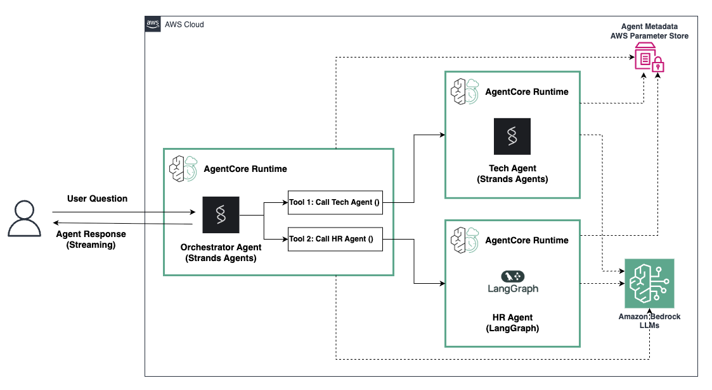

# Distributed Multi-agent solution in Amazon Bedrock AgentCore Runtime

## Overview

In this tutorial we will learn how to independently host agents each in their own Bedrock AgentCore Runtime and built with different Agentic Frameworks. We'll then enable communication between them for a distributed multi-agent solution. 

In this example we'll create:
1. A technical agent (`tech_agent`) that is specialized in answering technical questions about programming and tech troubleshooting.
2. A HR agent (`hr_agent`) that is specialized in company benefits.
3. An orchestrator agent (`orchestrator_agent`) that routes questions to the technical or HR agent.

Putting these three agents together you get a multi-agent configuration with a supervisor, which can route user questions to the appropriate subagent. This system is capable of answering a range of questions an employee might have at a company.


### Tutorial Details


| Information         | Details                                                                          |
|:--------------------|:---------------------------------------------------------------------------------|
| Tutorial type       | Conversational                                                                   |
| Agent type          | Multi-Agent (Supervisor calling agents as tools)                                                                           |
| Agentic Framework   | Strands Agents & LangGraph                                                                  |
| LLM model           | Anthropic Claude Haiku 4.5                                                        |
| Tutorial components | Hosting agents on AgentCore Runtime and enable multi-agent collaboration |
| Tutorial vertical   | Cross-vertical                                                                   |
| Example complexity  | Medium                                                                             |
| SDK used            | Amazon BedrockAgentCore Python SDK and boto3                                     |

### Tutorial Architecture

In this tutorial we will describe how to deploy 3 agents to Bedrock AgentCore runtime. We will use a Strands Agent for the Orchestrator, a Strands Agent for the Tech agent, and a LangGraph agent for the HR agent. We will use simple agents to demonstrate how you can configure a multi-agent system with a mix of agent frameworks, with each agent deployed to it's own AgentCore Runtime.




### Tutorial Key Features

* Hosting multiple Agents on Amazon Bedrock AgentCore Runtime
* Creating a Multi-agent solution where each agent is hosting independently

## Prerequisites

To execute this tutorial you will need:
* Python 3.10+
* AWS credentials
* Amazon Bedrock AgentCore SDK
* Strands Agents
* LangGraph

```python
!uv add -r requirements.txt --active
```

```python
import os

# Set an environment variable
os.environ["AWS_DEFAULT_REGION"] = "us-west-2"
```

## Creating our Agents

First we will create three separate IAM roles for each agent. This enables us to define least privilege permissions for each agent independently of the others.

```python
from utils import create_agentcore_role

tech_agent_name = "tech_agent"
tech_agent_iam_role = create_agentcore_role(agent_name=tech_agent_name, region=os.getenv("AWS_DEFAULT_REGION"))
tech_agent_role_arn = tech_agent_iam_role["Role"]["Arn"]
tech_agent_role_name = tech_agent_iam_role["Role"]["RoleName"]
print(tech_agent_role_arn)
print(tech_agent_role_name)

hr_agent_name = "hr_agent"
hr_agent_iam_role = create_agentcore_role(agent_name=hr_agent_name, region=os.getenv("AWS_DEFAULT_REGION"))
hr_agent_role_arn = hr_agent_iam_role["Role"]["Arn"]
hr_agent_role_name = hr_agent_iam_role["Role"]["RoleName"]
print(hr_agent_role_arn)
print(hr_agent_role_name)

orchestrator_agent_name = "orchestrator_agent"
orchestrator_iam_role = create_agentcore_role(
    agent_name=orchestrator_agent_name, region=os.getenv("AWS_DEFAULT_REGION")
)
orchestrator_role_arn = orchestrator_iam_role["Role"]["Arn"]
orchestrator_role_name = orchestrator_iam_role["Role"]["RoleName"]
print(orchestrator_role_arn)
print(orchestrator_role_name)
```

### Helper Functions:

* the `configure_runtime` helper function will be used to setup the runtime configurate for each agent. In this example, we use the starter toolkit to configure the AgentCore Runtime deployment with an entrypoint, the execution role we just created and a requirements file. We will also configure the starter kit to auto create the Amazon ECR repository on launch.
* the `check_status` helper function will be used to check each runtime deployed in the AWS account to validate the creation was successful and the agent is ready to be used.

```python
from bedrock_agentcore_starter_toolkit import Runtime
from boto3.session import Session
import time


def configure_runtime(agent_name, agentcore_iam_role, python_file_name):
    boto_session = Session(region_name=os.getenv("AWS_DEFAULT_REGION"))
    region = boto_session.region_name

    agentcore_runtime = Runtime()

    response = agentcore_runtime.configure(
        entrypoint=python_file_name,
        execution_role=agentcore_iam_role["Role"]["Arn"],
        auto_create_ecr=True,
        requirements_file="requirements.txt",
        region=region,
        agent_name=agent_name,
    )
    return response, agentcore_runtime


def check_status(agent_runtime):
    status_response = agent_runtime.status()
    status = status_response.endpoint["status"]
    end_status = ["READY", "CREATE_FAILED", "DELETE_FAILED", "UPDATE_FAILED"]
    while status not in end_status:
        time.sleep(10)
        status_response = agent_runtime.status()
        status = status_response.endpoint["status"]
        print(status)
    return status
```

```python
# set the current working directory to be the tech_agent folder
import os

os.chdir("./tech_agent")
print(os.getcwd())
```

### Create Tech Support Agent (Strands Agents)

Let's start with the Tech Support Agent using Strands and an Amazon Bedrock model. Executing the following cell will create the `tech_agent.py` file in the `./tech_agent` directory with the agent specific logic. 

Note the app is defined with `BedrockAgentCoreApp()` and the invocation function `strands_agent_bedrock` is decorated with the `@app.entrypoint` decorator, and the `app.run()` command is at the end of the file.

```python
%%writefile tech_agent.py

from strands import Agent, tool
import argparse
import json
from bedrock_agentcore.runtime import BedrockAgentCoreApp
from strands.models import BedrockModel

app = BedrockAgentCoreApp()

model_id = "global.anthropic.claude-haiku-4-5-20251001-v1:0"
model = BedrockModel(
    model_id=model_id,
)
agent = Agent(
    model=model,
    system_prompt="You're a helpful tech support assistant, you can help user questions on tech troubleshooting and programming"
)

@app.entrypoint
def strands_agent_bedrock(payload):
    """
    Invoke the agent with a payload
    """
    user_input = payload.get("prompt")
    print("User input:", user_input)
    response = agent(user_input)
    return response.message['content'][0]['text']

if __name__ == "__main__":
    app.run()
```

#### Launch the agent:

First, we use the configure_runtime helper function to create the .bedrock_agentcore.yaml, .dockerignore, and Dockerfile required for the agent deployment. Then we call .launch() on the runtime which pushes the image to ECR and creates the AgentCore Runtime in the AWS environment.

```python
_, tech_agent_runtime = configure_runtime("tech_agent", tech_agent_iam_role, "tech_agent.py")
tech_launch_result = tech_agent_runtime.launch()
tech_agent_id = tech_launch_result.agent_id
tech_agent_arn = tech_launch_result.agent_arn

print(tech_agent_arn)
```

#### Let's save the Tech Agent ARN to parameter store 

This creates a simple agent registry so we can persistently store and look up the AgentCore Runtime ARN for the Tech Agent

```python
import boto3

ssm = boto3.client("ssm")
ssm.put_parameter(Name="/agents/tech_agent_arn", Value=tech_agent_arn, Type="String", Overwrite=True)
```

#### Test the agent

To test the agent, let's first check the status of the Tech Agent AgentCore Runtime and confirm it is ready for use.\
Use `.invoke()` on the tech_agent_runtime to validate the agent runtime is configured and working as expected.

```python
status = check_status(tech_agent_runtime)
print(status)
```

```python
invoke_response = tech_agent_runtime.invoke({"prompt": "shortcut to minimize windows in Mac, in 1 sentence"})
invoke_response
```

### Create HR Agent (Langraph Agents)

We will follow a similar process to create the HR Agent. However, this time you will notice the underlying agent logic is build with LangGraph. This change in Agent Framework does not have an impact on how we configure the AgentCore Runtime. Executing the following cell will create the `hr_agent.py`file in the `./hr_agent` directory.

Just as with the Tech Support Agent, we define the app the `BedrockAgentCoreApp()` and the invocation function langgraph_bedrock is decorated with the @app.entrypoint decorator, and the `app.run()` command is at the end of the file.

```python
# set the current working directory to be the hr_agent folder
import os

os.chdir("../hr_agent")
print(os.getcwd())
```

```python
%%writefile hr_agent.py
from langgraph.graph import StateGraph, MessagesState
from langgraph.prebuilt import ToolNode, tools_condition
from langchain_core.tools import tool
from langchain_core.messages import HumanMessage, SystemMessage
from bedrock_agentcore.runtime import BedrockAgentCoreApp
import argparse
import json
import operator
import math

app = BedrockAgentCoreApp()

@tool
def get_vacation_info():
    """Get remaining vacation days balance for the current year"""  # Dummy implementation
    return "you have 12 days off remaining this year"

# Define the agent using manual LangGraph construction
def create_agent():
    """Create and configure the LangGraph agent"""
    from langchain_aws import ChatBedrock
    
    # Initialize your LLM (adjust model and parameters as needed)
    llm = ChatBedrock(
        model_id="global.anthropic.claude-haiku-4-5-20251001-v1:0",  # or your preferred model
        model_kwargs={"temperature": 0.1}
    )
    
    # Bind tools to the LLM
    tools = [get_vacation_info]
    llm_with_tools = llm.bind_tools(tools)
    
    # System message
    system_message = f"""You're a helpful hr support assistant, you can answers user questions on vacations and benefits. 
    Here are the primary company benefits
    - Comprehensive health insurance with 100% premium coverage for employees and 75% for dependents
    - Flexible PTO policy with 20 days paid vacation annually, plus 5 sick days
    - 401(k) plan with 6% company matching and immediate vesting
    - Monthly wellness stipend of $100 for gym memberships or fitness activities

    For additional HR information instruct the user to call to 1-800-ASKHR"""
    
    # Define the chatbot node
    def chatbot(state: MessagesState):
        # Add system message if not already present
        messages = state["messages"]
        if not messages or not isinstance(messages[0], SystemMessage):
            messages = [SystemMessage(content=system_message)] + messages
        
        response = llm_with_tools.invoke(messages)
        return {"messages": [response]}
    
    # Create the graph
    graph_builder = StateGraph(MessagesState)
    
    # Add nodes
    graph_builder.add_node("chatbot", chatbot)
    graph_builder.add_node("tools", ToolNode(tools))
    
    # Add edges
    graph_builder.add_conditional_edges(
        "chatbot",
        tools_condition,
    )
    graph_builder.add_edge("tools", "chatbot")
    
    # Set entry point
    graph_builder.set_entry_point("chatbot")
    
    # Compile the graph
    return graph_builder.compile()

# Initialize the agent
agent = create_agent()

@app.entrypoint
def langgraph_bedrock(payload):
    """
    Invoke the agent with a payload
    """
    user_input = payload.get("prompt")
    
    # Create the input in the format expected by LangGraph
    response = agent.invoke({"messages": [HumanMessage(content=user_input)]})
    
    # Extract the final message content
    return response["messages"][-1].content

if __name__ == "__main__":
    app.run()
```

#### Launch the agent:

Again, we use the configure_runtime helper function to create the .bedrock_agentcore.yaml, .dockerignore, and Dockerfile required for the agent deployment. Then we call .launch() on the hr agent runtime which pushes the image to ECR and creates the AgentCore Runtime in the AWS environment.

```python
_, hr_agentcore_runtime = configure_runtime("hr_agent", hr_agent_iam_role, "hr_agent.py")
hr_launch_result = hr_agentcore_runtime.launch()
hr_agent_id = hr_launch_result.agent_id
hr_agent_arn = hr_launch_result.agent_arn

print(hr_agent_arn)
```

#### Let's save the HR Agent ARN to parameter store

This continues the simple agent registry so we can persistently store and look up the AgentCore Runtime ARN for the HR Agent

```python
import boto3

ssm = boto3.client("ssm")
ssm.put_parameter(Name="/agents/hr_agent_arn", Value=hr_agent_arn, Type="String", Overwrite=True)
```

#### Test the agent

Let's check the status of the HR Agent AgentCore Runtime and confirm it is ready for use.\
Use `.invoke()` on the hr_agentcore_runtime to validate the AgentCore runtime is configured and working as expected.

```python
status = check_status(hr_agentcore_runtime)
status
```

```python
# Test your agent
invoke_response = hr_agentcore_runtime.invoke({"prompt": "How many vacation days I have left?"})
invoke_response
```

### Create Orchestrator Agent (Strands Agents)

For our third agent, the orchestrator, let's use Strands for our Agent framework again. Before we create the agent, we need to update the AgentCore Runtime's execution role we created earlier to allow permissions for it to invoke the Tech Support Agent and the HR Agent.

The `update_orchestrator_permissions` function below takes in Arns of the sub agents and the Arns of the agents registered in Parameter Store and gives the orchestrator agent permission to invoke the DEFAULT runtime endpoint of the sub agents. It also gives the Orchestrator Agent permission to pull the Agent Arns from Parameter Store.

```python
# Let's update the orchestrator agentcore exeuction role so it has permissions to invoke the required subagents
# the orchestrator also needs needs permissions to retrieve the sub agent arns from parameter store
import json

# retrieve the runtime arn from parameter store
ssm = boto3.client("ssm")
response = ssm.get_parameter(Name="/agents/tech_agent_arn")
tech_agent_arn = response["Parameter"]["Value"]
tech_agent_parameter_arn = response["Parameter"]["ARN"]

ssm = boto3.client("ssm")
response = ssm.get_parameter(Name="/agents/hr_agent_arn")
hr_agent_arn = response["Parameter"]["Value"]
hr_agent_parameter_arn = response["Parameter"]["ARN"]


def update_orchestrator_permissions(sub_agent_arns: list, sub_agent_parameter_arns: list, orchestrator_name: str):
    iam_client = boto3.client("iam")
    orchestrator_permissions = {
        "Version": "2012-10-17",
        "Statement": [
            {
                "Effect": "Allow",
                "Action": ["bedrock-agentcore:InvokeAgentRuntime"],
                "Resource": [sub_agent_arn + "/runtime-endpoint/DEFAULT" for sub_agent_arn in sub_agent_arns]
                + [sub_agent_arn for sub_agent_arn in sub_agent_arns],
            },
            {
                "Effect": "Allow",
                "Action": ["ssm:GetParameter"],
                "Resource": [sub_agent_parameter_arn for sub_agent_parameter_arn in sub_agent_parameter_arns],
            },
        ],
    }

    rsp = iam_client.put_role_policy(
        RoleName=orchestrator_name,
        PolicyName="subagent_permissions-new",
        PolicyDocument=json.dumps(orchestrator_permissions),
    )
    return rsp


rsp = update_orchestrator_permissions(
    [tech_agent_arn, hr_agent_arn],
    [tech_agent_parameter_arn, hr_agent_parameter_arn],
    orchestrator_role_name,
)
print(rsp)
```

```python
# set the current working directory to be the orchestrator_agent folder
import os

os.chdir("../orchestrator_agent")
print(os.getcwd())
```

Executing the following cell will create the `orchestrator_agent.py` file in the `./orchestrator_agent` directory with the agent specific logic. The orchestrator agent has two tools available to it: 1. `call_tech_agent` and 2. `call_HR_agent`. Both of these tools use the invoke_agent_utils function predefined in the `invoke_agent_utils.py` file already present in the `./orchestrator_agent` folder. The subagents are invoked as tools using the invoke_agent_runtime action available through boto3.

Even in this more complex agent setup, the Bedrock AgentCore Runtime configuration remains the same. Note the app is defined with `BedrockAgentCoreApp()` and the invocation function `strands_agent_bedrock_streaming` is decorated with the `@app.entrypoint` decorator, and the `app.run()` command is at the end of the file.

```python
%%writefile orchestrator_agent.py

import argparse
import json
import boto3
import logging

from strands import Agent, tool
from strands_tools import calculator 
from strands.models import BedrockModel

from bedrock_agentcore.runtime import BedrockAgentCoreApp

from invoke_agent_utils import invoke_agent_with_boto3

logger = logging.getLogger(__name__)

app = BedrockAgentCoreApp()

def get_agent_arn(agent_name: str) -> str:
    """
    Retrieve agent ARN from Parameter Store
    """
    try:
        ssm = boto3.client('ssm')
        response = ssm.get_parameter(
            Name=f'/agents/{agent_name}_arn'
        )
        return response['Parameter']['Value']
    except Exception as err:
        print(err)
        raise err

@tool
def call_tech_agent(user_query):
    """ call the tech agent """ 
    # print("Calling tech agent")
    try:
        tech_agent_arn = get_agent_arn ("tech_agent")
        result = invoke_agent_with_boto3(tech_agent_arn, user_query=user_query)
    except Exception as e:
        result = str(e)
        logger.exception("Exception calling tech agent: ")
    return result

@tool
def call_HR_agent(user_query):
    """ Get the HR agent """ 
    print("Calling HR agent")
    try:
        hr_agent_arn = get_agent_arn("hr_agent")
        print(hr_agent_arn)
        result = invoke_agent_with_boto3(hr_agent_arn, user_query=user_query)
    except Exception as e:
        result = str(e)
        logger.error(f"Exception calling hr agent: {e}", exc_info=True)
    return result


model_id = "global.anthropic.claude-haiku-4-5-20251001-v1:0"
model = BedrockModel(
    model_id=model_id,
)
agent = Agent(
    model=model,
    system_prompt="You're a helpful assistant, your role is to understand user questions and delegate to the appropriate specialized agent, you have tools to call the tech and HR agents",
    tools=[call_tech_agent, call_HR_agent]
)

def parse_event(event):
    """
    Parse a streaming event from the agent and return formatted output
    """
    # Skip events that don't need to be displayed
    if any(key in event for key in ['init_event_loop', 'start', 'start_event_loop']):
        return ""
    
    # Text chunks from supervisor
    if 'data' in event and isinstance(event['data'], str):
        return event['data'] 
    
    
    # Handle text messages from the assistant
    if 'event' in event:
        event_data = event['event']
        
        # Beginning of a tool use
        if 'contentBlockStart' in event_data and 'start' in event_data['contentBlockStart']:
            if 'toolUse' in event_data['contentBlockStart']['start']:
                tool_info = event_data['contentBlockStart']['start']['toolUse']
                return f"\n\n[Executing: {tool_info['name']}]\n\n"        

    return ""

@app.entrypoint
async def strands_agent_bedrock_streaming(payload):
    """
    Invoke the agent with streaming capabilities
    This function demonstrates how to implement streaming responses
    with AgentCore Runtime using async generators
    """
    user_input = payload.get("prompt")
    #print("User input:", user_input)
    
    try:
        # Stream each chunk as it becomes available
        async for event in agent.stream_async(user_input):
            text = parse_event(event)
            if text:  # Only return non-empty responses
                yield text
                
            #if "data" in event:
            #    yield event["data"]
            
    except Exception as e:
        # Handle errors gracefully in streaming context
        error_response = {"error": str(e), "type": "stream_error"}
        print(f"Streaming error: {error_response}")
        yield error_response


if __name__ == "__main__":
    app.run()
```

#### Launch the agent:

Again, we use the configure_runtime helper function to create the .bedrock_agentcore.yaml, .dockerignore, and Dockerfile required for the agent deployment. Then we call .launch() on the Orchestrator Agent runtime which pushes the image to ECR and creates the AgentCore Runtime in the AWS environment.

```python
_, orchestrator_agentcore_runtime = configure_runtime(
    "orchestrator_agent", orchestrator_iam_role, "orchestrator_agent.py"
)
orchestrator_launch_result = orchestrator_agentcore_runtime.launch()
```

#### Test the agent

Now let's check the status of the Orchestrator Agent AgentCore Runtime and confirm it is ready for use.\

This time, we can use the `invoke_agent_with_boto3` function from our utils to test the Orchestrator Agent. Let's ask the orchestrator a question that should trigger the invocation of both the Tech Support and HR Agents.

```python
status = check_status(orchestrator_agentcore_runtime)
print(status)

from invoke_agent_utils import invoke_agent_with_boto3


result = invoke_agent_with_boto3(
    orchestrator_launch_result.agent_arn,
    "tell me about my benefits, also tell me how to connect a bluetooth mouse to my mac",
)
```

## Cleanup (Optional)

Let's now clean up the AgentCore Runtime created

```python
print(
    orchestrator_launch_result.ecr_uri,
    orchestrator_launch_result.agent_id,
    orchestrator_launch_result.ecr_uri.split("/")[1],
)
print(
    hr_launch_result.ecr_uri,
    hr_launch_result.agent_id,
    hr_launch_result.ecr_uri.split("/")[1],
)
print(
    tech_launch_result.ecr_uri,
    tech_launch_result.agent_id,
    tech_launch_result.ecr_uri.split("/")[1],
)
```

```python
def clean_up_agent_runtimes(launch_result):
    agentcore_control_client = boto3.client("bedrock-agentcore-control", region_name=os.getenv("AWS_DEFAULT_REGION"))
    ecr_client = boto3.client("ecr", region_name=os.getenv("AWS_DEFAULT_REGION"))
    agentcore_control_client.delete_agent_runtime(
        agentRuntimeId=launch_result.agent_id,
    )

    response = ecr_client.delete_repository(repositoryName=launch_result.ecr_uri.split("/")[1], force=True)

    return response


def delete_iam_roles(agentcore_iam_role):
    iam_client = boto3.client("iam")
    policies = iam_client.list_role_policies(RoleName=agentcore_iam_role["Role"]["RoleName"], MaxItems=100)

    for policy_name in policies["PolicyNames"]:
        iam_client.delete_role_policy(RoleName=agentcore_iam_role["Role"]["RoleName"], PolicyName=policy_name)
    iam_response = iam_client.delete_role(RoleName=agentcore_iam_role["Role"]["RoleName"])
    return iam_response
```

```python
print(clean_up_agent_runtimes(hr_launch_result))
print(clean_up_agent_runtimes(tech_launch_result))
print(clean_up_agent_runtimes(orchestrator_launch_result))
print(delete_iam_roles(tech_agent_iam_role))
print(delete_iam_roles(hr_agent_iam_role))
print(delete_iam_roles(orchestrator_iam_role))
```

# Congratulations!
