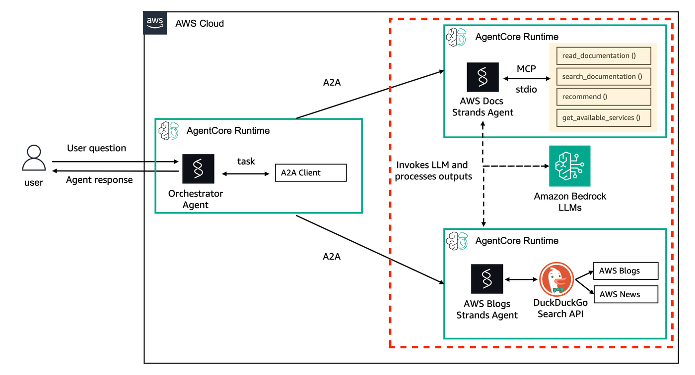

## Getting Started with AgentCore, Strands Agents and A2A

[A2A protocol](https://a2a-protocol.org/dev/specification/) is an open standard designed to facilitate communication and interoperability between independent, potentially opaque AI agent systems. In an ecosystem where agents might be built using different frameworks, languages, or by different vendors, A2A provides a common language and interaction model.

[Amazon AgentCore Runtime](https://docs.aws.amazon.com/bedrock-agentcore/latest/devguide/agents-tools-runtime.html) provides a secure, serverless and purpose-built hosting environment for deploying and running AI agents or tools. 

Recently, AWS announced [A2A support](https://docs.aws.amazon.com/bedrock-agentcore/latest/devguide/runtime-a2a.html) for AgentCore Runtime.

In this workshop, you are going to build following architecture, using AgentCore Runtime:



In this getting started notebook, we are going to build two agents. First agent is an AWS Docs expert. It will query AWS Docs MCP to read and search AWS Documentation and also generate recommendations. Second agent is an AWS Blog expert. It will use websearch to look into AWS latest blogs and news.

So let's get started!

### Setup

Install dependencies

```python
%pip install -q -r requirements.txt --no-cache-dir --force-reinstall
```

**Please restart your environment, so it can reflect new versions!**

```python
# import IPython

# IPython.Application.instance().kernel.do_shutdown(True)
```

Checking if `bedrock-agentcore-starter-toolkit` version is 0.1.21

```python
!pip freeze | grep boto
!pip freeze | grep agentcore
```

```python
# Import libraries
import json
import requests
from boto3.session import Session

# Get boto session
boto_session = Session()
```

### 1 - Create Code for the two agents

Create `agents` folder if it's not created.

```python
![ ! -d "agents" ] && mkdir agents
```

#### 1.1 - AWS Docs expert Agent

Firstly let's write our first agent code to a file locally; this agent will later be deployed to AgentCore runtime.

```python
%%writefile agents/strands_aws_docs.py
import os
import logging
import asyncio
from mcp import stdio_client, StdioServerParameters
from strands import Agent
from strands.multiagent.a2a import A2AServer
from strands.tools.mcp import MCPClient
from fastapi import FastAPI
import uvicorn

logging.basicConfig(level=logging.INFO)
logger = logging.getLogger(__name__)

app = FastAPI()
runtime_url = os.environ.get('AGENTCORE_RUNTIME_URL', 'http://127.0.0.1:9000/')
host, port = "0.0.0.0", 9000

# Global MCP client with lazy initialization
_mcp_client = None

async def get_mcp_client():
    """Lazy initialization of MCP client with timeout"""
    global _mcp_client
    if _mcp_client is None:
        try:
            _mcp_client = MCPClient(
                lambda: stdio_client(
                    StdioServerParameters(
                        command="uvx", 
                        args=["awslabs.aws-documentation-mcp-server@latest"]
                    )
                )
            )
            # Start with timeout
            await asyncio.wait_for(_mcp_client.start(), timeout=10.0)
            logger.info("MCP client initialized")
        except asyncio.TimeoutError:
            logger.error("MCP client startup timed out")
            _mcp_client = None
        except Exception as e:
            logger.error(f"MCP client failed: {e}")
            _mcp_client = None
    return _mcp_client

system_prompt = """You are an AWS Documentation Assistant powered by the AWS Documentation MCP server. Your role is to help users find accurate, up-to-date information from AWS documentation.

CRITICAL: Keep responses SHORT and FOCUSED.

Guidelines:
- Provide concise, actionable answers (max 3 sentences)
- Use bullet points for lists
- Skip verbose explanations
- If MCP is unavailable, provide basic AWS knowledge
- Timeout operations after 8 seconds
- Prioritize speed over completeness

You have access to AWS documentation search tools when available."""

# Initialize agent with minimal tools first
agent = Agent(
    system_prompt=system_prompt, 
    tools=[],  # Start with no tools, add dynamically
    name="AWS Docs Agent",
    description="An agent to query AWS Docs using AWS MCP.",
)

# Add tools dynamically when MCP is ready
async def setup_agent_tools():
    """Setup agent tools when MCP client is ready"""
    try:
        mcp_client = await get_mcp_client()
        if mcp_client:
            tools = await asyncio.wait_for(
                mcp_client.list_tools_async(), 
                timeout=5.0
            )
            agent.tools = [tools] if tools else []
            logger.info("Agent tools configured")
    except Exception as e:
        logger.warning(f"Could not setup MCP tools: {e}")

a2a_server = A2AServer(
    agent=agent,
    http_url=runtime_url,
    serve_at_root=True
)

@app.get("/ping")
def ping():
    return {"status": "healthy"}

@app.on_event("startup")
async def startup_event():
    """Initialize MCP client on startup"""
    await setup_agent_tools()

app.mount("/", a2a_server.to_fastapi_app())

if __name__ == "__main__":
    uvicorn.run(app, host=host, port=port)
```

#### **Optional** - Local Test

If you want to test this code locally, you can open a bash/terminal window and execute following snippets:

```bash
python agents/strands_aws_docs.py
```

Server will start locally. Then, run in another terminal/bash following command to test it:

```bash
curl -X POST http://0.0.0.0:9000 \-H "Content-Type: application/json" \-d '{  "jsonrpc": "2.0",  "id": "req-001",  "method": "message/send",  "params": {  "message": {  "role": "user",  "parts": [  {  "kind": "text",  "text": "What's AWS Lambda?"  }  ],  "messageId": "d0673ab9-796d-4270-9435-451912020cd1"  }  } }' | jq .
```

It will query MCP and then return an answer explaining AWS Lambda.

You can also test agent card information retrieval, using following command:

```bash
curl http://localhost:9000/.well-known/agent-card.json | jq .
```

#### 1.2 - AWS Blogs expert Agent

Now, let's write our second agent code to a local file.

```python
%%writefile agents/strands_aws_blogs_news.py
import logging
import os
import asyncio
from strands import Agent, tool
from strands.multiagent.a2a import A2AServer
import uvicorn
from fastapi import FastAPI

from ddgs import DDGS
from ddgs.exceptions import RatelimitException, DDGSException

logging.basicConfig(level=logging.INFO)
logger = logging.getLogger(__name__)

runtime_url = os.environ.get('AGENTCORE_RUNTIME_URL', 'http://127.0.0.1:9000/')

@tool
async def fast_internet_search(keywords: str, max_results: int = 3) -> str:
    """Fast web search with timeouts.
    Args:
        keywords (str): Search query keywords
        max_results (int): Max results (default 3 for speed)
    Returns:
        Search results
    """
    try:
        # Add AWS-specific terms for better results
        aws_keywords = f"site:aws.amazon.com {keywords} AWS"
        
        # Use asyncio timeout for the search
        async def search_with_timeout():
            return DDGS().text(
                aws_keywords, 
                region="us-en", 
                max_results=max_results
            )
        
        results = await asyncio.wait_for(search_with_timeout(), timeout=8.0)
        
        if results:
            # Format results concisely
            formatted = []
            for i, result in enumerate(results[:max_results], 1):
                formatted.append(f"{i}. {result.get('title', 'No title')}\n   {result.get('href', '')}")
            
            return "\n".join(formatted)
        else:
            return "No AWS results found."
            
    except asyncio.TimeoutError:
        logger.warning(f"Search timeout for: {keywords}")
        return "Search timed out. Try a more specific query."
    except RatelimitException:
        logger.warning("Rate limit hit")
        return "Rate limit reached. Please try again in a moment."
    except (DDGSException, Exception) as e:
        logger.error(f"Search error: {e}")
        return f"Search unavailable: {str(e)[:50]}"

system_prompt = """You are an AWS Blog Expert.

CRITICAL: Keep responses SHORT and RECENT.

Guidelines:
- Provide max 3 recent results
- Focus on official AWS blog posts only
- Use concise summaries (1-2 sentences per result)
- Include direct links when available
- Timeout searches after 8 seconds
- If search fails, acknowledge limitation

Search Strategy:
- Always include "AWS" in searches
- Focus on aws.amazon.com/blogs/ content
- Prioritize recent announcements"""

agent = Agent(
    system_prompt=system_prompt, 
    tools=[fast_internet_search],
    name="AWS Blog/News Agent",
    description="An agent to search on Web latest AWS Blogs and News.",
)

host, port = "0.0.0.0", 9000

a2a_server = A2AServer(
    agent=agent,
    http_url=runtime_url,
    serve_at_root=True
)

app = FastAPI()

@app.get("/ping")
def ping():
    return {"status": "healthy"}

app.mount("/", a2a_server.to_fastapi_app())

if __name__ == "__main__":
    uvicorn.run(app, host=host, port=port)
```

Let's write a requirements.txt file with dependencies that are needed for the agent.

```python
%%writefile agents/requirements.txt
boto3==1.40.50
bedrock-agentcore==0.1.7
strands-agents[a2a]
strands-agents-tools
pyyaml
ddgs
```

### 2 - Deploy to AgentCore Runtime

Now, let's deploy this solution into AgentCore Runtime.

#### 2.1 - Setup Cognito User Pool

Before deploy agents, we have to set up a Cognito User Pool, so it can validate users that are accessing our agents, or any other Idenitty provider like Okta, Microsoft Entra ID, etc.

We're going to import a helper class, that has methods to simplify few steps in our workshop. This helper class will import methods responsible to create Cognito User Pool

```python
from helpers.utils import setup_cognito_user_pool, reauthenticate_user

print("Setting up Amazon Cognito user pool...")
cognito_config = setup_cognito_user_pool()  # You'll get your bearer token from this output cell.
print("Cognito setup completed ✓")
```

#### 2.2 - Create IAM Role for the Agents

##### 2.2.1 AWS Docs Agent Execution Role

```python
from helpers.utils import create_agentcore_runtime_execution_role, AWS_DOCS_ROLE_NAME

execution_role_arn_mcp = create_agentcore_runtime_execution_role(AWS_DOCS_ROLE_NAME)
```

##### 2.2.2 AWS Blogs Agent Execution Role

```python
from helpers.utils import create_agentcore_runtime_execution_role, AWS_BLOG_ROLE_NAME

execution_role_arn_blogs = create_agentcore_runtime_execution_role(AWS_BLOG_ROLE_NAME)
```

##### Create configurations for deployment on AgentCore Runtime

In following section, we're taking advantage of [starter toolkit](https://docs.aws.amazon.com/bedrock-agentcore/latest/devguide/getting-started-starter-toolkit.html). The starter toolkit is a Command Line Interface (CLI) toolkit that you can use to deploy AI agents to an AgentCore Runtime.

We will now create an agent with support for A2A protocol inside AgentCore runtime.

##### 2.2.3 - Let's configure and deploy our first agent (AWS Docs Agent):

```python
from bedrock_agentcore_starter_toolkit import Runtime

agentcore_runtime_mcp_agent = Runtime()
aws_docs_agent_name = "aws_docs_assistant"

region = boto_session.region_name

# Configure the deployment
response_aws_docs_agent = agentcore_runtime_mcp_agent.configure(
    entrypoint="agents/strands_aws_docs.py",
    execution_role=execution_role_arn_mcp,
    auto_create_ecr=True,
    requirements_file="agents/requirements.txt",
    region=region,
    agent_name=aws_docs_agent_name,
    authorizer_configuration={
        "customJWTAuthorizer": {
            "allowedClients": [cognito_config.get("client_id")],
            "discoveryUrl": cognito_config.get("discovery_url"),
        }
    },
    protocol="A2A",
)

print("Configuration completed:", response_aws_docs_agent)
```

Launch the first agent on AgentCore Runtime

```python
launch_result_mcp = agentcore_runtime_mcp_agent.launch()
print("Launch completed:", launch_result_mcp.agent_arn)

docs_agent_arn = launch_result_mcp.agent_arn
```

**Check Deployment Status**

Let's check if deployment is completed:

```python
status_response = agentcore_runtime_mcp_agent.status()
status = status_response.endpoint["status"]

print(f"Final status: {status}")
```

##### 2.2.4 - Let's configure and deploy our second agent (AWS Blogs and News Agent):

```python
from bedrock_agentcore_starter_toolkit import Runtime

agentcore_runtime_blogs = Runtime()
aws_blogs_agent_name = "aws_blog_assistant"

# Configure the deployment
response_aws_blogs_agent = agentcore_runtime_blogs.configure(
    entrypoint="agents/strands_aws_blogs_news.py",
    execution_role=execution_role_arn_blogs,
    auto_create_ecr=True,
    requirements_file="agents/requirements.txt",
    region=region,
    agent_name=aws_blogs_agent_name,
    authorizer_configuration={
        "customJWTAuthorizer": {
            "allowedClients": [cognito_config.get("client_id")],
            "discoveryUrl": cognito_config.get("discovery_url"),
        }
    },
    protocol="A2A",
)

print("Configuration completed:", response_aws_blogs_agent)
```

Launch the second agent on AgentCore Runtime

```python
launch_result_blog = agentcore_runtime_blogs.launch()
print("Launch completed:", launch_result_blog.agent_arn)

blog_agent_arn = launch_result_blog.agent_arn
```

**Check Deployment Status**

Let's check if deployment of second agent is completed:

```python
status_response = agentcore_runtime_blogs.status()
status = status_response.endpoint["status"]

print(f"Final status: {status}")
```

##### 2.2.5 - Export and save outputs

Export variables to be used in next notebooks:

```python
MCP_AGENT_ID = launch_result_mcp.agent_id
MCP_AGENT_ARN = launch_result_mcp.agent_arn
MCP_AGENT_NAME = aws_docs_agent_name

BLOG_AGENT_ID = launch_result_blog.agent_id
BLOG_AGENT_ARN = launch_result_blog.agent_arn
BLOG_AGENT_NAME = aws_blogs_agent_name

COGNITO_CLIENT_ID = cognito_config.get("client_id")
COGNITO_SECRET = cognito_config.get("client_secret")
DISCOVERY_URL = cognito_config.get("discovery_url")

%store MCP_AGENT_ID
%store MCP_AGENT_ARN
%store MCP_AGENT_NAME
%store BLOG_AGENT_ID
%store BLOG_AGENT_ARN
%store BLOG_AGENT_NAME
%store COGNITO_CLIENT_ID
%store COGNITO_SECRET
%store DISCOVERY_URL
```

Store ARN of the agents in SSM, so it can be used by orchestrator:

```python
from helpers.utils import put_ssm_parameter, SSM_DOCS_AGENT_ARN, SSM_BLOGS_AGENT_ARN

put_ssm_parameter(SSM_DOCS_AGENT_ARN, MCP_AGENT_ARN)

put_ssm_parameter(SSM_BLOGS_AGENT_ARN, BLOG_AGENT_ARN)
```

### 3 - Invoking A2A agents

Firstly, let's refresh the auth token:

```python
bearer_token = reauthenticate_user(cognito_config.get("client_id"), cognito_config.get("client_secret"))
```

#### 3.1 Getting Agent Cards

Now let's get started by getting the Agent Card information from our first agent (AWS Docs MCP Expert):

```python
import logging
from uuid import uuid4
from urllib.parse import quote

logging.basicConfig(level=logging.ERROR)
logger = logging.getLogger(__name__)


def fetch_agent_card(agent_arn):
    # URL encode the agent ARN
    escaped_agent_arn = quote(agent_arn, safe="")

    # Construct the URL
    url = f"https://bedrock-agentcore.{region}.amazonaws.com/runtimes/{escaped_agent_arn}/invocations/.well-known/agent-card.json"
    logger.info(url)
    # Generate a unique session ID
    session_id = str(uuid4())
    logger.info(f"Generated session ID: {session_id}")

    # Set headers
    headers = {
        "Accept": "*/*",
        "Authorization": f"Bearer {bearer_token}",
        "X-Amzn-Bedrock-AgentCore-Runtime-Session-Id": session_id,
        "X-Amzn-Trace-Id": f"aws_docs_assistant_{session_id}",
    }

    try:
        # Make the request
        response = requests.get(url, headers=headers)
        response.raise_for_status()

        # Parse and pretty print JSON
        agent_card = response.json()
        logger.info(json.dumps(agent_card, indent=2))

        return agent_card

    except requests.exceptions.RequestException as e:
        logger.error(f"Error fetching agent card: {e}")
        return None
```

```python
fetch_agent_card(docs_agent_arn)
```

Not let's check the agent card for the second agent (AWS Blogs and News expert):

```python
fetch_agent_card(blog_agent_arn)
```

#### 3.2 - Test agents

Now, let's invoke the first agent, using A2A:

```python
import logging

import httpx
from a2a.client import A2ACardResolver, ClientConfig, ClientFactory
from a2a.types import Message, Part, Role, TextPart

logging.basicConfig(level=logging.ERROR)
logger = logging.getLogger(__name__)

DEFAULT_TIMEOUT = 300  # set request timeout to 5 minutes


def format_agent_response(response):
    """Extract and format agent response for human readability."""
    # Get the main response text from artifacts
    if response.artifacts and len(response.artifacts) > 0:
        artifact = response.artifacts[0]
        if artifact.parts and len(artifact.parts) > 0:
            return artifact.parts[0].root.text

    # Fallback: concatenate all agent messages from history
    agent_messages = [msg.parts[0].root.text for msg in response.history if msg.role.value == "agent" and msg.parts]
    return "".join(agent_messages)


def create_message(*, role: Role = Role.user, text: str) -> Message:
    return Message(
        kind="message",
        role=role,
        parts=[Part(TextPart(kind="text", text=text))],
        message_id=uuid4().hex,
    )


async def send_sync_message(agent_arn, message: str):
    # Get runtime URL from environment variable
    escaped_agent_arn = quote(agent_arn, safe="")

    # Construct the URL
    runtime_url = f"https://bedrock-agentcore.{region}.amazonaws.com/runtimes/{escaped_agent_arn}/invocations/"

    # Generate a unique session ID
    session_id = str(uuid4())
    print(f"Generated session ID: {session_id}")

    # Add authentication headers for AgentCore
    headers = {
        "Authorization": f"Bearer {bearer_token}",
        "X-Amzn-Bedrock-AgentCore-Runtime-Session-Id": session_id,
    }

    async with httpx.AsyncClient(timeout=DEFAULT_TIMEOUT, headers=headers) as httpx_client:
        # Get agent card from the runtime URL
        resolver = A2ACardResolver(httpx_client=httpx_client, base_url=runtime_url)
        agent_card = await resolver.get_agent_card()
        print(agent_card)

        # Agent card contains the correct URL (same as runtime_url in this case)
        # No manual override needed - this is the path-based mounting pattern

        # Create client using factory
        config = ClientConfig(
            httpx_client=httpx_client,
            streaming=False,  # Use non-streaming mode for sync response
        )
        factory = ClientFactory(config)
        client = factory.create(agent_card)

        # Create and send message
        msg = create_message(text=message)

        # With streaming=False, this will yield exactly one result
        async for event in client.send_message(msg):
            if isinstance(event, Message):
                logger.info(event.model_dump_json(exclude_none=True, indent=2))
                return event
            elif isinstance(event, tuple) and len(event) == 2:
                # (Task, UpdateEvent) tuple
                task, update_event = event
                logger.info(f"Task: {task.model_dump_json(exclude_none=True, indent=2)}")
                if update_event:
                    logger.info(f"Update: {update_event.model_dump_json(exclude_none=True, indent=2)}")
                return task
            else:
                # Fallback for other response types
                logger.info(f"Response: {str(event)}")
                return event
```

```python
result = await send_sync_message(docs_agent_arn, "what is DynamoDB")
formatted_output = format_agent_response(result)
print(formatted_output)
```

Not, let's test our 2nd agent:

```python
result = await send_sync_message(blog_agent_arn, "Give me the latest published blog for Bedrock AgentCore?")
formatted_output = format_agent_response(result)
print(formatted_output)
```

Following is a more detailed output, showing steps that agent has taken.

Feel free to change the questions asked to agent and see the step-by-step result.

```python
def format_agent_trace(response):
    """Format agent response as a readable trace of calls."""
    print("=" * 60)
    print("🔍 AGENT EXECUTION TRACE")
    print("=" * 60)

    # Context info
    print(f"📋 Context ID: {response.context_id}")
    print(f"🆔 Task ID: {response.id}")
    print(f"📊 Status: {response.status.state.value}")
    print(f"⏰ Completed: {response.status.timestamp}")
    print()

    # Trace through history
    print("🔄 EXECUTION FLOW:")
    print("-" * 40)

    for i, msg in enumerate(response.history, 1):
        role_icon = "👤" if msg.role.value == "user" else "🤖"
        text = msg.parts[0].root.text if msg.parts else "[No content]"

        # Truncate long messages for trace view
        if len(text) > 80:
            text = text[:77] + "..."

        print(f"{i:2d}. {role_icon} {msg.role.value.upper()}: {text}")

    print()
    print("✅ FINAL RESULT:")
    print("-" * 40)

    # Final artifact
    if response.artifacts:
        final_text = response.artifacts[0].parts[0].root.text
        print(final_text[:200] + "..." if len(final_text) > 200 else final_text)

    print("=" * 60)
```

```python
format_agent_trace(result)
```

Congratulations, you have deployed your first agent, using A2A protocol on Amazon AgentCore Runtime!

Now, let's move to next lab.
