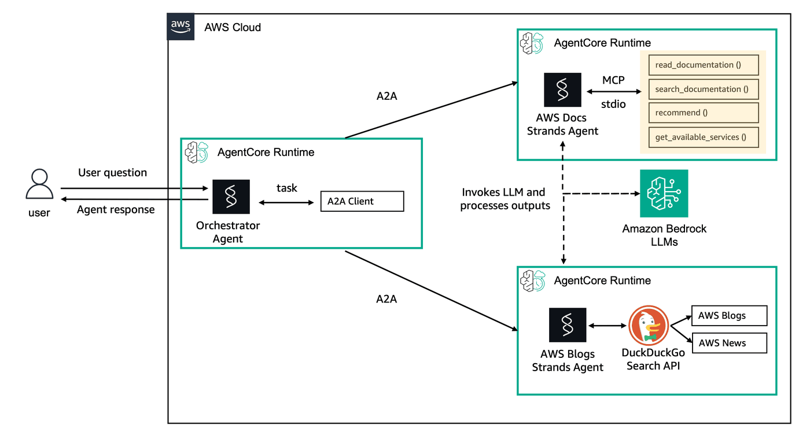

## Setting up Orchestrator Agent A2A

In the previous module, we've launched two agents, using AgentCore Runtime, that supports A2A invocations.

In this lab, we're going to add an orchestrator, that will invoke our sub-agents.



So let's get started!

### Setup

Import required dependencies

```python
# Import libraries
import json
import requests
from boto3.session import Session

# Get boto session
boto_session = Session()
region = boto_session.region_name
```

Retrieve information from previous LABs, so we can use it during this one.

```python
%store -r
```

### 1 - Create Code for the orchestrator agent

Let's generate Python code that will be used for our orchestrator, and lately will be deployed in AgentCore.

```python
%%writefile agents/orchestrator.py
import logging
import json
import asyncio
from typing import Dict, Optional
from urllib.parse import quote
from uuid import uuid4

import httpx
from a2a.client import A2ACardResolver, ClientConfig, ClientFactory
from a2a.types import Message, Part, Role, TextPart

from helpers.utils import get_cognito_secret, reauthenticate_user, get_ssm_parameter, SSM_DOCS_AGENT_ARN, SSM_BLOGS_AGENT_ARN

from strands import Agent, tool
from bedrock_agentcore.runtime import BedrockAgentCoreApp
from fastapi import HTTPException

logging.basicConfig(level=logging.INFO)
logger = logging.getLogger(__name__)

# Reduced timeouts to prevent hanging
DEFAULT_TIMEOUT = 15  # 15s instead of 300s
AGENT_TIMEOUT = 10    # 10s per agent call

# Global cache and connection pool
_cache = {
    'cognito_config': None,
    'agent_arns': {},
    'agent_cards': {},
    'http_client': None
}

app = BedrockAgentCoreApp()

def get_cached_config():
    """Cache all expensive operations"""
    if not _cache['agent_arns']:
        _cache['agent_arns'] = {
            'docs': get_ssm_parameter(SSM_DOCS_AGENT_ARN),
            'blogs': get_ssm_parameter(SSM_BLOGS_AGENT_ARN)
        }
    
    if not _cache['cognito_config']:
        secret = json.loads(get_cognito_secret())
        _cache['cognito_config'] = {
            'client_id': secret.get("client_id"),
            'client_secret': secret.get("client_secret")
        }
    
    return _cache['agent_arns'], _cache['cognito_config']

def get_bearer_token():
    """Generate fresh bearer token for each request"""
    _, config = get_cached_config()
    return reauthenticate_user(
        config['client_id'], 
        config['client_secret']
    )

def get_http_client():
    """Reuse HTTP client with aggressive timeouts"""
    if not _cache['http_client']:
        _cache['http_client'] = httpx.AsyncClient(
            timeout=httpx.Timeout(DEFAULT_TIMEOUT, connect=5.0),
            limits=httpx.Limits(max_keepalive_connections=5, max_connections=10),
            http2=True  # Enable HTTP/2 for better performance
        )
    return _cache['http_client']

def create_message(text: str) -> Message:
    return Message(
        kind="message",
        role=Role.user,
        parts=[Part(TextPart(kind="text", text=text))],
        message_id=uuid4().hex,
    )

async def send_agent_message(message: str, agent_type: str) -> Optional[str]:
    """Optimized agent communication with circuit breaker pattern"""
    try:
        agent_arns, _ = get_cached_config()
        agent_arn = agent_arns[agent_type]
        bearer_token = get_bearer_token()
        
        from boto3.session import Session
        region = Session().region_name
        
        escaped_arn = quote(agent_arn, safe='')
        runtime_url = f"https://bedrock-agentcore.{region}.amazonaws.com/runtimes/{escaped_arn}/invocations/"
        
        headers = {
            "Authorization": f"Bearer {bearer_token}",
            'X-Amzn-Bedrock-AgentCore-Runtime-Session-Id': str(uuid4())
        }
        
        httpx_client = get_http_client()
        httpx_client.headers.update(headers)
        
        # Cache agent card
        if agent_arn not in _cache['agent_cards']:
            resolver = A2ACardResolver(httpx_client=httpx_client, base_url=runtime_url)
            _cache['agent_cards'][agent_arn] = await asyncio.wait_for(
                resolver.get_agent_card(), timeout=5.0
            )
        
        agent_card = _cache['agent_cards'][agent_arn]
        
        # Create client with non-streaming mode
        config = ClientConfig(httpx_client=httpx_client, streaming=False)
        factory = ClientFactory(config)
        client = factory.create(agent_card)
        
        msg = create_message(message)
        
        # Use timeout for the entire operation
        async with asyncio.timeout(AGENT_TIMEOUT):
            async for event in client.send_message(msg):
                if isinstance(event, Message):
                    return event.parts[0].text if event.parts else "No response"
                elif isinstance(event, tuple) and len(event) == 2:
                    return event[0].parts[0].text if event[0].parts else "No response"
        
        return "Timeout: No response received"
        
    except asyncio.TimeoutError:
        logger.warning(f"Timeout calling {agent_type} agent")
        return f"Agent {agent_type} timed out"
    except Exception as e:
        logger.error(f"Error calling {agent_type}: {e}")
        return f"Error: {str(e)[:100]}"

@tool
async def send_mcp_message(message: str):
    """Send message to AWS Docs agent with timeout"""
    return await send_agent_message(f"Summarize briefly: {message}", 'docs')

@tool
async def send_blog_message(message: str):
    """Send message to AWS Blogs agent with timeout"""
    return await send_agent_message(f"Summarize briefly: {message}", 'blogs')


system_prompt = """You are an AWS information orchestrator. 

Available agents:
- AWS Documentation: Technical AWS service details
- AWS Blogs: Latest AWS news and announcements

IMPORTANT: Keep responses SHORT and FAST. Always request summaries from sub-agents.

Guidelines:
- Use parallel queries when possible
- Timeout after 10 seconds per agent
- Provide quick, actionable answers
- If agents timeout, provide what you know
"""

agent = Agent(
    system_prompt=system_prompt, 
    tools=[send_mcp_message, send_blog_message],
    name="AWS Orchestration Agent",
    description="An agent to orchestrate sub-agents"
)

@app.entrypoint
async def invoke_agent(payload, context):
    logger.info("Fast orchestrator processing request")
    
    try:
        user_prompt = payload.get("prompt", "")
        if not user_prompt:
            raise HTTPException(status_code=400, detail="No prompt provided")

        logger.info(f"Query: {user_prompt[:100]}...")
        
        # Set overall timeout for the entire operation
        async with asyncio.timeout(25.0):  # Max 25s total
            agent_stream = agent.stream_async(user_prompt)
            
            async for event in agent_stream:
                yield event

    except asyncio.TimeoutError:
        logger.error("Overall operation timed out")
        yield {"error": "Request timed out after 25 seconds"}
    except HTTPException:
        raise
    except Exception as e:
        logger.error(f"Processing failed: {e}")
        yield {"error": f"Processing failed: {str(e)[:100]}"}

# Cleanup on shutdown
async def cleanup():
    if _cache['http_client']:
        await _cache['http_client'].aclose()

if __name__ == "__main__":
    import atexit
    atexit.register(lambda: asyncio.run(cleanup()))
    app.run()
```

#### 1.1 - Create IAM Role for the Agent

```python
from helpers.utils import (
    create_agentcore_runtime_execution_role,
    ORCHESTRATOR_ROLE_NAME,
)

agent_name = "aws_orchestrator_assistant"

execution_role_arn = create_agentcore_runtime_execution_role(ORCHESTRATOR_ROLE_NAME)
```

### 2 - Deploy to AgentCore Runtime

Now, let's deploy the orchestrator in the AgentCore Runtime.

Note that in this example, we're not adding `protocol` parameter. Which means that this will be a HTTP agent.

```python
from bedrock_agentcore_starter_toolkit import Runtime

agentcore_runtime = Runtime()

# Configure the deployment
response = agentcore_runtime.configure(
    entrypoint="agents/orchestrator.py",
    execution_role=execution_role_arn,
    auto_create_ecr=True,
    requirements_file="agents/requirements.txt",
    region=region,
    agent_name=agent_name,
    authorizer_configuration={
        "customJWTAuthorizer": {
            "allowedClients": [COGNITO_CLIENT_ID],
            "discoveryUrl": DISCOVERY_URL,
        }
    },
)

print("Configuration completed:", response)
```

```python
launch_result = agentcore_runtime.launch()
print("Launch completed:", launch_result.agent_arn)

agent_arn = launch_result.agent_arn
```

**Check Deployment Status**

Let's check if deployment is completed:

```python
status_response = agentcore_runtime.status()
status = status_response.endpoint["status"]

print(f"Final status: {status}")
```

#### 2.1 - Export and save outputs

Export variables to be used in clean up notebook:

```python
ORCHESTRATION_ID = launch_result.agent_id
ORCHESTRATION_ARN = launch_result.agent_arn
ORCHESTRATION_NAME = agent_name

%store ORCHESTRATION_ID
%store ORCHESTRATION_ARN
%store ORCHESTRATION_NAME
```

### 3 - Invoking A2A agents using an orchestrator agent

Firstly, let's refresh the auth token:

```python
from helpers.utils import reauthenticate_user

bearer_token = reauthenticate_user(COGNITO_CLIENT_ID, COGNITO_SECRET)
```

Now, let's invoke our orchestrator to check AWS Docs, making a call to our first agent, using A2A:

```python
import uuid
from urllib.parse import quote

session_id = str(uuid.uuid4())
print(f"Invoking for session: {session_id}")

headers = {
    "Authorization": f"Bearer {bearer_token}",
    "Content-Type": "application/json",
    "Accept": "application/json",
    "X-Amzn-Bedrock-AgentCore-Runtime-Session-Id": session_id,
}

prompt = {"prompt": "What is DynamoDB?"}

escaped_agent_arn = quote(ORCHESTRATION_ARN, safe="")

response = requests.post(
    f"https://bedrock-agentcore.{region}.amazonaws.com/runtimes/{escaped_agent_arn}/invocations",
    headers=headers,
    data=json.dumps(prompt),
)

for line in response.iter_lines(decode_unicode=True):
    if line.startswith("data: "):
        data = line[6:]
        try:
            parsed = json.loads(data)
            print(parsed)
        except:
            print(data)
```

```python
import uuid

session_id = str(uuid.uuid4())
print(f"Invoking for session: {session_id}")

headers = {
    "Authorization": f"Bearer {bearer_token}",
    "Content-Type": "application/json",
    "Accept": "application/json",
    "X-Amzn-Bedrock-AgentCore-Runtime-Session-Id": session_id,
}

prompt = {"prompt": "Give me the latest published blog for Bedrock AgentCore?"}

escaped_agent_arn = quote(ORCHESTRATION_ARN, safe="")

response = requests.post(
    f"https://bedrock-agentcore.{region}.amazonaws.com/runtimes/{escaped_agent_arn}/invocations",
    headers=headers,
    data=json.dumps(prompt),
)

for line in response.iter_lines(decode_unicode=True):
    if line.startswith("data: "):
        data = line[6:]
        try:
            parsed = json.loads(data)
            print(parsed)
        except:
            print(data)
```

Congratulations, you have deployed the complete solution, using A2A protocol on Amazon AgentCore Runtime.
