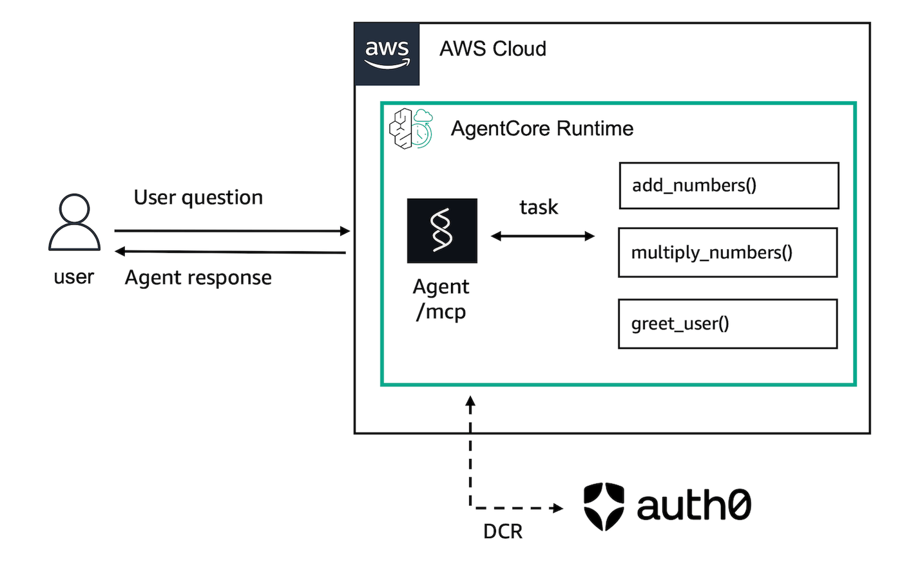
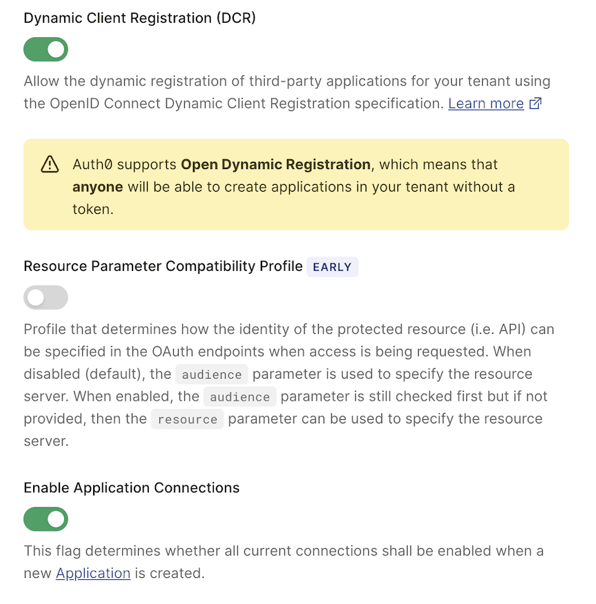
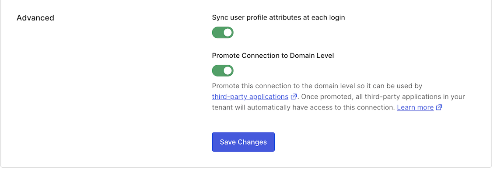
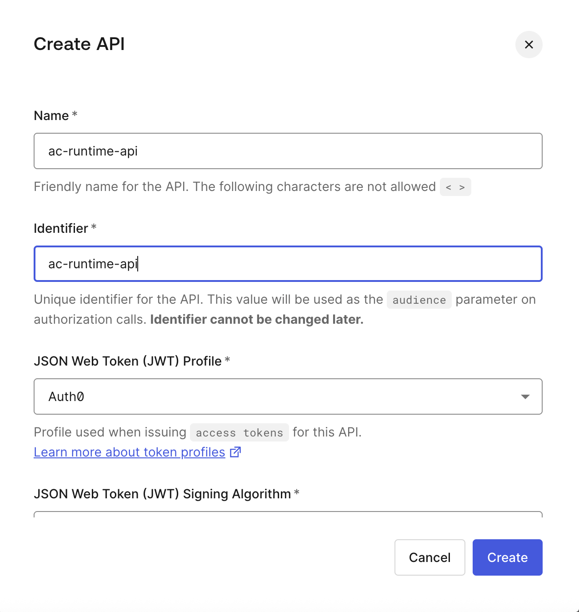
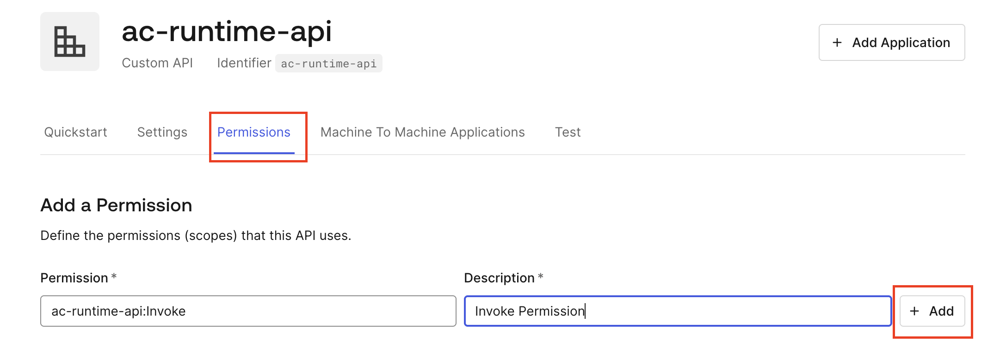
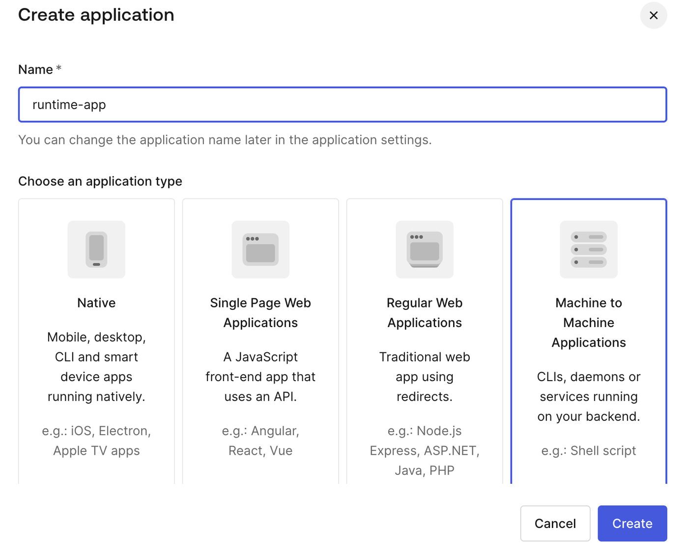
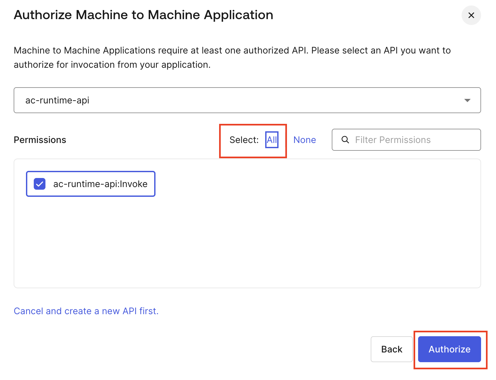
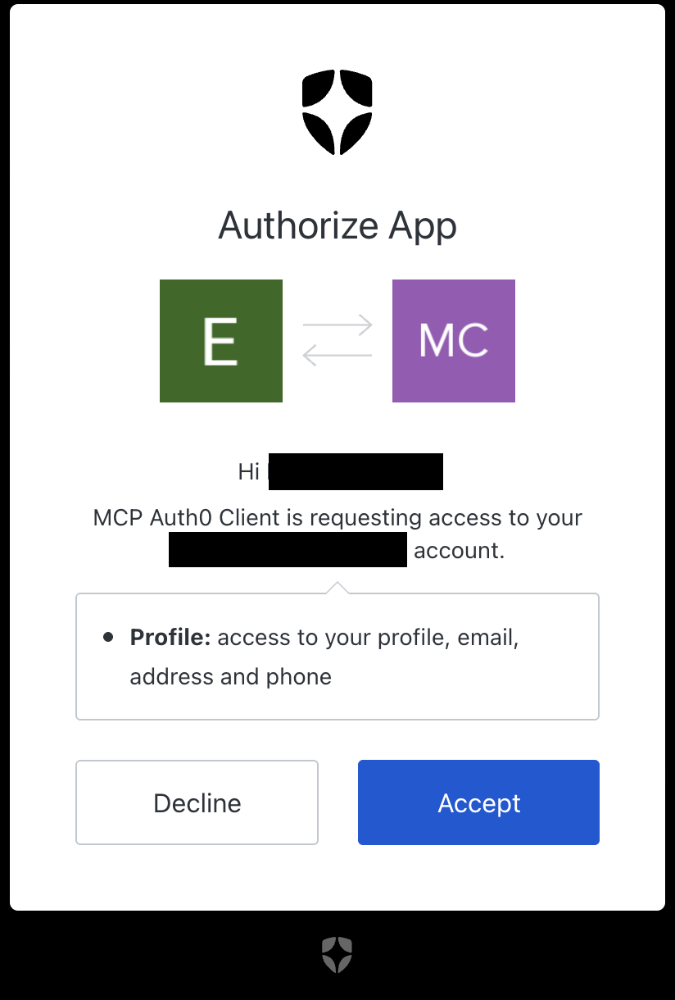
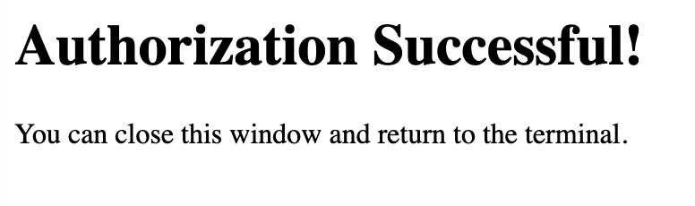

## Dynamic Client Registration on AgentCore Runtime

This example demonstrates how to deploy an MCP on AgentCore Runtime that supports Dynamic Client Registration.

For this tutorial, we will create an integrated example with Auth0 that supports this AgentCore feature.

This can be useful for registering users dynamically, using, for example, their social media login to allow users to connect to your MCP.

In this tutorial, you will learn:

* How to create an MCP server with tools
* How to test your server locally
* How to configure your Auth0 tenant to support DCR and add an API and an app
* How to deploy your server to AWS, integrated with DCR on Auth0
* How to invoke your deployed server

### Tutorial Details

| Information         | Details                                                   |
|:--------------------|:----------------------------------------------------------|
| Tutorial type       | Hosting Tools + DCR on Auth0                             |
| Tool type           | MCP server                                                |
| Tutorial components | Hosting tool on AgentCore Runtime, Creating an MCP server |
| Tutorial vertical   | Cross-vertical                                            |
| Example complexity  | Medium                                                    |
| SDK used            | Amazon BedrockAgentCore Python SDK and MCP Client        |

### Tutorial Architecture

In this tutorial, we will describe how to deploy this example to AgentCore Runtime.

For demonstration purposes, we will use a very simple MCP server with 3 tools: `add_numbers`, `multiply_numbers`, and `greet_users`.



### Tutorial Key Features

* Hosting MCP Server
* Dynamic Client Registration (DCR)
* Auth0

```python
!pip install -Uq -r requirements.txt
```

**Restart your kernel to reflect installed dependencies.**

## Configuring Auth0

### General Settings

In this example, we will work with Auth0 to implement DCR (Dynamic Client Registration). Before starting, let's enable the DCR option in the Auth0 console.

- In the left panel menu, click on `Settings`. Then under **Tenant Settings**, click on the `Advanced` option. Scroll down until you find the *Dynamic Client Registration (DCR)* option and click on it to *enable* it. Also click on *Enable Application Connections*, so connections will be enabled when a new application is created:



For more information, refer to the Auth0 [dynamic client registration](https://auth0.com/docs/get-started/applications/dynamic-client-registration) documentation.

Now that we have it enabled, let's use *Google / Gmail* Identity as the login mechanism for users (apps) on our MCP.

- In the left panel menu, click on `Authentication` and then click on `Social`. In the **Social Connections** screen, click on the `google-oauth2` option. In the settings screen, scroll down until you find the `Promote Connection to Domain Level` option and enable it:



Now you have configured all settings for your Auth0 tenant. Let's move on and start by creating an Auth0 API.

---

### Creating an API

Let's create an API. In the left panel menu, under the Applications section, click on `APIs`. In the APIs screen, click the top right button `+ Create API`.



- Name: The name of your API.
- Identifier: Unique identifier for the API. This value will be used as the `audience` parameter in authorization calls.
- You can keep the other options as defaults and click Create.

In your API settings, click on the `Permissions` tab and then add invoke permission following this pattern `<identifier_name>:Invoke`:



Done. Now your API is configured. Let's create an app.

---

### Creating an Application

Let's finish our configuration by creating an application. In the `Applications` left panel menu, click on `Applications` and then `+ Create Application`.

On the create app screen, give the app a name, choose the `Machine-to-Machine` option, and click create:



Then on the next screen, you will be prompted to select an API. Select the API that you created in the previous step, click the `all` button to authorize all actions, and click the `Authorize` button:



Now your app is created.

---

### Getting App Information

Now we need to get the app information so we can use it in our example.

Click on your app and go to the `quickstart` page. This page will show a Linux `curl` example with all required parameters. Copy the domain from your `--url` value, like the following example:

Your `--url` parameter:

```bash
--url https://<your-auth0-tenant>.us.auth0.com/oauth/token
```

Build the following environment variable that will be used in this notebook:

```bash
export DISCOVERY_URL="https://<your-auth0-tenant>.us.auth0.com/.well-known/openid-configuration"
```

**Replace here with your domain**

```python
DISCOVERY_URL = "https://<your-auth0-tenant>.us.auth0.com/.well-known/openid-configuration"
```

We also need to fill in our audience. It will be our API identifier. If you follow this example and use `ac-runtime-api`, that will be the audience value:

```python
# Replace if you created with a different identifier
AUDIENCE = "ac-runtime-api"
```

### Creating MCP Server

Now let's create our MCP server with three simple tools:

```python
%%writefile server.py
from mcp.server.fastmcp import FastMCP
from starlette.responses import JSONResponse

mcp = FastMCP(host="0.0.0.0", stateless_http=True)

@mcp.tool()
def add_numbers(a: int, b: int) -> int:
    """Add two numbers together"""
    return a + b

@mcp.tool()
def multiply_numbers(a: int, b: int) -> int:
    """Multiply two numbers together"""
    return a * b

@mcp.tool()
def greet_user(name: str) -> str:
    """Greet a user by name"""
    return f"Hello, {name}! Nice to meet you."

if __name__ == "__main__":
    mcp.run(transport="streamable-http")
```

### Local Test of MCP Server (optional)

If you want to, you can test your brand new MCP server locally.

Run the following cell to generate the test Python script.

```python
%%writefile test_my_mcp_client.py
import asyncio
from datetime import timedelta

from mcp import ClientSession
from mcp.client.streamable_http import streamablehttp_client

async def main():
    mcp_url = "http://localhost:8000/mcp"
    headers = {}

    async with streamablehttp_client(mcp_url, headers, timeout=timedelta(seconds=120), terminate_on_close=False) as (
        read_stream,
        write_stream,
        _,
    ):
        async with ClientSession(read_stream, write_stream) as session:
            await session.initialize()
            tool_result = await session.list_tools()
            print("Available tools:")
            for tool in tool_result.tools:
                print(f"  - {tool.name}: {tool.description}")

if __name__ == "__main__":
    asyncio.run(main())
```

To test your MCP server locally:

1. **Terminal 1**: Start the MCP server

```bash
python server.py
```

2. **Terminal 2**: Run the test script

```bash
python test_my_mcp_client.py
```

### Launching MCP Server to AgentCore Runtime

Now let's create an AgentCore Runtime app using the provided URL and audience.

```python
from bedrock_agentcore_starter_toolkit import Runtime
from boto3.session import Session

boto_session = Session()
region = boto_session.region_name

agentcore_runtime = Runtime()
agent_name = "mcp_dcr_sample"

auth_config = {
    "customJWTAuthorizer": {
        "allowedAudience": [AUDIENCE],
        "discoveryUrl": DISCOVERY_URL,
    }
}

response = agentcore_runtime.configure(
    entrypoint="server.py",
    auto_create_execution_role=True,
    requirements_file="requirements.txt",
    region=region,
    agent_name=agent_name,
    authorizer_configuration=auth_config,
    protocol="MCP",
    memory_mode="NO_MEMORY",
    deployment_type="direct_code_deploy",
    runtime_type="PYTHON_3_13",
)
```

```python
print("Launching MCP server to AgentCore Runtime...")
print("This may take several minutes...")
launch_result = agentcore_runtime.launch()
print("Launch completed ✓")
print(f"Agent ARN: {launch_result.agent_arn}")
print(f"Agent ID: {launch_result.agent_id}")
```

### Testing

The file `mcp_auth0_client.py` contains a local implementation to connect to our deployed agent on AgentCore Runtime.

When you run your script, it will redirect you to a login page that will ask for your Google identity to log in.

After you log in, it will ask you to authorize Auth0 to create an app using your email.



If you accept it, it will redirect to a plain HTML page (implemented in `mcp_auth0_client.py`) showing that it was successful.



Setting env variables that script is waiting for

```python
agent_arn = launch_result.agent_arn
region = "us-west-2"
custom_endpoint = f"https://bedrock-agentcore.{region}.amazonaws.com"

agent_arn, custom_endpoint, AUDIENCE
```

```python
import mcp_auth0_client as mcp_client

await mcp_client.main(agent_arn, custom_endpoint, AUDIENCE)
```

## Clean UP

```python
agentcore_runtime.destroy()
```

### 🎉 Congratulations!

You have successfully:

- **Created a tenant** in Auth0
- **Enabled DCR** on Auth0 and created an API and an app
- Created an **MCP server** with custom tools
- **Tested locally** using an MCP client
- Set up **authentication with DCR**
- Deployed to AWS using **AgentCore Runtime**
- **Invoked remotely** with proper authentication
- **Learned** MCP concepts and best practices

Your MCP server is now running on Amazon Bedrock AgentCore Runtime and ready for production use!
