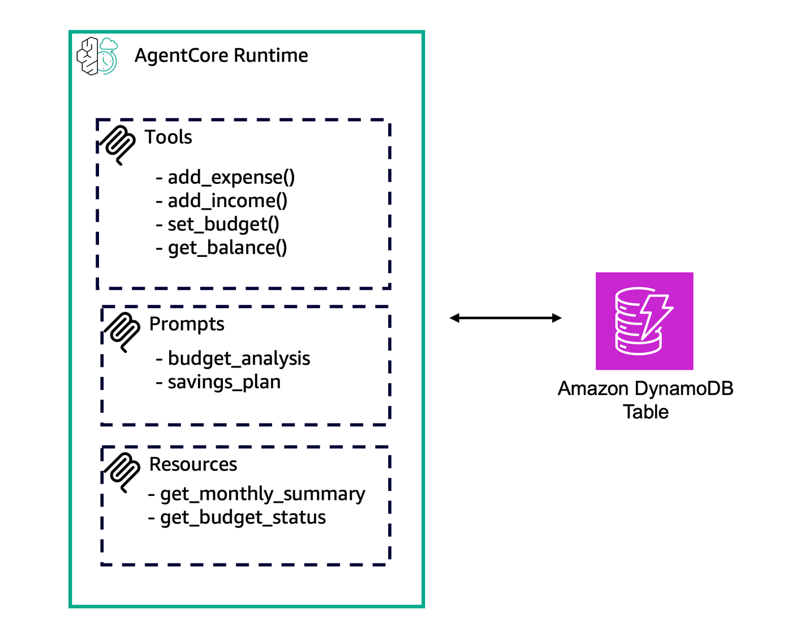

## End-to-end Stateless MCP Server on AgentCore Runtime

This example demonstrates full MCP server capabilities (from MCP Spec) deployed on AgentCore Runtime.

This can be useful to create MCP servers on AgentCore Runtime that can take advantage of MCP native resources, prompts and tools, for example.

In this tutorial, you will learn:

* How to create an MCP server with tools, prompts and resources
* How to deploy into AgentCore Runtime
* How to invoke your deployed server

### Tutorial Details

| Information         | Details                                                   |
|:--------------------|:----------------------------------------------------------|
| Tutorial type       | Hosting Tools, Prompts and Resources on Runtime           |
| Tool type           | MCP server                                                |
| Tutorial components | Hosting on AgentCore Runtime, Creating an MCP server      |
| Tutorial vertical   | Cross-vertical                                            |
| Example complexity  | Medium                                                    |
| SDK used            | Amazon BedrockAgentCore Python SDK and MCP Client         |

### Tutorial Architecture

In this tutorial, we will describe how to deploy this example to AgentCore Runtime.



In this tutorial notebook, you are going to build one agent. First you will deploy the agent on AgentCore Runtime with four tools. Then you will update it to add prompts. Finally you will update it again to deploy resources.

So let's get started!

To get started, install required dependencies and then restart your kernel.

```python
!pip install -qU -r requirements.txt
```

Add following path so scripts can access helpers folder

```python
import sys
from pathlib import Path

sys.path.insert(0, str(Path.cwd().parent))
```

### Creating MCP Server

To get started, you are going to create the MCP Server with tools (only) and later we will add other features on it.

This MCP consists of 4 MCP tools:

- **add_expense**: add user expenses
- **add_income**: add user incomes
- **set_budget**: set a value to limit spending
- **get_balance**: get monthly balance

Data will be persisted in a DynamoDB table, so we can have data persisted and used in next steps during this tutorial. This way, the MCP server continues being stateless and user information is stored in the DynamoDB table.

Execute the following code to generate local file for MCP server and requirements file

```python
%%writefile agents/mcp_e2e_stateless_server.py
import os
from mcp.server.fastmcp import FastMCP
from dynamo_utils import FinanceDB

mcp = FastMCP(name="Stateless-MCP-Server",
              host="0.0.0.0", 
              stateless_http=True) # Stateless mode - no session persistence

_region = os.environ.get('AWS_REGION') or os.environ.get('AWS_DEFAULT_REGION') or 'us-east-1'
db = FinanceDB(region_name=_region)

@mcp.tool()
def add_expense(user_alias: str, amount: float, description: str, category: str = "other") -> str:
    """Add a new expense transaction
    
    Args:
        user_alias: User identifier
        amount: Expense amount (positive number)
        description: Description of the expense
        category: Expense category (food, transport, entertainment, bills, other)
    """
    return db.add_transaction(user_alias, "expense", -abs(amount), description, category)

@mcp.tool()
def add_income(user_alias: str, amount: float, description: str, source: str = "salary") -> str:
    """Add a new income transaction
    
    Args:
        user_alias: User identifier
        amount: Income amount (positive number)
        description: Description of the income
        source: Income source (salary, freelance, investment, other)
    """
    return db.add_transaction(user_alias, "income", abs(amount), description, source)

@mcp.tool()
def set_budget(user_alias: str, category: str, monthly_limit: float) -> str:
    """Set monthly budget limit for a category
    
    Args:
        user_alias: User identifier
        category: Budget category (food, transport, entertainment, bills, other)
        monthly_limit: Monthly spending limit for this category
    """
    return db.set_budget(user_alias, category, monthly_limit)

@mcp.tool()
def get_balance(user_alias: str) -> str:
    """Get current account balance
    
    Args:
        user_alias: User identifier
    """
    balance_data = db.get_balance(user_alias)
    return f"Balance: ${balance_data['balance']:.2f}\nTotal Income: ${balance_data['income']:.2f}\nTotal Expenses: ${balance_data['expenses']:.2f}"

if __name__ == "__main__":
    mcp.run(transport="streamable-http")
```

```python
%%writefile agents/requirements.txt
#fastmcp>=2.10.0
#mcp==1.19.0
mcp
bedrock-agentcore
```

Copy `dynamo_utils` file to agents folder

```python
!cp ../helpers/dynamo_utils.py agents/dynamo_utils.py
```

Now let's create our DynamoDB table that will be used for our MCP

```python
import boto3

from helpers.dynamo_utils import FinanceDB

region = boto3.session.Session().region_name
db = FinanceDB(region_name=region)
result = db.create_table()
print(f"Region: {region}")
print(result)
```

#### Create Cognito User Pool for Authentication

Let's create a Cognito user pool to ensure authentication in our MCP Server

```python
from helpers.utils import get_or_create_cognito_pool, reauthenticate_user

print("Setting up Amazon Cognito user pool...")
cognito_config = get_or_create_cognito_pool()  # You'll get your bearer token from this output cell.
print("Cognito setup completed ✓")
```

Now, let's create the AgentCore execution role:

```python
from helpers.utils import create_agentcore_runtime_execution_role, SAMPLE_ROLE_NAME

execution_role_arn_mcp = create_agentcore_runtime_execution_role(SAMPLE_ROLE_NAME)
```

#### Configure and Launch MCP Server on AgentCore Runtime

Now let's deploy this example into AgentCore Runtime:

```python
# Import libraries
import json
import boto3
from boto3.session import Session

# Get boto session
boto_session = Session()

sts = boto3.client("sts")
response = sts.get_caller_identity()
account_id = response["Account"]
region = boto_session.region_name
```

```python
from bedrock_agentcore_starter_toolkit import Runtime

agentcore_runtime_mcp_agent = Runtime()
aws_agent_name = "mcp_e2e_stateless_server"

# Configure the deployment
response_aws_mcp_agent = agentcore_runtime_mcp_agent.configure(
    entrypoint="agents/mcp_e2e_stateless_server.py",
    execution_role=execution_role_arn_mcp,
    auto_create_ecr=True,
    requirements_file="agents/requirements.txt",
    region=region,
    agent_name=aws_agent_name,
    authorizer_configuration={
        "customJWTAuthorizer": {
            "allowedClients": [cognito_config.get("client_id")],
            "discoveryUrl": cognito_config.get("discovery_url"),
        }
    },
    protocol="MCP",
    deployment_type="direct_code_deploy",
    runtime_type="PYTHON_3_13",
)

print("Configuration completed:", response_aws_mcp_agent)
```

```python
launch_result_mcp = agentcore_runtime_mcp_agent.launch()
print("Launch completed:", launch_result_mcp.agent_arn)

mcp_arn = launch_result_mcp.agent_arn
```

```python
status_response = agentcore_runtime_mcp_agent.status()
status = status_response.endpoint["status"]

print(f"Final status: {status}")
```

#### Test our MCP Server

Now let's test our 1st version of deployed MCP, containing the tools.

Firstly, let's get a new JWT token:

```python
ac_runtime_name = launch_result_mcp.agent_id

mcp_url = f"https://bedrock-agentcore.{region}.amazonaws.com/runtimes/{ac_runtime_name}/invocations?qualifier=DEFAULT&accountId={account_id}"
```

```python
bearer_token = reauthenticate_user(cognito_config.get("client_id"), cognito_config.get("client_secret"))

headers = {
    "authorization": f"Bearer {bearer_token}",
    "Content-Type": "application/json",
}
```

Now, let's invoke MCP:

```python
from mcp import ClientSession
from mcp.client.streamable_http import streamablehttp_client

print(f"Invoking: {mcp_url} \n")
async with streamablehttp_client(mcp_url, headers, timeout=120, terminate_on_close=False) as (
    read_stream,
    write_stream,
    _,
):
    async with ClientSession(read_stream, write_stream) as session:
        await session.initialize()
        tool_result = await session.list_tools()
        print("\n📋 Available MCP Tools:")
        print("=" * 50)
        for tool in tool_result.tools:
            print(f"🔧 {tool.name}: {tool.description}")

        print("\n✅ MCP tool testing completed!")
```

Now, let's make a few operations to add data into the DynamoDB Table.

```python
async def invoke_tool(tool_name: str, tool_params: dict):
    async with streamablehttp_client(mcp_url, headers, timeout=120, terminate_on_close=False) as (
        read_stream,
        write_stream,
        _,
    ):
        async with ClientSession(read_stream, write_stream) as session:
            await session.initialize()
            try:
                print(f"\n➕ Testing tool: {tool_name}()...")
                tool_result = await session.call_tool(name=tool_name, arguments=tool_params)
                print(f"   Result: {tool_result.content[0].text}")
            except Exception as e:
                print(f"   Error: {e}")
```

```python
tool_name = "add_expense"
tool_arguments = {
    "user_alias": "me",
    "amount": 30.5,
    "description": "Today's dinner",
    "category": "food",
}

await invoke_tool(tool_name, tool_arguments)

tool_arguments = {
    "user_alias": "me",
    "amount": 15,
    "description": "Today's breakfast",
    "category": "food",
}

await invoke_tool(tool_name, tool_arguments)

tool_arguments = {
    "user_alias": "me",
    "amount": 120,
    "description": "Energy",
    "category": "bills",
}

await invoke_tool(tool_name, tool_arguments)
```

```python
tool_name = "add_income"
tool_arguments = {
    "user_alias": "me",
    "amount": 1000,
    "description": "paycheck",
    "source": "salary",
}

await invoke_tool(tool_name, tool_arguments)
```

```python
tool_name = "set_budget"
tool_arguments = {"user_alias": "me", "category": "bills", "monthly_limit": 100}

await invoke_tool(tool_name, tool_arguments)
```

```python
tool_name = "get_balance"
tool_arguments = {"user_alias": "me"}

await invoke_tool(tool_name, tool_arguments)
```

Now we have data into our table, let's continue with the example and add Prompts into our MCP

---

#### Changing our Runtime to add Prompt on it

Let's make a few changes into our MCP code, to add more features on it:

```python
%%writefile agents/mcp_e2e_stateless_server.py
import os
from mcp.server.fastmcp import FastMCP
from mcp.types import PromptMessage, TextContent
from dynamo_utils import FinanceDB

mcp = FastMCP(name="Stateless-MCP-Server",
              host="0.0.0.0", 
              stateless_http=True) # Stateless mode - no session persistence

_region = os.environ.get('AWS_REGION') or os.environ.get('AWS_DEFAULT_REGION') or 'us-east-1'
db = FinanceDB(region_name=_region)

@mcp.tool()
def add_expense(user_alias: str, amount: float, description: str, category: str = "other") -> str:
    """Add a new expense transaction
    
    Args:
        user_alias: User identifier
        amount: Expense amount (positive number)
        description: Description of the expense
        category: Expense category (food, transport, entertainment, bills, other)
    """
    return db.add_transaction(user_alias, "expense", -abs(amount), description, category)

@mcp.tool()
def add_income(user_alias: str, amount: float, description: str, source: str = "salary") -> str:
    """Add a new income transaction
    
    Args:
        user_alias: User identifier
        amount: Income amount (positive number)
        description: Description of the income
        source: Income source (salary, freelance, investment, other)
    """
    return db.add_transaction(user_alias, "income", abs(amount), description, source)

@mcp.tool()
def set_budget(user_alias: str, category: str, monthly_limit: float) -> str:
    """Set monthly budget limit for a category
    
    Args:
        user_alias: User identifier
        category: Budget category (food, transport, entertainment, bills, other)
        monthly_limit: Monthly spending limit for this category
    """
    return db.set_budget(user_alias, category, monthly_limit)

@mcp.tool()
def get_balance(user_alias: str) -> str:
    """Get current account balance
    
    Args:
        user_alias: User identifier
    """
    balance_data = db.get_balance(user_alias)
    return f"Balance: ${balance_data['balance']:.2f}\nTotal Income: ${balance_data['income']:.2f}\nTotal Expenses: ${balance_data['expenses']:.2f}"

@mcp.prompt()
def budget_analysis(user_alias: str, time_period: str = "current_month") -> PromptMessage:
    """Analyze spending patterns and budget performance

    Args:
        user_alias: User identifier
        time_period: Time period to analyze (current_month, last_month, last_3_months)
    """
    # Get current spending data from DynamoDB
    transactions = db.get_transactions(user_alias)
    budgets = db.get_budgets(user_alias)
    
    current_spending = {}
    for transaction in transactions:
        if transaction["type"] == "expense":
            category = transaction["category"]
            current_spending[category] = current_spending.get(category, 0) + abs(float(transaction["amount"]))

    spending_summary = "\n".join([f"- {cat}: ${amount:.2f}" for cat, amount in current_spending.items()])
    budget_summary = "\n".join([f"- {budget['category']}: ${float(budget['monthly_limit']):.2f}/month" for budget in budgets])

    return PromptMessage(
        role="user",
        content=TextContent(
            type="text",
            text=f"""Please analyze my financial data for {time_period} and provide insights:

CURRENT SPENDING BY CATEGORY:
{spending_summary or "No expenses recorded"}

BUDGET LIMITS:
{budget_summary or "No budgets set"}

Please provide:
1. Budget vs actual spending comparison
2. Categories where I'm overspending
3. Recommendations for better budget management
4. Trends and patterns you notice
"""
        )
    )

@mcp.prompt()
def savings_plan(user_alias: str, target_amount: float, target_months: int = 12) -> PromptMessage:
    """Generate a personalized savings plan

    Args:
        user_alias: User identifier
        target_amount: Target savings amount
        target_months: Number of months to reach the target (default 12)
    """
    # Calculate current financial situation from DynamoDB
    balance_data = db.get_balance(user_alias)
    total_income = balance_data['income']
    total_expenses = balance_data['expenses']
    current_balance = balance_data['balance']

    monthly_target = target_amount / target_months

    return PromptMessage(
        role="user",
        content=TextContent(
            type="text",
            text=f"""Help me create a savings plan based on my financial situation:

SAVINGS GOAL:
- Target Amount: ${target_amount:.2f}
- Time Frame: {target_months} months
- Monthly Savings Needed: ${monthly_target:.2f}

CURRENT FINANCIAL SITUATION:
- Current Balance: ${current_balance:.2f}
- Total Income: ${total_income:.2f}
- Total Expenses: ${total_expenses:.2f}

Please provide:
1. Assessment of whether this savings goal is realistic
2. Specific strategies to reduce expenses
3. Ways to increase income if needed
4. Monthly action plan to reach the target
5. Emergency fund recommendations
"""
        )
    )

if __name__ == "__main__":
    mcp.run(transport="streamable-http")
```

Now, let's redeploy with prompts included

```python
launch_result_mcp = agentcore_runtime_mcp_agent.launch()
print("Launch completed:", launch_result_mcp.agent_arn)

mcp_arn = launch_result_mcp.agent_arn
```

#### Testing new feature

Let's test the brand new feature that we just added into our MCP server.

```python
bearer_token = reauthenticate_user(cognito_config.get("client_id"), cognito_config.get("client_secret"))

headers = {
    "authorization": f"Bearer {bearer_token}",
    "Content-Type": "application/json",
}
```

```python
from IPython.display import display, Markdown

print(f"Invoking: {mcp_url} \n")
async with streamablehttp_client(mcp_url, headers, timeout=120, terminate_on_close=False) as (
    read_stream,
    write_stream,
    _,
):
    async with ClientSession(read_stream, write_stream) as session:
        await session.initialize()
        # List prompts
        prompts = await session.list_prompts()
        for p in prompts:
            display(Markdown(f"prompts: {p}"))

        # prompt "budget_analysis"
        result = await session.get_prompt("budget_analysis", {"user_alias": "me"})
        display(Markdown(f"budget_analysis: {result}"))

        # prompt "savings_plan"
        result = await session.get_prompt("savings_plan", {"user_alias": "me", "target_amount": "800"})
        display(Markdown(f"savings_plan: {result}"))
```

---

#### Changing our Runtime to add Resources on it

Let's make a few changes to our MCP code, to add more features on it, now it will be complete:

```python
%%writefile agents/mcp_e2e_stateless_server.py
import os
import json
from datetime import datetime
from mcp.server.fastmcp import FastMCP
from mcp.types import PromptMessage, TextContent
from dynamo_utils import FinanceDB


mcp = FastMCP(name="Stateless-MCP-Server",
              host="0.0.0.0", 
              stateless_http=True) # Stateless mode - no session persistence

_region = os.environ.get('AWS_REGION') or os.environ.get('AWS_DEFAULT_REGION') or 'us-east-1'
db = FinanceDB(region_name=_region)

@mcp.tool()
def add_expense(user_alias: str, amount: float, description: str, category: str = "other") -> str:
    """Add a new expense transaction
    
    Args:
        user_alias: User identifier
        amount: Expense amount (positive number)
        description: Description of the expense
        category: Expense category (food, transport, entertainment, bills, other)
    """
    return db.add_transaction(user_alias, "expense", -abs(amount), description, category)

@mcp.tool()
def add_income(user_alias: str, amount: float, description: str, source: str = "salary") -> str:
    """Add a new income transaction
    
    Args:
        user_alias: User identifier
        amount: Income amount (positive number)
        description: Description of the income
        source: Income source (salary, freelance, investment, other)
    """
    return db.add_transaction(user_alias, "income", abs(amount), description, source)

@mcp.tool()
def set_budget(user_alias: str, category: str, monthly_limit: float) -> str:
    """Set monthly budget limit for a category
    
    Args:
        user_alias: User identifier
        category: Budget category (food, transport, entertainment, bills, other)
        monthly_limit: Monthly spending limit for this category
    """
    return db.set_budget(user_alias, category, monthly_limit)

@mcp.tool()
def get_balance(user_alias: str) -> str:
    """Get current account balance
    
    Args:
        user_alias: User identifier
    """
    balance_data = db.get_balance(user_alias)
    return f"Balance: ${balance_data['balance']:.2f}\nTotal Income: ${balance_data['income']:.2f}\nTotal Expenses: ${balance_data['expenses']:.2f}"

@mcp.prompt()
def budget_analysis(user_alias: str, time_period: str = "current_month") -> PromptMessage:
    """Analyze spending patterns and budget performance

    Args:
        user_alias: User identifier
        time_period: Time period to analyze (current_month, last_month, last_3_months)
    """
    # Get current spending data from DynamoDB
    transactions = db.get_transactions(user_alias)
    budgets = db.get_budgets(user_alias)
    
    current_spending = {}
    for transaction in transactions:
        if transaction["type"] == "expense":
            category = transaction["category"]
            current_spending[category] = current_spending.get(category, 0) + abs(float(transaction["amount"]))

    spending_summary = "\n".join([f"- {cat}: ${amount:.2f}" for cat, amount in current_spending.items()])
    budget_summary = "\n".join([f"- {budget['category']}: ${float(budget['monthly_limit']):.2f}/month" for budget in budgets])

    return PromptMessage(
        role="user",
        content=TextContent(
            type="text",
            text=f"""Please analyze my financial data for {time_period} and provide insights:

CURRENT SPENDING BY CATEGORY:
{spending_summary or "No expenses recorded"}

BUDGET LIMITS:
{budget_summary or "No budgets set"}

Please provide:
1. Budget vs actual spending comparison
2. Categories where I'm overspending
3. Recommendations for better budget management
4. Trends and patterns you notice
"""
        )
    )

@mcp.prompt()
def savings_plan(user_alias: str, target_amount: float, target_months: int = 12) -> PromptMessage:
    """Generate a personalized savings plan

    Args:
        user_alias: User identifier
        target_amount: Target savings amount
        target_months: Number of months to reach the target (default 12)
    """
    # Calculate current financial situation from DynamoDB
    balance_data = db.get_balance(user_alias)
    total_income = balance_data['income']
    total_expenses = balance_data['expenses']
    current_balance = balance_data['balance']

    monthly_target = target_amount / target_months

    return PromptMessage(
        role="user",
        content=TextContent(
            type="text",
            text=f"""Help me create a savings plan based on my financial situation:

SAVINGS GOAL:
- Target Amount: ${target_amount:.2f}
- Time Frame: {target_months} months
- Monthly Savings Needed: ${monthly_target:.2f}

CURRENT FINANCIAL SITUATION:
- Current Balance: ${current_balance:.2f}
- Total Income: ${total_income:.2f}
- Total Expenses: ${total_expenses:.2f}

Please provide:
1. Assessment of whether this savings goal is realistic
2. Specific strategies to reduce expenses
3. Ways to increase income if needed
4. Monthly action plan to reach the target
5. Emergency fund recommendations
"""
        )
    )

@mcp.resource("finance://monthly/{user_alias}")
def get_monthly_summary(user_alias: str) -> str:
    """Get monthly financial summary as JSON"""
    now = datetime.now()
    current_month_start = now.replace(day=1, hour=0, minute=0, second=0, microsecond=0)
    
    # Get transactions from DynamoDB
    all_transactions = db.get_transactions(user_alias)
    monthly_transactions = [
        t for t in all_transactions 
        if datetime.fromisoformat(t["date"]) >= current_month_start
    ]
    
    monthly_income = sum(float(t["amount"]) for t in monthly_transactions if t["type"] == "income")
    monthly_expenses = sum(abs(float(t["amount"])) for t in monthly_transactions if t["type"] == "expense")
    
    # Group expenses by category
    expenses_by_category = {}
    for t in monthly_transactions:
        if t["type"] == "expense":
            category = t["category"]
            expenses_by_category[category] = expenses_by_category.get(category, 0) + abs(float(t["amount"]))
    
    summary = {
        "user": user_alias,
        "month": now.strftime("%Y-%m"),
        "income": monthly_income,
        "expenses": monthly_expenses,
        "net": monthly_income - monthly_expenses,
        "expenses_by_category": expenses_by_category,
        "transaction_count": len(monthly_transactions),
        "generated_at": datetime.now().isoformat()
    }
    
    return json.dumps(summary, indent=2)


@mcp.resource("finance://budgets/{user_alias}")
def get_budget_status(user_alias: str) -> str:
    """Get current budget status and performance as JSON"""
    # Get data from DynamoDB
    all_transactions = db.get_transactions(user_alias)
    all_budgets = db.get_budgets(user_alias)
    
    budget_status = {}
    
    # Calculate current month spending by category
    now = datetime.now()
    current_month_start = now.replace(day=1, hour=0, minute=0, second=0, microsecond=0)
    
    monthly_spending = {}
    for transaction in all_transactions:
        if (transaction["type"] == "expense" and 
            datetime.fromisoformat(transaction["date"]) >= current_month_start):
            category = transaction["category"]
            monthly_spending[category] = monthly_spending.get(category, 0) + abs(float(transaction["amount"]))
    
    # Compare with budgets
    for budget in all_budgets:
        category = budget["category"]
        budget_limit = float(budget["monthly_limit"])
        spent = monthly_spending.get(category, 0)
        remaining = budget_limit - spent
        usage_percent = (spent / budget_limit) * 100 if budget_limit > 0 else 0
        
        budget_status[category] = {
            "budget_limit": budget_limit,
            "spent_this_month": spent,
            "remaining": remaining,
            "usage_percent": usage_percent,
            "status": "over_budget" if spent > budget_limit else "within_budget",
            "set_date": budget["set_date"]
        }
    
    # Add categories with spending but no budget
    for category, spent in monthly_spending.items():
        if category not in budget_status:
            budget_status[category] = {
                "budget_limit": None,
                "spent_this_month": spent,
                "remaining": None,
                "usage_percent": None,
                "status": "no_budget_set",
                "set_date": None
            }
    
    return json.dumps({
        "user": user_alias,
        "month": now.strftime("%Y-%m"),
        "budget_status": budget_status,
        "generated_at": datetime.now().isoformat()
    }, indent=2)

@mcp.resource("finance://import/{user_alias}/{filename}")
def import_expenses_from_file(user_alias: str, filename: str) -> str:
    """Import expenses from a local text file and insert into DynamoDB
    
    File format: expense,category,value (one per line)
    Example: Lunch,food,25.50
    
    Args:
        user_alias: User identifier
        filename: Name of the file to import (must be in agents folder)
    """
    import os
    import json
    
    try:
        file_path = filename  # Just use the filename directly
        
        if not os.path.exists(file_path):
            return json.dumps({
                "error": f"File {filename} not found in agents directory",
                "current_directory": os.getcwd(),
                "imported_count": 0
            }, indent=2)
        
        imported_expenses = []
        error_lines = []
        
        with open(file_path, 'r') as file:
            for line_num, line in enumerate(file, 1):
                line = line.strip()
                if not line or line.startswith('#'):
                    continue
                
                try:
                    parts = [part.strip() for part in line.split(',')]
                    if len(parts) != 3:
                        error_lines.append(f"Line {line_num}: Invalid format - {line}")
                        continue
                    
                    description, category, amount_str = parts
                    amount = float(amount_str)
                    
                    result = db.add_transaction(user_alias, "expense", -abs(amount), description, category)
                    imported_expenses.append({
                        "description": description,
                        "category": category,
                        "amount": amount,
                        "result": result
                    })
                    
                except ValueError:
                    error_lines.append(f"Line {line_num}: Invalid amount - {line}")
                except Exception as e:
                    error_lines.append(f"Line {line_num}: Error - {str(e)}")
        
        return json.dumps({
            "user": user_alias,
            "filename": filename,
            "imported_count": len(imported_expenses),
            "error_count": len(error_lines),
            "imported_expenses": imported_expenses,
            "errors": error_lines,
            "generated_at": datetime.now().isoformat()
        }, indent=2)
        
    except Exception as e:
        return json.dumps({
            "error": f"Failed to process file: {str(e)}",
            "imported_count": 0
        }, indent=2)

if __name__ == "__main__":
    mcp.run(transport="streamable-http")
```

Let's redeploy:

```python
launch_result_mcp = agentcore_runtime_mcp_agent.launch()
print("Launch completed:", launch_result_mcp.agent_arn)

mcp_arn = launch_result_mcp.agent_arn
```

#### Testing Resources

Let's test if our MCP server can return our new resources:

```python
bearer_token = reauthenticate_user(cognito_config.get("client_id"), cognito_config.get("client_secret"))

headers = {
    "authorization": f"Bearer {bearer_token}",
    "Content-Type": "application/json",
}
```

```python
from IPython.display import display, Markdown

print(f"Invoking: {mcp_url} \n")
async with streamablehttp_client(mcp_url, headers, timeout=120, terminate_on_close=False) as (
    read_stream,
    write_stream,
    _,
):
    async with ClientSession(read_stream, write_stream) as session:
        await session.initialize()

        print("\n--- Monthly Summary ---")
        user_alias = "me"
        result = await session.read_resource(f"finance://monthly/{user_alias}")
        print(result.contents[0].text)

        print("\n--- Budget ---")
        user_alias = "me"
        result = await session.read_resource(f"finance://budgets/{user_alias}")
        print(result.contents[0].text)
```

Testing with a file

```python
print(f"Invoking resource with a local File: {mcp_url} \n")
async with streamablehttp_client(mcp_url, headers, timeout=120, terminate_on_close=False) as (
    read_stream,
    write_stream,
    _,
):
    async with ClientSession(read_stream, write_stream) as session:
        await session.initialize()

        print("\n--- New Expenses ---")
        user_alias = "me"
        result = await session.read_resource(f"finance://import/{user_alias}/expenses.txt")
        print(result.contents[0].text)
```

Congratulations, you have completed this lab.

---

### Clean Up (Optional)

```python
from pathlib import Path
from bedrock_agentcore_starter_toolkit.operations.runtime.destroy import (
    destroy_bedrock_agentcore,
)

print("🚀 Starting Runtime cleanup...")
destroy_bedrock_agentcore(config_path=Path(".bedrock_agentcore.yaml"), agent_name=aws_agent_name)
```

```python
from helpers.utils import delete_agentcore_runtime_execution_role

# Delete execution role
print("  🗑️  Deleting Agent execution role...")
delete_agentcore_runtime_execution_role(SAMPLE_ROLE_NAME)
print("  ✅ Execution role deleted")
```

```python
from helpers.utils import (
    cleanup_cognito_resources,
    delete_cognito_secret,
    get_cognito_secret,
)

# Clean up Cognito and secrets
print("  🗑️  Cleaning up Cognito resources...")
cs = json.loads(get_cognito_secret())
cleanup_cognito_resources(cognito_config.get("pool_id"))
print("  ✅ Cognito resources cleaned up")

print("  🗑️  Deleting customer support secret...")
delete_cognito_secret()
print("  ✅ Customer support secret deleted")
```

```python
# Delete DynamoDB Table
db.delete_table()
```

```python
from helpers.utils import local_file_cleanup

print("📁 Starting Local Files cleanup...")
local_file_cleanup()
```
