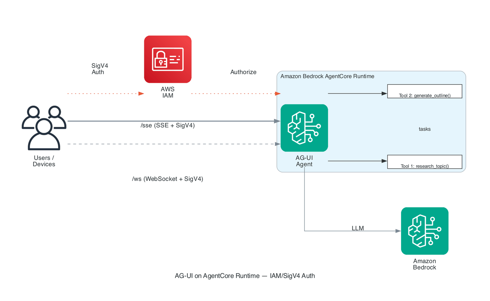
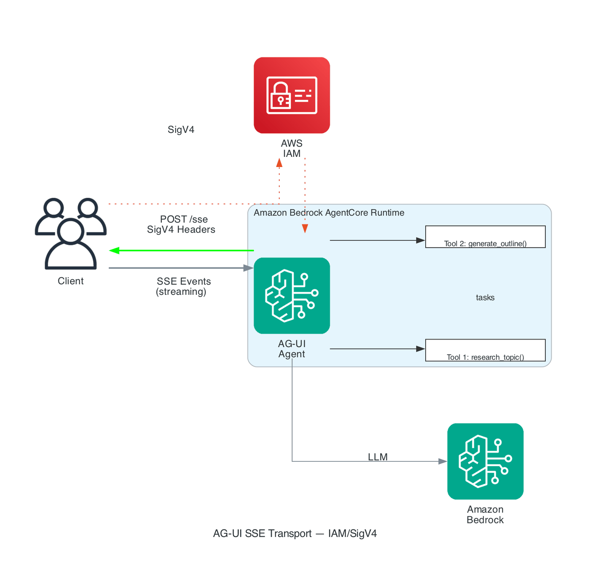
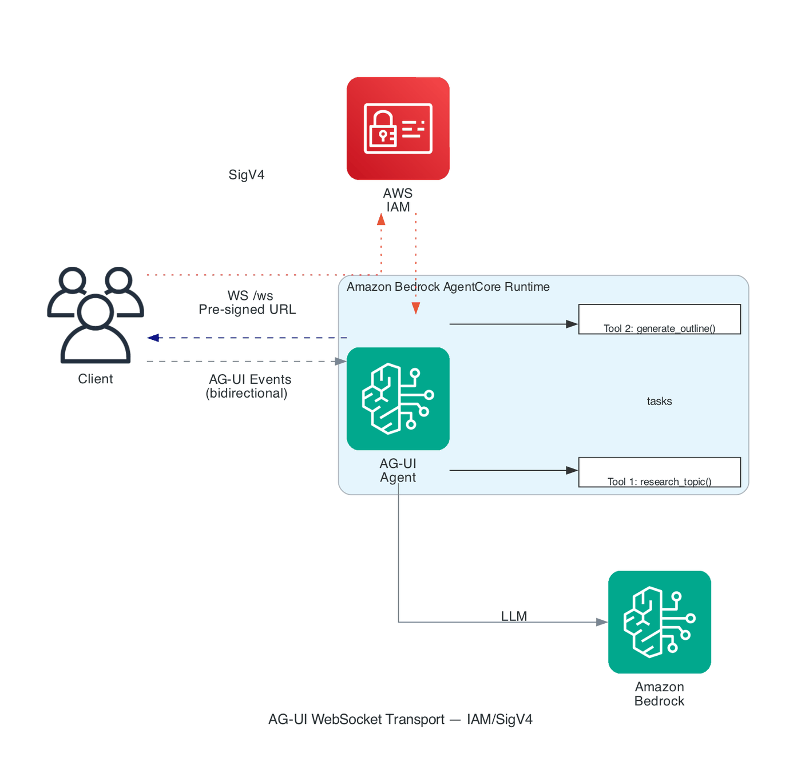
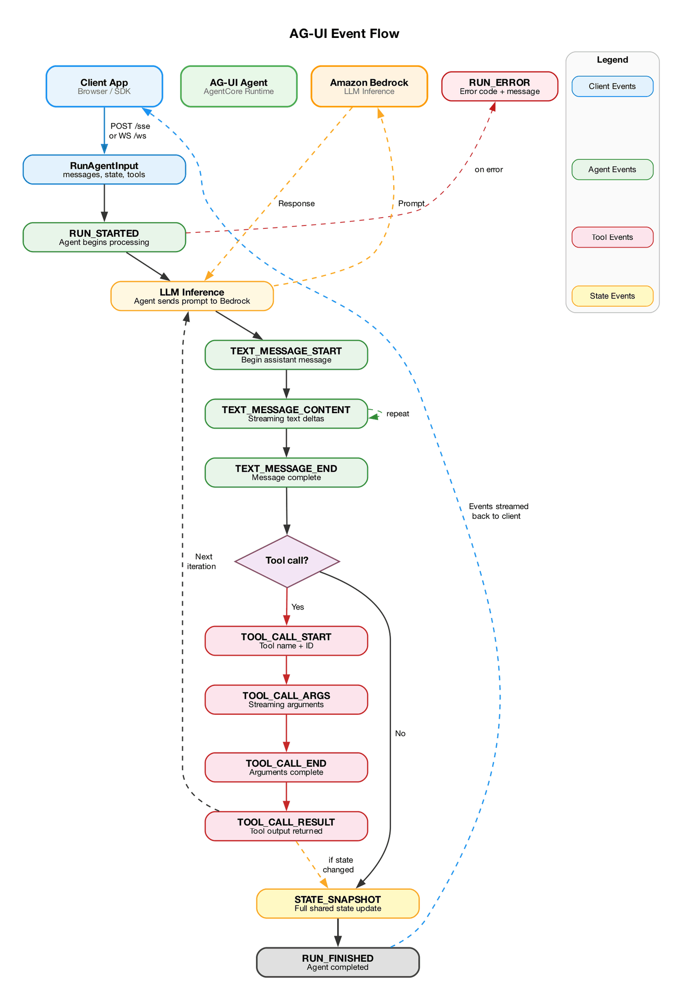

# AG-UI Agent on AgentCore Runtime (IAM/SigV4 Auth)

Deploy a document co-authoring AGUI agent and interact with it over **SSE** and **WebSocket** using IAM SigV4.

| Detail | Value |
|:-------|:------|
| Agent | Collaborative Document Generator |
| Framework | Strands Agents + ag-ui-strands |
| LLM | Claude Sonnet 4 |
| Protocol | AGUI (SSE + WebSocket) |
| Auth | IAM SigV4 (no Cognito required) |

## Architecture

AG-UI is an open, event-based protocol that standardizes how AI agents connect to user-facing applications. AgentCore Runtime supports AG-UI natively with both **SSE** and **WebSocket** transports.

<div style="text-align:left">
    
</div>

For more information: [AG-UI Protocol](https://docs.ag-ui.com) · [AgentCore AGUI Docs](https://docs.aws.amazon.com/bedrock-agentcore/latest/devguide/runtime-agui.html)

## Prerequisites

- Python 3.12+
- AWS credentials with Bedrock model access and `bedrock-agentcore:InvokeAgentRuntime`

```python
!pip install -U -r requirements.txt --quiet
!pip install bedrock-agentcore-starter-toolkit httpx --quiet

# Install zip utility if missing (required for direct_code_deploy)
!which zip > /dev/null 2>&1 || (sudo apt-get update -qq && sudo apt-get install -y -qq zip > /dev/null 2>&1 && echo 'zip installed')
```

## 1. Deploy to AgentCore Runtime (IAM Auth)

No Cognito setup needed. IAM SigV4 is the default when no `authorizer_configuration` is provided.

```python
from boto3.session import Session
from bedrock_agentcore_starter_toolkit import Runtime

boto_session = Session()
region = boto_session.region_name

agentcore_runtime = Runtime()
response = agentcore_runtime.configure(
    entrypoint="agui_agent.py",
    auto_create_execution_role=True,
    protocol="AGUI",
    requirements_file="requirements.txt",
    region=region,
    agent_name="doc_generator_agui_iam",
    deployment_type="direct_code_deploy",
    runtime_type="PYTHON_3_13",
)
response
```

```python
launch_result = agentcore_runtime.launch()
launch_result
```

```python
status_response = agentcore_runtime.status()
status = status_response.endpoint["status"]
print(f"\n\u2705 Runtime status: {status}")
```

### Verify Runtime Configuration

```python
import boto3

ac = boto3.client("bedrock-agentcore-control", region_name=region)
sr = ac.get_agent_runtime(agentRuntimeId=launch_result.agent_id)

print(f"Status:     {sr.get('status')}")
print(f"Protocol:   {sr.get('protocolConfiguration', {})}")
print(f"Agent ARN:  {sr.get('agentRuntimeArn')}")
```

## 2. Connection Setup

```python
import json
import urllib.parse
import uuid
from datetime import datetime, timezone
from botocore.auth import SigV4Auth, SigV4QueryAuth
from botocore.awsrequest import AWSRequest

agent_arn = launch_result.agent_arn
encoded_arn = urllib.parse.quote(agent_arn, safe="")
DP = f"https://bedrock-agentcore.{region}.amazonaws.com"
SSE_URL = f"{DP}/runtimes/{encoded_arn}/invocations?qualifier=DEFAULT"
WS_URL = f"{DP}/runtimes/{encoded_arn}/ws?qualifier=DEFAULT".replace("https://", "wss://")


def sigv4_headers(url, body):
    """Sign a POST request with SigV4."""
    req = AWSRequest(
        method="POST",
        url=url,
        data=body,
        headers={
            "Content-Type": "application/json",
            "X-Amzn-Bedrock-AgentCore-Runtime-Session-Id": str(uuid.uuid4()),
        },
    )
    SigV4Auth(boto_session.get_credentials(), "bedrock-agentcore", region).add_auth(req)
    return dict(req.headers)


def sigv4_presign_ws(ws_url):
    """Create a SigV4 pre-signed WebSocket URL."""
    req = AWSRequest(method="GET", url=ws_url, headers={})
    SigV4QueryAuth(boto_session.get_credentials(), "bedrock-agentcore", region, expires=300).add_auth(req)
    return req.url


def format_event(evt, idx):
    et = evt.get("type", "?")
    if et == "TEXT_MESSAGE_CONTENT":
        delta = evt.get("delta", evt.get("value", ""))
        return f'  \u001b[36m[{idx:2d}]\u001b[0m {et}: "{delta}"'
    elif et == "STATE_SNAPSHOT":
        snap = evt.get("snapshot", {})
        title = snap.get("title", "?")
        sections = snap.get("sections", [])
        return f'  \u001b[33m[{idx:2d}]\u001b[0m {et}: "{title}" ({len(sections)} sections)'
    elif "TOOL_CALL" in et:
        name = evt.get("toolCallName", evt.get("name", ""))
        extra = f" ({name})" if name else ""
        return f"  \u001b[35m[{idx:2d}]\u001b[0m {et}{extra}"
    else:
        return f"  [{idx:2d}] {et}"


print(f"SSE URL: {SSE_URL[:80]}...")
print(f"WS  URL: {WS_URL[:80]}...")
```

## 3. Demo: SSE Transport (SigV4)

Send a document creation request over SSE with SigV4-signed headers.

<div style="text-align:left">
    
</div>

```python
import httpx

payload = {
    "threadId": "sse-demo-1",
    "runId": "run-sse-1",
    "state": {
        "title": "",
        "sections": [],
        "metadata": {
            "last_modified": datetime.now(timezone.utc).isoformat(),
            "version": 0,
        },
    },
    "messages": [
        {
            "id": "msg-1",
            "role": "user",
            "content": "Create a document about cloud architecture best practices with 3 sections.",
        }
    ],
    "tools": [],
    "context": [],
    "forwardedProps": {},
}
body = json.dumps(payload)
headers = sigv4_headers(SSE_URL, body)

print("\u2501" * 60)
print("SSE Demo \u2014 Document Creation (SigV4)")
print("\u2501" * 60)

types_seen = set()
count = 0
text_parts = []
snapshots = []
try:
    with httpx.Client(timeout=120.0) as c:
        with c.stream("POST", SSE_URL, headers=headers, content=body) as r:
            print(f"HTTP {r.status_code}\n")
            for line in r.iter_lines():
                if line.startswith("data: "):
                    count += 1
                    try:
                        evt = json.loads(line[6:])
                        et = evt.get("type", "?")
                        types_seen.add(et)
                        print(format_event(evt, count))
                        if et == "TEXT_MESSAGE_CONTENT":
                            text_parts.append(evt.get("delta", evt.get("value", "")))
                        elif et == "STATE_SNAPSHOT":
                            snapshots.append(evt.get("snapshot", {}))
                    except:
                        pass
    print("\n\u2500" * 40)
    print(f"Events: {count} | Types: {sorted(types_seen)}")
    if snapshots:
        last = snapshots[-1]
        print(f'\nDocument: "{last.get("title", "?")}"')
        for s in last.get("sections", []):
            print(f"  \u2022 {s.get('heading', '?')}")
except Exception as e:
    print(f"\u274c {e}")
```

## 4. Demo: WebSocket Transport (SigV4 Pre-signed URL)

SigV4 WebSocket uses a pre-signed URL since custom headers can't be added to the browser handshake.

<div style="text-align:left">
    
</div>

```python
import websockets

presigned_url = sigv4_presign_ws(WS_URL)

ws_payload = {
    "threadId": "ws-demo-1",
    "runId": "run-ws-1",
    "state": {
        "title": "",
        "sections": [],
        "metadata": {
            "last_modified": datetime.now(timezone.utc).isoformat(),
            "version": 0,
        },
    },
    "messages": [
        {
            "id": "msg-1",
            "role": "user",
            "content": "Create a document about AI safety with 3 sections.",
        }
    ],
    "tools": [],
    "context": [],
    "forwardedProps": {},
}

print("\u2501" * 60)
print("WebSocket Demo \u2014 Document Creation (SigV4 Pre-signed)")
print("\u2501" * 60)

types_seen = set()
count = 0
text_parts = []
snapshots = []
try:
    async with websockets.connect(presigned_url, open_timeout=15) as ws:
        print("\u2705 Connected\n")
        await ws.send(json.dumps(ws_payload))
        async for msg in ws:
            count += 1
            evt = json.loads(msg)
            et = evt.get("type", "?")
            types_seen.add(et)
            print(format_event(evt, count))
            if et == "TEXT_MESSAGE_CONTENT":
                text_parts.append(evt.get("delta", evt.get("value", "")))
            elif et == "STATE_SNAPSHOT":
                snapshots.append(evt.get("snapshot", {}))
            if et in ("RUN_FINISHED", "RUN_ERROR"):
                break
    print("\n\u2500" * 40)
    print(f"Events: {count} | Types: {sorted(types_seen)}")
    if snapshots:
        last = snapshots[-1]
        print(f'\nDocument: "{last.get("title", "?")}"')
        for s in last.get("sections", []):
            print(f"  \u2022 {s.get('heading', '?')}")
except Exception as e:
    print(f"\u274c {e}")
```

## 5. Interactive Demo: Multi-Turn Document Co-Authoring

Simulate a realistic conversation: create outline \u2192 add content \u2192 refine \u2192 finalize.

Each turn streams the full AG-UI event lifecycle:

<div style="text-align:left">
    
</div>

```python
import httpx
import sys

thread_id = f"interactive-{uuid.uuid4().hex[:8]}"

conversation = [
    {
        "step": "\u2460 Create Outline",
        "message": 'Create a document outline about "Microservices Architecture" with 4 sections. Use generate_outline first, then update_document.',
    },
    {
        "step": "\u2461 Research & Expand",
        "message": "Research microservices best practices and expand the first two sections with detailed content. Use research_topic then update_document.",
    },
    {
        "step": "\u2462 Add Technical Detail",
        "message": 'Add a new section about "Service Mesh and Observability" with specific tool recommendations. Update the document.',
    },
    {
        "step": "\u2463 Final Polish",
        "message": "Review the entire document and improve the conclusion. Make sure each section has at least 2 paragraphs. Update the document with the final version.",
    },
]

current_state = {
    "title": "",
    "sections": [],
    "metadata": {"last_modified": datetime.now(timezone.utc).isoformat(), "version": 0},
}

for turn in conversation:
    print(f"\n{'\u2550' * 60}")
    print(f"  {turn['step']}")
    print(f"  User: {turn['message'][:80]}...")
    print(f"{'\u2550' * 60}\n")

    payload = {
        "threadId": thread_id,
        "runId": f"run-{uuid.uuid4().hex[:8]}",
        "state": current_state,
        "messages": [{"id": str(uuid.uuid4()), "role": "user", "content": turn["message"]}],
        "tools": [],
        "context": [],
        "forwardedProps": {},
    }
    body = json.dumps(payload)
    headers = sigv4_headers(SSE_URL, body)

    import time as _time

    t0 = _time.time()
    types_seen = set()
    count = 0
    snapshots = []
    text_parts = []
    current_tool = None
    tool_args_buf = []
    try:
        with httpx.Client(timeout=180.0) as c:
            with c.stream("POST", SSE_URL, headers=headers, content=body) as r:
                for line in r.iter_lines():
                    if line.startswith("data: "):
                        count += 1
                        try:
                            evt = json.loads(line[6:])
                            et = evt.get("type", "?")
                            types_seen.add(et)

                            # Live progress output
                            if et == "RUN_STARTED":
                                print("  \u25b6 Agent started processing...")
                            elif et == "TOOL_CALL_START":
                                current_tool = evt.get("toolCallName", "?")
                                tool_args_buf = []
                                print(
                                    f"  \u001b[35m\u2699 Calling tool: {current_tool}\u001b[0m",
                                    end="",
                                )
                                sys.stdout.flush()
                            elif et == "TOOL_CALL_ARGS":
                                tool_args_buf.append(evt.get("delta", ""))
                                print(".", end="")
                                sys.stdout.flush()
                            elif et == "TOOL_CALL_END":
                                args_preview = "".join(tool_args_buf)[:80]
                                print(" done")
                                if args_preview:
                                    print(
                                        f"    args: {args_preview}..."
                                        if len("".join(tool_args_buf)) > 80
                                        else f"    args: {args_preview}"
                                    )
                            elif et == "TOOL_CALL_RESULT":
                                result = evt.get("result", "")
                                print(f"    \u001b[32m\u2713 result: {str(result)[:100]}\u001b[0m")
                            elif et == "TEXT_MESSAGE_CONTENT":
                                delta = evt.get("delta", evt.get("value", ""))
                                text_parts.append(delta)
                            elif et == "STATE_SNAPSHOT":
                                snapshots.append(evt.get("snapshot", {}))
                                snap = evt.get("snapshot", {})
                                n_sec = len(snap.get("sections", []))
                                print(
                                    f'  \u001b[33m\u2b50 STATE_SNAPSHOT: "{snap.get("title", "?")}" ({n_sec} sections)\u001b[0m'
                                )
                            elif et == "RUN_FINISHED":
                                elapsed = _time.time() - t0
                                print(f"  \u23f9 Finished ({elapsed:.1f}s, {count} events)")
                        except:
                            pass

        # Print agent text if any
        if text_parts:
            full_text = "".join(text_parts)
            if full_text.strip():
                print(f"\n  \u001b[36mAgent: {full_text[:200]}\u001b[0m")

        # Update state for next turn
        if snapshots:
            current_state = snapshots[-1]
            print(f'\n  \u2705 Document: "{current_state.get("title", "?")}"')
            for s in current_state.get("sections", []):
                body_preview = s.get("body", "")[:60]
                print(f"     \u2022 {s.get('heading', '?')}: {body_preview}...")
            ver = current_state.get("metadata", {}).get("version", "?")
            print(f"     Version: {ver}")
        elif not text_parts:
            print(f"  \u26a0\ufe0f No output. Types: {sorted(types_seen)}")
    except Exception as e:
        print(f"  \u274c {e}")

print(f"\n{'\u2550' * 60}")
print("  \u2705 Interactive demo complete")
print(f"{'\u2550' * 60}")
```

## 6. Cleanup

**Run only when done.**

```python
import boto3

ac_ctrl = boto3.client("bedrock-agentcore-control", region_name=region)
try:
    ac_ctrl.delete_agent_runtime(agentRuntimeId=launch_result.agent_id)
    print("\u2705 Runtime deleted")
except Exception as e:
    print(f"\u26a0\ufe0f {e}")

print("\n\u2705 Cleanup complete")
```
