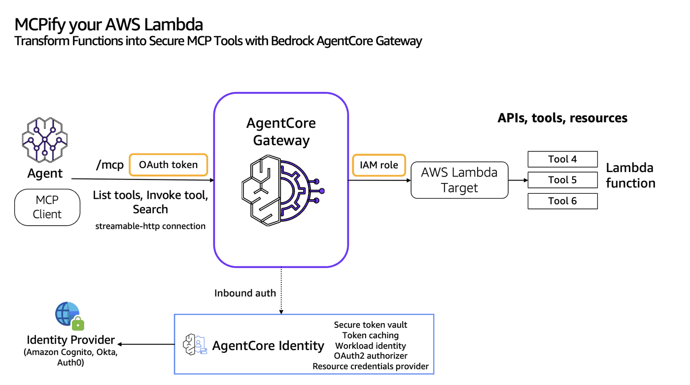
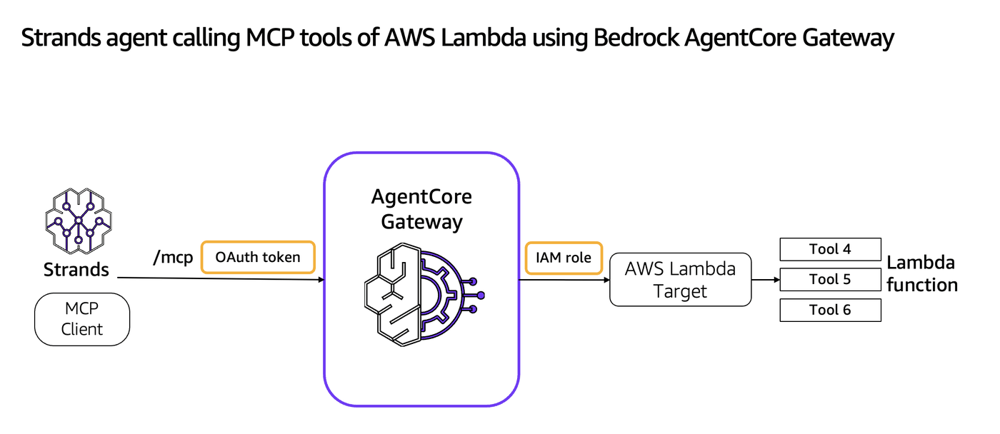

# MCPify your AWS Lambda with Gateway OAuth Inbound
## Transform AWS Lambda functions into secure MCP tools with Bedrock AgentCore Gateway

## Overview
Bedrock AgentCore Gateway provides customers a way to turn their existing AWS Lambda functions into fully-managed MCP servers without needing to manage infra or hosting. Gateway will provide a uniform Model Context Protocol (MCP) interface across all these tools. Gateway employs a dual authentication model to ensure secure access control for both incoming requests and outbound connections to target resources. The framework consists of two key components: Inbound Auth, which validates and authorizes users attempting to access gateway targets, and Outbound Auth, which enables the gateway to securely connect to backend resources on behalf of authenticated users. Gateways uses IAM role to authorize the calls to AWS Lambda functions for outbound authorization.

In this example, we will demonstrate OAuth for inbound authorization and IAM roles for outbound authorization.



### Tutorial Details


| Information          | Details                                                   |
|:---------------------|:----------------------------------------------------------|
| Tutorial type        | Interactive                                               |
| AgentCore components | AgentCore Gateway, AgentCore Identity                     |
| Agentic Framework    | Strands Agents                                            |
| Gateway Target type  | AWS Lambda                                                |
| Inbound Auth IdP     | Amazon Cognito                                            |
| Outbound Auth        | AWS IAM                                                   |
| LLM model            | Anthropic Claude Haiku 4.5, Amazon Nova Pro              |
| Tutorial components  | Creating AgentCore Gateway and Invoking AgentCore Gateway |
| Tutorial vertical    | Cross-vertical                                            |
| Example complexity   | Easy                                                      |
| SDK used             | boto3                                                     |

In the first part of the tutorial we will create some AmazonCore Gateway targets

### Tutorial Architecture
In this tutorial we will transform operations defined in AWS lambda function into MCP tools and host it in Bedrock AgentCore Gateway.
For demonstration purposes, we will use a Strands Agent using Amazon Bedrock models
In our example we will use a very simple agent with two tools: get_order and update_order.

## Prerequisites

To execute this tutorial you will need:
* Jupyter notebook (Python kernel)
* uv
* AWS credentials
* Amazon Cognito

## Configuring Authentication for Incoming AgentCore Gateway Requests
AgentCore Gateway provides secure connections via inbound and outbound authentication. For the inbound authentication, the AgentCore Gateway analyzes the OAuth token passed during invocation to decide allow or deny the access to a tool in the gateway. If a tool needs access to external resources, the AgentCore Gateway can use outbound authentication via API Key, IAM or OAuth Token to allow or deny the access to the external resource.


During the inbound authorization flow, an agent or the MCP client calls an MCP tool in the AgentCore Gateway adding an OAuth access token (generated from the user’s IdP). AgentCore Gateway then validates the OAuth access token and performs inbound authorization.

If the tool running in AgentCore Gateway needs to access external resources, OAuth will retrieve credentials of downstream resources using the resource credential provider for the Gateway target. AgentCore Gateway pass the authorization credentials to the caller to get access to the downstream API.

```python
!pip install --force-reinstall -U -r requirements.txt --quiet
```

```python
# Set AWS credentials if not using Amazon SageMaker notebook
import os

# os.environ['AWS_ACCESS_KEY_ID'] = '' # Set the access key
# os.environ['AWS_SECRET_ACCESS_KEY'] = '' # Set the secret key
os.environ["AWS_DEFAULT_REGION"] = os.environ.get("AWS_REGION", "us-east-1")  # set the AWS region
```

```python
import os
import sys

# Get the directory of the current script
if "__file__" in globals():
    current_dir = os.path.dirname(os.path.abspath(__file__))
else:
    current_dir = os.getcwd()  # Fallback if __file__ is not defined (e.g., Jupyter)

# Navigate to the directory containing utils.py (one level up)
utils_dir = os.path.abspath(os.path.join(current_dir, ".."))

# Add to sys.path
sys.path.insert(0, utils_dir)

# Now you can import utils
import utils
```

```python
#### Create a sample AWS Lambda function that you want to convert into MCP tools
lambda_resp = utils.create_gateway_lambda("lambda_function_code.zip")

if lambda_resp is not None:
    if lambda_resp["exit_code"] == 0:
        print("Lambda function created with ARN: ", lambda_resp["lambda_function_arn"])
    else:
        print(
            "Lambda function creation failed with message: ",
            lambda_resp["lambda_function_arn"],
        )
```

```python
#### Create an IAM role for the Gateway to assume
import utils

agentcore_gateway_iam_role = utils.create_agentcore_gateway_role("sample-lambdagateway")
print("Agentcore gateway role ARN: ", agentcore_gateway_iam_role["Role"]["Arn"])
```

# Create Amazon Cognito Pool for Inbound authorization to Gateway

```python
# Creating Cognito User Pool
import os
import boto3
import time

REGION = os.environ["AWS_DEFAULT_REGION"]
USER_POOL_NAME = "sample-agentcore-gateway-pool"
RESOURCE_SERVER_ID = "sample-agentcore-gateway-id"
RESOURCE_SERVER_NAME = "sample-agentcore-gateway-name"
CLIENT_NAME = "sample-agentcore-gateway-client"
SCOPES = [
    {"ScopeName": "gateway:read", "ScopeDescription": "Read access"},
    {"ScopeName": "gateway:write", "ScopeDescription": "Write access"},
]
scopeString = f"{RESOURCE_SERVER_ID}/gateway:read {RESOURCE_SERVER_ID}/gateway:write"

cognito = boto3.client("cognito-idp", region_name=REGION)

print("Creating or retrieving Cognito resources...")
user_pool_id = utils.get_or_create_user_pool(cognito, USER_POOL_NAME)
print(f"User Pool ID: {user_pool_id}")

utils.get_or_create_resource_server(cognito, user_pool_id, RESOURCE_SERVER_ID, RESOURCE_SERVER_NAME, SCOPES)
print("Resource server ensured.")

client_id, client_secret = utils.get_or_create_m2m_client(cognito, user_pool_id, CLIENT_NAME, RESOURCE_SERVER_ID)
print(f"Client ID: {client_id}")

# Get discovery URL
cognito_discovery_url = f"https://cognito-idp.{REGION}.amazonaws.com/{user_pool_id}/.well-known/openid-configuration"
print(cognito_discovery_url)
```

# Create the Gateway with Amazon Cognito Authorizer for inbound authorization

```python
# CreateGateway with Cognito authorizer without CMK. Use the Cognito user pool created in the previous step
gateway_client = boto3.client("bedrock-agentcore-control", region_name=os.environ["AWS_DEFAULT_REGION"])
auth_config = {
    "customJWTAuthorizer": {
        "allowedClients": [
            client_id
        ],  # Client MUST match with the ClientId configured in Cognito. Example: 7rfbikfsm51j2fpaggacgng84g
        "discoveryUrl": cognito_discovery_url,
    }
}
create_response = gateway_client.create_gateway(
    name="TestGWforLambda",
    roleArn=agentcore_gateway_iam_role["Role"][
        "Arn"
    ],  # The IAM Role must have permissions to create/list/get/delete Gateway
    protocolType="MCP",
    authorizerType="CUSTOM_JWT",
    authorizerConfiguration=auth_config,
    description="AgentCore Gateway with AWS Lambda target type",
)
print(create_response)
# Retrieve the GatewayID used for GatewayTarget creation
gatewayID = create_response["gatewayId"]
gatewayURL = create_response["gatewayUrl"]
print(gatewayID)
```

# Create an AWS Lambda target and transform into MCP tools

```python
# Replace the AWS Lambda function ARN below
lambda_target_config = {
    "mcp": {
        "lambda": {
            "lambdaArn": lambda_resp["lambda_function_arn"],  # Replace this with your AWS Lambda function ARN
            "toolSchema": {
                "inlinePayload": [
                    {
                        "name": "get_order_tool",
                        "description": "tool to get the order",
                        "inputSchema": {
                            "type": "object",
                            "properties": {"orderId": {"type": "string"}},
                            "required": ["orderId"],
                        },
                    },
                    {
                        "name": "update_order_tool",
                        "description": "tool to update the orderId",
                        "inputSchema": {
                            "type": "object",
                            "properties": {"orderId": {"type": "string"}},
                            "required": ["orderId"],
                        },
                    },
                ]
            },
        }
    }
}

credential_config = [{"credentialProviderType": "GATEWAY_IAM_ROLE"}]
targetname = "LambdaUsingSDK"
response = gateway_client.create_gateway_target(
    gatewayIdentifier=gatewayID,
    name=targetname,
    description="Lambda Target using SDK",
    targetConfiguration=lambda_target_config,
    credentialProviderConfigurations=credential_config,
)
```

# Calling Bedrock AgentCore Gateway from a Strands Agent

The Strands agent seamlessly integrates with AWS tools through the Bedrock AgentCore Gateway, which implements the Model Context Protocol (MCP) specification. This integration enables secure, standardized communication between AI agents and AWS services.

At its core, the Bedrock AgentCore Gateway serves as a protocol-compliant Gateway that exposes fundamental MCP APIs: ListTools and InvokeTools. These APIs allow any MCP-compliant client or SDK to discover and interact with available tools in a secure, standardized way. When the Strands agent needs to access AWS services, it communicates with the Gateway using these MCP-standardized endpoints.

The Gateway's implementation adheres strictly to the (MCP Authorization specification)[https://modelcontextprotocol.org/specification/draft/basic/authorization], ensuring robust security and access control. This means that every tool invocation by the Strands agent goes through authorization step, maintaining security while enabling powerful functionality.

For example, when the Strands agent needs to access MCP tools, it first calls ListTools to discover available tools, then uses InvokeTools to execute specific actions. The Gateway handles all the necessary security validations, protocol translations, and service interactions, making the entire process seamless and secure.

This architectural approach means that any client or SDK that implements the MCP specification can interact with AWS services through the Gateway, making it a versatile and future-proof solution for AI agent integrations.



# Request the access token from Amazon Cognito for inbound authorization

```python
time.sleep(10)
```

```python
print(
    "Requesting the access token from Amazon Cognito authorizer...May fail for some time till the domain name propogation completes"
)
token_response = utils.get_token(user_pool_id, client_id, client_secret, scopeString, REGION)
token = token_response["access_token"]
print("Token response:", token)
```

# Strands agent calling MCP tools of AWS Lambda using Bedrock AgentCore Gateway

```python
from strands.models import BedrockModel
from mcp.client.streamable_http import streamablehttp_client
from strands.tools.mcp.mcp_client import MCPClient
from strands import Agent


def create_streamable_http_transport():
    return streamablehttp_client(gatewayURL, headers={"Authorization": f"Bearer {token}"})


client = MCPClient(create_streamable_http_transport)

## The IAM credentials configured in ~/.aws/credentials should have access to Bedrock model
yourmodel = BedrockModel(
    model_id="us.amazon.nova-pro-v1:0",
    temperature=0.7,
)
```

```python
import logging


# Configure the root strands logger. Change it to DEBUG if you are debugging the issue.
logging.getLogger("strands").setLevel(logging.INFO)

# Add a handler to see the logs
logging.basicConfig(format="%(levelname)s | %(name)s | %(message)s", handlers=[logging.StreamHandler()])

with client:
    # Call the listTools
    tools = client.list_tools_sync()
    # Create an Agent with the model and tools
    agent = Agent(model=yourmodel, tools=tools)  ## you can replace with any model you like
    print(f"Tools loaded in the agent are {agent.tool_names}")
    # print(f"Tools configuration in the agent are {agent.tool_config}")
    # Invoke the agent with the sample prompt. This will only invoke  MCP listTools and retrieve the list of tools the LLM has access to. The below does not actually call any tool.
    agent("Hi , can you list all tools available to you")
    # Invoke the agent with sample prompt, invoke the tool and display the response
    agent("Check the order status for order id 123 and show me the exact response from the tool")
    # Call the MCP tool explicitly. The MCP Tool name and arguments must match with your AWS Lambda function or the OpenAPI/Smithy API
    result = client.call_tool_sync(
        tool_use_id="get-order-id-123-call-1",  # You can replace this with unique identifier.
        name=targetname
        + "___get_order_tool",  # This is the tool name based on AWS Lambda target types. This will change based on the target name
        arguments={"orderId": "123"},
    )
    # Print the MCP Tool response
    print(f"Tool Call result: {result['content'][0]['text']}")
```

**Issue: if you get below error while executing below cell, it indicates incompatibily between pydantic and pydantic-core versions.**

```
TypeError: model_schema() got an unexpected keyword argument 'generic_origin'
```
**How to resolve?**

You will need to make sure you have pydantic==2.7.2 and pydantic-core 2.27.2 that are both compatible. Restart the kernel once done.

# Clean up

Additional resources are also created like IAM role, IAM Policies, Credentials provider, AWS Lambda functions, Cognito user pools, s3 buckets that you might need to manually delete as part of the clean up. This depends on the example you run.

## Delete the gateway (Optional)

```python
import utils

utils.delete_gateway(gateway_client, gatewayID)
```
