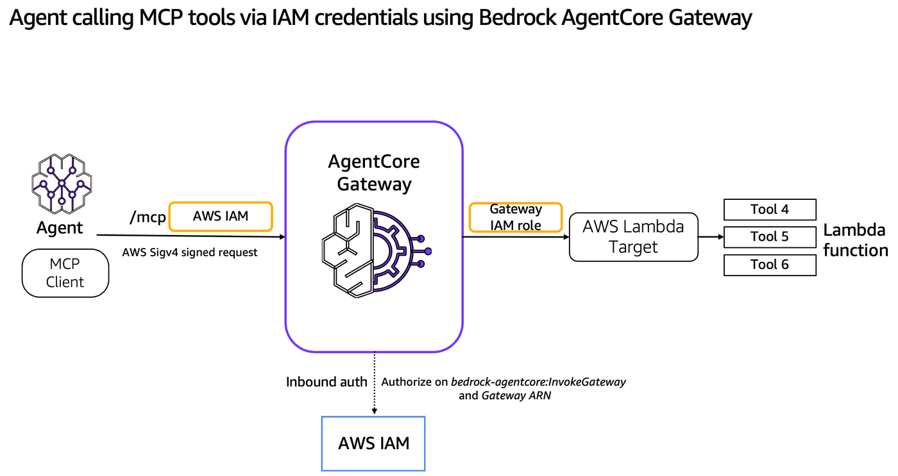

# MCPify your AWS Lambda with Gateway IAM role Inbound
## Transform AWS Lambda functions into secure MCP tools with Bedrock AgentCore Gateway

## Overview
Bedrock AgentCore Gateway provides customers a way to turn their existing AWS Lambda functions into fully-managed MCP servers without needing to manage infra or hosting. Gateway will provide a uniform Model Context Protocol (MCP) interface across all these tools. Gateway employs a dual authentication model to ensure secure access control for both incoming requests and outbound connections to target resources. The framework consists of two key components: Inbound Auth, which validates and authorizes users attempting to access gateway targets, and Outbound Auth, which enables the gateway to securely connect to backend resources on behalf of authenticated users. Gateways uses IAM role to authorize the calls to AWS Lambda functions for outbound authorization.

In this example, we will demonstrate both inbound and outbound authorization using IAM roles.



### Tutorial Details


| Information          | Details                                                   |
|:---------------------|:----------------------------------------------------------|
| Tutorial type        | Interactive                                               |
| AgentCore components | AgentCore Gateway                                         |
| Agentic Framework    | Strands Agents                                            |
| Gateway Target type  | AWS Lambda                                                |
| Inbound Auth         | AAWS IAM                                                  |
| Outbound Auth        | AWS IAM                                                   |
| LLM model            | Anthropic Claude Haiku 4.5, Amazon Nova Pro              |
| Tutorial components  | Creating AgentCore Gateway and Invoking AgentCore Gateway |
| Tutorial vertical    | Cross-vertical                                            |
| Example complexity   | Easy                                                      |
| SDK used             | boto3                                                     |

In the first part of the tutorial we will create AmazonCore Gateway targets for Lambda

### Tutorial Architecture
In this tutorial we will transform operations defined in AWS lambda function into MCP tools and host it in Bedrock AgentCore Gateway. We will demonstrate the ingress auth using AWS IAM credentials in AWS Sigv4 header.
For demonstration purposes, we will use a Strands Agent using Amazon Bedrock models.
In our example we will use a very simple agent with two tools: get_order and update_order.

## Prerequisites

To execute this tutorial you will need:
* Jupyter notebook (Python kernel)
* uv
* AWS credentials
* Access of Nova Pro via AWS console
* Amazon Bedrock AgentCore SDK
* Strand Agents

## Configuring Authentication for Incoming AgentCore Gateway Requests
AgentCore Gateway provides secure connections via inbound and outbound authentication. For the inbound authentication, the AgentCore Gateway now supports AWS IAM credentials/identities in addtion to OAuth to call the gateway. If a tool needs access to external resources, the AgentCore Gateway can use outbound authentication via API Key, IAM or OAuth Token to allow or deny the access to the external resource.

During the inbound authorization flow, an agent or the MCP client uses AWS Signature V4 signed requests that will be used for authentication and authorize against IAM permissions to access the AgentCore Gateway. AgentCore Gateway then validates AWS IAM credentials/identities and performs inbound authorization.

If the tool running in AgentCore Gateway needs to access external resources, IAM role will retrieve credentials of downstream resources for the Gateway target. AgentCore Gateway pass the authorization credentials to the caller to get access to the downstream API.

```python
!pip install --force-reinstall -U -r requirements.txt --quiet
```

```python
# Set AWS credentials if not using Amazon SageMaker notebook
import os

# os.environ['AWS_ACCESS_KEY_ID']=''
# os.environ['AWS_SECRET_ACCESS_KEY']=''
os.environ["AWS_DEFAULT_REGION"] = "us-west-2"  # set the AWS region
```

```python
import os
import sys

# Get the directory of the current script
if "__file__" in globals():
    current_dir = os.path.dirname(os.path.abspath(__file__))
else:
    current_dir = os.getcwd()  # Fallback if __file__ is not defined (e.g., Jupyter)

# Navigate to the directory containing utils.py (one level up)
utils_dir = os.path.abspath(os.path.join(current_dir, ".."))

# Add to sys.path
sys.path.insert(0, utils_dir)
```

```python
# Now you can import utils
import utils

#### Create a sample AWS Lambda function that you want to convert into MCP tools
lambda_resp = utils.create_gateway_lambda("lambda_function_code.zip")
if lambda_resp is not None:
    if lambda_resp["exit_code"] == 0:
        print("Lambda function created with ARN: ", lambda_resp["lambda_function_arn"])
    else:
        print(
            "Lambda function creation failed with message: ",
            lambda_resp["lambda_function_arn"],
        )
```

```python
#### Create an IAM role for the Gateway to assume
import utils

agentcore_gateway_iam_role = utils.create_agentcore_gateway_role("sample-lambdagateway")
print("Agentcore gateway role ARN: ", agentcore_gateway_iam_role["Role"]["Arn"])
```

# Create the Gateway with Amazon IAM Authorizer for inbound authorization

```python
import time
import boto3

# CreateGateway with Amazon IAM.
gateway_client = boto3.client("bedrock-agentcore-control", region_name=os.environ["AWS_DEFAULT_REGION"])

create_response = gateway_client.create_gateway(
    name="TestGWforLambdaIAM",
    roleArn=agentcore_gateway_iam_role["Role"][
        "Arn"
    ],  # The IAM Role must have permissions to create/list/get/delete Gateway
    protocolType="MCP",
    authorizerType="AWS_IAM",
    description="AgentCore Gateway with AWS Lambda target type using Amazon IAM for ingress auth",
)
print(create_response)
# Retrieve the GatewayID used for GatewayTarget creation
gatewayID = create_response["gatewayId"]
gatewayURL = create_response["gatewayUrl"]
print(gatewayID)
time.sleep(10)
```

# Create an AWS Lambda target and transform into MCP tools

```python
# Replace the AWS Lambda function ARN below
lambda_target_config = {
    "mcp": {
        "lambda": {
            "lambdaArn": lambda_resp["lambda_function_arn"],  # Replace this with your AWS Lambda function ARN
            "toolSchema": {
                "inlinePayload": [
                    {
                        "name": "get_order_tool",
                        "description": "tool to get the order",
                        "inputSchema": {
                            "type": "object",
                            "properties": {"orderId": {"type": "string"}},
                            "required": ["orderId"],
                        },
                    },
                    {
                        "name": "update_order_tool",
                        "description": "tool to update the orderId",
                        "inputSchema": {
                            "type": "object",
                            "properties": {"orderId": {"type": "string"}},
                            "required": ["orderId"],
                        },
                    },
                ]
            },
        }
    }
}

credential_config = [{"credentialProviderType": "GATEWAY_IAM_ROLE"}]
targetname = "LambdaUsingSDK"
response = gateway_client.create_gateway_target(
    gatewayIdentifier=gatewayID,
    name=targetname,
    description="Lambda Target using SDK",
    targetConfiguration=lambda_target_config,
    credentialProviderConfigurations=credential_config,
)
```

# Create AWS IAM Role to Invoke Gateway

This below function creates or updates an IAM role that allows AWS Bedrock AgentCore to invoke a specified gateway. Builds and attaches an inline policy granting bedrock-agentcore:InvokeGateway permission for the given gateway ID.Also, configures a trust policy permitting both the Bedrock AgentCore service and the calling IAM entity (current_arn) to assume the role.

```python
#### Create an IAM role to Invoke Gateway
current_role_arn = utils.get_current_role_arn()
print("Current role ARN: ", current_role_arn)

agentcore_gateway_iam_invoke_role = utils.create_gateway_invoke_tool_role(
    "gateway-invoke-role", gatewayID, current_role_arn
)
print(
    "Role to invoke Agentcore gateway ARN: ",
    agentcore_gateway_iam_invoke_role["Role"]["Arn"],
)
```

# Strands agent calling MCP tools of AWS Lambda using Bedrock AgentCore Gateway

#### Support for AWS IAM Authentication in MCP Client SDKs

AWS IAM authentication is now supported for inbound requests to AgentCore Gateway, it's important to note that current open-source MCP Client SDKs have limited support for SigV4 authentication, particularly for streamable HTTP connections. However, AWS has provided a solution through the "Run Model Context Protocol (MCP) servers with AWS Lambda" project, which includes a crucial extension for SigV4 authentication with streaming HTTP connections.

This implementation, available at the [AWS Labs GitHub repository](https://github.com/awslabs/run-model-context-protocol-servers-with-aws-lambda/tree/main), bridges the authentication gap for streaming connections and can be seamlessly integrated with popular agentic frameworks like Strands or LangChain. The StreamableHTTPTransportWithSigV4 class extends the standard MCP transport layer to handle AWS SigV4 signing while maintaining streaming capabilities, making it compatible with AgentCore Gateway's new IAM authentication feature.

```python
!pip3 install --upgrade strands-agents strands-agents-tools
from strands.models import BedrockModel

## The IAM credentials configured in ~/.aws/credentials should have access to Bedrock model
yourmodel = BedrockModel(
    model_id="us.amazon.nova-pro-v1:0",
    temperature=0.7,
)
```

```python
from strands import Agent
import logging
from strands.tools.mcp.mcp_client import MCPClient
from mcp.client.streamable_http import streamablehttp_client
from botocore.credentials import Credentials
from streamable_http_sigv4 import (
    streamablehttp_client_with_sigv4,
)

SERVICE = "bedrock-agentcore"

# Configure the root strands logger. Change it to DEBUG if you are debugging the issue.
logging.getLogger("strands").setLevel(logging.INFO)

# Add a handler to see the logs
logging.basicConfig(format="%(levelname)s | %(name)s | %(message)s", handlers=[logging.StreamHandler()])


def create_streamable_http_transport(mcp_url: str, access_token: str):
    return streamablehttp_client(mcp_url, headers={"Authorization": f"Bearer {access_token}"})


def create_streamable_http_transport_sigv4(
    mcp_url: str,
    key: str,
    secret: str,
    sessionToken: str,
    serviceName: str,
    awsRegion: str,
):
    iamcredentials = Credentials(access_key=key, secret_key=secret, token=sessionToken)
    return streamablehttp_client_with_sigv4(
        url=mcp_url,
        credentials=iamcredentials,
        service=serviceName,
        region=awsRegion,
    )


def get_full_tools_list(client):
    more_tools = True
    tools = []
    pagination_token = None
    while more_tools:
        tmp_tools = client.list_tools_sync(pagination_token=pagination_token)
        tools.extend(tmp_tools)
        if tmp_tools.pagination_token is None:
            more_tools = False
        else:
            more_tools = True
            pagination_token = tmp_tools.pagination_token
    return tools


def call_tool_sync(client, tool_id, tool_name, parameters=None):
    # Call the tool (no pagination argument supported)
    response = client.call_tool_sync(tool_use_id=tool_id, name=tool_name, arguments=parameters)

    # Extract output content
    if hasattr(response, "results") and response.results:
        return response.results
    elif hasattr(response, "output") and response.output:
        return response.output
    elif hasattr(response, "content"):
        return response.content
    else:
        return response  # fallback


def run_agent(
    mcp_url: str,
    key: str,
    secret: str,
    sessionToken: str,
    serviceName: str,
    awsRegion: str,
):
    mcp_client = MCPClient(
        lambda: create_streamable_http_transport_sigv4(mcp_url, key, secret, sessionToken, serviceName, awsRegion)
    )

    with mcp_client:
        tools = get_full_tools_list(mcp_client)
        print(f"Found the following tools: {[tool.tool_name for tool in tools]}")
        print(f"Tool name: {tools[0].tool_name}")

        agent = Agent(model=yourmodel, tools=tools)  ## you can replace with any model you like
        print(f"Tools loaded in the agent are {agent.tool_names}")
        agent("Check the order status for order id 123 and show me the exact response from the tool")
        # call mcp with tool
        tool = tools[0].tool_name
        tool_id = "get-order-id-123-call-1"
        result = call_tool_sync(mcp_client, tool_id, tool_name=tool, parameters={"orderId": "123"})

        print(f"Tool Call result: {result['content'][0]['text']}")
```

Assume the IAM Gateway Invoke role and run the Agent

```python
sts_client = boto3.client("sts")
response = sts_client.assume_role(
    RoleArn=agentcore_gateway_iam_invoke_role["Role"]["Arn"],
    RoleSessionName="invoke_mcp_session",
    DurationSeconds=3600,  # 1 hour, can be up to 12h for some roles
)

creds = response["Credentials"]

access = creds["AccessKeyId"]
secret = creds["SecretAccessKey"]
token = creds["SessionToken"]

# Run Agent with the credentials from this new gateway-invoke-role
time.sleep(10)
run_agent(gatewayURL, access, secret, token, SERVICE, os.environ["AWS_DEFAULT_REGION"])
```

**Issue: if you get below error while executing below cell, it indicates incompatibily between pydantic and pydantic-core versions.**

```
TypeError: model_schema() got an unexpected keyword argument 'generic_origin'
```
**How to resolve?**

You will need to make sure you have pydantic==2.7.2 and pydantic-core 2.27.2 that are both compatible. Restart the kernel once done.

# Clean up

Additional resources are also created like IAM role, IAM Policies, Credentials provider and AWS Lambda functions that you might need to manually delete as part of the clean up. This depends on the example you run.

## Delete the gateway (Optional)

```python
import utils

utils.delete_gateway(gateway_client, gatewayID)
```
