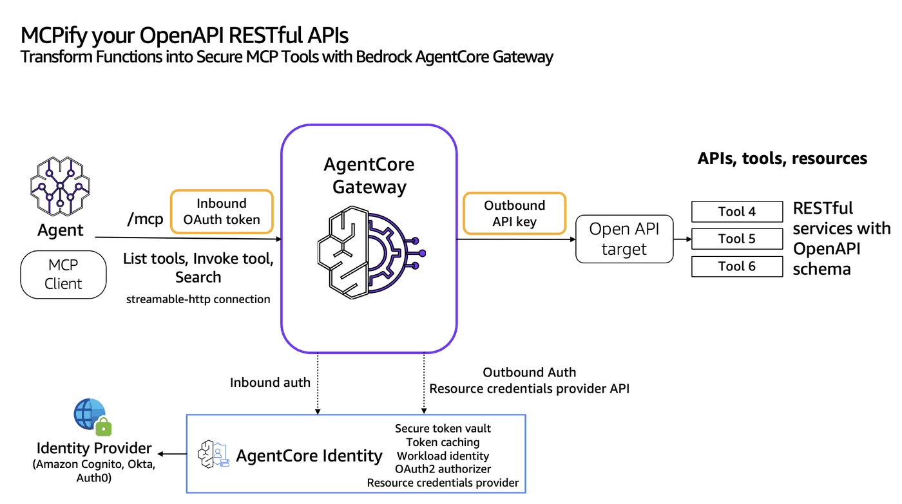

# Transform OpenAPI apis into MCP tools using Bedrock AgentCore Gateway

## Overview
Customers can bring OpenAPI spec in JSON or YAML and transform the apis into MCP tools using Bedrock AgentCore Gateway. We will demonstrate building a Mars Weather agent that calls NASA's Open APIs using API key. 

The Gateway workflow involves the following steps to connect your agents to external tools:
* **Create the tools for your Gateway** - Define your tools using schemas such as OpenAPI specifications for REST APIs. The OpenAPI specifications are then parsed by Amazon Bedrock AgentCore for creating the Gateway.
* **Create a Gateway endpoint** - Create the gateway that will serve as the MCP entry point with inbound authentication.
* **Add targets to your Gateway** - Configure the OpenAPI targets that define how the gateway routes requests to specific tools. All the APIs that part of OpenAPI file will become an MCP-compatible tool, and will be made available through your Gateway endpoint URL. Configure outbound authorization for each OpenAPI Gateway target. 
* **Update your agent code** - Connect your agent to the Gateway endpoint to access all configured tools through the unified MCP interface.



### Tutorial Details


| Information          | Details                                                   |
|:---------------------|:----------------------------------------------------------|
| Tutorial type        | Interactive                                               |
| AgentCore components | AgentCore Gateway, AgentCore Identity                     |
| Agentic Framework    | Strands Agents                                            |
| Gateway Target type  | OpenAPI                                                   |
| Agent                | Mars Weather agent                                        |
| Inbound Auth IdP     | Amazon Cognito                                            |
| Outbound Auth        | API Key                                                   |
| LLM model            | Anthropic Claude Haiku 4.5, Amazon Nova Pro              |
| Tutorial components  | Creating AgentCore Gateway and Invoking AgentCore Gateway |
| Tutorial vertical    | Cross-vertical                                            |
| Example complexity   | Easy                                                      |
| SDK used             | boto3                                                     |

In the first part of the tutorial we will create some AmazonCore Gateway targets

### Tutorial Architecture
In this tutorial we will transform operations defined in OpenAPI yaml/json file into MCP tools and host it in Bedrock AgentCore Gateway.
For demonstration purposes, we will build a Mars Weather agent that answers queries related to weather in Mars. The agent uses Open APIs of NASA. The solution uses Strands Agent using Amazon Bedrock models
In our example we will use a very simple agent with getInsightWeather tool for Mars weather.

## Prerequisites

To execute this tutorial you will need:
* Jupyter notebook (Python kernel)
* uv
* AWS credentials
* Amazon Cognito

```python
!pip install --force-reinstall -U -r requirements.txt --quiet
```

```python
# Set AWS credentials if not using Amazon SageMaker notebook
import os

# os.environ['AWS_ACCESS_KEY_ID'] = '' # Set the access key
# os.environ['AWS_SECRET_ACCESS_KEY'] = '' # Set the secret key
os.environ["AWS_DEFAULT_REGION"] = os.environ.get("AWS_REGION", "us-east-1")
```

```python
import os
import sys

# Get the directory of the current script
if "__file__" in globals():
    current_dir = os.path.dirname(os.path.abspath(__file__))
else:
    current_dir = os.getcwd()  # Fallback if __file__ is not defined (e.g., Jupyter)

# Navigate to the directory containing utils.py (one level up)
utils_dir = os.path.abspath(os.path.join(current_dir, "../.."))

# Add to sys.path
sys.path.insert(0, utils_dir)

# Now you can import utils
import utils
```

```python
#### Create an IAM role for the Gateway to assume

agentcore_gateway_iam_role = utils.create_agentcore_gateway_role("sample-lambdagateway")
print("Agentcore gateway role ARN: ", agentcore_gateway_iam_role["Role"]["Arn"])
```

# Create Amazon Cognito Pool for Inbound authorization to Gateway

```python
# Creating Cognito User Pool
import os
import boto3

REGION = os.environ["AWS_DEFAULT_REGION"]
USER_POOL_NAME = "sample-agentcore-gateway-pool"
RESOURCE_SERVER_ID = "sample-agentcore-gateway-id"
RESOURCE_SERVER_NAME = "sample-agentcore-gateway-name"
CLIENT_NAME = "sample-agentcore-gateway-client"
SCOPES = [
    {"ScopeName": "gateway:read", "ScopeDescription": "Read access"},
    {"ScopeName": "gateway:write", "ScopeDescription": "Write access"},
]
scopeString = f"{RESOURCE_SERVER_ID}/gateway:read {RESOURCE_SERVER_ID}/gateway:write"

cognito = boto3.client("cognito-idp", region_name=REGION)

print("Creating or retrieving Cognito resources...")
user_pool_id = utils.get_or_create_user_pool(cognito, USER_POOL_NAME)
print(f"User Pool ID: {user_pool_id}")

utils.get_or_create_resource_server(cognito, user_pool_id, RESOURCE_SERVER_ID, RESOURCE_SERVER_NAME, SCOPES)
print("Resource server ensured.")

client_id, client_secret = utils.get_or_create_m2m_client(cognito, user_pool_id, CLIENT_NAME, RESOURCE_SERVER_ID)
print(f"Client ID: {client_id}")

# Get discovery URL
cognito_discovery_url = f"https://cognito-idp.{REGION}.amazonaws.com/{user_pool_id}/.well-known/openid-configuration"
print(cognito_discovery_url)
```

# Create the Gateway

```python
# CreateGateway with Cognito authorizer without CMK. Use the Cognito user pool created in the previous step
import boto3

gateway_client = boto3.client("bedrock-agentcore-control", region_name=os.environ["AWS_DEFAULT_REGION"])
auth_config = {
    "customJWTAuthorizer": {
        "allowedClients": [
            client_id
        ],  # Client MUST match with the ClientId configured in Cognito. Example: 7rfbikfsm51j2fpaggacgng84g
        "discoveryUrl": cognito_discovery_url,
    }
}
create_response = gateway_client.create_gateway(
    name="DemoGWOpenAPIAPIKeyNasaOAI",
    roleArn=agentcore_gateway_iam_role["Role"][
        "Arn"
    ],  # The IAM Role must have permissions to create/list/get/delete Gateway
    protocolType="MCP",
    authorizerType="CUSTOM_JWT",
    authorizerConfiguration=auth_config,
    description="AgentCore Gateway with OpenAPI target",
)
print(create_response)
# Retrieve the GatewayID used for GatewayTarget creation
gatewayID = create_response["gatewayId"]
gatewayURL = create_response["gatewayUrl"]
print(gatewayID)
```

# Transforming NASA Open APIs into MCP tools using Bedrock AgentCore Gateway

We are going to have a Mars Weather agent getting weather data from Nasa's Open APIs. You will need to register for Nasa Insight API [here](https://api.nasa.gov/). It's free! Once you register, you will get an API Key in your email. Use the API key to configure the credentials provider for creating the OpenAPI target.

```python
import boto3
from pprint import pprint

acps = boto3.client(service_name="bedrock-agentcore-control")

response = acps.create_api_key_credential_provider(
    name="NasaInsightAPIKey",
    apiKey="",  # Get an API key by signing up at api.nasa.gov. Takes 2-min to get an API key in your email.
)

pprint(response)
credentialProviderARN = response["credentialProviderArn"]
pprint(f"Egress Credentials provider ARN, {credentialProviderARN}")
```

# Create an OpenAPI target

#### Upload the NASA Open API json file in S3

```python
# Create an S3 client
session = boto3.session.Session()
s3_client = session.client("s3")
sts_client = session.client("sts")

# Retrieve AWS account ID and region
account_id = sts_client.get_caller_identity()["Account"]
region = session.region_name
# Define parameters
# Your s3 bucket to upload the OpenAPI json file.
bucket_name = f"agentcore-gateway-{account_id}-{region}"
file_path = "openapi-specs/nasa_mars_insights_openapi.json"
object_key = "nasa_mars_insights_openapi.json"
# Upload the file using put_object and read response
try:
    if region == "us-east-1":
        s3bucket = s3_client.create_bucket(Bucket=bucket_name)
    else:
        s3bucket = s3_client.create_bucket(Bucket=bucket_name, CreateBucketConfiguration={"LocationConstraint": region})
    with open(file_path, "rb") as file_data:
        response = s3_client.put_object(Bucket=bucket_name, Key=object_key, Body=file_data)

    # Construct the ARN of the uploaded object with account ID and region
    openapi_s3_uri = f"s3://{bucket_name}/{object_key}"
    print(f"Uploaded object S3 URI: {openapi_s3_uri}")
except Exception as e:
    print(f"Error uploading file: {e}")
```

#### Configure outbound auth and Create the gateway target

```python
# S3 Uri for OpenAPI spec file
nasa_openapi_s3_target_config = {"mcp": {"openApiSchema": {"s3": {"uri": openapi_s3_uri}}}}

# API Key credentials provider configuration
api_key_credential_config = [
    {
        "credentialProviderType": "API_KEY",
        "credentialProvider": {
            "apiKeyCredentialProvider": {
                "credentialParameterName": "api_key",  # Replace this with the name of the api key name expected by the respective API provider. For passing token in the header, use "Authorization"
                "providerArn": credentialProviderARN,
                "credentialLocation": "QUERY_PARAMETER",  # Location of api key. Possible values are "HEADER" and "QUERY_PARAMETER".
                # "credentialPrefix": " " # Prefix for the token. Valid values are "Basic". Applies only for tokens.
            }
        },
    }
]

targetname = "DemoOpenAPITargetS3NasaMars"
response = gateway_client.create_gateway_target(
    gatewayIdentifier=gatewayID,
    name=targetname,
    description="OpenAPI Target with S3Uri using SDK",
    targetConfiguration=nasa_openapi_s3_target_config,
    credentialProviderConfigurations=api_key_credential_config,
)
```

# Calling Bedrock AgentCore Gateway from a Strands Agent

The Strands agent seamlessly integrates with AWS tools through the Bedrock AgentCore Gateway, which implements the Model Context Protocol (MCP) specification. This integration enables secure, standardized communication between AI agents and AWS services.

At its core, the Bedrock AgentCore Gateway serves as a protocol-compliant Gateway that exposes fundamental MCP APIs: ListTools and InvokeTools. These APIs allow any MCP-compliant client or SDK to discover and interact with available tools in a secure, standardized way. When the Strands agent needs to access AWS services, it communicates with the Gateway using these MCP-standardized endpoints.

The Gateway's implementation adheres strictly to the (MCP Authorization specification)[https://modelcontextprotocol.org/specification/draft/basic/authorization], ensuring robust security and access control. This means that every tool invocation by the Strands agent goes through authorization step, maintaining security while enabling powerful functionality.

For example, when the Strands agent needs to access MCP tools, it first calls ListTools to discover available tools, then uses InvokeTools to execute specific actions. The Gateway handles all the necessary security validations, protocol translations, and service interactions, making the entire process seamless and secure.

This architectural approach means that any client or SDK that implements the MCP specification can interact with AWS services through the Gateway, making it a versatile and future-proof solution for AI agent integrations.

# Request the access token from Amazon Cognito for inbound authorization

```python
print(
    "Requesting the access token from Amazon Cognito authorizer...May fail for some time till the domain name propogation completes"
)
token_response = utils.get_token(user_pool_id, client_id, client_secret, scopeString, REGION)
token = token_response["access_token"]
print("Token response:", token)
```

# Ask Mars weather agent by calling NASA Open APIs using Bedrock AgentCore Gateway

```python
from strands.models import BedrockModel
from mcp.client.streamable_http import streamablehttp_client
from strands.tools.mcp.mcp_client import MCPClient
from strands import Agent


def create_streamable_http_transport():
    return streamablehttp_client(gatewayURL, headers={"Authorization": f"Bearer {token}"})


client = MCPClient(create_streamable_http_transport)

## The IAM group/user/ configured in ~/.aws/credentials should have access to Bedrock model
yourmodel = BedrockModel(
    model_id="us.amazon.nova-pro-v1:0",
    temperature=0.7,
)
```

```python
import logging


# Configure the root strands logger. Change it to DEBUG if you are debugging the issue.
logging.getLogger("strands").setLevel(logging.INFO)

# Add a handler to see the logs
logging.basicConfig(format="%(levelname)s | %(name)s | %(message)s", handlers=[logging.StreamHandler()])

with client:
    # Call the listTools
    tools = client.list_tools_sync()
    # Create an Agent with the model and tools
    agent = Agent(model=yourmodel, tools=tools)  ## you can replace with any model you like
    print(f"Tools loaded in the agent are {agent.tool_names}")
    # print(f"Tools configuration in the agent are {agent.tool_config}")
    # Invoke the agent with the sample prompt. This will only invoke  MCP listTools and retrieve the list of tools the LLM has access to. The below does not actually call any tool.
    agent("Hi , can you list all tools available to you")
    agent("What is the weather in northern part of the mars")
    # Invoke the agent with sample prompt, invoke the tool and display the response
    # Call the MCP tool explicitly. The MCP Tool name and arguments must match with your AWS Lambda function or the OpenAPI/Smithy API
    result = client.call_tool_sync(
        tool_use_id="get-insight-weather-1",  # You can replace this with unique identifier.
        name=targetname
        + "___getInsightWeather",  # This is the tool name based on AWS Lambda target types. This will change based on the target name
        arguments={"ver": "1.0", "feedtype": "json"},
    )
    # Print the MCP Tool response
    print(f"Tool Call result: {result['content'][0]['text']}")
```

**Issue: if you get below error while executing below cell, it indicates incompatibily between pydantic and pydantic-core versions.**

```
TypeError: model_schema() got an unexpected keyword argument 'generic_origin'
```
**How to resolve?**

You will need to make sure you have pydantic==2.7.2 and pydantic-core 2.27.2 that are both compatible. Restart the kernel once done.

# Clean up
Additional resources are also created like IAM role, IAM Policies, Credentials provider, AWS Lambda functions, Cognito user pools, s3 buckets that you might need to manually delete as part of the clean up. This depends on the example you run.

## Delete the gateway (Optional)

```python
import utils

utils.delete_gateway(gateway_client, gatewayID)
```
