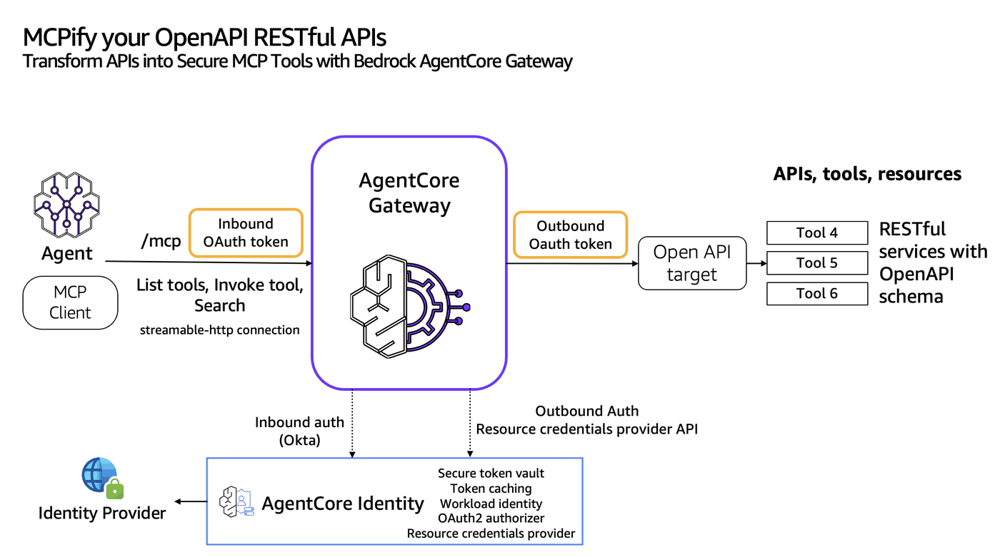

# Transform OpenAPI apis into MCP tools using Bedrock AgentCore Gateway

## Overview
Bedrock AgentCore Gateway provides customers a way to turn their existing APIs into fully-managed MCP servers without needing to manage infra or hosting. Customers can bring OpenAPI spec in JSON or YAML. We will demonstrate a customer service agent using enterprise support apis secured by OAuth2.

The Gateway workflow involves the following steps to connect your agents to external tools:
* **Create the tools for your Gateway** - Define your tools using schemas such as OpenAPI specifications for REST APIs. The OpenAPI specifications are then parsed by Amazon Bedrock AgentCore for creating the Gateway.
* **Create a Gateway endpoint** - Create the gateway that will serve as the MCP entry point with inbound authentication.
* **Add targets to your Gateway** - Configure the OpenAPI targets that define how the gateway routes requests to specific tools. All the APIs that part of OpenAPI file will become an MCP-compatible tool, and will be made available through your Gateway endpoint URL. Configure outbound authorization using Oauth for each OpenAPI Gateway target. 
* **Update your agent code** - Connect your agent to the Gateway endpoint to access all configured tools through the unified MCP interface.



### Tutorial Details


| Information          | Details                                                   |
|:---------------------|:----------------------------------------------------------|
| Tutorial type        | Interactive                                               |
| AgentCore components | AgentCore Gateway, AgentCore Identity                     |
| Agentic Framework    | Strands Agent                                             |
| Gateway Target type  | OpenAPI                                                   |
| Agent                | Customer support agent                                    |
| Inbound Auth IdP     | Okta                                                      |
| Outbound Auth        | OAuth                                                     |
| LLM model            | Anthropic Claude Haiku 4.5, Amazon Nova Pro              |
| Tutorial components  | Creating AgentCore Gateway and Invoking AgentCore Gateway |
| Tutorial vertical    | Cross-vertical                                            |
| Example complexity   | Easy                                                      |
| SDK used             | boto3                                                     |

In the first part of the tutorial we will create some AmazonCore Gateway targets

### Tutorial Architecture
In this tutorial we will transform operations defined in OpenAPI yaml/json file into MCP tools and host it in Bedrock AgentCore Gateway.
For demonstration purposes, we will build a Customer support agent that answers queries related to support tickets. The agent uses OpenAPIs of Zendesk support apis. The solution uses Langchain Agent using Amazon Bedrock models

## Prerequisites

To execute this tutorial you will need:
* Jupyter notebook with Python 3.10+
* uv
* AWS credentials
* Okta
    - client_id
    - client_secret
    - Your Okta domain (e.g., dev-123456.okta.com)
    - An OAuth2 authorization server ID (often default)
* Zendesk integrated with Okta

```python
!pip install --force-reinstall -U -r requirements.txt --quiet
```

```python
# Set AWS credentials if not using SageMaker notebooks
import os

# os.environ['AWS_ACCESS_KEY_ID'] = '' # Set the access key
# os.environ['AWS_SECRET_ACCESS_KEY'] = '' # Set the secret key
os.environ["AWS_DEFAULT_REGION"] = os.environ.get("AWS_REGION", "us-east-1")
```

```python
import os
import sys

# Get the directory of the current script
if "__file__" in globals():
    current_dir = os.path.dirname(os.path.abspath(__file__))
else:
    current_dir = os.getcwd()  # Fallback if __file__ is not defined (e.g., Jupyter)

# Navigate to the directory containing utils.py (one level up)
utils_dir = os.path.abspath(os.path.join(current_dir, "../.."))

# Add to sys.path
sys.path.insert(0, utils_dir)

# Now you can import utils
import utils
```

```python
#### Create an IAM role for the Gateway to assume

agentcore_gateway_iam_role = utils.create_agentcore_gateway_role("sample-lambdagateway")
print("Agentcore gateway role ARN: ", agentcore_gateway_iam_role["Role"]["Arn"])
```

# Configuring Okta for Inbound authorization to Gateway

Follow these steps for to create an OAuth authorizer in Okta. 

* If you do not have an Okta subscription, please sign up for a free trial [here](https://www.okta.com/free-trial/).
* Sign in to the Okta Admin console 
* Follow the instructions [here](https://developer.okta.com/docs/guides/implement-grant-type/clientcreds/main/) to create an Application with the **Client Credentials** grant type. 
* After creating the application, go to the Applications page and select the application you just created. Save the **Client ID** and **Client Secret** in a text editor.
* Disable **Require Demonstrating Proof of Possession (DPoP)** under General Settings. 
* Open the left navigation bar and select Security -> API. Select the Default Authorization Server that was created for you.
* Save the **Audience** value to a text editor. 
* Save the **Issuer** value (It should look similar to `https://trial-xxxxx.okta.com/oauth2/default`) to a text editor.
* Define a Custom Scope. Go to the Scopes tab, Click “Add Scope”. Add a scope called InvokeGateway. 
* Select **Access Policies**. Create a new Access Policy. Give it a name and Assign to All Clients. After the policy has been created, select **Add Rule**, leave all values as default, then select **Create Rule**.

# Create the Gateway with Okta authorizer for inbound authorization

```python
import boto3
from pprint import pprint

gateway_client = boto3.client("bedrock-agentcore-control", region_name=os.environ["AWS_DEFAULT_REGION"])

OKTA_DISCOVERY_URL = "<Your Okta Issuer value>/.well-known/openid-configuration"
OKTA_AUDIENCE = "<The audience value you saved earlier>"

auth_config = {
    "customJWTAuthorizer": {
        "allowedAudience": [OKTA_AUDIENCE],
        "discoveryUrl": OKTA_DISCOVERY_URL,
    }
}
create_response = gateway_client.create_gateway(
    name="OpenAPIOktaGwy2",
    roleArn=agentcore_gateway_iam_role["Role"][
        "Arn"
    ],  # The IAM Role must have permissions to create/list/get/delete Gateway
    protocolType="MCP",
    authorizerType="CUSTOM_JWT",
    authorizerConfiguration=auth_config,
    description="AgentCore Gateway created from sdk with Okta Authorizer",
)
pprint(create_response)
# Retrieve the GatewayID used for GatewayTarget creation
gatewayID = create_response["gatewayId"]
gatewayURL = create_response["gatewayUrl"]
```

# Transforming Zendesk support APIs into MCP tools using Bedrock AgentCore Gateway

### Create outbound auth credentials provider

```python
from botocore.config import Config

ZENDESK_DOMAIN = "<Zendek domain url>"
ZENDESK_AUTH_ENDPOINT = "https://<Zendeskl-domain>/oauth/authorizations/new"
ZENDESK_TOKEN_ENDPOINT = "https://<Zendesk-domain>/oauth/tokens"
ZENDESK_CLIENT_ID = ""  # Your Zendesk OAuth client -  client id
ZENDESK_SECRET = ""  # Your Zendesk OAuth client -  client id

sdk_config = Config(
    region_name=os.environ["AWS_DEFAULT_REGION"],
    retries={"max_attempts": 2, "mode": "standard"},
)

acps = boto3.client(
    service_name="bedrock-agentcore-control",
    config=sdk_config,
)

provider_config = {
    "customOauth2ProviderConfig": {
        "oauthDiscovery": {
            "authorizationServerMetadata": {
                "issuer": ZENDESK_DOMAIN,
                "authorizationEndpoint": ZENDESK_AUTH_ENDPOINT,
                "tokenEndpoint": ZENDESK_TOKEN_ENDPOINT,
                "responseTypes": ["token"],
            }
        },
        "clientId": ZENDESK_CLIENT_ID,
        "clientSecret": ZENDESK_SECRET,
    }
}

response = acps.create_oauth2_credential_provider(
    name="ZendeskOAuthTokenCfg",
    credentialProviderVendor="CustomOauth2",
    oauth2ProviderConfigInput=provider_config,
)

pprint(response)
credentialProviderARN = response["credentialProviderArn"]
pprint(f"Egress Credentials provider ARN, {credentialProviderARN}")
```

### Create an OpenAPI target

#### Upload the Zendesk support OpenAPI yaml file in S3

```python
# Create an S3 client
session = boto3.session.Session()
s3_client = session.client("s3")
sts_client = session.client("sts")

# Retrieve AWS account ID and region
account_id = sts_client.get_caller_identity()["Account"]
region = session.region_name
# Define parameters
bucket_name = ""  # Your s3 bucket to upload the OpenAPI json file.
file_path = "openapi-specs/Zendesk-support-apis.yaml"
object_key = "Zendesk-support-apis.yaml"
# Upload the file using put_object and read response
try:
    with open(file_path, "rb") as file_data:
        response = s3_client.put_object(Bucket=bucket_name, Key=object_key, Body=file_data)

    # Construct the ARN of the uploaded object with account ID and region
    openapi_s3_uri = f"s3://{bucket_name}/{object_key}"
    print(f"Uploaded object S3 URI: {openapi_s3_uri}")
except Exception as e:
    print(f"Error uploading file: {e}")
```

#### Create the gateway target

Make sure server URL in the OpenAPI file is pointing to your own endpoint URL. Gateway reads the server URL from the OpenAPI file and calls the endpoint. Before uploading it to s3, please make sure you do this change.

```python
# S3 Uri for OpenAPI spec file
openapi_s3_target_config = {"mcp": {"openApiSchema": {"s3": {"uri": openapi_s3_uri}}}}

credential_config = [
    {
        "credentialProviderType": "OAUTH",
        "credentialProvider": {
            "oauthCredentialProvider": {
                "providerArn": credentialProviderARN,
                "scopes": ["tickets:read", "read", "tickets:write", "write"],
            }
        },
    }
]

target_name = "DemoOpenAPIGW"
response = gateway_client.create_gateway_target(
    gatewayIdentifier=gatewayID,
    name=target_name,
    description="OpenAPI Target with S3Uri using SDK",
    targetConfiguration=openapi_s3_target_config,
    credentialProviderConfigurations=credential_config,
)

# Printing the request ID and timestamp for you to report the defects. Please include them while reporting issues/defects
response_metadata = response["ResponseMetadata"]
```

# Calling Bedrock AgentCore Gateway from a Strands Agent

The Strands agent seamlessly integrates with AWS tools through the Bedrock AgentCore Gateway, which implements the Model Context Protocol (MCP) specification. This integration enables secure, standardized communication between AI agents and AWS services.

At its core, the Bedrock AgentCore Gateway serves as a protocol-compliant Gateway that exposes fundamental MCP APIs: ListTools and InvokeTools. These APIs allow any MCP-compliant client or SDK to discover and interact with available tools in a secure, standardized way. When the Strands agent needs to access AWS services, it communicates with the Gateway using these MCP-standardized endpoints.

The Gateway's implementation adheres strictly to the (MCP Authorization specification)[https://modelcontextprotocol.org/specification/draft/basic/authorization], ensuring robust security and access control. This means that every tool invocation by the Strands agent goes through authorization step, maintaining security while enabling powerful functionality.

For example, when the Strands agent needs to access MCP tools, it first calls ListTools to discover available tools, then uses InvokeTools to execute specific actions. The Gateway handles all the necessary security validations, protocol translations, and service interactions, making the entire process seamless and secure.

This architectural approach means that any client or SDK that implements the MCP specification can interact with AWS services through the Gateway, making it a versatile and future-proof solution for AI agent integrations.

# Request the access token from Okta for inbound authorization

```python
print("Requesting the access token from Okta authorizer")
import requests
from requests.auth import HTTPBasicAuth

# Replace with your actual values
OKTA_DOMAIN = "Your Okta domain URL"
AUTH_SERVER_ID = "Okta app id"
CLIENT_ID = "<Okta client credentials client id>"
CLIENT_SECRET = "<Okta client credentials secret>"

TOKEN_URL = f"{OKTA_DOMAIN}/oauth2/{AUTH_SERVER_ID}/v1/token"

response = requests.post(
    TOKEN_URL,
    auth=HTTPBasicAuth(CLIENT_ID, CLIENT_SECRET),
    headers={"Content-Type": "application/x-www-form-urlencoded"},
    data={"grant_type": "client_credentials", "scope": "InvokeGateway"},
)

if response.status_code == 200:
    token = response.json()["access_token"]
    print("Access Token:", token)
else:
    print("Failed to get token:", response.status_code, response.text)
```

# Ask customer support agent with Zendesk support APIs using Bedrock AgentCore Gateway

```python
from strands.models import BedrockModel
from mcp.client.streamable_http import streamablehttp_client
from strands.tools.mcp.mcp_client import MCPClient
from strands import Agent


def create_streamable_http_transport():
    return streamablehttp_client(gatewayURL, headers={"Authorization": f"Bearer {token}"})


client = MCPClient(create_streamable_http_transport)

## The IAM group/user/ configured in ~/.aws/credentials should have access to Bedrock model
yourmodel = BedrockModel(
    model_id="us.amazon.nova-pro-v1:0",
    temperature=0.7,
)
```

```python
import logging


# Configure the root strands logger. Change it to DEBUG if you are debugging the issue.
logging.getLogger("strands").setLevel(logging.INFO)

# Add a handler to see the logs
logging.basicConfig(format="%(levelname)s | %(name)s | %(message)s", handlers=[logging.StreamHandler()])

with client:
    # Call the listTools
    tools = client.list_tools_sync()
    # Create an Agent with the model and tools
    agent = Agent(model=yourmodel, tools=tools)  ## you can replace with any model you like
    # print(f"Tools loaded in the agent are {agent.tool_names}")
    # print(f"Tools configuration in the agent are {agent.tool_config}")

    # Invoke the agent with the sample prompt. This will only invoke  MCP listTools and retrieve the list of tools the LLM has access to. The below does not actually call any tool.
    # agent("Hi , can you list all tools available to you")
    agent("Count the number of support tickets")
    # Call the MCP tool explicitly. The MCP Tool name and arguments must match with your AWS Lambda function or the OpenAPI/Smithy API
    result = client.call_tool_sync(
        tool_use_id="count-tickets-1",  # You can replace this with unique identifier.
        name="DemoOpenAPIGW___CountTickets",  # This is the tool name based on AWS Lambda target types. This will change based on the target name
    )
    # Print the MCP Tool response
    print(f"Tool Call result: {result['content'][0]['text']}")
```

# Clean up
Additional resources are also created like IAM role, IAM Policies, Credentials provider, AWS Lambda functions, Cognito user pools, s3 buckets that you might need to manually delete as part of the clean up. This depends on the example you run.

## Delete the gateway (Optional)

```python
import utils

utils.delete_gateway(gateway_client, gatewayID)
```
