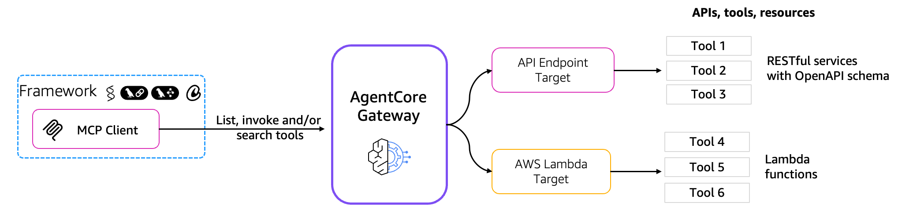
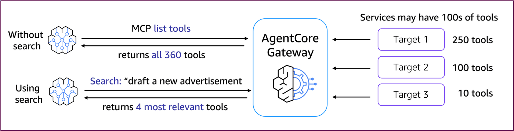
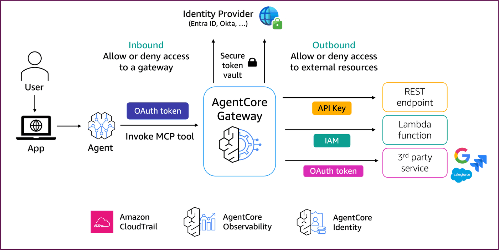
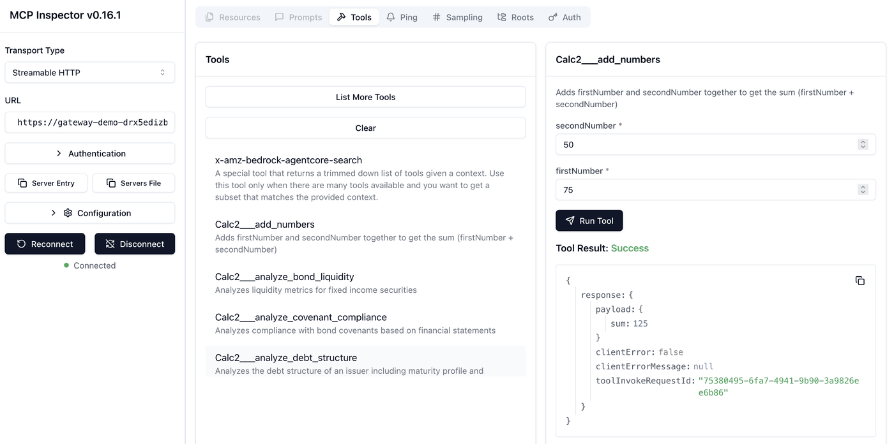

# Amazon Bedrock AgentCore Gateway - Semantic search tutorial

### Tutorial Details


| Information         | Details                                                                          |
|:--------------------|:---------------------------------------------------------------------------------|
| Tutorial type       | Conversational                                                                   |
| Agent type          | Single                                                                           |
| AgentCore services  | AgentCore Gateway, AgentCore Identity                                            |
| Agentic Framework   | Strands Agents                                                                   |
| LLM model           | Anthropic Claude Haiku 4.5                                                        |
| Tutorial components | Creating and using Lambda-backed AgentCore Gateway from Strands Agent            |
| Tutorial vertical   | Cross-vertical                                                                   |
| Example complexity  | Easy                                                                             |
| SDK used            | Amazon BedrockAgentCore Python SDK and boto3

### Tutorial Architecture
Amazon Bedrock AgentCore Gateway provides unified connectivity between agents and the tools and resources they need to interact with. Gateway plays multiple roles in this connectivity layer:

1. **Security Guard**: Gateway manages OAuth authorization to ensure only valid users / agents access tools / resources.
2. **Translator**: Gateway translates agent requests made using popular protocols like the Model Context Protocol (MCP) into API requests and Lambda invocations. This means developers don’t need to host servers, manage protocol integration, version support, version patching, etc.
3. **Composer**: Gateway enables developers to seamlessly combine multiple APIs, functions, and tools into a single MCP  endpoint that an agent can use.
4. **Keychain**: Gateway handles the injection of the right credentials to use with the right tool, ensuring that agents can seamlessly leverage tools that require different sets of credentials. 
5. **Researcher**: Gateway enables agents to search across all of their tools to find only the ones that are best for a given context or question. This allows agents to make use of 1000s of tools instead of just a handful. It also minimizes the set of tools that need to be provided in an agent’s LLM prompt, reducing latency and cost. 
6. **Infrastructure Manager**: Gateway is completely serverless, and comes with built-in observability and auditing, alleviating the need for developers to manage additional infrastructure to integrate their agents and tools. 



### Tutorial Key Features

* Creating Amazon Bedrock AgentCore Gateways with AWS Lambda-backed targets
* Using AgentCore Gateway semantic search 
* Using Strands Agents to show how AgentCore Gateway search improves latency

## Prerequisites

To execute this tutorial you will need:
* Python 3.10+
* AWS credentials
* Amazon Bedrock AgentCore SDK
* Strands Agents

## AgentCore Gateway helps solve the challenge of MCP servers that have large numbers of tools
In a typical enterprise setting, agent builders encounter MCP servers that have hundreds or even thousands
of MCP tools. This volume of tools poses challenges for AI agents, including poor tool selection accuracy, 
increased cost, and higher latency driven by higher token usage from excessive tool metadata.
This can happen when connecting your agents to third party services (e.g., Zendesk, Salesforce,
Slack, JIRA, ...), or to existing enterprise REST services. 
AgentCore Gateway provides a built in semantic search across tools, 
which improves agent latency, cost, and accuracy, while still giving those agents the tools they need. 
Depending on your use case, LLM model, and agent framework, you can see up to 3x better latency by keeping
an agent focused on relevant tools versus providing the full set of hundreds of tools from a typical MCP Server.



## What you will learn in this notebook
In this notebook, we provide a tutorial for AgentCore Gateway search. By the end of this step-by-step tutorial, you
will understand:

- How to use AgentCore Gateway's built-in search tool to quickly find relevant tools 
- How to integrate tool search results into Strands Agents for improved latency and reduced cost

## Overview of the notebook structure
The notebook is structured with the following sections:

1. Understanding fundamentals of AgentCore Gateway Search
2. Preparing the notebook environment
3. Setting up a Gateway that has hundreds of tools
4. Searching for tools from a Gateway
5. Using Strands Agents with an MCP server that has many tools
6. Adding tool search results to a Strands Agent
7. Showing 3x latency improvement by using tool search

# Understanding fundamentals of AgentCore Gateway Search

When you create an AgentCore Gateway, you have the option to indicate that you want Search enabled.
For Gateways with search enabled, three things happen:

1. **Vector store is created**. The Gateway service automatically creates a serverless fully-managed vector store for your new Gateway. This enables a full semantic search across your Gateway tools. 
3. **Vector store is populated**. As you add Gateway Targets to your Gateway, the service automatically uses embeddings behind the scenes to populate the vector store based on the tools from the new Target. The tool metadata comes from the JSON defintions of your tools or the OpenAPI Schema specification for your REST services targets.
2. **Search tool (MCP based) is provided**. In addition to all of your user defined tools (from AWS Lambda targets or REST services), the Gateway gets one additional MCP tool that provides semantic search. It is named `x-amz-bedrock-agentcore-search`. The prefix ensures there are no name clashes with your user-defined tools. We may add more tools like that in the future as well. The search tool has a single argument called `query`. When the search tool is invoked, the Gateway service performs a semantic search using that query, matching it against available tool metadata (names, descriptions, input and output schema), and returns the most relevant tools in descending order of relevance.

# Preparing the notebook environment

```python
!pip install --force-reinstall -U -r requirements.txt --quiet
```

Import all the required Python libraries, and load environment variables

```python
from strands import Agent
from strands.models import BedrockModel
from strands.handlers import null_callback_handler

from strands.tools.mcp.mcp_client import MCPClient, MCPAgentTool

from mcp.client.streamable_http import streamablehttp_client
from mcp.types import Tool as MCPTool

import logging
import time
import json
import boto3
import requests
import utils

GATEWAY_NAME = "gateway-search-tutorial"
```

Set up a logger

```python
# Configure the root strands logger
logging.getLogger("strands").setLevel(logging.ERROR)  # INFO) #DEBUG) #

# Add a handler to see the logs
logging.basicConfig(format="%(levelname)s | %(name)s | %(message)s", handlers=[logging.StreamHandler()])
```

Check our boto3 version

```python
boto3.__version__
```

Get our boto3 client for the AgentCore control plane API.

```python
session = boto3.Session()
agentcore_client = session.client(
    "bedrock-agentcore-control",
)
```

# Setting up a Gateway that has hundreds of tools

AgentCore Gateway provides a secure and scalable way to expose a curated set of existing APIs
as MCP tools for your agents. In a production setting, your Gateway resources would be created
using infrastructure as code with tools like CloudFormation, CDK, or Terraform. In this tutorial,
we use the boto3 control plane APIs directly, so that you can understand the resources and APIs more effectively.
This will help you more easily get started building and using your own gateways, and making more powerful
and secure agents.

At a high level, the steps for setting up your Gateway are:

1. Define what identity providers and credential providers you are using for inbound (agents calling Gateways) and outbound (Gateways calling tools) security.
2. Create the Gateway using `create_gateway`.
3. Add Gateway Targets using `create_gateway_target`, to expose MCP tools that will be implemented in AWS Lambda or in existing RESTful services.

In this tutorial, we will use Amazon Cognito as the identity provider (IdP), AWS Lambda functions as targets, and AWS IAM for outbound authentication. The same concepts demonstrated in this tutorial still apply when using other IdP's or other target types.

### Creating Amazon Cognito resources

In this tutorial, we assume you have already created the following resources and have set up corresponding environment variables:

- IAM role for AWS Lambda execution (`gateway_lambda_iam_role`)
- AWS Lambda function for your simple math tools (`calc_lambda_arn`)
- AWS Lambda function for your restaurant reservation tool (`restaurant_lambda_arn`)
- Amazon Cognito user pools, giving you a client id (`cognito_client_id`) and a discovery URL (`cognito_discovery_url`)

Lets take a look at the JSON tool metadata for the restaurant API. Note that if we were integrating with existing REST services, the API specs would be provided using OpenAPI Schema instead.

```python
with open("./restaurant/restaurant-api.json") as f:
    data = json.load(f)
print(json.dumps(data, indent=4))
```

Here are the simple calculator APIs.

```python
with open("./calc/calc-api.json") as f:
    data = json.load(f)[0:3]
print(json.dumps(data, indent=4))
```

Here is the AWS Lambda function implementation for the calculator tools.

```python
from IPython.display import display, Code

with open("./calc/lambda_function_code.py", "r") as f:
    code_content = f.read()
display(Code(code_content, language="python"))
```

```python
with open("./restaurant/lambda_function_code.py", "r") as f:
    code_content = f.read()
display(Code(code_content, language="python"))
```

```python
#### Create a sample AWS Lambda function that you want to convert into MCP tools
calc_lambda_resp = utils.create_gateway_lambda(
    "calc/lambda_function_code.zip", lambda_function_name="calc_lambda_gateway"
)

if calc_lambda_resp is not None:
    if calc_lambda_resp["exit_code"] == 0:
        print(
            "Lambda function created with ARN: ",
            calc_lambda_resp["lambda_function_arn"],
        )
    else:
        print(
            "Lambda function creation failed with message: ",
            calc_lambda_resp["lambda_function_arn"],
        )
```

```python
calc_lambda_resp["lambda_function_arn"]
```

```python
#### Create a sample AWS Lambda function that you want to convert into MCP tools
restaurant_lambda_resp = utils.create_gateway_lambda(
    "restaurant/lambda_function_code.zip",
    lambda_function_name="restaurant_lambda_gateway",
)

if restaurant_lambda_resp is not None:
    if restaurant_lambda_resp["exit_code"] == 0:
        print(
            "Lambda function created with ARN: ",
            restaurant_lambda_resp["lambda_function_arn"],
        )
    else:
        print(
            "Lambda function creation failed with message: ",
            restaurant_lambda_resp["lambda_function_arn"],
        )
```

```python
restaurant_lambda_resp["lambda_function_arn"]
```

```python
cognito_response = utils.setup_cognito_user_pool()
```

```python
bearer_token = utils.get_bearer_token(
    client_id=cognito_response["client_id"],
    username="testuser",
    password="MyPassword123!",
)
```

```python
gateway_role_arn = utils.create_gateway_iam_role(
    lambda_arns=[
        calc_lambda_resp["lambda_function_arn"],
        restaurant_lambda_resp["lambda_function_arn"],
    ]
)
```

#### Let's create a few helper functions for using the control plane APIs

```python
def read_apispec(json_file_path):
    try:
        # read json file and return contents as string
        with open(json_file_path, "r") as file:
            # Parse JSON to Python object
            api_spec = json.load(file)
            return api_spec

    except FileNotFoundError:
        return f"Error: File {json_file_path} not found"
    except Exception as e:
        return f"An unexpected error occurred: {str(e)}"


def list_gateways():
    response = agentcore_client.list_gateways()
    print(json.dumps(response, indent=2, default=str))
    return response
```

#### Create Gateway helper function
Here is a helper function for creating an AgentCore Gateway given a name and
description. It uses Amazon Cognito as its IdP, and pulls the allowed client ID
and the discovery URL from environment variables, as those were already defined.
It also defaults to enabling semantic search on the resulting Gateway, and uses
a predefined IAM role.

```python
def create_gateway(gateway_name, gateway_desc):
    # Use Cognito for Inbound OAuth to our Gateway
    auth_config = {
        "customJWTAuthorizer": {
            "allowedClients": [cognito_response["client_id"]],
            "discoveryUrl": cognito_response["discovery_url"],
        }
    }
    # Enable semantic search of tools
    search_config = {"mcp": {"searchType": "SEMANTIC", "supportedVersions": ["2025-03-26"]}}
    # Create the gateway
    response = agentcore_client.create_gateway(
        name=gateway_name,
        roleArn=gateway_role_arn,
        authorizerType="CUSTOM_JWT",
        description=gateway_desc,
        protocolType="MCP",
        authorizerConfiguration=auth_config,
        protocolConfiguration=search_config,
    )
    # print(json.dumps(response, indent=2, default=str))
    return response["gatewayId"]
```

#### Create Gateway Target helper function
This function creates a new AWS Lambda target on an existing Gateway.
Simply provide the gateway ID, the name and description of the new target,
the ARN of the existing AWS Lambda function, and the JSON schema describing
the interfaces to the tools you want to expose from the gateway.

```python
def create_gatewaytarget(gateway_id, target_name, target_descr, lambda_arn, api_spec):
    # Add a Lambda target to the gateway
    response = agentcore_client.create_gateway_target(
        gatewayIdentifier=gateway_id,
        name=target_name,
        description=target_descr,
        targetConfiguration={
            "mcp": {
                "lambda": {
                    "lambdaArn": lambda_arn,
                    "toolSchema": {"inlinePayload": api_spec},
                }
            }
        },
        # Use IAM as credential provider
        credentialProviderConfigurations=[{"credentialProviderType": "GATEWAY_IAM_ROLE"}],
    )
    return response["targetId"]
```

### Creating your first AgentCore Gateway
Before we setup your first Gateway, let's take a quick look at how 
Gateway provides security, both for inbound requests to use MCP tools,
and outbound access from the Gateway to tools and resources.



Now let's create the gateway for this tutorial, providing a name and a description.

```python
print(f"Create gateway with name: {GATEWAY_NAME}")
gatewayId = create_gateway(gateway_name=GATEWAY_NAME, gateway_desc="AgentCore Gateway Tutorial")
print(f"Gateway created with id: {gatewayId}.")
```

### Adding AgentCore Gateway Targets
In this tutorial, we assume you already have installed a pair of Lambda functions, one for doing simple
math calculations, and another that simulates creating a restaurant reservation. We'll add a Gateway Target
for each of these functions.

Once we've added those targets, we'll add additional targets to simply drive higher MCP tool counts that
help us demonstrate the power of AgentCore Gateway search.

Now that the gateway is created, let's add a target for making restaurant reservations
via a Lambda function.

```python
restaurant_api_spec = read_apispec("./restaurant/restaurant-api.json")
restaurant_lambda_arn = restaurant_lambda_resp["lambda_function_arn"]
print(f"Restaurant Lambda ARN: {restaurant_lambda_arn}")

restaurantTargetId = create_gatewaytarget(
    gateway_id=gatewayId,
    lambda_arn=restaurant_lambda_arn,
    target_name="FoodTools",
    target_descr="Restaurant Tools",
    api_spec=restaurant_api_spec,
)
print(f"RestaurantTarget created with id: {restaurantTargetId} on gateway: {gatewayId}")
```

Here we'll add a second target, this time with a Lambda that implements 4 basic tools (add, subtract,
multiply, divide), and a set of 75 generated tool definitions for investment management (trading, credit research, quantitative analysis, portfolio management). The investment management tool definitions are not 
actually implemented in the Lambda function. We are only adding them to demonstrate a large volume of tools.

```python
calc_api_spec = read_apispec("./calc/calc-api.json")
print(f"API spec for calc has {len(calc_api_spec)} functions\n")
calc_lambda_arn = calc_lambda_resp["lambda_function_arn"]
print(f"Calc Lambda ARN: {calc_lambda_arn}")

time.sleep(5)
calcTargetId = create_gatewaytarget(
    gateway_id=gatewayId,
    lambda_arn=calc_lambda_arn,
    target_name="CalcTools",
    target_descr="Calculation Tools",
    api_spec=calc_api_spec,
)
print(f"CalcTools Target created with id: {calcTargetId} on gateway: {gatewayId}")
```

To demonstrate the power of gateway search, now we add a few more copies of the Calculator target, 
so that we end up with 300+ MCP tools exposed.

```python
def add_more_tools(gatewayId):
    time.sleep(10)
    calcTargetId = create_gatewaytarget(
        gateway_id=gatewayId,
        lambda_arn=calc_lambda_arn,
        target_name="Calc2",
        target_descr="Calculation 2 Tools",
        api_spec=calc_api_spec,
    )
    print(f"Calc2 Target created with id: {calcTargetId} on gateway: {gatewayId}")
    time.sleep(10)
    calcTargetId = create_gatewaytarget(
        gateway_id=gatewayId,
        lambda_arn=calc_lambda_arn,
        target_name="Calc3",
        target_descr="Calculation 3 Tools",
        api_spec=calc_api_spec,
    )
    print(f"Calc3 Target created with id: {calcTargetId} on gateway: {gatewayId}")
    time.sleep(10)
    calcTargetId = create_gatewaytarget(
        gateway_id=gatewayId,
        lambda_arn=calc_lambda_arn,
        target_name="Calc4",
        target_descr="Calculation 4 Tools",
        api_spec=calc_api_spec,
    )
    print(f"Calc4 Target created with id: {calcTargetId} on gateway: {gatewayId}")
```

```python
add_more_tools(gatewayId=gatewayId)
```

```python
resp = agentcore_client.list_gateway_targets(gatewayIdentifier=gatewayId)
targets = resp["items"]
for target in resp["items"]:
    print(f"{target['name']} - {target['description']}")
```

# Searching for tools from a Gateway

### Getting familiar with MCP list tools before we search

Let's define some utility functions to retrieve our MCP endpoint URL for a given Gateway ID, and to 
retrieve our JWT OAuth access token to securely use our Gateway.

```python
def get_gateway_endpoint(gateway_id):
    response = agentcore_client.get_gateway(gatewayIdentifier=gateway_id)
    gateway_url = response["gatewayUrl"]
    return gateway_url
```

Now that our Gateway is created and has targets, let's grab the MCP URL to that
Gateway. We can retrieve the endpoint URL from the Gateway control plane based on the Gateway ID.

#### Using MCP Inspector against your Gateway

Now that we have an endpoint URL for the MCP server, and we have a JWT bearer token, you may want to explore
the MCP server with the MCP Inspector tool. MCP Inspector is an open source tool that can connect to any MCP
server, lets you list the tools provided, and even provides an easy to use tool invocation experience. 

From your terminal window, simply enter `npx @modelcontextprotocol/inspector` to launch the MCP Inspector. Then paste
in your Gateway endpoint URL and your JWT token to connect. Once connected, try out List Tools and Invoke Tool.

Here's a sample screenshot.



```python
gatewayEndpoint = get_gateway_endpoint(gateway_id=gatewayId)
print(f"Gateway Endpoint - MCP URL: {gatewayEndpoint}")
```

MCP server security is based on OAuth. To interact with our Gateway, we'll need to
retrieve a JWT OAuth access token from our IdP.

```python
jwtToken = utils.get_bearer_token(
    client_id=cognito_response["client_id"],
    username="testuser",
    password="MyPassword123!",
)
print(f"Bearer token: {jwtToken}")
```

```python
# !npx @modelcontextprotocol/inspector
```

#### Creating helper functions that use jsonrpc to invoke MCP tools or list them
Let's define a helper function called `invoke_gateway_tool` that uses jsonrpc to invoke any of the
MCP tools exposed by an MCP Server, including of course, your Gateway. Given an endpoint URL and a JWT token,
you can use this utility to invoke any of the MCP tools that AgentCore Gateway made available
for you when you added Gateway Targets to your Gateway.

```python
def invoke_gateway_tool(gateway_endpoint, jwt_token, tool_params):
    # print(f"Invoking tool {tool_params['name']}")

    requestBody = {
        "jsonrpc": "2.0",
        "id": 2,
        "method": "tools/call",
        "params": tool_params,
    }
    response = requests.post(
        gateway_endpoint,
        json=requestBody,
        headers={
            "Authorization": f"Bearer {jwt_token}",
            "Content-Type": "application/json",
        },
    )

    return response.json()
```

Here's another utility function for using MCP's `tools/list` method for listing the MCP tools
available from your Gateway. Given a Gateway ID and a JWT Token, it retrieves the full set
of tools from that Gateway, and returns a list in agent-ready form. The returned list contains 
Strands Agents MCPAgentTool objects that are suitable for handing your Agent. 

Note that `tools/list` call is paginated, so the function needs to loop, getting a page of
tools at a time, until the `nextCursor` field is no longer populated. The utility function directly
calls the endpoint using HTTPS and the jsonrpc protocol. This is a lower level way to list tools
compared to the `MCPClient` class provided by Strands Agents. We'll see that experience later.

```python
def get_all_agent_tools_from_mcp_endpoint(gateway_endpoint, jwt_token, client):
    more_tools = True
    tools_count = 0
    tools_list = []

    requestBody = {"jsonrpc": "2.0", "id": 2, "method": "tools/list", "params": {}}
    next_cursor = ""

    while more_tools:
        if tools_count == 0:
            requestBody["params"] = {}
        else:
            print("\nGetting next page of tools since a next cursor was returned\n")
            requestBody["params"] = {"cursor": next_cursor}

        headers = {
            "Authorization": f"Bearer {jwt_token}",
            "Content-Type": "application/json",
        }

        print(f"\n\nListing tools for gateway {gateway_endpoint}")

        response = requests.post(gateway_endpoint, json=requestBody, headers=headers)

        tools_json = response.json()
        tools_count += len(tools_json["result"]["tools"])

        for tool in tools_json["result"]["tools"]:
            mcp_tool = MCPTool(
                name=tool["name"],
                description=tool["description"],
                inputSchema=tool["inputSchema"],
            )
            mcp_agent_tool = MCPAgentTool(mcp_tool, client)
            short_descr = tool["description"][0:40] + "..."
            print(f"adding tool '{mcp_agent_tool.tool_name}' - {short_descr}")
            tools_list.append(mcp_agent_tool)

        if "nextCursor" in tools_json["result"]:
            next_cursor = tools_json["result"]["nextCursor"]
            more_tools = True
        else:
            more_tools = False

    print(f"\nTotal tools found: {tools_count}\n")
    return tools_list
```

Lets use this helper function and see the results.

```python
client = MCPClient(lambda: streamablehttp_client(f"{gatewayEndpoint}", headers={"Authorization": f"Bearer {jwtToken}"}))
with client:
    all_tools = get_all_agent_tools_from_mcp_endpoint(
        gateway_endpoint=gatewayEndpoint, jwt_token=jwtToken, client=client
    )
    print(f"\nFound {len(all_tools)} tools using jsonrpc to list MCP tools\n")
```

#### Using Strands Agents list_tools_sync() with pagination
If you have written any Python based MCP client, you are likely familiar with the `list_tools_sync()` method 
which returns the set of tools available from the MCP Server which the client is associated
with. But did you know MCP list tools is also paginated? By default, you will only get the first small
subset of tools returned. For simple MCP servers, you may not have noticed this, but for many real world 
MCP servers, your code needs to loop, grabbing pages of tools at a time
until there are no more pages remaining. The following utility `get_all_mcp_tools_from_mcp_client` does exactly that. 
It returns the full list of tools from a given Strands Agent MCP Client.

```python
def get_all_mcp_tools_from_mcp_client(client):
    more_tools = True
    tools = []
    pagination_token = None
    while more_tools:
        tmp_tools = client.list_tools_sync(pagination_token=pagination_token)
        tools.extend(tmp_tools)
        if tmp_tools.pagination_token is None:
            more_tools = False
        else:
            more_tools = True
            pagination_token = tmp_tools.pagination_token
    return tools
```

Let's give it a try with our Gateway and find out how many tools the Python client finds. 
First we create an MCPClient object based on our endpoint URL and our JWT bearer token. Then 
we retrieve the full set of tools across many pages of tools returned by the MCP server.
Given the targets we added earlier, this should return 300+ tools.

```python
client = MCPClient(lambda: streamablehttp_client(f"{gatewayEndpoint}", headers={"Authorization": f"Bearer {jwtToken}"}))
with client:
    all_tools = get_all_mcp_tools_from_mcp_client(client)
    print(f"\nFound {len(all_tools)} tools from list_tools_sync() on mcp client\n")
```

We have now seen 3 different ways to get the full set of tools from your Gateway using it
as an MCP Server: 

1. directly using jsonrpc
2. using the `list_tools_sync()` method on the Strands Agent MCPClient
3. using the MCP Inspector tool (which uses jsonrpc behind the scenes). 

For typical developers building agents, you'll be using option 2.

### Using the built-in Gateway semantic search tool
Now lets try our first semantic search on the Gateway using its built-in search tool provided as
an additional MCP tool that gets added to your MCP tool list.

First let's define a simple utility function to execute the search tool using MCP.
Just like for listing tools, we need the gateway endpoint and JWT token. Other than that,
all we need to pass in is the search query. The Gateway search tool will do the rest,
matching that query against the serverless vector store that it automatically manages on your behalf.

```python
def tool_search(gateway_endpoint, jwt_token, query):
    toolParams = {
        "name": "x_amz_bedrock_agentcore_search",
        "arguments": {"query": query},
    }
    toolResp = invoke_gateway_tool(gateway_endpoint=gateway_endpoint, jwt_token=jwt_token, tool_params=toolParams)
    tools = toolResp["result"]["structuredContent"]["tools"]
    return tools
```

```python
start_time = time.time()
tools_found = tool_search(
    gateway_endpoint=gatewayEndpoint,
    jwt_token=jwtToken,
    query="find me 3 credit research tools",
)
end_time = time.time()
print(f"tool search via direct Gateway invocation took {(end_time - start_time):.2f} seconds")
print(f"Top tool: {tools_found[0]['name']}")
```

Notice how fast the search returns, in under a second in most cases. The results are returned
in descending order of search relevance based on matching the query to the tool metadata.
The most relevant tools are first on the list. The intial implementation of search gives back
up to 10 results. You could then use all of these tools in your agent, or simply pick a subset of
the most relevant matches.

# Using Strands Agents with an MCP server that has many tools

First, we select a model to use with our Strands Agent. 
For this notebook, we are using Amazon Bedrock models, but Strands and AgentCore
can work with any LLM.

```python
bedrockmodel = BedrockModel(
    model_id="global.anthropic.claude-haiku-4-5-20251001-v1:0",
    temperature=0.7,
    streaming=True,
    boto_session=session,
)
```

#### Simple Strands Agent using AgentCore Gateway for agent tools
Now lets show how easy it is to use a Strands Agent to leverage an MCP Server
provided by AgentCore Gateway. In our
simple example, we ask the agent to add some numbers.

```python
jwtToken = utils.get_bearer_token(
    client_id=cognito_response["client_id"],
    username="testuser",
    password="MyPassword123!",
)
client = MCPClient(lambda: streamablehttp_client(f"{gatewayEndpoint}", headers={"Authorization": f"Bearer {jwtToken}"}))
with client:
    all_tools = get_all_mcp_tools_from_mcp_client(client)
    print(f"\nFound {len(all_tools)} tools from list_tools_sync() on mcp client\n")

    simple_agent = Agent(model=bedrockmodel, tools=all_tools, callback_handler=null_callback_handler)
    result = simple_agent("add 100 plus 50 pass ")
    print(f"{result.message['content'][0]['text']}")
```

The Strands Agents framework also lets you bypass the agent event loop, invoking an MCP tool directly.
Since Gateway tools are exposed as native MCP tools, this can be done against Gateway tools as well. Here
we call a Gateway MCP tool using the `agent.tool.<tool_name>(args)` syntax:

```python
direct_result = simple_agent.tool.Calc2___add_numbers(firstNumber=10, secondNumber=20)
resp_json = json.loads(direct_result['content'][0]['text'])
```

```python
jwtToken = utils.get_bearer_token(
    client_id=cognito_response["client_id"],
    username="testuser",
    password="MyPassword123!",
)
client = MCPClient(lambda: streamablehttp_client(f"{gatewayEndpoint}", headers={"Authorization": f"Bearer {jwtToken}"}))
with client:
    all_tools = get_all_mcp_tools_from_mcp_client(client)
    print(f"\nFound {len(all_tools)} tools from list_tools_sync() on mcp client\n")

    simple_agent = Agent(model=bedrockmodel, tools=all_tools, callback_handler=null_callback_handler)
    direct_result = simple_agent.tool.Calc2___add_numbers(firstNumber=10, secondNumber=20)
    print(f"direct result = {direct_result}")
```

```python
def get_search_tool(client):
    mcp_tool = MCPTool(
        name="x_amz_bedrock_agentcore_search",
        description="A special tool that returns a trimmed down list of tools given a context. Use this tool only when there are many tools available and you want to get a subset that matches the provided context.",
        inputSchema={
            "type": "object",
            "properties": {
                "query": {
                    "type": "string",
                    "description": "search query to use for finding tools",
                }
            },
            "required": ["query"],
        },
    )
    return MCPAgentTool(mcp_tool, client)
```

```python
def search_using_strands(client, query):
    simple_agent = Agent(
        model=bedrockmodel,
        tools=[get_search_tool(client)],
        callback_handler=null_callback_handler,
    )

    direct_result = simple_agent.tool.x_amz_bedrock_agentcore_search(query=query)

    resp_json = json.loads(direct_result["content"][0]["text"])
    search_results = resp_json["tools"]
    # print(json.dumps(search_results, indent=4))
    return search_results
```

```python
def find_strands_tools(client, query, top_n):
    strands_mcp_tools = []
    results = search_using_strands(client, query)
    for tool in results[:top_n]:
        mcp_tool = MCPTool(
            name=tool["name"],
            description=tool["description"],
            inputSchema=tool["inputSchema"],
        )
        strands_mcp_tools.append(MCPAgentTool(mcp_tool, client))
    return strands_mcp_tools
```

```python
jwtToken = utils.get_bearer_token(
    client_id=cognito_response["client_id"],
    username="testuser",
    password="MyPassword123!",
)
client = MCPClient(lambda: streamablehttp_client(f"{gatewayEndpoint}", headers={"Authorization": f"Bearer {jwtToken}"}))
with client:
    simple_agent = Agent(
        model=bedrockmodel,
        tools=[get_search_tool(client)],
        callback_handler=null_callback_handler,
    )

    direct_result = simple_agent.tool.x_amz_bedrock_agentcore_search(query="find equity trading tools")

    resp_json = json.loads(direct_result["content"][0]["text"])
    search_results = resp_json["tools"]
    print(json.dumps(search_results, indent=4))
```

```python
jwtToken = utils.get_bearer_token(
    client_id=cognito_response["client_id"],
    username="testuser",
    password="MyPassword123!",
)
client = MCPClient(lambda: streamablehttp_client(f"{gatewayEndpoint}", headers={"Authorization": f"Bearer {jwtToken}"}))
with client:
    results = search_using_strands(client, "find trading tools")
    print(json.dumps(search_results[0], indent=4))

    results = search_using_strands(client, "find credit research tools")
    print(json.dumps(search_results[0], indent=4))
```

# Adding tool search results to a Strands Agent

Now let's look at how the tools returned from a search can be added to a
Strands Agent. To make the coding simpler, let's provide a utility function that
maps tool search results to Strands MCPAgentTool objects. Simply pass in the 
search results, and indicate how many of those results you want to pass to your
agent.

```python
def tools_to_strands_mcp_tools(tools, top_n):
    strands_mcp_tools = []
    for tool in tools[:top_n]:
        mcp_tool = MCPTool(
            name=tool["name"],
            description=tool["description"],
            inputSchema=tool["inputSchema"],
        )
        strands_mcp_tools.append(MCPAgentTool(mcp_tool, client))
    return strands_mcp_tools
```

```python
jwtToken = utils.get_bearer_token(
    client_id=cognito_response["client_id"],
    username="testuser",
    password="MyPassword123!",
)
client = MCPClient(lambda: streamablehttp_client(f"{gatewayEndpoint}", headers={"Authorization": f"Bearer {jwtToken}"}))
with client:
    agent = Agent(
        model=bedrockmodel,
        tools=find_strands_tools(
            client,
            "tools for doing addition, subtraction, multiplication, division",
            10,
        ),
    )
    result = agent("(10*2)/(5-3)")
    print(f"{result.message['content'][0]['text']}")
```

```python
%%time

jwtToken = utils.get_bearer_token(
    client_id=cognito_response["client_id"],
    username="testuser",
    password="MyPassword123!",
)
client = MCPClient(lambda: streamablehttp_client(f"{gatewayEndpoint}", headers={"Authorization": f"Bearer {jwtToken}"}))
with client:
    print("Searching for an ADDING tool from endpoint with full set of tools...")
    tools_found = tool_search(
        gateway_endpoint=gatewayEndpoint,
        jwt_token=jwtToken,
        query="tools for multiplying two numbers",
    )
    print(f"Top tool found: {tools_found[0]['name']}\n")

    agent = Agent(model=bedrockmodel, tools=tools_to_strands_mcp_tools(tools_found, 1))
    result = agent("10 * 70")
    print(f"{result.message['content'][0]['text']}")
```

Notice the latency improvement. This example using a subset of tools from Gateway search is significantly faster than
agent invocation when depending on hundreds of tools.

# Showing 3x latency improvement by using tool search

Now that we know how to use Gateway MCP tools from a Strands agent, and we know how to search for tools and
add them to an agent, lets show the power of search. We'll highlight the significant latency reduction
and input token usage that can be delivered.

To demonstrate the latency and token reductions, we compare 2 approaches side by side:

1. **Without search**. We add the full set of MCP tools that the MCP server exposes (300+ in our case) to our agent and let the agent do its tool selection and invocation accordingly.
2. **Using search**. In the second approach, we do a search based on the topic at hand, and only send in the most relevant tools to the agent. To prove the point, we use two different topics: math (adding numbers), and food (booking a restaurant reservation), each requiring a different set of tools.

To normalize the latency distribution and get a meaningful comparison, we perform multiple iterations of
each approach. Also, to avoid overstating the gains, when doing the search approach, we include not only the
latency of the agent invocation, but also the latency of performing the tool search. For each 
iteration, we hand the agent two tasks: 

1. Math task -  add 2 numbers 
2. Food task - book a restaurant reservation

The results below demonstrate the benefits, highlighting 3x latency reduction, and even greater reduction in
input token usage. Note that while token usage savings translate to cost savings, that may not be as impactful due to
the relatively lower cost of input tokens (for many model providers, input tokens are much lest costly). Even so, for 
large scale agent deployment, even input token usage costs can add up, so dynamic search can help reduce 
agent runtime costs as well.

#### Measure latency and token usage for agent using the entire set of MCP tools

```python
iterations = 2
full_tokens = light_tokens = 0
full_elapsed_time = light_elapsed_time = 0

jwtToken = utils.get_bearer_token(
    client_id=cognito_response["client_id"],
    username="testuser",
    password="MyPassword123!",
)
client = MCPClient(lambda: streamablehttp_client(f"{gatewayEndpoint}", headers={"Authorization": f"Bearer {jwtToken}"}))
```

```python
with client:
    all_tools = get_all_mcp_tools_from_mcp_client(client)
    print(f"\nFound {len(all_tools)} tools from list_tools_sync() on mcp client\n")
    heavy_agent = Agent(model=bedrockmodel, tools=all_tools, callback_handler=null_callback_handler)

    math_input = "add 100 plus <iteration>"
    food_input = "book me a table for 2 at Burger King under name Jo Smith at 7pm August <day>"

    print("using agent with ALL tools...")
    start_time = time.time()

    for i in range(iterations):
        result = heavy_agent(math_input.replace("<iteration>", str(i + 1)))
        print(f"{i + 1}) {result.message['content'][0]['text']}")

        result = heavy_agent(food_input.replace("<day>", str(i + 1)))
        print(f"{i + 1}) {result.message['content'][0]['text']}")

    end_time = time.time()
    full_tokens = result.metrics.accumulated_usage["totalTokens"]
    full_elapsed_time = end_time - start_time
    print(f"\nTotal time: {full_elapsed_time:.1f} s, tokens: {full_tokens:,d}\n")
```

#### Measure latency and token usage for agents using Gateway Search
Now we'll use a dynamic approach, calling search to find relevant tools, and then calling the
agent with only those relevant tools. Note that since we are resetting the agent on each 
conversation turn, we're also intializing the message list from conversation history of the prior turn.

```python
with client:
    print("using agent with ONLY tools from focused search...")
    start_time = time.time()
    messages = []

    light_agent = Agent()

    for i in range(iterations):
        print("Searching for an ADDING tool from endpoint with full set of tools...")
        tools_found = tool_search(
            gateway_endpoint=gatewayEndpoint,
            jwt_token=jwtToken,
            query="tools for simply adding two numbers",
        )
        print(f"Top tool found: {tools_found[0]['name']}\n")
        light_agent = Agent(
            model=bedrockmodel,
            tools=tools_to_strands_mcp_tools(tools_found, 1),
            messages=messages,
            callback_handler=null_callback_handler,
        )
        light_result = light_agent(math_input.replace("<iteration>", str(i + 1)))
        print(f"{i + 1}) {light_result.message['content'][0]['text']}")
        messages = light_agent.messages

        print("Searching for a RESTAURANT BOOKING tool from endpoint with full set of tools...")
        tools_found = tool_search(
            gateway_endpoint=gatewayEndpoint,
            jwt_token=jwtToken,
            query="tools for booking a restaurant reservation",
        )
        print(f"Top tool found: {tools_found[0]['name']}\n")
        light_agent = Agent(
            model=bedrockmodel,
            tools=tools_to_strands_mcp_tools(tools_found, 1),
            messages=messages,
            callback_handler=null_callback_handler,
        )
        light_result = light_agent(food_input.replace("<day>", str(i + 1)))
        print(f"{i + 1}) {light_result.message['content'][0]['text']}")
        messages = light_agent.messages
        light_tokens = light_result.metrics.accumulated_usage["totalTokens"]
    end_time = time.time()

    light_elapsed_time = end_time - start_time
    print(f"\nTotal time: {light_elapsed_time:.1f} s, tokens: {light_tokens:,d}\n")
```

#### Compare results, higlighting benefits of search

```python
print(f"\n\nLatency without search: {full_elapsed_time:.1f}s, using search: {light_elapsed_time:.1f}s")
print(f"Tokens without search: {full_tokens:,d}, using search: {light_tokens:,d}")
```

# Conclusion
In this tutorial, you have learned about Amazon Bedrock AgentCore Gateway and its built-in 
fully managed semantic search capability. You have seen the following:

- how to create a gateway with semantic search enabled
- how to add multiple gateway targets to surface 300+ MCP tools from a single endpoint
- how to list the tools on your gateway using 3 different approaches
- how to use the built-in semantic search tool to find relevant tools
- how to integrate search with your Strands Agent
- how to compare performance of an agent using a server with hundreds of tools versus one that uses semantic search to narrow tools to a specific topic

AgentCore Gateway search is helpful for more advanced use cases as well. By offering the search as a native
MCP tool and not just a control plane API, you can imagine giving your agents more autonomy to discover new
MCP servers, and find new capabilities at runtime leading to breakthroughs in solving more challenging problems.
In addition, search is an important foundation for MCP registries and supporting agent developers as they 
design and build new agents.

# Cleaning up resources

First let's define some helper functions for cleaning up AgentCore Gateway resources.

```python
def delete_gatewaytarget(gateway_id):
    response = agentcore_client.list_gateway_targets(gatewayIdentifier=gateway_id)

    print(f"Found {len(response['items'])} targets for the gateway")

    for target in response["items"]:
        print(f"Deleting target with Name: {target['name']} and Id: {target['targetId']}")

        response = agentcore_client.delete_gateway_target(gatewayIdentifier=gateway_id, targetId=target["targetId"])
        time.sleep(20)


def delete_gateway(gateway_id):
    agentcore_client.delete_gateway(gatewayIdentifier=gateway_id)
```

### Deleting Gateway Targets

```python
delete_gatewaytarget(gateway_id=gatewayId)
```

### Deleting the Gateway itself

```python
delete_gateway(gateway_id=gatewayId)
```

```python
lambda_arns = [
    calc_lambda_resp["lambda_function_arn"],
    restaurant_lambda_resp["lambda_function_arn"],
]

for arn in lambda_arns:
    if utils.delete_gateway_lambda(arn):
        print(f"Deleted Lambda: {arn}")
    else:
        print(f"Lambda {arn} not found or deletion failed")
```

```python
# Gateway role cleanup
if utils.delete_gateway_iam_role():
    print("Gateway IAM role deleted")
else:
    print("Gateway IAM role not found or deletion failed")

# Cognito cleanup
if utils.delete_cognito_user_pool():
    print("Cognito pool deleted")
else:
    print("✗ Failed to delete Cognito pool")
```
