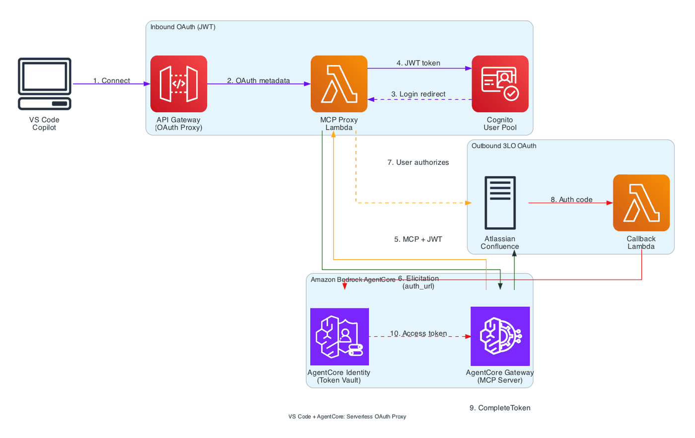

# VS Code + AgentCore Gateway: Serverless OAuth Proxy

## Overview

This notebook deploys a **serverless OAuth proxy** using API Gateway + Lambda,
eliminating the need for developers to run local proxy and callback servers.

### Architecture



### What This Deploys

1. **API Gateway** - Public endpoint for VS Code to connect to
2. **MCP Proxy Lambda** - OAuth metadata, callback interception, token proxying, MCP forwarding
3. **3LO Callback Lambda** - Outbound OAuth callbacks, CompleteResourceTokenAuth
4. **Cognito User Pool** - JWT tokens for inbound authentication
5. **AgentCore Gateway** - MCP server with Confluence target

## Step 1: Setup

```python
# Install dependencies
!pip3 install -r requirements.txt --quiet
```

```python
import boto3
import json
import time
import os
import zipfile
import io
import random
import string
import requests
from datetime import datetime

timestamp = datetime.now().strftime("%Y%m%d-%H%M%S")
REGION = os.environ.get("AWS_REGION", "us-west-2")
ACCOUNT_ID = boto3.client("sts").get_caller_identity()["Account"]

# Resource names
gateway_name = f"vscode-confluence-gw-{timestamp}"
target_name = "ConfluenceCloud"
credential_provider_name = f"atlassian-provider-{timestamp}"
api_name = f"mcp-oauth-proxy-{timestamp}"
proxy_lambda_name = f"mcp-proxy-lambda-{timestamp}"
callback_lambda_name = f"mcp-callback-lambda-{timestamp}"

print(f"✓ Setup complete | Region: {REGION} | Account: {ACCOUNT_ID}")
```

## Step 1b: Cleanup Previous Resources (Optional)

Run this cell to clean up any existing resources from previous runs.

```python
# Cleanup existing resources from previous runs
# This deletes gateways, Lambda functions, API Gateways, credential providers, and Cognito resources


def cleanup_previous_resources():
    """Clean up existing resources from previous runs."""
    gateway_client = boto3.client("bedrock-agentcore-control", region_name=REGION)
    identity_client = boto3.client("bedrock-agentcore-control", region_name=REGION)
    cognito_client = boto3.client("cognito-idp", region_name=REGION)
    iam_client = boto3.client("iam", region_name=REGION)
    lambda_client = boto3.client("lambda", region_name=REGION)
    apigw_client = boto3.client("apigatewayv2", region_name=REGION)

    print("=" * 70)
    print("CLEANUP: Removing resources from previous runs")
    print("=" * 70)

    # Step 1: Delete API Gateways matching pattern
    print("\n1. Cleaning up API Gateways matching 'mcp-oauth-proxy-*'...")
    try:
        apis = apigw_client.get_apis().get("Items", [])
        matching_apis = [api for api in apis if api["Name"].startswith("mcp-oauth-proxy-")]
        if matching_apis:
            print(f"   Found {len(matching_apis)} API Gateway(s) to delete:")
            for api in matching_apis:
                print(f"   - {api['Name']} ({api['ApiId']})")
                try:
                    apigw_client.delete_api(ApiId=api["ApiId"])
                    print("     ✓ Deleted")
                except Exception as e:
                    print(f"     Warning: {e}")
        else:
            print("   No matching API Gateways found")
    except Exception as e:
        print(f"   Error: {e}")

    # Step 2: Delete Lambda functions matching patterns
    print("\n2. Cleaning up Lambda functions matching 'mcp-*-lambda-*'...")
    try:
        paginator = lambda_client.get_paginator("list_functions")
        matching_functions = []
        for page in paginator.paginate():
            for fn in page["Functions"]:
                if fn["FunctionName"].startswith("mcp-proxy-lambda-") or fn["FunctionName"].startswith(
                    "mcp-callback-lambda-"
                ):
                    matching_functions.append(fn["FunctionName"])
        if matching_functions:
            print(f"   Found {len(matching_functions)} Lambda function(s) to delete:")
            for fn_name in matching_functions:
                print(f"   - {fn_name}")
                try:
                    lambda_client.delete_function(FunctionName=fn_name)
                    print("     ✓ Deleted")
                except Exception as e:
                    print(f"     Warning: {e}")
        else:
            print("   No matching Lambda functions found")
    except Exception as e:
        print(f"   Error: {e}")

    # Step 3: Delete AgentCore Gateways
    print("\n3. Cleaning up gateways matching 'vscode-confluence-gw-*'...")
    try:
        all_gateways = []
        next_token = None
        while True:
            if next_token:
                response = gateway_client.list_gateways(nextToken=next_token)
            else:
                response = gateway_client.list_gateways()
            all_gateways.extend(response.get("items", []))
            next_token = response.get("nextToken")
            if not next_token:
                break

        matching_gateways = [gw for gw in all_gateways if gw["name"].startswith("vscode-confluence-gw-")]
        if matching_gateways:
            print(f"   Found {len(matching_gateways)} gateway(s) to delete:")
            for gw in matching_gateways:
                print(f"   - {gw['name']} ({gw['gatewayId']})")
                try:
                    targets_response = gateway_client.list_gateway_targets(gatewayIdentifier=gw["gatewayId"])
                    for target in targets_response.get("items", []):
                        print(f"     Deleting target: {target['name']}")
                        gateway_client.delete_gateway_target(
                            gatewayIdentifier=gw["gatewayId"],
                            targetId=target["targetId"],
                        )
                    time.sleep(5)
                    gateway_client.delete_gateway(gatewayIdentifier=gw["gatewayId"])
                    print("     ✓ Gateway deleted")
                except Exception as e:
                    print(f"     Warning: {e}")
        else:
            print("   No matching gateways found")
    except Exception as e:
        print(f"   Error: {e}")

    # Step 4: Delete credential providers
    print("\n4. Cleaning up credential providers matching 'atlassian-provider-*'...")
    try:
        providers_response = identity_client.list_oauth2_credential_providers()
        matching_providers = [
            p for p in providers_response.get("credentialProviders", []) if p["name"].startswith("atlassian-provider-")
        ]
        if matching_providers:
            print(f"   Found {len(matching_providers)} provider(s) to delete:")
            for provider in matching_providers:
                print(f"   - {provider['name']}")
                identity_client.delete_oauth2_credential_provider(name=provider["name"])
                print("     ✓ Deleted")
        else:
            print("   No matching credential providers found")
    except Exception as e:
        print(f"   Error: {e}")

    # Step 5: Delete Cognito user pools
    print("\n5. Cleaning up Cognito user pools matching 'agentcore-confluence-pool-*'...")
    try:
        pools_response = cognito_client.list_user_pools(MaxResults=60)
        matching_pools = [
            p for p in pools_response.get("UserPools", []) if p["Name"].startswith("agentcore-confluence-pool-")
        ]
        if matching_pools:
            print(f"   Found {len(matching_pools)} user pool(s) to delete:")
            for pool in matching_pools:
                print(f"   - {pool['Name']} ({pool['Id']})")
                try:
                    pool_details = cognito_client.describe_user_pool(UserPoolId=pool["Id"])
                    domain = pool_details["UserPool"].get("Domain")
                    if domain:
                        cognito_client.delete_user_pool_domain(Domain=domain, UserPoolId=pool["Id"])
                    cognito_client.delete_user_pool(UserPoolId=pool["Id"])
                    print("     ✓ User pool deleted")
                except Exception as e:
                    print(f"     Warning: {e}")
        else:
            print("   No matching user pools found")
    except Exception as e:
        print(f"   Error: {e}")

    # Step 6: Delete IAM roles
    print("\n6. Cleaning up IAM roles...")
    role_prefixes = [
        "AgentCoreGatewayRole-",
        "mcp-proxy-lambda-role-",
        "mcp-callback-lambda-role-",
    ]
    try:
        paginator = iam_client.get_paginator("list_roles")
        matching_roles = []
        for page in paginator.paginate():
            for role in page["Roles"]:
                if any(role["RoleName"].startswith(prefix) for prefix in role_prefixes):
                    matching_roles.append(role["RoleName"])
        if matching_roles:
            print(f"   Found {len(matching_roles)} role(s) to delete:")
            for role_name in matching_roles:
                print(f"   - {role_name}")
                try:
                    attached = iam_client.list_attached_role_policies(RoleName=role_name)
                    for policy in attached.get("AttachedPolicies", []):
                        iam_client.detach_role_policy(RoleName=role_name, PolicyArn=policy["PolicyArn"])
                    iam_client.delete_role(RoleName=role_name)
                    print("     ✓ Role deleted")
                except Exception as e:
                    print(f"     Warning: {e}")
        else:
            print("   No matching IAM roles found")
    except Exception as e:
        print(f"   Error: {e}")

    print("\n" + "=" * 70)
    print("✓ Cleanup complete! Ready to create fresh resources.")
    print("=" * 70)


# Run cleanup - comment out this line if you want to skip cleanup
cleanup_previous_resources()
```

## Step 2: Create Cognito User Pool

```python
cognito = boto3.client("cognito-idp", region_name=REGION)

pool_name = f"agentcore-confluence-pool-{timestamp}"
pool_response = cognito.create_user_pool(
    PoolName=pool_name,
    Policies={
        "PasswordPolicy": {
            "MinimumLength": 8,
            "RequireUppercase": True,
            "RequireLowercase": True,
            "RequireNumbers": True,
            "RequireSymbols": True,
        }
    },
    AutoVerifiedAttributes=["email"],
    Schema=[
        {
            "Name": "email",
            "AttributeDataType": "String",
            "Required": True,
            "Mutable": True,
        }
    ],
)
gw_user_pool_id = pool_response["UserPool"]["Id"]
print(f"✓ User Pool created: {gw_user_pool_id}")

# Create domain
cognito_domain = f"agentcore-{''.join(random.choices(string.ascii_lowercase + string.digits, k=8))}"
cognito.create_user_pool_domain(Domain=cognito_domain, UserPoolId=gw_user_pool_id)
print(f"✓ Cognito domain: {cognito_domain}")

# Create resource server
resource_server_id = "agentcore-gateway"
scope_names = [f"{resource_server_id}/mcp.read", f"{resource_server_id}/mcp.write"]
cognito.create_resource_server(
    UserPoolId=gw_user_pool_id,
    Identifier=resource_server_id,
    Name="AgentCore Gateway",
    Scopes=[
        {"ScopeName": "mcp.read", "ScopeDescription": "Read MCP"},
        {"ScopeName": "mcp.write", "ScopeDescription": "Write MCP"},
    ],
)
print(f"✓ Resource server: {resource_server_id}")

# URLs
cognito_domain_url = f"https://{cognito_domain}.auth.{REGION}.amazoncognito.com"
gw_cognito_discovery_url = (
    f"https://cognito-idp.{REGION}.amazonaws.com/{gw_user_pool_id}/.well-known/openid-configuration"
)
print(f"✓ Discovery URL: {gw_cognito_discovery_url}")
```

## Step 3: Create Cognito App Clients

We'll create the VS Code client after we have the API Gateway URL for callbacks.

```python
# M2M client for testing
m2m_response = cognito.create_user_pool_client(
    UserPoolId=gw_user_pool_id,
    ClientName=f"agentcore-m2m-{timestamp}",
    GenerateSecret=True,
    AllowedOAuthFlows=["client_credentials"],
    AllowedOAuthFlowsUserPoolClient=True,
    AllowedOAuthScopes=scope_names,
)
gw_client_id = m2m_response["UserPoolClient"]["ClientId"]
gw_client_secret = m2m_response["UserPoolClient"]["ClientSecret"]
print(f"✓ M2M Client: {gw_client_id}")

# Create test user
COGNITO_USERNAME = "vscode-user"
COGNITO_PASSWORD = "TempPassword123!"

try:
    cognito.admin_create_user(
        UserPoolId=gw_user_pool_id,
        Username=COGNITO_USERNAME,
        TemporaryPassword=COGNITO_PASSWORD,
        MessageAction="SUPPRESS",
        UserAttributes=[
            {"Name": "email", "Value": f"{COGNITO_USERNAME}@example.com"},
            {"Name": "email_verified", "Value": "true"},
        ],
    )
    cognito.admin_set_user_password(
        UserPoolId=gw_user_pool_id,
        Username=COGNITO_USERNAME,
        Password=COGNITO_PASSWORD,
        Permanent=True,
    )
    print(f"✓ User created: {COGNITO_USERNAME}")
except cognito.exceptions.UsernameExistsException:
    print(f"✓ User exists: {COGNITO_USERNAME}")
```

## Step 4: Enter Atlassian OAuth Credentials

```python
# REPLACE THESE WITH YOUR ATLASSIAN OAUTH CREDENTIALS
ATLASSIAN_CLIENT_ID = "<client_id>"  # <-- REPLACE THIS WITH YOUR ATLASSIAN CLIENT ID
ATLASSIAN_CLIENT_SECRET = "<client_secret>"  # <-- REPLACE THIS WITH YOUR ATLASSIAN CLIENT SECRET
ATLASSIAN_TENANT = (
    "<your-tenant>"  # <-- REPLACE THIS WITH YOUR ATLASSIAN TENANT e.g., "mycompany" for mycompany.atlassian.net
)

if ATLASSIAN_CLIENT_ID.startswith("<"):
    print("⚠️  Replace placeholder values with your Atlassian OAuth credentials")
else:
    print("✓ Atlassian credentials configured")
```

## Step 5: Create Lambda Functions

```python
lambda_client = boto3.client("lambda", region_name=REGION)
iam_client = boto3.client("iam", region_name=REGION)

# Create Lambda execution role
lambda_role_name = f"mcp-proxy-lambda-role-{timestamp}"
trust_policy = {
    "Version": "2012-10-17",
    "Statement": [
        {
            "Effect": "Allow",
            "Principal": {"Service": "lambda.amazonaws.com"},
            "Action": "sts:AssumeRole",
        }
    ],
}

role_response = iam_client.create_role(
    RoleName=lambda_role_name,
    AssumeRolePolicyDocument=json.dumps(trust_policy),
    Description="Lambda execution role for MCP proxy",
)
lambda_role_arn = role_response["Role"]["Arn"]

# Attach policies
iam_client.attach_role_policy(
    RoleName=lambda_role_name,
    PolicyArn="arn:aws:iam::aws:policy/service-role/AWSLambdaBasicExecutionRole",
)
iam_client.attach_role_policy(
    RoleName=lambda_role_name,
    PolicyArn="arn:aws:iam::aws:policy/AmazonBedrockFullAccess",
)

# Add inline policy for AgentCore Identity and Secrets Manager
# CompleteResourceTokenAuth requires secretsmanager:GetSecretValue to retrieve OAuth credentials
agentcore_policy = {
    "Version": "2012-10-17",
    "Statement": [
        {
            "Effect": "Allow",
            "Action": [
                "bedrock-agentcore:CompleteResourceTokenAuth",
                "bedrock-agentcore:GetResourceOauth2Token",
            ],
            "Resource": "*",
        },
        {
            "Effect": "Allow",
            "Action": ["secretsmanager:GetSecretValue"],
            "Resource": "*",
        },
    ],
}
iam_client.put_role_policy(
    RoleName=lambda_role_name,
    PolicyName="AgentCoreIdentityAccess",
    PolicyDocument=json.dumps(agentcore_policy),
)
print(f"✓ Lambda role created: {lambda_role_arn}")
time.sleep(10)  # Wait for role propagation
```

```python
import subprocess


# Read and package Lambda code
def create_lambda_zip(source_file):
    """Create a zip file from Lambda source code."""
    zip_buffer = io.BytesIO()
    with zipfile.ZipFile(zip_buffer, "w", zipfile.ZIP_DEFLATED) as zf:
        with open(source_file, "r") as f:
            zf.writestr(
                "lambda_function.py",
                f.read().replace("def lambda_handler", "def handler").replace("lambda_handler", "handler"),
            )
    return zip_buffer.getvalue()


def create_lambda_zip_with_deps(source_file, deps=["boto3", "botocore"]):
    """Create a zip file with Lambda code and dependencies bundled.

    Lambda's built-in boto3 may be outdated for new AWS services like AgentCore.
    This bundles the latest boto3/botocore to ensure API compatibility.
    """
    import tempfile

    with tempfile.TemporaryDirectory() as tmpdir:
        # Install dependencies to temp directory
        subprocess.run(
            ["pip", "install", "--target", tmpdir, "--upgrade", "--quiet"] + deps,
            check=True,
        )

        # Copy Lambda source
        with open(source_file, "r") as f:
            code = f.read().replace("def lambda_handler", "def handler").replace("lambda_handler", "handler")
        with open(os.path.join(tmpdir, "lambda_function.py"), "w") as f:
            f.write(code)

        # Create zip
        zip_buffer = io.BytesIO()
        with zipfile.ZipFile(zip_buffer, "w", zipfile.ZIP_DEFLATED) as zf:
            for root, dirs, files in os.walk(tmpdir):
                # Skip __pycache__ and .dist-info directories
                dirs[:] = [d for d in dirs if not d.startswith("__") and not d.endswith(".dist-info")]
                for file in files:
                    if file.endswith(".pyc"):
                        continue
                    filepath = os.path.join(root, file)
                    arcname = os.path.relpath(filepath, tmpdir)
                    zf.write(filepath, arcname)

        return zip_buffer.getvalue()


# Create MCP Proxy Lambda (no extra deps needed - uses urllib)
proxy_zip = create_lambda_zip("lambda/mcp_proxy_lambda.py")
proxy_lambda = lambda_client.create_function(
    FunctionName=proxy_lambda_name,
    Runtime="python3.12",
    Role=lambda_role_arn,
    Handler="lambda_function.handler",
    Code={"ZipFile": proxy_zip},
    Timeout=60,
    MemorySize=256,
    Environment={
        "Variables": {
            "COGNITO_DOMAIN": cognito_domain_url,
            "CLIENT_ID": "",  # Will update after VS Code client created
        }
    },
)
print(f"✓ Proxy Lambda created: {proxy_lambda_name}")

# Create Callback Lambda WITH bundled boto3 (required for AgentCore APIs)
print("Bundling boto3 for Callback Lambda (AgentCore APIs require latest boto3)...")
callback_zip = create_lambda_zip_with_deps("lambda/callback_lambda.py")
callback_lambda = lambda_client.create_function(
    FunctionName=callback_lambda_name,
    Runtime="python3.12",
    Role=lambda_role_arn,
    Handler="lambda_function.handler",
    Code={"ZipFile": callback_zip},
    Timeout=30,
    MemorySize=256,
)
print(f"✓ Callback Lambda created: {callback_lambda_name}")
```

## Step 6: Create API Gateway

```python
apigw = boto3.client("apigatewayv2", region_name=REGION)

# Create HTTP API
api_response = apigw.create_api(
    Name=api_name,
    ProtocolType="HTTP",
    CorsConfiguration={
        "AllowOrigins": ["*"],
        "AllowMethods": ["GET", "POST", "OPTIONS"],
        "AllowHeaders": ["*"],
    },
)
api_id = api_response["ApiId"]
api_endpoint = api_response["ApiEndpoint"]
print(f"✓ API Gateway created: {api_endpoint}")

# Create Lambda integrations
proxy_integration = apigw.create_integration(
    ApiId=api_id,
    IntegrationType="AWS_PROXY",
    IntegrationUri=proxy_lambda["FunctionArn"],
    PayloadFormatVersion="2.0",
)

callback_integration = apigw.create_integration(
    ApiId=api_id,
    IntegrationType="AWS_PROXY",
    IntegrationUri=callback_lambda["FunctionArn"],
    PayloadFormatVersion="2.0",
)

# Create routes
routes = [
    (
        "GET",
        "/.well-known/oauth-authorization-server",
        proxy_integration["IntegrationId"],
    ),
    (
        "GET",
        "/.well-known/oauth-protected-resource",
        proxy_integration["IntegrationId"],
    ),
    ("GET", "/authorize", proxy_integration["IntegrationId"]),
    ("GET", "/callback", proxy_integration["IntegrationId"]),
    ("POST", "/token", proxy_integration["IntegrationId"]),
    ("POST", "/register", proxy_integration["IntegrationId"]),
    ("GET", "/ping", callback_integration["IntegrationId"]),
    ("POST", "/userIdentifier/token", callback_integration["IntegrationId"]),
    ("GET", "/oauth2/callback", callback_integration["IntegrationId"]),
    ("$default", None, proxy_integration["IntegrationId"]),  # Catch-all for MCP
]

for method, path, integration_id in routes:
    if method == "$default":
        apigw.create_route(ApiId=api_id, RouteKey="$default", Target=f"integrations/{integration_id}")
    else:
        apigw.create_route(
            ApiId=api_id,
            RouteKey=f"{method} {path}",
            Target=f"integrations/{integration_id}",
        )

# Create stage
apigw.create_stage(ApiId=api_id, StageName="$default", AutoDeploy=True)
print("✓ Routes configured")

# Add Lambda permissions
for func_name, func_arn in [
    (proxy_lambda_name, proxy_lambda["FunctionArn"]),
    (callback_lambda_name, callback_lambda["FunctionArn"]),
]:
    lambda_client.add_permission(
        FunctionName=func_name,
        StatementId=f"apigw-invoke-{api_id}",
        Action="lambda:InvokeFunction",
        Principal="apigateway.amazonaws.com",
        SourceArn=f"arn:aws:execute-api:{REGION}:{ACCOUNT_ID}:{api_id}/*",
    )
print("✓ Lambda permissions added")
```

## Step 7: Create VS Code Cognito Client (with API Gateway callback)

```python
# Now create VS Code client with API Gateway callback URL
CALLBACK_URLS = [
    "http://127.0.0.1:33418",
    "http://127.0.0.1:33418/",
    "http://localhost:33418",
    "http://localhost:33418/",
    f"{api_endpoint}/callback",
    f"{api_endpoint}/callback/",
    "https://vscode.dev/redirect",
    "https://insiders.vscode.dev/redirect",
]

vscode_client = cognito.create_user_pool_client(
    UserPoolId=gw_user_pool_id,
    ClientName=f"agentcore-vscode-{timestamp}",
    GenerateSecret=False,
    AllowedOAuthFlows=["code"],
    AllowedOAuthFlowsUserPoolClient=True,
    AllowedOAuthScopes=["openid", "profile", "email", "phone"] + scope_names,
    CallbackURLs=CALLBACK_URLS,
    SupportedIdentityProviders=["COGNITO"],
    ExplicitAuthFlows=["ALLOW_REFRESH_TOKEN_AUTH", "ALLOW_USER_SRP_AUTH"],
)
vscode_client_id = vscode_client["UserPoolClient"]["ClientId"]
print(f"✓ VS Code Client: {vscode_client_id}")

allowed_client_ids = [gw_client_id, vscode_client_id]
```

## Step 8: Create Atlassian Credential Provider

```python
identity_client = boto3.client("bedrock-agentcore-control", region_name=REGION)

atlassian_provider = identity_client.create_oauth2_credential_provider(
    name=credential_provider_name,
    credentialProviderVendor="AtlassianOauth2",
    oauth2ProviderConfigInput={
        "atlassianOauth2ProviderConfig": {
            "clientId": ATLASSIAN_CLIENT_ID,
            "clientSecret": ATLASSIAN_CLIENT_SECRET,
        }
    },
)
credential_provider_arn = atlassian_provider["credentialProviderArn"]
agentcore_callback_url = atlassian_provider["callbackUrl"]

print(f"✓ Credential Provider: {credential_provider_arn}")
print(f"\n{'=' * 60}")
print("⚠️  Register this callback URL in your Atlassian app:")
print(f"   {agentcore_callback_url}")
print(f"{'=' * 60}")
```

## Step 9: Create AgentCore Gateway

```python
gateway_client = boto3.client("bedrock-agentcore-control", region_name=REGION)

# Create IAM role for gateway
gw_role_name = f"AgentCoreGatewayRole-{timestamp}"
gw_trust_policy = {
    "Version": "2012-10-17",
    "Statement": [
        {
            "Effect": "Allow",
            "Principal": {"Service": "bedrock-agentcore.amazonaws.com"},
            "Action": "sts:AssumeRole",
        }
    ],
}

gw_role = iam_client.create_role(
    RoleName=gw_role_name,
    AssumeRolePolicyDocument=json.dumps(gw_trust_policy),
    Description="IAM role for AgentCore Gateway",
)
gw_role_arn = gw_role["Role"]["Arn"]
iam_client.attach_role_policy(RoleName=gw_role_name, PolicyArn="arn:aws:iam::aws:policy/AdministratorAccess")
print(f"✓ Gateway role: {gw_role_arn}")
time.sleep(10)

# Create gateway with Cognito JWT auth
gateway_response = gateway_client.create_gateway(
    name=gateway_name,
    protocolType="MCP",
    protocolConfiguration={
        "mcp": {
            "supportedVersions": ["2025-03-26", "2025-11-25"],
            "searchType": "SEMANTIC",
        }
    },
    roleArn=gw_role_arn,
    authorizerType="CUSTOM_JWT",
    authorizerConfiguration={
        "customJWTAuthorizer": {
            "discoveryUrl": gw_cognito_discovery_url,
            "allowedClients": allowed_client_ids,
            "allowedScopes": ["openid", "profile", "email", "phone"] + scope_names,
        }
    },
)
gateway_id = gateway_response["gatewayId"]
gateway_url = gateway_response["gatewayUrl"]

print("Waiting for gateway...")
while True:
    status = gateway_client.get_gateway(gatewayIdentifier=gateway_id)["status"]
    print(f"  Status: {status}")
    if status == "READY":
        break
    time.sleep(10)
print(f"✓ Gateway ready: {gateway_url}")
```

## Step 10: Create Confluence Target

```python
confluence_openapi_spec = {
    "openapi": "3.0.0",
    "info": {"title": "Confluence Cloud API", "version": "1.0.0"},
    "servers": [{"url": "https://api.atlassian.com/ex/confluence"}],
    "paths": {
        "/{cloudId}/wiki/api/v2/spaces": {
            "get": {
                "operationId": "getSpaces",
                "summary": "Get all Confluence spaces",
                "security": [{"BearerAuth": []}],
                "parameters": [
                    {
                        "name": "cloudId",
                        "in": "path",
                        "required": True,
                        "schema": {"type": "string"},
                    },
                    {
                        "name": "limit",
                        "in": "query",
                        "schema": {"type": "integer", "default": 25},
                    },
                ],
                "responses": {"200": {"description": "List of spaces"}},
            }
        },
        "/{cloudId}/wiki/api/v2/pages": {
            "get": {
                "operationId": "getPages",
                "summary": "Get Confluence pages",
                "security": [{"BearerAuth": []}],
                "parameters": [
                    {
                        "name": "cloudId",
                        "in": "path",
                        "required": True,
                        "schema": {"type": "string"},
                    },
                    {"name": "space-id", "in": "query", "schema": {"type": "string"}},
                    {
                        "name": "limit",
                        "in": "query",
                        "schema": {"type": "integer", "default": 25},
                    },
                ],
                "responses": {"200": {"description": "List of pages"}},
            }
        },
    },
    "components": {"securitySchemes": {"BearerAuth": {"type": "http", "scheme": "bearer"}}},
}

CONFLUENCE_SCOPES = [
    "read:space:confluence",
    "read:page:confluence",
    "read:confluence-content.all",
    "offline_access",
]
DEFAULT_RETURN_URL = f"{api_endpoint}/oauth2/callback"

target_response = gateway_client.create_gateway_target(
    name=target_name,
    description="Confluence Cloud API with 3LO OAuth",
    gatewayIdentifier=gateway_id,
    credentialProviderConfigurations=[
        {
            "credentialProviderType": "OAUTH",
            "credentialProvider": {
                "oauthCredentialProvider": {
                    "providerArn": credential_provider_arn,
                    "grantType": "AUTHORIZATION_CODE",
                    "defaultReturnUrl": DEFAULT_RETURN_URL,
                    "scopes": CONFLUENCE_SCOPES,
                }
            },
        }
    ],
    targetConfiguration={"mcp": {"openApiSchema": {"inlinePayload": json.dumps(confluence_openapi_spec)}}},
)
target_id = target_response["targetId"]
print(f"✓ Confluence target: {target_id}")
```

## Step 11: Update Lambda Environment Variables

```python
# Update proxy Lambda with Gateway URL and client ID
lambda_client.update_function_configuration(
    FunctionName=proxy_lambda_name,
    Environment={
        "Variables": {
            "GATEWAY_URL": gateway_url,
            "COGNITO_DOMAIN": cognito_domain_url,
            "CLIENT_ID": vscode_client_id,
            "CALLBACK_LAMBDA_URL": api_endpoint,
        }
    },
)
print("✓ Proxy Lambda updated with Gateway URL")
```

## Step 12: Get Atlassian Cloud ID

```python
if ATLASSIAN_TENANT and not ATLASSIAN_TENANT.startswith("<"):
    try:
        url = f"https://{ATLASSIAN_TENANT}.atlassian.net/_edge/tenant_info"
        response = requests.get(url, timeout=10)
        response.raise_for_status()
        tenant_info = response.json()
        ATLASSIAN_CLOUD_ID = tenant_info.get("cloudId")
        print(f"✓ Cloud ID: {ATLASSIAN_CLOUD_ID}")
    except Exception as e:
        print(f"Could not retrieve Cloud ID: {e}")
        ATLASSIAN_CLOUD_ID = "<your-cloud-id>"
else:
    ATLASSIAN_CLOUD_ID = "<your-cloud-id>"
    print("⚠️  Set ATLASSIAN_TENANT to retrieve Cloud ID")
```

## Step 13: VS Code Configuration

No local servers needed! Just configure VS Code to point to the API Gateway.

```python
print("=" * 80)
print("SETUP COMPLETE - SERVERLESS OAUTH PROXY")
print("=" * 80)

mcp_config = {
    "servers": {
        f"agentcore-confluence-{timestamp}": {
            "type": "http",
            "url": api_endpoint,
            "headers": {"MCP-Protocol-Version": "2025-11-25"},
        }
    }
}

print(f"""
API Gateway URL: {api_endpoint}
Gateway URL:     {gateway_url}

Add this to your .vscode/mcp.json:

{json.dumps(mcp_config, indent=2)}

COGNITO LOGIN CREDENTIALS:
  Username: {COGNITO_USERNAME}
  Password: {COGNITO_PASSWORD}

VS Code Client ID: {vscode_client_id}

ATLASSIAN CALLBACK URL (register in your Atlassian app):
  {agentcore_callback_url}

ATLASSIAN CLOUD ID: {ATLASSIAN_CLOUD_ID}
""")
print("=" * 80)
print("✅ No local servers required! VS Code connects directly to API Gateway.")
print("=" * 80)
```

----

## Cleanup (Optional)

Run this cell to delete all resources created by this notebook.

```python
def cleanup_all():
    """Delete all resources created by this notebook."""
    print("Cleaning up resources...")

    # Delete API Gateway
    try:
        apigw.delete_api(ApiId=api_id)
        print(f"✓ Deleted API Gateway: {api_id}")
    except:
        pass

    # Delete Lambda functions
    for fn in [proxy_lambda_name, callback_lambda_name]:
        try:
            lambda_client.delete_function(FunctionName=fn)
            print(f"✓ Deleted Lambda: {fn}")
        except:
            pass

    # Delete Gateway target and gateway
    try:
        gateway_client.delete_gateway_target(gatewayIdentifier=gateway_id, targetId=target_id)
        time.sleep(5)
        gateway_client.delete_gateway(gatewayIdentifier=gateway_id)
        print(f"✓ Deleted Gateway: {gateway_id}")
    except:
        pass

    # Delete credential provider
    try:
        identity_client.delete_oauth2_credential_provider(name=credential_provider_name)
        print("✓ Deleted Credential Provider")
    except:
        pass

    # Delete Cognito
    try:
        cognito.delete_user_pool_domain(Domain=cognito_domain, UserPoolId=gw_user_pool_id)
        cognito.delete_user_pool(UserPoolId=gw_user_pool_id)
        print("✓ Deleted Cognito User Pool")
    except:
        pass

    # Delete IAM roles
    for role in [lambda_role_name, gw_role_name]:
        try:
            attached = iam_client.list_attached_role_policies(RoleName=role)
            for p in attached.get("AttachedPolicies", []):
                iam_client.detach_role_policy(RoleName=role, PolicyArn=p["PolicyArn"])
            iam_client.delete_role(RoleName=role)
            print(f"✓ Deleted IAM Role: {role}")
        except:
            pass

    print("✓ Cleanup complete!")


# Uncomment to run cleanup:
# cleanup_all()
```
