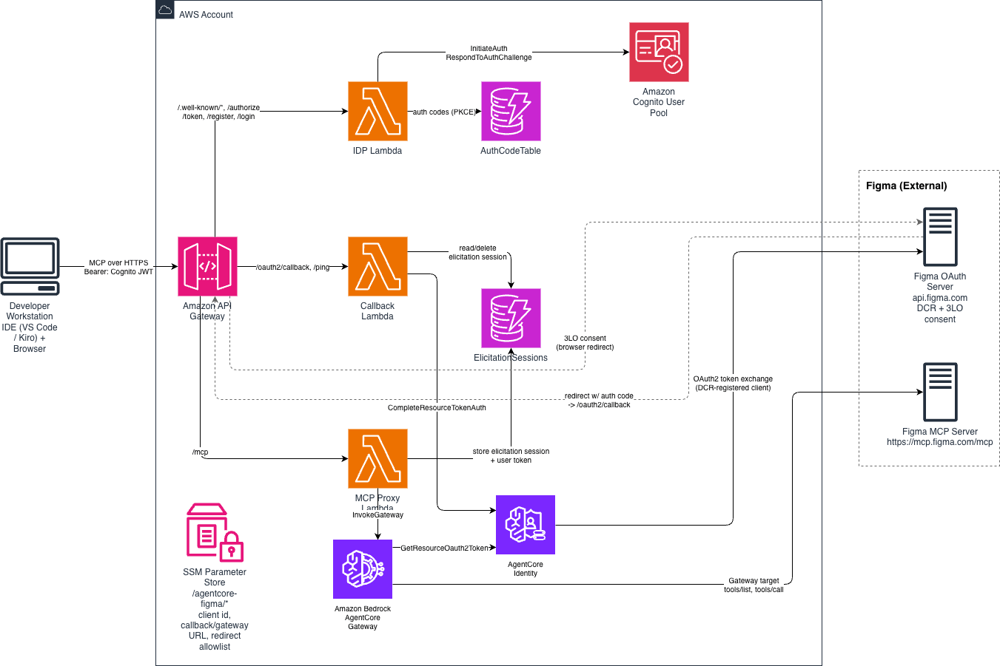

# Secure IDE-to-Figma MCP access via AgentCore Gateway (serverless, DCR)

## Overview

This sample shows how to securely connect an IDE (such as VS Code) to a remote server supporting user tokens,
such as **Figma MCP server** through an **Amazon Bedrock AgentCore Gateway**, without the
developer having to run any local OAuth proxy or callback servers.

It deploys a fully **serverless OAuth proxy** (API Gateway + Lambda) that sits in
front of the AgentCore Gateway and handles both sides of the auth story:

- **Inbound (IDE -> Gateway):** the IDE authenticates with an Amazon Cognito user
  pool using the OAuth 2.0 Authorization Code flow with PKCE. Dynamic Client
  Registration (DCR) lets MCP clients register themselves, so no client secret is
  hard-coded in the IDE. The proxy validates the Cognito JWT and forwards MCP
  requests to the Gateway.
- **Outbound (Gateway -> Figma / 3LO):** the Gateway's Figma target uses an
  AgentCore Identity OAuth2 credential provider (registered against Figma via DCR).
  The user consents once in the browser; the resulting Figma access/refresh tokens
  are stored server-side in the AgentCore token vault and are never handed to the
  IDE. The proxy rewrites elicitation URLs and the callback Lambda completes the
  grant with `CompleteResourceTokenAuth`.

The net result: the developer points their coding agent like Kiro or VS Code at a single API Gateway URL, logs in
once, authorizes Figma once, and can then call the Figma MCP tools
(`get_design_context`, `get_screenshot`, `use_figma`, and more) from the IDE.

### What This Deploys

1. **API Gateway** - Public HTTPS endpoint the IDE / MCP (DCR) clients connect to
2. **MCP Proxy Lambda** - Serves OAuth metadata (`.well-known`), handles DCR,
   validates inbound Cognito JWTs, rewrites 3LO elicitation URLs, and forwards
   MCP traffic to the AgentCore Gateway
3. **IdP Lambda** - Cognito-backed `/authorize`, `/token`, and login endpoints
   for the inbound PKCE flow
4. **3LO Callback Lambda** - Receives the outbound OAuth callback and calls
   `CompleteResourceTokenAuth` to store Figma tokens in the token vault
5. **Cognito User Pool** - Issues the JWTs used for inbound authentication
6. **AgentCore Gateway** - Exposes the remote **Figma MCP server** as a Gateway
   target, using an AgentCore Identity credential provider for 3LO to Figma

  


### What You'll Do In This Notebook

1. Deploy the CDK stack and load its outputs
2. Create a Cognito user for IDE login
3. Register a Figma OAuth credential provider (DCR against Figma)
4. Use the credential provider to get an access token for the Figma MCP
5. Call the Figma MCP server to get the list of tools
4. Create the Figma target on the AgentCore Gateway
5. Configure VS Code and Kiro IDE and connect to the MCP server to list the Figma tools
6. Prompt the coding agent (Copilot or Kiro) to ask for a Figma tool eg "who am I in Figma"

## Step 1: Setup

```python
# Install dependencies
!pip3 install -r requirements.txt --quiet
```

Deploy the CDK stack:

```bash
cd cdk
pnpm install
cdk deploy
```

then copy the output in the cell below replacing the content.

```python
import boto3
import json

ac = boto3.client('bedrock-agentcore-control')
acr = boto3.client('bedrock-agentcore')
```

```python
output = """
FigmaMCP.ApiEndpoint = https://xxxxxxxxxx.execute-api.eu-west-1.amazonaws.com/
FigmaMCP.CallbackLambdaName = FigmaMCP-McpCallbackLambdaAE4B86C1-xxxxxxxxx
FigmaMCP.CognitoDomain = agentcore-figma
FigmaMCP.CognitoDomainUrl = https://agentcore-figma.auth.eu-west-1.amazoncognito.com
FigmaMCP.DiscoveryUrl = https://cognito-idp.eu-west-1.amazonaws.com/eu-west-1_xxxxxxx/.well-known/openid-configuration
FigmaMCP.Gateway = agentcore-figma-gateway-xxxxxxxxx
FigmaMCP.IdpLambdaName = FigmaMCP-IdpLambda0CAAE044-xxxxxxx
FigmaMCP.M2MClientId = 5586oih7ll708430000xxxxxxx
FigmaMCP.McpLambdaName = FigmaMCP-McpProxyLambda5036A849-xxxxxxxxx
FigmaMCP.RedirectUriAllowlistParamOutput = /agentcore-figma/redirect-uri-allowlist
FigmaMCP.UserPoolArn = arn:aws:cognito-idp:eu-west-1:0123456789012:userpool/eu-west-1_xxxxxxx
FigmaMCP.UserPoolId = eu-west-1_xxxxxxx
FigmaMCP.VSCodeClientId = 7npqkkek1egvcsxxxxxxxxx
FigmaMCP.VSCodeMcpConfig = {
  "servers": {
    "agentcore-confluence": {
      "type": "http",
      "url": "https://xxxxxxxx.execute-api.eu-west-1.amazonaws.com/mcp",
      "headers": {
        "MCP-Protocol-Version": "2025-11-25"
      }
    }
  }
}
"""
```

```python
config = {}
for el in output.split("\n"):
    if "=" in el:
        key, value = el.split("=", 1)
        config[key.strip().replace("FigmaMCP.", "")] = value.strip()
```

## Step 1: Create Cognito User

```python
from cognito_helper import create_cognito_user

COGNITO_USERNAME = "vscode-user@example.com"

COGNITO_PASSWORD = create_cognito_user(COGNITO_USERNAME, config["UserPoolId"])

print(f"Cognito password: {COGNITO_PASSWORD}")
```

## Step 3: Create Figma Credential Provider

Figma MCP server only supports DCR (Dynamic Client Registration) to register the OAuth 2.0 client. AgentCore Identity Credential Providers do not support yet (as of July 2026) DCR, hence we need to perform a small dance to properly configure the credential provider.

1. Create a credential provider with dummy client_id and client_secret values
2. Register a new client in Figma
3. Update the credential provider with the client_id and client_secret returned during the registration

```python
credential_provider_name = "figma-dcr"
figma_provider = {}
```

```python
ac.delete_oauth2_credential_provider(name=credential_provider_name)
```

Create the credential provider. We need the `callbackUrl` to perform the DCR process.

```python
figma_provider = ac.create_oauth2_credential_provider(
    name=credential_provider_name, 
    credentialProviderVendor='CustomOauth2', 
    oauth2ProviderConfigInput={
    'customOauth2ProviderConfig': {
        'clientId': 'aaa',
        'clientSecret': 'bbb',  # pragma: allowlist secret
        'oauthDiscovery': {
            'discoveryUrl': 'https://api.figma.com/.well-known/oauth-authorization-server',
        }
    }})
```

```python
credential_provider_arn = figma_provider.get('credentialProviderArn', None)
agentcore_callback_url = figma_provider.get('callbackUrl', None)
```

Perform DCR against Figma using the `callbackUrl` as redirect URI.

```python
import requests
import json

registration = requests.post(
    'https://api.figma.com/v1/oauth/mcp/register', 
    headers={'content-type': 'application/json', 'accept': 'application=/json'}, 
    data=json.dumps({
      "redirect_uris": [
        agentcore_callback_url,
        ],
        "response_types": ["code"],
        "grant_types": ["authorization_code", "refresh_token"],
      "client_name": "Visual Studio Code",
      "client_uri": "https://code.visualstudio.com"
     })
)
registration.text
```

Finally, update the credential provider with the client_id and client_secret values.

```python
figma_provider =  ac.update_oauth2_credential_provider(
    name=credential_provider_name, credentialProviderVendor='CustomOauth2', oauth2ProviderConfigInput={
    'customOauth2ProviderConfig': {
        'clientId': registration.json()['client_id'],
        'clientSecret': registration.json()['client_secret'],
        'oauthDiscovery': {
            'discoveryUrl': 'https://api.figma.com/.well-known/oauth-authorization-server',
        }
    }})
```

```python
figma_provider
```

We can now use the credential provider to obtain a token so that we can call the Figma server and list the tools.

```python
ac.create_workload_identity(name="test_identity")
```

```python
wat = acr.get_workload_access_token_for_user_id(workloadName="test_identity", userId="me")["workloadAccessToken"]
```

```python
# get the consent URI
resp_token = acr.get_resource_oauth2_token(
    workloadIdentityToken=wat, 
    resourceCredentialProviderName=credential_provider_name,  
    resourceOauth2ReturnUrl="http://localhost:8085", 
    scopes=["mcp:connect"],
    oauth2Flow="USER_FEDERATION")
```

Here we start the callback server that processed the successful auth and completes the session binding.

```python
from http.server import BaseHTTPRequestHandler, HTTPServer
from urllib.parse import urlparse, parse_qs

HOST = "127.0.0.1"
PORT = 8085


class Handler(BaseHTTPRequestHandler):
    def do_GET(self):
        parsed = urlparse(self.path)
        print(f"query string: {parsed.query}")
        params = parse_qs(parsed.query)
        print(f"parsed params: {params}")
        
        self.send_response(200)
        self.send_header("Content-Type", "text/plain")
        self.end_headers()
        self.wfile.write(b"OK\n")
        acr.complete_resource_token_auth(
            sessionUri=params['session_id'][0], 
            userIdentifier={"userId":"me"})
        print("Completed auth")

    def log_message(self, *args):
        pass  # silence default request logging

if "authorizationUrl" in resp_token: 
    print(f'Click on {resp_token["authorizationUrl"]}')
    server = HTTPServer((HOST, PORT), Handler)
    # print(f"Listening on http://{HOST}:{PORT} (waiting for one request)")
    try:
        server.handle_request()  # handle a single request, then return
    finally:
        server.server_close()
```

```python
access_token = acr.get_resource_oauth2_token(
    workloadIdentityToken=wat, 
    resourceCredentialProviderName="figma",  
    resourceOauth2ReturnUrl="http://localhost:8085", 
    scopes=["mcp:connect"],
    oauth2Flow="USER_FEDERATION")['accessToken']
```

```python
# list the tools
import json
import requests

MCP_URL='https://mcp.figma.com/mcp'
def mcp_list_tools(mcp_url: str, access_token: str | None = None) -> list[dict]:
    """Initialize an MCP session over streamable HTTP and return the tools list."""
    headers = {
        "Content-Type": "application/json",
        # MCP streamable-HTTP servers require the client to accept both:
        "Accept": "application/json, text/event-stream",
        "MCP-Protocol-Version": "2025-06-18",
    }
    if access_token:
        headers["Authorization"] = f"Bearer {access_token}"

    def _parse(resp: requests.Response) -> dict:
        resp.raise_for_status()
        ctype = resp.headers.get("Content-Type", "")
        if "text/event-stream" in ctype:
            # SSE framing: pull the JSON out of the first `data:` line
            for line in resp.text.splitlines():
                if line.startswith("data:"):
                    return json.loads(line[len("data:"):].strip())
            raise RuntimeError("no data frame in SSE response")
        return resp.json()

    # 1) initialize
    init = requests.post(mcp_url, headers=headers, json={
        "jsonrpc": "2.0",
        "id": 1,
        "method": "initialize",
        "params": {
            "protocolVersion": "2025-06-18",
            "capabilities": {},
            "clientInfo": {"name": "snippet-client", "version": "1.0.0"},
        },
    })
    _parse(init)

    # Carry the session id (if the server issued one) on every subsequent call
    session_id = init.headers.get("Mcp-Session-Id")
    if session_id:
        headers["Mcp-Session-Id"] = session_id

    # 2) notifications/initialized (no id -> no response body expected)
    requests.post(mcp_url, headers=headers, json={
        "jsonrpc": "2.0",
        "method": "notifications/initialized",
    })

    # 3) tools/list
    resp = requests.post(mcp_url, headers=headers, json={
        "jsonrpc": "2.0",
        "id": 2,
        "method": "tools/list",
        "params": {},
    })
    result = _parse(resp)
    if "error" in result:
        raise RuntimeError(f"tools/list failed: {result['error']}")
    return result.get("result", {}).get("tools", {})

# --- usage ---
figma_tools =  mcp_list_tools(MCP_URL, access_token)  # access_token optional
print(f"{len(figma_tools)} tools")
for t in figma_tools:
    print(f"- {t['name']}: {t.get('description', '')[:80]}")
```

## Step 4: Create Figma Target

We add the Figma MCP target by passing the tools schemas obtained from the Figma server via a `tools/list` call we did previously.

```python
GATEWAY_ID = config["Gateway"]
```

```python
targets = ac.list_gateway_targets(gatewayIdentifier=GATEWAY_ID)['items']
```

```python
target_response=ac.get_gateway_target(gatewayIdentifier=GATEWAY_ID, targetId=targets[0]['targetId'])
target_response['name']
```

```python
if target_response['name'] == 'figma':
    ac.delete_gateway_target(gatewayIdentifier=GATEWAY_ID, targetId=targets[0]['targetId'])
```

```python
api_endpoint = config["ApiEndpoint"]
DEFAULT_RETURN_URL = f"{api_endpoint}oauth2/callback"
config_target = {
    "name": "figma",
    "credentialProviderConfigurations":[{
                             'credentialProviderType':'OAUTH',
                             'credentialProvider': {'oauthCredentialProvider': {
                                 'providerArn': figma_provider['credentialProviderArn'] , 
                                 'scopes': ['mcp:connect'],
                                 'defaultReturnUrl': DEFAULT_RETURN_URL,
                                 'grantType': 'AUTHORIZATION_CODE'}}
                             }],
    "targetConfiguration":{'mcp':{'mcpServer': {
        'endpoint':MCP_URL, 
        'mcpToolSchema': {'inlinePayload':json.dumps({'tools':figma_tools})}}}}
}
```

```python

target_response = ac.create_gateway_target(gatewayIdentifier=GATEWAY_ID,
                         **config_target)

target_id = target_response["targetId"]
print(f"✓ Figma target: {target_id}")
```

```python
# target_response
```

## Step 6: IDE and other clients configuration

VS Code configuration:

```python
print(json.dumps({
  "servers": {
    "figma-agentcore": {
      "type": "http",
      "url": config["ApiEndpoint"]+"mcp",
      "headers": {
        "MCP-Protocol-Version": "2025-11-25"
      }
    }
  }
}, indent=2))
```

Kiro IDE v1 configuration:

```python
print(json.dumps({
    "mcpServers": {
        "figma-agentcore": {
      "url": config["ApiEndpoint"]+"mcp",
    "headers": {
           "MCP-Protocol-Version": "2025-11-25"
       },
      "disabled": False
    }
    }
}, indent=2))
```

Now try to prompt the coding agent to invoke one of the Figma tools, like _"who am I in Figma"_

----

## Cleanup (Optional)

Run this cell to delete all resources created by this notebook.

```python
client = boto3.client('bedrock-agentcore-control')

def cleanup():
    """Delete all resources created by this notebook."""
    print("Cleaning up resources...")
    # Delete Gateway target and gateway
    targets = client.list_gateway_targets(gatewayIdentifier=config["Gateway"])['items']
    try:
        for t in targets:
            print(f" Deleting target {t['targetId']} for gateway {config["Gateway"]}", end='')
            client.delete_gateway_target(gatewayIdentifier=config["Gateway"], targetId=t['targetId'])
            print(" done.")

    except: 
        print(" nothing to do")
    
    # Delete credential provider
    try:
        print("Deleting Credential Provider...", end='')
        client.delete_oauth2_credential_provider(name=credential_provider_name)
        print(" done.")
    except: 
        print(" nothing to do.")

# Uncomment to run cleanup:
cleanup()
```

To remove the remaining resources run:

```bash
cd cdk
cdk destroy
```
