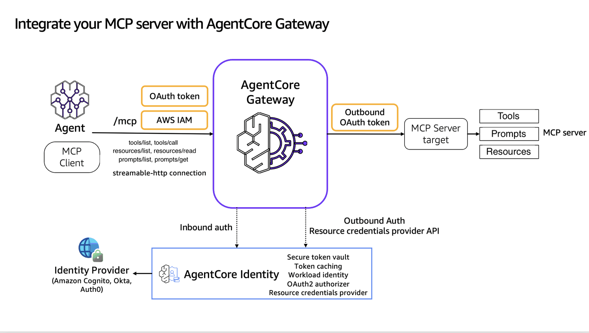
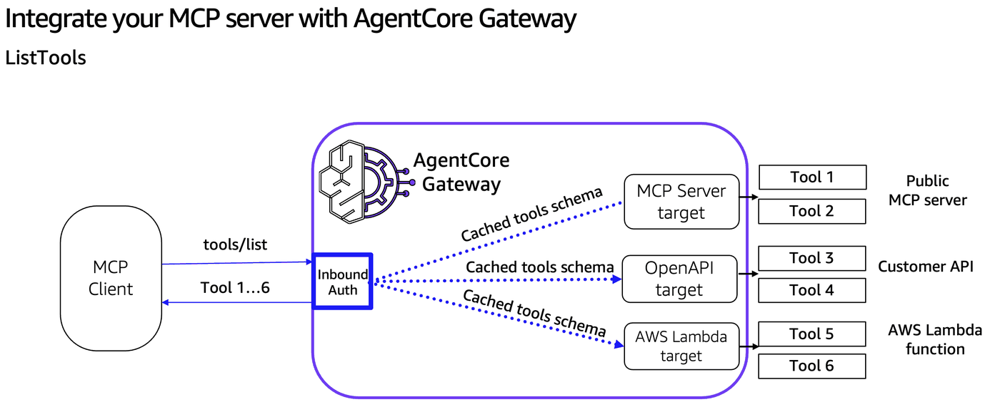
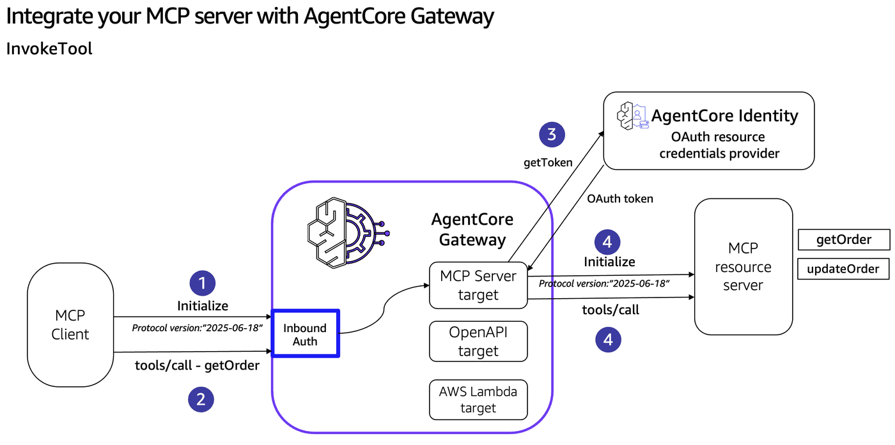

# Integrate MCP Server's into AgentCore Gateway

## Overview

In large enterprises with thousands of development teams, each running multiple MCP servers with several tools, prompts, and resources, managing and discovering capabilities becomes a critical challenge:

* **Capability Discovery and Sharing**: Teams struggle to discover and consume tools, prompts, and resources across the organization. Should each team maintain separate gateways? How do you share gateway URLs and manage central registries without creating operational overhead?
* **Gateway Management**: Maintaining separate gateways for each MCP server quickly becomes unmanageable at scale.
* **Authentication Complexity**: Managing authentication and authorization across multiple MCP servers becomes increasingly complex, especially with sensitive enterprise data.
* **Maintenance Overhead**: Keeping up with MCP specification updates requires continuous rework and testing across all implementations.

AgentCore Gateway supports onboarding pre-existing MCP server implementations as targets and forwards all three MCP primitive types — **tools**, **prompts**, and **resources** (including URI-templated resources) — to those targets. This tutorial demonstrates the concept end-to-end using FastMCP servers hosted on AgentCore Runtime.



## Workshop roadmap

| Step | What you do |
|---|---|
| **1** | Set up the notebook environment (env vars, utilities, logging). |
| **2** | Create the AgentCore Gateway: Cognito inbound auth, IAM role, then the Gateway itself. |
| **3** | Deploy a FastMCP server (with tools, prompts, resources, and a templated resource) to AgentCore Runtime. |
| **4** | Wire that MCP Server in as a Gateway target (outbound OAuth, target creation, verification, inbound token). |
| **5** | Use **tools** through the Gateway with a Strands agent that invokes a tool via MCP. |
| **6** | Use **prompts** through the Gateway: `prompts/list` and `prompts/get`. |
| **7** | Use **resources** through the Gateway: `resources/list`, `resources/read`, and `resources/templates/list`. |
| **8** | Deploy a *second* MCP server with an overlapping resource URI and demonstrate cross-target conflict resolution via the `resourcePriority` field. |
| **9** | Clean up. |

## Tutorial Details

| Information          | Details                                                                              |
|:---------------------|:-------------------------------------------------------------------------------------|
| Tutorial type        | Interactive                                                                          |
| AgentCore components | AgentCore Gateway, AgentCore Identity, AgentCore Runtime                             |
| Agentic Framework    | Strands Agents                                                                       |
| Gateway Target type  | MCP server                                                                           |
| MCP primitives       | Tools, Prompts, Resources (static and templated)                                     |
| Inbound Auth IdP     | Amazon Cognito, but can use others                                                   |
| Outbound Auth        | Amazon Cognito, but can use others                                                   |
| LLM model            | Anthropic Claude Haiku 4.5                                                           |
| Tutorial components  | Creating AgentCore Gateway, invoking tools/prompts/resources, resourcePriority demo  |
| Tutorial vertical    | Cross-vertical                                                                       |
| Example complexity   | Easy                                                                                 |
| SDK used             | boto3                                                                                |

### Step 1: Setup & Prerequisites

To execute this tutorial you will need:
* Jupyter notebook (Python 3.10+ kernel)
* Node.js + npm — for the AgentCore CLI (`@aws/agentcore`, installed globally in the cell below)
* AWS credentials + region configured via `aws configure`, env vars, or instance role
* IAM permissions for CloudFormation, Cognito IDP, IAM, Bedrock AgentCore (control + runtime), and `bedrock:InvokeModel` (used by the Strands agent in Step 5)
* Bedrock model access for `global.anthropic.claude-haiku-4-5-20251001-v1:0`

```python
# Install from the requirements file or pyproject.toml file in current directory
!pip install --force-reinstall -U -r requirements.txt --quiet
```

```python
!npm install -g @aws/agentcore
```

```python
%load_ext autoreload
%autoreload 2
```

```python
# Import utils
import utils
import logging
import boto3
import json

# Configure logging for notebook environment
logging.basicConfig(
    level=logging.INFO,
    format="%(asctime)s | %(levelname)s | %(name)s | %(message)s",
    handlers=[logging.StreamHandler()],
)

# Set specific logger levels
logging.getLogger("strands").setLevel(logging.INFO)

REGION = boto3.Session().region_name
COGNITO_STACK_NAME = "agentcore-gateway-lab"
TEMPLATE_PATH = "cloudformation/cognito-signup-stack.yaml"
MCP_SERVER_NAME = "lab1mcp"
GATEWAY_NAME = "ac-gateway-mcp-server"

cfn = boto3.client("cloudformation", region_name=REGION)
cognito = boto3.client("cognito-idp", region_name=REGION)
```

```python
REGION
```

### Step 2: Create AgentCore Gateway

### Step 2.1: Deploy Cognito via CloudFormation

Deploy [`cloudformation/cognito-signup-stack.yaml`](cloudformation/cognito-signup-stack.yaml)

Note: In these labs, AgentCore Gateway is configured with Cognito for inbound authentication. This is done to keep the focus on AgentCore Gateway patterns. For your enterprise workloads, you can configure any OAuth 2.0 compliant identity provider for inbound authentication (e.g., Entra ID, Auth0, Okta): see [Identity provider setup](https://docs.aws.amazon.com/bedrock-agentcore/latest/devguide/identity-idps.html). For outbound authorization between AgentCore Gateway and your targets, we recommend setting up [AgentCore Gateway Identity credential management](https://docs.aws.amazon.com/bedrock-agentcore/latest/devguide/what-is-bedrock-agentcore.html).

```python
outputs = utils.deploy_cognito_stack(cfn, COGNITO_STACK_NAME, TEMPLATE_PATH)

# Gateway inbound
gw_user_pool_id = outputs["UserPoolId"]
gw_client_id = outputs["GatewayClientId"]
gw_cognito_discovery_url = outputs["DiscoveryUrl"]
scopeString = outputs["GatewayScope"]
token_endpoint = outputs["TokenEndpoint"]
gw_client_secret = cognito.describe_user_pool_client(
    UserPoolId=gw_user_pool_id, ClientId=gw_client_id
)["UserPoolClient"]["ClientSecret"]

# Outbound to MCP server (same pool)
runtime_user_pool_id = gw_user_pool_id
runtime_client_id = outputs["MCPClientId"]
runtime_cognito_discovery_url = gw_cognito_discovery_url
runtimeScopeString = outputs["MCPScope"]
runtime_client_secret = cognito.describe_user_pool_client(
    UserPoolId=runtime_user_pool_id, ClientId=runtime_client_id
)["UserPoolClient"]["ClientSecret"]

print(f"Stack:              {COGNITO_STACK_NAME}")
print(f"User Pool ID:       {gw_user_pool_id}")
print(f"Discovery URL:      {gw_cognito_discovery_url}")
print(f"Token endpoint:     {token_endpoint}")
print(f"Gateway client ID:  {gw_client_id}")
print(f"MCP client ID:      {runtime_client_id}")
print(f"Gateway scope:      {scopeString}")
print(f"MCP scope:          {runtimeScopeString}")
```

### Step 2.2: Create AgentCore Gateway IAM Role

```python
agentcore_gateway_iam_role = utils.create_agentcore_gateway_role_with_region(
    GATEWAY_NAME, REGION
)
print("Agentcore gateway role ARN: ", agentcore_gateway_iam_role["Role"]["Arn"])
```

### Step 2.3: Create AgentCore Gateway

```python
# CreateGateway with Cognito authorizer. Use the Cognito user pool created in the previous step
import boto3

gateway_client = boto3.client("bedrock-agentcore-control", region_name=REGION)
auth_config = {
    "customJWTAuthorizer": {
        "allowedClients": [
            gw_client_id
        ],  # Client MUST match with the ClientId configured in Cognito. Example: 7rfbikfsm51j2fpaggacgng84g
        "discoveryUrl": gw_cognito_discovery_url,
    }
}
create_response = gateway_client.create_gateway(
    name=GATEWAY_NAME,
    roleArn=agentcore_gateway_iam_role["Role"][
        "Arn"
    ],  # The IAM Role must have permissions to create/list/get/delete Gateway
    protocolType="MCP",
    protocolConfiguration={
        "mcp": {"supportedVersions": ["2025-11-25"], "searchType": "SEMANTIC"}
    },
    authorizerType="CUSTOM_JWT",
    authorizerConfiguration=auth_config,
    description="AgentCore Gateway with MCP Server target",
)
print(create_response)
# Retrieve the GatewayID used for GatewayTarget creation
gatewayID = create_response["gatewayId"]
gatewayURL = create_response["gatewayUrl"]
print(gatewayID)
```

### Step 3: Deploy MCP Server on AgentCore Runtime

```python
!cd mcpservers && agentcore add agent \
    --name {MCP_SERVER_NAME} \
    --type byo \
    --language Python \
    --protocol MCP \
    --code-location app/labmcp \
    --authorizer-type CUSTOM_JWT \
    --discovery-url {runtime_cognito_discovery_url} \
    --allowed-clients {runtime_client_id} \
    --allowed-scopes {runtimeScopeString}
```

### Step 3.2: The MCP server code

```python
from IPython.display import Code

Code("mcpservers/app/labmcp/main.py", language="python")
```

### Step 3.3: Deploy via the AgentCore CLI

```python
!cd mcpservers && agentcore deploy
```

```python
agent = utils.get_agent_status(MCP_SERVER_NAME)

mcp_arn = agent["identifier"]
mcp_url = agent["invocationUrl"]
mcp_id = mcp_arn.split("/")[-1]

print(f"mcp_arn: {mcp_arn}")
print(f"mcp_id:  {mcp_id}")
print(f"mcp_url: {mcp_url}")
```

### Step 4: Wire the MCP Server in as a Gateway Target

### Step 4.1: Configure outbound auth (OAuth2 credential provider)

Create an AgentCore Identity Resource Credential Provider that the Gateway will use as outbound auth when it calls the MCP server in AgentCore Runtime.

```python
import boto3

identity_client = boto3.client("bedrock-agentcore-control", region_name=REGION)

cognito_provider = identity_client.create_oauth2_credential_provider(
    name=f"{GATEWAY_NAME}-identity",
    credentialProviderVendor="CustomOauth2",
    oauth2ProviderConfigInput={
        "customOauth2ProviderConfig": {
            "oauthDiscovery": {
                "discoveryUrl": runtime_cognito_discovery_url,
            },
            "clientId": runtime_client_id,
            "clientSecret": runtime_client_secret,
        }
    },
)
cognito_provider_arn = cognito_provider["credentialProviderArn"]
print(cognito_provider_arn)
```

### Step 4.2: Create the Gateway Target

```python
create_gateway_target_response = gateway_client.create_gateway_target(
    name="mcp-server-target",
    gatewayIdentifier=gatewayID,
    targetConfiguration={
        "mcp": {
            "mcpServer": {
                "endpoint": mcp_url,
                "resourcePriority": 10,  # lower wins on resource URI collisions; matters in Step 8
            }
        }
    },
    credentialProviderConfigurations=[
        {
            "credentialProviderType": "OAUTH",
            "credentialProvider": {
                "oauthCredentialProvider": {
                    "providerArn": cognito_provider_arn,
                    "scopes": [runtimeScopeString],
                }
            },
        },
    ],
    # Forward the client-supplied `Mcp-Session-Id` to the runtime in both
    # directions. AgentCore Runtime uses it to pin the request to a specific
    # microvm, so subsequent calls with the same id reuse the same instance.
    metadataConfiguration={
        "allowedRequestHeaders": ["Mcp-Session-Id"],
        "allowedResponseHeaders": ["Mcp-Session-Id"],
    },
)
gatewayTargetID = create_gateway_target_response["targetId"]
print(f"Created target: {gatewayTargetID}")
```

### Step 4.3: Verify the Gateway Target is READY

```python
list_targets_response = gateway_client.list_gateway_targets(gatewayIdentifier=gatewayID)
print(list_targets_response)
```

### Step 4.4: Get an inbound access token

```python
print(
    "Requesting the access token from Amazon Cognito authorizer...May fail for some time till the domain name propagation completes"
)
token_response = utils.get_token(
    token_endpoint, gw_client_id, gw_client_secret, scopeString
)
token = token_response["access_token"]
print("Token response:", token)
```

## Step 5: Use tools through the Gateway

Gateway exposes the MCP server's tools via standard MCP `tools/list` and `tools/call` calls. Below we cover the cached-vs-live behaviour first, then run a Strands agent that invokes a tool through the Gateway.

### Step 5.1: How tools flow through the Gateway

**ListTools (`tools/list`).** Gateway provides access to tool definitions previously synchronized from MCP targets, following a cache-first approach. When a client calls `tools/list`, Gateway returns its cached, normalized tool definitions rather than calling the MCP server live. The cache is populated by **implicit synchronization** during target creation/update, or by **explicit synchronization** via `SynchronizeGatewayTargets`. (See the next notebook, `02-mcp-target-synchronization.ipynb`, for details — including `listingMode='DYNAMIC'`, which forwards `tools/list` live to the MCP server.)

**InvokeTool (`tools/call`).** Tool invocation is *always* live — Gateway opens a session with the MCP server, retrieves fresh outbound credentials from AgentCore Identity if needed, and forwards the call. Tool names sent by the client must include the target prefix `{targetName}___{toolName}` (triple underscore).





For more relevant examples on AgentCore Gateway search functionality, see [03-search-tools](../03-search-tools).

### Step 5.2: Strands agent invokes a tool via the Gateway

```python
from strands.models import BedrockModel
from mcp.client.streamable_http import streamablehttp_client
from strands.tools.mcp.mcp_client import MCPClient
from strands import Agent


def get_token():
    token = utils.get_token(token_endpoint, gw_client_id, gw_client_secret, scopeString)
    return token["access_token"]


def create_streamable_http_transport():
    return streamablehttp_client(
        gatewayURL, headers={"Authorization": f"Bearer {get_token()}"}
    )


client = MCPClient(create_streamable_http_transport)

## The IAM group/user/ configured in ~/.aws/credentials should have access to Bedrock model
yourmodel = BedrockModel(
    model_id="global.anthropic.claude-haiku-4-5-20251001-v1:0",  # may need to update model_id depending on region
    temperature=0.7,
    max_tokens=500,  # Limit response length
)

with client:
    # Call the listTools
    tools = client.list_tools_sync()
    # Create an Agent with the model and tools
    agent = Agent(
        model=yourmodel, tools=tools
    )  ## you can replace with any model you like
    # Invoke the agent with the sample prompt. This will only invoke MCP listTools and retrieve the list of tools the LLM has access to. The below does not actually call any tool.
    agent("Hi, can you list all tools available to you")
    # Simplified prompt and error handling
    result = agent("Update order 123")
```

### Step 5.3: MCP-spec tool `title` and `annotations` support

The MCP spec (2025-06-18 onward) lets a tool advertise:

- **`title`** — a human-readable display name distinct from the function/tool `name`. Clients that surface a tool catalog to the user (e.g., LLM-driven agents picking which tool to call) should prefer `title` for display.
- **`annotations`** — a structured hints object the client can use to reason about safety / idempotency before calling the tool:
  - `title` — same as the top-level `title` (annotation echo)
  - `readOnlyHint` — the tool does not modify environment state
  - `destructiveHint` — the tool may delete or destroy data
  - `idempotentHint` — calling again with the same args has no additional effect
  - `openWorldHint` — the tool may access resources outside the server's domain (e.g., make external HTTP requests)

```python
import uuid
from gateway_mcp_client import GatewayMCPClient


def _get_inbound_token() -> str:
    return utils.get_token(token_endpoint, gw_client_id, gw_client_secret, scopeString)[
        "access_token"
    ]


session_id = str(uuid.uuid4())
```

```python
mcp = GatewayMCPClient(gatewayURL, _get_inbound_token, session_id=session_id)

mcp.list_tools()
```

## Step 6: Use prompts through the Gateway

Prompts are parameterized message templates the MCP server exposes for AI generation. Gateway forwards two MCP methods:

- `prompts/list` — served from Gateway's catalog (cached during synchronization) when the target uses the default `listingMode='DEFAULT'`. Prompt names are returned with the target prefix `{targetName}___{promptName}` (triple underscore — same convention as tools).
- `prompts/get` — *always* proxied live to the downstream MCP server, regardless of `listingMode`. The prompt `name` argument MUST include the `targetName___` prefix.

### Step 6.1: `prompts/list` — list prompts available through the Gateway

```python
mcp = GatewayMCPClient(gatewayURL, _get_inbound_token, session_id=session_id)


print(json.dumps(mcp.list_prompts(), indent=2))
```

### Step 6.2: `prompts/get` — fetch a rendered prompt

```python
mcp = GatewayMCPClient(gatewayURL, _get_inbound_token, session_id=session_id)

result = mcp.get_prompt(
    name="mcp-server-target___order_summary_prompt",
    arguments={"orderId": "123"},
)
print(json.dumps(result, indent=2))
```

## Step 7: Use resources through the Gateway

Resources are addressable content the MCP server exposes via URIs. Templated resources use [RFC 6570](https://datatracker.ietf.org/doc/html/rfc6570) URI templates so a single handler can serve many concrete URIs. Gateway forwards three MCP methods:

- `resources/list` and `resources/templates/list` — served from Gateway's catalog under `listingMode='DEFAULT'`; forwarded live under `listingMode='DYNAMIC'`. Resource URIs are returned **as-is** — there is no `target___` prefix; the original URI from the MCP server is passed through unchanged.
- `resources/read` — *always* proxied live to the downstream MCP server, regardless of `listingMode`.

### Step 7.1: `resources/list` and `resources/read`

> **Security warning**
>
> Resource URIs are provided by the downstream MCP server target and are not validated or sanitized by the gateway. A malicious or compromised MCP server could return URIs pointing to internal endpoints (SSRF) or local filesystem paths (for example, `file:///etc/passwd`). Validate and sanitize resource URIs before following them, and do not automatically fetch or render URIs from untrusted MCP server targets.

```python
mcp = GatewayMCPClient(gatewayURL, _get_inbound_token, session_id=session_id)

print("--- resources/list ---")
print(json.dumps(mcp.list_resources(), indent=2))

print("\n--- resources/read orders://catalog ---")
print(json.dumps(mcp.read_resource("orders://catalog"), indent=2))
```

### Step 7.2: `resources/templates/list` and reading a templated URI

Resource templates use [RFC 6570 URI templates](https://datatracker.ietf.org/doc/html/rfc6570) (e.g. `orders://{orderId}/details`). Clients fill in the parameters to produce a concrete URI, which a standard MCP server then serves via `resources/read`.

The first call below — `resources/templates/list` — works as expected and returns the template the upstream server registered.

The second call — `resources/read` against the concrete URI `orders://123/details` derived from that template.

```python
mcp = GatewayMCPClient(gatewayURL, _get_inbound_token, session_id=session_id)

print("--- resources/templates/list ---")
print(json.dumps(mcp.list_resource_templates(), indent=2))

print("\n--- resources/read orders://123/details ---")
print(json.dumps(mcp.read_resource("orders://123/details"), indent=2))
```

## Step 8: Multi-target conflict resolution with `resourcePriority`

Tools and prompts are auto-namespaced with `{targetName}___{name}`, so collisions across targets are impossible. Resources are different — Gateway returns resource URIs raw. When two targets expose the same URI, Gateway resolves the read by routing to the target with the lowest `resourcePriority` (range `0–1000`; default `1000`; lower wins).

In this step we add the public **Exa MCP server** (`https://mcp.exa.ai/mcp`) as a *second* gateway target with `resourcePriority=100` — no extra AgentCore Runtime to spin up. Then we list Exa's resources, pick one, and **shadow** it by adding the same URI to [`mcpservers/app/labmcp/main.py`](mcpservers/app/labmcp/main.py) (which already has `resourcePriority=10` from Step 4.2). Lower wins, so the runtime server's content takes precedence over Exa's for that URI.

### Step 8.1: Add Exa MCP server as a second gateway target with `resourcePriority=100`

`https://mcp.exa.ai/mcp` is a public managed MCP server (Exa search). Plug it straight in as a target — the gateway is just as happy fronting third-party MCP services as it is your own runtime. Exa exposes one resource, `exa://tools/list`, which the runtime server already shadows (see [`mcpservers/app/labmcp/main.py`](mcpservers/app/labmcp/main.py)). Once Exa is wired in, both targets serve that URI and `resourcePriority` decides who answers the read.

Exa's `resources/list` and `resources/read` are reachable without authentication, so this demo runs without an API key. To exercise Exa's *tools* (`web_search_exa`, `web_fetch_exa`, etc.) you'd need to set `EXA_API_KEY` and pass it as the `exaApiKey` query parameter on the endpoint URL — the next cell does this conditionally. For production use, prefer setting up an **API key credential provider** in AgentCore Identity rather than baking the key into the URL.

```python
create_exa_target_response = gateway_client.create_gateway_target(
    name="mcp-server-target-exa",
    gatewayIdentifier=gatewayID,
    targetConfiguration={
        "mcp": {
            "mcpServer": {
                "endpoint": "https://mcp.exa.ai/mcp",
                "resourcePriority": 100,  # higher than the runtime's 10 — runtime wins on collision
            }
        }
    },
)
exaTargetID = create_exa_target_response["targetId"]
print(f"Created Exa target: {exaTargetID}")
```

### Step 8.2: Inspect the merged resource catalog

Call `resources/list` through the gateway. The response now includes resources from **both** targets — the runtime server's `orders://...` plus Exa's `exa://tools/list`. You'll see `exa://tools/list` listed **twice** because both targets advertise it.

```python
mcp = GatewayMCPClient(gatewayURL, _get_inbound_token, session_id=session_id)

print(json.dumps(mcp.list_resources(), indent=2))
```

### Step 8.3: Read the colliding URI — runtime wins

Both targets expose `exa://tools/list` with different content — the runtime returns a fixed string from [`mcpservers/app/labmcp/main.py`](mcpservers/app/labmcp/main.py), Exa returns its actual tool catalog (web_search_exa, web_fetch_exa, etc.). The runtime target was created with `resourcePriority=10`;
> "When multiple targets expose the same resource URI, the gateway routes the request to the target with the lowest `resourcePriority` value."

```python
mcp = GatewayMCPClient(gatewayURL, _get_inbound_token, session_id=session_id)

print(json.dumps(mcp.read_resource("exa://tools/list"), indent=2))
```

### Step 8.4: Naming and conflict-resolution recap

| Capability | Naming across targets | Conflict resolution |
|---|---|---|
| Tools | `targetName___toolName` (triple underscore) | impossible — names are namespaced |
| Prompts | `targetName___promptName` (triple underscore) | impossible — names are namespaced |
| Resources | URI returned as-is, no prefix | `resourcePriority` on target (lower wins; default 1000) |
| Resource templates | URI template returned as-is, no prefix | follows `resourcePriority` |

## Step 9: Clean up

Additional resources are also created like IAM role, IAM Policies, Credentials provider, AWS Lambda functions, Cognito user pools, s3 buckets that you might need to manually delete as part of the clean up. This depends on the example you run.

> **NOTE:** if you are moving on to the next notebook, [02-mcp-target-synchronization](02-mcp-target-synchronization.ipynb), we suggest cleaning these resources for the next tutorial.

```python
## Step 9.1: Delete the Gateway (transitively deletes both targets, including the Exa target)
utils.delete_gateway(gateway_client, gatewayID)
```

```python
## Step 9.2: Delete the OAuth2 credential provider
identity_client.delete_oauth2_credential_provider(name=f"{GATEWAY_NAME}-identity")
```

```python
## Step 9.3: Delete MCP server on AgentCore Runtime
!cd mcpservers && agentcore remove agent --name {MCP_SERVER_NAME} -y                                                                             
!cd mcpservers && agentcore deploy -y
```

```python
# ## Step 9.4: Delete the Cognito CloudFormation stack (user pool, domain, resource server, all clients)
# ## Delete Cognito stack when this stack is not being used by other labs
print(f"Deleting stack {COGNITO_STACK_NAME}...")
cfn.delete_stack(StackName=COGNITO_STACK_NAME)
cfn.get_waiter("stack_delete_complete").wait(StackName=COGNITO_STACK_NAME)
print(f"✅ Stack {COGNITO_STACK_NAME} deleted")
```

```python
## Step 9.5: Delete the Gateway IAM role (not part of the CFN stack)
utils.delete_iam_role(f"agentcore-{GATEWAY_NAME}-role")
```
