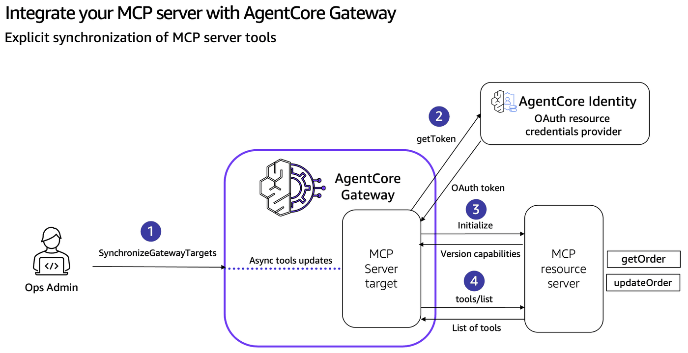
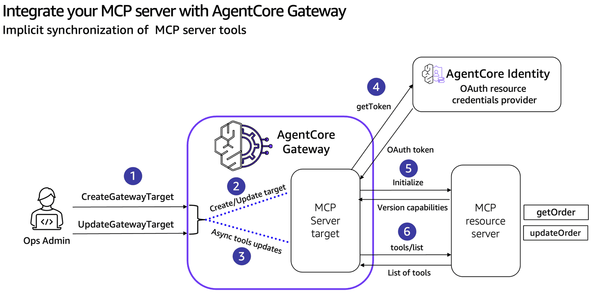

# Synchronizing MCP server capabilities with AgentCore Gateway

## Overview

Tool, prompt, and resource definitions on an MCP server change over time. AgentCore Gateway has three mechanisms for keeping its catalog in sync with what each MCP server target actually exposes:

1. **Explicit synchronization** — call `SynchronizeGatewayTargets` on demand after the upstream MCP server changes.
2. **Implicit synchronization** — `CreateGatewayTarget` and `UpdateGatewayTarget` always re-read the upstream server's catalog as part of the operation.
3. **Dynamic listing** (`listingMode='DYNAMIC'`) — Gateway forwards every list request (`tools/list`, `prompts/list`, `resources/list`, `resources/templates/list`) to the MCP server, so no synchronization is ever required.

> **How (1) and (2) relate to (3).** Explicit and implicit synchronization are both **control-plane operations on `listingMode='DEFAULT'` targets** — i.e. they populate the AgentCore Gateway *cache* that DEFAULT-mode list calls will be answered from. `CreateGatewayTarget` is the very first cache fill (implicit at create time); `UpdateGatewayTarget` refills it as a side effect of every update; `SynchronizeGatewayTargets` is the on-demand refill in between. DYNAMIC-mode targets are not cached during create or update operations. 

## Workshop roadmap

| Step | What you do |
|---|---|
| **1** | Set up the notebook environment (env vars, utilities, logging). |
| **2** | Create the AgentCore Gateway: Cognito inbound auth, IAM role, then the Gateway itself. |
| **3** | Deploy the initial FastMCP server (just `getOrder` + `updateOrder` for now) to AgentCore Runtime. |
| **4** | Wire that MCP Server in as a Gateway target (outbound OAuth, target creation, inbound token, `GatewayMCPClient` helper). |
| **5** | Demonstrate **explicit synchronization** — add a tool, redeploy, observe the gateway catalog stays stale until `SynchronizeGatewayTargets` runs. |
| **6** | Demonstrate **implicit synchronization** — add another tool, redeploy, then call `UpdateGatewayTarget` and watch the catalog refresh as a side effect. |
| **7** | Demonstrate **dynamic listing** — create a second target with `listingMode='DYNAMIC'`, and compare cached vs live across list tools operations. |
| **8** | Clean up. |

## Tutorial Details

| Information          | Details                                                              |
|:---------------------|:---------------------------------------------------------------------|
| Tutorial type        | Interactive                                                          |
| AgentCore components | AgentCore Gateway, AgentCore Identity, AgentCore Runtime             |
| Agentic Framework    | Strands Agents                                                       |
| Gateway Target type  | MCP server                                                           |
| MCP primitives       | Tools, Prompts, Resources (static and templated)                     |
| Inbound Auth IdP     | Amazon Cognito, but can use others                                   |
| Outbound Auth        | Amazon Cognito, but can use others                                   |
| LLM model            | Anthropic Claude Haiku 4.5                                           |
| Tutorial components  | Explicit sync, implicit sync, dynamic listing                        |
| Tutorial vertical    | Cross-vertical                                                       |
| Example complexity   | Easy                                                                 |
| SDK used             | boto3                                                                |

### Step 1: Setup & Prerequisites

To execute this tutorial you will need:
* Jupyter notebook (Python 3.10+ kernel)
* Node.js + npm — for the AgentCore CLI (`@aws/agentcore`, installed globally in the cell below)
* AWS credentials + region configured via `aws configure`, env vars, or instance role
* IAM permissions for CloudFormation, Cognito IDP, IAM, and Bedrock AgentCore (control + runtime)

> Shares the Cognito stack (`agentcore-gateway-lab`) with `01-mcp-server-target.ipynb` — `deploy_cognito_stack` reuses an existing stack idempotently, so you can run either notebook first. Each notebook creates its own gateway, IAM role, and MCP server agent (distinct names), so no resource collisions.

```python
# Install from the requirements file or pyproject.toml file in current directory
!pip install --force-reinstall -U -r requirements.txt --quiet
```

```python
!npm install -g @aws/agentcore
```

```python
%load_ext autoreload
%autoreload 2
```

```python
# Import utils
import utils
import logging
import boto3
import json
from time import sleep

# Configure logging for notebook environment
logging.basicConfig(
    level=logging.INFO,
    format="%(asctime)s | %(levelname)s | %(name)s | %(message)s",
    handlers=[logging.StreamHandler()],
)

# Set specific logger levels
logging.getLogger("gateway").setLevel(logging.INFO)

REGION = boto3.Session().region_name
COGNITO_STACK_NAME = "agentcore-gateway-lab"
TEMPLATE_PATH = "cloudformation/cognito-signup-stack.yaml"
MCP_SERVER_NAME = "lab2sync"
GATEWAY_NAME = "ac-gateway-mcp-server-sync"

cfn = boto3.client("cloudformation", region_name=REGION)
cognito = boto3.client("cognito-idp", region_name=REGION)
```

## Step 2: Create AgentCore Gateway

### Step 2.1: Deploy Cognito via CloudFormation

Deploy [`cloudformation/cognito-signup-stack.yaml`](cloudformation/cognito-signup-stack.yaml)

Note: In these labs, AgentCore Gateway is configured with Cognito for inbound authentication. This is done to keep the focus on AgentCore Gateway patterns. For your enterprise workloads, you can configure any OAuth 2.0 compliant identity provider for inbound authentication (e.g., Entra ID, Auth0, Okta): see [Identity provider setup](https://docs.aws.amazon.com/bedrock-agentcore/latest/devguide/identity-idps.html). For outbound authorization between AgentCore Gateway and your targets, we recommend setting up [AgentCore Gateway Identity credential management](https://docs.aws.amazon.com/bedrock-agentcore/latest/devguide/what-is-bedrock-agentcore.html).

```python
outputs = utils.deploy_cognito_stack(cfn, COGNITO_STACK_NAME, TEMPLATE_PATH)

# Gateway inbound
gw_user_pool_id = outputs["UserPoolId"]
gw_client_id = outputs["GatewayClientId"]
gw_cognito_discovery_url = outputs["DiscoveryUrl"]
scopeString = outputs["GatewayScope"]
token_endpoint = outputs["TokenEndpoint"]
gw_client_secret = cognito.describe_user_pool_client(
    UserPoolId=gw_user_pool_id, ClientId=gw_client_id
)["UserPoolClient"]["ClientSecret"]

# Outbound to MCP server (same pool)
runtime_user_pool_id = gw_user_pool_id
runtime_client_id = outputs["MCPClientId"]
runtime_cognito_discovery_url = gw_cognito_discovery_url
runtimeScopeString = outputs["MCPScope"]
runtime_client_secret = cognito.describe_user_pool_client(
    UserPoolId=runtime_user_pool_id, ClientId=runtime_client_id
)["UserPoolClient"]["ClientSecret"]

print(f"Stack:              {COGNITO_STACK_NAME}")
print(f"User Pool ID:       {gw_user_pool_id}")
print(f"Discovery URL:      {gw_cognito_discovery_url}")
print(f"Token endpoint:     {token_endpoint}")
print(f"Gateway client ID:  {gw_client_id}")
print(f"MCP client ID:      {runtime_client_id}")
print(f"Gateway scope:      {scopeString}")
print(f"MCP scope:          {runtimeScopeString}")
```

### Step 2.2: Create AgentCore Gateway IAM Role

```python
agentcore_gateway_iam_role = utils.create_agentcore_gateway_role_with_region(
    GATEWAY_NAME, REGION
)
print("AgentCore Gateway role ARN:", agentcore_gateway_iam_role["Role"]["Arn"])
```

### Step 2.3: Create AgentCore Gateway

```python
gateway_client = boto3.client("bedrock-agentcore-control", region_name=REGION)

auth_config = {
    "customJWTAuthorizer": {
        "allowedClients": [gw_client_id],
        "discoveryUrl": gw_cognito_discovery_url,
    }
}

# IMPORTANT: searchType="NONE" — Step 7's DYNAMIC target requires this.
# Per gateway-target-MCPservers.html: "Dynamic MCP targets
# (listingMode=DYNAMIC) are not supported on gateways with semantic search
# enabled." Notebook 01 uses searchType="SEMANTIC" because it doesn't create
# DYNAMIC targets.
create_response = gateway_client.create_gateway(
    name=GATEWAY_NAME,
    roleArn=agentcore_gateway_iam_role["Role"]["Arn"],
    protocolType="MCP",
    protocolConfiguration={"mcp": {"supportedVersions": ["2025-11-25"]}},
    authorizerType="CUSTOM_JWT",
    authorizerConfiguration=auth_config,
    description="AgentCore Gateway with MCP Server target (sync demos)",
)
gatewayID = create_response["gatewayId"]
gatewayURL = create_response["gatewayUrl"]
print(f"Gateway ID:  {gatewayID}")
print(f"Gateway URL: {gatewayURL}")
```

### Step 3: Deploy MCP Server on AgentCore Runtime

### Step 3.1: View the MCP server code and register the agent

Lives at [`mcpservers/app/labsync/main.py`](mcpservers/app/labsync/main.py). The sync demos in Steps 5 and 6 work by *adding* tools to this file and watching when the gateway notices. Start small: just two tools.

```python
from IPython.display import Code

Code("mcpservers/app/labsync/main.py", language="python")
```

```python
!cd mcpservers && agentcore add agent \
    --name {MCP_SERVER_NAME} \
    --type byo \
    --language Python \
    --protocol MCP \
    --code-location app/labsync \
    --authorizer-type CUSTOM_JWT \
    --discovery-url {runtime_cognito_discovery_url} \
    --allowed-clients {runtime_client_id} \
    --allowed-scopes {runtimeScopeString}
```

### Step 3.2: Deploy via the AgentCore CLI

```python
!cd mcpservers && agentcore deploy
```

```python
agent = utils.get_agent_status(MCP_SERVER_NAME)

mcp_arn = agent["identifier"]
mcp_url = agent["invocationUrl"]
mcp_id = mcp_arn.split("/")[-1]

print(f"mcp_arn: {mcp_arn}")
print(f"mcp_id:  {mcp_id}")
print(f"mcp_url: {mcp_url}")
```

## Step 4: Wire the MCP Server in as a Gateway Target

### Step 4.1: Configure outbound auth (OAuth2 credential provider)

The gateway needs an OAuth2 credential provider to call the runtime's MCP server with a Cognito-issued bearer token.

```python
identity_client = boto3.client("bedrock-agentcore-control", region_name=REGION)

cognito_provider = identity_client.create_oauth2_credential_provider(
    name=f"{GATEWAY_NAME}-identity",
    credentialProviderVendor="CustomOauth2",
    oauth2ProviderConfigInput={
        "customOauth2ProviderConfig": {
            "oauthDiscovery": {"discoveryUrl": runtime_cognito_discovery_url},
            "clientId": runtime_client_id,
            "clientSecret": runtime_client_secret,
        }
    },
)
cognito_provider_arn = cognito_provider["credentialProviderArn"]
print(cognito_provider_arn)
```

### Step 4.2: Create the Gateway Target

```python
create_gateway_target_response = gateway_client.create_gateway_target(
    name="mcp-server-target",
    gatewayIdentifier=gatewayID,
    targetConfiguration={"mcp": {"mcpServer": {"endpoint": mcp_url}}},
    credentialProviderConfigurations=[
        {
            "credentialProviderType": "OAUTH",
            "credentialProvider": {
                "oauthCredentialProvider": {
                    "providerArn": cognito_provider_arn,
                    "scopes": [runtimeScopeString],
                }
            },
        },
    ],
    # Forward the client-supplied `Mcp-Session-Id` to the runtime in both
    # directions so AgentCore Runtime can pin requests to a specific microvm.
    metadataConfiguration={
        "allowedRequestHeaders": ["Mcp-Session-Id"],
        "allowedResponseHeaders": ["Mcp-Session-Id"],
    },
)
gatewayTargetID = create_gateway_target_response["targetId"]
print(f"Created target: {gatewayTargetID}")
```

### Step 4.3: Verify the Gateway Target is READY

```python
list_targets_response = gateway_client.list_gateway_targets(gatewayIdentifier=gatewayID)
print(list_targets_response)
```

### Step 4.4: Get an inbound access token

```python
token_response = utils.get_token(
    token_endpoint, gw_client_id, gw_client_secret, scopeString
)
token = token_response["access_token"]
print("Token (truncated):", token[:60], "...")
```

### Step 4.5: Set up the `GatewayMCPClient` helper

`gateway_mcp_client.GatewayMCPClient` (defined alongside the notebook) wraps the bearer-token + `MCP-Protocol-Version` + JSON-RPC plumbing so the demo cells can call `mcp.list_tools()` etc. as one-liners. Created once here, reused throughout the rest of the workshop.

```python
import uuid
from gateway_mcp_client import GatewayMCPClient


def _get_inbound_token() -> str:
    return utils.get_token(token_endpoint, gw_client_id, gw_client_secret, scopeString)[
        "access_token"
    ]


session_id = str(uuid.uuid4())
```

```python
mcp = GatewayMCPClient(gatewayURL, _get_inbound_token, session_id=session_id)

print(json.dumps(mcp.list_tools(), indent=2))
```

## Step 5: Explicit synchronization with `SynchronizeGatewayTargets`

### Step 5.1: Background

`SynchronizeGatewayTargets` is a **control-plane operation that refills the catalog cache for `listingMode='DEFAULT'` targets** — Gateway opens a session with the MCP server, retrieves and processes its catalog (tools, prompts, resources, resource templates), prefixes tool/prompt names with the target name to prevent collisions, and updates its persistent index.

Because this populates a *cache*, it only matters for DEFAULT-mode targets. DYNAMIC-mode targets never read from the cache, so calling `SynchronizeGatewayTargets` on them is unnecessary.

Below we update [`mcpservers/app/labsync/main.py`](mcpservers/app/labsync/main.py) to add a new tool (`cancelOrder`), redeploy, observe that the gateway's tool list still doesn't include it (the cache is stale), then call `SynchronizeGatewayTargets` and watch the new tool appear.



### Step 5.2: Update the MCP server (add `cancelOrder`)

```python
%%writefile mcpservers/app/labsync/main.py
from mcp.server.fastmcp import FastMCP

mcp = FastMCP(host="0.0.0.0", stateless_http=True)

@mcp.tool()
def getOrder() -> int:
    """Get an order"""
    return 123

@mcp.tool()
def updateOrder(orderId: int) -> int:
    """Update existing order"""
    return 456

@mcp.tool()
def cancelOrder(orderId: int) -> int:
    """cancel existing order"""
    return 789

if __name__ == "__main__":
    mcp.run(transport="streamable-http")
```

### Step 5.3: Re-deploy the runtime

```python
print("Re-deploying the MCP server with the live additions...")
!cd mcpservers && agentcore deploy
```

### Step 5.4: List tools through the gateway — still stale

Call `tools/list`. The new `cancelOrder` should NOT appear yet, because the gateway's catalog was last synced before we added the tool.

```python
session_id = str(uuid.uuid4())

mcp = GatewayMCPClient(gatewayURL, _get_inbound_token, session_id=session_id)

print(json.dumps(mcp.list_tools(), indent=2))
```

### Step 5.5: Call `SynchronizeGatewayTargets`

```python
sync_response = gateway_client.synchronize_gateway_targets(
    gatewayIdentifier=gatewayID,
    targetIdList=[gatewayTargetID],
)
print(sync_response)
```

### Step 5.6: List tools again — sync caught the new tool

```python
session_id = str(uuid.uuid4())

mcp = GatewayMCPClient(gatewayURL, _get_inbound_token, session_id=session_id)

sleep(10)
print(json.dumps(mcp.list_tools(), indent=2))
```

## Step 6: Implicit synchronization with `UpdateGatewayTarget`

### Step 6.1: Background

`CreateGatewayTarget` and `UpdateGatewayTarget` are also **control-plane operations on `listingMode='DEFAULT'` targets**, and they perform the same catalog refill as `SynchronizeGatewayTargets` — just bundled into the same call as the create/update. `CreateGatewayTarget` is the very first cache fill for a new target; `UpdateGatewayTarget` refills it as an automatic side effect of every update. No separate sync call is needed afterwards.

Like explicit sync, this only matters for DEFAULT-mode targets. DYNAMIC targets don't have a cache to fill.

Below we add `deleteOrder` to the MCP server, redeploy, then call `UpdateGatewayTarget` on the existing target. The catalog refresh happens implicitly.



### Step 6.2: Update the MCP server (add `deleteOrder`)

```python
%%writefile mcpservers/app/labsync/main.py
from mcp.server.fastmcp import FastMCP

mcp = FastMCP(host="0.0.0.0", stateless_http=True)

@mcp.tool()
def getOrder() -> int:
    """Get an order"""
    return 123

@mcp.tool()
def updateOrder(orderId: int) -> int:
    """Update existing order"""
    return 456

@mcp.tool()
def cancelOrder(orderId: int) -> int:
    """cancel existing order"""
    return 789

@mcp.tool()
def deleteOrder(orderId: int) -> int:
    """delete existing order"""
    return 101
    
if __name__ == "__main__":
    mcp.run(transport="streamable-http")
```

### Step 6.3: Re-deploy the runtime

```python
print("Re-deploying the MCP server with the live additions...")
!cd mcpservers && agentcore deploy
```

### Step 6.4: Call `UpdateGatewayTarget` — implicit sync

```python
update_gateway_target_response = gateway_client.update_gateway_target(
    gatewayIdentifier=gatewayID,
    targetId=gatewayTargetID,
    name="mcp-server-target",
    targetConfiguration={"mcp": {"mcpServer": {"endpoint": mcp_url}}},
    credentialProviderConfigurations=[
        {
            "credentialProviderType": "OAUTH",
            "credentialProvider": {
                "oauthCredentialProvider": {
                    "providerArn": cognito_provider_arn,
                    "scopes": [runtimeScopeString],
                }
            },
        },
    ],
)
print(update_gateway_target_response)
```

### Step 6.5: List tools again — the implicit sync caught the new tool

```python
sleep(10)
session_id = str(uuid.uuid4())
mcp = GatewayMCPClient(gatewayURL, _get_inbound_token, session_id=session_id)

print(json.dumps(mcp.list_tools(), indent=2))
```

## Step 7: Dynamic listing with `listingMode='DYNAMIC'`

### Step 7.1: Background — DEFAULT vs DYNAMIC

By default, AgentCore Gateway *caches* the capabilities (tools, prompts, resources, resource templates) it discovered when the target was created, updated, or last synchronized. With `listingMode='DEFAULT'`, the four MCP list operations are answered from Gateway's catalog **without invoking the upstream MCP server**. Fast and resilient, but stale until the next sync.

With `listingMode='DYNAMIC'`, every list request is forwarded to the upstream MCP server, and no synchronization is ever required.

A few things to note:

- DYNAMIC mode is **not interoperable with semantic search** (`x_amz_bedrock_agentcore_search`) or with outbound three-legged OAuth (3LO).
- DYNAMIC mode applies uniformly across all four primitive types — tools, prompts, resources, and resource templates.

### Step 7.2: Extend the MCP server with prompts, resources, and a resource template

To demonstrate DEFAULT vs DYNAMIC for **all four** list operations, the upstream MCP server needs to expose all four primitive types. Rewrite [`mcpservers/app/labsync/main.py`](mcpservers/app/labsync/main.py) to add prompts and resources alongside the existing tools, and add a fresh tool `archiveOrder` so the cached/live contrast is visible on the tools axis too.

```python
%%writefile mcpservers/app/labsync/main.py
import json

from mcp.server.fastmcp import FastMCP

mcp = FastMCP(host="0.0.0.0", stateless_http=True)


@mcp.tool()
def getOrder() -> int:
    """Get an order"""
    return 123


@mcp.tool()
def updateOrder(orderId: int) -> int:
    """Update existing order"""
    return 456


@mcp.tool()
def cancelOrder(orderId: int) -> int:
    """Cancel existing order"""
    return 789


@mcp.tool()
def deleteOrder(orderId: int) -> int:
    """Delete existing order"""
    return 101


@mcp.tool()
def archiveOrder(orderId: int) -> int:
    """Archive existing order"""
    return 202


if __name__ == "__main__":
    mcp.run(transport="streamable-http")
```

### Step 7.3: Re-deploy Runtime

```python
print("Re-deploying the MCP server with the live additions...")
!cd mcpservers && agentcore deploy
```

### Step 7.4: Create a new gateway target with `listingMode='DYNAMIC'`

Rather than mutate the existing `mcp-server-target` (which uses the default `listingMode='DEFAULT'`), create a *separate* target so both modes coexist on the same gateway and can be compared side-by-side. Both targets point at the same upstream MCP server URL, but they will report different capabilities depending on whether they read from a cache or from the live server.

```python
create_dynamic_target_response = gateway_client.create_gateway_target(
    name="mcp-server-target-dynamic",
    gatewayIdentifier=gatewayID,
    targetConfiguration={
        "mcp": {
            "mcpServer": {
                "endpoint": mcp_url,
                "listingMode": "DYNAMIC",
            }
        }
    },
    credentialProviderConfigurations=[
        {
            "credentialProviderType": "OAUTH",
            "credentialProvider": {
                "oauthCredentialProvider": {
                    "providerArn": cognito_provider_arn,
                    "scopes": [runtimeScopeString],
                }
            },
        },
    ],
    metadataConfiguration={
        "allowedRequestHeaders": ["Mcp-Session-Id"],
        "allowedResponseHeaders": ["Mcp-Session-Id"],
    },
)
dynamicTargetID = create_dynamic_target_response["targetId"]
print(f"Created DYNAMIC target: {dynamicTargetID}")
```

### Step 7.5: Side-by-side list tools (before any live changes)

Both targets currently point at the same MCP server URL. The DEFAULT target's catalog is whatever was last synced (from Steps 5 and 6 above). The DYNAMIC target was just created and will fetch its capabilities live on every list call.

> **Pagination is per-target.** When multiple targets are attached, `tools/list` returns **one target's tools per page**, with a `nextCursor` for the next target.

```python
mcp = GatewayMCPClient(gatewayURL, _get_inbound_token, session_id=session_id)

mcp.list_tools()
```

```python
all_tools = mcp.list_all_tools()
print(f"{len(all_tools)} tools across both targets:")
for t in all_tools:
    print(f"  - {t['name']}")
```

### Step 7.6: DEFAULT vs DYNAMIC summary

| Aspect | DEFAULT | DYNAMIC |
|---|---|---|
| `tools/list`, `prompts/list`, `resources/list`, `resources/templates/list` | served from Gateway cache | forwarded to MCP server live |
| `tools/call`, `prompts/get`, `resources/read` | live to MCP server | live to MCP server |
| Requires `SynchronizeGatewayTargets` after capability changes | yes | no |
| Compatible with semantic search (`x_amz_bedrock_agentcore_search`) | yes | no |
| Compatible with outbound 3LO OAuth | yes | no |

## Step 8: Clean up

This is the end of the workshop. Uncomment the cell below to tear down everything you created — gateway, OAuth2 credential provider, runtime, both Cognito user pools, and the gateway IAM role.

```python
## Step 8.1: Delete the Gateway (transitively deletes both targets — DEFAULT and DYNAMIC)
utils.delete_gateway(gateway_client, gatewayID)
```

```python
## Step 8.2: Delete the OAuth2 credential provider
identity_client.delete_oauth2_credential_provider(name=f"{GATEWAY_NAME}-identity")
```

```python
## Step 8.3: Delete MCP server on AgentCore Runtime
!cd mcpservers && agentcore remove agent --name {MCP_SERVER_NAME} -y
!cd mcpservers && agentcore deploy -y
```

```python
# ## Step 8.4: Delete the Cognito CloudFormation stack (user pool, domain, resource server, all clients)
# ## Delete Cognito stack when this stack is not being used by other labs
# print(f"Deleting stack {COGNITO_STACK_NAME}...")
# cfn.delete_stack(StackName=COGNITO_STACK_NAME)
# cfn.get_waiter("stack_delete_complete").wait(StackName=COGNITO_STACK_NAME)
# print(f"✅ Stack {COGNITO_STACK_NAME} deleted")
```

```python
## Step 8.5: Delete the Gateway IAM role (not part of the CFN stack)
utils.delete_iam_role(f"agentcore-{GATEWAY_NAME}-role")
```
