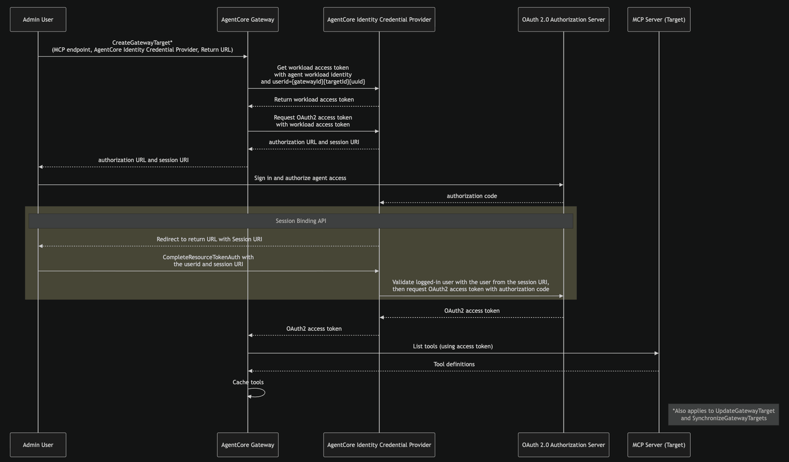
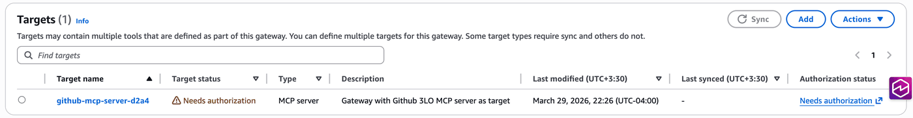
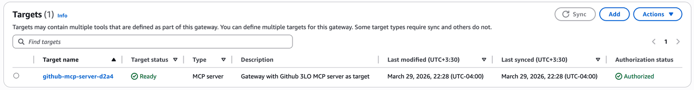
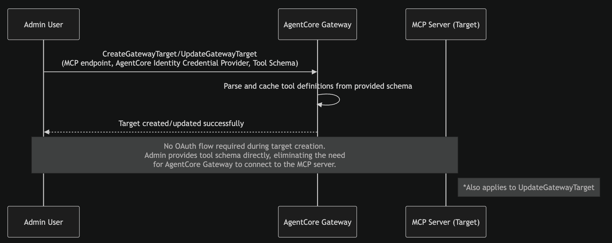
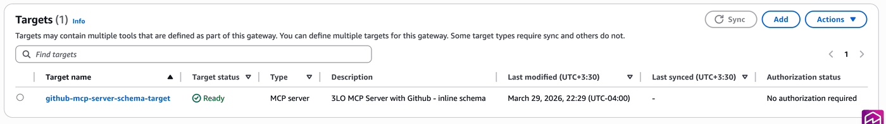
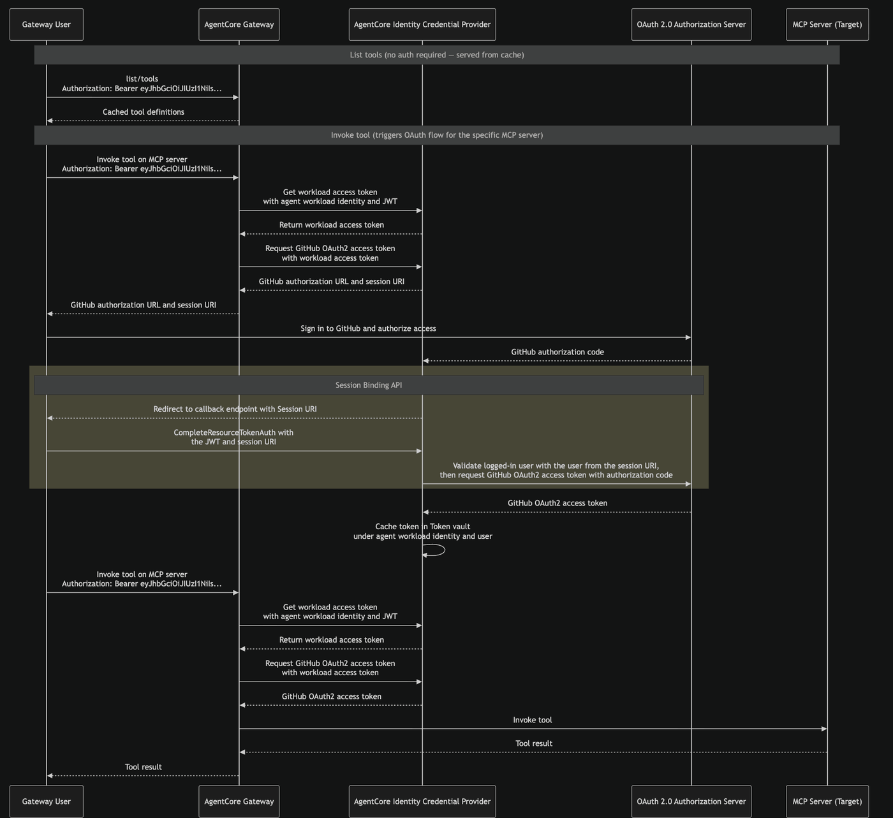

# Connecting Github MCP Server to Amazon Bedrock AgentCore Gateway - [URL Mode Elicitation](https://modelcontextprotocol.io/specification/2025-11-25/client/elicitation#url-mode-flow)

Copyright Amazon.com, Inc. or its affiliates. All Rights Reserved. SPDX-License-Identifier: Apache-2.0

To provide support for Authorization Code Grant type, we provide two ways for target creations. 

1. Implicit sync during MCP Server target creation

    In this method, the admin user completes the authorization code flow during [CreateGatewayTarget](https://docs.aws.amazon.com/bedrock-agentcore-control/latest/APIReference/API_CreateGatewayTarget.html), [UpdateGatewayTarget](https://docs.aws.amazon.com/bedrock-agentcore-control/latest/APIReference/API_UpdateGatewayTarget.html), or [SynchronizeGatewayTargets](https://docs.aws.amazon.com/bedrock-agentcore-control/latest/APIReference/API_SynchronizeGatewayTargets.html) operations, allowing  AgentCore Gateway to discover and cache the MCP server's tools upfront.  

2. Provide schema upfront during MCP Server targets creating 

    With this method, admin users provide the tool schema directly during [CreateGatewayTarget](https://docs.aws.amazon.com/bedrock-agentcore-control/latest/APIReference/API_CreateGatewayTarget.html) or [UpdateGatewayTarget](https://docs.aws.amazon.com/bedrock-agentcore-control/latest/APIReference/API_UpdateGatewayTarget.html) operations, rather than AgentCore Gateway fetching them dynamically from the MCP server. AgentCore Gateway parses the provided schema and caches the tool definitions. This eliminates the need for the admin user to complete the authorization code flow during target creation or update. This is the recommended approach when human intervention is not possible during create/update operations, such as when using a Infrastructure-as-code pipeline to manage AgentCore Gateway resources. Also, this method is beneficial when you do not want to expose all the tools provided by the MCP server target, i.e. you only expose the tools you require in the tool schema.  

    Note: Since tool schemas are provided upfront with this method, the [SynchronizeGatewayTargets](https://docs.aws.amazon.com/bedrock-agentcore-control/latest/APIReference/API_SynchronizeGatewayTargets.html) operation is not supported. You can switch a target between Method 1 and Method 2 by updating the target configuration.

This means AgentCore Gateway users will be able to call `list/tools` without being prompted to authenticate with the MCP server authentication server, as this fetches the cached tools. The authorization code flow is only triggered when a Gateway user invokes a tool on that MCP server. This is particularly beneficial when multiple MCP servers are attached to a single Gateway — users can browse the full tool catalog (cached tools) without authenticating to every MCP server and only complete the flow for the specific server whose tool they invoke.

### URL Session Binding 

[URL Session Binding](https://docs.aws.amazon.com/bedrock-agentcore/latest/devguide/oauth2-authorization-url-session-binding.html) ensures that the user who initiated the OAuth authorization request is the same user who granted consent. When AgentCore Identity generates an authorization URL, it also returns a session-URI. After the user completes consent, the browser redirects back to a callback URL with the session-URI. The application then is responsible for calling the [CompleteResourceTokenAuth](https://docs.aws.amazon.com/bedrock-agentcore/latest/APIReference/API_CompleteResourceTokenAuth.html) API, presenting both the user's identity and the session-URI. AgentCore Identity validates that the user who started the flow is the same user who completed it before exchanging the authorization code for an access token. This prevents a scenario where a user accidentally shares the authorization URL, and someone else completes the consent, which would grant access tokens to the wrong party. The authorization URL and session URI are only valid for 10 minutes, further limiting the window for misuse. Session binding applies during admin target creation (implicit sync) and during tool invocation.

### Security Considerations

- **Credential Handling**: OAuth client secrets are collected via `getpass` and stored only in memory during notebook execution. For production, store secrets in AWS Secrets Manager and retrieve them programmatically.
- **Least Privilege IAM**: The AWS Identity and Access Management (IAM) role created in this notebook follows least-privilege principles with scoped-down policies for specific AgentCore resources.
- **Token Expiry**: Access tokens and authorization URLs expire after a limited time (typically 1 hour for tokens, 10 minutes for authorization URLs). Expired tokens are automatically refreshed by AgentCore Identity when refresh tokens are available.
- **Logging**: For production deployments, enable AWS CloudTrail to log all AgentCore API calls and configure Amazon CloudWatch for monitoring gateway invocations.
- **Shared Responsibility**: AWS manages the AgentCore Gateway infrastructure and AgentCore Identity service. Customers are responsible for securing their OAuth app credentials, configuring appropriate IAM policies, and implementing secure callback endpoints for session binding.

## Setup GitHub [OAuth Apps](https://docs.github.com/en/apps/oauth-apps/using-oauth-apps) setup

```python
import getpass

GITHUB_CLIENT_ID = input("Enter your GitHub Client ID: ")
GITHUB_CLIENT_SECRET = getpass.getpass("Enter your GitHub Client Secret: ")

assert GITHUB_CLIENT_ID.strip(), "Client ID cannot be empty"
assert GITHUB_CLIENT_SECRET.strip(), "Client Secret cannot be empty"
```

```python
!pip install -r requirements.txt --force-reinstall -q
```

```python
import boto3
import os
from utils import utils
import json
import requests
import uuid

session = boto3.session.Session()
REGION = session.region_name

os.environ["AWS_DEFAULT_REGION"] = REGION
print(f"Using region: {REGION}")

GATEWAY_NAME = "ac-gateway-mcp-server"
CRED_PROVIDER_NAME = "github-mcp-server-provider"

agentcore_cp = boto3.client("bedrock-agentcore-control")
cognito = boto3.client("cognito-idp", region_name=REGION)
```

### Step 1: GitHub Credential Provider

```python
response = agentcore_cp.create_oauth2_credential_provider(
    name=CRED_PROVIDER_NAME,
    credentialProviderVendor="GithubOauth2",
    oauth2ProviderConfigInput={
        "githubOauth2ProviderConfig": {
            "clientId": GITHUB_CLIENT_ID,
            "clientSecret": GITHUB_CLIENT_SECRET,
        }
    },
    tags={"demo": "github-mcp-gateway"},
)

identity_callback = response["callbackUrl"]
cred_provider_arn = response["credentialProviderArn"]
secret_arn = response["clientSecretArn"]["secretArn"]

print(f"Callback URL: {identity_callback}")
```

**Important:** Make sure to go back to [GitHub OAuth provider](https://github.com/settings/apps) you created and update the Authorization callback URL to the value provided as output in the step above.

```python
print("Go to https://github.com/settings/apps and update your GitHub App's")
print(f"Authorization callback URL to:\n\n  {identity_callback}\n")
input("Press Enter once you have updated the callback URL to continue...")
```

### Step 2: Create AgentCore Gateway

### Step 2.1: Setup Cognito to manage Inbound Auth to Gateway

In this demo we are using Amazon Cognito to manage inbound authentication for AgentCore Gateway, however for your enterprise needs you can configure any OAuth 2.0 compliant IDP. Inbound configuration managed who is allowed to invoke the AgentCore Gateway. Checkout [setup](https://docs.aws.amazon.com/bedrock-agentcore/latest/devguide/identity-idp-microsoft.html) steps for Okta, Entra ID, Auth, etc.

```python
USER_POOL_NAME = "sample-agentcore-gateway-pool"
RESOURCE_SERVER_ID = "sample-agentcore-gateway-id"
RESOURCE_SERVER_NAME = "sample-agentcore-gateway-name"
CLIENT_NAME = "sample-agentcore-gateway-client"
SCOPES = [
    {
        "ScopeName": "invoke",  # Just 'invoke', will be formatted as resource_server_id/invoke
        "ScopeDescription": "Scope for invoking the agentcore gateway",
    },
]

scope_names = [f"{RESOURCE_SERVER_ID}/{scope['ScopeName']}" for scope in SCOPES]
scopeString = " ".join(scope_names)
```

```python
print("Creating or retrieving Cognito resources...")
gw_user_pool_id = utils.get_or_create_user_pool(cognito, USER_POOL_NAME)
print(f"User Pool ID: {gw_user_pool_id}")

utils.get_or_create_resource_server(
    cognito, gw_user_pool_id, RESOURCE_SERVER_ID, RESOURCE_SERVER_NAME, SCOPES
)
print("Resource server ensured.")

gw_client_id, gw_client_secret = utils.get_or_create_m2m_client(
    cognito, gw_user_pool_id, CLIENT_NAME, RESOURCE_SERVER_ID, scope_names
)

print(f"Client ID: {gw_client_id}")

# Get discovery URL
gw_cognito_discovery_url = f"https://cognito-idp.{REGION}.amazonaws.com/{gw_user_pool_id}/.well-known/openid-configuration"
print(gw_cognito_discovery_url)
```

### Step 2.2: Create AgentCore Gateway AWS Identity and Access Management (IAM) Role

```python
agentcore_gateway_iam_role = utils.create_agentcore_gateway_role(
    GATEWAY_NAME, cred_provider_arn, secret_arn
)
print("Agentcore gateway role ARN: ", agentcore_gateway_iam_role["Role"]["Arn"])
```

### Step 2.3: Create AgentCore Gateway

```python
auth_config = {
    "customJWTAuthorizer": {
        "allowedClients": [
            gw_client_id
        ],  # Client MUST match with the ClientId configured in Cognito
        "discoveryUrl": gw_cognito_discovery_url,
    }
}
create_response = agentcore_cp.create_gateway(
    name=GATEWAY_NAME,
    roleArn=agentcore_gateway_iam_role["Role"][
        "Arn"
    ],  # The IAM Role must have permissions to create/list/get/delete Gateway
    protocolType="MCP",
    protocolConfiguration={
        "mcp": {"supportedVersions": ["2025-11-25"], "searchType": "SEMANTIC"}
    },
    authorizerType="CUSTOM_JWT",
    authorizerConfiguration=auth_config,
    description="AgentCore Gateway with MCP Server target",
)
# Retrieve the GatewayID used for GatewayTarget creation
gateway_id = create_response["gatewayId"]
gateway_url = create_response["gatewayUrl"]

print(gateway_id)
```

### Step 3 (Method 1): Implicit sync during MCP Server target creation



1. The admin user calls `CreateGatewayTarget`, providing the MCP server endpoint, the AgentCore Identity Credential Provider, and return URL. This tells AgentCore Gateway which MCP server to connect to and which credential provider to use for obtaining OAuth 2.0 tokens. This same flow also applies to `UpdateGatewayTarget` and `SynchronizeGatewayTargets` operations. 

2. AgentCore Gateway requests a workload access token from the AgentCore Identity Credential Provider, passing the AgentCore Gateway workload identity and a user ID in the format `{gatewayId}{targetId}{uuid}`. This workload access token identifies the AgentCore Gateway as an authorized caller for subsequent credential operations. 

3. Using the workload access token, AgentCore Gateway requests an OAuth 2.0 access token from the AgentCore Identity Credential Provider. This provides the admin user with an authorization URL and a session-URI. At this stage, the target is in `Needs Authorization` status.  

4. The admin opens the authorization URL in their browser, signs in, and grants the requested permissions to the AgentCore Gateway. 

5. After the admin grants consent, OAuth 2.0 authorization server sends an authorization code to the AgentCore Identity Credential Provider's registered callback endpoint. 

6. The credential provider redirects the admin browser to the return URL, with the session URI. The admin application calls `CompleteResourceTokenAuth`, presenting the user id and the session-URI returned in step 2. The credential provider validates that the user who initiated the authorization flow (step 3) is the same user who completed consent, preventing token hijacking if the authorization URL was accidentally shared. If the flow was initiated from the AWS Console, this step is handled automatically. If initiated from any other context, the admin is responsible for calling the `CompleteResourceTokenAuth` API directly. 

7. After successful session binding validation, the credential provider exchanges the authorization code with OAuth 2.0 authorization server for a OAuth 2.0 access token. 

8. This access token is used to list the tools on MCP server target; returned tool definitions from the target are cached at AgentCore Gateway.  

It is important to note that a subsequent update or synchronization to the target will not reuse the access token, but instead AgentCore Identity will get a new access token from Authorization Server.

```python
CALLBACK_URL = "http://localhost:8080/callback"

target_response = agentcore_cp.create_gateway_target(
    gatewayIdentifier=gateway_id,
    name=f"github-mcp-server-{str(uuid.uuid4())[:4]}",
    description="Gateway with Github authorization code flow MCP server as target",
    targetConfiguration={
        "mcp": {"mcpServer": {"endpoint": "https://api.githubcopilot.com/mcp"}}
    },
    credentialProviderConfigurations=[
        {
            "credentialProviderType": "OAUTH",
            "credentialProvider": {
                "oauthCredentialProvider": {
                    "providerArn": cred_provider_arn,
                    "grantType": "AUTHORIZATION_CODE",
                    "defaultReturnUrl": CALLBACK_URL,
                    "scopes": ["repo", "user", "workflow"],
                }
            },
        }
    ],
)

target_id = target_response["targetId"]
authorizationUrl = target_response["authorizationData"]["oauth2"]["authorizationUrl"]
userId = target_response["authorizationData"]["oauth2"]["userId"]

print(f"Target ID: {target_id}")
print(f"Target status: {target_response['status']}")
print(f"User ID: {userId}")
```

After creating the target, the target will be in `Needs authorization` status. At this point admin users are required to complete the authorization request, either directly from AWS console or by navigating to the authorization URL directly. It is important to note that if the flow is completed from the AWS console, session binding is handled automatically. But if initiated from any other context, the admin is responsible for calling the `CompleteResourceTokenAuth` API directly. Please follow the code sample here for more details.  



```python
utils.start_callback_and_open_auth(authorizationUrl, "user-id", userId, REGION)
```

After a few seconds you will see the target is in `Ready` status with authorization status `Authorized`.  



### Step 3 (Method 2): Provide schema upfront during MCP Server targets creating



```python
with open("schema/github.json", "r") as f:
    tool_schema = f.read()

schema_target_response = agentcore_cp.create_gateway_target(
    gatewayIdentifier=gateway_id,
    name="github-mcp-server-schema-target",
    description="Github MCP Server with authorization code flow - inline schema",
    targetConfiguration={
        "mcp": {
            "mcpServer": {
                "endpoint": "https://api.githubcopilot.com/mcp",
                "mcpToolSchema": {"inlinePayload": tool_schema},
            }
        }
    },
    credentialProviderConfigurations=[
        {
            "credentialProviderType": "OAUTH",
            "credentialProvider": {
                "oauthCredentialProvider": {
                    "providerArn": cred_provider_arn,
                    "grantType": "AUTHORIZATION_CODE",
                    "defaultReturnUrl": CALLBACK_URL,
                    "scopes": ["repo", "user", "workflow"],
                }
            },
        }
    ],
)

schema_target_id = schema_target_response["targetId"]
print(f"Target ID: {schema_target_id}")
print(f"Target status: {schema_target_response['status']}")
```

The target in this case becomes immediately ready, with authorization status `No authorization required`. 



### Step 4: Invoke AgentCore Gateway



1. The gateway user sends a `tools/list` request to AgentCore Gateway with their inbound authorization token. Since tool definitions were cached during target creation, AgentCore Gateway returns the cached tool definitions immediately. 

2. The gateway user sends `tools/call` request to AgentCore Gateway with their inbound authorization token. This triggers the OAuth authorization code flow for the specific MCP server target, since AgentCore Gateway needs an access token to call the MCP server on behalf of this user. 

3. AgentCore Gateway requests a workload access token from AgentCore Identity, passing the workload identity and the user's JWT from the inbound authorization header. 

4. Using the workload access token, AgentCore Gateway requests an OAuth 2.0 access token from the credential provider. Since no valid token exists yet for this user, the credential provider returns an authorization URL and a session-URI instead. 

6. AgentCore Gateway passes the authorization URL and session URI back to the gateway user. The user opens the authorization URL in their browser, signs in to the OAuth  2.0 authorization server, and grants the requested permissions. Sample URL elicitation response from AgentCore Gateway is as follows:  

    ```json 

    {     
        "jsonrpc": "2.0",                                                      
        "id": 3,     
        "error": {    
            "code": -32042,      
            "message": "This request requires more information.",    
            "data": { 
                "elicitations": [{ 
                "mode": "url", 
                "elicitationId": "<ID>",      
                "url": "<identity_url>/?request_uri=urn%3Aietf%3A...", 
                "message": "Please login to this URL for authorization." 
                }]       
            }        
        } 
    } 

    ``` 

6. After the user grants consent, the OAuth 2.0 authorization server sends an authorization code to the AgentCore Identity Credential Provider's registered callback endpoint. 

7. The credential provider redirects the user's browser to the return URL with the session URI. The user's application calls `CompleteResourceTokenAuth`, presenting the user's JWT and the session-URI. The credential provider validates that the user who initiated the authorization flow (Step 4) is the same user who completed consent, preventing token hijacking if the authorization URL was accidentally shared. 

8. After successful session binding validation, the credential provider exchanges the authorization code with the OAuth 2.0 authorization server for an OAuth 2.0 access token. The credential provider caches this token in the Token Vault under the workload identity and user identity. 

9. When the gateway user issues a `tools/call` request again, AgentCore Gateway gets the cached token, using workload identity and user identity, from AgentCore Identity and uses that to call the MCP server.

#### Step 4.1: List tools

```python
# Get Cognito access token for gateway inbound auth
access_token = utils.get_token(
    gw_user_pool_id, gw_client_id, gw_client_secret, scopeString, REGION
)["access_token"]

headers = {
    "Content-Type": "application/json",
    "Accept": "application/json, text/event-stream",
    "Authorization": f"Bearer {access_token}",
    "Mcp-Protocol-Version": "2025-11-25",
}

# 1. List tools
list_response = requests.post(
    gateway_url,
    headers=headers,
    json={"jsonrpc": "2.0", "id": "list-tools", "method": "tools/list"},
)
print(json.dumps(list_response.json(), indent=2, default=str))
```

#### Step 4.2: Invoke Tool

```python
# 2. Invoke tool
invoke_response = requests.post(
    gateway_url,
    headers=headers,
    json={
        "jsonrpc": "2.0",
        "id": "invoke-tool",
        "method": "tools/call",
        "params": {
            "name": "github-mcp-server-schema-target___search_repositories",
            "arguments": {"query": "amazon-bedrock-agentcore-samples", "perPage": 3},
        },
    },
)
print(json.dumps(invoke_response.json(), indent=2, default=str))
```

#### Step 4.3: Complete Authorization Code flow

```python
utils.complete_session_binding(invoke_response.json(), access_token, REGION)
```

#### Step 4.4: Re-Invoke Tool

```python
# Retry tool call after session binding
invoke_response = requests.post(
    gateway_url,
    headers=headers,
    json={
        "jsonrpc": "2.0",
        "id": "invoke-tool-retry",
        "method": "tools/call",
        "params": {
            "name": "github-mcp-server-schema-target___search_repositories",
            "arguments": {"query": "amazon-bedrock-agentcore-samples", "perPage": 3},
        },
    },
)
print(json.dumps(invoke_response.json(), indent=2, default=str))
```

#### Step 4.5: Reusing Cached credentials

```python
# Reusing cached credentials - no OAuth elicitation needed this time
invoke_response = requests.post(
    gateway_url,
    headers=headers,
    json={
        "jsonrpc": "2.0",
        "id": "invoke-tool-cached",
        "method": "tools/call",
        "params": {
            "name": "github-mcp-server-schema-target___search_users",
            "arguments": {"query": "Eashan Kaushik", "perPage": 3},
        },
    },
)
print(json.dumps(invoke_response.json(), indent=2, default=str))
```

#### Step 4.6: Force authentication

Force authentication bypasses cached credentials and triggers a new OAuth authorization code flow. This is useful when the user's permissions have changed or the cached token needs to be refreshed. Pass `forceAuthentication: true` in the `_meta` field of the tool call.

```python
# Force authentication - triggers new OAuth flow even with cached credentials
force_auth_response = requests.post(
    gateway_url,
    headers=headers,
    json={
        "jsonrpc": "2.0",
        "id": "invoke-tool-force-authentication",
        "method": "tools/call",
        "params": {
            "name": "github-mcp-server-schema-target___search_repositories",
            "arguments": {"query": "amazon-bedrock-agentcore-samples", "perPage": 3},
            "_meta": {
                "aws.bedrock-agentcore.gateway/credentialProviderConfiguration": {
                    "oauthCredentialProvider": {
                        "forceAuthentication": True,
                    }
                }
            },
        },
    },
)
print(json.dumps(force_auth_response.json(), indent=2, default=str))

utils.complete_session_binding(force_auth_response.json(), access_token, REGION)
```

```python
force_auth_response = requests.post(
    gateway_url,
    headers=headers,
    json={
        "jsonrpc": "2.0",
        "id": "invoke-tool-force-authentication",
        "method": "tools/call",
        "params": {
            "name": "github-mcp-server-schema-target___search_repositories",
            "arguments": {"query": "amazon-bedrock-agentcore-samples", "perPage": 3},
        },
    },
)
print(json.dumps(force_auth_response.json(), indent=2, default=str))
```

### Cleanup

```python
# Delete gateway (also deletes all targets)
utils.delete_gateway(agentcore_cp, gateway_id)

# Delete credential provider
agentcore_cp.delete_oauth2_credential_provider(name=CRED_PROVIDER_NAME)
print(f"Deleted credential provider: {CRED_PROVIDER_NAME}")


iam_client = boto3.client("iam")
role_name = f"agentcore-{GATEWAY_NAME}-role"
for policy_name in iam_client.list_role_policies(RoleName=role_name)["PolicyNames"]:
    iam_client.delete_role_policy(RoleName=role_name, PolicyName=policy_name)
iam_client.delete_role(RoleName=role_name)
print(f"Deleted IAM role: {role_name}")

# Delete Cognito domain first, then user pool
pool_desc = cognito.describe_user_pool(UserPoolId=gw_user_pool_id)
domain = pool_desc["UserPool"].get("Domain")
if domain:
    cognito.delete_user_pool_domain(Domain=domain, UserPoolId=gw_user_pool_id)
    print(f"Deleted Cognito domain: {domain}")
cognito.delete_user_pool(UserPoolId=gw_user_pool_id)
print(f"Deleted Cognito user pool: {gw_user_pool_id}")
```
