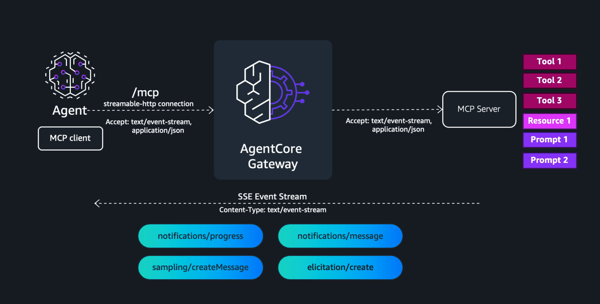

# AgentCore Gateway — Streamable HTTP

## Overview

MCP response streaming enables your AgentCore gateway to deliver real-time Server-Sent Events (SSE) to clients during tool execution. Instead of waiting for the entire tool call to complete before returning a response, the gateway streams events as they occur — including [progress notifications](https://docs.aws.amazon.com/bedrock-agentcore/latest/devguide/gateway-mcp-progress.html), [log messages](https://docs.aws.amazon.com/bedrock-agentcore/latest/devguide/gateway-mcp-logging.html), [elicitation](https://docs.aws.amazon.com/bedrock-agentcore/latest/devguide/gateway-mcp-elicitation.html) requests, and [sampling](https://docs.aws.amazon.com/bedrock-agentcore/latest/devguide/gateway-mcp-sampling.html) requests.




To enable response streaming, set `streamingConfiguration.enableResponseStreaming` to `true` in the `protocolConfiguration.mcp` field when creating or updating your AgentCore Gateway:

```bash


{
  "protocolConfiguration": {
    "mcp": {
      "streamingConfiguration": {
        "enableResponseStreaming": true
      }
    }
  }
}
```

Note: Enabling response streaming introduces a change to the response interceptor input contract. If you use response interceptors, review your interceptor logic to ensure compatibility with streaming responses. See [Response interceptors](https://docs.aws.amazon.com/bedrock-agentcore/latest/devguide/gateway-interceptors-types.html#gateway-interceptors-types-streaming) with streaming enabled for details.

## How response streaming works

When response streaming is enabled and the client sends a request with Accept: text/event-stream, the gateway returns an SSE stream instead of a single JSON response. Events are delivered as they are received from the MCP server target.

If the client does not send Accept: text/event-stream, the gateway buffers the response and returns a single JSON response after the tool call completes. Intermediate events (progress, logging) are not delivered in this case.


## Workshop roadmap

| Step | What you do |
|---|---|
| **1** | Set up the notebook (env vars, utilities, logging). |
| **2** | Create the gateway: Cognito inbound auth, IAM role, gateway with streaming enabled. |
| **3** | Deploy the `labstream` FastMCP server to AgentCore Runtime. |
| **4** | Wire it in as a gateway target (outbound OAuth, target creation, inbound token). |
| **5** | Backward compatibility — `Accept: application/json` only returns a single JSON response. |
| **6** | Server-emitted progress notifications (`streaming_demo`). |
| **7** | Mid-stream tool exception (`failing_demo`). |
| **8** | Server-emitted log events (`logging_demo`). |
| **9** | Long-running keep-alive via 30s progress (`keepalive_demo`). |
| **10** | Clean up. |

## Tutorial Details

| Information | Details |
|:---|:---|
| Tutorial type | Interactive |
| AgentCore components | AgentCore Gateway, AgentCore Identity, AgentCore Runtime |
| Gateway target type | MCP server |
| Gateway features | Streaming ON, Sessions OFF, no interceptor |
| MCP transport | Streamable HTTP, SSE |
| Inbound auth | Cognito (M2M) |
| Outbound auth | Cognito (M2M) via OAuth2 credential provider |
| SDK used | boto3 + raw httpx for SSE |

### Step 1: Setup & Prerequisites

Jupyter (Python 3.10+ kernel), Node.js + npm (for the AgentCore CLI), and IAM permissions for CloudFormation, Cognito IDP, IAM, and Bedrock AgentCore (control + runtime).

```python
# Install from requirements.txt or pyproject.toml in the current directory
!pip install --force-reinstall -U -r requirements.txt --quiet
```

```python
!npm install -g @aws/agentcore
```

```python
%load_ext autoreload
%autoreload 2
```

```python
# Imports + constants for this notebook
import utils
import logging
import boto3
import json

logging.basicConfig(
    level=logging.INFO,
    format="%(asctime)s | %(levelname)s | %(name)s | %(message)s",
    handlers=[logging.StreamHandler()],
)

REGION = boto3.Session().region_name
COGNITO_STACK_NAME = "agentcore-gateway-lab"
TEMPLATE_PATH = "cloudformation/cognito-signup-stack.yaml"
MCP_SERVER_NAME = "lab4stream"
GATEWAY_NAME = "ac-gateway-streaming-only"

cfn = boto3.client("cloudformation", region_name=REGION)
cognito = boto3.client("cognito-idp", region_name=REGION)
print("REGION:", REGION)
```

### Step 2: Create the gateway

### Step 2.1: Deploy Cognito via CloudFormation

Idempotent — re-uses the existing `agentcore-gateway-lab` stack if it's already deployed (e.g. by `01-mcp-server-target.ipynb`).

```python
outputs = utils.deploy_cognito_stack(cfn, COGNITO_STACK_NAME, TEMPLATE_PATH)

# Gateway inbound
gw_user_pool_id = outputs["UserPoolId"]
gw_client_id = outputs["GatewayClientId"]
gw_cognito_discovery_url = outputs["DiscoveryUrl"]
scopeString = outputs["GatewayScope"]
token_endpoint = outputs["TokenEndpoint"]
gw_client_secret = cognito.describe_user_pool_client(
    UserPoolId=gw_user_pool_id, ClientId=gw_client_id
)["UserPoolClient"]["ClientSecret"]

# Outbound to MCP server (same pool)
runtime_client_id = outputs["MCPClientId"]
runtime_cognito_discovery_url = gw_cognito_discovery_url
runtimeScopeString = outputs["MCPScope"]
runtime_client_secret = cognito.describe_user_pool_client(
    UserPoolId=gw_user_pool_id, ClientId=runtime_client_id
)["UserPoolClient"]["ClientSecret"]

print(f"User Pool ID:       {gw_user_pool_id}")
print(f"Discovery URL:      {gw_cognito_discovery_url}")
print(f"Token endpoint:     {token_endpoint}")
print(f"Gateway client ID:  {gw_client_id}")
print(f"MCP client ID:      {runtime_client_id}")
print(f"Gateway scope:      {scopeString}")
print(f"MCP scope:          {runtimeScopeString}")
```

### Step 2.2: Create the gateway IAM role

```python
agentcore_gateway_iam_role = utils.create_agentcore_gateway_role_with_region(
    GATEWAY_NAME, REGION
)
print("AgentCore Gateway role ARN:", agentcore_gateway_iam_role["Role"]["Arn"])
```

### Step 2.3: Create the gateway with streaming-only configuration

```python
gateway_client = boto3.client("bedrock-agentcore-control", region_name=REGION)

auth_config = {
    "customJWTAuthorizer": {
        "allowedClients": [gw_client_id],
        "discoveryUrl": gw_cognito_discovery_url,
    }
}

create_response = gateway_client.create_gateway(
    name=GATEWAY_NAME,
    roleArn=agentcore_gateway_iam_role["Role"]["Arn"],
    protocolType="MCP",
    protocolConfiguration={
        "mcp": {
            "supportedVersions": ["2025-11-25"],
            "streamingConfiguration": {"enableResponseStreaming": True},
        }
    },
    authorizerType="CUSTOM_JWT",
    authorizerConfiguration=auth_config,
    description="Streaming-only gateway (no sessions, no interceptor)",
)
gatewayID = create_response["gatewayId"]
gatewayURL = create_response["gatewayUrl"]
print(f"Gateway ID:  {gatewayID}")
print(f"Gateway URL: {gatewayURL}")
```

### Step 3: Deploy the MCP server on AgentCore Runtime

### Step 3.1: View the MCP server code

`labstream` exposes four streaming-relevant tools — `streaming_demo`, `failing_demo`, `logging_demo`, `keepalive_demo` — plus a trivial `getOrder` for the backward-compat demo.

```python
from IPython.display import Code

Code("mcpservers/app/labstream/main.py", language="python")
```

### Step 3.2: Register the agent

```python
!cd mcpservers && agentcore add agent \
    --name {MCP_SERVER_NAME} \
    --type byo \
    --language Python \
    --protocol MCP \
    --code-location app/labstream \
    --authorizer-type CUSTOM_JWT \
    --discovery-url {runtime_cognito_discovery_url} \
    --allowed-clients {runtime_client_id} \
    --allowed-scopes {runtimeScopeString}
```

### Step 3.3: Deploy via the AgentCore CLI

```python
!cd mcpservers && agentcore deploy
```

```python
agent = utils.get_agent_status(MCP_SERVER_NAME)

mcp_arn = agent["identifier"]
mcp_url = agent["invocationUrl"]
mcp_id = mcp_arn.split("/")[-1]

print(f"mcp_arn: {mcp_arn}")
print(f"mcp_id:  {mcp_id}")
print(f"mcp_url: {mcp_url}")
```

### Step 4: Wire the MCP server in as a gateway target

### Step 4.1: Outbound OAuth2 credential provider

```python
identity_client = boto3.client("bedrock-agentcore-control", region_name=REGION)

cognito_provider = identity_client.create_oauth2_credential_provider(
    name=f"{GATEWAY_NAME}-identity",
    credentialProviderVendor="CustomOauth2",
    oauth2ProviderConfigInput={
        "customOauth2ProviderConfig": {
            "oauthDiscovery": {"discoveryUrl": runtime_cognito_discovery_url},
            "clientId": runtime_client_id,
            "clientSecret": runtime_client_secret,
        }
    },
)
cognito_provider_arn = cognito_provider["credentialProviderArn"]
print(cognito_provider_arn)
```

### Step 4.2: Create the gateway target

```python
create_gateway_target_response = gateway_client.create_gateway_target(
    name="mcp-server-target",
    gatewayIdentifier=gatewayID,
    targetConfiguration={"mcp": {"mcpServer": {"endpoint": mcp_url}}},
    credentialProviderConfigurations=[
        {
            "credentialProviderType": "OAUTH",
            "credentialProvider": {
                "oauthCredentialProvider": {
                    "providerArn": cognito_provider_arn,
                    "scopes": [runtimeScopeString],
                }
            },
        },
    ],
    # Forward the client-supplied `Mcp-Session-Id` to the runtime in both
    # directions so AgentCore Runtime can pin requests to a specific microvm.
    metadataConfiguration={
        "allowedRequestHeaders": ["Mcp-Session-Id"],
        "allowedResponseHeaders": ["Mcp-Session-Id"],
    },
)
gatewayTargetID = create_gateway_target_response["targetId"]
print(f"Created target: {gatewayTargetID}")
```

### Step 4.3: Verify target is READY

```python
list_targets_response = gateway_client.list_gateway_targets(gatewayIdentifier=gatewayID)
print(json.dumps(list_targets_response, default=str, indent=2))
```

### Step 4.4: Get an inbound access token

```python
token_response = utils.get_token(
    token_endpoint, gw_client_id, gw_client_secret, scopeString
)
token = token_response["access_token"]
print("Token (truncated):", token[:60], "...")
```

## Step 5: Backward compatibility — `Accept: application/json`

If the client does not send Accept: text/event-stream, the gateway buffers the response and returns a single JSON response after the tool call completes. Intermediate events (progress, logging) are not delivered in this case.

```python
import uuid
from gateway_mcp_client import GatewayMCPClient


def _get_inbound_token() -> str:
    return utils.get_token(token_endpoint, gw_client_id, gw_client_secret, scopeString)[
        "access_token"
    ]


session_id = str(uuid.uuid4())

mcp = GatewayMCPClient(gatewayURL, _get_inbound_token, session_id=session_id)
```

```python
# Client-supplied `Mcp-Session-Id`. The runtime is `stateless_http=True` so it
# doesn't issue one — but with the target's metadataConfiguration allowlisting
# Mcp-Session-Id (Step 4.2), the gateway forwards this header to the runtime,
# and AgentCore Runtime uses it for microvm affinity. Reusing the same id
# across calls keeps subsequent requests pinned to the same microvm instance.

print(f"Client-supplied Mcp-Session-Id: {mcp.session_id}")


response = mcp.call_tool_json_only("mcp-server-target___getOrder", {}, request_id=2)
print("\n=== A) getOrder (no intermediate frames) ===")
print(f"HTTP {response['http_status']}  Content-Type: {response['content_type']}")
print(f"Body: {response['body']}")
```

```python
mcp = GatewayMCPClient(gatewayURL, _get_inbound_token, session_id=session_id)

buf = mcp.call_tool_json_only(
    "mcp-server-target___streaming_demo", {"steps": 5}, request_id=20
)
print("\n=== B) streaming_demo (buffered — progress events dropped) ===")
print(f"HTTP {buf['http_status']}  Content-Type: {buf['content_type']}")
print(f"Body: {buf['body']}")
print()
print(
    "Note: the body contains only the final tool result. The 5 "
    "`notifications/progress` frames the server emitted were discarded "
    "because the client did not request `text/event-stream`."
)
```

## Step 6: Server-emitted progress notifications

Example SSE stream response:

```
event: message
data: {"jsonrpc":"2.0","method":"notifications/progress","params":{"progressToken":"auto-1","progress":1,"total":3,"message":"Loading data..."}}
event: message
data: {"jsonrpc":"2.0","method":"notifications/message","params":{"level":"info","logger":"analyzer","data":"Processing 10,000 records"}}
event: message
data: {"jsonrpc":"2.0","method":"notifications/progress","params":{"progressToken":"auto-1","progress":2,"total":3,"message":"Analyzing..."}}
event: message
data: {"jsonrpc":"2.0","method":"notifications/progress","params":{"progressToken":"auto-1","progress":3,"total":3,"message":"Complete"}}
event: message
data: {"jsonrpc":"2.0","id":"tool-call-1","result":{"content":[{"type":"text","text":"Analysis complete. Found 3 anomalies."}]}}```

```python
mcp = GatewayMCPClient(gatewayURL, _get_inbound_token, session_id=session_id)

print("--- streaming_demo SSE frames ---")
for msg in mcp.stream_tool_call(
    "mcp-server-target___streaming_demo",
    {"steps": 5},
    progress_token="demo-progress",
    request_id=3,
):
    print(json.dumps(msg))
```

## Step 7: Mid-stream tool exceptions

`failing_demo(steps=3)` emits two progress notifications then raises `RuntimeError`. The streaming response delivers the progress frames, then a `result.isError=true` content block as the final SSE frame.

```python
mcp = GatewayMCPClient(gatewayURL, _get_inbound_token, session_id=session_id)

print("--- failing_demo SSE frames (3 progress, then error) ---")
for msg in mcp.stream_tool_call(
    "mcp-server-target___failing_demo",
    {"steps": 3},
    progress_token="failing-demo",
    request_id=4,
):
    print(json.dumps(msg))
```

## Step 8: Server-emitted log events

`logging_demo()` emits one `notifications/message` per severity.

```python
mcp = GatewayMCPClient(gatewayURL, _get_inbound_token, session_id=session_id)

print("--- logging_demo SSE frames (4 log events + result) ---")
for msg in mcp.stream_tool_call(
    "mcp-server-target___logging_demo",
    {},
    request_id=5,
):
    print(json.dumps(msg))
```

## Step 9: Long-running keep-alive via 30s progress

`keepalive_demo(duration_seconds=N, interval_seconds=30, emit_progress=True)` sleeps for `duration_seconds`, emitting one progress frame every 30s. Used as the keep-alive pattern for tool calls that exceed the gateway's 15-min default request timeout.

> Demo runs at `duration_seconds=60` so the cell finishes quickly.

```python
import time

started = time.time()
n_progress = 0
saw_result = False

mcp = GatewayMCPClient(gatewayURL, _get_inbound_token, session_id=session_id)

for msg in mcp.stream_tool_call(
    "mcp-server-target___keepalive_demo",
    {"duration_seconds": 60, "interval_seconds": 30, "emit_progress": True},
    progress_token="keepalive-60s",
    request_id=6,
):
    if msg.get("method") == "notifications/progress":
        n_progress += 1
        print(f"  progress #{n_progress} at {round(time.time() - started, 1)}s")
    elif msg.get("id") == 6:
        saw_result = True
        print(f"  result at {round(time.time() - started, 1)}s: {msg.get('result')}")

print(
    f"\nelapsed={round(time.time() - started, 1)}s  "
    f"progress_count={n_progress}  result_seen={saw_result}"
)
```

## Step 9: Cleanup

Uncomment the cells below to tear down the gateway, OAuth2 credential provider, MCP server runtime, and IAM role this notebook created. The Cognito CloudFormation stack is shared across labs — leave it unless you're done with all of them.

```python
# utils.delete_gateway(gateway_client, gatewayID)
```

```python
# identity_client.delete_oauth2_credential_provider(name=f"{GATEWAY_NAME}-identity")
```

```python
# !cd mcpservers && agentcore remove agent --name {MCP_SERVER_NAME} -y
# !cd mcpservers && agentcore deploy -y
```

```python
# # ## Delete Cognito stack when this stack is not being used by other labs
# print(f"Deleting stack {COGNITO_STACK_NAME}...")
# cfn.delete_stack(StackName=COGNITO_STACK_NAME)
# cfn.get_waiter("stack_delete_complete").wait(StackName=COGNITO_STACK_NAME)
# print(f"✅ Stack {COGNITO_STACK_NAME} deleted")
```

```python
# utils.delete_iam_role(f"agentcore-{GATEWAY_NAME}-role")
```
