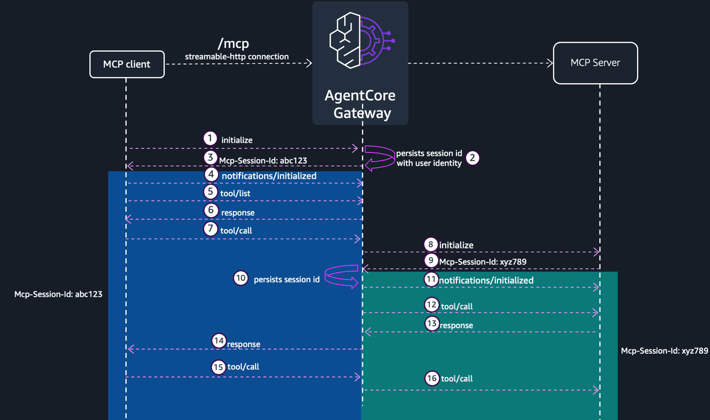

# AgentCore Gateway — MCP Session management

## Overview

SMCP sessions enable stateful interactions between clients and your AgentCore gateway. When sessions are enabled, the gateway generates a unique session identifier during initialization and maintains state across multiple requests, enabling advanced MCP features such as elicitation and sampling.


### Enable sessions on your gateway

To enable sessions, specify a sessionConfiguration in the protocolConfiguration.mcp field when creating or updating your gateway.


```bash
{
  "protocolConfiguration": {
    "mcp": {
      "sessionConfiguration": {
        "sessionTimeoutInSeconds": 3600
      }
    }
  }
}
```

The sessionTimeoutInSeconds parameter is optional. If omitted, the default timeout is 3600 seconds (1 hour). Valid range is 900 (15 minutes) to 28800 (8 hours). The timeout is absolute, calculated from the first initialize request.



Note: When sessions are enabled on a gateway, you cannot include Mcp-Session-Id in the metadataConfiguration of a gateway target’s header propagation settings. The gateway manages session IDs internally. Attempting to do so returns an HTTP 400 Bad Request error.

### Benefits of using sessions


1.  Stateful MCP server target interactions: 
    The gateway stores the MCP server target’s session ID and reuses it on subsequent tool calls. This avoids re-initialization on every request and enables targets to maintain context across calls.

2.  Faster responses with AgentCore Runtime targets: 
    When the target’s session is reused, AgentCore Runtime doesn’t need to cold-start a new MCP server connection on each request, resulting in faster response times.

3.  Enables advanced MCP features: 
    Sessions are a prerequisite for elicitation and sampling, which require tracking state across multiple requests.

4.  User-scoped security (authenticated gateways): 
    For gateways with inbound authentication, sessions are bound to the verified user identity, preventing session hijacking.


## Workshop roadmap

| Step | What you do |
|---|---|
| **1** | Set up the notebook (env vars, utilities, logging). |
| **2** | Create the gateway: Cognito inbound auth, IAM role, gateway with sessions enabled. |
| **3** | Deploy the `labsession` FastMCP server to AgentCore Runtime. |
| **4** | Wire it in as a gateway target (outbound OAuth, target creation, inbound token). |
| **5** | Initialize a session — observe the `Mcp-Session-Id` header. |
| **6** | Session continuity — `session_counter` increments across calls within one session. |
| **7** | Session isolation — a fresh `initialize` returns a new id and starts a fresh counter. |
| **8** | Session-id error contract — missing / fake `Mcp-Session-Id`. |
| **9** | Anti-hijacking note — sessions are scoped to the authenticated identity. |
| **10** | Clean up. |

## Tutorial Details

| Information | Details |
|:---|:---|
| Tutorial type | Interactive |
| AgentCore components | AgentCore Gateway, AgentCore Identity, AgentCore Runtime |
| Gateway target type | MCP server |
| Gateway features | Sessions ON, Streaming OFF, no interceptor |
| MCP transport | Streamable HTTP, single JSON response |
| Inbound auth | Cognito (M2M) |
| Outbound auth | Cognito (M2M) via OAuth2 credential provider |
| SDK used | boto3 + raw httpx |

### Step 1: Setup & Prerequisites

Jupyter (Python 3.10+ kernel), Node.js + npm (for the AgentCore CLI), AWS credentials configured for `us-west-2`, and IAM permissions for CloudFormation, Cognito IDP, IAM, and Bedrock AgentCore (control + runtime).

```python
# Install from requirements.txt or pyproject.toml in the current directory
!pip install --force-reinstall -U -r requirements.txt --quiet
```

```python
!npm install -g @aws/agentcore
```

```python
%load_ext autoreload
%autoreload 2
```

```python
# Imports + constants for this notebook
import utils
import logging
import boto3
import json

logging.basicConfig(
    level=logging.INFO,
    format="%(asctime)s | %(levelname)s | %(name)s | %(message)s",
    handlers=[logging.StreamHandler()],
)

REGION = boto3.Session().region_name
COGNITO_STACK_NAME = "agentcore-gateway-lab"
TEMPLATE_PATH = "cloudformation/cognito-signup-stack.yaml"
MCP_SERVER_NAME = "lab5session"
GATEWAY_NAME = "ac-gateway-sessions-only"

cfn = boto3.client("cloudformation", region_name=REGION)
cognito = boto3.client("cognito-idp", region_name=REGION)
print("REGION:", REGION)
```

### Step 2: Create the gateway

### Step 2.1: Deploy Cognito via CloudFormation

```python
outputs = utils.deploy_cognito_stack(cfn, COGNITO_STACK_NAME, TEMPLATE_PATH)

# Gateway inbound
gw_user_pool_id = outputs["UserPoolId"]
gw_client_id = outputs["GatewayClientId"]
gw_cognito_discovery_url = outputs["DiscoveryUrl"]
scopeString = outputs["GatewayScope"]
token_endpoint = outputs["TokenEndpoint"]
gw_client_secret = cognito.describe_user_pool_client(
    UserPoolId=gw_user_pool_id, ClientId=gw_client_id
)["UserPoolClient"]["ClientSecret"]

# Outbound to MCP server (same pool)
runtime_client_id = outputs["MCPClientId"]
runtime_cognito_discovery_url = gw_cognito_discovery_url
runtimeScopeString = outputs["MCPScope"]
runtime_client_secret = cognito.describe_user_pool_client(
    UserPoolId=gw_user_pool_id, ClientId=runtime_client_id
)["UserPoolClient"]["ClientSecret"]

print(f"User Pool ID:       {gw_user_pool_id}")
print(f"Discovery URL:      {gw_cognito_discovery_url}")
print(f"Token endpoint:     {token_endpoint}")
print(f"Gateway client ID:  {gw_client_id}")
print(f"MCP client ID:      {runtime_client_id}")
print(f"Gateway scope:      {scopeString}")
print(f"MCP scope:          {runtimeScopeString}")
```

### Step 2.2: Create the gateway IAM role

```python
agentcore_gateway_iam_role = utils.create_agentcore_gateway_role_with_region(
    GATEWAY_NAME, REGION
)
print("AgentCore Gateway role ARN:", agentcore_gateway_iam_role["Role"]["Arn"])
```

### Step 2.3: Create the gateway with sessions-only configuration

`sessionConfiguration.sessionTimeoutInSeconds: 3600` (1 hour, the default; valid range `[900, 28800]`). **No** `streamingConfiguration` (streaming disabled). **No** `interceptorConfigurations`.

```python
gateway_client = boto3.client("bedrock-agentcore-control", region_name=REGION)

auth_config = {
    "customJWTAuthorizer": {
        "allowedClients": [gw_client_id],
        "discoveryUrl": gw_cognito_discovery_url,
    }
}

create_response = gateway_client.create_gateway(
    name=GATEWAY_NAME,
    roleArn=agentcore_gateway_iam_role["Role"]["Arn"],
    protocolType="MCP",
    protocolConfiguration={
        "mcp": {
            "supportedVersions": ["2025-11-25"],
            "sessionConfiguration": {"sessionTimeoutInSeconds": 3600},
        }
    },
    authorizerType="CUSTOM_JWT",
    authorizerConfiguration=auth_config,
    description="Sessions-only gateway (no streaming, no interceptor)",
)
gatewayID = create_response["gatewayId"]
gatewayURL = create_response["gatewayUrl"]
print(f"Gateway ID:  {gatewayID}")
print(f"Gateway URL: {gatewayURL}")
```

### Step 3: Deploy the MCP server on AgentCore Runtime

### Step 3.1: View the MCP server code

`labsession` is intentionally minimal — `session_counter` keeps a per-session count keyed by `Mcp-Session-Id`, plus `getOrder` / `updateOrder` as sanity tools.

```python
from IPython.display import Code

Code("mcpservers/app/labsession/main.py", language="python")
```

### Step 3.2: Register the agent

```python
!cd mcpservers && agentcore add agent \
    --name {MCP_SERVER_NAME} \
    --type byo \
    --language Python \
    --protocol MCP \
    --code-location app/labsession \
    --authorizer-type CUSTOM_JWT \
    --discovery-url {runtime_cognito_discovery_url} \
    --allowed-clients {runtime_client_id} \
    --allowed-scopes {runtimeScopeString}
```

### Step 3.3: Deploy via the AgentCore CLI

```python
!cd mcpservers && agentcore deploy
```

```python
agent = utils.get_agent_status(MCP_SERVER_NAME)

mcp_arn = agent["identifier"]
mcp_url = agent["invocationUrl"]
mcp_id = mcp_arn.split("/")[-1]

print(f"mcp_arn: {mcp_arn}")
print(f"mcp_id:  {mcp_id}")
print(f"mcp_url: {mcp_url}")
```

### Step 4: Wire the MCP server in as a gateway target

### Step 4.1: Outbound OAuth2 credential provider

```python
identity_client = boto3.client("bedrock-agentcore-control", region_name=REGION)

cognito_provider = identity_client.create_oauth2_credential_provider(
    name=f"{GATEWAY_NAME}-identity",
    credentialProviderVendor="CustomOauth2",
    oauth2ProviderConfigInput={
        "customOauth2ProviderConfig": {
            "oauthDiscovery": {"discoveryUrl": runtime_cognito_discovery_url},
            "clientId": runtime_client_id,
            "clientSecret": runtime_client_secret,
        }
    },
)
cognito_provider_arn = cognito_provider["credentialProviderArn"]
print(cognito_provider_arn)
```

### Step 4.2: Create the gateway target

```python
create_gateway_target_response = gateway_client.create_gateway_target(
    name="mcp-server-target",
    gatewayIdentifier=gatewayID,
    targetConfiguration={"mcp": {"mcpServer": {"endpoint": mcp_url}}},
    credentialProviderConfigurations=[
        {
            "credentialProviderType": "OAUTH",
            "credentialProvider": {
                "oauthCredentialProvider": {
                    "providerArn": cognito_provider_arn,
                    "scopes": [runtimeScopeString],
                }
            },
        },
    ],
    # `Mcp-Session-Id` cannot be in allowlist
    # metadataConfiguration={
    #     "allowedRequestHeaders": ["Mcp-Session-Id"],
    #     "allowedResponseHeaders": ["Mcp-Session-Id"],
    # },
)
gatewayTargetID = create_gateway_target_response["targetId"]
print(f"Created target: {gatewayTargetID}")
```

### Step 4.3: Verify target is READY

```python
list_targets_response = gateway_client.list_gateway_targets(gatewayIdentifier=gatewayID)
print(json.dumps(list_targets_response, default=str, indent=2))
```

### Step 4.4: Get an inbound access token

```python
token_response = utils.get_token(
    token_endpoint, gw_client_id, gw_client_secret, scopeString
)
token = token_response["access_token"]
print("Token (truncated):", token[:60], "...")
```

## Step 5: Initialize and capture the `Mcp-Session-Id`

A session-enabled gateway issues a `Mcp-Session-Id` on the response to the first `initialize`.

```python
from gateway_mcp_client import GatewayMCPClient


def _get_inbound_token() -> str:
    return utils.get_token(token_endpoint, gw_client_id, gw_client_secret, scopeString)[
        "access_token"
    ]


# Session A — fresh GatewayMCPClient. Calling .initialize() captures the
# `Mcp-Session-Id` the gateway issues on the response and echoes it on every
# subsequent request automatically.
mcp_a = GatewayMCPClient(gatewayURL, _get_inbound_token)
init_a = mcp_a.initialize(client_info={"name": "session-demo", "version": "0.1"})
print(f"init A HTTP {init_a['http_status']}")
print(f"Session A id: {mcp_a.session_id}")
```

## Step 6: Session continuity — counter increments

`session_counter` returns `{session_id, count}` where `session_id` is fastmcp's *upstream* per-process session id and `count` is incremented per call within the same session. Repeated calls on the same `Mcp-Session-Id` see the count grow.

```python
def call_session_counter(client, label):
    msg = client.call_tool("mcp-server-target___session_counter", {})
    print(f"  [{label}] result={msg.get('result', {}).get('structuredContent')}")
    return msg


print("Three calls on session A:")
call_session_counter(mcp_a, "A.1")
call_session_counter(mcp_a, "A.2")
call_session_counter(mcp_a, "A.3")
```

```python
call_session_counter(mcp_a, "A.4")
```

## Step 7: Session isolation — fresh `initialize` resets the counter

A second `initialize` from the same client returns a different `Mcp-Session-Id`. Calls against this new id start with `count=1` — separate state, separate upstream session.

```python
# Session B — second GatewayMCPClient. Its initialize() returns a different
# Mcp-Session-Id; the per-session counter on the upstream server starts fresh.
mcp_b = GatewayMCPClient(gatewayURL, _get_inbound_token)
mcp_b.initialize(client_info={"name": "session-demo", "version": "0.1"})
print(f"Session B id: {mcp_b.session_id}  (distinct from A: {mcp_a.session_id})")
print()

print("Two calls on session B:")
call_session_counter(mcp_b, "B.1")
call_session_counter(mcp_b, "B.2")
print()
print("Then back to session A — count continues from where it left off:")
call_session_counter(mcp_a, "A.5")
```

## Step 8: Session-id error contract

The gateway's session validator handles three lookup-fail cases:

| Probe | Expected | Body |
|---|---|---|
| Missing `Mcp-Session-Id` | HTTP 400 | `Missing required Mcp-Session-Id header` |
| Random / never-issued `Mcp-Session-Id` | HTTP 404 | `Session not found or expired` |
| Real `Mcp-Session-Id` from a different authenticated identity | HTTP 404 | `Session not found or expired` |

```python
import uuid

# Probe 1: a client that has NEVER been initialized — no Mcp-Session-Id header.
mcp_no_sid = GatewayMCPClient(gatewayURL, _get_inbound_token)
r = mcp_no_sid.rpc_raw("tools/list")
print(f"NO Mcp-Session-Id           -> HTTP {r.status_code}  body={r.text[:120]!r}")

# Probe 2: a client constructed with a random fake `Mcp-Session-Id` the gateway
# never issued.
fake_sid = str(uuid.uuid4())
mcp_fake = GatewayMCPClient(gatewayURL, _get_inbound_token, session_id=fake_sid)
r = mcp_fake.rpc_raw("tools/list")
print(f"FAKE Mcp-Session-Id={fake_sid}  -> HTTP {r.status_code}  body={r.text[:120]!r}")
```

## Step 9: Sessions are scoped to the authenticated identity

Sessions are scoped to the authenticated user. The AgentCore Gateway derives the user identity from the authorization context, the JWT bearer token for OAuth ingress or the IAM credentials for AWS_IAM ingress, and validates that every request within a session originates from the same user.

Practical: a different Cognito M2M client (different `client_id` claim in the JWT), even with a valid token for the same gateway, cannot reuse another client's `Mcp-Session-Id`. Cross-identity reuse returns HTTP 404 `Session not found or expired` — the gateway treats the session as nonexistent rather than leaking that it belongs to someone else.

# Step 10: Faster responses with AgentCore Runtime targets: 


When the target’s session is reused, AgentCore Runtime doesn’t need to cold-start a new MCP server connection on each request, resulting in faster response times.

Observe the time difference between first and subsequent invokes.

```python
mcp_c = GatewayMCPClient(gatewayURL, _get_inbound_token)
mcp_c.initialize(client_info={"name": "session-demo-c", "version": "0.1"})
print(f"Session C id: {mcp_c.session_id}")
print()
```

```python
call_session_counter(
    mcp_c, "C.1"
)  # First call - AgentCore Runtime (MCP target) micro VM is created
```

```python
call_session_counter(
    mcp_c, "C.2"
)  # Second call - AgentCore Runtime (MCP target) micro VM is reused
```

## Step 11: Cleanup

Uncomment the cells below to tear down the gateway, OAuth2 credential provider, MCP server runtime, and IAM role this notebook created. The Cognito CloudFormation stack is shared across labs — leave it unless you're done with all of them.

```python
# utils.delete_gateway(gateway_client, gatewayID)
```

```python
# identity_client.delete_oauth2_credential_provider(name=f"{GATEWAY_NAME}-identity")
```

```python
# !cd mcpservers && agentcore remove agent --name {MCP_SERVER_NAME} -y
# !cd mcpservers && agentcore deploy -y
```

```python
# # ## Delete Cognito stack when this stack is not being used by other labs
# print(f"Deleting stack {COGNITO_STACK_NAME}...")
# cfn.delete_stack(StackName=COGNITO_STACK_NAME)
# cfn.get_waiter("stack_delete_complete").wait(StackName=COGNITO_STACK_NAME)
# print(f"✅ Stack {COGNITO_STACK_NAME} deleted")
```

```python
utils.delete_iam_role(f"agentcore-{GATEWAY_NAME}-role")
```
