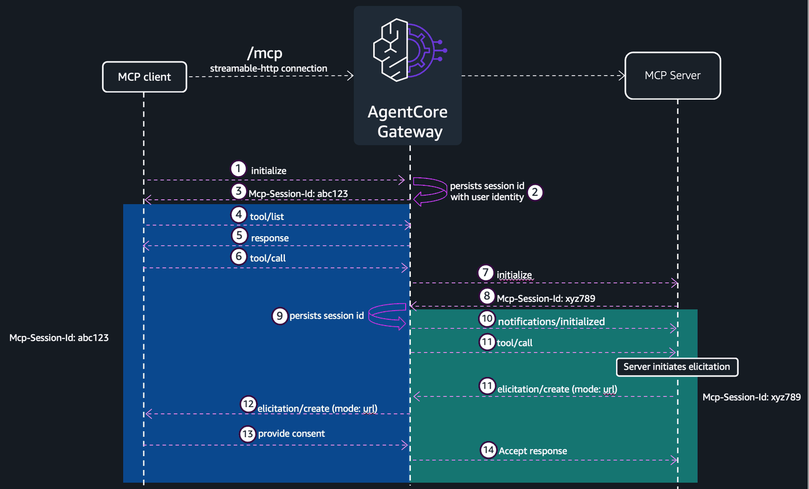

# AgentCore Gateway — Elicitation + Sampling

## Overview

Elicitation lets an MCP server pause execution mid tool-call and request input from the client (form-mode, URL-mode) or surface a `URLElicitationRequiredError` that the client must satisfy before retrying. Sampling lets a server delegate text generation to the client's LLM via `sampling/createMessage`. Both require **streaming and sessions enabled** on the gateway, since:

- Elicitation requires the server-to-client SSE channel to deliver the `elicitation/create` request, and a session to correlate the response.
- Sampling uses the same SSE channel for `sampling/createMessage`.

```bash
{
  "protocolConfiguration": {
    "mcp": {
      "sessionConfiguration": {
        "sessionTimeoutInSeconds": 3600
      },
      "streamingConfiguration": {
        "enableResponseStreaming": true
      }
    }
  }
}
```

This notebook stands up a gateway with **both** `streamingConfiguration.enableResponseStreaming` and `sessionConfiguration` enabled (no Lambda interceptor) and walks through every elicitation/sampling pattern end-to-end against a dedicated MCP server (`labelicitation`).



## Workshop roadmap

| Step | What you do |
|---|---|
| **1** | Set up the notebook. |
| **2** | Create the gateway with both streaming + sessions enabled. |
| **3** | Deploy the `labelicitation` FastMCP server to AgentCore Runtime. |
| **4** | Wire it in as a gateway target. |
| **5** | Form-mode elicitation — `book_room` (single object schema). |
| **6** | Boolean confirmation — `cancel_with_confirm`. |
| **7** | Sequential elicitations — `log_expense` (3 prompts in one tool call). |
| **8** | Sampling — `sampling_demo` (server asks client's LLM). |
| **9** | Long-compute + elicitation — `optimize_and_apply`. |
| **10** | URL-mode elicitation Flow §4.2 — `connect_external_account` + completion notification. |
| **11** | Clean up. |

## Tutorial Details

| Information | Details |
|:---|:---|
| Tutorial type | Interactive |
| AgentCore components | AgentCore Gateway, AgentCore Identity, AgentCore Runtime |
| Gateway target type | MCP server |
| Gateway features | Streaming ON, Sessions ON, no interceptor |
| MCP transport | Streamable HTTP, SSE bidirectional |
| Inbound auth | Cognito (M2M) |
| Outbound auth | Cognito (M2M) via OAuth2 credential provider |
| SDK used | boto3 + `mcp.client.session.ClientSession` for form-mode + sampling, raw httpx for URL-mode (which `mcp` 1.27.0 doesn't auto-handle yet) |

### Step 1: Setup & Prerequisites

Jupyter (Python 3.10+ kernel), Node.js + npm, AWS credentials in `us-west-2`. Local `mcp >= 1.27.0` is required for the form-mode + sampling client used below — older versions reject `protocolVersion: 2025-11-25` from the server.

```python
# Install from requirements.txt or pyproject.toml in the current directory
!pip install --force-reinstall -U -r requirements.txt --quiet
```

```python
!npm install -g @aws/agentcore
```

```python
%load_ext autoreload
%autoreload 2
```

```python
# Imports + constants for this notebook
import utils
import logging
import boto3
import json

logging.basicConfig(
    level=logging.INFO,
    format="%(asctime)s | %(levelname)s | %(name)s | %(message)s",
    handlers=[logging.StreamHandler()],
)

REGION = boto3.Session().region_name
COGNITO_STACK_NAME = "agentcore-gateway-lab"
TEMPLATE_PATH = "cloudformation/cognito-signup-stack.yaml"
MCP_SERVER_NAME = "lab6elicitation"
GATEWAY_NAME = "ac-gateway-elicitation"

cfn = boto3.client("cloudformation", region_name=REGION)
cognito = boto3.client("cognito-idp", region_name=REGION)
print("REGION:", REGION)
```

### Step 2: Create the gateway

### Step 2.1: Deploy Cognito via CloudFormation

```python
outputs = utils.deploy_cognito_stack(cfn, COGNITO_STACK_NAME, TEMPLATE_PATH)

# Gateway inbound
gw_user_pool_id = outputs["UserPoolId"]
gw_client_id = outputs["GatewayClientId"]
gw_cognito_discovery_url = outputs["DiscoveryUrl"]
scopeString = outputs["GatewayScope"]
token_endpoint = outputs["TokenEndpoint"]
gw_client_secret = cognito.describe_user_pool_client(
    UserPoolId=gw_user_pool_id, ClientId=gw_client_id
)["UserPoolClient"]["ClientSecret"]

# Outbound to MCP server (same pool)
runtime_client_id = outputs["MCPClientId"]
runtime_cognito_discovery_url = gw_cognito_discovery_url
runtimeScopeString = outputs["MCPScope"]
runtime_client_secret = cognito.describe_user_pool_client(
    UserPoolId=gw_user_pool_id, ClientId=runtime_client_id
)["UserPoolClient"]["ClientSecret"]

print(f"User Pool ID:       {gw_user_pool_id}")
print(f"Discovery URL:      {gw_cognito_discovery_url}")
print(f"Token endpoint:     {token_endpoint}")
print(f"Gateway client ID:  {gw_client_id}")
print(f"MCP client ID:      {runtime_client_id}")
print(f"Gateway scope:      {scopeString}")
print(f"MCP scope:          {runtimeScopeString}")
```

### Step 2.2: Create the gateway IAM role

```python
agentcore_gateway_iam_role = utils.create_agentcore_gateway_role_with_region(
    GATEWAY_NAME, REGION
)
print("AgentCore Gateway role ARN:", agentcore_gateway_iam_role["Role"]["Arn"])
```

### Step 2.3: Create the gateway with both streaming + sessions enabled

Both blocks present — elicitation needs both. **No** `interceptorConfigurations`.

```python
gateway_client = boto3.client("bedrock-agentcore-control", region_name=REGION)

auth_config = {
    "customJWTAuthorizer": {
        "allowedClients": [gw_client_id],
        "discoveryUrl": gw_cognito_discovery_url,
    }
}

create_response = gateway_client.create_gateway(
    name=GATEWAY_NAME,
    roleArn=agentcore_gateway_iam_role["Role"]["Arn"],
    protocolType="MCP",
    protocolConfiguration={
        "mcp": {
            "supportedVersions": ["2025-11-25"],
            "streamingConfiguration": {"enableResponseStreaming": True},
            "sessionConfiguration": {"sessionTimeoutInSeconds": 3600},
        }
    },
    authorizerType="CUSTOM_JWT",
    authorizerConfiguration=auth_config,
    description="Elicitation gateway (streaming + sessions, no interceptor)",
)
gatewayID = create_response["gatewayId"]
gatewayURL = create_response["gatewayUrl"]
print(f"Gateway ID:  {gatewayID}")
print(f"Gateway URL: {gatewayURL}")
```

### Step 3: Deploy the MCP server on AgentCore Runtime

### Step 3.1: View the MCP server code

`labelicitation` exposes the full elicitation feature set:

| Tool | Demonstrates |
|---|---|
| `book_room` | Form elicitation — single object schema |
| `cancel_with_confirm` | Boolean confirmation prompt |
| `log_expense` | Three sequential elicitations in one tool call |
| `sampling_demo` | `sampling/createMessage` round-trip |
| `optimize_and_apply` | Long-compute + form elicitation gate |
| `connect_external_account` | URL-mode elicitation Flow 4.2 + `notifications/elicitation/complete` |
| `protected_resource` | URL Required Error Flow 4.3 (`-32042`) — first call raises, second succeeds |

```python
from IPython.display import Code

Code("mcpservers/app/labelicitation/main.py", language="python")
```

### Step 3.2: Register the agent

```python
!cd mcpservers && agentcore add agent \
    --name {MCP_SERVER_NAME} \
    --type byo \
    --language Python \
    --protocol MCP \
    --code-location app/labelicitation \
    --authorizer-type CUSTOM_JWT \
    --discovery-url {runtime_cognito_discovery_url} \
    --allowed-clients {runtime_client_id} \
    --allowed-scopes {runtimeScopeString}
```

### Step 3.3: Deploy via the AgentCore CLI

```python
!cd mcpservers && agentcore deploy
```

```python
agent = utils.get_agent_status(MCP_SERVER_NAME)

mcp_arn = agent["identifier"]
mcp_url = agent["invocationUrl"]
mcp_id = mcp_arn.split("/")[-1]

print(f"mcp_arn: {mcp_arn}")
print(f"mcp_id:  {mcp_id}")
print(f"mcp_url: {mcp_url}")
```

### Step 4: Wire the MCP server in as a gateway target

### Step 4.1: Outbound OAuth2 credential provider

```python
identity_client = boto3.client("bedrock-agentcore-control", region_name=REGION)

cognito_provider = identity_client.create_oauth2_credential_provider(
    name=f"{GATEWAY_NAME}-identity",
    credentialProviderVendor="CustomOauth2",
    oauth2ProviderConfigInput={
        "customOauth2ProviderConfig": {
            "oauthDiscovery": {"discoveryUrl": runtime_cognito_discovery_url},
            "clientId": runtime_client_id,
            "clientSecret": runtime_client_secret,
        }
    },
)
cognito_provider_arn = cognito_provider["credentialProviderArn"]
print(cognito_provider_arn)
```

### Step 4.2: Create the gateway target

```python
create_gateway_target_response = gateway_client.create_gateway_target(
    name="mcp-server-target",
    gatewayIdentifier=gatewayID,
    targetConfiguration={"mcp": {"mcpServer": {"endpoint": mcp_url}}},
    credentialProviderConfigurations=[
        {
            "credentialProviderType": "OAUTH",
            "credentialProvider": {
                "oauthCredentialProvider": {
                    "providerArn": cognito_provider_arn,
                    "scopes": [runtimeScopeString],
                }
            },
        },
    ],
)
gatewayTargetID = create_gateway_target_response["targetId"]
print(f"Created target: {gatewayTargetID}")
```

### Step 4.3: Verify target is READY

```python
list_targets_response = gateway_client.list_gateway_targets(gatewayIdentifier=gatewayID)
print(json.dumps(list_targets_response, default=str, indent=2))
```

### Step 4.4: Get an inbound access token

```python
token_response = utils.get_token(
    token_endpoint, gw_client_id, gw_client_secret, scopeString
)
token = token_response["access_token"]
print("Token (truncated):", token[:60], "...")
```

### Step 4.5: Build a form-mode + sampling client

`mcp.client.session.ClientSession` handles `elicitation/create` and `sampling/createMessage` callbacks for us. Auto-accept any form elicitation by filling the schema with reasonable defaults; for sampling, return a fixed simulated string.

```python
from gateway_mcp_client import GatewayMCPClient


def _get_inbound_token() -> str:
    return utils.get_token(token_endpoint, gw_client_id, gw_client_secret, scopeString)[
        "access_token"
    ]
```

```python
# `mcp.initialize()` runs the spec handshake and captures the
# `Mcp-Session-Id` the gateway issues. All subsequent `call_tool_streaming`
# calls echo that header automatically.
mcp = GatewayMCPClient(gatewayURL, _get_inbound_token)
init_info = mcp.initialize(
    client_info={"name": "elicit-demo", "version": "0.1"},
    capabilities={"elicitation": {}, "sampling": {}},
)
print(f"init HTTP {init_info['http_status']}, sid={mcp.session_id}")
```

## Step 5: Form-mode elicitation — `book_room`

Server prompts for `room_type`, `nights`, `breakfast` via a Pydantic schema. The callback auto-accepts with `room_type=single, nights=1, breakfast=True`. Server returns the booking confirmation string.

```python
# book_room — `interactive_input_form` reads the schema the server emits
# (`room_type`, `nights`, `breakfast`) and prompts via input() for each.
outcome = mcp.call_tool_streaming(
    "mcp-server-target___book_room",
    {},
    elicitation_callback=utils.interactive_input_form,
    request_id=5,
)
utils.show("book_room", outcome)
```

## Step 6: Boolean confirmation — `cancel_with_confirm`

Single-field boolean elicitation before a destructive action. Auto-accept returns `confirm=True`.

```python
# cancel_with_confirm — single boolean elicitation. The prompt fires when
# the server asks to confirm the destructive action.
outcome = mcp.call_tool_streaming(
    "mcp-server-target___cancel_with_confirm",
    {"order_id": 42},
    elicitation_callback=utils.interactive_input_form,
    request_id=6,
)
utils.show("cancel_with_confirm", outcome)
```

## Step 7: Sequential elicitations — `log_expense`

Three elicitation/create requests in sequence within one tool call: category → description → confirm. The callback fills each in turn.

```python
# log_expense — three sequential elicitations (category → description →
# confirm). The callback fires once per elicitation/create the server
# emits, so you'll see three separate prompt rounds in turn.
outcome = mcp.call_tool_streaming(
    "mcp-server-target___log_expense",
    {"amount": 12.34},
    elicitation_callback=utils.interactive_input_form,
    request_id=7,
)
utils.show("log_expense", outcome)
```

## Step 8: Sampling — `sampling_demo`

sampling_demo — server calls `ctx.sample(prompt)`. The `bedrock_sampling` callback forwards the request to Amazon Bedrock (Claude Haiku 4.5 by default) and returns the model's reply. Tool returns whatever the LLM said.

```python
outcome = mcp.call_tool_streaming(
    "mcp-server-target___sampling_demo",
    {"prompt": "hello"},
    sampling_callback=utils.bedrock_sampling,
    request_id=8,
)
utils.show("sampling_demo", outcome)
```

## Step 9: Long-compute + elicitation gate — `optimize_and_apply`

Spins for `duration_seconds`, emitting a progress notification every `interval_seconds`, then prompts the user to approve a destructive action via form elicitation. Mirrors AI-assistant workloads that must run a long compute and pause for approval before applying.

```python
# optimize_and_apply — server runs a long compute (progress every
# `interval_seconds`) then prompts to apply. The progress_callback prints
# each frame as it arrives; the elicitation prompt fires once after the
# compute finishes.
outcome = mcp.call_tool_streaming(
    "mcp-server-target___optimize_and_apply",
    {"duration_seconds": 10, "interval_seconds": 2},
    elicitation_callback=utils.interactive_input_form,
    progress_callback=lambda p: print(
        f"  progress: {p.get('progress')}/{p.get('total')} {p.get('message', '')}"
    ),
    progress_token="optimize-apply",
    request_id=9,
)
utils.show("optimize_and_apply", outcome)
```

## Step 10: URL-mode elicitation Flow §4.2 — `connect_external_account`

Per MCP spec 2025-11-25, URL-mode elicitation lets the server send a URL the client should present to the user (OAuth consent screen, payment flow, etc.) instead of a JSON form. The server may follow up with `notifications/elicitation/complete` when the out-of-band interaction finishes.

`mcp.client.session.ClientSession` doesn't auto-handle URL mode in 1.27.0, so we hand-roll the SSE handling with raw httpx: stream the tools/call, watch for `elicitation/create` with `params.mode == "url"`, POST `{action: "accept"}` back, and watch for the completion notification.

```python
def url_elicit_callback(params):
    """URL-mode elicitation callback. Server gives us a URL and an
    elicitationId; in real life we'd open the URL in the user's browser
    (e.g., OAuth consent), then return `accept` once the out-of-band flow
    is complete. Here we log it and accept immediately.
    """
    if params.get("mode") == "url":
        url = params.get("url")
        eid = params.get("elicitationId")
        print(f"  elicitation/create mode=url url={url!r} eid={eid!r}")
        print("  -> sending {action: accept}")
        return {"action": "accept"}
    return {"action": "decline"}


def on_notification(method, params):
    if method == "notifications/elicitation/complete":
        print(
            f"  notifications/elicitation/complete eid={params.get('elicitationId')!r}"
        )


outcome = mcp.call_tool_streaming(
    "mcp-server-target___connect_external_account",
    {"completion_delay_s": 1.0},
    elicitation_callback=url_elicit_callback,
    notification_callback=on_notification,
    request_id=100,
)
print()
print(f"final_result: {outcome.get('result')}")
```

## Step 9: Cleanup

Uncomment the cells below to tear down the gateway, OAuth2 credential provider, MCP server runtime, and IAM role this notebook created. The Cognito CloudFormation stack is shared across labs — leave it unless you're done with all of them.

```python
# utils.delete_gateway(gateway_client, gatewayID)
```

```python
# identity_client.delete_oauth2_credential_provider(name=f"{GATEWAY_NAME}-identity")
```

```python
# !cd mcpservers && agentcore remove agent --name {MCP_SERVER_NAME} -y
# !cd mcpservers && agentcore deploy -y
```

```python
# # ## Delete Cognito stack when this stack is not being used by other labs
# print(f"Deleting stack {COGNITO_STACK_NAME}...")
# cfn.delete_stack(StackName=COGNITO_STACK_NAME)
# cfn.get_waiter("stack_delete_complete").wait(StackName=COGNITO_STACK_NAME)
# print(f"✅ Stack {COGNITO_STACK_NAME} deleted")
```

```python
# utils.delete_iam_role(f"agentcore-{GATEWAY_NAME}-role")
```
