# Configure Observability for AgentCore Gateway with Amazon CloudWatch and AWS CloudTrail

* Amazon CloudWatch focuses on real-time performance monitoring and operational troubleshooting for AgentCore Gateway, providing detailed metrics and logs for latency, error rates, and usage patterns. 
* AWS CloudTrail focuses on security, compliance, and auditing by recording a full history of API calls and user actions related to the gateway. 

Together, they offer a holistic observability and governance framework for managing AgentCore Gateway in production.

**Amazon CloudWatch**

Primarily logs AgentCore Gateway Data Plane interactions - List Gateway tools (tools/list), Call a gateway tool (tools/call), Search for a gateway tool (tools/call)

| Component Type | Description | 
| --- | --- | 
| Metrics | Performance and operational data | 
| Traces, Spans, Requests | Request trajectory tracking | 
| Application Logs | Data plane operational logs | 

**Amazon CloudTrail**

Logs AgentCore Gateway Control Plane (CreateGateway, ListGateway, DeleteGateaway etc.) as well as Data Plane interactions (InvokeGateway etc.)

| Component Type | Description | 
| --- | --- | 
| Management Events | Contains identity information for control plane requests, enabled by default when trail is created| 
| Data Events |  Information about the resource operations performed on or in a resource . Data events are often high-volume activities. Needs to be explicity enabled. Additional charges incurred.|

## Creating AgentCore Gateway and monitoring AWS CloudTrail

#### Pre-requisities

To execute this tutorial you will need:
* Jupyter notebook (Python kernel)
* uv
* AWS credentials
* Amazon Cognito

```python
!pip install --force-reinstall -U -r requirements.txt
```

```python
# Set AWS credentials if not using Amazon SageMaker notebook
import os

# os.environ['AWS_ACCESS_KEY_ID'] = '' # Set the access key
# os.environ['AWS_SECRET_ACCESS_KEY'] = '' # Set the secret key
os.environ["AWS_DEFAULT_REGION"] = os.environ.get("AWS_REGION", "us-west-2")  # set the AWS region
```

```python
import os
import sys

# Get the directory of the current script
if "__file__" in globals():
    current_dir = os.path.dirname(os.path.abspath(__file__))
else:
    current_dir = os.getcwd()  # Fallback if __file__ is not defined (e.g., Jupyter)

# Navigate to the directory containing utils.py (one level up)
utils_dir = os.path.abspath(os.path.join(current_dir, ".."))

# Add to sys.path
sys.path.insert(0, utils_dir)

# Now you can import utils
import utils
```

#### Creating Lambda Function

**Note down the Lambda function ARN from the output below**

```python
#### Create a sample AWS Lambda function that you want to convert into MCP tools and note down the lambda ARN

lambda_resp = utils.create_gateway_lambda("lambda_function_code.zip")

if lambda_resp is not None:
    if lambda_resp["exit_code"] == 0:
        print(
            "NOTE DOWN: Lambda function created with ARN: ",
            lambda_resp["lambda_function_arn"],
        )
    else:
        print(
            "NOTE DOWN: Lambda function creation failed with message: ",
            lambda_resp["lambda_function_arn"],
        )
```

```python
#### Create an IAM role for the Gateway to assume
import utils

agentcore_gateway_iam_role = utils.create_agentcore_gateway_role("sample-lambdagateway")
print("Agentcore gateway role ARN: ", agentcore_gateway_iam_role["Role"]["Arn"])
```

#### Create Amazon Cognito Pool for Inbound authorization to Gateway

```python
# Creating Cognito User Pool
import os
import boto3
import time
from botocore.exceptions import ClientError

REGION = os.environ["AWS_DEFAULT_REGION"]
USER_POOL_NAME = "sample-agentcore-gateway-pool"
RESOURCE_SERVER_ID = "sample-agentcore-gateway-id"
RESOURCE_SERVER_NAME = "sample-agentcore-gateway-name"
CLIENT_NAME = "sample-agentcore-gateway-client"
SCOPES = [
    {"ScopeName": "gateway:read", "ScopeDescription": "Read access"},
    {"ScopeName": "gateway:write", "ScopeDescription": "Write access"},
]
scopeString = f"{RESOURCE_SERVER_ID}/gateway:read {RESOURCE_SERVER_ID}/gateway:write"

cognito = boto3.client("cognito-idp", region_name=REGION)

print("Creating or retrieving Cognito resources...")
user_pool_id = utils.get_or_create_user_pool(cognito, USER_POOL_NAME)
print(f"User Pool ID: {user_pool_id}")

utils.get_or_create_resource_server(cognito, user_pool_id, RESOURCE_SERVER_ID, RESOURCE_SERVER_NAME, SCOPES)
print("Resource server ensured.")

client_id, client_secret = utils.get_or_create_m2m_client(cognito, user_pool_id, CLIENT_NAME, RESOURCE_SERVER_ID)
print(f"Client ID: {client_id}")

# Get discovery URL
cognito_discovery_url = f"https://cognito-idp.{REGION}.amazonaws.com/{user_pool_id}/.well-known/openid-configuration"
print(cognito_discovery_url)
```

#### Creating the Gateway with Amazon Cognito Authorizer for inbound authorization

```python
# CreateGateway with Cognito authorizer without CMK. Use the Cognito user pool created in the previous step
gateway_client = boto3.client("bedrock-agentcore-control", region_name=os.environ["AWS_DEFAULT_REGION"])
auth_config = {
    "customJWTAuthorizer": {
        "allowedClients": [
            client_id
        ],  # Client MUST match with the ClientId configured in Cognito. Example: 7rfbikfsm51j2fpaggacgng84g
        "discoveryUrl": cognito_discovery_url,
    }
}
create_response = gateway_client.create_gateway(
    name="DemoGWforLambda",
    roleArn=agentcore_gateway_iam_role["Role"][
        "Arn"
    ],  # The IAM Role must have permissions to create/list/get/delete Gateway
    protocolType="MCP",
    authorizerType="CUSTOM_JWT",
    authorizerConfiguration=auth_config,
    description="AgentCore Gateway with AWS Lambda target type",
)
print(create_response)
# Retrieve the GatewayID used for GatewayTarget creation
gatewayID = create_response["gatewayId"]
gatewayURL = create_response["gatewayUrl"]
print(gatewayID)
```

#### Create an AWS Lambda target and transform into MCP tools 

<font color="red"> **NOTE: Replace lambda function ARN with the one noted above** </font>

```python
# Replace the AWS Lambda function ARN below
lambda_target_config = {
    "mcp": {
        "lambda": {
            "lambdaArn": "<Lambda_ARN_noted_above>",  # Replace this with your AWS Lambda function ARN noted above
            "toolSchema": {
                "inlinePayload": [
                    {
                        "name": "get_order_tool",
                        "description": "tool to get the order",
                        "inputSchema": {
                            "type": "object",
                            "properties": {"orderId": {"type": "string"}},
                            "required": ["orderId"],
                        },
                    },
                    {
                        "name": "update_order_tool",
                        "description": "tool to update the orderId",
                        "inputSchema": {
                            "type": "object",
                            "properties": {"orderId": {"type": "string"}},
                            "required": ["orderId"],
                        },
                    },
                ]
            },
        }
    }
}

credential_config = [{"credentialProviderType": "GATEWAY_IAM_ROLE"}]
targetname = "LambdaUsingSDK"
response = gateway_client.create_gateway_target(
    gatewayIdentifier=gatewayID,
    name=targetname,
    description="Lambda Target using SDK",
    targetConfiguration=lambda_target_config,
    credentialProviderConfigurations=credential_config,
)
```

## Configuring AgentCore Gateway Observability with Amazon CloudWatch

### Configuration AgentCore Gateway Application Logs

Scenarios where error logging will show in AgentCore Gateway application logs:
- MCP Request tools/call for a Gateway where the execution role does not trust bedrock-agentcore
- MCP Request tools/call on a gateway where execution role does not have correct permissions to the CredentialProviderArn associated to a target
- MCP Request tools/call on a gateway where execution role does not have correct permissions to invoke the lambda function target
- MCP Request has missing authorization header
- MCP Request has an invalid bearer token invalid (e.i expired, invalid, client id not allowed)
- MCP Request tools/call to a tool that does not exist

#### Step 0: Create new log group for vended log delivery

**Note down the CloudWatch log group name**

```python
import boto3

# Initialize CloudWatch Logs client
logs_client = boto3.client("logs", region_name=REGION)
sts_client = boto3.client("sts", region_name=REGION)

cloudwatch_log_group = ""

# Define log group name
log_group_name = "/aws/vendedlogs/bedrock-agentcore/gateway/APPLICATION_LOGS/" + gatewayID
# Get AWS account ID
account_id = sts_client.get_caller_identity()["Account"]
log_group_arn = f"arn:aws:logs:{REGION}:{account_id}:log-group:{log_group_name}:*"
print(f"Log Group ARN (constructed): {log_group_arn}")

try:
    # Create log group
    logs_client.create_log_group(logGroupName=log_group_name)
    print(f"NOTE DOWN:Successfully created log group: {log_group_name}")
    cloudwatch_log_group = log_group_name

except logs_client.exceptions.ResourceAlreadyExistsException:
    print(f"Log group {log_group_name} already exists")
except Exception as e:
    print(f"Error creating log group: {e}")
```

#### Step 1: Create delivery source for logs

```python
# Use PutDeliverySource to create a delivery source, which is a logical object that represents the resource that is actually sending the logs.
gateway_name = create_response["name"]
print(gateway_name)
delivery_source_response = logs_client.put_delivery_source(
    name=f"{gateway_name}-logs-source",
    logType="APPLICATION_LOGS",  # Specific to Bedrock
    resourceArn=create_response["gatewayArn"],
)
```

#### Step 2: Create delivery destinations

```python
# A delivery destination can represent a log group in CloudWatch Logs, an Amazon S3 bucket, a delivery stream in Firehose, or X-Ray. Here we are using CloudWatch log group.

delivery_destination_response = logs_client.put_delivery_destination(
    name="bedrock-agentcore-gw-destination",
    deliveryDestinationType="CWL",
    deliveryDestinationConfiguration={"destinationResourceArn": log_group_arn},
    outputFormat="json",
)
print(delivery_destination_response["deliveryDestination"]["arn"])
```

#### Step 3: Create logs delivery (connect sources to destinations)

```python
# Create a logs delivery by pairing the source and destination. A delivery is a connection between a logical delivery source and a logical delivery destination that you have already created.
delivery_response = logs_client.create_delivery(
    deliverySourceName=f"{gateway_name}-logs-source",
    deliveryDestinationArn=delivery_destination_response["deliveryDestination"]["arn"],
    recordFields=[
        "resource_arn",
        "event_timestamp",
        "body",
        "account_id",
        "timestamp",
        "trace_id",
        "span_id",
        "request_id",
        "gateway_id",
    ],
)
```

```python
time.sleep(10)
```

#### Step 4: Check AWS Console 

* Head to [Amazon Bedrock AgentCore](https://console.aws.amazon.com/bedrock-agentcore/) service on AWS Console.
* Ensure that the AWS region is correct.
* Select **Gateways**.
* Select the Gateway you created.
* Check **Log deliveries and tracing** to see an entry

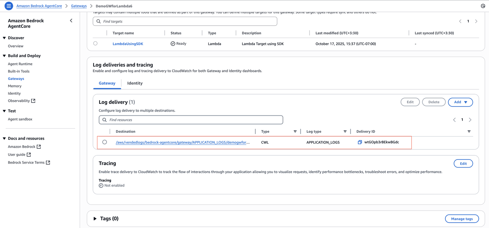

### Vended Logs: Invoking tools/list operation on AgentCore Gateway

#### Obtaining token for inbound Gateway Authentication

```python
print(
    "Requesting the access token from Amazon Cognito authorizer...May fail for some time till the domain name propogation completes"
)
token_response = utils.get_token(user_pool_id, client_id, client_secret, scopeString, REGION)
token = token_response["access_token"]
print("Token response:", token)
```

#### Enable Live Tailing in Amazon CloudWatch

```python
print(cloudwatch_log_group)
```

* Head to **[Amazon CloudWatch console](https://console.aws.amazon.com/cloudwatch/home)**
* Navigate to **Log Groups**
* Select specific log group from above output: for example **/aws/vendedlogs/bedrock-agentcore/gateway/APPLICATION_LOGS/gatewayID**
* Click on **Start tailing**

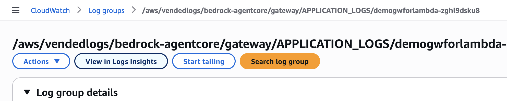

#### Invoking tools/list on AgentCore Gateway

```python
from mcp.client.streamable_http import streamablehttp_client
from strands.tools.mcp.mcp_client import MCPClient


def create_streamable_http_transport():
    return streamablehttp_client(gatewayURL, headers={"Authorization": f"Bearer {token}"})


client = MCPClient(create_streamable_http_transport)

with client:
    # Retrieve all tool capabilities from the gateway
    tools = client.list_tools_sync()
    for tool in tools:
        print(tool.tool_name)
```

#### What happens in the backend? 

**There will be 8 log messages corresponding to the operation above with 3 Trace IDs, 3 Request IDs and 3 Span IDs.** 

**Flow Sequence from the Vended logs showing details such as`trace_id`, `span_id`,`request_id`.** <br/>
**You can also see the `gateway_id`.**

**Trace ID:** Represents the overall transaction or agent workflow—covering the full flow of processing a user’s conversation, orchestration, and tool invocations

**Request ID:** Identifies a specific request made to the AgentCore gateway within the context of a trace. Multiple request IDs can exist within a trace, reflecting different API calls or gateway events during the transaction.

**Span ID:** Marks a specific action or operation performed for a particular request. Each request may generate several spans, each with its own span ID, representing granular steps such as tool calls or memory events within the parent request

**Sequence showing MCP handshake, list tools request:**

There are 3 trace ids with 3 request and span ids:

<font color="blue">Trace ID: 1 -> MCP Handshake <br/></font>
<font color="purple">Trace ID: 2 -> Readiness after Handshake - notifications/initialized <br/></font>
<font color="green">Trace ID: 3 -> Tools/list Request / Response<br/></font>

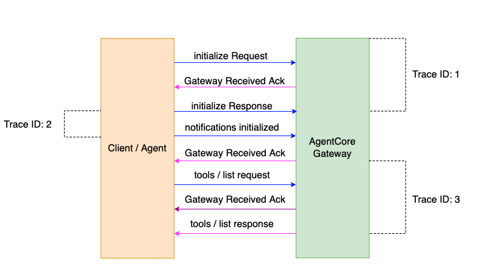


**Trace ID: 68eb191773c47c5f6babe5cb4f81bd69**

* <font color="blue">Client → Gateway: "Hi, I'm client MCP v0.1.0, can we talk using protocol version 2025-06-18"</font> <br/><br/>
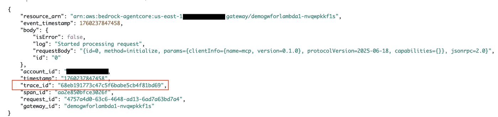
* <font color="blue">Gateway → Client: "Yes, I can talk to you."</font> <br/><br/>
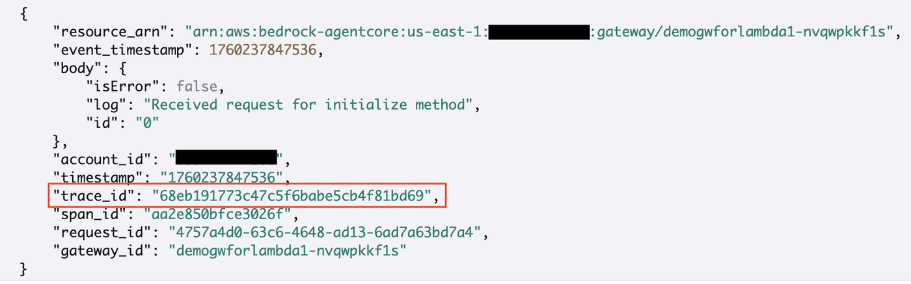
* <font color="blue"> Gateway → Client: "This is my info" </font> <br/><br/>
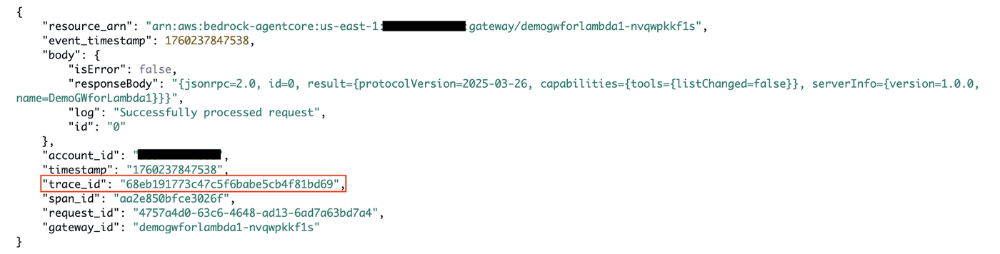

**Trace ID: 68eb1917268b63ef1290ed317254df8c**
* <font color="purple">Client → Gateway: "After successful initialization, the client sends a notification to indicate it’s ready:"</font> <br/><br/>
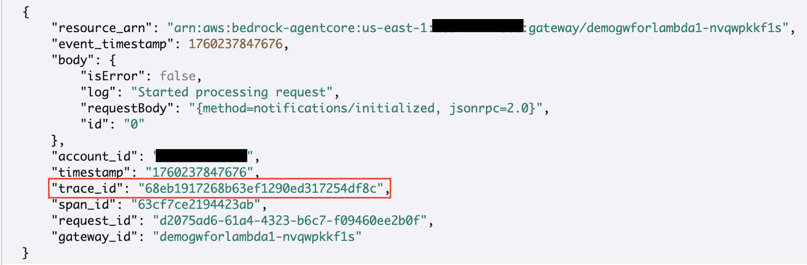
* <font color="purple">Gateway → Client: "Received notification about system being ready"</font> <br/><br/>
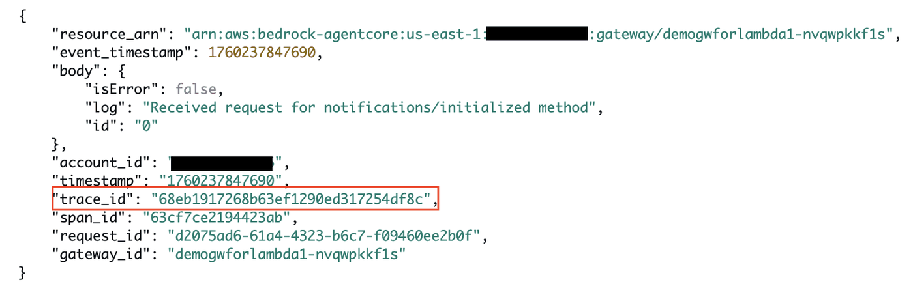

**Trace ID: 68eb19177631f5357c06be8c182a99df**
* <font color="green">Client → Gateway: "Calling list/tools"</font> <br/><br/>
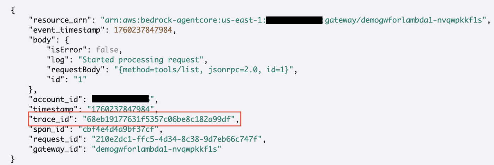
* <font color="green">Gateway → Client: "Received tools list request"</font> <br/><br/>
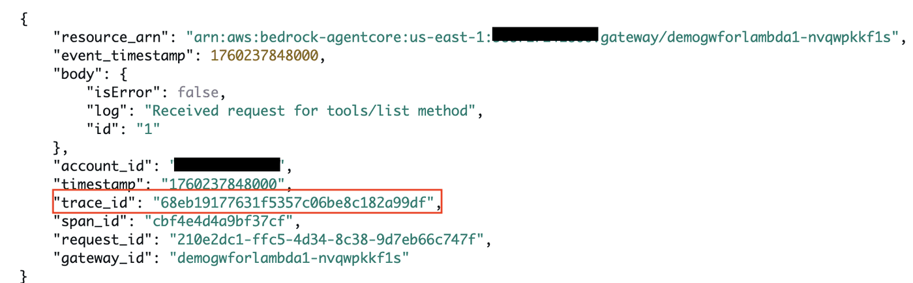
* <font color="green">Gateway → Client: "Here are your tools: get_order_tool and update_order_tool"</font> (Complete Response)<br/><br/>
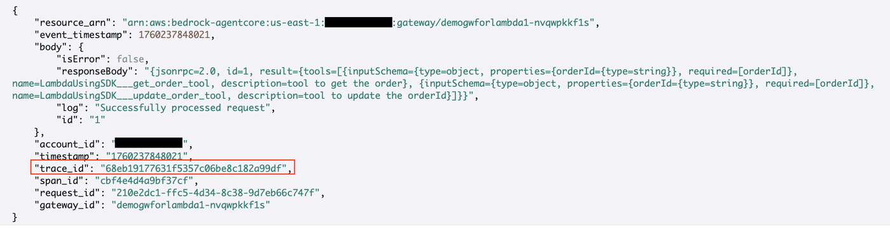

### Configure tracing delivery to CloudWatch using the console

This section describes how to enable trace delivery to CloudWatch to track the flow of interactions through your application allowing you to visualize requests, identify performance bottlenecks, troubleshoot errors, and optimize performance.

#### Step 1: Create delivery source for traces

```python
traces_source_response = logs_client.put_delivery_source(
    name=f"{gateway_name}-traces-source",
    logType="TRACES",
    resourceArn=create_response["gatewayArn"],
)
```

#### Step 2: Create delivery destinations

```python
# A delivery destination can represent a log group in CloudWatch Logs, an Amazon S3 bucket, a delivery stream in Firehose, or X-Ray. Here we are using CloudWatch log group.

traces_destination_response = logs_client.put_delivery_destination(
    name=f"{gateway_name}-traces-destination", deliveryDestinationType="XRAY"
)
print(traces_destination_response["deliveryDestination"]["arn"])
```

#### Step 3: Create traces delivery (connect sources to destinations)

```python
# Create a logs delivery by pairing the source and destination. A delivery is a connection between a logical delivery source and a logical delivery destination that you have already created.
delivery_response = logs_client.create_delivery(
    deliverySourceName=f"{gateway_name}-traces-source",
    deliveryDestinationArn=traces_destination_response["deliveryDestination"]["arn"],
)
```

```python
import time

time.sleep(10)
```

#### Step 4: Check AWS Console 

* Head to [Amazon Bedrock AgentCore](https://console.aws.amazon.com/bedrock-agentcore/) service on AWS Console.
* Ensure that the AWS region is correct.
* Select **Gateways**.
* Select the Gateway you created.
* Check **Tracing** to verify that it is `Enabled`

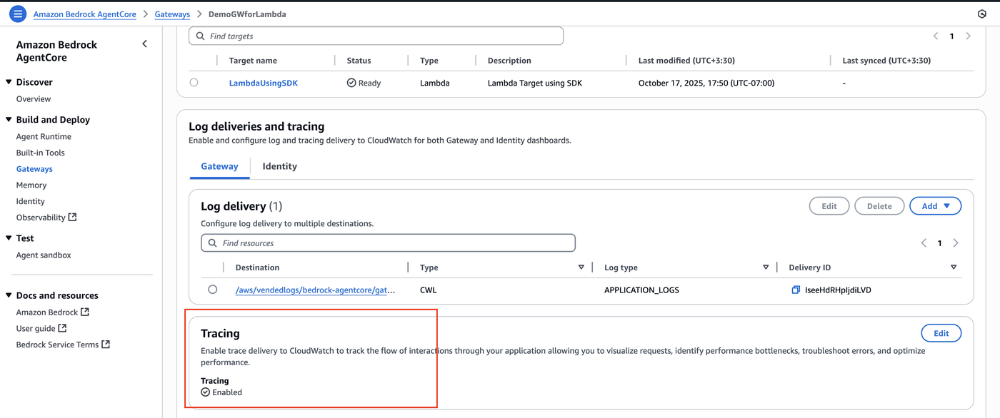

### Traces in GenAI Observability Dashboard - Gateway Level

#### Invoking tools/list operation on AgentCore Gateway

```python
from strands.tools.mcp.mcp_client import MCPClient


def create_streamable_http_transport():
    return streamablehttp_client(gatewayURL, headers={"Authorization": f"Bearer {token}"})


client = MCPClient(create_streamable_http_transport)

# Define specific tool parameters
TOOL_NAME = "LambdaUsingSDK___get_order_tool"
ORDER_ID = "123"

with client:
    try:
        # Call the get_order_tool
        result = client.call_tool_sync(
            tool_use_id="get-order-id-123-call-1",
            name=TOOL_NAME,
            arguments={"orderId": ORDER_ID},
        )

        # Print the tool's response
        print(f"\nGet Order Tool Response for Order ID {ORDER_ID}:")
        print(f"Content: {result['content'][0]['text']}")

    except Exception as e:
        print(f"Error occurred while calling {TOOL_NAME}: {str(e)}")
```

#### Amazon CloudWatch Gateway Traces and Spans

<font color="red"> **NOTE: It takes atleast 2-5 min for the Gateway and Traces to be reflected in the GenAI Observability Dashboard below.** </font>

```python
print(cloudwatch_log_group)
```

* Head to **[Amazon CloudWatch console](https://console.aws.amazon.com/cloudwatch/home)**
* Navigate to **Log Groups**
* Select specific log group from above output: for example **/aws/vendedlogs/bedrock-agentcore/gateway/APPLICATION_LOGS/gatewayID**
* Select `Search all log streams`
* In the CloudWatch logs, search for `LambdaUsingSDK___get_order_tool` keyword in the logs. <br/>
* Identify and note down the Trace ID corresponding to operation shown in the screenshot below.

For example: **68ed6dc01c0556e2735177ed3794422a**

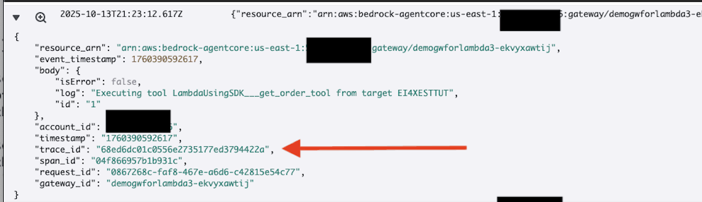

* Navigate to **GenAI Observability** -> **Bedrock AgentCore**
* Select **Gateways**

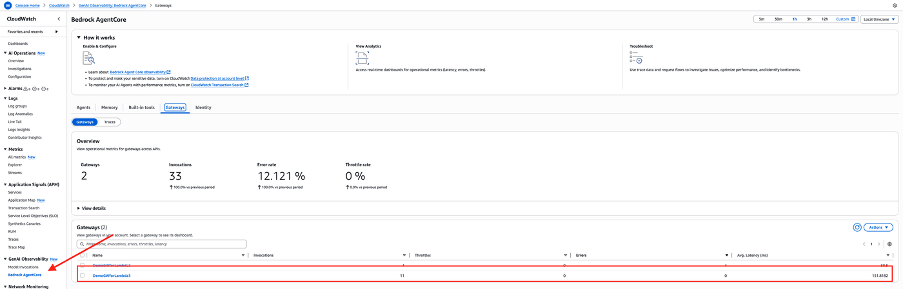

* Select **Traces** and search for the Trace ID: **68ed6dc01c0556e2735177ed3794422a**.
* Click on **Trace ID** to view Spans and Latency. In this particular example, you can see that `InvokeTool` operation took 580ms and average span latency is 290ms. 

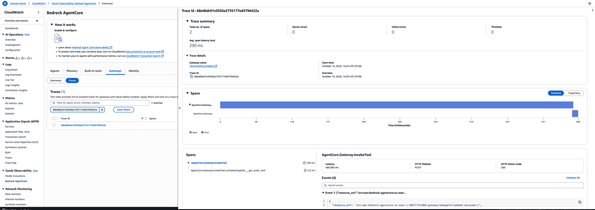

**Note:You may need to adjust the Time Window on upper right hand corner accordingly if you dont see Traces.**

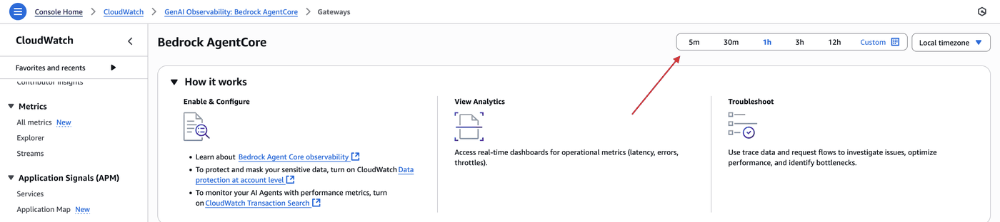

* Scroll down further in the trace to check out `span metadata` for more details: <br/>

   `kind:SERVER` - tracks the overall execution details, tool invoked, gateway details, AWS request ID, trace and span ID.<br/>
   `kind:CLIENT` - covers the specific target that was invoked and details around it like target type, target execution time, target execution start and end times, etc.<br/>

  The screenshot below shows that the tool execution took 378ms (`execute_tool_latency_ms`) and the time the gateway took barring tool execution is 152 ms (`overhead_latency`) under `AgentCore.Gateway.InvokeTool`.

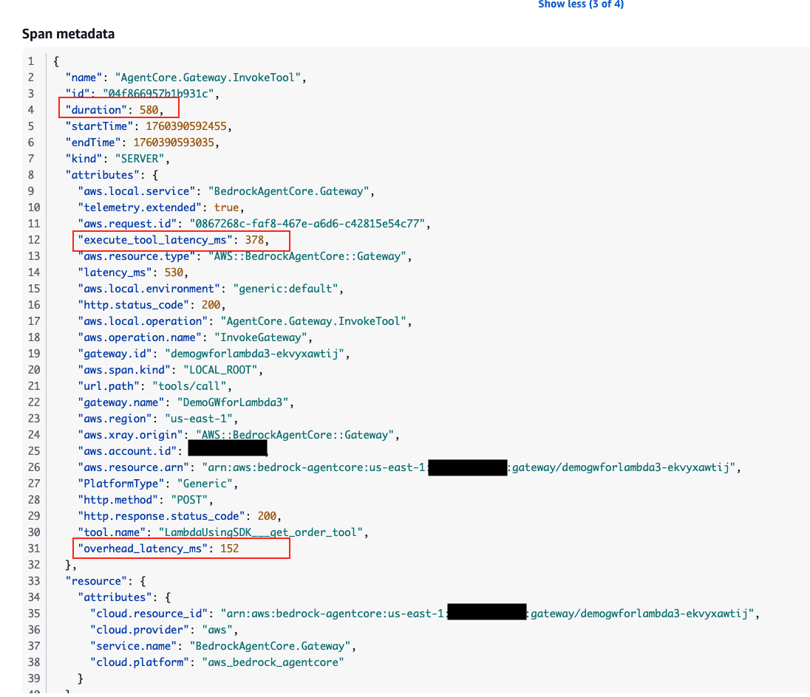

### Using Amazon CloudWatch for detecting root cause of issues 

**Scenario:** Sending invalid token to the gateway and checking the logs and spans.

#### Setting an invalid token

```python
token1 = "12345"
```

```python
print(cloudwatch_log_group)
```

#### Start Live Tail of CloudWatch Logs

* Head to **[Amazon CloudWatch console](https://console.aws.amazon.com/cloudwatch/home)**
* Navigate to **Log Groups**
* Select specific log group from above output: for example **/aws/vendedlogs/bedrock-agentcore/gateway/APPLICATION_LOGS/gatewayID**
* Click on **Start tailing**


#### Invoking specific gateway tool with invalid token

```python
from strands.tools.mcp.mcp_client import MCPClient


def create_streamable_http_transport():
    return streamablehttp_client(gatewayURL, headers={"Authorization": f"Bearer {token1}"})


client = MCPClient(create_streamable_http_transport)

# Define specific tool parameters
TOOL_NAME = "LambdaUsingSDK___get_order_tool"
ORDER_ID = "123"

with client:
    try:
        # Call the get_order_tool
        result = client.call_tool_sync(
            tool_use_id="get-order-id-123-call-1",
            name=TOOL_NAME,
            arguments={"orderId": ORDER_ID},
        )

        # Print the tool's response
        print(f"\nGet Order Tool Response for Order ID {ORDER_ID}:")
        print(f"Content: {result['content'][0]['text']}")

    except Exception as e:
        print(f"Error occurred while calling {TOOL_NAME}: {str(e)}")
```

#### More information in Amazon CloudWatch Logs

The generated exception **does not provide useful information about the root cause of the issue**:

    raise MCPClientInitializationError("the client initialization failed") from e
    strands.types.exceptions.MCPClientInitializationError: the client initialization failed


To understand the root cause behind the exception, check the CloudWatch logs.

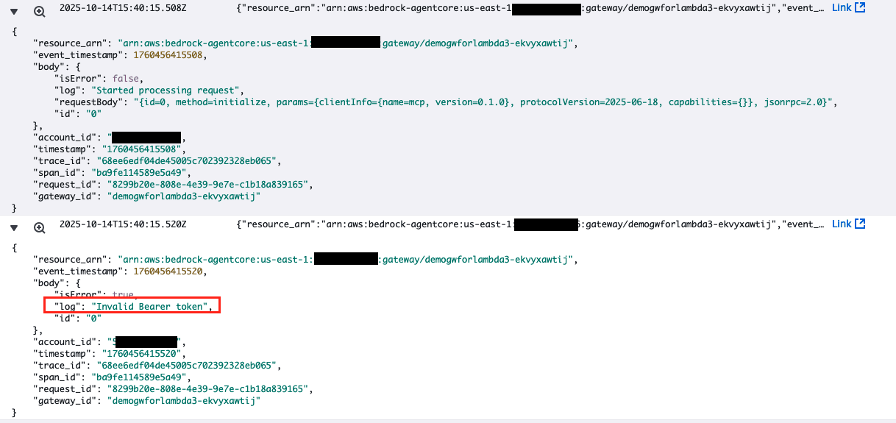

#### More information in Traces and Spans

* Note down the value of `trace_id` from the above logs. 
* In CloudWatch console, navigate to **GenAI Observability** -> **Bedrock AgentCore**
* Select **Gateways**
* Select **Traces** and search for the Trace ID: **68ee6edf04de45005c702392328eb065**.
* You can find more details in the spans as shown in the screenshot below.

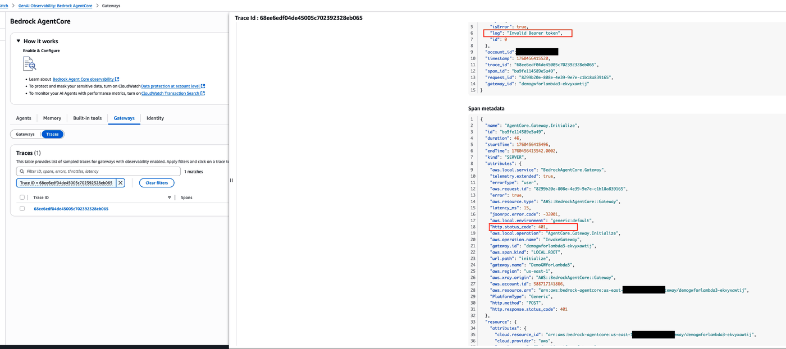

### AgentCore Gateway CloudWatch Metrics

* Head to **[Amazon CloudWatch console](https://console.aws.amazon.com/cloudwatch/home)**
* Select **Metrics** -> **All metrics** 
* Select **AWS namespaces** -> **Bedrock-AgentCore**
* Select **Method, Name, Operation, Protocol, Resource**.  For aggregration at Operation level, you can select **Method, Operation, Protocol, Resource**.
* Select Metrics of choice to create a dashboard or to view values.

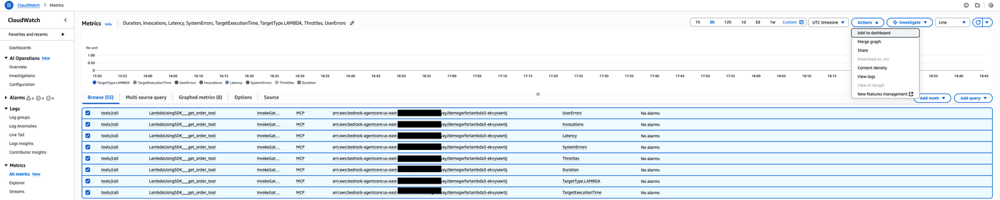

### Understanding Agent Traces - Strands Agent on AgentCore Runtime connecting to AgentCore Gateway

#### Note down values for Required Variables below including double quotes

```python
print('mcp_url: "%s"' % gatewayURL)
print('user_pool_id: "%s"' % user_pool_id)
print('client_id: "%s"' % client_id)
print('client_secret: "%s"' % client_secret)
print('scopeString: "%s"' % scopeString)
token_endpoint = f"https://{user_pool_id.replace('_', '')}.auth.{REGION}.amazoncognito.com/oauth2/token"
print('token_endpoint: "%s"' % token_endpoint)
print('region: "%s"' % REGION)
```

#### Code for Bedrock Agent to be deployed via AgentCore Runtime

<font color="red"> Replace the values of **mcp_url**, **user_pool_id**, **client_id**, **client_secret**, **scopeString**, **token_endpoint** and **region** in the code.</font>

This Python code below creates a Strands agent that connects to AWS Bedrock AgentCore Gateway to access and use external tools through the Model Context Protocol (MCP). The agent authenticates using AWS Cognito credentials, retrieves available tools from the gateway, and processes user queries by invoking those tools through a Claude language model.

```python
%%writefile strands_agent_gateway.py
from bedrock_agentcore.runtime import BedrockAgentCoreApp
from datetime import datetime
from strands import Agent, tool
import logging
from strands.models import BedrockModel
from strands.tools import mcp
from strands.tools.mcp.mcp_client import MCPClient
from mcp.client.streamable_http import streamablehttp_client
from bedrock_agentcore_starter_toolkit.operations.gateway.client import GatewayClient
import os
import time
import functools
import asyncio
import json
import argparse

#### Substitute the values below with ones from above output:

# GateWay URL:
mcp_url = #<mcp_url> # Replace this. For example: "https://1demogatewayforlambda-tpwablbixre.gateway.bedrock-agentcore.us-west-2.amazonaws.com/mcp"
# # Cognito parameters:
user_pool_id =  #<user_pool_id> # Replace this. For example: "us-west-2_CpyXraYjW"
client_id = #<client_id> # Replace this. For example: "5ifm4heh1r3oa19r2mnngsvung"
client_secret =  #<client_secret> # Replace this. For example: "kchfnio0inegso43jrc2js0ntgqc5ku2uplhd9v7vp0bo8sp1g0"
scopeString =  #<scopeString> # Replace this. For example: "sample-agentcore-gateway-id/gateway:read sample-agentcore-gateway-id/gateway:write"
token_endpoint =  #<token_endpoint> # Replace this. For example: "https://us-west-2_CpyXraYjW.auth.us-west-2.amazoncognito.com/oauth2/token"
region =  #<region> # Replace this. For example: "us-west-2"

###########################################

model_id = "global.anthropic.claude-haiku-4-5-20251001-v1:0"
bedrockmodel = BedrockModel(
    inference_profile_id= model_id,
    temperature=0,
    streaming=True,
)

# Defining  client as our GatewayClient
client = GatewayClient(region_name=region)
client.logger.setLevel(logging.DEBUG)

# Get token
client_config = {
    "user_pool_id": user_pool_id,
    "client_id": client_id,
    "client_secret": client_secret,
    "scope": scopeString,
    "region": region,
    "token_endpoint": token_endpoint
}

token_response = client.get_access_token_for_cognito(client_config)
access_token = token_response
print(access_token)


# Get Gateway tools
def create_streamable_http_transport(mcp_url: str, access_token: str):
    return streamablehttp_client(mcp_url, headers={"Authorization": f"Bearer {access_token}"})
  
def get_full_tools_list(client):
    more_tools = True
    tools = []
    pagination_token = None
    while more_tools:
        tmp_tools = client.list_tools_sync(pagination_token=pagination_token)
        tools.extend(tmp_tools)
        if tmp_tools.pagination_token is None:
            more_tools = False
        else:
            more_tools = True 
            pagination_token = tmp_tools.pagination_token
    return tools

def run_agent(mcp_url: str, access_token: str, user_message: str):
    try:
        mcp_client = MCPClient(lambda: create_streamable_http_transport(mcp_url, access_token))
        #region="us-east-1"
        
        with mcp_client:
            tools = get_full_tools_list(mcp_client)
            print(f"Found the following tools: {[tool.tool_name for tool in tools]}")
            agent = Agent(model=bedrockmodel,tools=tools, callback_handler=None)
            print("\nThinking...\n")
            print(user_message)
            result = agent(user_message)        
        return result            
    except Exception as e:
        print(f"Error in run_agent: {e}")
        return {"message": f"Error processing request: {str(e)}"}
        
        
# Define our app referencing the pre-built BedrockAgentCoreApp
app = BedrockAgentCoreApp()

@app.entrypoint
def invoke(payload):
    try:
        """Process user input and return a response"""
        user_message = payload.get("prompt", "Hello")

        result = run_agent(mcp_url, access_token, user_message)
        print(result)
        return {"result": result.message}
    except Exception as e:
        return {"result": f"Error: {str(e)}"}

if __name__ == "__main__":
    app.run()
```

```python
from bedrock_agentcore_starter_toolkit import Runtime
from boto3.session import Session

boto_session = Session()
region = boto_session.region_name

agentcore_runtime = Runtime()
agent_name = "strands_demo_agent"
response = agentcore_runtime.configure(
    entrypoint="strands_agent_gateway.py",
    auto_create_execution_role=True,
    auto_create_ecr=True,
    requirements_file="requirements.txt",
    region=region,
    agent_name=agent_name,
)
response
```

```python
launch_result = agentcore_runtime.launch()
```

```python
import time

time.sleep(20)
```

#### If you see the error "Memory is still provisioning (current status: CREATING). Short-term memory takes 30-90 seconds to activate.", wait for a few more seconds before you retry.

```python
invoke_response = agentcore_runtime.invoke({"prompt": "list all tools"})
invoke_response
```

```python
invoke_response = agentcore_runtime.invoke({"prompt": "Check the order information for order id 123"})
invoke_response
```

#### Check out the Traces in Amazon Cloudwatch - Agent Level

* Head to **[Amazon CloudWatch console](https://console.aws.amazon.com/cloudwatch/home)** 
* Navigate to **GenAI Observability** -> **Bedrock AgentCore**
* Select **Agents** -> **Traces**
* There are **two traces**, one for each prompt (list/tools and another one for invoking specific tool). 

**Note:You may need to adjust the Time Window on upper right hand corner accordingly if you dont see Traces.**


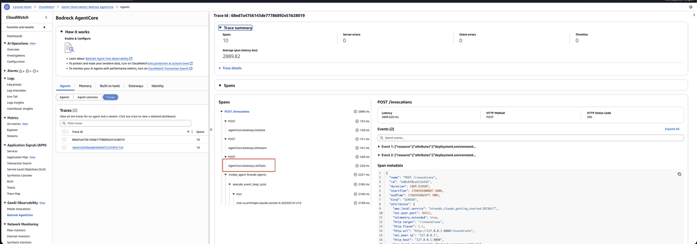
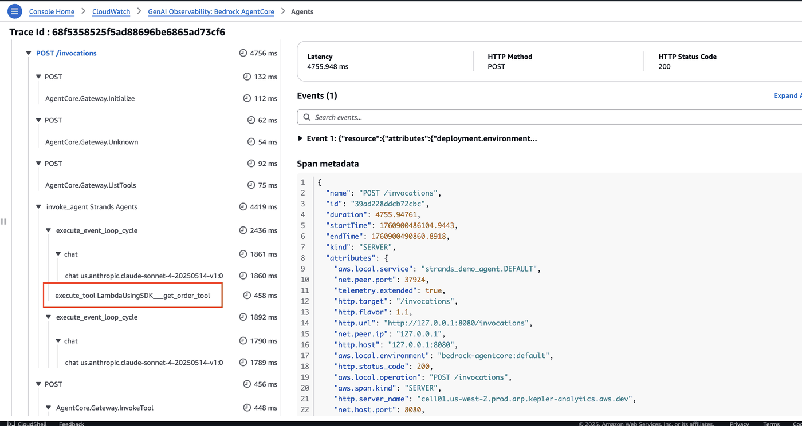

#### Check out the Spans for a Trace

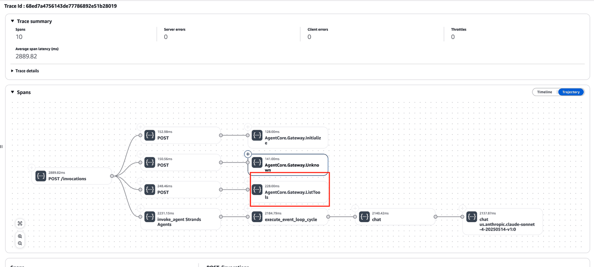

## Observability with AWS Cloud Trail

#### Generating unique S3 bucket name for storing CloudTrail logs

```python
import boto3
import uuid


def generate_s3_bucket_name(base_name):
    account_id = boto3.client("sts").get_caller_identity()["Account"]
    unique_id = uuid.uuid4().hex[:8]
    return f"{base_name}-{account_id}-{unique_id}".lower()
```

#### Function for creating S3 bucket

```python
import boto3


def create_bucket(bucket_name, region):
    try:
        s3_client = boto3.client("s3", region_name=region)
        if region == "us-east-1":
            s3_client.create_bucket(Bucket=bucket_name)
        else:
            location = {"LocationConstraint": region}
            s3_client.create_bucket(Bucket=bucket_name, CreateBucketConfiguration=location)
        print(f"Bucket '{bucket_name}' created in region '{region}'")
        return True
    except ClientError as e:
        print(f"Error creating bucket: {e}")
        return False
```

#### Function for creating S3 bucket policy allowing CloudTrail to store logs

```python
import boto3
import json


def put_bucket_policy(bucket_name, account_id, region, trail_name):
    s3_client = boto3.client("s3")
    trail_arn = f"arn:aws:cloudtrail:{region}:{account_id}:trail/{trail_name}"
    bucket_policy = {
        "Version": "2012-10-17",
        "Statement": [
            {
                "Sid": "AWSCloudTrailAclCheck20150319",
                "Effect": "Allow",
                "Principal": {"Service": "cloudtrail.amazonaws.com"},
                "Action": "s3:GetBucketAcl",
                "Resource": f"arn:aws:s3:::{bucket_name}",
                "Condition": {"StringEquals": {"aws:SourceArn": trail_arn}},
            },
            {
                "Sid": "AWSCloudTrailWrite20150319",
                "Effect": "Allow",
                "Principal": {"Service": "cloudtrail.amazonaws.com"},
                "Action": "s3:PutObject",
                "Resource": f"arn:aws:s3:::{bucket_name}/AWSLogs/{account_id}/*",
                "Condition": {
                    "StringEquals": {
                        "s3:x-amz-acl": "bucket-owner-full-control",
                        "aws:SourceArn": trail_arn,
                    }
                },
            },
        ],
    }
    policy_string = json.dumps(bucket_policy)
    s3_client.put_bucket_policy(Bucket=bucket_name, Policy=policy_string)
    print(f"Bucket policy set for bucket '{bucket_name}' with trail '{trail_name}'.")
```

#### Function for creating CloudWatch Log Group for CloudTrail logs

```python
def create_cloudwatch_log_group(log_group_name, account_id, region):
    """Create CloudWatch Logs group and CloudTrail log stream"""
    logs_client = boto3.client("logs")
    log_stream_name = f"{account_id}_CloudTrail_{region}"

    try:
        # Create log group
        logs_client.create_log_group(logGroupName=log_group_name)
        print(f"Created CloudWatch Logs group: {log_group_name}")

        # Create log stream
        logs_client.create_log_stream(logGroupName=log_group_name, logStreamName=log_stream_name)
        print(f"Created CloudWatch Logs stream: {log_stream_name}")

    except logs_client.exceptions.ResourceAlreadyExistsException as e:
        if "Log Group" in str(e):
            print(f"CloudWatch Logs group already exists: {log_group_name}")
            # Try to create log stream even if group exists
            try:
                logs_client.create_log_stream(logGroupName=log_group_name, logStreamName=log_stream_name)
                print(f"Created CloudWatch Logs stream: {log_stream_name}")
            except logs_client.exceptions.ResourceAlreadyExistsException:
                print(f"CloudWatch Logs stream already exists: {log_stream_name}")
        else:
            print(f"CloudWatch Logs stream already exists: {log_stream_name}")


# Usage in main code
account_id = boto3.client("sts").get_caller_identity()["Account"]
trail_name = "AgentCoreGatewayMgmtTrail"
log_group_name = f"/aws/cloudtrail/{trail_name}"
```

#### Function for creating IAM role for CloudTrail

```python
def create_cloudwatch_role(role_name, account_id, region, log_group_name):
    """Create IAM role for CloudTrail to CloudWatch Logs"""
    iam = boto3.client("iam")

    # Trust policy for CloudTrail
    trust_policy = {
        "Version": "2012-10-17",
        "Statement": [
            {
                "Effect": "Allow",
                "Principal": {"Service": "cloudtrail.amazonaws.com"},
                "Action": "sts:AssumeRole",
            }
        ],
    }

    # CloudWatch Logs policy with specific log group name
    role_policy = {
        "Version": "2012-10-17",
        "Statement": [
            {
                "Sid": "AWSCloudTrailCreateLogStream2014110",
                "Effect": "Allow",
                "Action": ["logs:CreateLogStream"],
                "Resource": [
                    f"arn:aws:logs:{region}:{account_id}:log-group:{log_group_name}:log-stream:{account_id}_CloudTrail_{region}*"
                ],
            },
            {
                "Sid": "AWSCloudTrailPutLogEvents20141101",
                "Effect": "Allow",
                "Action": ["logs:PutLogEvents"],
                "Resource": [
                    f"arn:aws:logs:{region}:{account_id}:log-group:{log_group_name}:log-stream:{account_id}_CloudTrail_{region}*"
                ],
            },
        ],
    }

    try:
        # Create the role
        role = iam.create_role(RoleName=role_name, AssumeRolePolicyDocument=json.dumps(trust_policy))

        # Attach the policy
        iam.put_role_policy(
            RoleName=role_name,
            PolicyName=f"{role_name}-policy",
            PolicyDocument=json.dumps(role_policy),
        )

        # Wait briefly for role to be available
        import time

        time.sleep(5)

        return role["Role"]["Arn"]
    except iam.exceptions.EntityAlreadyExistsException:
        return iam.get_role(RoleName=role_name)["Role"]["Arn"]
```

```python
account_id = boto3.client("sts").get_caller_identity()["Account"]
trail_name = "AgentCoreGatewayMgmtTrail"
role_name = f"CloudTrail-{trail_name}-{REGION}"
print(role_name)
log_group_name = f"/aws/cloudtrail/{trail_name}"
print(log_group_name)

# Creating CloudWatchRole
cloudwatch_role_arn = create_cloudwatch_role(role_name, account_id, REGION, log_group_name)
print(cloudwatch_role_arn)
```

#### Allowing time for IAM role to propagate

```python
import time

time.sleep(20)
```

#### Creating S3 bucket and CloudWatch Log Group

```python
import boto3

# Create S3 bucket for CloudTrail logs
s3_bucket_name = generate_s3_bucket_name("agentcore-gateway")
print(s3_bucket_name)
create_bucket(s3_bucket_name, REGION)
put_bucket_policy(s3_bucket_name, account_id, REGION, trail_name)

# Create CloudWatch Logs group
create_cloudwatch_log_group(log_group_name, account_id, REGION)
```

```python
import time

time.sleep(20)
```

#### Creating CloudTrail for logging Management Events for AgentCore Gateway

```python
# Creating cloudtrail
cloudtrail_client = boto3.client("cloudtrail", region_name=REGION)

# Create the trail
response = cloudtrail_client.create_trail(
    Name=trail_name,
    S3BucketName=s3_bucket_name,
    CloudWatchLogsLogGroupArn=f"arn:aws:logs:{REGION}:{account_id}:log-group:{log_group_name}:*",
    CloudWatchLogsRoleArn=cloudwatch_role_arn,
)

# Define advanced event selector to only include management events for AgentCore Gateway
advanced_event_selectors = [
    {
        "Name": "AgentCoreGatewayManagementEvents",
        "FieldSelectors": [{"Field": "eventCategory", "Equals": ["Management"]}],
    }
]

# Update the trail to use the advanced event selector
cloudtrail_client.put_event_selectors(TrailName=trail_name, AdvancedEventSelectors=advanced_event_selectors)

# Start logging events
cloudtrail_client.start_logging(Name=trail_name)

print(f"CloudTrail trail '{trail_name}' created and logging management events for AgentCore Gateway.")
```

#### Verify on AWS Console

* Head to [AWS CloudTrail]((https://console.aws.amazon.com/cloudtrailv2/)) service in AWS Console 
* Ensure that the AWS region is correct. 
* Click on Trails and verify whether `AgentCoreGatewayMgmtTrail` is created successfully.

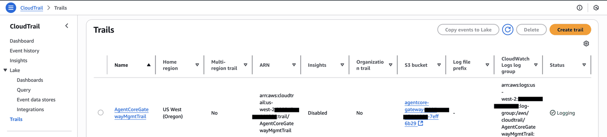

```python
import time

time.sleep(20)
```

#### Invoking tools/list and checking the API tracking via CloudTrail Events

```python
def list_gateways():
    """List all Bedrock Agent Core gateways"""
    try:
        # Initialize Bedrock Agent Core client
        gateway_client = boto3.client("bedrock-agentcore-control", region_name=REGION)

        print(REGION)

        # List gateways
        response = gateway_client.list_gateways()
        print(response)

        # Print gateway details
        if "items" in response and response["items"]:
            print("\nGateways found:")
            for gateway in response["items"]:
                print(f"\nName: {gateway.get('name')}")
                print(f"Gateway ID: {gateway.get('gatewayId')}")
                print(f"Gateway URL: {gateway.get('gatewayUrl')}")
                print(f"Status: {gateway.get('status')}")
                print(f"Protocol Type: {gateway.get('protocolType')}")
                print(f"Authorizer Type: {gateway.get('authorizerType')}")
        else:
            print("No gateways found")

        return response.get("gateways", [])

    except Exception as e:
        print(f"Error listing gateways: {str(e)}")
        return []


# Call the function
gateways = list_gateways()
```

```python
import time

time.sleep(20)
```

<font color="red"> Note it may take a few seconds for the log entries to get reflected in the CloudTrail logs</font>

#### Check the CloudTrail Events

* Head to **[Amazon CloudWatch console](https://console.aws.amazon.com/cloudwatch/home)** <br/>
* Select CloudTrail Log Groups -> `/aws/cloudtrail/AgentCoreGatewayMgmtTrail` -> `Search all log streams` <br/>
* Search for `ListGateways` in the search box.

**ListGateways API call of the type `IAMUser`** <br/><br/>
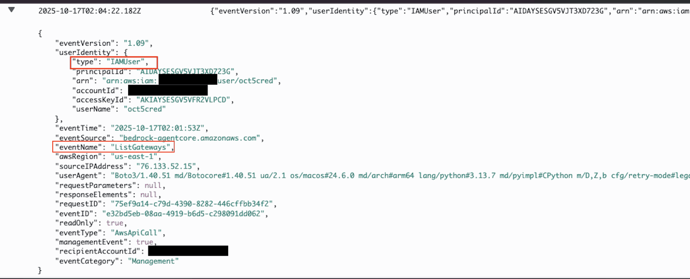

Similary CreateGateway operations and other [gateway events](https://docs.aws.amazon.com/bedrock-agentcore/latest/devguide/gateway-event-types.html) also logged under Management Events. <br/> <br/>
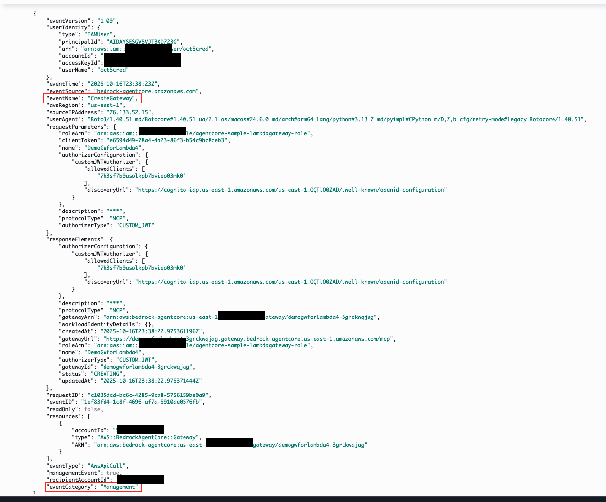

#### Logging Data Events in CloudTrail

**<font color="red"> Note that data events will incur additional costs and are not enabled by default due to the volume</font>**

```python
account_id = boto3.client("sts").get_caller_identity()["Account"]
trail_name = "AgentCoreGatewayDataTrail"
role_name = f"CloudTrail-{trail_name}-{REGION}"
print(role_name)
log_group_name = f"/aws/cloudtrail/{trail_name}"
print(log_group_name)

# Creating CloudWatchRole
cloudwatch_role_arn = create_cloudwatch_role(role_name, account_id, REGION, log_group_name)
print(cloudwatch_role_arn)
```

```python
import time

time.sleep(20)
```

```python
import boto3

# Create S3 bucket for CloudTrail logs
s3_bucket_name = generate_s3_bucket_name("agentcore-gateway-data")
print(s3_bucket_name)
create_bucket(s3_bucket_name, REGION)
put_bucket_policy(s3_bucket_name, account_id, REGION, trail_name)

# Create CloudWatch Logs group
create_cloudwatch_log_group(log_group_name, account_id, REGION)
```

```python
import time

time.sleep(20)
```

```python
# Creating cloudtrail
cloudtrail_client = boto3.client("cloudtrail", region_name=REGION)

# Create the trail
response = cloudtrail_client.create_trail(
    Name=trail_name,
    S3BucketName=s3_bucket_name,
    CloudWatchLogsLogGroupArn=f"arn:aws:logs:{REGION}:{account_id}:log-group:{log_group_name}:*",
    CloudWatchLogsRoleArn=cloudwatch_role_arn,
)

# Define advanced event selector to only include management events for AgentCore Gateway
advanced_event_selectors = [
    {
        "Name": "AgentCoreGatewayDataEvents",
        "FieldSelectors": [
            {"Field": "eventCategory", "Equals": ["Data"]},
            {
                "Field": "resources.type",
                "Equals": ["AWS::BedrockAgentCore::Gateway"],  # Corrected service name
            },
        ],
    }
]

# Update the trail to use the advanced event selector
cloudtrail_client.put_event_selectors(TrailName=trail_name, AdvancedEventSelectors=advanced_event_selectors)

# Start logging events
cloudtrail_client.start_logging(Name=trail_name)

print(f"CloudTrail trail '{trail_name}' created and logging data events for AgentCore Gateway.")
```

#### Verify on AWS Console

* Head to [AWS CloudTrail]((https://console.aws.amazon.com/cloudtrailv2/)) service in AWS Console 
* Ensure that the AWS region is correct. 
* Click on Trails and verify whether `AgentCoreGatewayDataTrail` is created successfully.


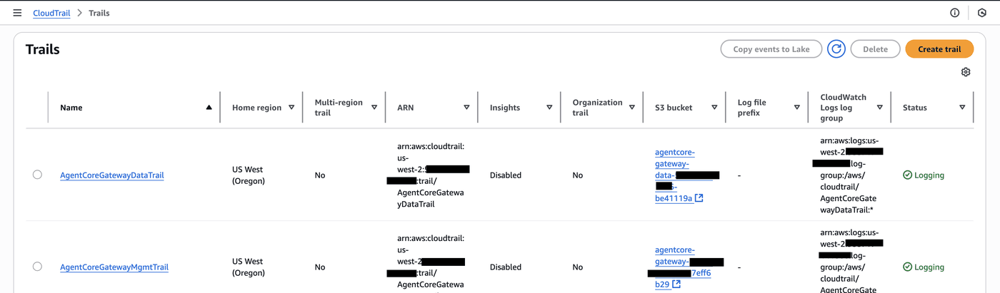

```python
import time

time.sleep(20)
```

#### Obtaining token for AgentCore Gateway

```python
print(
    "Requesting the access token from Amazon Cognito authorizer...May fail for some time till the domain name propogation completes"
)
token_response = utils.get_token(user_pool_id, client_id, client_secret, scopeString, REGION)
token = token_response["access_token"]
print("Token response:", token)
```

```python
from strands.tools.mcp.mcp_client import MCPClient

print(gatewayURL)


def create_streamable_http_transport():
    return streamablehttp_client(gatewayURL, headers={"Authorization": f"Bearer {token}"})


client = MCPClient(create_streamable_http_transport)

# Define specific tool parameters
TOOL_NAME = "LambdaUsingSDK___get_order_tool"
ORDER_ID = "123"

with client:
    try:
        # Call the get_order_tool
        result = client.call_tool_sync(
            tool_use_id="get-order-id-123-call-1",
            name=TOOL_NAME,
            arguments={"orderId": ORDER_ID},
        )

        # Print the tool's response
        print(f"\nGet Order Tool Response for Order ID {ORDER_ID}:")
        print(f"Content: {result['content'][0]['text']}")

    except Exception as e:
        print(f"Error occurred while calling {TOOL_NAME}: {str(e)}")
```

#### Check the CloudTrail Events

* Head to **[Amazon CloudWatch console](https://console.aws.amazon.com/cloudwatch/home)** <br/>
* Select CloudTrail Log Groups -> `/aws/cloudtrail/AgentCoreGatewayDataTrail` -> `Search all log streams` <br/>

<font color="red"> Note it may take a few seconds for the log entries to get reflected in the CloudTrail logs</font>

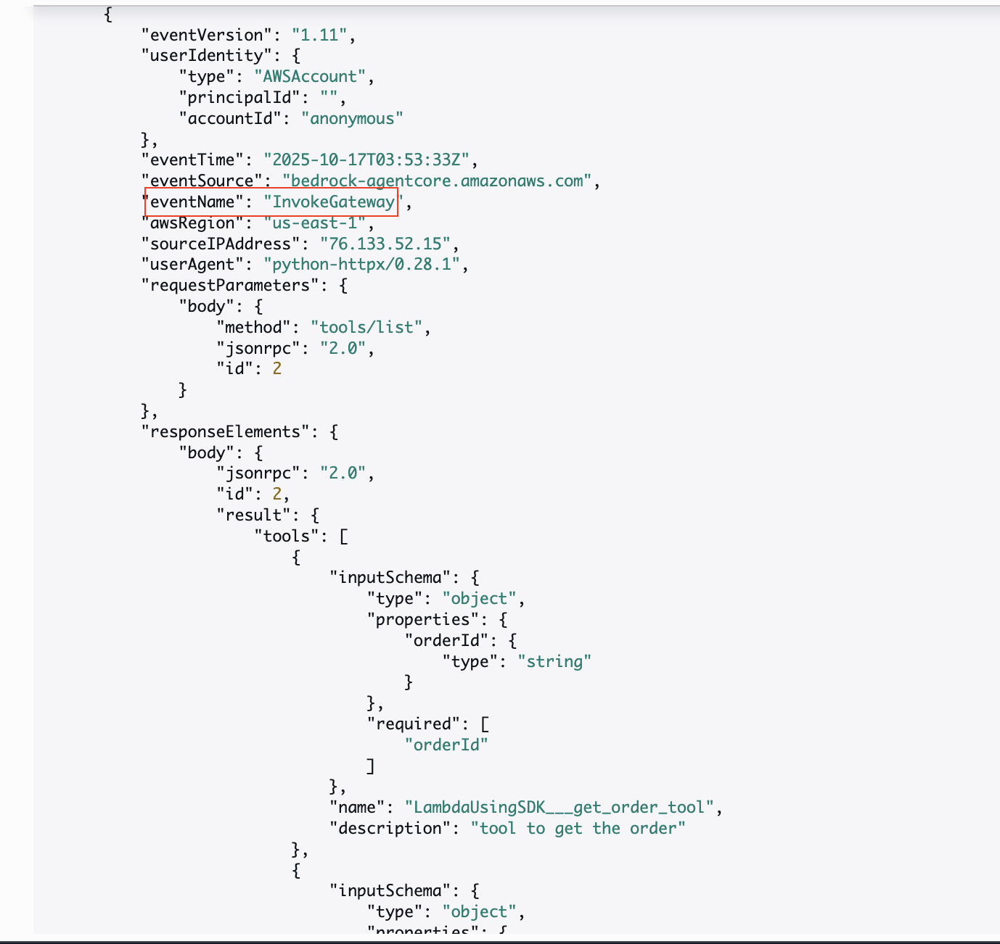

# Clean up

This script deletes almost all the resources created. However, if some resources do not get deleted or fail to get deleted, you may need to delete them manually.

```python
import boto3
import os
import time

# Initialize AWS clients
REGION = os.environ.get("AWS_DEFAULT_REGION", "us-east-1")
gateway_client = boto3.client("bedrock-agentcore-control", region_name=REGION)
logs_client = boto3.client("logs", region_name=REGION)
cloudtrail_client = boto3.client("cloudtrail", region_name=REGION)
s3_client = boto3.client("s3", region_name=REGION)
iam_client = boto3.client("iam", region_name=REGION)
cognito_client = boto3.client("cognito-idp", region_name=REGION)
lambda_client = boto3.client("lambda", region_name=REGION)
ecr_client = boto3.client("ecr", region_name=REGION)
sts_client = boto3.client("sts", region_name=REGION)

account_id = sts_client.get_caller_identity()["Account"]


def get_agentcore_runtime_id_by_name(agent_name, region):
    """
    Get AgentCore Runtime ID by agent name.

    :param agent_name: The name of the agent runtime to find
    :param region: AWS region where the runtime exists
    :return: The runtime ID if found, None otherwise
    """
    agent_runtime_id = None

    try:
        client = boto3.client("bedrock-agentcore-control", region_name=region)
        response = client.list_agent_runtimes()
        print(f"Searching for agent runtime matching: {agent_name}")

        for runtime in response.get("agentRuntimes", []):
            if runtime.get("agentRuntimeId", "").find(agent_name) >= 0:
                agent_runtime_id = runtime.get("agentRuntimeId")
                print(f"Found runtime ID: {agent_runtime_id}")
                print(f"Found runtime: {agent_name}")
                break

        return agent_runtime_id

    except ClientError as e:
        print(f"Error listing runtimes: {e}")
        raise


def delete_agentcore_runtime(region, agent_runtime_id):
    """Delete AgentCore runtime using the correct runtime ID"""
    try:
        client = boto3.client("bedrock-agentcore-control", region_name=region)
        response = client.delete_agent_runtime(agentRuntimeId=agent_runtime_id)
        print(f"Successfully deleted AgentCore Runtime: {agent_runtime_id}")
        return response
    except ClientError as e:
        error_code = e.response["Error"]["Code"]
        if error_code == "ResourceNotFoundException":
            print(f"AgentCore runtime {agent_runtime_id} not found - may already be deleted")
        elif error_code == "ConflictException":
            print(f"Cannot delete AgentCore runtime {agent_runtime_id} - resource is in use")
        elif error_code == "AccessDeniedException":
            print("Access denied. Ensure caller has bedrock-agentcore:DeleteAgentRuntime permission")
        else:
            print(f"Error deleting AgentCore runtime: {e}")
        raise


def delete_ecr_repository(ecr_repository_name):
    """Delete ECR repository if name is provided"""
    try:
        print(f"Deleting ECR repository: {ecr_repository_name}")
        ecr_response = ecr_client.delete_repository(
            repositoryName=ecr_repository_name,
            force=True,  # Force delete even if images exist
        )
        print(f"ECR repository {ecr_repository_name} deleted successfully")
        return ecr_response
    except ClientError as e:
        print(f"Error deleting ECR repository {ecr_repository_name}: {e}")
        raise


def delete_gateway_and_targets(gateway_id):
    """Delete gateway targets and the gateway itself"""
    try:
        # List and delete all gateway targets
        targets_response = gateway_client.list_gateway_targets(gatewayIdentifier=gateway_id)
        for target in targets_response.get("items", []):
            target_id = target["targetId"]
            print(f"Deleting gateway target: {target_id}")
            gateway_client.delete_gateway_target(gatewayIdentifier=gateway_id, targetIdentifier=target_id)
            time.sleep(2)

        # Delete the gateway
        print(f"Deleting gateway: {gateway_id}")
        gateway_client.delete_gateway(gatewayIdentifier=gateway_id)
        print(f"Gateway {gateway_id} deleted successfully")

    except ClientError as e:
        print(f"Error deleting gateway: {e}")


def delete_cloudwatch_log_deliveries(gateway_name):
    """Delete CloudWatch log and trace deliveries"""
    try:
        logs_source_name = f"{gateway_name}-logs-source"
        traces_source_name = f"{gateway_name}-traces-source"

        # List and delete deliveries
        deliveries = logs_client.describe_deliveries()
        for delivery in deliveries.get("deliveries", []):
            delivery_id = delivery["id"]
            print(f"Deleting delivery: {delivery_id}")
            logs_client.delete_delivery(id=delivery_id)
            time.sleep(1)

        # Delete delivery sources
        for source_name in [logs_source_name, traces_source_name]:
            try:
                print(f"Deleting delivery source: {source_name}")
                logs_client.delete_delivery_source(name=source_name)
            except ClientError as e:
                print(f"Error deleting source {source_name}: {e}")

        # Delete delivery destinations
        destinations = logs_client.describe_delivery_destinations()
        for dest in destinations.get("deliveryDestinations", []):
            dest_name = dest["name"]
            if "bedrock-agentcore-gw" in dest_name or gateway_name in dest_name:
                print(f"Deleting delivery destination: {dest_name}")
                logs_client.delete_delivery_destination(name=dest_name)
                time.sleep(1)

    except ClientError as e:
        print(f"Error deleting log deliveries: {e}")


def delete_cloudwatch_log_groups(gateway_id):
    """Delete CloudWatch log groups"""
    log_groups = [
        f"/aws/vendedlogs/bedrock-agentcore/gateway/APPLICATION_LOGS/{gateway_id}",
        "/aws/cloudtrail/AgentCoreGatewayMgmtTrail",
        "/aws/cloudtrail/AgentCoreGatewayDataTrail",
    ]

    for log_group in log_groups:
        try:
            print(f"Deleting log group: {log_group}")
            logs_client.delete_log_group(logGroupName=log_group)
            print(f"Log group {log_group} deleted")
        except ClientError as e:
            print(f"Error deleting log group {log_group}: {e}")


def delete_cloudtrail_trails():
    """Delete CloudTrail trails"""
    trails = ["AgentCoreGatewayMgmtTrail", "AgentCoreGatewayDataTrail"]

    for trail_name in trails:
        try:
            # Stop logging
            print(f"Stopping logging for trail: {trail_name}")
            cloudtrail_client.stop_logging(Name=trail_name)
            time.sleep(2)

            # Delete trail
            print(f"Deleting trail: {trail_name}")
            cloudtrail_client.delete_trail(Name=trail_name)
            print(f"Trail {trail_name} deleted")

        except ClientError as e:
            print(f"Error deleting trail {trail_name}: {e}")


def empty_and_delete_s3_bucket(bucket_name):
    """Empty and delete S3 bucket"""
    try:
        # List and delete all objects
        print(f"Emptying S3 bucket: {bucket_name}")
        paginator = s3_client.get_paginator("list_objects_v2")

        for page in paginator.paginate(Bucket=bucket_name):
            if "Contents" in page:
                objects = [{"Key": obj["Key"]} for obj in page["Contents"]]
                s3_client.delete_objects(Bucket=bucket_name, Delete={"Objects": objects})

        # Delete the bucket
        print(f"Deleting S3 bucket: {bucket_name}")
        s3_client.delete_bucket(Bucket=bucket_name)
        print(f"S3 bucket {bucket_name} deleted")

    except ClientError as e:
        print(f"Error deleting S3 bucket {bucket_name}: {e}")


def delete_iam_roles():
    """Delete IAM roles created for CloudTrail and Gateway"""
    roles = [
        f"CloudTrail-AgentCoreGatewayMgmtTrail-{REGION}",
        f"CloudTrail-AgentCoreGatewayDataTrail-{REGION}",
        "sample-lambdagateway-role",
    ]

    for role_name in roles:
        try:
            # Delete inline policies
            policies = iam_client.list_role_policies(RoleName=role_name)
            for policy_name in policies.get("PolicyNames", []):
                print(f"Deleting inline policy {policy_name} from role {role_name}")
                iam_client.delete_role_policy(RoleName=role_name, PolicyName=policy_name)

            # Detach managed policies
            attached_policies = iam_client.list_attached_role_policies(RoleName=role_name)
            for policy in attached_policies.get("AttachedPolicies", []):
                print(f"Detaching policy {policy['PolicyArn']} from role {role_name}")
                iam_client.detach_role_policy(RoleName=role_name, PolicyArn=policy["PolicyArn"])

            # Delete the role
            print(f"Deleting IAM role: {role_name}")
            iam_client.delete_role(RoleName=role_name)
            print(f"IAM role {role_name} deleted")

        except ClientError as e:
            print(f"Error deleting IAM role {role_name}: {e}")


def delete_cognito_resources(user_pool_id, client_id):
    """Delete Cognito user pool and client"""
    try:
        # Delete app client
        print(f"Deleting Cognito app client: {client_id}")
        cognito_client.delete_user_pool_client(UserPoolId=user_pool_id, ClientId=client_id)

        # Delete resource server
        resource_server_id = "sample-agentcore-gateway-id"
        print(f"Deleting Cognito resource server: {resource_server_id}")
        cognito_client.delete_resource_server(UserPoolId=user_pool_id, Identifier=resource_server_id)

        # Delete user pool
        print(f"Deleting Cognito user pool: {user_pool_id}")
        cognito_client.delete_user_pool(UserPoolId=user_pool_id)
        print(f"Cognito user pool {user_pool_id} deleted")

    except ClientError as e:
        print(f"Error deleting Cognito resources: {e}")


def delete_lambda_function(function_name="gateway_lambda"):
    """Delete Lambda function"""
    try:
        print(f"Deleting Lambda function: {function_name}")
        lambda_client.delete_function(FunctionName=function_name)
        print(f"Lambda function {function_name} deleted")
    except ClientError as e:
        print(f"Error deleting Lambda function: {e}")


# Main cleanup execution
if __name__ == "__main__":
    print("=" * 80)
    print("AMAZON BEDROCK AGENTCORE GATEWAY OBSERVABILITY CLEANUP")
    print("=" * 80)

    # IMPORTANT: Replace these with your actual resource identifiers
    gateway_id = gatewayID  # Replace with actual gateway ID
    gateway_name = gatewayID  # Replace with actual gateway name
    user_pool_id = user_pool_id  # Replace with actual user pool ID
    client_id = client_id  # Replace with actual client ID
    agent_name = "strands_demo_agent"  # Agent name to search for
    ecr_repository_name = "bedrock-agentcore-" + agent_name  # Replace with actual ECR repository name (optional)

    # Step 1: Lookup and Delete AgentCore Runtime Agent and ECR Repository
    print("\n[1/9] Looking up and Deleting AgentCore Runtime Agent and ECR Repository...")
    try:
        # Use your function to lookup the runtime ID by name
        agent_runtime_id = get_agentcore_runtime_id_by_name(agent_name, REGION)

        if agent_runtime_id:
            print(f"Region: {REGION}")
            # Delete the runtime using your delete function
            delete_agentcore_runtime(REGION, agent_runtime_id)
            time.sleep(5)

            # Delete ECR repository if provided
            if ecr_repository_name:
                delete_ecr_repository(ecr_repository_name)
            else:
                print("No ECR repository name provided - skipping ECR cleanup")
        else:
            print(f"No runtime found matching: {agent_name}")
            print("Skipping AgentCore runtime deletion...")
    except Exception as e:
        print(f"Failed to delete AgentCore runtime: {e}")
        print("Continuing with remaining cleanup tasks...")

    # Step 2: Delete Gateway and Targets
    print("\n[2/9] Deleting Gateway and Targets...")
    try:
        delete_gateway_and_targets(gateway_id)
        time.sleep(5)
    except Exception as e:
        print(f"Error in gateway deletion: {e}")

    # Step 3: Delete CloudWatch Log Deliveries
    print("\n[3/9] Deleting CloudWatch Log Deliveries...")
    try:
        delete_cloudwatch_log_deliveries(gateway_name)
        time.sleep(5)
    except Exception as e:
        print(f"Error deleting log deliveries: {e}")

    # Step 4: Delete CloudWatch Log Groups
    print("\n[4/9] Deleting CloudWatch Log Groups...")
    try:
        delete_cloudwatch_log_groups(gateway_id)
    except Exception as e:
        print(f"Error deleting log groups: {e}")

    # Step 5: Delete CloudTrail Trails
    print("\n[5/9] Deleting CloudTrail Trails...")
    try:
        delete_cloudtrail_trails()
        time.sleep(5)
    except Exception as e:
        print(f"Error deleting trails: {e}")

    # Step 6: Delete S3 Buckets
    print("\n[6/9] Deleting S3 Buckets...")
    try:
        buckets = s3_client.list_buckets()
        for bucket in buckets["Buckets"]:
            bucket_name = bucket["Name"]
            if "agentcore-gateway" in bucket_name:
                empty_and_delete_s3_bucket(bucket_name)
    except Exception as e:
        print(f"Error deleting S3 buckets: {e}")

    # Step 7: Delete IAM Roles
    print("\n[7/9] Deleting IAM Roles...")
    try:
        delete_iam_roles()
    except Exception as e:
        print(f"Error deleting IAM roles: {e}")

    # Step 8: Delete Cognito Resources
    print("\n[8/9] Deleting Cognito Resources...")
    try:
        delete_cognito_resources(user_pool_id, client_id)
    except Exception as e:
        print(f"Error deleting Cognito resources: {e}")

    # Step 9: Delete Lambda Function
    print("\n[9/9] Deleting Lambda Function...")
    try:
        delete_lambda_function()
    except Exception as e:
        print(f"Error deleting Lambda function: {e}")

    print("\n" + "=" * 80)
    print("CLEANUP PROCESS COMPLETED")
    print("=" * 80)
    print("\nPlease verify in the AWS Console that all resources have been deleted.")
    print("Some resources may take a few minutes to fully delete.")
    print("\nVerification checklist:")
    print("  ✓ Amazon Bedrock AgentCore - Gateways")
    print("  ✓ Amazon Bedrock AgentCore - Runtime")
    print("  ✓ Amazon CloudWatch - Log Groups")
    print("  ✓ AWS CloudTrail - Trails")
    print("  ✓ Amazon S3 - Buckets")
    print("  ✓ AWS IAM - Roles")
    print("  ✓ Amazon Cognito - User Pools")
    print("  ✓ AWS Lambda - Functions")
    print("  ✓ Amazon ECR - Repositories")
```
