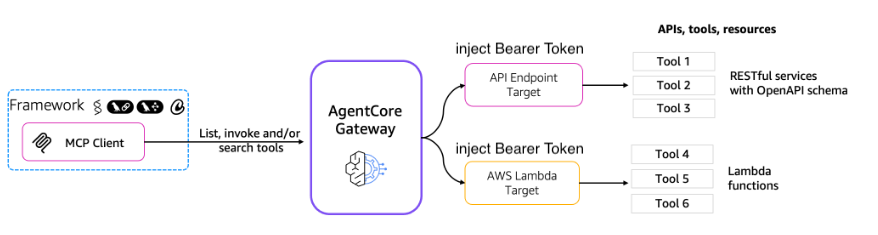
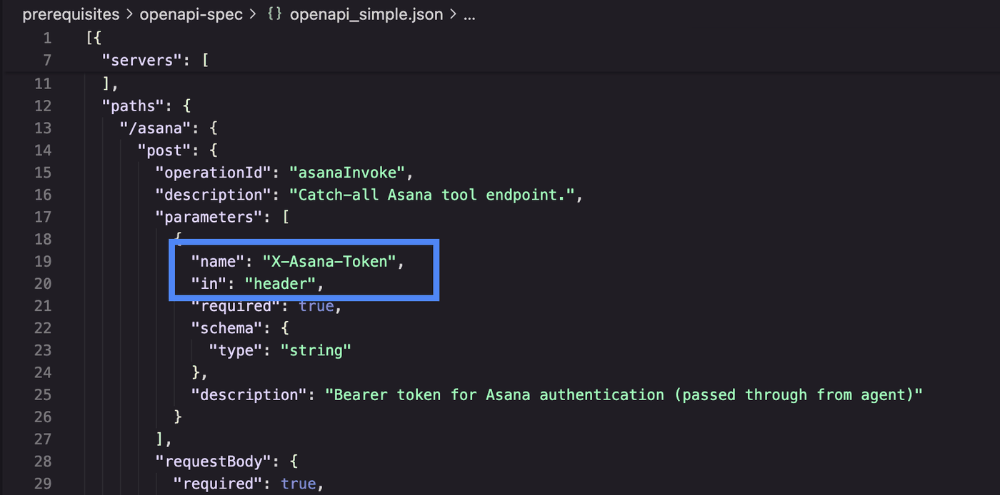
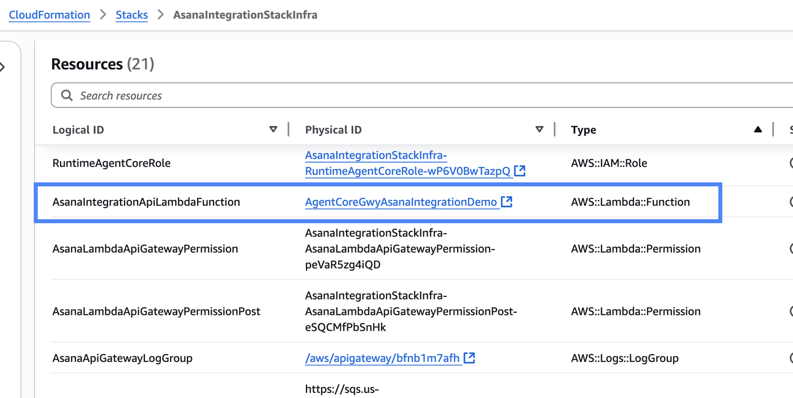
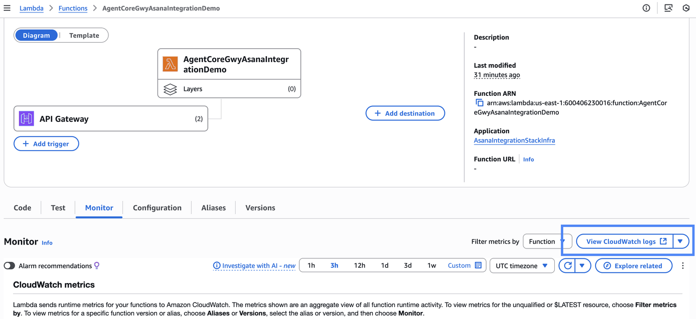
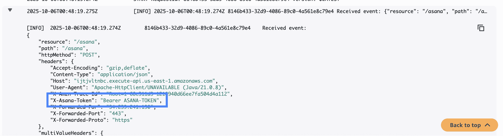
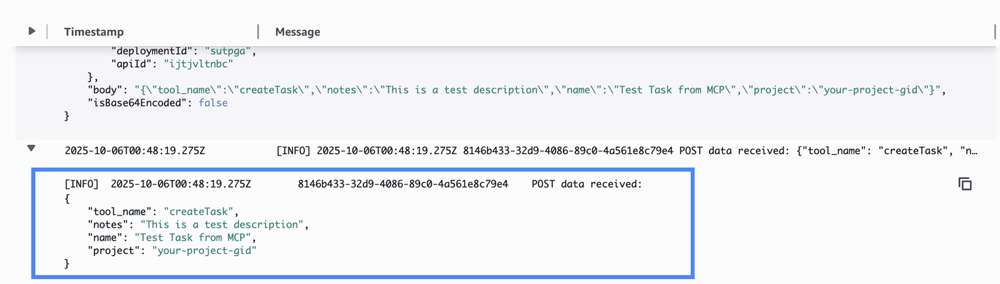

# Bearer Token Injection Pattern for AWS Bedrock AgentCore Gateway Targets

## Overview

Customers want to enable an MCP Client(Cyphr, Amazon Q) to invoke tools (e.g., Asana functions) exposed by backend targets (Lambda functions or RESTful services) through the AgentCore Gateway. A critical requirement is to inject a dynamic bearer token from the MCP client into the target for authentication with the downstream service. The key challenge is the mandatory outbound authentication requirement in the AgentCore Gateway, which can conflict with dynamic header injection.

The following architecture diagram shows the solution we are proposing for injecting auth token (e.g. "Bearer actual-auth-token") without conflicting with AgentCore outbound auth mechanism.



In the solution, the MCP client obtains the auth token to be used by the tool and passes it on to the AgentCore Gateway as a parameter in the payload which is then passed on to the tool as a custom header.

### Deploying the prerequisites

This solution deploys the following components: 
- Cognito user pool for inbound authentication 
- API Gateway with Lambda integration
- API Key for AgentCore outbound authentication

```python
cd prerequisites/agentcore-components
```

```python
!bash prereq.sh
```

## Creating AgentCore Gateway with API Gateway as target

### Step 1: Install Dependencies and Import 

Before we start, let's install the pre-requisites for this lab

```python
import os
import sys

# Get the directory of the current script
if "__file__" in globals():
    current_dir = os.path.dirname(os.path.abspath(__file__))
else:
    current_dir = os.getcwd()  # Fallback if __file__ is not defined (e.g., Jupyter)

print(f"current_dir set to {current_dir}")

# Navigate to the directory containing utils.py (two level up to "04-bearer-token-injection")
utils_dir = os.path.abspath(os.path.join(current_dir, "../.."))

# Add to sys.path
sys.path.insert(0, utils_dir)

import utils
```

```python
# Install required packages
%pip install -U -r ../../requirements.txt -q
```

### Step 2: Create AgentCore Gateway

The following Python code:
- creates AgentCore Gateway
- adds the previously created APIGateway with API_KEY as Target.

```python
# Import the functions from the agentcore_gateway_creation module
import sys
import os

# Add the current directory to Python path to import the module
current_dir = os.getcwd()
if current_dir not in sys.path:
    sys.path.insert(0, current_dir)

from agentcore_gateway_creation import create_agentcore_gateway

# Step 1: Create the AgentCore Gateway
print("🚀 Creating AgentCore Gateway...")
gateway = create_agentcore_gateway()
print(f"✅ Gateway created with ID: {gateway['id']}")
print(f"Gateway URL: {gateway['gateway_url']}")
```

### Step 3: Add APIGateway as target in AgentCore Gateway

Let us first make sure that the AgentCore Gateway is "READY".

```python
import time
import boto3

# Wait for gateway to be in ACTIVE state
gateway_client = boto3.client("bedrock-agentcore-control")
while True:
    response = gateway_client.get_gateway(gatewayIdentifier=gateway["id"])
    status = response["status"]
    print(f"Gateway status: {status}")
    if status == "READY":
        break
    elif status == "FAILED":
        raise Exception("Gateway creation failed")
    time.sleep(10)  # Wait 10 seconds before checking again
```

Now let's add the gateway target to complete the setup:

```python
from agentcore_gateway_creation import add_gateway_target

# Step 2: Add Gateway Target
print("🎯 Adding Gateway Target...")
add_gateway_target(gateway["id"])
print("✅ Gateway target configuration completed!")
```

Let's look at OpenAPI Spec which used to define this target:



The token is defined as a header parameter in the schema and forwarded in an HTTP header: ```X-Asana-Token```. This is just an example, you can define header like this for your integration.

HTTP header is most conventional pattern for authentication tokens.

### Step 4: Test end to end flow

Let's now test the end to end flow where we will invoke ``` tools/list ``` from a MCP client.

```python
import os
import boto3
import time
import uuid
import json
import requests

# Step 1: Get inbound Auth token for MCP client to authenticate with AgentCore
token_url = utils.get_ssm_parameter("/app/asana/demo/agentcoregwy/cognito_token_url")
client_id = utils.get_ssm_parameter("/app/asana/demo/agentcoregwy/machine_client_id")
client_secret = utils.get_cognito_client_secret()
inbound_auth_token = utils.fetch_access_token(client_id, client_secret, token_url)
print("access token received")

# Step 2: Get Gateway config and prepare payload
GATEWAY_MCP_URL = gateway_url = (
    f"https://{utils.get_ssm_parameter('/app/asana/demo/agentcoregwy/gateway_id')}.gateway.bedrock-agentcore.us-east-1.amazonaws.com/mcp"
)

SESSION_ID = str(uuid.uuid4())
headers = {
    "Authorization": f"Bearer {inbound_auth_token}",  # For Inbound Auth
    "Content-Type": "application/json",
    "Mcp-Session-Id": SESSION_ID,
}

# Step 3: Call tools/list to get available tools
list_body = {"jsonrpc": "2.0", "id": "list-1", "method": "tools/list"}

list_response = requests.post(GATEWAY_MCP_URL, headers=headers, json=list_body)
print(f"tools/list Status: {list_response.status_code}")
print("Available Tools:")
print(json.dumps(list_response.json(), indent=2))
```

### Step 5: Bearer token injection from MCP client to AgentCore Gateway target

Now we will pass the bearer token ``` Bearer ASANA-TOKEN ``` in the parameters (you would replace ``` ASANA-TOKEN ``` with the actual token your MCP client would have obtained) and invoke the tool ```AgentCoreGwyAPIGatewayTarget___asanaInvoke``` from  ```tools/list``` response above.

```python
# Step 1: Get inbound Auth token for MCP client to authenticate with AgentCore
token_url = utils.get_ssm_parameter("/app/asana/demo/agentcoregwy/cognito_token_url")
client_id = utils.get_ssm_parameter("/app/asana/demo/agentcoregwy/machine_client_id")
client_secret = utils.get_cognito_client_secret()
inbound_auth_token = utils.fetch_access_token(client_id, client_secret, token_url)
print("access token received")

# Step 2: Get Gateway config and prepare payload
GATEWAY_MCP_URL = gateway_url = (
    f"https://{utils.get_ssm_parameter('/app/asana/demo/agentcoregwy/gateway_id')}.gateway.bedrock-agentcore.us-east-1.amazonaws.com/mcp"
)

SESSION_ID = str(uuid.uuid4())
headers = {
    "Authorization": f"Bearer {inbound_auth_token}",  # For Inbound Auth
    "Content-Type": "application/json",
    "Mcp-Session-Id": SESSION_ID,
}

# Step 3: Call tools/call with Asana token in arguments (will forward as header per updated schema)
call_body = {
    "jsonrpc": "2.0",
    "id": "call-1",
    "method": "tools/call",
    "params": {
        "name": "AgentCoreGwyAPIGatewayTarget___asanaInvoke",  # Exact name from tools/list
        "arguments": {
            "tool_name": "createTask",
            "X-Asana-Token": "Bearer ASANA-TOKEN",  # Actual Asana bearer token here (forwards to header)
            "name": "Test Task from MCP",
            "notes": "This is a test description",
            "project": "your-project-gid",  # Replace with actual Project GID
        },
    },
}

call_response = requests.post(GATEWAY_MCP_URL, headers=headers, json=call_body)
print(f"tools/call Status: {call_response.status_code}")
print("Tool Call Response:")
print(json.dumps(call_response.json(), indent=2))
```

### Step 6: Verifying the token injection

Let's verify the token injection by checking the logs in CloudWatch. Navigate to ```AsanaIntegrationStackInfra``` Cloudformation stack created in prerequisites: 

```CloudFormation -> Stacks -> AsanaIntegrationStackInfra``` and look for the Lambda function as shown below:
 


Open the Lambda function in a separate window and click on ```View CloudWatch Logs``` as shown in the screenshot below:   


The following screenshot shows logs from ```AgentCoreGwyAPIGatewayTarget___asanaInvoke``` tool invoke via AgentCore Gateway. It shows that the ``` Bearer token ``` was passed from MCP client to AgentCore Gateway all the way to the Lambda function in header ``` X-Asana-Token ``` as defined in the OpenAPI spec. 




This shows that the authentication token obtained by the MCP client can be used by the Lambda function (or another tool) to authenticate with 3rd party SaaS integration like Asana without conflicting with AgentCore outbound authentication.


Rest of the payload from MCP client is available to the Lambda function in the body of the event as shown below:


## Clean up

### Delete AgentCore Gateway

```python
import utils
import boto3

gateway_client = boto3.client("bedrock-agentcore-control")

gateway_id = "agentcore-gw-asana-integration"
utils.delete_gateway(gateway_client, gateway_id)
```

### Delete Cloudformation stacks

```python
cd 02-AgentCore-gateway/04-bearer-token-injection
```

```python
!bash clean_up.sh
```
