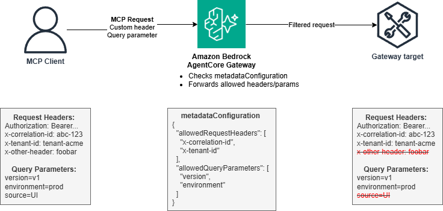

# AgentCore Gateway - Header and Query Parameter Propagation

## Overview

This tutorial demonstrates AgentCore Gateway's support for propagating custom HTTP headers and query parameters from clients to targets. This feature enables enterprise patterns like distributed tracing, multi-tenant isolation, API versioning, and rate limiting without requiring custom interceptor code.

### Why Header and Query Parameter Propagation Matters

Modern enterprise applications require passing contextual information through API calls:

- **Distributed Tracing**: Correlation IDs track requests across microservices
- **Multi-Tenancy**: Tenant identifiers ensure proper data isolation
- **API Versioning**: Version parameters route to appropriate implementations
- **Environment Routing**: Environment flags control staging vs production behavior
- **Rate Limiting**: Response headers communicate quota information

### Header Propagation vs Interceptor Approach

AgentCore Gateway provides two approaches for header handling:

1. **Header Propagation** (this tutorial): Configure `metadataConfiguration` to automatically forward specific headers and query parameters. Best for custom headers like correlation IDs, tenant IDs, and API versions.

2. **Interceptor Lambda** (tutorial 14-token-exchange-at-request-interceptor): Use an interceptor Lambda for security-sensitive scenarios like Authorization header token exchange, custom authentication logic, or dynamic header transformation.

### How Header Propagation Works

When creating a target, you specify which headers and query parameters to propagate:

```python
"metadataConfiguration": {
    "allowedRequestHeaders": ["x-correlation-id", "x-tenant-id"],
    "allowedResponseHeaders": ["x-rate-limit-remaining"],
    "allowedQueryParameters": ["version", "environment"]
}
```

The gateway automatically:
1. Extracts specified headers and query parameters from client requests
2. Forwards them to the target Lambda in the proper event structure
3. Returns specified response headers to the client

### Tutorial Details

| Information          | Details                                                   |
|:---------------------|:----------------------------------------------------------|
| Tutorial type        | Interactive                                               |
| AgentCore components | AgentCore Gateway                                         |
| Gateway Target type  | AWS Lambda                                                |
| Inbound Auth         | OAuth (Cognito)                                           |
| Outbound Auth        | AWS IAM                                                   |
| Tutorial components  | Creating AgentCore Gateway and Invoking AgentCore Gateway |
| Tutorial vertical    | Cross-vertical                                            |
| Example complexity   | Easy                                                      |
| SDK used             | boto3                                                     |

### Tutorial Architecture



---

**Architecture Flow:**

1. **Client**: Sends requests with custom headers (x-correlation-id, x-tenant-id) and query parameters (version, environment)
2. **AgentCore Gateway**: Configured with metadataConfiguration to allow specific headers and query parameters
3. **Target Lambda (MCP Server)**: Receives headers and query parameters in proper event structure, returns response headers

## Step 1: Install Dependencies

This step installs the required packages needed to interact with AWS services for creating MCP gateways.

```python
import subprocess
import sys

# Install required packages
subprocess.check_call([sys.executable, "-m", "pip", "install", "boto3", "requests"])
subprocess.check_call([sys.executable, "-m", "pip", "install", "strands-agents"])
subprocess.check_call([sys.executable, "-m", "pip", "install", "--upgrade", "setuptools", "pip"])

print("Dependencies installed successfully")
```

## Step 2: Setup and Configuration

Import required libraries and initialize AWS clients.

```python
import boto3
import json
import time
import zipfile
import io
from datetime import datetime
from botocore.exceptions import ClientError

# Initialize timestamp for unique resource naming
timestamp = datetime.now().strftime("%Y%m%d-%H%M%S")

# Set region
region = "us-east-1"

# Initialize AWS clients
lambda_client = boto3.client("lambda", region_name=region)
iam_client = boto3.client("iam", region_name=region)
agentcore_client = boto3.client("bedrock-agentcore-control", region_name=region)
cognito_client = boto3.client("cognito-idp", region_name=region)
sts_client = boto3.client("sts", region_name=region)

print(f"AWS clients initialized for region: {region}")
print(f"Timestamp for resource naming: {timestamp}")
```

## Step 3: Create Cognito User Pool for OAuth Authentication

This step creates a self-contained Cognito setup for OAuth authentication. This makes the notebook fully automated without requiring manual Cognito configuration.

**What gets created:**
- Cognito User Pool for authentication
- Resource Server with OAuth scopes (read, write)
- App Client for client credentials flow
- User Pool Domain for OAuth endpoints

**Variables exported:**
- `discovery_url` - Used in gateway configuration
- `client_id` - Used in gateway configuration and tests
- `client_secret` - Used in tests
- `token_endpoint` - Used in tests

```python
# Create Cognito User Pool
user_pool_name = f"header-propagation-pool-{timestamp}"
user_pool_response = cognito_client.create_user_pool(
    PoolName=user_pool_name,
    Policies={
        "PasswordPolicy": {
            "MinimumLength": 8,
            "RequireUppercase": False,
            "RequireLowercase": False,
            "RequireNumbers": False,
            "RequireSymbols": False,
        }
    },
)
user_pool_id = user_pool_response["UserPool"]["Id"]
print(f"User Pool created: {user_pool_id}")

# Create Resource Server
resource_server_identifier = f"header-propagation-api-{timestamp}"
cognito_client.create_resource_server(
    UserPoolId=user_pool_id,
    Identifier=resource_server_identifier,
    Name=f"HeaderPropagationAPI-{timestamp}",
    Scopes=[
        {"ScopeName": "read", "ScopeDescription": "Read access"},
        {"ScopeName": "write", "ScopeDescription": "Write access"},
    ],
)
print(f"Resource Server created: {resource_server_identifier}")

# Create App Client
app_client_response = cognito_client.create_user_pool_client(
    UserPoolId=user_pool_id,
    ClientName=f"header-propagation-client-{timestamp}",
    GenerateSecret=True,
    AllowedOAuthFlows=["client_credentials"],
    AllowedOAuthScopes=[
        f"{resource_server_identifier}/read",
        f"{resource_server_identifier}/write",
    ],
    AllowedOAuthFlowsUserPoolClient=True,
)
client_id = app_client_response["UserPoolClient"]["ClientId"]
client_secret = app_client_response["UserPoolClient"]["ClientSecret"]
print(f"App Client created: {client_id}")

# Create User Pool Domain
domain_name = f"header-prop-{timestamp}"
cognito_client.create_user_pool_domain(Domain=domain_name, UserPoolId=user_pool_id)
print(f"Domain created: {domain_name}")

# Construct OAuth endpoints
discovery_url = f"https://cognito-idp.{region}.amazonaws.com/{user_pool_id}/.well-known/openid-configuration"
token_endpoint = f"https://{domain_name}.auth.{region}.amazoncognito.com/oauth2/token"

print("\nOAuth Configuration:")
print(f"  Discovery URL: {discovery_url}")
print(f"  Token Endpoint: {token_endpoint}")
print(f"  Client ID: {client_id}")
print(f"  Client Secret: {client_secret[:20]}...")
```

## Step 4: Create AgentCore Gateway with OAuth Authentication

This step creates an AgentCore Gateway configured with OAuth authentication using the Cognito user pool created in Step 2.5.

**Key points:**
- OAuth authentication via Cognito
- Headers and query parameters will be configured at the target level (Step 5)
- Gateway automatically forwards configured headers based on target's metadataConfiguration

```python
# Create IAM role for Gateway
gateway_trust_policy = {
    "Version": "2012-10-17",
    "Statement": [
        {
            "Effect": "Allow",
            "Principal": {"Service": "bedrock-agentcore.amazonaws.com"},
            "Action": "sts:AssumeRole",
        }
    ],
}

iam_response = iam_client.create_role(
    RoleName=f"BedrockAgentCoreGatewayRole-{timestamp}",
    AssumeRolePolicyDocument=json.dumps(gateway_trust_policy),
    Description="IAM role for AgentCore Gateway",
)

# Attach policy for Lambda invocation
iam_client.put_role_policy(
    RoleName=f"BedrockAgentCoreGatewayRole-{timestamp}",
    PolicyName="LambdaInvokePolicy",
    PolicyDocument=json.dumps(
        {
            "Version": "2012-10-17",
            "Statement": [
                {
                    "Effect": "Allow",
                    "Action": ["lambda:InvokeFunction"],
                    "Resource": "*",
                }
            ],
        }
    ),
)

# Wait for role to be available
print("Waiting for IAM role to be available...")
time.sleep(10)

# Create Gateway
gateway_response = agentcore_client.create_gateway(
    name=f"header-propagation-gateway-{timestamp}",
    protocolType="MCP",
    protocolConfiguration={"mcp": {"supportedVersions": ["2025-03-26", "2025-06-18"]}},
    authorizerType="CUSTOM_JWT",
    authorizerConfiguration={
        "customJWTAuthorizer": {
            "discoveryUrl": discovery_url,
            "allowedClients": [client_id],
        }
    },
    roleArn=iam_response["Role"]["Arn"],
)

gateway_id = gateway_response["gatewayId"]

# Verify gateway was created
print(f"Gateway created with status: {gateway_response['status']}")
print(f"Gateway ID: {gateway_id}")

# Wait for gateway to be ready
print("\nWaiting for gateway to be ready...")
max_wait = 300
wait_interval = 10
elapsed = 0

while elapsed < max_wait:
    gateway_status = agentcore_client.get_gateway(gatewayIdentifier=gateway_id)
    status = gateway_status["status"]
    print(f"Gateway status: {status}")

    if status == "READY":
        gateway_url = gateway_status["gatewayUrl"]
        print("\nGateway is ready!")
        print(f"Gateway URL: {gateway_url}")
        break
    elif status in ["FAILED", "DELETING", "DELETED"]:
        print(f"Gateway creation failed with status: {status}")
        break

    time.sleep(wait_interval)
    elapsed += wait_interval

if elapsed >= max_wait:
    print("Gateway creation timed out")
```

## Step 5: Create Target Lambda with metadataConfiguration

This step creates the target Lambda function that will receive tool invocations from the gateway. The key feature is the `metadataConfiguration` which specifies which headers and query parameters to propagate.

**metadataConfiguration fields:**
- `allowedRequestHeaders`: List of request headers to forward to Lambda (e.g., x-correlation-id, x-tenant-id)
- `allowedResponseHeaders`: List of response headers to return to client (primarily for MCP server targets)
- `allowedQueryParameters`: List of query parameters to forward to Lambda (e.g., version, environment)

**How it works for MCP Lambda targets:**
1. Client sends MCP request with custom headers and query parameters
2. Gateway extracts only the allowed headers/parameters
3. Gateway unwraps MCP protocol and invokes Lambda with:
   - Tool arguments directly in event (e.g., `event['message']`)
   - Headers in `context.client_context.custom['bedrockAgentCorePropagatedHeaders']`
   - Query params in `context.client_context.custom['bedrockAgentCorePropagatedQueryParameters']`
4. Lambda processes request and returns response
5. Gateway wraps response in MCP format and forwards to client

**Security:** Only explicitly allowed headers and parameters are forwarded. This prevents accidental exposure of sensitive data.

```python
# Define Target Lambda function code
target_lambda_code = '''
import json
import logging

logger = logging.getLogger()
logger.setLevel(logging.INFO)

def lambda_handler(event, context):
    """Handle tool invocations with Header and Query Parameter Propagation
    
    For MCP Lambda targets, the gateway:
    - Unwraps the MCP protocol and sends tool arguments directly in the event
    - Passes propagated headers in context.client_context.custom['bedrockAgentCorePropagatedHeaders']
    - Passes propagated query params in context.client_context.custom['bedrockAgentCorePropagatedQueryParameters']
    """
    
    logger.info(f"Received event: {json.dumps(event)}")
    
    # Extract propagated headers and query parameters from context
    correlation_id = 'not-provided'
    tenant_id = 'not-provided'
    version = 'not-provided'
    environment_param = 'not-provided'
    
    if hasattr(context, 'client_context') and context.client_context:
        custom = context.client_context.custom
        
        # Extract propagated headers
        propagated_headers = custom.get('bedrockAgentCorePropagatedHeaders', {})
        correlation_id = propagated_headers.get('x-correlation-id', correlation_id)
        tenant_id = propagated_headers.get('x-tenant-id', tenant_id)
        
        # Extract propagated query parameters
        propagated_query_params = custom.get('bedrockAgentCorePropagatedQueryParameters', {})
        version = propagated_query_params.get('version', version)
        environment_param = propagated_query_params.get('environment', environment_param)
    
    logger.info(f"Propagated Headers - Correlation ID: {correlation_id}, Tenant ID: {tenant_id}")
    logger.info(f"Propagated Query Params - Version: {version}, Environment: {environment_param}")
    
    # Extract tool arguments (gateway sends these directly)
    message = event.get('message', 'No message provided')
    
    # Return response with custom header
    # Try returning headers at the top level for gateway to extract
    return {
        "message": message,
        "propagated_headers": {
            "x-correlation-id": correlation_id,
            "x-tenant-id": tenant_id
        },
        "propagated_query_params": {
            "version": version,
            "environment": environment_param
        },
        "note": "Headers and query parameters successfully propagated via metadataConfiguration",
        "headers": {
            "x-rate-limit-remaining": "95"
        }
    }
'''


# Create ZIP file for Lambda
zip_buffer = io.BytesIO()
with zipfile.ZipFile(zip_buffer, "w", zipfile.ZIP_DEFLATED) as zip_file:
    zip_file.writestr("lambda_function.py", target_lambda_code)
zip_buffer.seek(0)

# Create IAM role for Target Lambda
target_lambda_trust_policy = {
    "Version": "2012-10-17",
    "Statement": [
        {
            "Effect": "Allow",
            "Principal": {"Service": "lambda.amazonaws.com"},
            "Action": "sts:AssumeRole",
        }
    ],
}

target_lambda_role_response = iam_client.create_role(
    RoleName=f"TargetLambdaRole-{timestamp}",
    AssumeRolePolicyDocument=json.dumps(target_lambda_trust_policy),
    Description="IAM role for Target Lambda",
)

# Attach basic Lambda execution policy
iam_client.attach_role_policy(
    RoleName=f"TargetLambdaRole-{timestamp}",
    PolicyArn="arn:aws:iam::aws:policy/service-role/AWSLambdaBasicExecutionRole",
)

print("Waiting for Lambda role to be available...")
time.sleep(10)

# Create Target Lambda function
target_lambda_response = lambda_client.create_function(
    FunctionName=f"header-propagation-target-{timestamp}",
    Runtime="python3.12",
    Role=target_lambda_role_response["Role"]["Arn"],
    Handler="lambda_function.lambda_handler",
    Code={"ZipFile": zip_buffer.read()},
    Description="Target Lambda with Header and Query Parameter Propagation",
    Timeout=30,
    MemorySize=256,
)

target_lambda_arn = target_lambda_response["FunctionArn"]
print(f"Target Lambda created: {target_lambda_arn}")

# Wait for Lambda to be ready
print("Waiting for Lambda function to be ready...")
time.sleep(15)

# Verify Lambda is active
max_wait = 60
wait_interval = 5
elapsed = 0

while elapsed < max_wait:
    try:
        lambda_status = lambda_client.get_function(FunctionName=f"header-propagation-target-{timestamp}")
        state = lambda_status["Configuration"]["State"]
        print(f"Lambda state: {state}")
        if state == "Active":
            print("Lambda is ready!")
            break
    except Exception as e:
        print(f"Checking Lambda status: {e}")

    time.sleep(wait_interval)
    elapsed += wait_interval

# Create Gateway Target with metadataConfiguration
print("\nCreating gateway target with metadataConfiguration...")
target_response = agentcore_client.create_gateway_target(
    gatewayIdentifier=gateway_id,
    name=f"header-propagation-target-{timestamp}",
    targetConfiguration={
        "mcp": {
            "lambda": {
                "lambdaArn": target_lambda_arn,
                "toolSchema": {
                    "inlinePayload": [
                        {
                            "name": "echo",
                            "description": "Echoes back the input with context information including propagated headers and query parameters",
                            "inputSchema": {
                                "type": "object",
                                "properties": {
                                    "message": {
                                        "type": "string",
                                        "description": "Message to echo",
                                    }
                                },
                                "required": ["message"],
                            },
                        }
                    ]
                },
            }
        }
    },
    # KEY FEATURE: metadataConfiguration for Header/query param propagation
    metadataConfiguration={
        "allowedRequestHeaders": ["x-correlation-id", "x-tenant-id"],
        "allowedResponseHeaders": ["x-rate-limit-remaining"],
        "allowedQueryParameters": ["version", "environment"],
    },
    credentialProviderConfigurations=[{"credentialProviderType": "GATEWAY_IAM_ROLE"}],
)

target_id = target_response["targetId"]
print(f"Gateway target created: {target_id}")
print("\nmetadataConfiguration:")
print(f"  Allowed Request Headers: {target_response['metadataConfiguration']['allowedRequestHeaders']}")
print(f"  Allowed Response Headers: {target_response['metadataConfiguration']['allowedResponseHeaders']}")
print(f"  Allowed Query Parameters: {target_response['metadataConfiguration']['allowedQueryParameters']}")
```

## Step 6: Summary and Resource Information

This step displays a summary of all created resources.

```python
print("=" * 80)
print("RESOURCE SUMMARY")
print("=" * 80)
print("\nCognito Resources:")
print(f"  User Pool ID: {user_pool_id}")
print(f"  Client ID: {client_id}")
print(f"  Discovery URL: {discovery_url}")
print(f"  Token Endpoint: {token_endpoint}")
print("\nGateway Resources:")
print(f"  Gateway ID: {gateway_id}")
print(f"  Gateway URL: {gateway_url}")
print(f"  Target ID: {target_id}")
print(f"  Target Lambda ARN: {target_lambda_arn}")
print("\nmetadataConfiguration:")
print("  Request Headers: x-correlation-id, x-tenant-id")
print("  Response Headers: x-rate-limit-remaining")
print("  Query Parameters: version, environment")
print("\n" + "=" * 80)
```

## Step 7: Test Header and Query Parameter Propagation

This step tests the Header Propagation feature by:
1. Obtaining an OAuth token from Cognito
2. Sending a request with custom headers (x-correlation-id, x-tenant-id)
3. Adding query parameters to the URL (version, environment)
4. Verifying that headers and query parameters are received by the Lambda
5. Checking that response headers are returned to the client

```python
import requests
import base64
import json

# Get OAuth token from Cognito
auth_string = f"{client_id}:{client_secret}"
auth_bytes = auth_string.encode("utf-8")
auth_b64 = base64.b64encode(auth_bytes).decode("utf-8")

token_response = requests.post(
    token_endpoint,
    headers={
        "Content-Type": "application/x-www-form-urlencoded",
        "Authorization": f"Basic {auth_b64}",
    },
    data={
        "grant_type": "client_credentials",
        "scope": f"{resource_server_identifier}/read {resource_server_identifier}/write",
    },
)

access_token = token_response.json()["access_token"]

# Prepare test data
correlation_id = "trace-a1b2c3d4"
tenant_id = "tenant-acme-corp"
version = "v1"
environment = "prod"
test_url = f"{gateway_url}?version={version}&environment={environment}"

# Get tool name
tools_response = requests.post(
    test_url,
    headers={
        "Authorization": f"Bearer {access_token}",
        "Content-Type": "application/json",
        "x-correlation-id": correlation_id,
        "x-tenant-id": tenant_id,
    },
    json={"jsonrpc": "2.0", "id": 1, "method": "tools/list"},
)
tool_name = tools_response.json()["result"]["tools"][0]["name"]

# Call the tool
response = requests.post(
    test_url,
    headers={
        "Authorization": f"Bearer {access_token}",
        "Content-Type": "application/json",
        "x-correlation-id": correlation_id,
        "x-tenant-id": tenant_id,
    },
    json={
        "jsonrpc": "2.0",
        "id": 2,
        "method": "tools/call",
        "params": {
            "name": tool_name,
            "arguments": {"message": "Testing Header and Query Parameter Propagation"},
        },
    },
)

# Print response
print("RESPONSE HEADERS:")
for header, value in response.headers.items():
    print(f"  {header}: {value}")

# Check for custom response header
if "x-rate-limit-remaining" in response.headers:
    print(
        f"\n  >>> CUSTOM RESPONSE HEADER FOUND: x-rate-limit-remaining = {response.headers['x-rate-limit-remaining']}"
    )
else:
    print("\n  >>> Custom response header 'x-rate-limit-remaining' not found in response")

print("\nRESPONSE BODY:")
print(json.dumps(response.json(), indent=2))
```

## Step 8: Cleanup Resources

This step deletes all resources created during this tutorial to avoid incurring unnecessary AWS charges.

Resources to be deleted:
- Gateway Target
- Gateway
- Target Lambda Function
- Target Lambda IAM Role
- Gateway IAM Role
- Cognito User Pool Domain
- Cognito App Client
- Cognito Resource Server
- Cognito User Pool

**Warning:** This action is irreversible. Make sure you want to delete these resources before proceeding.

```python
print("Starting cleanup process...\n")

# 1. Delete Gateway Target
print("1. Deleting Gateway Target...")
try:
    if "target_id" in locals() and "gateway_id" in locals():
        agentcore_client.delete_gateway_target(gatewayIdentifier=gateway_id, targetId=target_id)
        print(f"   Deleted Gateway Target: {target_id}")

        # Wait for target deletion
        print("   Waiting for target deletion to complete...")
        time.sleep(10)
    else:
        print("   Gateway Target not found in session")
except ClientError as e:
    if e.response["Error"]["Code"] == "ResourceNotFoundException":
        print("   Gateway Target already deleted")
    else:
        print(f"   Error deleting Gateway Target: {e}")

# 2. Delete Gateway
print("\n2. Deleting Gateway...")
try:
    if "gateway_id" in locals():
        agentcore_client.delete_gateway(gatewayIdentifier=gateway_id)
        print(f"   Deleted Gateway: {gateway_id}")

        # Wait for gateway deletion
        print("   Waiting for gateway deletion to complete...")
        time.sleep(10)
    else:
        print("   Gateway not found in session")
except ClientError as e:
    if e.response["Error"]["Code"] == "ResourceNotFoundException":
        print("   Gateway already deleted")
    else:
        print(f"   Error deleting Gateway: {e}")

# 3. Delete Target Lambda Function
print("\n3. Deleting Target Lambda Function...")
try:
    if "target_lambda_arn" in locals():
        lambda_client.delete_function(FunctionName=f"header-propagation-target-{timestamp}")
        print(f"   Deleted Lambda Function: header-propagation-target-{timestamp}")
    else:
        print("   Lambda Function not found in session")
except ClientError as e:
    if e.response["Error"]["Code"] == "ResourceNotFoundException":
        print("   Lambda Function already deleted")
    else:
        print(f"   Error deleting Lambda Function: {e}")

# 4. Delete Target Lambda IAM Role
print("\n4. Deleting Target Lambda IAM Role...")
try:
    # First detach managed policies
    iam_client.detach_role_policy(
        RoleName=f"TargetLambdaRole-{timestamp}",
        PolicyArn="arn:aws:iam::aws:policy/service-role/AWSLambdaBasicExecutionRole",
    )
    print("   Detached managed policy from Target Lambda Role")

    # Delete the role
    iam_client.delete_role(RoleName=f"TargetLambdaRole-{timestamp}")
    print(f"   Deleted IAM Role: TargetLambdaRole-{timestamp}")
except ClientError as e:
    if e.response["Error"]["Code"] == "NoSuchEntity":
        print("   Target Lambda IAM Role already deleted")
    else:
        print(f"   Error deleting Target Lambda IAM Role: {e}")

# 5. Delete Gateway IAM Role
print("\n5. Deleting Gateway IAM Role...")
try:
    # First delete inline policies
    iam_client.delete_role_policy(
        RoleName=f"BedrockAgentCoreGatewayRole-{timestamp}",
        PolicyName="LambdaInvokePolicy",
    )
    print("   Deleted inline policy from Gateway Role")

    # Delete the role
    iam_client.delete_role(RoleName=f"BedrockAgentCoreGatewayRole-{timestamp}")
    print(f"   Deleted IAM Role: BedrockAgentCoreGatewayRole-{timestamp}")
except ClientError as e:
    if e.response["Error"]["Code"] == "NoSuchEntity":
        print("   Gateway IAM Role already deleted")
    else:
        print(f"   Error deleting Gateway IAM Role: {e}")

# 6. Delete Cognito User Pool Domain
print("\n6. Deleting Cognito User Pool Domain...")
try:
    if "domain_name" in locals() and "user_pool_id" in locals():
        cognito_client.delete_user_pool_domain(Domain=domain_name, UserPoolId=user_pool_id)
        print(f"   Deleted User Pool Domain: {domain_name}")

        # Wait for domain deletion
        print("   Waiting for domain deletion to complete...")
        time.sleep(10)
    else:
        print("   User Pool Domain not found in session")
except ClientError as e:
    if e.response["Error"]["Code"] == "ResourceNotFoundException":
        print("   User Pool Domain already deleted")
    else:
        print(f"   Error deleting User Pool Domain: {e}")

# 7. Delete Cognito App Client
print("\n7. Deleting Cognito App Client...")
try:
    if "client_id" in locals() and "user_pool_id" in locals():
        cognito_client.delete_user_pool_client(UserPoolId=user_pool_id, ClientId=client_id)
        print(f"   Deleted App Client: {client_id}")
    else:
        print("   App Client not found in session")
except ClientError as e:
    if e.response["Error"]["Code"] == "ResourceNotFoundException":
        print("   App Client already deleted")
    else:
        print(f"   Error deleting App Client: {e}")

# 8. Delete Cognito Resource Server
print("\n8. Deleting Cognito Resource Server...")
try:
    if "resource_server_identifier" in locals() and "user_pool_id" in locals():
        cognito_client.delete_resource_server(UserPoolId=user_pool_id, Identifier=resource_server_identifier)
        print(f"   Deleted Resource Server: {resource_server_identifier}")
    else:
        print("   Resource Server not found in session")
except ClientError as e:
    if e.response["Error"]["Code"] == "ResourceNotFoundException":
        print("   Resource Server already deleted")
    else:
        print(f"   Error deleting Resource Server: {e}")

# 9. Delete Cognito User Pool
print("\n9. Deleting Cognito User Pool...")
try:
    if "user_pool_id" in locals():
        cognito_client.delete_user_pool(UserPoolId=user_pool_id)
        print(f"   Deleted User Pool: {user_pool_id}")
    else:
        print("   User Pool not found in session")
except ClientError as e:
    if e.response["Error"]["Code"] == "ResourceNotFoundException":
        print("   User Pool already deleted")
    else:
        print(f"   Error deleting User Pool: {e}")

print("\nCleanup completed!")
```
