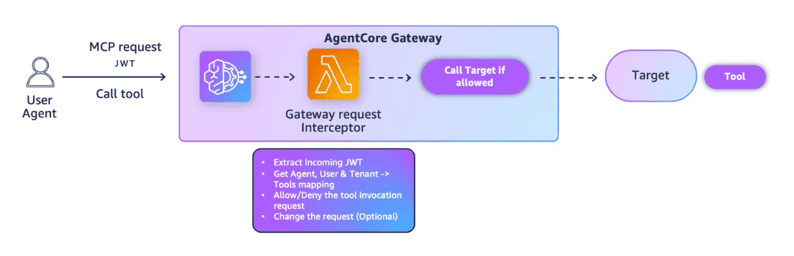
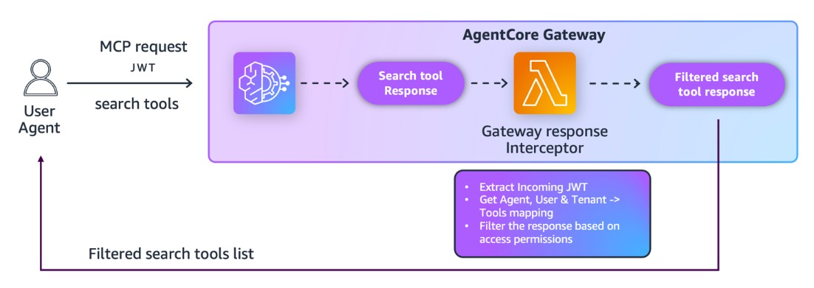
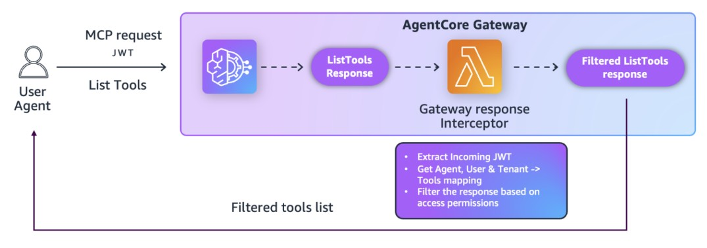

# Fine-Grained Access Control with AgentCore Gateway Interceptors using JWT scopes.

## Overview

This notebook shows how to enforce **Fine-Grained Access Control (FGAC)** on an **AgentCore Gateway** using **Gateway interceptors** and **JWT scopes**. The goal is to give you a reusable pattern to protect your agent endpoints, no matter how many tools your MCP target provides.

### Why This Matters

As your agent expands, you may need to:

- Restrict which **tools** certain users can call  
- Control access to **sensitive actions** (cancelOrder, updateOrder, deleteOrder, etc.)  
- Filter or redact **semantic search results** based on user permissions  
- Show users **only the tools they are allowed to see**  
- Enforce custom authorization logic that goes beyond what JWT tokens provide  
- Apply **centralized governance** without modifying individual tools or runtimes  

Gateway interceptors provide a scalable, plug-and-play way to implement these controls **without modifying the agent, the runtime, or the MCP server**.  
You enforce policy **at the Gateway level**, where every request naturally flows through.

---

## What This Tutorial Covers

You will implement FGAC across three key Gateway operations:

1. 🛠️ **Invoke Tool with FGAC (request gateway interceptor)**  
   Use a Gateway interceptor to enforce per-tool permissions on `tools/call`.  
   

2. 🔍 **Semantic Search with FGAC (response gateway interceptor)**  
   Filter search results based on Cognito scopes so users only see allowed data.  
   

3. 📋 **List Tools with FGAC (response gateway interceptor)**  
   Dynamically filter the tool catalog so users only see tools they’re authorized for.  
   

---

## Why Use Gateway Interceptors?

Gateway interceptors allow you to:

- **Implement Fine-Grained Access Control**  
  Enforce per-user, per-tool, per-action authorization rules.

- **Inject Custom Authorization Logic**  
  Go beyond static JWT validation with dynamic rules or external policies.

- **Audit & Governance**  
  Log attempted tool usage and provide compliance visibility.

- **Request/Response Transformation**  
  Redact data, modify requests, or filter responses before users see them.

Because interceptors are attached at the **Gateway layer**, they enforce central policy for **any** underlying MCP server or Runtime.

---

## Tutorial Details

| Information              | Details                                                                                         |
|--------------------------|-------------------------------------------------------------------------------------------------|
| **Tutorial type**        | Interactive                                                                                     |
| **AgentCore components** | AgentCore Gateway, Gateway Interceptors                                              |
| **Gateway Target type**  | MCP Server (FastMCP running on AgentCore Runtime)                                              |
| **Interceptor types**    | AWS Lambda (request + response)                                                                |
| **Inbound Auth IdP**     | Amazon Cognito (CUSTOM\_JWT authorizer)                                                        |
| **Access Control**       | FGAC using Cognito scopes + Gateway interceptors                                                |
| **Tutorial components**  | Gateway, Runtime MCP Server, Cognito, Gateway Interceptors, MCP tools                           |
| **Tutorial vertical**    | Cross-vertical                                                                                  |
| **Example complexity**   | Easy–Intermediate                                                                              |
| **SDK used**             | boto3                                                                                           |

---

## Prerequisites

To execute this tutorial you will need:

- Jupyter notebook (Python kernel)
- AWS credentials with permissions for:
  - Lambda
  - IAM
  - Cognito
  - DynamoDB (not used here, but often helpful in real FGAC)
  - AgentCore services (control plane + runtime)
- Python 3.13 or higher
- Basic understanding of AWS Lambda, IAM roles, Cognito, and AgentCore Gateway

> ⚠️ **Note:** The Cleanup section at the end deletes the AWS resources created by this tutorial (Gateway, Lambdas, IAM roles, etc.). Only run it when you’re ready to tear everything down.

```python
# Install from the requirements file in current directory
!pip install -r requirements.txt --quiet
```

```python
# Import required libraries and generate a unique timestamp for naming resources.

import boto3
import json
import time
import zipfile
import subprocess
import tempfile
import io
import os
import sys
import requests
import uuid
from datetime import datetime

from botocore.exceptions import ClientError

print("✓ Libraries imported")

# Generate timestamp for unique naming
timestamp = datetime.now().strftime("%Y%m%d-%H%M%S")
print(f"Using timestamp: {timestamp}")

# define MCP Target name
gateway_target_name = f"mcp-target-{timestamp}"

# Configure AWS Credentials and Region
os.environ["AWS_DEFAULT_REGION"] = os.environ.get("AWS_REGION", "us-east-1")
REGION = os.environ["AWS_DEFAULT_REGION"]

print(f"Region: {REGION}")
```

```python
# Import Utilities and Configure Logging

# Get the directory of the current script
if "__file__" in globals():
    current_dir = os.path.dirname(os.path.abspath(__file__))
else:
    current_dir = os.getcwd()  # Fallback if __file__ is not defined (e.g., Jupyter)

# Navigate to the directory containing utils.py (one level up)
utils_dir = os.path.abspath(os.path.join(current_dir, ".."))

# Add to sys.path
sys.path.insert(0, utils_dir)

# Now import utils
import utils

# Setup logging
import logging

logging.basicConfig(
    level=logging.INFO,
    format="%(asctime)s | %(levelname)s | %(name)s | %(message)s",
    handlers=[logging.StreamHandler()],
)

logging.getLogger("strands").setLevel(logging.INFO)

print("✓ Logging configured, utils imported")
```

## Part 1: Inbound Auth – Cognito User Pool and Scopes for Gateway

We first create a **Cognito User Pool** and **Resource Server** that define the scopes used for FGAC:

- Scope for **full access** to the MCP target  
- Scopes for **individual tools**: `getOrder`, `updateOrder`, `cancelOrder`, `deleteOrder`

These scopes will be embedded in access tokens and used by both:

- The **request gateway interceptor** (for tool invocation)  
- The **response gateway interceptor** (for semantic search and tools/list)

```python
# Create Amazon Cognito Pool for Inbound authorization to Gateway

# Use timestamped names so each run gets a fresh pool / resource server / client
USER_POOL_NAME = f"gateway-interceptor-pool-{timestamp}"
RESOURCE_SERVER_ID = f"gateway-interceptor-id-{timestamp}"
RESOURCE_SERVER_NAME = "gateway-interceptor-name"
CLIENT_NAME = f"gateway-interceptor-client-{timestamp}"

# Scopes are based on the current gateway_target_name for THIS run
SCOPES = [
    # Full access to MCP target
    {
        "ScopeName": gateway_target_name,
        "ScopeDescription": "Full access to all tools in MCP target",
    },
    # Specific tool access
    {
        "ScopeName": f"{gateway_target_name}:getOrder",
        "ScopeDescription": "Access to getOrder tool only",
    },
    {
        "ScopeName": f"{gateway_target_name}:updateOrder",
        "ScopeDescription": "Access to updateOrder tool only",
    },
    {
        "ScopeName": f"{gateway_target_name}:cancelOrder",
        "ScopeDescription": "Access to cancelOrder tool only",
    },
    {
        "ScopeName": f"{gateway_target_name}:deleteOrder",
        "ScopeDescription": "Access to deleteOrder tool only",
    },
]

# Full scope strings in Cognito format: "<resource-server-id>/<scope-name>"
scope_names = [f"{RESOURCE_SERVER_ID}/{scope['ScopeName']}" for scope in SCOPES]
scopeString = " ".join(scope_names)

cognito = boto3.client("cognito-idp", region_name=REGION)

print("Creating or retrieving Cognito resources...")
gw_user_pool_id = utils.get_or_create_user_pool(cognito, USER_POOL_NAME)
print(f"User Pool ID: {gw_user_pool_id}")

utils.get_or_create_resource_server(cognito, gw_user_pool_id, RESOURCE_SERVER_ID, RESOURCE_SERVER_NAME, SCOPES)
print("Resource server ensured.")

gw_client_id, gw_client_secret = utils.get_or_create_m2m_client(
    cognito, gw_user_pool_id, CLIENT_NAME, RESOURCE_SERVER_ID, scope_names
)
print(f"Client ID: {gw_client_id}")

# Discovery URL used later by the Gateway authorizer and utils.get_token
gw_cognito_discovery_url = (
    f"https://cognito-idp.{REGION}.amazonaws.com/{gw_user_pool_id}/.well-known/openid-configuration"
)
gw_jwks_url = f"https://cognito-idp.{REGION}.amazonaws.com/{gw_user_pool_id}/.well-known/jwks.json"
print(gw_cognito_discovery_url)
```

## Part 2: IAM Role for Gateway Interceptors
We create a single IAM role that both Gateway Interceptors (request and response) will use.

```python
# Create IAM role for Gateway Interceptors

iam_client = boto3.client("iam", region_name=REGION)

lambda_trust_policy = {
    "Version": "2012-10-17",
    "Statement": [
        {
            "Effect": "Allow",
            "Principal": {"Service": "lambda.amazonaws.com"},
            "Action": "sts:AssumeRole",
        }
    ],
}

lambda_role_name = f"GatewayInterceptorRole-{timestamp}"

lambda_role_response = iam_client.create_role(
    RoleName=lambda_role_name,
    AssumeRolePolicyDocument=json.dumps(lambda_trust_policy),
    Description="IAM role for Gateway Interceptors",
)

# Attach basic Lambda execution policy
iam_client.attach_role_policy(
    RoleName=lambda_role_name,
    PolicyArn="arn:aws:iam::aws:policy/service-role/AWSLambdaBasicExecutionRole",
)

lambda_role_arn = lambda_role_response["Role"]["Arn"]
print(f"Lambda IAM role created: {lambda_role_arn}")

# Wait for role to be available
print("Waiting for Lambda role to be available...")
time.sleep(10)
print("✓ Lambda role ready")
```

## Part 3: Request Gateway Interceptor for Tool Invocation

This interceptor:

- Validates the Authorization header
- Decodes the JWT to read the `scope` claim
- Extracts the tool name from the MCP `tools/call` request
- Checks whether the token’s scopes allow calling that tool
- Returns:
  - 403 error MCP response if **not allowed**
  - Pass-through request if **allowed**

This provides **FGAC at invocation time**.

```python
# Create request gateway interceptor function for tool invocation FGAC


def create_request_gateway_interceptor():
    """Create request gateway interceptor function"""
    lambda_client = boto3.client("lambda", region_name=REGION)

    lambda_code = '''import json
import time
import urllib.request
from jose import jwk, jwt
from jose.utils import base64url_decode

# Define gateway target name and resource server ID
gateway_target_name = "TARGET_GATEWAY_NAME_PLACEHOLDER"
resource_server_id = "RESOURCE_SERVER_ID_PLACEHOLDER"
jwks_url = "JWKS_URL_PLACEHOLDER"
client_id = "CLIENT_ID_PLACEHOLDER"

with urllib.request.urlopen(jwks_url) as f:
    response = f.read()
keys = json.loads(response.decode('utf-8'))['keys']

# System / internal tools that should not be blocked by FGAC in the request interceptor.
# These will be filtered (if needed) by the response interceptor instead.
SYSTEM_TOOLS = {
    "x_amz_bedrock_agentcore_search",  # semantic search tool
}

def decode_jwt_payload(token):
    """Verify and decode JWT payload """
    headers = jwt.get_unverified_headers(token)
    kid = headers['kid']
    
    # Find the matching key
    key_index = -1
    for i, key in enumerate(keys):
        if kid == key['kid']:
            key_index = i
            break
    
    if key_index == -1:
        raise Exception('Public key not found in jwks.json')
    
    # Construct the public key
    public_key = jwk.construct(keys[key_index])
    
    # Get message and signature
    message, encoded_signature = str(token).rsplit('.', 1)
    decoded_signature = base64url_decode(encoded_signature.encode('utf-8'))
    
    # Verify signature
    if not public_key.verify(message.encode("utf8"), decoded_signature):
        raise Exception('Signature verification failed')
    
    # Get claims
    claims = jwt.get_unverified_claims(token)
    
    # Check expiration
    if time.time() > claims['exp']:
        raise Exception('Token is expired')
    
    # Check client_id
    if claims['client_id'] != client_id:
        raise Exception('Token was not issued for this audience')
    
    # Check token use
    if claims.get('token_use') != 'access':
        raise Exception("Invalid token use: must be 'access' token")
    
    return claims

def check_tool_authorization(scopes, tool_name):
    """
    Check if user has permission for specific tool based on scopes.

    Cognito returns scopes in the form:
      "<resource_server_id>/<actual_scope>"
    e.g.
      "agentcore-gateway-interceptor-id-20251119-141611/mcp-target-20251119-141611:getOrder"

    We only care about the part AFTER the slash:
      "mcp-target-20251119-141611:getOrder"
    """
    if not scopes:
        return False
    
    user_scopes = scopes.split(" ")
    actual_scopes = []
    
    for s in user_scopes:
        # Strip resource server prefix if present
        if "/" in s:
            actual_scopes.append(s.split("/", 1)[1])
        else:
            actual_scopes.append(s)

    # Full access to all tools in this MCP target
    if gateway_target_name in actual_scopes:
        return True
    
    # Specific tool permission: <target>:<toolName>
    required_scope = f"{gateway_target_name}:{tool_name}"
    if required_scope in actual_scopes:
        return True
    
    return False

def extract_tool_name(body):
    """Extract tool name from MCP tools/call request body"""
    try:
        if isinstance(body, dict):
            params = body.get("params", {})
            tool_name = params.get("name", "")
            # Tool names are of the form: <target>___<toolName>
            if "___" in tool_name:
                return tool_name.split("___")[-1]
            return tool_name
    except Exception:
        pass
    return None

def build_pass_through_response(auth_header, body):
    """Return a pass-through response to let the request reach the target"""
    return {
        "interceptorOutputVersion": "1.0",
        "mcp": {
            "transformedGatewayRequest": {
                "headers": {
                    "Authorization": auth_header,
                    "Content-Type": "application/json"
                },
                "body": body
            }
        }
    }

def build_error_response(message, body, status_code=403):
    """Return an MCP-style error response"""
    return {
        "interceptorOutputVersion": "1.0",
        "mcp": {
            "transformedGatewayResponse": {
                "statusCode": status_code,
                "body": {
                    "jsonrpc": "2.0",
                    "id": body.get("id", "unknown") if isinstance(body, dict) else "unknown",
                    "error": {
                        "code": -32600,
                        "message": message
                    }
                }
            }
        }
    }

def lambda_handler(event, context):
    print(f"Received event: {json.dumps(event)}")
    
    # Extract the gateway request from the correct structure
    mcp_data = event.get("mcp", {})
    gateway_request = mcp_data.get("gatewayRequest", {})
    headers = gateway_request.get("headers", {})
    body = gateway_request.get("body", {})
    
    # Extract Authorization header
    auth_header = headers.get("Authorization", "")
    
    # Enforce presence of a Bearer token for ALL requests
    if not auth_header.startswith("Bearer "):
        response = build_error_response("No authorization token provided", body)
        print(f"Returning error response (no token): {json.dumps(response)}")
        return response
    
    # Decode token and scopes
    try:
        token = auth_header.replace("Bearer ", "")
        decoded_token = decode_jwt_payload(token)
        scopes = decoded_token.get("scope", "")
        
        method = body.get("method", "")
        tool_name = extract_tool_name(body)
        
        print(f"Decoded scopes (raw): {scopes}")
        print(f"MCP method: {method}")
        print(f"Requested tool: {tool_name}")
        
        # 1) Allow tools/list: FGAC for what tools are visible is enforced
        #    in the response gateway interceptor (which filters the returned list).
        if method == "tools/list":
            print("tools/list request detected - skipping tool-level FGAC in request gateway interceptor")
            response = build_pass_through_response(auth_header, body)
            print(f"Returning pass-through response for tools/list: {json.dumps(response)}")
            return response
        
        # 2) Allow system tools (e.g., x_amz_bedrock_agentcore_search) to pass through.
        #    The response gateway interceptor will later filter the tool list / search results.
        if tool_name in SYSTEM_TOOLS:
            print(f"System tool '{tool_name}' detected - skipping tool-level FGAC in request gateway interceptor")
            response = build_pass_through_response(auth_header, body)
            print(f"Returning pass-through response for system tool: {json.dumps(response)}")
            return response
        
        # 3) For all other tools (business tools like getOrder, updateOrder, etc.),
        #    enforce scope-based FGAC.
        if not tool_name:
            response = build_error_response("No tool name provided in request", body)
            print(f"Returning error response (no tool name): {json.dumps(response)}")
            return response
        
        if not check_tool_authorization(scopes, tool_name):
            response = build_error_response(
                f"Insufficient permission for tool: {tool_name}",
                body
            )
            print(f"Returning error response (FGAC deny): {json.dumps(response)}")
            return response
    
    except Exception as e:
        print(f"Error while validating token/scopes: {e}")
        response = build_error_response(f"Invalid token - {e}", body)
        print(f"Returning error response (exception): {json.dumps(response)}")
        return response
    
    # Authorized → pass through
    response = build_pass_through_response(auth_header, body)
    print(f"Returning pass-through response (authorized): {json.dumps(response)}")
    return response
'''
    # Replace placeholders with actual values
    lambda_code = lambda_code.replace("TARGET_GATEWAY_NAME_PLACEHOLDER", gateway_target_name)
    lambda_code = lambda_code.replace("RESOURCE_SERVER_ID_PLACEHOLDER", RESOURCE_SERVER_ID)
    lambda_code = lambda_code.replace("JWKS_URL_PLACEHOLDER", gw_jwks_url)
    lambda_code = lambda_code.replace("CLIENT_ID_PLACEHOLDER", gw_client_id)

    # Create ZIP file for Lambda with dependencies
    with tempfile.TemporaryDirectory() as temp_dir:
        # Install dependencies
        subprocess.run(
            ["pip", "install", "-r", "requirements_lambda.txt", "-t", temp_dir],
            check=True,
        )

        # Create zip buffer
        zip_buffer = io.BytesIO()
        with zipfile.ZipFile(zip_buffer, "w", zipfile.ZIP_DEFLATED) as zip_file:
            # Add lambda function code
            zip_file.writestr("lambda_function.py", lambda_code)

            # Add all dependency files
            for root, dirs, files in os.walk(temp_dir):
                for file in files:
                    file_path = os.path.join(root, file)
                    arc_name = os.path.relpath(file_path, temp_dir)
                    zip_file.write(file_path, arc_name)

    zip_buffer.seek(0)

    # Create Lambda function
    lambda_function_name = f"request-gateway-interceptor-{timestamp}"

    lambda_response = lambda_client.create_function(
        FunctionName=lambda_function_name,
        Runtime="python3.13",
        Role=lambda_role_arn,
        Handler="lambda_function.lambda_handler",
        Code={"ZipFile": zip_buffer.read()},
        Description="Request Gateway Interceptor for AgentCore Gateway - Tool Invocation FGAC",
    )

    request_lambda_arn = lambda_response["FunctionArn"]
    print(f"Request Gateway Interceptor function created: {request_lambda_arn}")

    return request_lambda_arn


request_lambda_arn = create_request_gateway_interceptor()
print(f"\n✅ Request Gateway interceptor creation completed: {request_lambda_arn}")
```

## Part 4: Response Gateway Interceptor for Semantic Search and Tools/List

This interceptor:

- Decodes the JWT scopes from the Authorization header on the response
- Filters tool lists based on allowed scopes
- Applies to:
  - Semantic search results (`x_amz_bedrock_agentcore_search`)
  - MCP `tools/list` responses (pure tool enumeration)

The logic:

- If a scope equals the MCP target name → full access to all tools from that target  
- If a scope equals `mcpTarget:toolName` → access only to that specific tool  
- Skips internal/system tools that don’t follow the `target___toolName` naming convention

```python
def create_response_gateway_interceptor():
    """Create response gateway interceptor function"""
    lambda_client = boto3.client("lambda", region_name=REGION)

    lambda_code = '''import json
import time
import urllib.request
from jose import jwk, jwt
from jose.utils import base64url_decode

# Define gateway target name and resource server ID
jwks_url = "JWKS_URL_PLACEHOLDER"
client_id = "CLIENT_ID_PLACEHOLDER"

with urllib.request.urlopen(jwks_url) as f:
    response = f.read()
keys = json.loads(response.decode('utf-8'))['keys']

def decode_jwt_payload(token):
    """Verify and decode JWT payload """
    headers = jwt.get_unverified_headers(token)
    kid = headers['kid']
    
    # Find the matching key
    key_index = -1
    for i, key in enumerate(keys):
        if kid == key['kid']:
            key_index = i
            break
    
    if key_index == -1:
        raise Exception('Public key not found in jwks.json')
    
    # Construct the public key
    public_key = jwk.construct(keys[key_index])
    
    # Get message and signature
    message, encoded_signature = str(token).rsplit('.', 1)
    decoded_signature = base64url_decode(encoded_signature.encode('utf-8'))
    
    # Verify signature
    if not public_key.verify(message.encode("utf8"), decoded_signature):
        raise Exception('Signature verification failed')
    
    # Get claims
    claims = jwt.get_unverified_claims(token)
    
    # Check expiration
    if time.time() > claims['exp']:
        raise Exception('Token is expired')
    
    # Check client_id
    if claims['client_id'] != client_id:
        raise Exception('Token was not issued for this audience')
    
    # Check token use
    if claims.get('token_use') != 'access':
        raise Exception("Invalid token use: must be 'access' token")
    
    return claims

def filter_tools_by_scope(tools, allowed_scopes):
    """Filter tools based on custom scopes"""
    if not allowed_scopes:
        return []
    
    filtered_tools = []
    for tool in tools:
        tool_name = tool.get("name", "")
        
        # Skip system-generated MCP tools without target separator
        if "___" not in tool_name:
            continue
            
        mcp_target = tool_name.split("___")[0]
        tool_action = tool_name.split("___")[1]
        
        for scope in allowed_scopes:
            # Remove resource server prefix to get actual scope
            actual_scope = scope.split("/")[-1] if "/" in scope else scope
            
            # Full access to MCP target
            if actual_scope == mcp_target:
                filtered_tools.append(tool)
                break
            # Specific tool access
            elif actual_scope == f"{mcp_target}:{tool_action}":
                filtered_tools.append(tool)
                break
    
    return filtered_tools

def lambda_handler(event, context):
    print(f"Received event: {json.dumps(event)}")
    
    # Extract the gateway response
    mcp_data = event.get("mcp", {})
    gateway_response = mcp_data.get("gatewayResponse", {})
    headers = gateway_response.get("headers", {})
    body = gateway_response.get("body", {})

    # Pass through the Authorization header
    auth_header = headers.get("Authorization", "")
    token = auth_header.replace("Bearer ", "") if auth_header.startswith("Bearer ") else ""

    try:
        # Parse JWT payload without verification
        claims = decode_jwt_payload(token)
        
        # Extract scopes from claims
        scope_string = claims.get("scope", "")
        scopes = scope_string.split() if scope_string else []
        print(f"Extracted scopes: {scopes}")
        
        # Get tools from gateway response (supports semantic search and tools/list)
        result = body.get("result", {})
        tools = result.get("tools", [])
        if not tools:
            structured_content = result.get("structuredContent", {})
            tools = structured_content.get("tools", [])
        print(f"Available tools: {[tool.get('name') for tool in tools]}")
        
        # Filter tools based on scopes
        filtered_tools = filter_tools_by_scope(tools, scopes)
        print(f"Filtered tools: {[tool.get('name') for tool in filtered_tools]}")
        
        # Update body with filtered tools
        filtered_body = body.copy()
        if "result" in filtered_body:
            if "structuredContent" in filtered_body["result"]:
                filtered_body["result"]["structuredContent"]["tools"] = filtered_tools
            else:
                filtered_body["result"]["tools"] = filtered_tools
            
            # Filter content array if it exists and contains embedded tool JSON in text
            if "content" in filtered_body["result"]:
                for content_item in filtered_body["result"]["content"]:
                    if content_item.get("type") == "text" and "text" in content_item:
                        try:
                            content_data = json.loads(content_item["text"])
                            if "tools" in content_data:
                                content_filtered_tools = filter_tools_by_scope(content_data["tools"], scopes)
                                content_data["tools"] = content_filtered_tools
                                content_item["text"] = json.dumps(content_data)
                        except (json.JSONDecodeError, KeyError):
                            pass
    except Exception as e:
        print(f"Error processing JWT or filtering tools: {e}")
        filtered_body = body
    else:
        # only set filtered_body if we didn't hit the except
        pass

    # If filtered_body wasn't set in try/except, default to original body
    if "filtered_body" not in locals():
        filtered_body = body

    # Return transformed response 
    response = {
        "interceptorOutputVersion": "1.0",
        "mcp": {
            "transformedGatewayResponse" : {
                "statusCode": 200,
                "headers": {
                    "Accept": "application/json",
                    "Authorization": auth_header
                },
                "body": filtered_body
            }
        }   
    }
    
    print(f"Returning response: {json.dumps(response)}")
    return response
'''

    # Replace placeholders with actual values
    lambda_code = lambda_code.replace("JWKS_URL_PLACEHOLDER", gw_jwks_url)
    lambda_code = lambda_code.replace("CLIENT_ID_PLACEHOLDER", gw_client_id)

    # Create ZIP file for Lambda with dependencies
    with tempfile.TemporaryDirectory() as temp_dir:
        # Install dependencies
        subprocess.run(
            ["pip", "install", "-r", "requirements_lambda.txt", "-t", temp_dir],
            check=True,
        )

        # Create zip buffer
        zip_buffer = io.BytesIO()
        with zipfile.ZipFile(zip_buffer, "w", zipfile.ZIP_DEFLATED) as zip_file:
            # Add lambda function code
            zip_file.writestr("lambda_function.py", lambda_code)

            # Add all dependency files
            for root, dirs, files in os.walk(temp_dir):
                for file in files:
                    file_path = os.path.join(root, file)
                    arc_name = os.path.relpath(file_path, temp_dir)
                    zip_file.write(file_path, arc_name)

    zip_buffer.seek(0)

    # Create Lambda function
    lambda_function_name = f"response-gateway-interceptor-{timestamp}"

    lambda_response = lambda_client.create_function(
        FunctionName=lambda_function_name,
        Runtime="python3.13",
        Role=lambda_role_arn,
        Handler="lambda_function.lambda_handler",
        Code={"ZipFile": zip_buffer.read()},
        Description="Response Gateway Interceptor for AgentCore Gateway - Search & List FGAC",
    )

    response_lambda_arn = lambda_response["FunctionArn"]
    print(f"Response Gateway Interceptor function created: {response_lambda_arn}")

    return response_lambda_arn


response_lambda_arn = create_response_gateway_interceptor()
print(f"\n✅ Response Gateway interceptor creation completed: {response_lambda_arn}")
```

## Part 5: Create AgentCore Gateway with both Interceptors

We now create an AgentCore Gateway with:

- **Protocol:** MCP  
- **Search Type:** SEMANTIC  
- **Request Gateway interceptor:** Tool invocation FGAC  
- **Response Gateway interceptor:** Semantic search & tools/list FGAC  
- **Authorizer:** CUSTOM\_JWT using the Cognito User Pool and client above

```python
gateway_role_name = f"BedrockAgentCoreGatewayRole-{timestamp}"
agentcore_gateway_iam_role = utils.create_agentcore_gateway_role(gateway_role_name)
role_arn = agentcore_gateway_iam_role["Role"]["Arn"]
print("Agentcore gateway role ARN: ", role_arn)
```

```python
# Create gateway with interceptors using boto3 client
def create_gateway_with_interceptors():
    gateway_client = boto3.client("bedrock-agentcore-control", region_name=REGION)

    print("Creating gateway with interceptors...")
    gateway_response = gateway_client.create_gateway(
        name=f"gateway-interceptor-{timestamp}",
        roleArn=role_arn,
        protocolType="MCP",
        protocolConfiguration={"mcp": {"supportedVersions": ["2025-03-26"], "searchType": "SEMANTIC"}},
        interceptorConfigurations=[
            {
                "interceptor": {"lambda": {"arn": request_lambda_arn}},
                "interceptionPoints": ["REQUEST"],
                "inputConfiguration": {"passRequestHeaders": True},
            },
            {
                "interceptor": {"lambda": {"arn": response_lambda_arn}},
                "interceptionPoints": ["RESPONSE"],
                "inputConfiguration": {"passRequestHeaders": False},
            },
        ],
        authorizerType="CUSTOM_JWT",
        authorizerConfiguration={
            "customJWTAuthorizer": {
                "discoveryUrl": gw_cognito_discovery_url,
                "allowedClients": [gw_client_id],
            }
        },
    )

    print("Gateway create response:", gateway_response)

    gateway_id = gateway_response["gatewayId"]
    gateway_url = gateway_response["gatewayUrl"]
    print(f"Gateway with interceptors created: {gateway_id}")

    # Wait for gateway to be ready
    print("Waiting for gateway to be ready...")
    while True:
        status_response = gateway_client.get_gateway(gatewayIdentifier=gateway_id)
        current_status = status_response.get("status", "UNKNOWN")
        print(f"Gateway status: {current_status}")
        if current_status == "READY":
            print(f"Final gateway details: {json.dumps(status_response, indent=2, default=str)}")
            break
        time.sleep(10)

    print("Gateway is now ready")
    return gateway_id, gateway_url


gateway_id, gateway_url = create_gateway_with_interceptors()
print(f"\n✅ Gateway creation completed: Gateway Id {gateway_id}")
print(f"Gateway Url: {gateway_url}")
```

## Part 6: Create Sample MCP Server and host it in AgentCore Runtime

We now:

1. Create a **Cognito User Pool for Runtime** (for outbound auth from Gateway to Runtime).
2. Host a simple **FastMCP server** on AgentCore Runtime with 4 tools:
   - `getOrder`
   - `updateOrder`
   - `cancelOrder`
   - `deleteOrder`
3. Host it in AgentCore Runtime

```python
# Creating Cognito User Pool for Runtime (outbound auth from Gateway)

RUNTIME_USER_POOL_NAME = f"gateway-interceptor-rt-pool-{timestamp}"
RUNTIME_RESOURCE_SERVER_ID = f"gateway-interceptor-rt-id-{timestamp}"
RUNTIME_RESOURCE_SERVER_NAME = "gateway-interceptor-rt-name"
RUNTIME_CLIENT_NAME = f"gateway-interceptor-runtime-rt-{timestamp}"

RUNTIME_SCOPES = [
    {
        "ScopeName": "tools",
        "ScopeDescription": "Scope for search,list and invoke the agentcore gateway",
    },
]

runtime_scope_names = [f"{RUNTIME_RESOURCE_SERVER_ID}/{scope['ScopeName']}" for scope in RUNTIME_SCOPES]
runtimeScopeString = " ".join(runtime_scope_names)

cognito = boto3.client("cognito-idp", region_name=REGION)

print("Creating or retrieving Cognito resources for Runtime...")
runtime_user_pool_id = utils.get_or_create_user_pool(cognito, RUNTIME_USER_POOL_NAME)
print(f"Runtime User Pool ID: {runtime_user_pool_id}")

utils.get_or_create_resource_server(
    cognito,
    runtime_user_pool_id,
    RUNTIME_RESOURCE_SERVER_ID,
    RUNTIME_RESOURCE_SERVER_NAME,
    RUNTIME_SCOPES,
)
print("Runtime resource server ensured.")

runtime_client_id, runtime_client_secret = utils.get_or_create_m2m_client(
    cognito,
    runtime_user_pool_id,
    RUNTIME_CLIENT_NAME,
    RUNTIME_RESOURCE_SERVER_ID,
    runtime_scope_names,
)

print(f"Runtime Client ID: {runtime_client_id}")

runtime_cognito_discovery_url = (
    f"https://cognito-idp.{REGION}.amazonaws.com/{runtime_user_pool_id}/.well-known/openid-configuration"
)
print("Runtime Cognito discovery URL:", runtime_cognito_discovery_url)
```

```python
# Create sample MCP server file (FastMCP) and host it in AgentCore Runtime

content = """
from mcp.server.fastmcp import FastMCP

mcp = FastMCP(host="0.0.0.0", stateless_http=True)

@mcp.tool()
def getOrder() -> int:
    '''Get an order'''
    return 123

@mcp.tool()
def updateOrder(orderId: int) -> int:
    '''Update existing order'''
    return 456

@mcp.tool()
def cancelOrder(orderId: int) -> int:
    '''Cancel existing order'''
    return 789

@mcp.tool()
def deleteOrder(orderId: int) -> int:
    '''Delete existing order'''
    return 101

if __name__ == "__main__":
    mcp.run(transport="streamable-http")
"""

with open("mcp_server.py", "w") as f:
    f.write(content)
```

```python
# Configure and Deploy MCP Server to AgentCore Runtime

from bedrock_agentcore_starter_toolkit import Runtime
from boto3.session import Session

boto_session = Session()
print(f"Using AWS region: {REGION}")

required_files = ["mcp_server.py", "requirements.txt"]
for file in required_files:
    if not os.path.exists(file):
        raise FileNotFoundError(f"Required file {file} not found")
print("All required files found ✓")

agentcore_runtime = Runtime()

auth_config = {
    "customJWTAuthorizer": {
        "allowedClients": [runtime_client_id],
        "discoveryUrl": runtime_cognito_discovery_url,
    }
}

print("Configuring AgentCore Runtime...")
runtime_response = agentcore_runtime.configure(
    entrypoint="mcp_server.py",
    auto_create_execution_role=True,
    auto_create_ecr=True,
    requirements_file="requirements.txt",
    region=REGION,
    authorizer_configuration=auth_config,
    protocol="MCP",
    agent_name="ac_gateway_mcp_server",
)
print("Configuration completed ✓")
```

```python
# Launch MCP Server to AgentCore Runtime

print("Launching MCP server to AgentCore Runtime...")
launch_result = agentcore_runtime.launch()

runtime_agent_arn = launch_result.agent_arn
runtime_agent_id = launch_result.agent_id

encoded_arn = runtime_agent_arn.replace(":", "%3A").replace("/", "%2F")

agent_url = f"https://bedrock-agentcore.{REGION}.amazonaws.com/runtimes/{encoded_arn}/invocations?qualifier=DEFAULT"
print("Launch completed ✓")
print(f"Agent ARN: {runtime_agent_arn}")
print(f"Agent ID: {runtime_agent_id}")
print(f"Runtime MCP URL: {agent_url}")
```

```python
# Create OAuth2 Credential Provider for MCP Server Authentication (Gateway → Runtime)

identity_client = boto3.client("bedrock-agentcore-control", region_name=REGION)

cognito_provider = identity_client.create_oauth2_credential_provider(
    name=f"gateway-mcp-server-identity-{timestamp}",
    credentialProviderVendor="CustomOauth2",
    oauth2ProviderConfigInput={
        "customOauth2ProviderConfig": {
            "oauthDiscovery": {
                "discoveryUrl": runtime_cognito_discovery_url,
            },
            "clientId": runtime_client_id,
            "clientSecret": runtime_client_secret,
        }
    },
)
cognito_provider_arn = cognito_provider["credentialProviderArn"]
print("Outbound OAuth2 Credential Provider ARN:", cognito_provider_arn)
```

## Part 7: Create the Gateway Target and register the MCP Server

We now create an AgentCore Gateway Target and register the MCP Server as a target behind the Gateway.

```python
# Create Gateway Target pointing to MCP server


def create_gateway_target(gateway_id):
    """Create gateway target and wait for it to be ready"""
    gateway_client = boto3.client("bedrock-agentcore-control", region_name=REGION)

    print("Creating MCP target...")
    target_response = gateway_client.create_gateway_target(
        name=gateway_target_name,
        gatewayIdentifier=gateway_id,
        targetConfiguration={"mcp": {"mcpServer": {"endpoint": agent_url}}},
        credentialProviderConfigurations=[
            {
                "credentialProviderType": "OAUTH",
                "credentialProvider": {
                    "oauthCredentialProvider": {
                        "providerArn": cognito_provider_arn,
                        "scopes": [runtimeScopeString],
                    }
                },
            }
        ],
    )

    target_id = target_response["targetId"]
    print(f"Gateway target created: {target_id}")

    # Wait for target to be ready
    print("Waiting for target to be ready...")
    while True:
        status_response = gateway_client.get_gateway_target(gatewayIdentifier=gateway_id, targetId=target_id)
        current_status = status_response.get("status", "UNKNOWN")
        print(f"Target status: {current_status}")
        if current_status == "READY":
            print(f"Target status response: {json.dumps(status_response, indent=2, default=str)}")
            break
        elif current_status == "FAILED":
            print("Target creation failed!")
            print(f"Failed target details: {json.dumps(status_response, indent=2, default=str)}")
            raise Exception("Target failed")
        time.sleep(10)

    print("Target is now ready")
    return target_id


target_id = create_gateway_target(gateway_id)
print(f"\n✅ Target creation completed: {target_id}")
```

## Part 8: Testing FGAC

We now test three scenarios:

1. **Invoke Tool with FGAC (request gateway interceptor)**  
2. **Semantic Search with FGAC (response gateway interceptor)**  
3. **List Tools with FGAC (response gateway interceptor)**

We’ll use the same Cognito User Pool + client, but request tokens with different scopes:

- Full access to all tools in the MCP target  
- Narrow access to a single tool (e.g., `getOrder`)

```python
def invoke_tool(gateway_url, access_token, tool_name, arguments=None):
    headers = {
        "Content-Type": "application/json",
        "Authorization": f"Bearer {access_token}",
    }

    # Default arguments
    if arguments is None:
        arguments = {"orderId": 123} if tool_name != "getOrder" else {}

    payload = {
        "jsonrpc": "2.0",
        "id": "invoke-tool-request",
        "method": "tools/call",
        "params": {
            "name": f"{gateway_target_name}___{tool_name}",
            "arguments": arguments,
        },
    }

    response = requests.post(gateway_url, headers=headers, json=payload)
    return response.json()


def get_access_token_for_scope(scope_label, scope):
    """
    Helper to fetch an access token for a given scope.
    If Cognito returns an error (no access_token), print the raw response
    and raise a clear exception instead of a KeyError.
    """
    print(f"\n[Token] Requesting token for {scope_label}")
    print(f"[Token] Using scope: {scope}")

    token_response = utils.get_token(gw_user_pool_id, gw_client_id, gw_client_secret, scope, REGION)
    print(f"[Token] Raw token response:\n{json.dumps(token_response, indent=2)}")

    access_token = token_response.get("access_token")
    if not access_token:
        raise RuntimeError(
            f"Failed to obtain access token for '{scope_label}'. "
            f"Response did not contain 'access_token'. See [Token] output above."
        )
    return access_token


# 1) getOrder with getOrder scope → ALLOW
print("Test 1: getOrder with getOrder scope - SHOULD ALLOW")
scope = f"{RESOURCE_SERVER_ID}/{gateway_target_name}:getOrder"
token = get_access_token_for_scope("getOrder scope", scope)
result = invoke_tool(gateway_url, token, "getOrder")
print(json.dumps(result, indent=2))

# 2) updateOrder with getOrder scope → DENY
print("\nTest 2: updateOrder with getOrder scope - SHOULD DENY")
result = invoke_tool(gateway_url, token, "updateOrder")
print(json.dumps(result, indent=2))

# 3) deleteOrder with deleteOrder scope → ALLOW
print("\nTest 3: deleteOrder with deleteOrder scope - SHOULD ALLOW")
scope = f"{RESOURCE_SERVER_ID}/{gateway_target_name}:deleteOrder"
token = get_access_token_for_scope("deleteOrder scope", scope)
result = invoke_tool(gateway_url, token, "deleteOrder")
print(json.dumps(result, indent=2))

# 4) getOrder with deleteOrder scope → DENY
print("\nTest 4: getOrder with deleteOrder scope - SHOULD DENY")
result = invoke_tool(gateway_url, token, "getOrder")
print(json.dumps(result, indent=2))

# 5) Full access (Scope = MCP target) → ALLOW ALL
print("\nTest 5: All tools with full access scope - SHOULD ALLOW ALL")
scope = f"{RESOURCE_SERVER_ID}/{gateway_target_name}"
token = get_access_token_for_scope("full access scope", scope)

for tool in ["getOrder", "updateOrder", "cancelOrder", "deleteOrder"]:
    print(f"\n  {tool}:")
    result = invoke_tool(gateway_url, token, tool)
    print(json.dumps(result, indent=4))
```

```python
def semantic_search(gateway_url, access_token, query):
    headers = {
        "Content-Type": "application/json",
        "Authorization": f"Bearer {access_token}",
    }

    payload = {
        "jsonrpc": "2.0",
        "id": "semantic-search-request",
        "method": "tools/call",
        "params": {
            "name": "x_amz_bedrock_agentcore_search",
            "arguments": {"query": query},
        },
    }

    response = requests.post(gateway_url, headers=headers, json=payload)
    return response.json()


search_query = "Find me the tools to help cancel and delete my orders"

# Full access scope
full_scope = f"{RESOURCE_SERVER_ID}/{gateway_target_name}"
full_token_response = utils.get_token(gw_user_pool_id, gw_client_id, gw_client_secret, full_scope, REGION)
full_token = full_token_response["access_token"]

print("\n=== Semantic Search with FULL ACCESS scope ===")
full_search_results = semantic_search(gateway_url, full_token, search_query)
print(json.dumps(full_search_results, indent=2))

# Limited scope (only getOrder)
limited_scope = f"{RESOURCE_SERVER_ID}/{gateway_target_name}:getOrder"
limited_token_response = utils.get_token(gw_user_pool_id, gw_client_id, gw_client_secret, limited_scope, REGION)
limited_token = limited_token_response["access_token"]

print("\n=== Semantic Search with LIMITED scope (getOrder only) ===")
limited_search_results = semantic_search(gateway_url, limited_token, search_query)
print(json.dumps(limited_search_results, indent=2))

# Compare results
print("\n=== SEMANTIC SEARCH TOOL COMPARISON ===")
full_tools = full_search_results.get("result", {}).get("structuredContent", {}).get("tools", [])
limited_tools = limited_search_results.get("result", {}).get("structuredContent", {}).get("tools", [])

print(f"Full access tools count: {len(full_tools)}")
print(f"Limited access tools count: {len(limited_tools)}")
print(f"Full access tools: {[tool.get('name') for tool in full_tools]}")
print(f"Limited access tools: {[tool.get('name') for tool in limited_tools]}")
```

```python
def list_tools(gateway_url, access_token):
    headers = {
        "Content-Type": "application/json",
        "Authorization": f"Bearer {access_token}",
    }

    payload = {
        "jsonrpc": "2.0",
        "id": str(uuid.uuid4()),
        "method": "tools/list",
        "params": {},  # MCP expects params to exist, even if empty
    }

    response = requests.post(gateway_url, headers=headers, json=payload)
    return response.json()


# Full access scope
full_scope = f"{RESOURCE_SERVER_ID}/{gateway_target_name}"
full_token_response = utils.get_token(gw_user_pool_id, gw_client_id, gw_client_secret, full_scope, REGION)
full_token = full_token_response["access_token"]

print("\n=== MCP tools/list with FULL ACCESS scope ===")
full_list_results = list_tools(gateway_url, full_token)
print(json.dumps(full_list_results, indent=2))

# Limited scope (getOrder only)
limited_scope = f"{RESOURCE_SERVER_ID}/{gateway_target_name}:getOrder"
limited_token_response = utils.get_token(gw_user_pool_id, gw_client_id, gw_client_secret, limited_scope, REGION)
limited_token = limited_token_response["access_token"]

print("\n=== MCP tools/list with LIMITED scope (getOrder only) ===")
limited_list_results = list_tools(gateway_url, limited_token)
print(json.dumps(limited_list_results, indent=2))

# Compare results
print("\n=== TOOLS/LIST FGAC COMPARISON ===")
full_list_tools = full_list_results.get("result", {}).get("tools", [])
limited_list_tools = limited_list_results.get("result", {}).get("tools", [])

print(f"Full access tools count: {len(full_list_tools)}")
print(f"Limited access tools count: {len(limited_list_tools)}")
print(f"Full access tools: {[tool.get('name') for tool in full_list_tools]}")
print(f"Limited access tools: {[tool.get('name') for tool in limited_list_tools]}")
```

## Part 9: Cleanup – Delete All Resources

> ⚠️ **WARNING:** This section **deletes** the resources created in this notebook:
> - AgentCore Gateway and MCP target  
> - Gateway Interceptor functions  
> - IAM roles for Lambda and Gateway  
> - Runtime MCP server  
> - Cognito resources are **not** deleted automatically (manual cleanup recommended)

```python
# Delete Gateway target and Gateway

print("\nDeleting Gateway target and Gateway...")
gateway_client = boto3.client("bedrock-agentcore-control", region_name=REGION)
utils.delete_gateway(gateway_client, gateway_id)
```

```python
# Delete Lambda functions (request + response interceptors)

print("\nDeleting Lambda functions...")

lambda_client = boto3.client("lambda", region_name=REGION)

# Request interceptor
try:
    request_lambda_name = request_lambda_arn.split(":function:")[-1]
    lambda_client.delete_function(FunctionName=request_lambda_name)
    print(f"  ✓ Request interceptor deleted: {request_lambda_name}")
except Exception as e:
    print(f"  ⚠ Error deleting request interceptor: {e}")

# Response interceptor
try:
    response_lambda_name = response_lambda_arn.split(":function:")[-1]
    lambda_client.delete_function(FunctionName=response_lambda_name)
    print(f"  ✓ Response interceptor deleted: {response_lambda_name}")
except Exception as e:
    print(f"  ⚠ Error deleting response Lambda: {e}")
```

```python
# Delete IAM roles (Lambda + Gateway)

print("\nDeleting IAM roles...")

# Detach and delete gateway interceptor role
try:
    print("  Deleting gateway interceptor role...")

    iam_client.detach_role_policy(
        RoleName=lambda_role_name,
        PolicyArn="arn:aws:iam::aws:policy/service-role/AWSLambdaBasicExecutionRole",
    )
    iam_client.delete_role(RoleName=lambda_role_name)
    print(f"    ✓ Gateway interceptor role deleted: {lambda_role_name}")
except ClientError as e:
    if e.response["Error"]["Code"] == "NoSuchEntity":
        print(f"    ⚠ Role not found: {lambda_role_name}")
    else:
        print(f"    ⚠ Error deleting gateway interceptor role: {e}")

# Detach and delete Gateway role
try:
    print("  Deleting Gateway role...")

    iam_client.detach_role_policy(
        RoleName=gateway_role_name,
        PolicyArn="arn:aws:iam::aws:policy/AdministratorAccess",
    )
    iam_client.delete_role(RoleName=gateway_role_name)
    print(f"    ✓ Gateway role deleted: {gateway_role_name}")
except ClientError as e:
    if e.response["Error"]["Code"] == "NoSuchEntity":
        print(f"    ⚠ Role not found: {gateway_role_name}")
    else:
        print(f"    ⚠ Error deleting Gateway role: {e}")
```

```python
# Delete MCP Server

print("\nDeleting MCP Server...")

runtime_client = boto3.client("bedrock-agentcore-control", region_name=REGION)
runtime_client.delete_agent_runtime(agentRuntimeId=runtime_agent_id)
```

```python
# Delete Identity Provider

print("\nDeleting Identity Provider...")

identity_client.delete_oauth2_credential_provider(name=f"gateway-mcp-server-identity-{timestamp}")
```

```python
print("\n" + "=" * 80)
print("  CLEANUP COMPLETE")
print("=" * 80)

print("\n✓ Deleted Resources:")
print(f"  • Gateway: {gateway_id}")
print(f"  • Gateway Target: {target_id}")
print(f"  • Request Interceptor: {request_lambda_arn}")
print(f"  • Response Interceptor: {response_lambda_arn}")
print(f"  • Lambda IAM Role: {lambda_role_name}")
print(f"  • Gateway IAM Role: {gateway_role_name}")
print(f"  • MCP Server: {runtime_agent_id}")

print("\n⚠️ Cognito User Pools are NOT deleted in this script.")
print("   You can remove them manually from the AWS Console if desired.")

print(f"\n📝 Deployment timestamp: {timestamp}")
```
