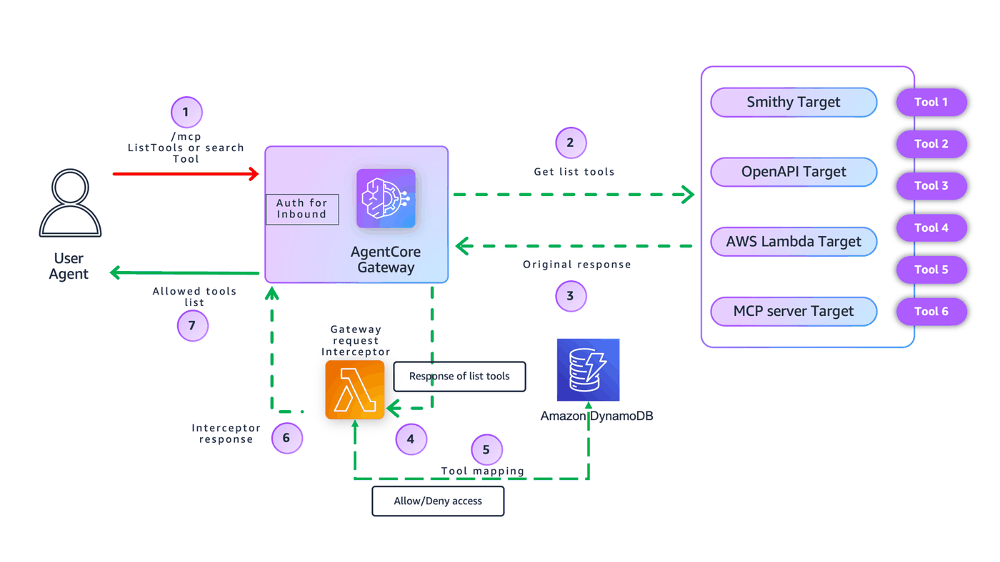

# Fine-Grained Access Control with Amazon Bedrock AgentCore Gateway Interceptors using Data Store

## Overview

This notebook demonstrates how to enforce **Fine-Grained Access Control (FGAC)** on an **Amazon Bedrock AgentCore Gateway** using **Gateway interceptors** with **Amazon DynamoDB as a data store** for permission management. Unlike policy-based approaches that require redeployment, this pattern allows you to **dynamically manage tool permissions** by updating records in DynamoDB.

### Why Use a Data Store for Access Control?

Traditional approaches embed permissions in OAuth scopes or static policies. This tutorial shows a more flexible approach:

- **Dynamic Permission Management**: Update tool access in DynamoDB without redeploying infrastructure
- **Centralized Policy Store**: Manage all client permissions in one place
- **Scalable**: Handle complex permission matrices across many clients and tools
- **Auditable**: Track permission changes through DynamoDB's built-in features

The Gateway interceptor queries Amazon DynamoDB table at runtime to determine which tools each client can access, providing real-time access control.

---

## What This Tutorial Covers

This tutorial implements FGAC for the **List Tools** operation using a RESPONSE interceptor:

📋 **List Tools with FGAC (RESPONSE interceptor)**  
   - Intercepts the tools/list response from the Gateway
   - Queries Amazon DynamoDB to get the client's permitted tools (identified by Client ID from JWT)
   - Filters the tool list to show only authorized tools
   - Returns the filtered response to the client

For **Invoke Tool** operations with FGAC, see the tutorial: [Fine-Grained Access Control using Custom Scopes](../01-fine-grained-access-control-using-custom-scopes.ipynb)



---

## Why Use Gateway Interceptors?

Gateway Interceptors allow you to:

- **Implement Fine-Grained Access Control**: Enforce per-client, per-tool authorization rules
- **Inject Custom Authorization Logic**: Query external data stores for dynamic permissions
- **Audit & Governance**: Log tool access attempts for compliance
- **Request/Response Transformation**: Filter, redact, or modify data in transit

Because interceptors are attached at the **Gateway layer**, they enforce centralized policy for **any** underlying MCP server or runtime without modifying application code.

---

## Tutorial Details

| Information              | Details                                                                                         |
|--------------------------|-------------------------------------------------------------------------------------------------|
| **Tutorial type**        | Interactive                                                                                     |
| **AgentCore components** | Amazon Bedrock AgentCore Gateway, Gateway Interceptors                                         |
| **Gateway Target type**  | MCP Server (FastMCP running on AgentCore Runtime)                                              |
| **Interceptor types**    | AWS Lambda (RESPONSE)                                                                          |
| **Inbound Auth IdP**     | Amazon Cognito (CUSTOM_JWT authorizer)                                                         |
| **Data Store**           | Amazon DynamoDB (stores client-to-tool permission mappings)                                    |
| **Access Control**       | FGAC using Client ID from JWT + DynamoDB permission lookup                                     |
| **Tutorial components**  | Gateway, Runtime MCP Server, Amazon Cognito, Gateway Interceptors, MCP tools, Amazon DynamoDB  |
| **Tutorial vertical**    | Cross-vertical                                                                                  |
| **Example complexity**   | Intermediate                                                                                    |
| **SDK used**             | boto3                                                                                           |

---

## Prerequisites

To execute this tutorial you will need:

- Jupyter notebook (Python kernel)
- AWS credentials with permissions for:
  - AWS Lambda
  - AWS IAM
  - Amazon Cognito
  - Amazon DynamoDB
  - Amazon Bedrock AgentCore services (control plane + runtime)
- Python 3.9 or higher
- Basic understanding of AWS Lambda, IAM roles, Amazon Cognito, and Amazon Bedrock AgentCore Gateway

> ⚠️ **Note:** The Cleanup section at the end deletes the AWS resources created by this tutorial (Gateway, Lambdas, IAM roles, etc.). Only run it when you're ready to tear everything down.

```python
# Import required libraries
import boto3
import time
import sys
import requests
from pathlib import Path
from datetime import datetime

# Add utils to path
current_dir = Path.cwd()
utils_dir = current_dir.parent.parent
sys.path.insert(0, str(utils_dir))

import utils

print("✓ Libraries imported")

# Generate unique identifier for this deployment
DEPLOYMENT_ID = datetime.now().strftime("%Y%m%d-%H%M%S")
print(f"\nDeployment ID: {DEPLOYMENT_ID}")

# Configuration
REGION = "us-east-1"

# Resource names
USER_POOL_NAME = f"gateway-pool-{DEPLOYMENT_ID}"
DYNAMODB_TABLE_NAME = f"ClientToolPermissions-{DEPLOYMENT_ID}"
LAMBDA_FUNCTION_NAME = f"interceptor-lambda-{DEPLOYMENT_ID}"
LAMBDA_ROLE_NAME = f"interceptor-lambda-role-{DEPLOYMENT_ID}"
GATEWAY_NAME = f"interceptor-gateway-{DEPLOYMENT_ID}"

print("Configuration:")
print(f"  Region: {REGION}")
print(f"  User Pool: {USER_POOL_NAME}")
print(f"  DynamoDB Table: {DYNAMODB_TABLE_NAME}")
print(f"  Lambda Function: {LAMBDA_FUNCTION_NAME}")
print(f"  Lambda Role: {LAMBDA_ROLE_NAME}")
print(f"  Gateway Name: {GATEWAY_NAME}")

# Initialize AWS clients
cognito_client = boto3.client("cognito-idp", region_name=REGION)
gateway_client = boto3.client("bedrock-agentcore-control", region_name=REGION)
print("\n✓ AWS clients initialized")
```

---

## Part 1: Setup & Deployment

### Step 1.1: Create Amazon Cognito User Pool & App Clients

Create multiple app clients representing different applications or services.

#### Client ID and Access Control

**Client ID** is a unique identifier for each application registered with Amazon Cognito. When a client authenticates, the JWT token contains the Client ID, which the Gateway interceptor uses to look up permissions in DynamoDB.

**Key Points:**
- All clients use the same OAuth scope (`gateway/tools`) for Gateway access
- **Tool-level permissions** are stored in DynamoDB and queried using Client ID
- This allows dynamic permission updates without OAuth reconfiguration

**Security Best Practices:**

⚠️ **Always use cryptographically signed JWT tokens** from a trusted Identity Provider (Amazon Cognito, Okta, Auth0, Azure AD, etc.). The Gateway validates signatures before processing requests, ensuring Client IDs are authentic and tamper-proof.

**What NOT to do:**
- ❌ Never use custom headers (e.g., `X-Client-ID`) for authentication - easily spoofed
- ❌ Don't pass Client IDs as query parameters for auth decisions
- ❌ Avoid unsigned or unverified tokens


The Gateway validates JWT signatures before passing requests to interceptors, ensuring the Client ID in the token is authentic.

**Advanced:** For multi-agent scenarios, combine Client ID with Agent ID: `{ClientID}#{AgentID}` for more granular control.

```python
# Create Cognito User Pool with multiple app clients
# Create or get user pool
USER_POOL_ID = utils.get_or_create_user_pool(cognito_client, USER_POOL_NAME)

# Create or get resource server
RESOURCE_SERVER_ID = "gateway"
RESOURCE_SERVER_NAME = "Gateway Resource Server"
SCOPES = [{"ScopeName": "tools", "ScopeDescription": "Access to gateway tools"}]
utils.get_or_create_resource_server(cognito_client, USER_POOL_ID, RESOURCE_SERVER_ID, RESOURCE_SERVER_NAME, SCOPES)

# Wait for resource server to propagate
time.sleep(3)

# Create multiple app clients for different permission levels
clients = {}
for client_name in ["full-access", "readonly", "calculator", "data"]:
    client_id, client_secret = utils.get_or_create_m2m_client(
        cognito_client,
        USER_POOL_ID,
        f"{client_name}-client-{DEPLOYMENT_ID}",
        RESOURCE_SERVER_ID,
        ["gateway/tools"],
    )
    clients[client_name] = {"client_id": client_id, "client_secret": client_secret}
    print(f"✓ Created/found client: {client_name}")

# Extract client IDs for easy access
CLIENT_ID_FULL = clients["full-access"]["client_id"]
CLIENT_ID_READONLY = clients["readonly"]["client_id"]
CLIENT_ID_CALCULATOR = clients["calculator"]["client_id"]
CLIENT_ID_DATA = clients["data"]["client_id"]

# Construct OAuth URLs
POOL_DOMAIN = USER_POOL_ID.replace("_", "").lower()
DISCOVERY_URL = f"https://cognito-idp.{REGION}.amazonaws.com/{USER_POOL_ID}/.well-known/openid-configuration"
TOKEN_URL = f"https://{POOL_DOMAIN}.auth.{REGION}.amazoncognito.com/oauth2/token"

print("\n✓ Cognito setup complete")
print(f"  User Pool ID: {USER_POOL_ID}")
print(f"  Discovery URL: {DISCOVERY_URL}")
print(f"  Token URL: {TOKEN_URL}")
```

### Step 1.2: Create Amazon DynamoDB Permissions Table

Create a table to store client-to-tool permission mappings. Each record grants one client access to one tool:
- **ClientID** (Partition Key): Amazon Cognito Client ID
- **ToolName** (Sort Key): Tool name
- **Allowed**: Boolean flag

Example: `ClientID: abc123, ToolName: weather_tool, Allowed: True`

This model assumes each Client ID represents a single application. For user-level permissions, use composite keys like `{ClientID}#{UserID}`. The Lambda interceptor queries this table using the Client ID from the JWT.

```python
# Create DynamoDB table
utils.create_dynamodb_table(
    table_name=DYNAMODB_TABLE_NAME,
    key_schema=[
        {"AttributeName": "ClientID", "KeyType": "HASH"},
        {"AttributeName": "ToolName", "KeyType": "RANGE"},
    ],
    attribute_definitions=[
        {"AttributeName": "ClientID", "AttributeType": "S"},
        {"AttributeName": "ToolName", "AttributeType": "S"},
    ],
    region=REGION,
)
```

### Step 1.3: Load Client Permissions into DynamoDB
Map each Cognito client_id to their allowed tools.

```python
# Define client permissions mapping (simpler format)
CLIENT_PERMISSIONS = {
    CLIENT_ID_FULL: [
        "weather_tool",
        "database_query_tool",
        "calculation_tool",
        "search_tool",
        "file_handler_tool",
    ],
    CLIENT_ID_READONLY: ["weather_tool", "search_tool"],
    CLIENT_ID_CALCULATOR: ["calculation_tool"],
    CLIENT_ID_DATA: ["database_query_tool", "file_handler_tool", "calculation_tool"],
}

# Generate permissions list from mapping
SAMPLE_PERMISSIONS = [
    {"ClientID": client_id, "ToolName": tool_name, "Allowed": True}
    for client_id, tools in CLIENT_PERMISSIONS.items()
    for tool_name in tools
]

# Load permissions to DynamoDB
utils.batch_write_dynamodb(table_name=DYNAMODB_TABLE_NAME, items=SAMPLE_PERMISSIONS, region=REGION)
```

### Step 1.4: Create IAM Role for Lambda Interceptor
Grant Lambda permissions to read DynamoDB and write CloudWatch logs.

```python
# Create IAM role for Lambda interceptor
sts_client = boto3.client("sts")
account_id = sts_client.get_caller_identity()["Account"]
table_arn = f"arn:aws:dynamodb:{REGION}:{account_id}:table/{DYNAMODB_TABLE_NAME}"

dynamodb_policy = {
    "Effect": "Allow",
    "Action": ["dynamodb:Query", "dynamodb:GetItem"],
    "Resource": table_arn,
}

LAMBDA_ROLE_ARN = utils.create_lambda_role_with_policies(
    role_name=LAMBDA_ROLE_NAME,
    policy_statements=[dynamodb_policy],
    description="Lambda interceptor role with DynamoDB access",
)

print(f"✓ Lambda role ready: {LAMBDA_ROLE_ARN}")
```

### Step 1.5: Deploy Lambda Interceptor Function
Lambda extracts client_id from JWT and filters tools based on DynamoDB permissions.

```python
# Deploy Lambda interceptor using utils
LAMBDA_ARN = utils.deploy_lambda_function(
    function_name=LAMBDA_FUNCTION_NAME,
    role_arn=LAMBDA_ROLE_ARN,
    lambda_code_path="src/lambda/lambda_function.py",
    environment_vars={
        "PERMISSIONS_TABLE_NAME": DYNAMODB_TABLE_NAME,
        "DYNAMODB_REGION": REGION,
    },
    region=REGION,
)

# Grant Gateway permission to invoke Lambda
utils.grant_gateway_invoke_permission(function_name=LAMBDA_FUNCTION_NAME, region=REGION)

print(f"\n✓ Lambda interceptor deployed and configured: {LAMBDA_ARN}")
```

### Step 1.6: Create Gateway with Response Interceptor

**Why RESPONSE Interceptor?**  
Filters the aggregated tool list after the Gateway collects tools from all targets. The interceptor queries DynamoDB using Client ID from JWT, then returns only allowed tools.

**Flow:** Request → JWT validation → Tool aggregation → DynamoDB lookup → Filtered response

```python
# Create Gateway IAM role
gateway_iam_role = utils.create_agentcore_gateway_role_with_region(GATEWAY_NAME, REGION)
GATEWAY_ROLE_ARN = gateway_iam_role["Role"]["Arn"]

print(f"✓ Gateway role created: {GATEWAY_ROLE_ARN}")

# Wait for role propagation
time.sleep(10)

# Create Gateway with Lambda interceptor
print("\nCreating Gateway with RESPONSE interceptor...")

try:
    gateway_response = gateway_client.create_gateway(
        name=GATEWAY_NAME,
        protocolType="MCP",
        protocolConfiguration={"mcp": {"supportedVersions": ["2025-03-26"]}},
        interceptorConfigurations=[
            {
                "interceptor": {"lambda": {"arn": LAMBDA_ARN}},
                "interceptionPoints": ["RESPONSE"],
                "inputConfiguration": {"passRequestHeaders": True},
            }
        ],
        authorizerType="CUSTOM_JWT",
        authorizerConfiguration={
            "customJWTAuthorizer": {
                "discoveryUrl": DISCOVERY_URL,
                "allowedClients": [
                    CLIENT_ID_FULL,
                    CLIENT_ID_DATA,
                    CLIENT_ID_CALCULATOR,
                    CLIENT_ID_READONLY,
                ],
            }
        },
        roleArn=GATEWAY_ROLE_ARN,
    )

    GATEWAY_ID = gateway_response.get("gatewayId")
    print(f"✓ Gateway created: {GATEWAY_ID}")

except Exception as e:
    print(f"\n✗ Failed to create Gateway: {e}")
    raise
```

```python
# Wait for Gateway to be ready using signed requests
print("\nWaiting for Gateway to be ready...")

max_attempts = 30
for attempt in range(max_attempts):
    try:
        response = gateway_client.get_gateway(gatewayIdentifier=GATEWAY_ID)
        status = response.get("status", "UNKNOWN")

        print(f"  [{attempt + 1}/{max_attempts}] Status: {status}")

        if status == "READY":
            GATEWAY_URL = response.get("gatewayUrl")
            print("\n✓ Gateway is ready!")
            print(f"  URL: {GATEWAY_URL}")
            print(f"  Interceptor: RESPONSE (Lambda: {LAMBDA_ARN})")
            break
        elif status == "FAILED":
            print("\n✗ Gateway creation failed")
            raise Exception("Gateway failed")
    except Exception as e:
        print(f"  [{attempt + 1}/{max_attempts}] Error: {e}")
        raise

    time.sleep(10)
else:
    print("\n⚠ Timeout waiting for Gateway")
    raise Exception("Gateway timeout")
```

### Step 1.7: Register Sample Tools with Gateway
Deploy tool Lambdas and register them as Gateway targets.

```python
# Import tool modules

sys.path.insert(0, str(Path.cwd()))

from src.tools import (
    weather_tool,
    database_query_tool,
    calculation_tool,
    search_tool,
    file_handler_tool,
)

# Create IAM role for tool Lambdas
TOOL_ROLE_ARN = utils.create_lambda_role(
    role_name=f"tool-lambda-role-{DEPLOYMENT_ID}",
    description="Role for tool Lambda functions",
)

# Import and deploy tool Lambda functions
print("Deploying tool Lambda functions...")
sys.path.insert(0, str(Path.cwd()))

lambda_client = boto3.client("lambda", region_name=REGION)

tools_to_deploy = [
    ("weather_tool", weather_tool),
    ("database_query_tool", database_query_tool),
    ("calculation_tool", calculation_tool),
    ("search_tool", search_tool),
    ("file_handler_tool", file_handler_tool),
]

deployed_tools = []

for tool_name, tool_module in tools_to_deploy:
    print(f"  Deploying {tool_name}...")

    function_name = f"{tool_name.replace('_', '-')}-{DEPLOYMENT_ID}"
    tool_code_path = Path(tool_module.__file__)

    lambda_arn = utils.deploy_lambda_function(
        function_name=function_name,
        role_arn=TOOL_ROLE_ARN,
        lambda_code_path=str(tool_code_path),
        environment_vars={"TOOL_NAME": tool_name},
        description=f"{tool_name} function",
        region=REGION,
    )

    tool_definition = getattr(
        tool_module,
        "TOOL_DEFINITION",
        {"name": tool_name, "description": f"{tool_name} function"},
    )

    deployed_tools.append(
        {
            "tool_name": tool_name,
            "function_name": function_name,
            "lambda_arn": lambda_arn,
            "tool_definition": tool_definition,
        }
    )

print(f"✓ Deployed {len(deployed_tools)} tool Lambdas")
```

```python
# Register tools as Gateway targets
print("Registering tools as Gateway targets...")
created_targets = []

for tool in deployed_tools:
    print(f"  Registering {tool['tool_name']}...")

    try:
        response = gateway_client.create_gateway_target(
            gatewayIdentifier=GATEWAY_ID,
            name=f"{tool['tool_name'].replace('_', '-')}-target",
            targetConfiguration={
                "mcp": {
                    "lambda": {
                        "lambdaArn": tool["lambda_arn"],
                        "toolSchema": {"inlinePayload": [tool["tool_definition"]]},
                    }
                }
            },
            credentialProviderConfigurations=[{"credentialProviderType": "GATEWAY_IAM_ROLE"}],
        )

        target_id = response["targetId"]
        print(f"    ✓ Target created: {target_id}")

        # Wait for target to be READY
        for attempt in range(18):
            status_response = gateway_client.get_gateway_target(gatewayIdentifier=GATEWAY_ID, targetId=target_id)
            status = status_response.get("status")

            if status == "READY":
                print("    ✓ Target is READY")
                created_targets.append(
                    {
                        "tool_name": tool["tool_name"],
                        "target_id": target_id,
                        "lambda_arn": tool["lambda_arn"],
                    }
                )
                break
            elif status == "FAILED":
                print("    ✗ Target FAILED")
                break

            time.sleep(10)

    except Exception as e:
        print(f"    ✗ Failed: {e}")

print(f"✓ Registered {len(created_targets)}/{len(deployed_tools)} targets")

# Store for cleanup
DEPLOYED_TOOL_FUNCTIONS = [t["function_name"] for t in deployed_tools]
CREATED_TARGET_IDS = [t["target_id"] for t in created_targets]
```

---

## Part 2: Testing

### Step 2.1: Test with Different Client IDs
Verify each client sees only their permitted tools.

```python
# Define test clients with their expected permissions
print("=" * 80)
print("Testing Fine-Grained Access Control with Different Clients")
print("=" * 80)

test_clients = [
    {
        "name": "full-access",
        "client_id": CLIENT_ID_FULL,
        "expected_tools": [
            "weather_tool",
            "database_query_tool",
            "calculation_tool",
            "search_tool",
            "file_handler_tool",
        ],
    },
    {
        "name": "readonly",
        "client_id": CLIENT_ID_READONLY,
        "expected_tools": ["weather_tool", "search_tool"],
    },
    {
        "name": "calculator",
        "client_id": CLIENT_ID_CALCULATOR,
        "expected_tools": ["calculation_tool"],
    },
    {
        "name": "data",
        "client_id": CLIENT_ID_DATA,
        "expected_tools": [
            "database_query_tool",
            "file_handler_tool",
            "calculation_tool",
        ],
    },
]

print(f"\n✓ Configured {len(test_clients)} test clients")
```

```python
# Retrieve client secrets from Cognito using utils
client_secrets = utils.get_client_secrets(
    cognito_client=cognito_client,
    user_pool_id=USER_POOL_ID,
    client_configs=test_clients,
)
```

```python
# Test each client's access to tools
test_results = []

for client_config in test_clients:
    print(f"\n{'=' * 60}")
    print(f"Testing Client: {client_config['name']}")
    print(f"{'=' * 60}")
    print(f"  Client ID: {client_config['client_id']}")
    print(f"  Expected tools: {client_config['expected_tools']}")

    client_id = client_config["client_id"]
    client_secret = client_secrets.get(client_id)

    if not client_secret:
        print("  ✗ No client secret available, skipping")
        test_results.append({"name": client_config["name"], "passed": False, "reason": "No secret"})
        continue

    try:
        # Step 1: Get access token using TOKEN_URL
        print("\n  Step 1: Requesting access token...")
        print(f"  Token URL: {TOKEN_URL}")
        time.sleep(2)  # Brief pause

        token_data = utils.get_token(
            user_pool_id=USER_POOL_ID,
            client_id=client_id,
            client_secret=client_secret,
            scope_string="gateway/tools",
            REGION=REGION,
        )

        if "error" in token_data:
            print(f"    ✗ Token request failed: {token_data['error']}")
            test_results.append(
                {
                    "name": client_config["name"],
                    "passed": False,
                    "reason": "Token failed",
                }
            )
            continue

        token = token_data["access_token"]
        print(f"    ✓ Token obtained (expires in {token_data.get('expires_in')}s)")

        # Step 2: Call Gateway to list tools using MCP protocol
        print("\n  Step 2: Calling Gateway to list tools...")

        # MCP tools/list request
        mcp_request = {"jsonrpc": "2.0", "id": 1, "method": "tools/list", "params": {}}

        response = requests.post(
            GATEWAY_URL,
            headers={
                "Authorization": f"Bearer {token}",
                "Content-Type": "application/json",
            },
            json=mcp_request,
        )

        if response.status_code != 200:
            print(f"    ✗ Gateway request failed: {response.status_code}")
            print(f"    Response: {response.text}")
            test_results.append(
                {
                    "name": client_config["name"],
                    "passed": False,
                    "reason": f"HTTP {response.status_code}",
                }
            )
            continue

        result = response.json()

        if "error" in result:
            print(f"    ✗ MCP error: {result['error']}")
            test_results.append({"name": client_config["name"], "passed": False, "reason": "MCP error"})
            continue

        # Extract tool names
        tools = result.get("result", {}).get("tools", [])
        actual_tool_names = [tool["name"].split("___")[1] if "___" in tool["name"] else tool["name"] for tool in tools]

        print(f"    ✓ Received {len(actual_tool_names)} tools")
        print(f"    Parsed names: {actual_tool_names}")

        # Step 3: Verify permissions
        print("\n  Step 3: Verifying permissions...")

        expected_tools = set(client_config["expected_tools"])
        actual_tools = set(actual_tool_names)

        print(f"    Expected: {sorted(expected_tools)}")
        print(f"    Actual:   {sorted(actual_tools)}")

        if expected_tools == actual_tools:
            print("\n  ✅ PASS: Client has correct permissions")
            test_results.append({"name": client_config["name"], "passed": True})
        else:
            print("\n  ❌ FAIL: Permission mismatch")

            missing = expected_tools - actual_tools
            if missing:
                print(f"    Missing tools: {sorted(missing)}")

            extra = actual_tools - expected_tools
            if extra:
                print(f"    Extra tools: {sorted(extra)}")

            test_results.append({"name": client_config["name"], "passed": False, "reason": "Mismatch"})

    except Exception as e:
        print(f"\n  ✗ Test failed with exception: {e}")
        import traceback

        traceback.print_exc()
        test_results.append({"name": client_config["name"], "passed": False, "reason": str(e)})
```

```python
# Display test summary
print(f"\n{'=' * 80}")
print("Test Summary")
print(f"{'=' * 80}")

passed_count = sum(1 for r in test_results if r["passed"])
total_count = len(test_results)

for result in test_results:
    status = "✅ PASS" if result["passed"] else "❌ FAIL"
    reason = f" ({result.get('reason', '')})" if not result["passed"] and "reason" in result else ""
    print(f"  {status}: {result['name']}{reason}")

print(f"\nTotal: {passed_count}/{total_count} passed")

if passed_count == total_count:
    print("\n🎉 All tests passed! Fine-grained access control is working correctly.")
else:
    print("\n⚠️  Some tests failed. Check the logs above for details.")
```

---

## Part 3: Cleanup

⚠️ **WARNING: This will DELETE all resources created in Part 1!**

Only run this section if you want to clean up everything.

### Step 3.1: Delete Created Resources

```python
# Cleanup - Delete all created resources
print("Starting cleanup...")

# 1. Delete gateway targets
if "CREATED_TARGET_IDS" in globals() and "GATEWAY_ID" in globals():
    utils.delete_gateway_targets(gateway_client, GATEWAY_ID, CREATED_TARGET_IDS)

# 2. Delete gateway
if "GATEWAY_ID" in globals():
    utils.delete_gateway(gateway_client, GATEWAY_ID)
    print("✓ Deleted gateway")

# 3. Delete Lambda functions (tools + interceptor)
lambda_functions_to_delete = []
if "DEPLOYED_TOOL_FUNCTIONS" in globals():
    lambda_functions_to_delete.extend(DEPLOYED_TOOL_FUNCTIONS)
if "LAMBDA_FUNCTION_NAME" in globals():
    lambda_functions_to_delete.append(LAMBDA_FUNCTION_NAME)

if lambda_functions_to_delete:
    utils.delete_lambda_functions(lambda_functions_to_delete, REGION)

# 4. Delete IAM roles
if "LAMBDA_ROLE_NAME" in globals():
    utils.delete_iam_role(LAMBDA_ROLE_NAME)
if "TOOL_ROLE_NAME" in globals():
    utils.delete_iam_role(f"tool-lambda-role-{DEPLOYMENT_ID}")
if "GATEWAY_ROLE_ARN" in globals():
    utils.delete_iam_role(f"gateway-role-{DEPLOYMENT_ID}")

# 5. Delete DynamoDB table
if "DYNAMODB_TABLE_NAME" in globals():
    utils.delete_dynamodb_table(DYNAMODB_TABLE_NAME, REGION)

# 6. Delete Cognito user pool
if "USER_POOL_ID" in globals():
    utils.delete_cognito_user_pool(USER_POOL_ID, REGION)

print("\n✓ Cleanup complete!")
```

---

# Summary

This notebook completed the full lifecycle:

1. ✅ **Setup** - Created DynamoDB, Lambda, IAM Role, and Gateway
2. ✅ **Test** - Verified tool filtering through real Gateway
3. ✅ **Cleanup** - Deleted all resources

## What We Demonstrated

- **Agent-based tool filtering** using DynamoDB permissions
- **Lambda RESPONSE interceptor** that modifies Gateway responses
- **Custom header propagation** (Agent-ID) through the request chain
- **Complete resource lifecycle** management

## Next Steps

- Run again with different configurations
- Add more custom agents and tools
- Integrate with real AgentCore Runtime agents
- Monitor CloudWatch logs for debugging
