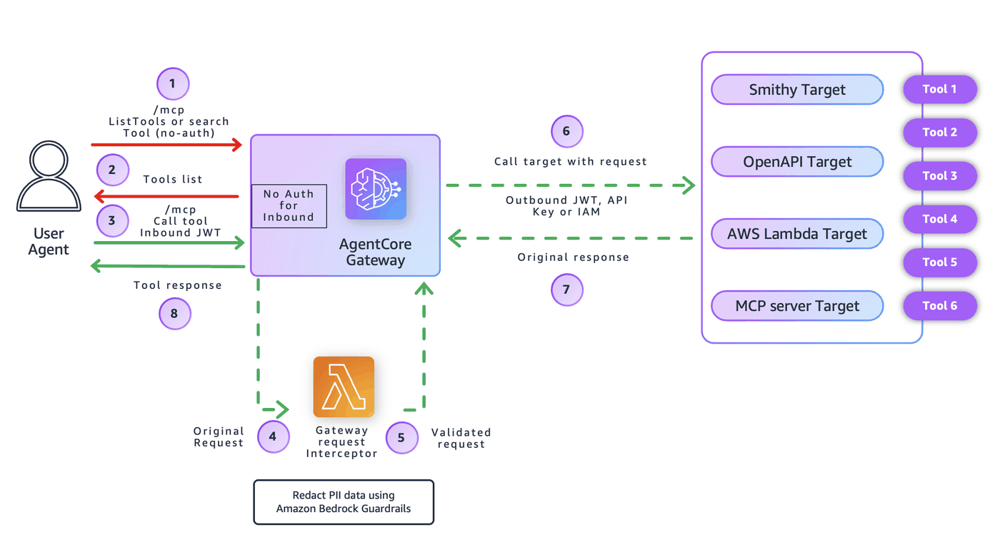

# Masking Sensitive Data in Amazon Bedrock AgentCore Gateway Tool Responses

## Overview

This notebook demonstrates how to **automatically anonymize Personally Identifiable Information (PII)** in tool responses using **Amazon Bedrock AgentCore Gateway interceptors** integrated with **Amazon Bedrock Guardrails**. The interceptor inspects tool responses in real-time and anonymizes sensitive data using Bedrock's built-in PII detection and anonymization capabilities before returning results to clients, ensuring compliance with data privacy regulations.

### Why Mask Sensitive Data at the Gateway?

When building AI applications that access customer data, you need to protect sensitive information:

- **Compliance**: Meet GDPR, HIPAA, PCI-DSS, and other regulatory requirements
- **Data Minimization**: Only expose necessary information to clients
- **Centralized Protection**: Apply anonymization rules consistently across all tools
- **Zero Trust**: Don't rely on downstream systems to protect sensitive data
- **AI-Powered Detection**: Leverage Bedrock Guardrails' advanced PII detection across 31+ PII types

The Gateway interceptor provides a **centralized enforcement point** that anonymizes PII regardless of which tool returns it, without modifying individual tool implementations.

---

## What This Tutorial Covers

This tutorial implements PII anonymization using a **RESPONSE interceptor** with **Amazon Bedrock Guardrails**:

🔒 **PII Anonymization (RESPONSE interceptor + Bedrock Guardrails)**  
   - Creates a Bedrock Guardrail configured with 31+ PII types for comprehensive detection
   - Intercepts tool responses from the Gateway
   - Applies Bedrock Guardrails to detect and anonymize sensitive data (emails, phone numbers, SSNs, credit cards, addresses, and more)
   - Replaces detected PII with anonymized placeholders (e.g., `[EMAIL]`, `[PHONE]`)
   - Returns the sanitized response to the client



---

## Why Use Gateway Interceptors?

Gateway Interceptors allow you to:

- **Data Protection**: Automatically anonymize sensitive information from responses using AI-powered detection
- **Compliance Enforcement**: Apply consistent data protection policies across all tools
- **Comprehensive Coverage**: Detect 31+ types of PII including names, addresses, financial data, health information, and more
- **Audit & Governance**: Log data access and anonymization events
- **Response Transformation**: Modify data in transit without changing tools
- **Managed Service**: Leverage Bedrock Guardrails' continuously updated PII detection models

Because interceptors are attached at the **Gateway layer**, they protect data from **any** underlying MCP server or tool without modifying application code.

---

## Tutorial Details

| Information              | Details                                                                      |
|--------------------------|------------------------------------------------------------------------------|
| **Tutorial type**        | Interactive                                                                  |
| **AgentCore components** | Amazon Bedrock AgentCore Gateway, Gateway Interceptors, Bedrock Guardrails  |
| **Gateway Target type**  | MCP Server (Lambda-based tool)                                              |
| **Interceptor types**    | AWS Lambda (RESPONSE)                                                       |
| **Inbound Auth IdP**     | Amazon Cognito (CUSTOM_JWT authorizer)                                      |
| **Data Protection**      | PII anonymization using Amazon Bedrock Guardrails (31+ PII types)           |
| **Tutorial components**  | Gateway, Lambda Interceptor, Bedrock Guardrails, Amazon Cognito, MCP tools  |
| **Tutorial vertical**    | Cross-vertical (applicable to any industry with PII)                        |
| **Example complexity**   | Intermediate                                                                 |
| **SDK used**             | boto3                                                                        |

---

## Prerequisites

To execute this tutorial you will need:

- Jupyter notebook (Python kernel)
- AWS credentials with permissions for:
  - AWS Lambda
  - AWS IAM
  - Amazon Cognito
  - Amazon Bedrock AgentCore services (control plane)
  - Amazon Bedrock Guardrails (bedrock:CreateGuardrail, bedrock:ApplyGuardrail)
- Python 3.9 or higher
- Basic understanding of AWS Lambda, IAM roles, Amazon Cognito, Amazon Bedrock Guardrails, and Amazon Bedrock AgentCore Gateway

> ⚠️ **Note:** The Cleanup section at the end deletes the AWS resources created by this tutorial (Gateway, Lambdas, IAM roles, Guardrails, etc.). Only run it when you're ready to tear everything down.

---

## Part 1: Setup & Deployment

### Step 1.0: Install Required Dependencies

Install all necessary Python packages for this tutorial.

```python
!pip install -r requirements.txt
```

### Step 1.1: Import Required Libraries

```python
import boto3
import json
import time
import sys
from pathlib import Path
from datetime import datetime
from botocore.exceptions import ClientError

# Add parent directory to path for utils
utils_dir = Path.cwd().parent
sys.path.insert(0, str(utils_dir))

import utils

print("✓ Libraries imported")

# Generate unique identifier for this deployment
DEPLOYMENT_ID = datetime.now().strftime("%Y%m%d-%H%M%S")
print(f"\nDeployment ID: {DEPLOYMENT_ID}")
```

### Step 1.2: Configure Deployment Variables

```python
# Configuration
REGION = "us-east-1"
LAMBDA_FUNCTION_NAME = f"interceptor-lambda-{DEPLOYMENT_ID}"
LAMBDA_ROLE_NAME = f"interceptor-lambda-role-{DEPLOYMENT_ID}"
GATEWAY_NAME = f"interceptor-gateway-{DEPLOYMENT_ID}"

# Initialize clients
gateway_client = boto3.client("bedrock-agentcore-control", region_name=REGION)
cognito_client = boto3.client("cognito-idp", region_name=REGION)

print("Configuration:")
print(f"  Lambda Function: {LAMBDA_FUNCTION_NAME}")
print(f"  Lambda Role: {LAMBDA_ROLE_NAME}")
print(f"  Gateway Name: {GATEWAY_NAME}")
print(f"  Region: {REGION}")
```

### Step 1.3: Setup Bedrock Guardrails for Sensitive Data Filtering

Create a Bedrock Guardrail with sensitive data filters to anonymize PII using Amazon Bedrock's built-in capabilities.

```python
# Setup Bedrock Guardrails for sensitive data filtering
print("Creating Bedrock Guardrail with sensitive data filters...")

bedrock_client = boto3.client("bedrock", region_name=REGION)

GUARDRAIL_NAME = f"pii-masking-guardrail-{DEPLOYMENT_ID}"

# Define sensitive data filters with ANONYMIZE behavior
# Bedrock Guardrails supports 31 PII entity types by default
# ANONYMIZE action replaces PII with placeholder text (masking behavior)
sensitive_information_policy_config = {
    "piiEntitiesConfig": [
        # General PII
        {"type": "ADDRESS", "action": "ANONYMIZE"},
        {"type": "AGE", "action": "ANONYMIZE"},
        {"type": "EMAIL", "action": "ANONYMIZE"},
        {"type": "NAME", "action": "ANONYMIZE"},
        {"type": "PHONE", "action": "ANONYMIZE"},
        {"type": "USERNAME", "action": "ANONYMIZE"},
        {"type": "PASSWORD", "action": "ANONYMIZE"},
        # Financial Information
        {"type": "CREDIT_DEBIT_CARD_CVV", "action": "ANONYMIZE"},
        {"type": "CREDIT_DEBIT_CARD_EXPIRY", "action": "ANONYMIZE"},
        {"type": "CREDIT_DEBIT_CARD_NUMBER", "action": "ANONYMIZE"},
        {"type": "PIN", "action": "ANONYMIZE"},
        {"type": "INTERNATIONAL_BANK_ACCOUNT_NUMBER", "action": "ANONYMIZE"},
        {"type": "SWIFT_CODE", "action": "ANONYMIZE"},
        # US-Specific Identifiers
        {"type": "US_BANK_ACCOUNT_NUMBER", "action": "ANONYMIZE"},
        {"type": "US_BANK_ROUTING_NUMBER", "action": "ANONYMIZE"},
        {"type": "US_INDIVIDUAL_TAX_IDENTIFICATION_NUMBER", "action": "ANONYMIZE"},
        {"type": "US_PASSPORT_NUMBER", "action": "ANONYMIZE"},
        {"type": "US_SOCIAL_SECURITY_NUMBER", "action": "ANONYMIZE"},
        {"type": "DRIVER_ID", "action": "ANONYMIZE"},
        # UK-Specific Identifiers
        {"type": "UK_NATIONAL_HEALTH_SERVICE_NUMBER", "action": "ANONYMIZE"},
        {"type": "UK_NATIONAL_INSURANCE_NUMBER", "action": "ANONYMIZE"},
        {"type": "UK_UNIQUE_TAXPAYER_REFERENCE_NUMBER", "action": "ANONYMIZE"},
        # Canada-Specific Identifiers
        {"type": "CA_HEALTH_NUMBER", "action": "ANONYMIZE"},
        {"type": "CA_SOCIAL_INSURANCE_NUMBER", "action": "ANONYMIZE"},
        # Network & Technical
        {"type": "IP_ADDRESS", "action": "ANONYMIZE"},
        {"type": "MAC_ADDRESS", "action": "ANONYMIZE"},
        {"type": "URL", "action": "ANONYMIZE"},
        # AWS Credentials
        {"type": "AWS_ACCESS_KEY", "action": "ANONYMIZE"},
        {"type": "AWS_SECRET_KEY", "action": "ANONYMIZE"},
        # Vehicle Identification
        {"type": "VEHICLE_IDENTIFICATION_NUMBER", "action": "ANONYMIZE"},
        {"type": "LICENSE_PLATE", "action": "ANONYMIZE"},
    ]
}

try:
    # Create the guardrail
    guardrail_response = bedrock_client.create_guardrail(
        name=GUARDRAIL_NAME,
        description="Guardrail for anonymizing sensitive PII data in tool responses",
        sensitiveInformationPolicyConfig=sensitive_information_policy_config,
        blockedInputMessaging="Input contains sensitive information that has been anonymized.",
        blockedOutputsMessaging="Output contains sensitive information that has been anonymized.",
    )

    GUARDRAIL_ID = guardrail_response["guardrailId"]
    GUARDRAIL_ARN = guardrail_response["guardrailArn"]

    print(f"✓ Guardrail created: {GUARDRAIL_ID}")
    print(f"  ARN: {GUARDRAIL_ARN}")

    # Create a version of the guardrail
    print("\nCreating guardrail version...")
    version_response = bedrock_client.create_guardrail_version(
        guardrailIdentifier=GUARDRAIL_ID,
        description="Initial version with PII anonymization",
    )

    GUARDRAIL_VERSION = version_response["version"]
    print(f"✓ Guardrail version created: {GUARDRAIL_VERSION}")

    # Display configured PII types
    print(
        f"\n✓ Configured {len(sensitive_information_policy_config['piiEntitiesConfig'])} PII types for anonymization:"
    )
    for pii_config in sensitive_information_policy_config["piiEntitiesConfig"]:
        print(f"  - {pii_config['type']}: {pii_config['action']}")

except ClientError as e:
    error_code = e.response["Error"]["Code"]
    if error_code == "ConflictException":
        print(f"⚠ Guardrail with name '{GUARDRAIL_NAME}' already exists")
        # List existing guardrails to get the ID
        list_response = bedrock_client.list_guardrails()
        for guardrail in list_response.get("guardrails", []):
            if guardrail["name"] == GUARDRAIL_NAME:
                GUARDRAIL_ID = guardrail["id"]
                GUARDRAIL_ARN = guardrail["arn"]
                print(f"  Using existing guardrail: {GUARDRAIL_ID}")

                # Get the latest version of the existing guardrail
                try:
                    get_response = bedrock_client.get_guardrail(guardrailIdentifier=GUARDRAIL_ID)
                    GUARDRAIL_VERSION = get_response.get("version", "DRAFT")
                    print(f"  Guardrail version: {GUARDRAIL_VERSION}")
                except Exception as get_error:
                    print(f"  ⚠ Could not get guardrail version: {get_error}")
                    GUARDRAIL_VERSION = "DRAFT"
                break
    else:
        print(f"✗ Failed to create guardrail: {e}")
        raise
except Exception as e:
    print(f"✗ Unexpected error creating guardrail: {e}")
    raise
```

### Step 1.4: Create IAM Role for Lambda Interceptor

Grant Lambda permissions to execute and write CloudWatch logs.

```python
# Create IAM role for Lambda interceptor using utils
print("Creating IAM role for Lambda interceptor...")

LAMBDA_ROLE_ARN = utils.create_lambda_role(
    role_name=LAMBDA_ROLE_NAME,
    description="Role for AgentCore Lambda Interceptor for PII masking with Bedrock Guardrails",
)

print(f"  ARN: {LAMBDA_ROLE_ARN}")

# Add Bedrock Guardrails permissions to Lambda role
print("\nAdding Bedrock Guardrails permissions to Lambda role...")
iam_client = boto3.client("iam")

bedrock_policy = {
    "Version": "2012-10-17",
    "Statement": [{"Effect": "Allow", "Action": ["bedrock:ApplyGuardrail"], "Resource": "*"}],
}

try:
    iam_client.put_role_policy(
        RoleName=LAMBDA_ROLE_NAME,
        PolicyName="BedrockGuardrailsPolicy",
        PolicyDocument=json.dumps(bedrock_policy),
    )
    print("✓ Bedrock Guardrails permissions added")
    print("  Policy: bedrock:ApplyGuardrail on all resources")
except Exception as e:
    print(f"⚠ Failed to add Bedrock permissions: {e}")
```

### Step 1.4a: Wait for Bedrock Guardrail to be Ready

Allow time for the Bedrock Guardrail to propagate and become fully available.

```python
time.sleep(10)
```

### Step 1.5: Deploy Lambda Interceptor Function

Lambda intercepts tool responses and masks PII using Bedrock Guardrails.

```python
# Deploy Lambda interceptor using utils
print("Deploying Lambda interceptor...")

# Prepare environment variables for Lambda
lambda_env_vars = {}
if "GUARDRAIL_ID" in globals():
    lambda_env_vars["GUARDRAIL_ID"] = GUARDRAIL_ID
    lambda_env_vars["GUARDRAIL_VERSION"] = GUARDRAIL_VERSION
    print(f"  Configuring Lambda with Guardrail: {GUARDRAIL_ID} (version: {GUARDRAIL_VERSION})")
else:
    print("  ⚠ WARNING: GUARDRAIL_ID not found. Lambda will skip PII masking.")
    print("  Make sure to run Step 1.2a to create the Guardrail first.")

LAMBDA_ARN = utils.deploy_lambda_function(
    function_name=LAMBDA_FUNCTION_NAME,
    role_arn=LAMBDA_ROLE_ARN,
    lambda_code_path="src/lambda/lambda_function.py",
    description="AgentCore Response Lambda Interceptor to mask sensitive data using Bedrock Guardrails",
    timeout=30,
    memory_size=256,
    environment_vars=lambda_env_vars if lambda_env_vars else None,
    region=REGION,
)

print(f"  ARN: {LAMBDA_ARN}")
```

### Step 1.5a: Grant Gateway Permission to Invoke Lambda

Add permissions for the Gateway to invoke the Lambda interceptor function.

```python
# Grant Gateway permission to invoke the Lambda interceptor
print("\nGranting Gateway permission to invoke Lambda...")

utils.grant_gateway_invoke_permission(function_name=LAMBDA_FUNCTION_NAME, region=REGION)
```

### Step 1.6: Create Amazon Cognito User Pool & App Client

Create Cognito user pool for Gateway authentication using OAuth client credentials flow.

```python
# Create Cognito User Pool and Client for Gateway authentication using utils
print("Creating Cognito User Pool and Client...")

USER_POOL_NAME = f"gateway-pool-{DEPLOYMENT_ID}"
RESOURCE_SERVER_ID = "gateway"
RESOURCE_SERVER_NAME = "Gateway Resource Server"
SCOPES = [{"ScopeName": "tools", "ScopeDescription": "Access to gateway tools"}]

# Create or get user pool
USER_POOL_ID = utils.get_or_create_user_pool(cognito_client, USER_POOL_NAME)
print(f"  Pool ID: {USER_POOL_ID}")

# Create or get resource server
utils.get_or_create_resource_server(cognito_client, USER_POOL_ID, RESOURCE_SERVER_ID, RESOURCE_SERVER_NAME, SCOPES)

# Wait for resource server to propagate
print("  Waiting for resource server to propagate...")
time.sleep(3)

# Create M2M client with client credentials flow
CLIENT_NAME = f"gateway-client-{DEPLOYMENT_ID}"
CLIENT_ID, CLIENT_SECRET = utils.get_or_create_m2m_client(
    cognito_client,
    USER_POOL_ID,
    CLIENT_NAME,
    RESOURCE_SERVER_ID,
    SCOPES=[f"{RESOURCE_SERVER_ID}/tools"],
)

print(f"✓ User Pool Client created: {CLIENT_NAME}")
print(f"  Client ID: {CLIENT_ID}")
print(f"  Client Secret: {CLIENT_SECRET[:20]}...")

# Construct OAuth URLs
POOL_DOMAIN = USER_POOL_ID.replace("_", "").lower()
COGNITO_DOMAIN = f"https://{POOL_DOMAIN}.auth.{REGION}.amazoncognito.com"
DISCOVERY_URL = f"https://cognito-idp.{REGION}.amazonaws.com/{USER_POOL_ID}/.well-known/openid-configuration"
TOKEN_URL = f"{COGNITO_DOMAIN}/oauth2/token"

print("\n✓ OAuth Configuration:")
print(f"  Discovery URL: {DISCOVERY_URL}")
print(f"  Token URL: {TOKEN_URL}")
print(f"  Scope: {RESOURCE_SERVER_ID}/tools")
```

### Step 1.7: Create Gateway with Response Interceptor

**Why RESPONSE Interceptor?**  
The interceptor processes tool responses after execution, allowing us to mask PII before returning data to clients.

```python
# Create Gateway IAM role
gateway_iam_role = utils.create_agentcore_gateway_role_with_region(GATEWAY_NAME, REGION)
GATEWAY_ROLE_ARN = gateway_iam_role["Role"]["Arn"]

print(f"✓ Gateway role created: {GATEWAY_ROLE_ARN}")

# Wait for role propagation
time.sleep(10)

# Create Gateway with Lambda interceptor
print("\nCreating Gateway with RESPONSE interceptor...")

try:
    gateway_response = gateway_client.create_gateway(
        name=GATEWAY_NAME,
        protocolType="MCP",
        protocolConfiguration={"mcp": {"supportedVersions": ["2025-03-26"]}},
        interceptorConfigurations=[
            {
                "interceptor": {"lambda": {"arn": LAMBDA_ARN}},
                "interceptionPoints": ["RESPONSE"],
                "inputConfiguration": {"passRequestHeaders": True},
            }
        ],
        authorizerType="CUSTOM_JWT",
        authorizerConfiguration={
            "customJWTAuthorizer": {
                "discoveryUrl": DISCOVERY_URL,
                "allowedClients": [CLIENT_ID],
            }
        },
        roleArn=GATEWAY_ROLE_ARN,
    )

    GATEWAY_ID = gateway_response.get("gatewayId")
    print(f"✓ Gateway created: {GATEWAY_ID}")

except Exception as e:
    print(f"\n✗ Failed to create Gateway: {e}")
    raise
```

### Step 1.8: Wait for Gateway to be Ready

```python
# Wait for Gateway to be ready using signed requests
print("\nWaiting for Gateway to be ready...")

max_attempts = 30
for attempt in range(max_attempts):
    try:
        response = gateway_client.get_gateway(gatewayIdentifier=GATEWAY_ID)
        status_code = response.get("ResponseMetadata", {}).get("HTTPStatusCode")

        if status_code == 200:
            # gateway_info = response.json()
            status = response.get("status", "UNKNOWN")

            print(f"  [{attempt + 1}/{max_attempts}] Status: {status}")

            if status == "READY":
                GATEWAY_URL = response.get("gatewayUrl")
                print("\n✓ Gateway is ready!")
                print(f"  URL: {GATEWAY_URL}")

                # Show interceptor configuration
                if "interceptorConfigurations" in response:
                    interceptor_configs = response["interceptorConfigurations"]
                    print("\n  Interceptor Configuration:")
                    for idx, config in enumerate(interceptor_configs):
                        print(f"    [{idx}] Interception Points: {config.get('interceptionPoints', [])}")
                        print(
                            f"    [{idx}] Lambda ARN: {config.get('interceptor', {}).get('lambda', {}).get('arn', 'N/A')}"
                        )
                        print(
                            f"    [{idx}] Pass Headers: {config.get('inputConfiguration', {}).get('passRequestHeaders', False)}"
                        )
                break
            elif status == "FAILED":
                print("\n✗ Gateway creation failed")
                print(f"  Details: {response}")
                raise Exception("Gateway failed")
        else:
            print(f"  [{attempt + 1}/{max_attempts}] HTTP Error: {response.status_code}")
    except Exception as e:
        print(f"  [{attempt + 1}/{max_attempts}] Error: {e}")

    time.sleep(10)
else:
    print("\n⚠ Timeout waiting for Gateway")
    raise Exception("Gateway timeout")
```

### Step 1.9: Register Sample Tools with Gateway

Deploy sample tool Lambda (employee data) and register it as a Gateway target.

```python
# Deploy tool Lambdas and register as Gateway targets
print("Deploying tool Lambda functions...")

# Import tool modules
sys.path.insert(0, str(Path.cwd()))
from src.tools import employee_data_tool

# Create IAM role for tool Lambdas using utils
TOOL_ROLE_ARN = utils.create_lambda_role(
    role_name=f"tool-lambda-role-{DEPLOYMENT_ID}",
    description="Role for tool Lambda functions",
)

# Deploy tool Lambda functions
tools_to_deploy = [
    ("employee_data_tool", employee_data_tool),
]

deployed_tools = []

for tool_name, tool_module in tools_to_deploy:
    print(f"  Deploying {tool_name}...")

    function_name = f"{tool_name.replace('_', '-')}-{DEPLOYMENT_ID}"
    tool_code_path = Path(tool_module.__file__)

    lambda_arn = utils.deploy_lambda_function(
        function_name=function_name,
        role_arn=TOOL_ROLE_ARN,
        lambda_code_path=str(tool_code_path),
        environment_vars={"TOOL_NAME": tool_name},
        description=f"{tool_name} function",
        region=REGION,
    )

    tool_definition = getattr(
        tool_module,
        "TOOL_DEFINITION",
        {"name": tool_name, "description": f"{tool_name} function"},
    )

    deployed_tools.append(
        {
            "tool_name": tool_name,
            "function_name": function_name,
            "lambda_arn": lambda_arn,
            "tool_definition": tool_definition,
        }
    )

print(f"✓ Deployed {len(deployed_tools)} tool Lambdas")

# Register tools as Gateway targets
print("\nRegistering tools as Gateway targets...")
created_targets = []

for tool in deployed_tools:
    print(f"  Registering {tool['tool_name']}...")

    try:
        response = gateway_client.create_gateway_target(
            gatewayIdentifier=GATEWAY_ID,
            name=f"{tool['tool_name'].replace('_', '-')}-target",
            targetConfiguration={
                "mcp": {
                    "lambda": {
                        "lambdaArn": tool["lambda_arn"],
                        "toolSchema": {"inlinePayload": [tool["tool_definition"]]},
                    }
                }
            },
            credentialProviderConfigurations=[{"credentialProviderType": "GATEWAY_IAM_ROLE"}],
        )

        target_id = response["targetId"]
        print(f"    ✓ Target created: {target_id}")

        # Wait for target to be READY
        for attempt in range(18):
            status_response = gateway_client.get_gateway_target(gatewayIdentifier=GATEWAY_ID, targetId=target_id)
            status = status_response.get("status")

            if status == "READY":
                print("    ✓ Target is READY")
                created_targets.append(
                    {
                        "tool_name": tool["tool_name"],
                        "target_id": target_id,
                        "lambda_arn": tool["lambda_arn"],
                    }
                )
                break
            elif status == "FAILED":
                print("    ✗ Target FAILED")
                break

            time.sleep(10)

    except Exception as e:
        print(f"    ✗ Failed to create target: {e}")

# Summary
print(f"\n✓ Deployed {len(deployed_tools)} tool Lambdas")
print(f"✓ Created {len(created_targets)} gateway targets")

if len(created_targets) < len(deployed_tools):
    print("⚠ Warning: Not all targets were created successfully")

# Store for cleanup
DEPLOYED_TOOL_FUNCTIONS = [t["function_name"] for t in deployed_tools]
CREATED_TARGET_IDS = [t["target_id"] for t in created_targets]
```

---

## Part 2: Testing

### Step 2.1: Test PII Anonymization with Bedrock Guardrails

Invoke the employee data tool and verify that PII is anonymized in the response.

#### What to Expect:

The employee data tool returns realistic employee information containing various types of PII. The Lambda interceptor will:

1. **Intercept the response** after the tool executes
2. **Apply Bedrock Guardrails** to detect PII across 31+ entity types
3. **Anonymize detected PII** by replacing it with placeholder tokens
4. **Return the sanitized response** to the client

#### Bedrock Guardrails Anonymization Format:

Bedrock Guardrails replaces detected PII with anonymized placeholders in the format:

- **Emails**: `john.doe@example.com` → `[EMAIL]`
- **Phone Numbers**: `+1-555-123-4567` → `[PHONE]`
- **Names**: `John Doe` → `[NAME]`
- **Addresses**: `123 Main St, Springfield, IL 62701` → `[ADDRESS]`
- **SSN**: `123-45-6789` → `[US_SOCIAL_SECURITY_NUMBER]`
- **Credit Cards**: `4532-1234-5678-9010` → `[CREDIT_DEBIT_CARD_NUMBER]`
- **IP Addresses**: `192.168.1.1` → `[IP_ADDRESS]`
- **URLs**: `https://example.com` → `[URL]`

#### Example Output:

**Before anonymization (raw tool response):**
```json
{
  "employee_id": "EMP-98765",
  "department": "Engineering",
  "contact_info": "alice.smith@company.com",
  "mailing_info": "456 Oak Avenue, Boston, MA 02101",
  "status": "Active"
}
```

**After anonymization (intercepted response):**
```json
{
  "employee_id": "EMP-98765",
  "department": "Engineering",
  "contact_info": "[EMAIL]",
  "mailing_info": "[ADDRESS]",
  "status": "Active"
}
```

Notice that non-sensitive data like `employee_id`, `department`, and `status` remain unchanged, while all PII (email, address) is replaced with anonymized placeholders.

```python
# Test the PII masking by invoking the tool
import requests

print("Testing PII masking interceptor...")
print(f"Gateway URL: {GATEWAY_URL}")

# Get OAuth token
token_data = utils.get_token(
    user_pool_id=USER_POOL_ID,
    client_id=CLIENT_ID,
    client_secret=CLIENT_SECRET,
    scope_string="gateway/tools",
    REGION=REGION,
)

if "error" in token_data:
    print(f"✗ Token request failed: {token_data['error']}")
else:
    token = token_data["access_token"]
    print("✓ Token obtained")
```

### Step 2.2: Test Employee Data Tool

Invoke the employee data tool to see how Bedrock Guardrails anonymizes comprehensive PII including contact information and financial data, even when field names don't explicitly indicate sensitivity.

The employee data tool returns:
- **Contact Information**: Email and physical address
- **Financial Information**: Bank account numbers, routing numbers, credit card details, CVV, expiry dates, PIN, and tax ID
- **Non-Sensitive Data**: Employee ID, department, status, account balances, credit scores

**Before anonymization:**
```json
{
  "employee_id": "EMP-98765",
  "department": "Engineering",
  "contact_info": "alice.smith@company.com",
  "mailing_info": "456 Oak Avenue, Boston, MA 02101",
  "status": "Active",
  "financial_info": {
    "bank_account": "123456789",
    "routing_number": "987654321",
    "credit_card": "4532-1234-5678-9010",
    "cvv": "123",
    "card_expiry": "12/28",
    "pin": "1234",
    "tax_id": "987-65-4321",
    "account_balance": 25000.50,
    "credit_score": 750
  }
}
```

**After anonymization:**
```json
{
  "employee_id": "EMP-98765",
  "department": "Engineering",
  "contact_info": "[EMAIL]",
  "mailing_info": "[ADDRESS]",
  "status": "Active",
  "financial_info": {
    "bank_account": "[US_BANK_ACCOUNT_NUMBER]",
    "routing_number": "[US_BANK_ROUTING_NUMBER]",
    "credit_card": "[CREDIT_DEBIT_CARD_NUMBER]",
    "cvv": "[CREDIT_DEBIT_CARD_CVV]",
    "card_expiry": "[CREDIT_DEBIT_CARD_EXPIRY]",
    "pin": "[PIN]",
    "tax_id": "[US_INDIVIDUAL_TAX_IDENTIFICATION_NUMBER]",
    "account_balance": 25000.50,
    "credit_score": 750
  }
}
```

**Key Observations:**
- **Content-Based Detection**: Field names like `contact_info` and `mailing_info` don't explicitly say "email" or "address", but Bedrock Guardrails detects and anonymizes the content based on pattern recognition
- **Comprehensive Financial PII Protection**: All sensitive financial data (bank accounts, credit cards, tax IDs) are automatically detected and anonymized
- **Selective Anonymization**: Non-sensitive financial data like account balances and credit scores remain unchanged
- **31+ PII Types**: Bedrock Guardrails protects against a wide range of PII types without requiring explicit field name matching

```python
# Test the employee data tool
print("\n" + "=" * 60)
print("Testing Employee Data Tool with PII Anonymization")
print("=" * 60)

# Reuse the token from previous step
if "token" in locals():
    print("✓ Using existing token")

    # Call the employee data tool
    mcp_request = {
        "jsonrpc": "2.0",
        "method": "tools/call",
        "id": 2,
        "params": {
            "name": "employee-data-tool-target___employee_data_tool",
            "arguments": {"employee_id": "EMP-98765"},
        },
    }

    response = requests.post(
        GATEWAY_URL,
        headers={
            "Authorization": f"Bearer {token}",
            "Content-Type": "application/json",
        },
        json=mcp_request,
    )

    if response.status_code == 200:
        result = response.json()
        print("\n✓ Employee tool invoked successfully")
        print("\nResponse (PII in contact_info and mailing_info should be anonymized):")
        print(json.dumps(result, indent=2))

        # Highlight the anonymization
        print("\n📝 Notice:")
        print("  - 'employee_id', 'department', and 'status' remain unchanged (non-sensitive)")
        print("  - 'contact_info' email is replaced with [EMAIL] placeholder")
        print("  - 'mailing_info' address is replaced with [ADDRESS] placeholder")
        print("  - All financial PII is anonymized:")
        print("    • Bank account → [US_BANK_ACCOUNT_NUMBER]")
        print("    • Routing number → [US_BANK_ROUTING_NUMBER]")
        print("    • Credit card → [CREDIT_DEBIT_CARD_NUMBER]")
        print("    • CVV → [CREDIT_DEBIT_CARD_CVV]")
        print("    • Card expiry → [CREDIT_DEBIT_CARD_EXPIRY]")
        print("    • PIN → [PIN]")
        print("    • Tax ID → [US_INDIVIDUAL_TAX_IDENTIFICATION_NUMBER]")
        print("  - Non-sensitive financial data preserved (balances, credit scores, currency)")
        print("\n  ⭐ Key Point: Bedrock Guardrails uses content-based detection, not field names.")
        print("  Field names like 'mailing_info' don't explicitly say 'address', but the content")
        print("  is still detected and anonymized. This works across 31+ PII types automatically!")
    else:
        print(f"✗ Request failed: {response.status_code}")
        print(f"Response: {response.text}")
else:
    print("✗ No token available. Please run Step 2.1 first.")
```

---

# Part 3: Cleanup - Delete All Resources

⚠️ **WARNING: This will DELETE all resources created in Part 1!**

Only run this section if you want to clean up everything.

### Step 3.1: Delete Created Resources

```python
# Cleanup - Delete all created resources using utils
print("Starting cleanup...")

# 1. Delete gateway targets
if "CREATED_TARGET_IDS" in globals() and "GATEWAY_ID" in globals():
    utils.delete_gateway_targets(gateway_client, GATEWAY_ID, CREATED_TARGET_IDS)
    # Wait for target deletions to complete before deleting gateway
    time.sleep(5)

# 2. Delete gateway
if "GATEWAY_ID" in globals():
    utils.delete_gateway(gateway_client, GATEWAY_ID)
    print("✓ Deleted gateway")

# 3. Delete Lambda functions (tools + interceptor)
lambda_functions_to_delete = []
if "DEPLOYED_TOOL_FUNCTIONS" in globals():
    lambda_functions_to_delete.extend(DEPLOYED_TOOL_FUNCTIONS)
if "LAMBDA_FUNCTION_NAME" in globals():
    lambda_functions_to_delete.append(LAMBDA_FUNCTION_NAME)

if lambda_functions_to_delete:
    utils.delete_lambda_functions(lambda_functions_to_delete, REGION)

# 4. Delete IAM roles
if "LAMBDA_ROLE_NAME" in globals():
    utils.delete_iam_role(LAMBDA_ROLE_NAME)
if "DEPLOYMENT_ID" in globals():
    utils.delete_iam_role(f"tool-lambda-role-{DEPLOYMENT_ID}")
    utils.delete_iam_role(f"agentcore-{GATEWAY_NAME}-role")

# 5. Delete Cognito user pool
if "USER_POOL_ID" in globals():
    utils.delete_cognito_user_pool(USER_POOL_ID, REGION)

# 6. Delete Bedrock Guardrail
if "GUARDRAIL_ID" in globals():
    try:
        print("\nDeleting Bedrock Guardrail...")
        bedrock_client.delete_guardrail(guardrailIdentifier=GUARDRAIL_ID)
        print(f"✓ Deleted guardrail: {GUARDRAIL_ID}")
    except Exception as e:
        print(f"⚠ Failed to delete guardrail: {e}")

print("\n✓ Cleanup complete!")
```

---

# Summary

This notebook demonstrates PII masking using Lambda interceptors:

1. ✅ **Setup** - Created Lambda interceptor, IAM roles, Cognito, and Gateway
2. ✅ **Test** - Verified PII masking through Gateway responses
3. ✅ **Cleanup** - Deleted all resources

## What We Demonstrated

- **Lambda RESPONSE interceptor** that masks sensitive data in tool responses
- **PII detection and masking** using regex patterns
- **Gateway integration** with custom interceptors
- **Complete resource lifecycle** management

## Next Steps

- Customize masking patterns for your use case
- Add more sophisticated PII detection (e.g., AWS Comprehend)
- Integrate with compliance logging
- Monitor CloudWatch logs for debugging
