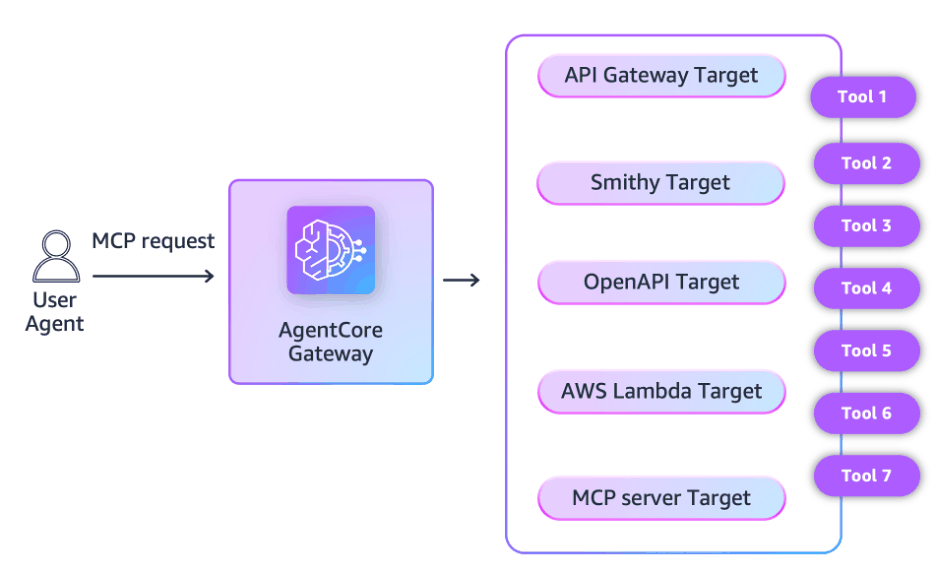
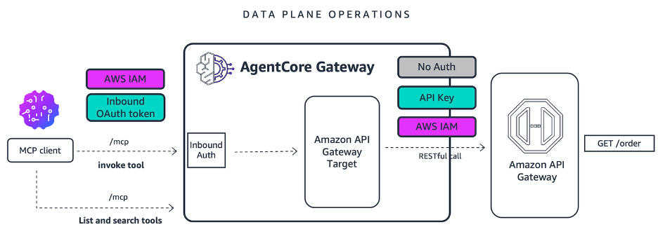
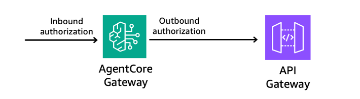

# Integrate your API Gateway as an AgentCore Gateway Target

## Overview

As organizations explore the possibilities of agentic applications, they continue to navigate challenges of using enterprise data as context in invocation requests to large language models (LLMs) in a manner that is secure and aligned with enterprise policies. To help standardize and secure those interactions, many organizations are using the Model Context Protocol (MCP) specification, which defines how agentic applications can securely connect to data sources and tools.

While MCP has been advantageous for net new use cases, organizations also navigate challenges with bringing their existing API estate into the agentic era. MCP can certainly wrap existing APIs, but it requires additional work, translating requests from MCP to RESTful APIs, making sure security is maintained through the entire request flow, and applying the standard observability required for production deployments.

[Amazon Bedrock AgentCore Gateway](https://docs.aws.amazon.com/bedrock-agentcore/latest/devguide/gateway.html) now supports [Amazon API Gateway](https://aws.amazon.com/api-gateway/) as a target, translating MCP requests to AgentCore Gateway (ACGW) into RESTful requests to API Gateway (APIGW). You can now expose both new and existing API endpoints from APIGW to agentic applications via MCP, with built-in security and observability. This notebook covers this new capability and shows how to implement them.

## What's new

AgentCore Gateway already supports multiple target types, e.g., Lambda functions, OpenAPI schemas, Smithy models, MCP servers, and now supports API Gateway.





**Our customers have successfully built extensive API ecosystems using API Gateway, connecting backends across numerous applications.** As enterprises advance toward next-generation agentic applications, the natural evolution is to expose these existing APIs and backend tools to AI-powered systems, enabling seamless integration between established infrastructure and modern intelligent agents.

Today, customers follow a manual workflow where they export their APIGW APIs as OpenAPI 3 specification and then add it to ACGW as an OpenAPI target. This integration aims to streamline this process by automating the connection between APIGW and ACGW.


With this integration, customers will no longer have to manage this export/import process themselves. A new API_GATEWAY target type will be added to ACGW. REST API owners can add their API as an ACGW target with a few console clicks or a single CLI command, thus exposing their existing REST API methods as MCP tools via ACGW. API consumers can then connect AI agents with these REST APIs through the Model Context Protocol (MCP) and power their workflows with AI integration. Your agentic applications can now connect to your new or existing APIGW API. Today, this integration between ACGW and APIGW supports IAM authorization and API key authorization.



### Tutorial Details


| Information          | Details                                                   |
|:---------------------|:----------------------------------------------------------|
| Tutorial type        | Interactive                                               |
| AgentCore components | AgentCore Gateway, AgentCore Identity                     |
| Agentic Framework    | Strands Agents                                            |
| Gateway Target type  | API Gateway                                               |
| Agent                | Strands                                                   |
| Inbound Auth IdP     | Amazon Cognito, but can use others                        |
| Outbound Auth        | IAM Authorization and API Key                             |
| LLM model            | Anthropic Claude Sonnet 4                                 |
| Tutorial components  |Invoking API Gateway via AgentCore Gateway target          |
| Tutorial vertical    | Cross-vertical                                            |
| Example complexity   | Easy                                                      |
| SDK used             | boto3                                                     |

## Tutorial architecture

This tutorial serves as a practical example of the broader enterprise challenge: **How to integrate API Gateway API into a centralized Gateway architecture  for your next generation agentic applications.**

## Prerequisites

To execute this tutorial you will need:
* Jupyter notebook (Python kernel)
* uv
* AWS credentials
* Amazon Cognito

```python
# Install from the requirements file or pyproject.toml file in current directory
!pip3 install --force-reinstall -U -r requirements.txt --quiet

# Feel free to modify it depending upon the environment you are using. The following command might help.
# !uv pip install --force-reinstall -U -r requirements.txt --quiet
```

```python
import os

# Set AWS credentials if not using SageMaker notebook
# os.environ['AWS_ACCESS_KEY_ID'] = '' # Set the access key
# os.environ['AWS_SECRET_ACCESS_KEY'] = '' # Set the secret key
os.environ["AWS_DEFAULT_REGION"] = os.environ.get("AWS_REGION", "us-west-2")
```

```python
# Import utils
import os
import sys
import importlib

# Get the directory of the current script
if "__file__" in globals():
    current_dir = os.path.dirname(os.path.abspath(__file__))
else:
    current_dir = os.getcwd()  # Fallback if __file__ is not defined (e.g., Jupyter)

# utils.py is in the same directory as the notebook
if current_dir not in sys.path:
    sys.path.insert(0, current_dir)

# Import utils and reload to pick up any changes
import utils

importlib.reload(utils)

# Setup logging
import logging

# Configure logging for notebook environment
logging.basicConfig(
    level=logging.INFO,
    format="%(asctime)s | %(levelname)s | %(name)s | %(message)s",
    handlers=[logging.StreamHandler()],
)

# Set specific logger levels
logging.getLogger("strands").setLevel(logging.INFO)
```

## Set up pre-requisites for inbound and outbound authorization

- Inbound authorization authenticates incoming user requests.
- Outbound authorization helps ACGW to securely connect to gateway targets, such as an APIGW, on behalf of the authenticated user.


 
For API Gateway as a target, ACGW supports the following types of outbound authorization:
-	No authorization (not recommended) – Some target types provide you the option to bypass outbound authorization. We do not recommend this less secure option.

-	IAM-based outbound authorization – Use the [gateway service role](https://docs.aws.amazon.com/bedrock-agentcore/latest/devguide/gateway-prerequisites-permissions.html#gateway-service-role-permissions) to authorize access to the gateway target with AWS Signature Version 4 (Sig V4).

-	API key – Use the API key that is configured by API Gateway and set up with AgentCore Identity. API Keys created via APIGW map to APIGW Usage Plans, which help you monitor and control. Please refer to this [documentation](https://docs.aws.amazon.com/apigateway/latest/developerguide/api-gateway-api-usage-plans.html) for more details.

For Outbound Authorization with IAM-based authorization, the policy should include "execute-api:Invoke" permission.

#### Let's quickly create an IAM Role for ACGW to assume. 
**We will also use this IAM Role for IAM based authorization while calling our APIGW.**

```python
agentcore_gateway_iam_role = utils.create_agentcore_gateway_role("sample-agent-core-gateway-role-for-api-gateway")
print("Agentcore gateway role ARN: ", agentcore_gateway_iam_role["Role"]["Arn"])
```

## Configure Inbound Authentication to Gateway with Amazon Cognito

We will create a Cognito User Pool to handle JWT-based authentication for incoming requests to the AgentCore Gateway.

**Components Created:**
- User Pool for identity management
- Resource Server for OAuth 2.0 scopes
- Machine-to-Machine (M2M) Client for programmatic access

```python
# Creating Cognito User Pool
import os
import boto3

REGION = os.environ["AWS_DEFAULT_REGION"]
USER_POOL_NAME = "sample-agentcore-gateway-pool"
RESOURCE_SERVER_ID = "sample-agentcore-gateway-id"
RESOURCE_SERVER_NAME = "sample-agentcore-gateway-name"
CLIENT_NAME = "sample-agentcore-gateway-client"
SCOPES = [
    {
        "ScopeName": "invoke",  # Just 'invoke', will be formatted as resource_server_id/invoke
        "ScopeDescription": "Scope for invoking the agentcore gateway",
    },
]

scope_names = [f"{RESOURCE_SERVER_ID}/{scope['ScopeName']}" for scope in SCOPES]
scopeString = " ".join(scope_names)


cognito = boto3.client("cognito-idp", region_name=REGION)

print("Creating or retrieving Cognito resources...")
gw_user_pool_id = utils.get_or_create_user_pool(cognito, USER_POOL_NAME)
print(f"User Pool ID: {gw_user_pool_id}")

utils.get_or_create_resource_server(cognito, gw_user_pool_id, RESOURCE_SERVER_ID, RESOURCE_SERVER_NAME, SCOPES)
print("Resource server ensured.")

gw_client_id, gw_client_secret = utils.get_or_create_m2m_client(
    cognito, gw_user_pool_id, CLIENT_NAME, RESOURCE_SERVER_ID, scope_names
)

print(f"Client ID: {gw_client_id}")

# Get discovery URL
gw_cognito_discovery_url = (
    f"https://cognito-idp.{REGION}.amazonaws.com/{gw_user_pool_id}/.well-known/openid-configuration"
)
print(gw_cognito_discovery_url)
```

## Create the Gateway
Let's now create an Agent Core Gateway

```python
# CreateGateway with Cognito authorizer. Use the Cognito user pool created in the previous step
import boto3

gateway_client = boto3.client("bedrock-agentcore-control", region_name=REGION)
auth_config = {
    "customJWTAuthorizer": {
        "allowedClients": [
            gw_client_id
        ],  # Client MUST match with the ClientId configured in Cognito. Example: 7rfbikfsm51j2fpaggacgng84g
        "discoveryUrl": gw_cognito_discovery_url,
    }
}
create_response = gateway_client.create_gateway(
    name="sample-ac-gateway-apigw-demo",
    roleArn=agentcore_gateway_iam_role["Role"][
        "Arn"
    ],  # The IAM Role must have permissions to create/list/get/delete Gateway
    protocolType="MCP",
    protocolConfiguration={"mcp": {"supportedVersions": ["2025-03-26"], "searchType": "SEMANTIC"}},
    authorizerType="CUSTOM_JWT",
    authorizerConfiguration=auth_config,
    description="AgentCore Gateway with API Gateway target",
)
print(create_response)
# Retrieve the GatewayID used for GatewayTarget creation
gatewayID = create_response["gatewayId"]
gatewayURL = create_response["gatewayUrl"]
print(gatewayID)
```

## Deploy Sample PetStore API with Amazon API Gateway
### API Overview

We will deploy a sample PetStore REST API demonstrating both IAM and API Key authorization patterns.

**API Endpoints:**

| Endpoint | Method | Authorization | Description |
|:---------|:-------|:--------------|:------------|
| `/pets` | GET | IAM (SigV4) | List all available pets |
| `/pets` | POST | IAM (SigV4) | Add a new pet |
| `/pets/{petId}` | GET | IAM (SigV4) | Get pet by ID |
| `/orders/{orderId}` | GET | API Key | Get order details |

**Resources Created:**
- REST API with mock integrations
- API Key for `/orders` endpoint
- Usage Plan with rate limiting
- Deployment to `dev` stage

The OpenAPI specification is available in [AgentCore_Sample_API-dev-oas30-apigateway.json](AgentCore_Sample_API-dev-oas30-apigateway.json).

```python
# Load OpenAPI definition with API Gateway extensions, import to API Gateway, and deploy
# This uses the OpenAPI document that already has integrations and security configured
api_result = utils.create_and_deploy_api_from_openapi_with_extensions(
    filename="AgentCore_Sample_API-dev-oas30-apigateway.json",
    stage_name="dev",
    description="Initial Deployment",
)

# Extract the API details for use in subsequent cells
api_id = api_result["api_id"]
api_key = api_result["api_key_value"]
invoke_url = api_result["invoke_url"]

print(f"\n{'=' * 70}")
print("API Details for Gateway Target Configuration")
print(f"{'=' * 70}")
print(f"API ID: {api_id}")
print(f"API Name: {api_result['api_name']}")
print(f"Stage: {api_result['stage_name']}")
print(f"API Key ID: {api_result['api_key_id']}")
print(f"Usage Plan ID: {api_result['usage_plan_id']}")
print(f"{'=' * 70}")
```

## Validate API Gateway Deployment

We will test all endpoints to verify proper configuration and authorization.

**Note:** Allow 10-15 seconds for API Gateway changes to propagate across availability zones before running tests.

```python
test_results = utils.test_api_gateway_endpoints(
    invoke_url=api_result["invoke_url"],
    api_key=api_result["api_key_value"],
    region=os.environ.get("AWS_DEFAULT_REGION", "us-west-2"),
)

# Display detailed results
print("\nDetailed Test Results:")
for endpoint, result in test_results.items():
    print(f"\n{endpoint}: {result['status']}")
    if "data" in result:
        print(f"  Data: {result['data']}")
    if "error" in result:
        print(f"  Error: {result['error']}")
```

## Secure the generated API Key in AgentCore Identity
The following section creates a new API Key credential provide in AgentCore Identity which will be used later while creating the AgentCore Gateway target for the `/orders` endpoint. 

The API Key will be securely stored in AWS Secrets Manager via AgentCore Identity.

```python
import boto3
import os

credentialProviderArn = ""
try:
    # Create Bedrock Agent Core Control client
    REGION = os.environ["AWS_DEFAULT_REGION"]
    bedrock_agent_client = boto3.client("bedrock-agentcore-control", region_name=REGION)

    # Create API key credential provider in AgentCore identity
    credential_provider_response = bedrock_agent_client.create_api_key_credential_provider(
        name="sample-api-gateway-key-provider",
        apiKey=api_key,
        tags={"ProjectName": "AgentCore-APIGW-Sample-Application"},
    )

    # Store the ARNs in variables
    secretArn = credential_provider_response["apiKeySecretArn"]["secretArn"]
    credentialProviderArn = credential_provider_response["credentialProviderArn"]
    print(f"Credential Provider Arn: {credentialProviderArn}")

except KeyError as e:
    print(f"Environment variable or response key missing: {e}")
except Exception as e:
    print(f"An error occurred: {e}")
```

## Create the Gateway Target
In order to create an API gateway target, you need to specify the following as the part of target configuration:
- **toolFilters**: Use this to determine what resources on the REST API will be exposed as tool on the ACGW. Filters also support wildcards in the filterPath.
- **toolOverrides** (optional): Use this to allow users to override tool names and description. You must specify explicit paths and methods. If not specified, it will use descriptions from APIGW.
- **restApiId**: Use this to pass API Gateway ID. 
- **stage**: Use this to pass API Gateway deployed stage name


Below are a few examples of target configurations:

### Example 1:

This exposes “GET & POST /pets”, “GET /pets/{petId}” to the gateway and overrides their tool names and descriptions.

```python
{
    "mcp": {
        "apiGateway": {
            "restApiId": "<api-id>",
            "stage": "<stage>",
            "apiGatewayToolConfiguration": {
                "toolFilters": [
                    {"filterPath": "/pets", "methods": ["GET", "POST"]},
                    {"filterPath": "/pets/{petId}", "methods": ["GET"]},
                ],
                "toolOverrides": [
                    {
                        "name": "ListPets",
                        "path": "/pets",
                        "method": "GET",
                        "description": "Retrieves all the available Pets.",
                    },
                    {
                        "name": "AddPet",
                        "path": "/pets",
                        "method": "POST",
                        "description": "Add a new pet to the available Pets.",
                    },
                    {
                        "path": "/pets/{petId}",
                        "method": "GET",
                        "name": "GetPetById",
                        "description": "Retrieve a specific pet by its ID",
                    },
                ],
            },
        }
    }
}
```

### Example 2
This will expose “GET /pets” but also "GET /pets/{petId}" or anything under "/pets". Since toolOverrides is not specified, it will use the resource description from API Gateway.

```python
{
    "mcp": {
        "apiGateway": {
            "restApiId": "<api-id>",
            "stage": "<stage>",
            "apiGatewayToolConfiguration": {"toolFilters": [{"filterPath": "/pets/*", "methods": ["GET"]}]},
        }
    }
}
```

## Create Gateway Target 1: IAM-Authorized Endpoints

This target exposes `/pets` and `/pets/{petId}` endpoints using IAM authorization.

```python
import boto3

gateway_client = boto3.client("bedrock-agentcore-control", region_name=REGION)

# creating Gateway Target for '/pets' and '/pets/{petId}' resource with IAM credential provider
create_gateway_target_1_response = gateway_client.create_gateway_target(
    name="api-gateway-target-1",
    gatewayIdentifier=gatewayID,
    targetConfiguration={
        "mcp": {
            "apiGateway": {
                "restApiId": api_id,
                "stage": "dev",
                "apiGatewayToolConfiguration": {
                    "toolFilters": [
                        {"filterPath": "/pets", "methods": ["GET", "POST"]},
                        {"filterPath": "/pets/{petId}", "methods": ["GET"]},
                    ],
                    "toolOverrides": [
                        {
                            "name": "List_Pets",
                            "path": "/pets",
                            "method": "GET",
                            "description": "Retrieves all the available Pets.",
                        },
                        {
                            "name": "Add_Pet",
                            "path": "/pets",
                            "method": "POST",
                            "description": "Add a new pet to the available Pets.",
                        },
                        {
                            "path": "/pets/{petId}",
                            "method": "GET",
                            "name": "GetPetById",
                            "description": "Retrieve a specific pet by its ID",
                        },
                    ],
                },
            }
        }
    },
    credentialProviderConfigurations=[{"credentialProviderType": "GATEWAY_IAM_ROLE"}],
)
print(f"Create Gateway Target 1 Response: {create_gateway_target_1_response}")
gateway_target1_id = create_gateway_target_1_response["targetId"]
```

## Create Gateway Target 2: API Key-Authorized Endpoints

This target exposes `/orders/{orderId}` endpoint using API Key authorization from the credential provider created earlier.

```python
# Creating 2nd Gateway Target for /orders/{orderId} resource with API Key credential provider
create_gateway_target_2_response = gateway_client.create_gateway_target(
    name="api-gateway-target-2",
    gatewayIdentifier=gatewayID,
    targetConfiguration={
        "mcp": {
            "apiGateway": {
                "restApiId": api_id,
                "stage": "dev",
                "apiGatewayToolConfiguration": {
                    "toolFilters": [{"filterPath": "/orders/{orderId}", "methods": ["GET"]}],
                    "toolOverrides": [
                        {
                            "path": "/orders/{orderId}",
                            "method": "GET",
                            "name": "GetOrderById",
                            "description": "Retrieve a specific order by its ID",
                        }
                    ],
                },
            }
        }
    },
    credentialProviderConfigurations=[
        {
            "credentialProviderType": "API_KEY",
            "credentialProvider": {
                "apiKeyCredentialProvider": {
                    "providerArn": credentialProviderArn,
                    "credentialParameterName": "x-api-key",
                    "credentialLocation": "HEADER",
                }
            },
        }
    ],
)
print(f"Create Gateway Target 2 Response: {create_gateway_target_2_response}")
gateway_target2_id = create_gateway_target_2_response["targetId"]
```

## Verify Gateway Target Status

Ensure both targets are in `READY` state before proceeding. If any target shows `FAILED` status, use the [get_gateway_target API](https://boto3.amazonaws.com/v1/documentation/api/latest/reference/services/bedrock-agentcore-control/client/get_gateway_target.html) to investigate the failure reason.

```python
list_gateway_targets_response = gateway_client.list_gateway_targets(gatewayIdentifier=gatewayID, maxResults=10)
for i, item in enumerate(list_gateway_targets_response["items"], 1):
    print(f"Target {i}:")
    print(f"  Target ID: {item['targetId']}")
    print(f"  Name: {item['name']}")
    print(f"  Status: {item['status']}")
    print()
```

## Test Integration with AI Agent

We will use Strands AI framework to test the complete integration by:
1. Listing available tools from the gateway
2. Invoking pet-related endpoints (IAM auth)
3. Invoking order endpoint (API Key auth)

```python
from strands.models import BedrockModel
from mcp.client.streamable_http import streamablehttp_client
from strands.tools.mcp.mcp_client import MCPClient
from strands import Agent


def get_token():
    token = utils.get_token(gw_user_pool_id, gw_client_id, gw_client_secret, scopeString, REGION)
    return token["access_token"]


def create_streamable_http_transport():
    return streamablehttp_client(gatewayURL, headers={"Authorization": f"Bearer {get_token()}"})


client = MCPClient(create_streamable_http_transport)

## The IAM group/user/ configured in ~/.aws/credentials should have access to Bedrock model
yourmodel = BedrockModel(
    model_id="us.anthropic.claude-sonnet-4-20250514-v1:0",  # may need to update model_id depending on region
    temperature=0.7,
    max_tokens=500,  # Limit response length
)

with client:
    # Call the listTools
    tools = client.list_tools_sync()
    # Create an Agent with the model and tools

    agent = Agent(model=yourmodel, tools=tools)
    ## you can replace with any model you like

    print("\n" + "=" * 70)
    print("Test 1: List Available Tools")
    print("=" * 70)
    agent("List all tools available to you")

    print("\n" + "=" * 70)
    print("Test 2: List All Pets (IAM Auth)")
    print("=" * 70)
    agent("List all the available pets")

    print("\n" + "=" * 70)
    print("Test 3: Get Pet by ID (IAM Auth)")
    print("=" * 70)
    agent("Tell me about the pet with petId 3")

    print("\n" + "=" * 70)
    print("Test 4: Get Order Details (API Key Auth)")
    print("=" * 70)
    agent("When will my order be delivered? My order id is 2")
```

## Resource Cleanup

Execute the following cell to remove all resources created during this tutorial:

**Resources to be deleted:**
1. AgentCore Gateway and targets
2. AgentCore Identity credential provider
3. API Gateway REST API, API Key, and Usage Plan
4. Amazon Cognito User Pool and clients
5. IAM Role

```python
# Delete AgentCore Gateway and all targets
print("Step 1: Cleaning up AgentCore Gateway resources...")
agentcore_cleanup = utils.delete_agentcore_gateway_and_targets(gateway_id=gatewayID, region=REGION)

# Delete AgentCore Identity Credential Provider
print("\nStep 2: Cleaning up AgentCore Identity Credential Provider...")
credential_cleanup = utils.delete_agentcore_credential_provider(
    credential_provider_arn=credentialProviderArn, region=REGION
)

# Delete API Gateway and all related resources
print("\nStep 3: Cleaning up API Gateway resources...")
api_cleanup = utils.delete_api_gateway_and_resources(
    api_id=api_id,
    api_key_id=api_result.get("api_key_id"),
    usage_plan_id=api_result.get("usage_plan_id"),
)

# Delete Cognito User Pool
print("\nStep 4: Cleaning up Cognito User Pool...")
cognito_cleanup = utils.delete_cognito_user_pool(user_pool_name="sample-agentcore-gateway-pool", region=REGION)

# Delete IAM Role
print("\nStep 5: Cleaning up IAM Role...")
iam_cleanup = utils.delete_iam_role(role_name="agentcore-sample-agent-core-gateway-role-role")

# Overall Summary
print("\n" + "=" * 70)
print("Overall Cleanup Summary")
print("=" * 70)
print(f"AgentCore Gateway Deleted: {'✓' if agentcore_cleanup['gateway_deleted'] else '✗'}")
print(f"AgentCore Targets Deleted: {len(agentcore_cleanup['targets_deleted'])}")
print(f"Credential Provider Deleted: {'✓' if credential_cleanup['credential_provider_deleted'] else '✗'}")
print(f"Cognito User Pool Deleted: {'✓' if cognito_cleanup['user_pool_deleted'] else '✗'}")
print(f"Cognito Clients Deleted: {len(cognito_cleanup['clients_deleted'])}")
print(f"IAM Role Deleted: {'✓' if iam_cleanup['role_deleted'] else '✗'}")
print(f"IAM Policies Deleted: {len(iam_cleanup['policies_deleted'])}")
print(f"API Gateway Deleted: {'✓' if api_cleanup['api_deleted'] else '✗'}")
print(f"API Key Deleted: {'✓' if api_cleanup.get('api_key_deleted') else '✗'}")
print(f"Usage Plan Deleted: {'✓' if api_cleanup.get('usage_plan_deleted') else '✗'}")
print("=" * 70)
```

## Summary
You have successfully tested out the new integration between AgentCore Gateway and API Gateway allowing you to expose your exisitng REST APIs as MCP-compatible endpoints for your next-generation agentic applications.
