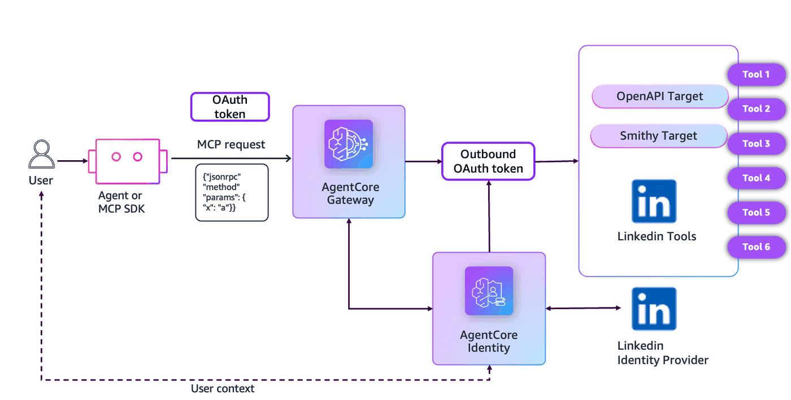
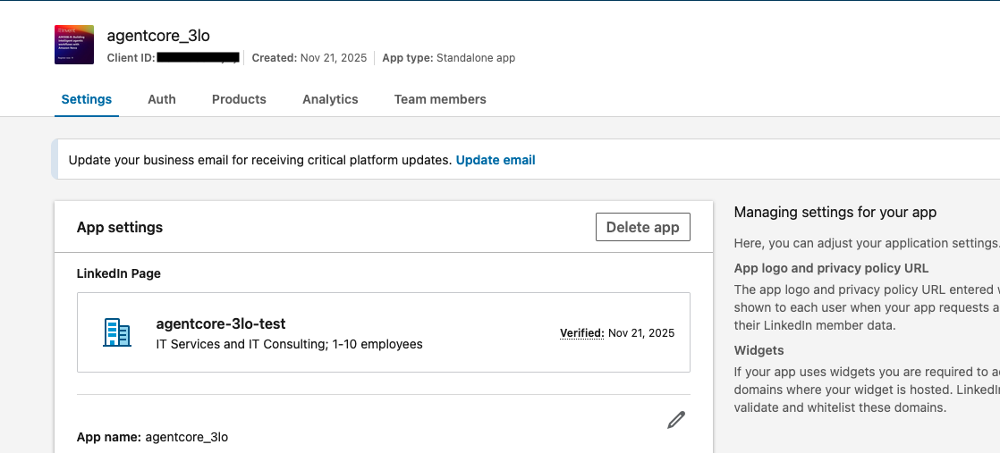
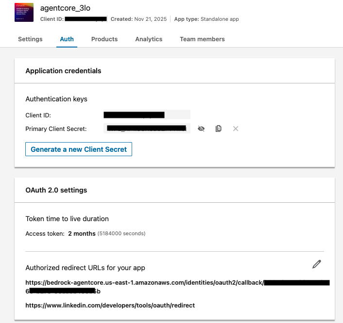
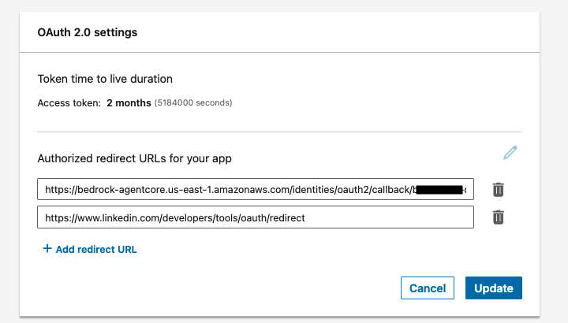
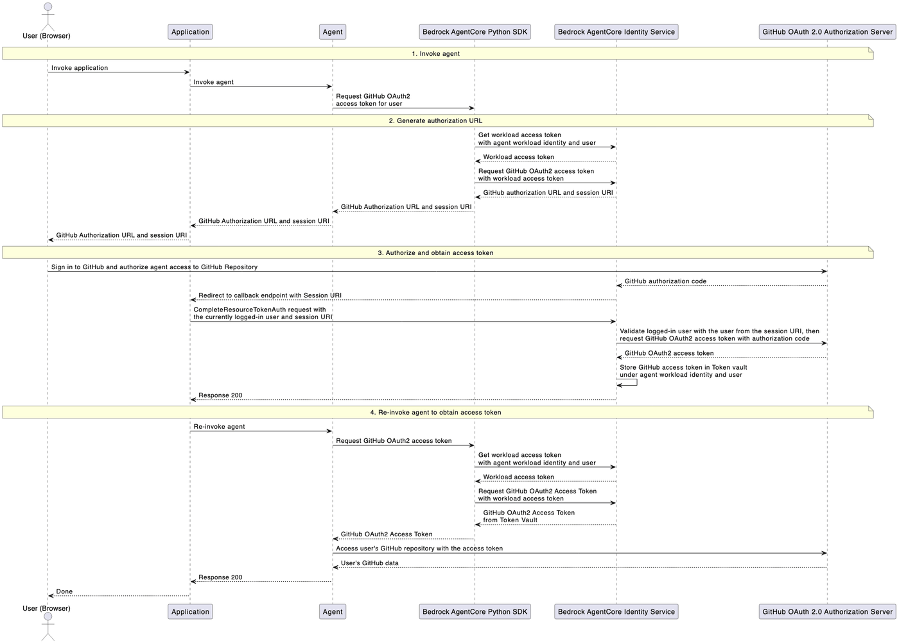
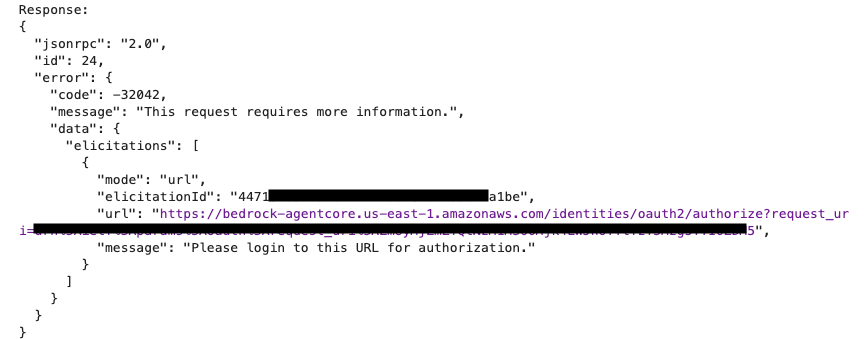

# Use Authorization code grant type outbound oAuth flow for AgentCore Gateway Targets

## Overview
Outbound authentication/authorization lets Amazon Bedrock AgentCore gateways securely access gateway targets on behalf of users that were authenticated and authorized during inbound authorization. AgentCore Gateway supports multiple types of outbound authorization such as No authorization, IAM-based outbound authorization, OAuth and API key.

You can use the following types of OAuth authorization grants:
* **Client credentials grant** – Machine-to-machine authentication (also known as 2-legged OAuth). The client application access resources on the application's behalf, rather than on behalf of the user.
* **Authorization code grant (New)** – User-delegated access (also known as 3-legged OAuth). The user provides consent for the client application to access resources on behalf of the user.

With **version 2025-11-25** of Model Context Protocol (MCP) specification, MCP supports [URL Mode Elicitation](https://blog.modelcontextprotocol.io/posts/2025-11-25-first-mcp-anniversary/#url-mode-elicitation-secure-out-of-band-interactions). URL mode elicitation lets you send users to a proper OAuth flow (or any credential acquisition flow, for that matter) in their browser, where they can authenticate securely without your client ever seeing the entered credentials. The credentials are then directly managed by the server and the client only needs to worry about its own authorization flow to the server.

AgentCore gateway now supports **Authorization code grant** as Outbound Auth for gateways created with 2025-11-25 as supported MCP version. Authorization code grant is useful when accessing tools on behalf of a user such as Google (email, calendar etc.), Github (repositories, pull requests etc.), Linkedin (user profile, posts etc.) OR internal tools. Authorization code grant flow prioritizes user privacy by not exposing user credentials to third-party applications.

In this tutorial we will create an AgentCore Gateway with Linkedin tools as the target using Authorization code grant. The resulting AgentCore gateway can then be used to build agents that can automate actions Linkedin actions such as getting user info, reading/summarizing posts or even creating new posts etc. on user's behalf.


## Choosing the right authentication/authorization pattern
When designing your agent authentication/authorization strategy, consider these factors to determine which pattern is most appropriate:

| **Factor** | **OAuth 2.0 authorization code grant (User-delegated access)** | **OAuth 2.0 client credentials grant (Machine-to-machine authentication)** |
|------------|----------------------------------------------------------------|-----------------------------------------------------------------------------|
| **Data ownership** | User-specific data (emails, documents, personal calendars) | System or organization-owned data (analytics, logs, shared resources) |
| **User interaction** | User is present and can provide consent | No user interaction required or available |
| **Operation timing** | Interactive, real-time operations | Background, scheduled, or batch operations |
| **Permission scope** | Permissions vary by user and their consent choices | Consistent permissions defined at the agent level |

## Key characteristics of authorization code grant

* Requires explicit user consent through an authorization prompt
* Provides access to user-specific data and resources
* Maintains clear separation between agent identity and user authorization
* Supports fine-grained scopes that limit what data the agent can access

### Tutorial Architecture

<div style="text-align:center">
    
</div>


### Tutorial Details

| Information         | Details                                                                  |
|:--------------------|:-------------------------------------------------------------------------|
| Tutorial type       | Interactive                                                              |
| Agent type          | MCP Client                                                               |
| Agentic Framework   | MCP SDK                                                                  |
| LLM model           | N/A                                                                      |
| Tutorial components | AgentCore Gateway with Linkedin target (using OAuth 2.0 authorization code grant)                 |
| Tutorial vertical   | Cross-vertical                                                           |
| Example complexity  | Medium                                                                   |
| SDK used            | Amazon BedrockAgentCore Python SDK and Boto3                             |
| Credential Provider | Type : OAuth2 - Linkedin Provider                                          |

## Prerequisites

To execute this tutorial you will need:
* Python 3.10+
* AWS credentials
* UV

```python
# Install from the requirements file in current directory
!uv pip install --system --force-reinstall --no-cache-dir -r requirements.txt --quiet
```

```python
# Import required libraries and generate a unique timestamp for naming resources.

import boto3
import json
import time
import os
import sys
import requests
from botocore.exceptions import ClientError
from datetime import datetime

print("✓ Libraries imported")

# Generate timestamp for unique naming
timestamp = datetime.now().strftime("%Y%m%d-%H%M%S")
print(f"Using timestamp: {timestamp}")

REGION = os.environ["AWS_REGION"]

gateway_target_name = f"mcp-target-{timestamp}"
```

```python
# Import Utilities and Configure Logging

# Get the directory of the current script
if "__file__" in globals():
    current_dir = os.path.dirname(os.path.abspath(__file__))
else:
    current_dir = os.getcwd()  # Fallback if __file__ is not defined (e.g., Jupyter)

# Navigate to the directory containing utils.py (one level up)
utils_dir = os.path.abspath(os.path.join(current_dir, ".."))

# Add to sys.path
sys.path.insert(0, utils_dir)

# Now import utils
import utils

# Setup logging
import logging

logging.basicConfig(
    level=logging.INFO,
    format="%(asctime)s | %(levelname)s | %(name)s | %(message)s",
    handlers=[logging.StreamHandler()],
)

logging.getLogger("strands").setLevel(logging.INFO)

print("✓ Logging configured, utils imported")
```

##  Configure Inbound Auth with Amazon Cognito as the IDP

Lets provision a Cognito Userpool with an App client. We'll use Amazon Cognito to provide JWT tokens for accessing our deployed MCP server.

```python
USER_POOL_NAME = f"agentcore-gateway-authcode-pool-{timestamp}"
RESOURCE_SERVER_ID = f"agentcore-gateway-authcode-id-{timestamp}"
RESOURCE_SERVER_NAME = f"agentcore-gateway-authcode-name-{timestamp}"
CLIENT_NAME = f"agentcore-gateway-authcode-client-{timestamp}"

# Scopes are based on the current gateway_target_name for THIS run
SCOPES = [
    # Full access to MCP target
    {
        "ScopeName": gateway_target_name,
        "ScopeDescription": "Full access to all tools in MCP target",
    }
]

# Full scope strings in Cognito format: "<resource-server-id>/<scope-name>"
scope_names = [f"{RESOURCE_SERVER_ID}/{scope['ScopeName']}" for scope in SCOPES]
scopeString = " ".join(scope_names)

cognito = boto3.client("cognito-idp", region_name=REGION)

print("Creating or retrieving Cognito resources...")
gw_user_pool_id = utils.get_or_create_user_pool(cognito, USER_POOL_NAME)
print(f"User Pool ID: {gw_user_pool_id}")

utils.get_or_create_resource_server(cognito, gw_user_pool_id, RESOURCE_SERVER_ID, RESOURCE_SERVER_NAME, SCOPES)
print("Resource server ensured.")

gw_client_id, gw_client_secret = utils.get_or_create_m2m_client(
    cognito, gw_user_pool_id, CLIENT_NAME, RESOURCE_SERVER_ID, scope_names
)
print(f"Client ID: {gw_client_id}")

# Discovery URL used later by the Gateway authorizer and utils.get_token
gw_cognito_discovery_url = (
    f"https://cognito-idp.{REGION}.amazonaws.com/{gw_user_pool_id}/.well-known/openid-configuration"
)
print(gw_cognito_discovery_url)
```

## Configure Linkedin as credential provider for Outbound OAuth2

### Step1: Obtain LinkedIn Client Id and Client Secret

We will use LinkedIn APIs to test Auth code grant flow. You will first need to get LinkedIn ClientId and ClientSecret, so that you can obtain access token to hit LinkedIn APIs. To obtain that:

* Go to https://developer.linkedin.com/
* Click on create app, and add some app name
* You will need to create a LinkedIn page as a compulsory step. When you click on For Business, you will get an option to create some page. Create any dummy page. 
* Once you create an App, you will see it in My Apps section of developer portal
* In the Auth section of your App, you will find clientId and clientSecret which you can use to obtain access tokens. 
* In the Products section of your App, you need to enable which APIs are accessible, Click on “Request Access” for “Sign In with LinkedIn using OpenID Connect”
* This will enable API to obtain user profile informaiton.

<div style="text-align:center">
    
</div>

<div style="text-align:center">
    
</div>

Note: There is also a section called Oauth 2.0 settings, under which you need to provide Authorized Redirect URLs, we will come back to this section after creating credential provider in the next step.

### Step 2: Create Linkedin Credential provider with AgentCore Identity
Amazon Bedrock AgentCore Identity provides managed OAuth 2.0 supported providers for both inbound and outbound authentication. Each provider encapsulates the specific authentication protocols, endpoint configurations, and credential formats required for a particular service or identity system. The service provides built-in providers for popular services including Google, GitHub, Slack, and Salesforce with authorization server endpoints and provider-specific parameters pre-configured to reduce development effort. The providers abstract away the complexity of different OAuth 2.0 implementations, API authentication schemes, and token formats, presenting a unified interface to agents while handling the underlying protocol variations and edge cases.

For this tutorial, we will create a credential provider using Linkedin as a built-in provider.

**Please input the Linkedin Client Id and Client Secret as noted down earlier.**

```python
target_client_id = "<clientid>"  # replace this with client id from https://developer.linkedin.com/
target_client_secret = "<clientsecret>"  # replace this with client secret from https://developer.linkedin.com/

target_cred_provider_name = f"ac-gateway-mcp-server-identity-authcode-{timestamp}"

identity_client = boto3.client("bedrock-agentcore-control", region_name=REGION)

print(f"Deleting the credential provider with name {target_cred_provider_name} if it exists already")
try:
    delete_resp = identity_client.delete_oauth2_credential_provider(name=target_cred_provider_name)
    print("Existing credential provider found and deleted. Proceeding with re-creation")
except ClientError as e:
    if e.response["Error"]["Code"] == "ResourceNotFound":
        print("Existing credential provider with same name does not exist. Proceeding with creation")
    else:
        raise Exception(f"Credential provider deletion failed: {e.response['Error']['Message']}")

linkedin_cred_provider = identity_client.create_oauth2_credential_provider(
    name=target_cred_provider_name,
    credentialProviderVendor="LinkedinOauth2",
    oauth2ProviderConfigInput={
        "linkedinOauth2ProviderConfig": {
            "clientId": target_client_id,
            "clientSecret": target_client_secret,
        }
    },
)

target_cred_provider_arn = linkedin_cred_provider["credentialProviderArn"]
target_callback_url = linkedin_cred_provider["callbackUrl"]
print("Outbound OAuth2 Credential Provider ARN:", target_cred_provider_arn)
print("Please register the following callback URL with linkedin ", target_callback_url)
```

### Step 3: Register the callback URL with linkedin
Register the callback URL received as output from earlier cell; on the Linkedin App.

<div style="text-align:center">
    
</div>

## Create AgentCore gateway with Cognito as inbound auth
Let us create an AgentCore Gateway with Cognito as the inbound Auth provider

```python
def create_gateway_with_authcode():
    iam_client = boto3.client("iam", region_name=REGION)
    gateway_client = boto3.client("bedrock-agentcore-control", region_name=REGION)

    role_name = f"BedrockAgentCoreGatewayRole-{timestamp}"
    gateway_name = f"gateway-authcode-{timestamp}"

    # Create IAM role for Gateway
    trust_policy = {
        "Version": "2012-10-17",
        "Statement": [
            {
                "Effect": "Allow",
                "Principal": {"Service": "bedrock-agentcore.amazonaws.com"},
                "Action": "sts:AssumeRole",
            }
        ],
    }

    try:
        iam_response = iam_client.create_role(
            RoleName=role_name,
            AssumeRolePolicyDocument=json.dumps(trust_policy),
            Description="IAM role for Bedrock Agent Core Gateway with 3LO",
        )

        role_arn = iam_response["Role"]["Arn"]
        print(f"Gateway IAM role created: {role_arn}")

        # Attach admin policy to the role
        iam_client.attach_role_policy(RoleName=role_name, PolicyArn="arn:aws:iam::aws:policy/AdministratorAccess")
        print("Admin policy attached to Gateway IAM role")
    except ClientError as e:
        if e.response["Error"]["Code"] == "EntityAlreadyExists":
            iam_response = iam_client.get_role(RoleName=role_name)
            role_arn = iam_response["Role"]["Arn"]
            print(f"IAM role already exists with Arn: {role_arn}. Using the same")
        else:
            raise Exception(f"IAM Role creation failed: {e.response['Error']['Message']}")

    print("Creating gateway with Auth Code grant...")
    gateway_response = gateway_client.create_gateway(
        name=gateway_name,
        protocolType="MCP",
        protocolConfiguration={
            "mcp": {
                "supportedVersions": ["2025-03-26", "2025-11-25"],
                "searchType": "SEMANTIC",
            }
        },
        authorizerType="CUSTOM_JWT",
        authorizerConfiguration={
            "customJWTAuthorizer": {
                "discoveryUrl": gw_cognito_discovery_url,
                "allowedClients": [gw_client_id],
            }
        },
        roleArn=role_arn,
    )

    print("Gateway create response:", gateway_response)

    gateway_id = gateway_response["gatewayId"]
    gateway_url = gateway_response["gatewayUrl"]
    print(f"Gateway with Auth code grant created: {gateway_id}")

    # Wait for gateway to be ready
    print("Waiting for gateway to be ready...")
    while True:
        status_response = gateway_client.get_gateway(gatewayIdentifier=gateway_id)

        current_status = status_response["status"]
        print(f"Gateway status: {current_status}")
        if current_status == "READY":
            print(f"Final gateway details: {status_response}")
            break

        time.sleep(10)

    print("Gateway is now ready")
    return gateway_id, gateway_url, role_name


gateway_id, gateway_url, gateway_role_name = create_gateway_with_authcode()
print(f"\n✅ Gateway creation completed: Gateway Id {gateway_id}")
print(f"Gateway Url: {gateway_url}")
```

## Create a target with AgentCore gateway
We will use a Linkedin OpenAPI spec containing the tool for **/userInfo** and create the target with AgentCore Gateway.

```python
linkedin_openapi_spec = {
    "openapi": "3.0.0",
    "info": {"title": "LinkedIn UserInfo API", "version": "2.0.0"},
    "servers": [{"url": "https://api.linkedin.com/v2"}],
    "paths": {
        "/userinfo": {
            "get": {
                "operationId": "getUserInfo",
                "summary": "Get User Information",
                "security": [{"BearerAuth": []}],
                "responses": {
                    "200": {
                        "description": "Successful response",
                        "content": {
                            "application/json": {
                                "schema": {"$ref": "#/components/schemas/UserInfo"},
                                "example": {
                                    "sub": "782bbtaQ",
                                    "name": "John Doe",
                                    "given_name": "John",
                                    "family_name": "Doe",
                                    "picture": "https://media.licdn-ei.com/dms/image/C5F03AQHqK8v7tB1HCQ/profile-displayphoto-shrink_100_100/0/",
                                    "locale": "en-US",
                                    "email": "doe@email.com",
                                    "email_verified": True,
                                },
                            }
                        },
                    }
                },
            }
        }
    },
    "components": {
        "schemas": {
            "UserInfo": {
                "type": "object",
                "properties": {
                    "sub": {"type": "string"},
                    "name": {"type": "string"},
                    "given_name": {"type": "string"},
                    "family_name": {"type": "string"},
                    "picture": {"type": "string"},
                    "locale": {"type": "string"},
                    "email": {"type": "string"},
                    "email_verified": {"type": "boolean"},
                },
            }
        },
        "securitySchemes": {"BearerAuth": {"type": "http", "scheme": "bearer"}},
    },
}
```

```python
DEFAULT_RETURN_URL = (
    "http://localhost:3021"  # using some dummy URL as default. We will override when making JSON RPC calls
)


def create_linkedin_target(gatewayId, provider_arn):
    gateway_client = boto3.client("bedrock-agentcore-control", region_name=REGION)
    credentialProviderConfig = {
        "credentialProviderType": "OAUTH",
        "credentialProvider": {
            "oauthCredentialProvider": {
                "providerArn": provider_arn,
                "grantType": "AUTHORIZATION_CODE",
                "defaultReturnUrl": DEFAULT_RETURN_URL,
                "scopes": ["openid", "profile", "email"],
            }
        },
    }
    target_config = {"mcp": {"openApiSchema": {"inlinePayload": json.dumps(linkedin_openapi_spec)}}}
    try:
        response = gateway_client.create_gateway_target(
            name="LinkedInAuthCode",
            description="Target created for testing",
            credentialProviderConfigurations=[credentialProviderConfig],
            targetConfiguration=target_config,
            gatewayIdentifier=gatewayId,
        )
        targetId = response["targetId"]
        print(f"Created Linkedin target {targetId} for gateway {gatewayId}")
        return targetId
    except Exception as e:
        print(e)


gateway_target_id = create_linkedin_target(gatewayId=gateway_id, provider_arn=target_cred_provider_arn)
```

## OAuth2 Authorization URL Session Binding Process

Now that the gateway has been created, let us understand the session binding process before moving any further.

The OAuth2 authorization URL session binding process is a critical security mechanism that ensures OAuth2 authorization sessions are properly associated with authenticated users in AgentCore Identity. This process prevents session hijacking and ensures that OAuth tokens are only granted to the intended user.

Ref : https://docs.aws.amazon.com/bedrock-agentcore/latest/devguide/oauth2-authorization-url-session-binding.html

### How session binding works
<div style="text-align:center">
    
</div>

1. Invoke agent – Your agent code or mcp client invokes GetResourceOauth2Token API to retrieve an authorization URL, when an originating agent user wants to access some application or resource that he/she owns.

2. Generate authorization URL – AgentCore Identity generates an authorization URL and session URI for the user to navigate to and consent access.

3. Authorize and obtain access token – The user navigates to the authorization URL and grants consent for your agent to access his/her resource. After that, AgentCore Identity redirects the user's browser to your HTTPS application endpoint with information containing the originating user of the authorization request. At this point, your HTTPS application endpoint determines if the originating agent user is still the same as the currently logged in user of your application. If they match, your application endpoint invokes CompleteResourceTokenAuth so that AgentCore Identity can fetch and store the access token.

4. Re-invoke agent to obtain access token – Once the application returns a valid response, your agent application will be able to retrieve the OAuth2.0 access tokens that were originally requested for the user. If the users do not match, your application simply does nothing or logs the attempt.

By allowing your application endpoint to verify the user identity, AgentCore Identity allows your agent application to ensure that it is always the same user who initiated the authorization request and the one who consented access.

### Environment-Aware OAuth2 Callback Server

This tutorial uses an environment-aware `oauth2_callback_server.py` that automatically adapts to different execution environments:

#### **Local Development:**
- **External Callback URL**: `http://localhost:9090/oauth2/callback` (browser-accessible)
- **Internal Communication**: `http://localhost:9090` (notebook ↔ server)
- **Server Binding**: `127.0.0.1` (localhost only, secure)

#### **SageMaker Workshop Studio:**
- **External Callback URL**: `https://<domain>.studio.<region>.sagemaker.aws/proxy/9090/oauth2/callback` (browser-accessible via proxy)
- **Internal Communication**: `http://localhost:9090` (notebook ↔ server in same container)
- **Server Binding**: `0.0.0.0` (allows SageMaker proxy to reach server)

The OAuth2 callback server automatically detects the environment by checking for `/opt/ml/metadata/resource-metadata.json` and configures itself accordingly.

### Features of oauth2_callback_server.py

1. **Runs a Local FastAPI Server** (port 9090)
   - Provides `/ping` endpoint for health checks
   - Provides `/userIdentifier/token` endpoint to store user tokens
   - Provides `/oauth2/callback` endpoint to handle OAuth redirects

2. **Manages User Token Storage**
   - Stores the user's JWT token from Cognito authentication
   - Associates OAuth sessions with the correct user identity

3. **Handles OAuth Callback Processing**
   - Receives OAuth redirects with `session_id` parameter
   - Calls `CompleteResourceTokenAuth` to bind the session
   - Validates user identity before completing the flow

4. **Provides Session Security**
   - Ensures OAuth sessions are bound to authenticated users
   - Prevents unauthorized access to OAuth tokens

5. **Environment Detection**
   - Automatically detects local vs SageMaker Studio environment
   - Configures URLs and server binding appropriately

### Security Considerations

The OAuth2 session binding process includes several security measures:
- **URL Validation**: Only pre-registered callback URLs are allowed
- **Session Verification**: User sessions must be validated before token completion
- **User Identity Binding**: OAuth sessions are explicitly bound to authenticated users
- **Token Isolation**: Each user's OAuth tokens are isolated and secure
- **Environment-Aware URLs**: Automatically uses appropriate URLs for each environment

This comprehensive approach ensures that OAuth2 flows are secure and properly attributed to the correct users in multi-user environments, whether running locally or in SageMaker Workshop Studio.

---

```python
# Helper function to make MCP calls
def invoke_mcp(
    gatewayUrl,
    access_token,
    tool_params,
    method="tools/call",
    protocol_version="2025-11-25",
):
    headers = {
        "Content-Type": "application/json",
        "Authorization": f"Bearer {access_token}",
        "MCP-Protocol-Version": protocol_version,
    }

    payload = {"jsonrpc": "2.0", "id": 24, "method": method, "params": tool_params}

    try:
        response = requests.post(gatewayUrl, headers=headers, json=payload)
        request_id = response.headers.get("x-amzn-requestid") or response.headers.get("x-amz-request-id")
        print("\nAmazon Request ID:", request_id)
        response.raise_for_status()
        print(f"Invoke MCP Status Code: {response.status_code}")
        print("Response:")
        # if method != "tools/list":
        print(json.dumps(response.json(), indent=2))
        return response.json()

    except requests.exceptions.RequestException as e:
        print("Error:", e)
        if hasattr(e, "response") and e.response is not None:
            try:
                print("Error Response:", json.dumps(e.response.json(), indent=2))
            except:
                print("Error Response Text:", e.response.text)
        raise
```

## Test with MCP Client
We will now test the AgentCore gateway with MCP Client. We will start with **forceAuthentication = True** metadata to ensure that we can test the user consent flow. If this is first time you are running this step, the behaviour would be same even with **forceAuthentication = False**.

It will return an Elicitation Response; which suggests to provide the user consent by opening the URL.

Once done, the callback server will take care of the sesion binding with AgentCore identity.

<div style="text-align:center">
    
</div>

```python
import subprocess
from oauth2_callback_server import (
    store_token_in_oauth2_callback_server,
    wait_for_oauth2_server_to_be_ready,
    get_oauth2_callback_base_url,
)

full_scope = f"{RESOURCE_SERVER_ID}/{gateway_target_name}"
jwt_token = utils.get_token(
    user_pool_id=gw_user_pool_id,
    client_id=gw_client_id,
    client_secret=gw_client_secret,
    scope_string=full_scope,
    REGION=REGION,
)
bearer_token = jwt_token["access_token"]

# Starting oAuth callback server
oauth2_callback_server_cmd = [
    sys.executable,
    "oauth2_callback_server.py",
    "--region",
    REGION,
]
oauth2_callback_server_process = subprocess.Popen(oauth2_callback_server_cmd)

successfully_started_oauth2_server = wait_for_oauth2_server_to_be_ready()
if not successfully_started_oauth2_server:
    print(
        "Failed to start OAuth2 callback server to handle session binding "
        "(https://docs.aws.amazon.com/bedrock-agentcore/latest/devguide/oauth2-authorization-url-session-binding.html)"
    )
else:
    store_token_in_oauth2_callback_server(bearer_token)

    # Test invoke tool
    CUSTOM_RETURN_URL = get_oauth2_callback_base_url() + "/oauth2/callback"
    print(f"Using callback URL: {CUSTOM_RETURN_URL}")

    _meta = {
        "aws.bedrock-agentcore.gateway/credentialProviderConfiguration": {
            "oauthCredentialProvider": {
                "returnUrl": CUSTOM_RETURN_URL,
                "forceAuthentication": True,
            }
        }
    }

    print("\nTesting force re-authentication")
    resp = invoke_mcp(
        gatewayUrl=gateway_url,
        access_token=bearer_token,
        tool_params={
            "name": "LinkedInAuthCode___getUserInfo",
            "arguments": {"domainName": "integrals-dev-ed"},
            "_meta": _meta,
        },
        method="tools/call",
    )
```

```python
# Invoking tool again after completion of oAuth flow
_meta = {
    "aws.bedrock-agentcore.gateway/credentialProviderConfiguration": {
        "oauthCredentialProvider": {
            "returnUrl": CUSTOM_RETURN_URL,
            "forceAuthentication": False,
        }
    }
}
print("Invoking tool again after completion of oAuth flow")
resp = invoke_mcp(
    gatewayUrl=gateway_url,
    access_token=bearer_token,
    tool_params={
        "name": "LinkedInAuthCode___getUserInfo",
        "arguments": {"domainName": "integrals-dev-ed"},
        "_meta": _meta,
    },
    method="tools/call",
)
```

```python
oauth2_callback_server_process.terminate()
```

## Resource Cleanup

Execute the following cell to remove all resources created during this tutorial:

1. AgentCore Gateway and targets
2. AgentCore Identity credential provider
3. Amazon Cognito User Pool and clients
4. IAM Role

```python
# Delete AgentCore Gateway and all targets
print("Step 1: Cleaning up AgentCore Gateway resources...")
gateway_client = boto3.client("bedrock-agentcore-control", region_name=REGION)
agentcore_cleanup = utils.delete_gateway(gateway_client=gateway_client, gatewayId=gateway_id)

# Delete AgentCore Identity Credential Provider
print("\nStep 2: Cleaning up AgentCore Identity Credential Provider...")
credential_cleanup = identity_client.delete_oauth2_credential_provider(name=target_cred_provider_name)

# Delete Cognito User Pool
print("\nStep 3: Cleaning up Cognito User Pool...")
cognito_cleanup = utils.delete_cognito_user_pool(user_pool_id=gw_user_pool_id, region=REGION)

# Delete IAM Role
print("\nStep 4: Cleaning up IAM Role...")
iam_cleanup = utils.delete_iam_role(role_name=f"BedrockAgentCoreGatewayRole-{timestamp}")
```

## Summary
You have successfully tested the newly launched authorization code grant based outbound oAuth flow with AgentCore Gateway using a Linkedin tool as the target
