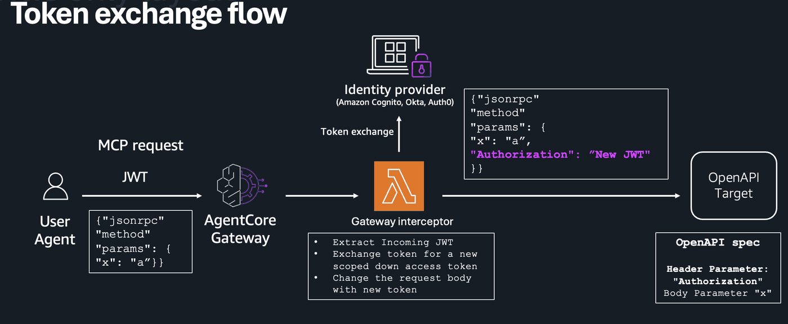

# AgentCore Gateway with Cognito 2LO Auth, OpenAPI Target, and Strands Integration

## Overview

Modern AI agent systems require secure authentication and authorization patterns when accessing downstream APIs through MCP servers. This tutorial demonstrates a comprehensive solution using AgentCore Gateway with Cognito OAuth2 client credentials flow (2LO) for inbound authentication and outbound API calls.

The core challenge addressed is secure token exchange and identity propagation in multi-hop workflows where agents call tools that subsequently call downstream APIs. Organizations need to exchange tokens to send scoped-down tokens and least-privilege credentials to downstream APIs from MCP servers. This requires extracting principal identity and metadata from inbound JWT tokens, performing fine-grained access control based on caller credentials, and dynamically exchanging tokens to obtain appropriately scoped credentials for specific downstream API calls.

This solution enables secure act-on-behalf patterns where each hop gets separate scoped tokens, JWT-based execution context propagation that maintains user identity throughout the workflow, tenant isolation for proper data separation, clear audit trails for compliance, and decoupled security that keeps MCP schema intact while handling authentication separately.

### Tutorial Details

| Information          | Details                                                   |
|:---------------------|:----------------------------------------------------------|
| Tutorial type        | Interactive                                               |
| AgentCore components | AgentCore Gateway                                         |
| Gateway Target type  | OpenAPI                                                   |
| Inbound Auth         | Cognito OAuth2 (Client Credentials)                       |
| Outbound Auth        | Cognito OAuth2 (Client Credentials)                       |
| Tutorial components  | Creating AgentCore Gateway and Invoking AgentCore Gateway |
| Tutorial vertical    | Cross-vertical                                            |
| Example complexity   | Intermediate                                              |
| SDK used             | boto3, strands-agents                                     |

### Tutorial Architecture



---

The architecture demonstrates:

1. **Client**: Initiates requests with Cognito OAuth2 tokens
2. **AgentCore Gateway**: Routes client requests through interceptor for token exchange
3. **Gateway Interceptor**: Performs token validation and exchange for downstream credentials
4. **OpenAPI Target**: Receives processed requests with Cognito OAuth2 tokens
5. **Strands Agent**: Demonstrates integration with the authenticated gateway

This notebook creates:
- AgentCore Gateway with Cognito 2LO authentication
- OpenAPI target with API key outbound authentication
- Strands agent integration with streamable HTTP transport
- All resources with timestamp for multiple runs

## Step 1: Install Required Packages

```python
# Install required packages
!pip install --upgrade pip
!pip install boto3 requests
!pip install strands-agents
```

```python
import boto3
import json
import time
from datetime import datetime
import requests
from botocore.exceptions import ClientError

# Generate timestamp for unique resource names
timestamp = datetime.now().strftime("%Y%m%d%H%M%S")
print(f"Timestamp: {timestamp}")

# Initialize AWS clients
session = boto3.Session()
region = session.region_name or "us-east-1"
print(f"Region: {region}")

cognito_client = boto3.client("cognito-idp", region_name=region)
agentcore_client = boto3.client("bedrock-agentcore-control", region_name=region)
iam_client = boto3.client("iam", region_name=region)
```

## Step 2: Create Cognito Resource Server and App Client

```python
# Create Cognito User Pool
user_pool_name = f"agentcore-pool-{timestamp}"

user_pool_response = cognito_client.create_user_pool(
    PoolName=user_pool_name,
    Policies={
        "PasswordPolicy": {
            "MinimumLength": 8,
            "RequireUppercase": False,
            "RequireLowercase": False,
            "RequireNumbers": False,
            "RequireSymbols": False,
        }
    },
)

user_pool_id = user_pool_response["UserPool"]["Id"]
print(f"User Pool ID: {user_pool_id}")

# Check and upgrade User Pool to Essentials tier for V3_0 support
try:
    pool_details = cognito_client.describe_user_pool(UserPoolId=user_pool_id)
    current_tier = pool_details["UserPool"].get("UserPoolTier", "Lite")
    print(f"Current User Pool tier: {current_tier}")

    if current_tier == "Lite":
        print("Upgrading User Pool to Essentials tier for V3_0 Pre Token Generation support...")
        cognito_client.update_user_pool(UserPoolId=user_pool_id, UserPoolTier="Essentials")
        print("User Pool upgraded to Essentials tier")
    else:
        print(f"User Pool is already on {current_tier} tier - V3_0 support available")
except Exception as e:
    print(f"Note: Could not check/upgrade User Pool tier: {e}")
    print("Please ensure User Pool is on Essentials or Plus tier for V3_0 Pre Token Generation")
```

## Step 3: Create Pre Token Generation Lambda Trigger

```python
# Create IAM role for Pre Token Generation Lambda
token_lambda_role_name = f"PreTokenLambdaRole-{timestamp}"

token_lambda_trust_policy = {
    "Version": "2012-10-17",
    "Statement": [
        {
            "Effect": "Allow",
            "Principal": {"Service": "lambda.amazonaws.com"},
            "Action": "sts:AssumeRole",
        }
    ],
}

token_lambda_role_response = iam_client.create_role(
    RoleName=token_lambda_role_name,
    AssumeRolePolicyDocument=json.dumps(token_lambda_trust_policy),
    Description="IAM role for Pre Token Generation Lambda",
)

# Attach basic lambda execution policy
iam_client.attach_role_policy(
    RoleName=token_lambda_role_name,
    PolicyArn="arn:aws:iam::aws:policy/service-role/AWSLambdaBasicExecutionRole",
)

token_lambda_role_arn = token_lambda_role_response["Role"]["Arn"]
print(f"Pre Token Lambda IAM role created: {token_lambda_role_arn}")

# Wait for role to be available
time.sleep(10)
```

```python
# Pre Token Generation Lambda function code
import zipfile
import io

token_lambda_code = """
import json
import boto3
import logging

logger = logging.getLogger()
logger.setLevel(logging.INFO)

def lambda_handler(event, context):
    logger.info("DEBUG - Pre Token Generation Lambda triggered")
    logger.info(f"DEBUG - Event: {json.dumps(event, default=str)}")
    logger.info(f"DEBUG - Trigger Source: {event.get('triggerSource', 'Unknown')}")
    
    # V3_0 format for both ID and access token customization
    event['response']['claimsAndScopeOverrideDetails'] = {
        'idTokenGeneration': {
            'claimsToAddOrOverride': {
                'custom:role': 'agentcore_user',
                'custom:permissions': 'read,write',
                'custom:tenant': 'default',
                'custom:api_access': 'enabled'
            },
            'claimsToSuppress': []
        },
        'accessTokenGeneration': {
            'claimsToAddOrOverride': {
                'custom:role': 'agentcore_user',
                'custom:permissions': 'read,write',
                'custom:tenant': 'default',
                'custom:api_access': 'enabled'
            },
            'claimsToSuppress': [],
            'scopesToAdd': [],
            'scopesToSuppress': []
        }
    }
    
    logger.info("DEBUG - Custom claims added to both ID and access tokens")
    logger.info(f"DEBUG - Response: {json.dumps(event['response'], default=str)}")
    
    return event
"""

# Create ZIP file for Pre Token Lambda
token_zip_buffer = io.BytesIO()
with zipfile.ZipFile(token_zip_buffer, "w", zipfile.ZIP_DEFLATED) as zip_file:
    zip_file.writestr("lambda_function.py", token_lambda_code)

token_zip_buffer.seek(0)

# Create Pre Token Generation Lambda function
token_lambda_function_name = f"pre-token-generation-{timestamp}"

lambda_client = boto3.client("lambda", region_name=region)
token_lambda_response = lambda_client.create_function(
    FunctionName=token_lambda_function_name,
    Runtime="python3.13",
    Role=token_lambda_role_arn,
    Handler="lambda_function.lambda_handler",
    Code={"ZipFile": token_zip_buffer.read()},
    Description="Pre Token Generation Lambda for Cognito User Pool",
)

token_lambda_arn = token_lambda_response["FunctionArn"]
print(f"Pre Token Generation Lambda created: {token_lambda_arn}")

# Add Lambda permission for Cognito to invoke
sts_client = boto3.client("sts", region_name=region)
account_id = sts_client.get_caller_identity()["Account"]

lambda_client.add_permission(
    FunctionName=token_lambda_function_name,
    StatementId="cognito-trigger-permission",
    Action="lambda:InvokeFunction",
    Principal="cognito-idp.amazonaws.com",
    SourceArn=f"arn:aws:cognito-idp:{region}:{account_id}:userpool/{user_pool_id}",
)

print("Lambda permission added for Cognito trigger")
```

```python
# Update User Pool with Pre Token Generation trigger
cognito_client.update_user_pool(
    UserPoolId=user_pool_id,
    LambdaConfig={
        "PreTokenGeneration": token_lambda_arn,
        "PreTokenGenerationConfig": {
            "LambdaVersion": "V3_0",
            "LambdaArn": token_lambda_arn,
        },
    },
)

print("User Pool updated with Pre Token Generation trigger")
print("Custom claims will be added: role, permissions, tenant, api_access")
print("NOTE: Pre Token Generation Lambda only triggers for user authentication flows, NOT client_credentials flow")
print("For client_credentials flow, scopes are granted directly without Lambda trigger")
```

```python
# Create Resource Server for 2LO
resource_server_response = cognito_client.create_resource_server(
    UserPoolId=user_pool_id,
    Identifier=f"agentcore-api-{timestamp}",
    Name=f"AgentCore API {timestamp}",
    Scopes=[
        {"ScopeName": "read", "ScopeDescription": "Read access to AgentCore Gateway"},
        {"ScopeName": "write", "ScopeDescription": "Write access to AgentCore Gateway"},
    ],
)

resource_server_id = resource_server_response["ResourceServer"]["Identifier"]
print(f"Resource Server ID: {resource_server_id}")
```

```python
# Create App Client for 2LO (Client Credentials)
app_client_response = cognito_client.create_user_pool_client(
    UserPoolId=user_pool_id,
    ClientName=f"agentcore-client-{timestamp}",
    GenerateSecret=True,
    AllowedOAuthFlows=["client_credentials"],
    AllowedOAuthFlowsUserPoolClient=True,
    AllowedOAuthScopes=[f"{resource_server_id}/read", f"{resource_server_id}/write"],
    SupportedIdentityProviders=["COGNITO"],
)

client_id = app_client_response["UserPoolClient"]["ClientId"]
print(f"Client ID: {client_id}")
```

```python
# Get client secret
client_details = cognito_client.describe_user_pool_client(UserPoolId=user_pool_id, ClientId=client_id)

client_secret = client_details["UserPoolClient"]["ClientSecret"]
print(f"Client Secret: {client_secret[:10]}...")
```

```python
# Create User Pool Domain
domain_name = f"agentcore-{timestamp}"

try:
    domain_response = cognito_client.create_user_pool_domain(Domain=domain_name, UserPoolId=user_pool_id)
    print(f"Domain created: {domain_name}")
except ClientError as e:
    if "Domain already exists" in str(e):
        print(f"Domain {domain_name} already exists, continuing...")
    else:
        raise e

# Set cognito_domain for Lambda environment (full domain URL)
cognito_domain = f"{domain_name}.auth.{region}.amazoncognito.com"

# Construct token endpoint
token_endpoint = f"https://{domain_name}.auth.{region}.amazoncognito.com/oauth2/token"
print(f"Token Endpoint: {token_endpoint}")
```

## Step 4: Create Gateway Interceptor Lambda Function

```python
import zipfile
import io

# Create IAM role for interceptor Lambda
interceptor_role_name = f"InterceptorLambdaRole-{timestamp}"

interceptor_trust_policy = {
    "Version": "2012-10-17",
    "Statement": [
        {
            "Effect": "Allow",
            "Principal": {"Service": "lambda.amazonaws.com"},
            "Action": "sts:AssumeRole",
        }
    ],
}

interceptor_role_response = iam_client.create_role(
    RoleName=interceptor_role_name,
    AssumeRolePolicyDocument=json.dumps(interceptor_trust_policy),
    Description="IAM role for Gateway Interceptor Lambda",
)

# Attach basic lambda execution policy
iam_client.attach_role_policy(
    RoleName=interceptor_role_name,
    PolicyArn="arn:aws:iam::aws:policy/service-role/AWSLambdaBasicExecutionRole",
)

interceptor_role_arn = interceptor_role_response["Role"]["Arn"]
print(f"Interceptor Lambda IAM role created: {interceptor_role_arn}")

# Wait for role to be available
time.sleep(10)
```

```python
# Lambda function code for gateway interceptor
interceptor_code = """
import json
import boto3
import logging
import os
import urllib3
import base64

logger = logging.getLogger()
logger.setLevel(logging.INFO)

def lambda_handler(event, context):
    logger.info(f"Interceptor received event: {json.dumps(event, default=str)}")
    # Extract the gateway request from the MCP structure
    mcp_data = event.get('mcp', {})
    gateway_request = mcp_data.get('gatewayRequest', {})
    headers = gateway_request.get('headers', {})
    body = gateway_request.get('body', {})
    
    logger.info(f"Headers: {headers}")
    logger.info(f"Body keys: {list(body.keys())}")
    
    # Extract authorization token for token exchange
    auth_header = headers.get('authorization', '') or headers.get('Authorization', '')
    logger.info(f"Auth header present: {bool(auth_header)}")
    logger.info(f"DEBUG - Incoming access token: {auth_header}")

    enhanced_token = auth_header
    
    # Call Cognito to get new token (triggers Pre Token Generation Lambda automatically)
    if auth_header:
        try:
            logger.info("Calling Cognito token endpoint for token exchange")
            
            # Get environment variables
            client_id = os.environ.get('CLIENT_ID')
            client_secret = os.environ.get('CLIENT_SECRET')
            cognito_domain = os.environ.get('COGNITO_DOMAIN')
            resource_server_id = os.environ.get('RESOURCE_SERVER_ID')
            
            if not all([client_id, client_secret, cognito_domain, resource_server_id]):
                logger.error("Missing required environment variables")
                return
            
            # Prepare token request
            http = urllib3.PoolManager()
            token_url = f"https://{cognito_domain}/oauth2/token"
            
            # Basic auth header
            auth_string = f"{client_id}:{client_secret}"
            auth_bytes = auth_string.encode('ascii')
            auth_b64 = base64.b64encode(auth_bytes).decode('ascii')
            
            headers = {
                'Authorization': f'Basic {auth_b64}',
                'Content-Type': 'application/x-www-form-urlencoded'
            }
            
            cognito_body = f"grant_type=client_credentials&scope={resource_server_id}/read {resource_server_id}/write"
            
            response = http.request('POST', token_url, headers=headers, body=cognito_body)
            
            if response.status == 200:
                token_data = json.loads(response.data.decode('utf-8'))
                if 'access_token' in token_data:
                    enhanced_token = f"Bearer {token_data['access_token']}"
                    logger.info("Successfully obtained enhanced token from Cognito")
                    logger.info(f"DEBUG - Decorated access token: {enhanced_token}")
            else:
                logger.error(f"Token request failed with status {response.status}")
        except Exception as e:
            logger.error(f"Error getting enhanced token from Cognito: {str(e)}")

    
    # Process the request body and add exchanged credentials
    if "params" in body and "arguments" in body["params"]:
        # Add enhanced authorization token to arguments
        body["params"]["arguments"]["Authorization"] = enhanced_token
        logger.info("Added enhanced token to request arguments")
    
    # Return transformed request
    response = {
        "interceptorOutputVersion": "1.0",
        "mcp": {
            "transformedGatewayRequest": {
                "headers": {
                    "Accept": "application/json",
                    "Content-Type": "application/json"
                },
                "body": body
            }
        }
    }
    
    logger.info("DEBUG - Returning transformed request")
    logger.info(f"DEBUG - Transformed request: {json.dumps(response, default=str)}")
    
    return response
"""

# Create ZIP file for Lambda
zip_buffer = io.BytesIO()
with zipfile.ZipFile(zip_buffer, "w", zipfile.ZIP_DEFLATED) as zip_file:
    zip_file.writestr("lambda_function.py", interceptor_code)

zip_buffer.seek(0)

# Create Lambda function
interceptor_function_name = f"gateway-interceptor-{timestamp}"

lambda_client = boto3.client("lambda", region_name=region)
interceptor_response = lambda_client.create_function(
    FunctionName=interceptor_function_name,
    Runtime="python3.13",
    Role=interceptor_role_arn,
    Handler="lambda_function.lambda_handler",
    Code={"ZipFile": zip_buffer.read()},
    Environment={
        "Variables": {
            "CLIENT_ID": client_id,
            "CLIENT_SECRET": client_secret,
            "COGNITO_DOMAIN": cognito_domain,
            "RESOURCE_SERVER_ID": resource_server_id,
        }
    },
    Description="Gateway Interceptor for AgentCore Gateway",
)

interceptor_lambda_arn = interceptor_response["FunctionArn"]
print(f"Interceptor Lambda function created: {interceptor_lambda_arn}")
```

## Step 5: Create IAM Role for AgentCore Gateway

```python
# Create IAM role for AgentCore Gateway
role_name = f"AgentCoreGatewayRole-{timestamp}"

trust_policy = {
    "Version": "2012-10-17",
    "Statement": [
        {
            "Effect": "Allow",
            "Principal": {"Service": "bedrock-agentcore.amazonaws.com"},
            "Action": "sts:AssumeRole",
        }
    ],
}

role_response = iam_client.create_role(
    RoleName=role_name,
    AssumeRolePolicyDocument=json.dumps(trust_policy),
    Description=f"IAM role for AgentCore Gateway {timestamp}",
)

# Add Lambda invoke permissions for interceptor
iam_client.put_role_policy(
    RoleName=role_name,
    PolicyName="LambdaInvokePolicy",
    PolicyDocument=json.dumps(
        {
            "Version": "2012-10-17",
            "Statement": [
                {
                    "Effect": "Allow",
                    "Action": ["lambda:InvokeAsync", "lambda:InvokeFunction"],
                    "Resource": "*",
                }
            ],
        }
    ),
)

role_arn = role_response["Role"]["Arn"]

# Attach BedrockAgentCoreFullAccess policy
iam_client.attach_role_policy(RoleName=role_name, PolicyArn="arn:aws:iam::aws:policy/BedrockAgentCoreFullAccess")

print(f"Role ARN: {role_arn}")
print("BedrockAgentCoreFullAccess policy attached")

# Wait for role to be available
time.sleep(10)
```

## Step 6: Create OpenAPI Specification with API Key Authentication

```python
# Define OpenAPI specification for target service
openapi_spec = {
    "openapi": "3.0.1",
    "info": {
        "title": f"Sample API {timestamp}",
        "version": "1.0.0",
        "description": "Sample API with OAuth2 authentication",
    },
    "servers": [
        {
            "url": "https://jsonplaceholder.typicode.com",
            "description": "Sample API server",
        }
    ],
    "components": {
        "securitySchemes": {
            "OAuth2": {
                "type": "oauth2",
                "flows": {
                    "clientCredentials": {
                        "tokenUrl": f"https://{cognito_domain}/oauth2/token",
                        "scopes": {
                            f"{resource_server_id}/read": "Read access to AgentCore Gateway",
                            f"{resource_server_id}/write": "Write access to AgentCore Gateway",
                        },
                    }
                },
            }
        },
        "schemas": {
            "Post": {
                "type": "object",
                "properties": {
                    "id": {"type": "integer"},
                    "title": {"type": "string"},
                    "body": {"type": "string"},
                    "userId": {"type": "integer"},
                },
            }
        },
    },
    "security": [{"OAuth2": []}],
    "paths": {
        "/posts": {
            "post": {
                "summary": "Create a new post",
                "operationId": "createPost",
                "parameters": [
                    {
                        "in": "header",
                        "name": "Authorization",
                        "schema": {"type": "string"},
                        "required": True,
                        "description": "Bearer token for authentication",
                    }
                ],
                "responses": {
                    "200": {
                        "description": "List of posts",
                        "content": {
                            "application/json": {
                                "schema": {
                                    "type": "array",
                                    "items": {"$ref": "#/components/schemas/Post"},
                                }
                            }
                        },
                    }
                },
                "security": [{"OAuth2": []}],
                "x-amazon-apigateway-integration": {
                    "type": "mock",
                    "requestTemplates": {"application/json": '{"statusCode": 200}'},
                    "responses": {
                        "default": {
                            "statusCode": "200",
                            "responseTemplates": {
                                "application/json": '[{"id": 1, "title": "Sample Post", "body": "This is a sample post", "userId": 1}]'
                            },
                        }
                    },
                },
            }
        }
    },
}

print("OpenAPI specification created")
print(json.dumps(openapi_spec, indent=2)[:500] + "...")
```

## Step 7: Create API Gateway with OpenAPI Specification

```python
# Create API Gateway from OpenAPI specification
apigateway_client = boto3.client("apigateway", region_name=region)

# Get account ID for authorizer
sts_client = boto3.client("sts", region_name=region)
account_id = sts_client.get_caller_identity()["Account"]

# Import API from OpenAPI spec
api_response = apigateway_client.import_rest_api(body=json.dumps(openapi_spec))

api_id = api_response["id"]
api_name = api_response["name"]
print(f"API Gateway created: {api_id}")
print(f"API Name: {api_name}")

# Create Cognito authorizer
authorizer_response = apigateway_client.create_authorizer(
    restApiId=api_id,
    name=f"cognito-authorizer-{timestamp}",
    type="COGNITO_USER_POOLS",
    providerARNs=[f"arn:aws:cognito-idp:{region}:{account_id}:userpool/{user_pool_id}"],
    identitySource="method.request.header.Authorization",
)

authorizer_id = authorizer_response["id"]
print(f"Cognito authorizer created: {authorizer_id}")

api_key_response = apigateway_client.create_api_key(
    name=f"agentcore-api-key-{timestamp}",
    description="API key for AgentCore Gateway outbound auth",
    enabled=True,
)

api_key_id = api_key_response["id"]
api_key_value = api_key_response["value"]
print(f"API Key created: {api_key_id}")
print(f"API Key value: {api_key_value[:10]}...")

# Deploy API first
deployment_response = apigateway_client.create_deployment(
    restApiId=api_id,
    stageName="prod",
    description=f"Production deployment - {timestamp}",
)

print("API deployed to prod stage")

# Create usage plan after deployment
usage_plan_response = apigateway_client.create_usage_plan(
    name=f"agentcore-usage-plan-{timestamp}",
    description="Usage plan for AgentCore Gateway",
    apiStages=[{"apiId": api_id, "stage": "prod"}],
    throttle={"rateLimit": 1000, "burstLimit": 2000},
    quota={"limit": 10000, "period": "DAY"},
)

usage_plan_id = usage_plan_response["id"]
print(f"Usage plan created: {usage_plan_id}")

# Associate API key with usage plan
apigateway_client.create_usage_plan_key(usagePlanId=usage_plan_id, keyId=api_key_id, keyType="API_KEY")

print("API key associated with usage plan")

# Create API key credential provider for AgentCore Gateway
credential_provider_response = agentcore_client.create_api_key_credential_provider(
    name=f"api-key-1provider-{timestamp}", apiKey="dummy-api-key-12345"
)

print(f"Credential provider response: {credential_provider_response}")
credential_provider_arn = credential_provider_response["credentialProviderArn"]
print(f"API key credential provider created: {credential_provider_arn}")

# Construct API Gateway URL
api_gateway_url = f"https://{api_id}.execute-api.{region}.amazonaws.com/prod"
print(f"API Gateway URL: {api_gateway_url}")
```

## Step 7.5: Test API Gateway with Access Token

```python
# Test the API Gateway endpoint with Cognito access token
import base64

print(f"Testing API Gateway endpoint: {api_gateway_url}")
print(f"Using Cognito token endpoint: https://{cognito_domain}/oauth2/token")

# Get access token from Cognito
credentials = f"{client_id}:{client_secret}"
encoded_credentials = base64.b64encode(credentials.encode()).decode()

token_headers = {
    "Authorization": f"Basic {encoded_credentials}",
    "Content-Type": "application/x-www-form-urlencoded",
}

token_data = {
    "grant_type": "client_credentials",
    "scope": f"{resource_server_id}/read {resource_server_id}/write",
}

# Request access token
token_response = requests.post(f"https://{cognito_domain}/oauth2/token", headers=token_headers, data=token_data)

if token_response.status_code == 200:
    token_info = token_response.json()
    access_token = token_info["access_token"]
    print("✅ Access token obtained successfully")
    print(f"Token type: {token_info.get('token_type', 'Bearer')}")
    print(f"Expires in: {token_info.get('expires_in', 'N/A')} seconds")

    # Test API Gateway endpoint
    api_headers = {
        "Authorization": f"Bearer {access_token}",
        "Content-Type": "application/json",
    }

    print("\n🔄 Testing API Gateway endpoint...")
    api_response = requests.post(
        f"{api_gateway_url}/posts",
        headers=api_headers,
        json={"title": "Test Post", "body": "This is a test post", "userId": 1},
    )

    print(f"API Response Status: {api_response.status_code}")
    print(f"API Response Headers: {dict(api_response.headers)}")

    if api_response.status_code == 200:
        print("✅ API call successful!")
        print(f"Response: {api_response.text[:200]}...")
    else:
        print("❌ API call failed")
        print(f"Error: {api_response.text}")

else:
    print("❌ Failed to get access token")
    print(f"Status: {token_response.status_code}")
    print(f"Error: {token_response.text}")
```

## Step 8: Create AgentCore Gateway

```python
# Create AgentCore Gateway with Cognito 2LO auth and OpenAPI target
gateway_name = f"agentcore-gateway-{timestamp}"

try:
    gateway_response = agentcore_client.create_gateway(
        name=gateway_name,
        description=f"AgentCore Gateway with Cognito 2LO auth - {timestamp}",
        roleArn=role_arn,
        protocolType="MCP",
        protocolConfiguration={"mcp": {"supportedVersions": ["2025-03-26", "2025-06-18"]}},
        authorizerType="CUSTOM_JWT",
        authorizerConfiguration={
            "customJWTAuthorizer": {
                "discoveryUrl": f"https://cognito-idp.{region}.amazonaws.com/{user_pool_id}/.well-known/openid-configuration",
                "allowedClients": [client_id],
                "allowedScopes": [
                    f"{resource_server_id}/read",
                    f"{resource_server_id}/write",
                ],
            }
        },
        interceptorConfigurations=[
            {
                "interceptor": {"lambda": {"arn": interceptor_lambda_arn}},
                "interceptionPoints": ["REQUEST"],
                "inputConfiguration": {"passRequestHeaders": True},
            }
        ],
    )

    print(f"Gateway response: {json.dumps(gateway_response, indent=2, default=str)}")

    # Handle different possible response structures
    if "gateway" in gateway_response:
        gateway_id = gateway_response["gateway"]["gatewayId"]
        gateway_arn = gateway_response["gateway"]["gatewayArn"]
    elif "gatewayId" in gateway_response:
        gateway_id = gateway_response["gatewayId"]
        gateway_arn = gateway_response.get("gatewayArn", "N/A")
    else:
        gateway_id = "Unknown"
        gateway_arn = "Unknown"

    print("Gateway created successfully!")
    print(f"Gateway ID: {gateway_id}")
    print(f"Gateway ARN: {gateway_arn}")

except Exception as e:
    print(f"Error creating gateway: {str(e)}")
    print(f"Exception type: {type(e).__name__}")
    if hasattr(e, "response"):
        print(f"Error code: {e.response.get('Error', {}).get('Code', 'Unknown')}")
        print(f"Error message: {e.response.get('Error', {}).get('Message', 'Unknown')}")
        print(f"HTTP status: {e.response.get('ResponseMetadata', {}).get('HTTPStatusCode', 'Unknown')}")
    import traceback

    print(f"Full traceback:\n{traceback.format_exc()}")
```

## Step 9: Create AgentCore Gateway Target for API Gateway

```python
# Wait for gateway to be ready before creating target
print("Waiting for gateway to be ready...")
while True:
    try:
        gateway_status = agentcore_client.get_gateway(gatewayIdentifier=gateway_id)
        if gateway_status.get("status") == "READY":
            gateway_url = gateway_status.get("gatewayUrl")
            print(f"Gateway is ready: {gateway_url}")
            break
        else:
            print(f"Gateway status: {gateway_status.get('status')}")
            time.sleep(10)
    except Exception as e:
        print(f"Error checking gateway status: {e}")
        time.sleep(10)

# Create AgentCore Gateway target pointing to API Gateway
target_response = agentcore_client.create_gateway_target(
    gatewayIdentifier=gateway_id,
    name=f"api-gateway-target-{timestamp}",
    targetConfiguration={
        "mcp": {
            "openApiSchema": {
                "inlinePayload": json.dumps(
                    {
                        **openapi_spec,
                        "servers": [
                            {
                                "url": api_gateway_url,
                                "description": "API Gateway endpoint",
                            }
                        ],
                    }
                )
            }
        }
    },
    credentialProviderConfigurations=[
        {
            "credentialProviderType": "API_KEY",
            "credentialProvider": {
                "apiKeyCredentialProvider": {
                    "providerArn": credential_provider_arn,
                    "credentialParameterName": "X-API-Key",
                    "credentialLocation": "HEADER",
                }
            },
        }
    ],
)

target_id = target_response["targetId"]
print(f"AgentCore Gateway target created: {target_id}")

# Wait for target to be ready
print("Waiting for target to be ready...")
while True:
    try:
        target_status = agentcore_client.get_gateway_target(gatewayIdentifier=gateway_id, targetId=target_id)
        if target_status.get("status") == "READY":
            print(f"Target is ready: {target_id}")
            break
        else:
            print(f"Target status: {target_status.get('status')}")
            time.sleep(10)
    except Exception as e:
        print(f"Error checking target status: {e}")
        time.sleep(10)
```

## Step 10: Test 2LO Authentication

```python
# Test Cognito 2LO token generation
import base64

print(f"Testing token endpoint: {token_endpoint}")
print(f"Client ID: {client_id}")
print(f"Resource Server ID: {resource_server_id}")

# Prepare client credentials
credentials = f"{client_id}:{client_secret}"
encoded_credentials = base64.b64encode(credentials.encode()).decode()

# Request access token using client credentials flow
token_request = {
    "grant_type": "client_credentials",
    "scope": f"{resource_server_id}/read {resource_server_id}/write",
}

headers = {
    "Authorization": f"Basic {encoded_credentials}",
    "Content-Type": "application/x-www-form-urlencoded",
}

print(f"Token request data: {token_request}")
print(f"Request headers: {dict(headers)}")

try:
    response = requests.post(token_endpoint, data=token_request, headers=headers)

    print(f"Response status: {response.status_code}")
    print(f"Response headers: {dict(response.headers)}")

    if response.status_code == 200:
        token_data = response.json()
        access_token = token_data["access_token"]
        print("Access token obtained successfully!")
        print(f"Token type: {token_data.get('token_type')}")
        print(f"Expires in: {token_data.get('expires_in')} seconds")
        print(f"Access token: {access_token}...")
    else:
        print(f"Token request failed: {response.status_code}")
        print(f"Response: {response.text}")

        # Check if domain is ready
        print("\nChecking domain status...")
        try:
            domain_info = cognito_client.describe_user_pool_domain(Domain=domain_name)
            print(f"Domain status: {domain_info.get('DomainDescription', {}).get('Status', 'Unknown')}")
        except Exception as domain_e:
            print(f"Error checking domain: {domain_e}")

except Exception as e:
    print(f"Error testing authentication: {str(e)}")
```

## Step 11: Resource Summary and Cleanup Instructions

```python
# Summary of created resources
print("=== CREATED RESOURCES SUMMARY ===")
print(f"Timestamp: {timestamp}")
print(f"Region: {region}")
print()
print("Cognito Resources:")
print(f"  User Pool ID: {user_pool_id}")
print(f"  User Pool Name: {user_pool_name}")
print(f"  Client ID: {client_id}")
print(f"  Resource Server ID: {resource_server_id}")
print(f"  Domain: {domain_name}")
print(f"  Token Endpoint: {token_endpoint}")
print()
print("API Gateway Resources:")
print(f"  API ID: {api_id}")
print(f"  API Name: {api_name}")
print(f"  API Gateway URL: {api_gateway_url}")
print(f"  API Key ID: {api_key_id}")
print(f"  Usage Plan ID: {usage_plan_id}")
print()
print("IAM Resources:")
print(f"  Gateway Role Name: {role_name}")
print(f"  Gateway Role ARN: {role_arn}")
print(f"  Interceptor Role Name: {interceptor_role_name}")
print(f"  Interceptor Lambda ARN: {interceptor_lambda_arn}")
print()
print("AgentCore Gateway:")
print(f"  Gateway ID: {gateway_id}")
print(f"  Gateway URL: {gateway_url}")
print(f"  Target ID: {target_id}")
print()
print("Authentication Flow:")
print("  Inbound: Cognito 2LO (Client Credentials)")
print(f"  Scopes: {resource_server_id}/read, {resource_server_id}/write")
print("  Outbound: API Key (X-API-Key header)")
print("  Target: API Gateway with OpenAPI spec")
```

## Step 12: Strands Agent Integration

Now let's integrate with a Strands agent that supports authentication with the AgentCore Gateway.

```python
from strands.models import BedrockModel
from mcp.client.streamable_http import streamablehttp_client
from strands.tools.mcp.mcp_client import MCPClient
from strands import Agent
import logging

# Configure logging
logging.getLogger("strands").setLevel(logging.INFO)
logging.basicConfig(format="%(levelname)s | %(name)s | %(message)s", handlers=[logging.StreamHandler()])


def create_streamable_http_transport():
    """Create transport with OAuth token"""
    return streamablehttp_client(gateway_url, headers={"Authorization": f"Bearer {access_token}"})


client = MCPClient(create_streamable_http_transport)

# Create Bedrock model
model = BedrockModel(
    model_id="us.amazon.nova-pro-v1:0",
    temperature=0.7,
)

print("✅ Strands agent configured with authentication")
```

```python
with client:
    # List available tools
    tools = client.list_tools_sync()

    # Create agent
    agent = Agent(model=model, tools=tools)

    print(f"Tools loaded: {agent.tool_names}\n")

    # Test: List tools
    print("Test: List available tools")
    print("=" * 50)
    response = agent("Hi, can you list all tools available to you?")
    print(f"Agent response: {response}\n")
```

```python
with client:
    # List available tools
    tools = client.list_tools_sync()

    # Create agent
    agent = Agent(model=model, tools=tools)

    print(f"Tools loaded: {agent.tool_names}\n")

    # Test: Direct tool call
    print("Test: Direct tool call")
    print("=" * 50)

    # Get the first available tool name
    if tools:
        tool_name = tool_name = tools[0].tool_name
        print(f"Using tool: {tool_name}")

        result = client.call_tool_sync(
            tool_use_id="test-123",
            name=tool_name,
            arguments={"id": "Hello from Strands agent!"},
        )
        print(f"Tool result: {result['content'][0]['text']}")
    else:
        print("No tools available")
```

## Step 13: Cleanup Resources

```python
# Cleanup function (run this to delete all resources)
def cleanup_resources():
    print("Starting cleanup...")

    try:
        # Delete AgentCore Gateway Target
        agentcore_client.delete_gateway_target(gatewayIdentifier=gateway_id, targetId=target_id)
        print(f"Deleted gateway target: {target_id}")

        # Wait for target deletion to complete
        print("Waiting for target deletion to complete...")
        while True:
            try:
                agentcore_client.get_gateway_target(gatewayIdentifier=gateway_id, targetId=target_id)
                time.sleep(5)
            except Exception:
                print("Target deletion completed")
                break

    except Exception as e:
        print(f"Error deleting gateway target: {e}")

    try:
        # Delete AgentCore Gateway
        agentcore_client.delete_gateway(gatewayIdentifier=gateway_id)
        print(f"Deleted gateway: {gateway_id}")
    except Exception as e:
        print(f"Error deleting gateway: {e}")

    try:
        # Delete Lambda functions
        lambda_client = boto3.client("lambda", region_name=region)
        lambda_client.delete_function(FunctionName=interceptor_function_name)
        print(f"Deleted interceptor Lambda: {interceptor_function_name}")

        lambda_client.delete_function(FunctionName=token_lambda_function_name)
        print(f"Deleted pre-token Lambda: {token_lambda_function_name}")
    except Exception as e:
        print(f"Error deleting Lambda functions: {e}")

    try:
        # Delete API Gateway
        apigateway_client.delete_rest_api(restApiId=api_id)
        print(f"Deleted API Gateway: {api_id}")
    except Exception as e:
        print(f"Error deleting API Gateway: {e}")

    try:
        # Delete Secrets Manager secret
        secretsmanager_client = boto3.client("secretsmanager", region_name=region)
        secretsmanager_client.delete_secret(SecretId=f"agentcore-api-key-{timestamp}", ForceDeleteWithoutRecovery=True)
        print(f"Deleted Secrets Manager secret: agentcore-api-key-{timestamp}")
    except Exception as e:
        print(f"Error deleting secret: {e}")

    try:
        # Delete User Pool Domain
        cognito_client.delete_user_pool_domain(Domain=domain_name, UserPoolId=user_pool_id)
        print(f"Deleted domain: {domain_name}")
        time.sleep(5)
    except Exception as e:
        print(f"Error deleting domain: {e}")

    try:
        # Delete User Pool
        cognito_client.delete_user_pool(UserPoolId=user_pool_id)
        print(f"Deleted user pool: {user_pool_id}")
    except Exception as e:
        print(f"Error deleting user pool: {e}")

    try:
        # IAM role cleanup - detach ALL policies first
        for role in [role_name, interceptor_role_name, token_lambda_role_name]:
            try:
                # List and detach all attached managed policies
                attached_policies = iam_client.list_attached_role_policies(RoleName=role)
                for policy in attached_policies["AttachedPolicies"]:
                    iam_client.detach_role_policy(RoleName=role, PolicyArn=policy["PolicyArn"])
                    print(f"Detached policy {policy['PolicyName']} from {role}")

                # List and delete all inline policies
                inline_policies = iam_client.list_role_policies(RoleName=role)
                for policy_name in inline_policies["PolicyNames"]:
                    iam_client.delete_role_policy(RoleName=role, PolicyName=policy_name)
                    print(f"Deleted inline policy {policy_name} from {role}")

                # Now delete the role
                iam_client.delete_role(RoleName=role)
                print(f"Deleted IAM role: {role}")

            except Exception as e:
                print(f"Error with role {role}: {e}")
    except Exception as e:
        print(f"Error: {e}")
    print("Cleanup completed!")


# Uncomment the line below to run cleanup
cleanup_resources()
```
