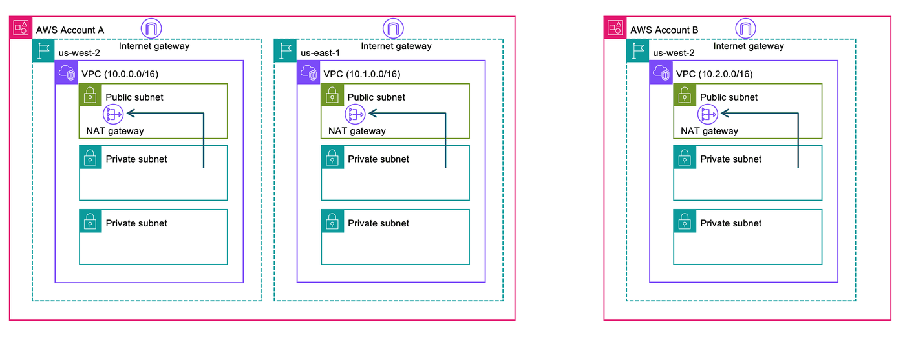
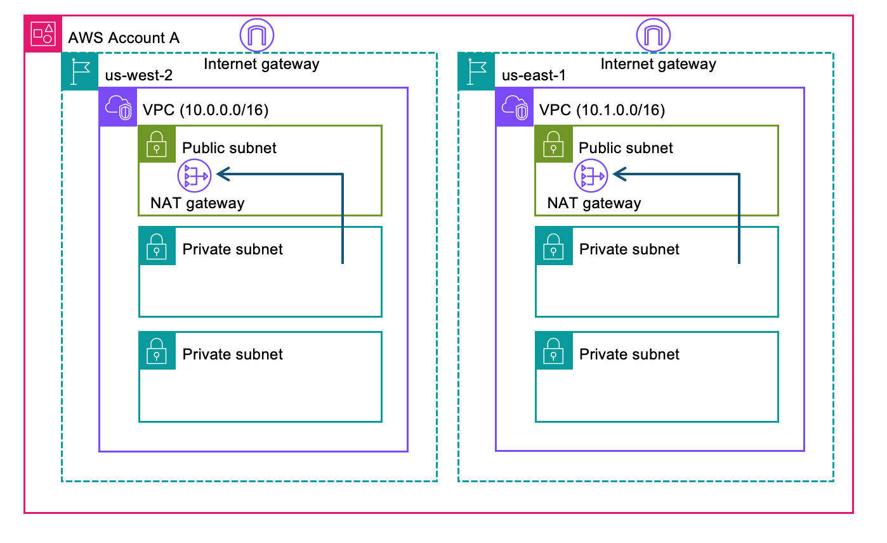

# Lab 0: Amazon VPC and Amazon Bedrock AgentCore Gateway Setup

This lab [bootstraps](https://docs.aws.amazon.com/cdk/v2/guide/bootstrapping.html) your AWS accounts and deploys the VPC infrastructure used by all subsequent labs. We will also deploy [Amazon Bedrock AgentCore Gatway](https://docs.aws.amazon.com/bedrock/latest/userguide/agentcore-gateway.html) in this notebook. We will reuse the same AgentCore Gateway in subsequent labs. 

Each VPC is created with three subnet types:
- **Public subnet** — hosts the NAT Gateway and Internet Gateway for outbound internet access
- **Private subnet** (with NAT) — workloads run here; can reach the internet via NAT but are not directly accessible from outside
- **Isolated subnet** — no internet access at all; used for resources that should have no outbound connectivity



## Prerequisites

- **[Node.js](https://nodejs.org/en/download)** v18 or later
- **[AWS CLI](https://docs.aws.amazon.com/cli/latest/userguide/getting-started-install.html)** v2
- **[Docker](https://docs.docker.com/engine/install/)**
- **[AWS CDK CLI](https://docs.aws.amazon.com/cdk/v2/guide/getting-started.html)**
- **[TypeScript](https://www.typescriptlang.org/download/)**

## Step 1: Verify prerequisites

```python
import os
from pathlib import Path

# Change to project root (find cdk.json)
cwd = Path.cwd()
while cwd != cwd.parent:
    if (cwd / "cdk.json").exists():
        break
    cwd = cwd.parent
os.chdir(cwd)
print(f"Working directory: {os.getcwd()}")
```

```python
!node --version
!npm --version
!aws --version
!docker --version
!cdk --version
```

## Step 2: Install project dependencies

```python
# Install project dependencies
!npm install
```

## Step 3: Configure AWS credentials

Update the profile name below to match your AWS CLI profile. The account ID is auto-detected from your credentials.

```python
import os
import json
import subprocess

# --- UPDATE YOUR PROFILE NAME ---
ACCOUNT_A_PROFILE = "default"

# Auto-detect account ID from credentials
result = subprocess.run(
    ["aws", "sts", "get-caller-identity", "--profile", ACCOUNT_A_PROFILE],
    capture_output=True,
    text=True,
)
identity = json.loads(result.stdout)
ACCOUNT_A_ID = identity["Account"]

os.environ["ACCOUNT_A_ID"] = ACCOUNT_A_ID
os.environ["ACCOUNT_A_PROFILE"] = ACCOUNT_A_PROFILE

# Persist for use in other notebooks
%store ACCOUNT_A_ID
%store ACCOUNT_A_PROFILE

print(f"Account A: {ACCOUNT_A_ID} (profile: {ACCOUNT_A_PROFILE})")
print(f"User:      {identity['Arn']}")
```

## Step 4: Bootstrap CDK

CDK bootstrap provisions the resources CDK needs to deploy (S3 bucket for assets, ECR repo for container images, IAM roles). This only needs to be done once per account/region.

We bootstrap **two regions** in Account A:
- `us-west-2` (primary): used by all labs
- `us-east-1`: required for the [VPC Peering lab](../01-managed-vpc-resource/02-peering.ipynb)

```python
# Bootstrap Account A in us-west-2
!cdk bootstrap aws://{ACCOUNT_A_ID}/us-west-2 --profile {ACCOUNT_A_PROFILE}
```

```python
## Bootstrap Account A in us-east-1, Uncomment only when running VPC peering lab
# !cdk bootstrap aws://{ACCOUNT_A_ID}/us-east-1 --profile {ACCOUNT_A_PROFILE}
```

## Step 5: Deploy VPCs

All VPCs have VPC Flow Logs enabled, sending traffic logs to CloudWatch (1-month retention).

| Stack | Region | Description | Required for |
|-------|--------|-------------|-------------|
| VpcegressStack-USWest2 | us-west-2 | VPC (10.0.0.0/16) | All labs |
| VpcegressStack-USEast1 | us-east-1 | VPC (10.1.0.0/16) | [VPC Peering lab](../01-managed-vpc-resource/02-peering.ipynb) |
| PeeringApigw-USEast1 | us-east-1 | Private API Gateway + VPCE | [VPC Peering lab](../01-managed-vpc-resource/02-peering.ipynb) |
| VpcPeeringStack | us-west-2 | VPC peering + routes | [VPC Peering lab](../01-managed-vpc-resource/02-peering.ipynb) |



```python
# Deploy VPCs in Account A (us-west-2)
!cdk deploy VpcegressStack-USWest2 --profile {ACCOUNT_A_PROFILE} --require-approval never --outputs-file vpc-outputs-w.json

with open("vpc-outputs-w.json") as f:
    vpc_outputs = json.load(f)

# us-west-2 VPC (primary)
usw2 = vpc_outputs["VpcegressStack-USWest2"]
VPC_USW2_ID = usw2["VpcId"]
VPC_USW2_PUBLIC_SUBNETS = usw2["PublicSubnetIds"].split(",")
VPC_USW2_PRIVATE_SUBNETS = usw2["PrivateSubnetIds"].split(",")
VPC_USW2_ISOLATED_SUBNETS = usw2["IsolatedSubnetIds"].split(",")

%store VPC_USW2_ID
%store VPC_USW2_PUBLIC_SUBNETS
%store VPC_USW2_PRIVATE_SUBNETS
%store VPC_USW2_ISOLATED_SUBNETS

print("=== us-west-2 ===")
print(f"VPC ID:           {VPC_USW2_ID}")
print(f"Public subnets:   {VPC_USW2_PUBLIC_SUBNETS}")
print(f"Private subnets:  {VPC_USW2_PRIVATE_SUBNETS}")
print(f"Isolated subnets: {VPC_USW2_ISOLATED_SUBNETS}")
```

```python
# # Uncomment only when running VPC peering lab
# !cdk deploy VpcegressStack-USEast1 PeeringApigw-USEast1 VpcPeeringStack \
#     --profile {ACCOUNT_A_PROFILE} \
#     --require-approval never \
#     --outputs-file peering-outputs.json

# with open("peering-outputs.json") as f:
#     peering_outputs = json.load(f)

# # us-east-1 VPC
# use1 = peering_outputs["VpcegressStack-USEast1"]
# VPC_USE1_ID = use1["VpcId"]
# VPC_USE1_PUBLIC_SUBNETS = use1["PublicSubnetIds"].split(",")
# VPC_USE1_PRIVATE_SUBNETS = use1["PrivateSubnetIds"].split(",")
# VPC_USE1_ISOLATED_SUBNETS = use1["IsolatedSubnetIds"].split(",")

# %store VPC_USE1_ID
# %store VPC_USE1_PUBLIC_SUBNETS
# %store VPC_USE1_PRIVATE_SUBNETS
# %store VPC_USE1_ISOLATED_SUBNETS

# print("=== us-east-1 VPC ===")
# print(f"VPC ID:           {VPC_USE1_ID}")
# print(f"Public subnets:   {VPC_USE1_PUBLIC_SUBNETS}")
# print(f"Private subnets:  {VPC_USE1_PRIVATE_SUBNETS}")
# print(f"Isolated subnets: {VPC_USE1_ISOLATED_SUBNETS}")

# # Private API Gateway in us-east-1 (for peering lab)
# apigw_e = peering_outputs["PeeringApigw-USEast1"]
# PEERING_API_ID = apigw_e["ApiId"]
# PEERING_API_KEY_ID = apigw_e["ApiKeyId"]
# PEERING_VPCE_ID = apigw_e["VpceId"]
# PEERING_VPCE_SG_ID = apigw_e["VpceSgId"]

# %store PEERING_API_ID
# %store PEERING_API_KEY_ID
# %store PEERING_VPCE_ID
# %store PEERING_VPCE_SG_ID

# print("\n=== Private API Gateway (us-east-1) ===")
# print(f"API ID:   {PEERING_API_ID}")
# print(f"VPCE ID:  {PEERING_VPCE_ID}")
# print(f"VPCE SG:  {PEERING_VPCE_SG_ID}")

# # VPC Peering
# peering_stack = peering_outputs["VpcPeeringStack"]
# PEERING_CONNECTION_ID = "peering_stack["PeeringConnectionId"]"
# %store PEERING_CONNECTION_ID
# print(f"\n=== VPC Peering ===")
# print(f"Peering ID: {PEERING_CONNECTION_ID}")
```

## Step 6: Deploy Amazon Bedrock AgentCore Gateway

This stack deploys:
- An **Amazon Bedrock AgentCore Gateway** with MCP protocol and semantic search enabled
- An **AWS Cognito User Pool** configured for machine-to-machine (M2M) OAuth 2.0 client credentials flow
- An **IAM execution role** for the gateway with EC2 permissions for VPC Lattice ENI provisioning

The stack outputs (Gateway URL, Cognito credentials, etc.) are saved and shared with subsequent notebooks via `%store`.

In this demo we are using Amazon Cognito to manage inbound authentication for AgentCore Gateway, however for your enterprise needs you can configure any OAuth 2.0 compliant IDP. Inbound configuration manages who is allowed to invoke the AgentCore Gateway. Checkout [setup](https://docs.aws.amazon.com/bedrock-agentcore/latest/devguide/identity-idp-microsoft.html) steps for Okta, Entra ID, Auth, etc.

```python
!cdk deploy SharedAgentCoreGateway --profile {ACCOUNT_A_PROFILE} --require-approval never --outputs-file gateway-outputs.json
```

```python
with open("gateway-outputs.json") as f:
    outputs = json.load(f)["SharedAgentCoreGateway"]

GATEWAY_ID = outputs["GatewayId"]
GATEWAY_URL = outputs["GatewayUrl"]
USER_POOL_ID = outputs["UserPoolId"]
USER_POOL_CLIENT_ID = outputs["UserPoolClientId"]
TOKEN_ENDPOINT_URL = outputs["TokenEndpointUrl"]
OAUTH_SCOPES = outputs["OAuthScopes"]

%store GATEWAY_ID
%store GATEWAY_URL
%store USER_POOL_ID
%store USER_POOL_CLIENT_ID
%store TOKEN_ENDPOINT_URL
%store OAUTH_SCOPES

print(f"Gateway ID:       {GATEWAY_ID}")
print(f"Gateway URL:      {GATEWAY_URL}")
print(f"User Pool ID:     {USER_POOL_ID}")
print(f"Client ID:        {USER_POOL_CLIENT_ID}")
print(f"Token Endpoint:   {TOKEN_ENDPOINT_URL}")
print(f"OAuth Scopes:     {OAUTH_SCOPES}")
```

## Step 7 (Optional): Deploy VPC in a second account

If you have a second AWS account for cross-account testing, follow these steps. This step is **required** to run the [Cross-Account lab](../02-self-managed-lattice/02-cross-account.ipynb).

| Stack | Account | Region | CIDR |
|-------|---------|--------|------|
| VpcegressStack-USWest2-AccountB | Account B | us-west-2 | 10.2.0.0/16 |


> **Important:** Using long-term access keys (Access Key ID / Secret Access Key) is **not an AWS best practice**. AWS recommends using [IAM Identity Center](https://docs.aws.amazon.com/singlesignon/latest/userguide/what-is.html) (formerly AWS SSO) with temporary credentials via `aws sso login`. For production and enterprise environments, configure your CLI profiles with IAM Identity Center instead. We use access keys here **only to quickly get started** in this lab. For more details, see [IAM security best practices](https://docs.aws.amazon.com/IAM/latest/UserGuide/best-practices.html).

```python
# from getpass import getpass

# ACCOUNT_B_PROFILE = "account-b"

# ACCESS_KEY = getpass("AWS Access Key ID: ")
# SECRET_KEY = getpass("AWS Secret Access Key: ")
# SESSION_TOKEN = getpass("AWS Session Token (leave empty if not using temporary credentials): ")
# REGION_B = "us-west-2"

# assert ACCESS_KEY.strip(), "Access Key ID cannot be empty"
# assert SECRET_KEY.strip(), "Secret Access Key cannot be empty"

# !aws configure set aws_access_key_id {ACCESS_KEY} --profile {ACCOUNT_B_PROFILE}
# !aws configure set aws_secret_access_key {SECRET_KEY} --profile {ACCOUNT_B_PROFILE}
# !aws configure set region {REGION_B} --profile {ACCOUNT_B_PROFILE}

# if SESSION_TOKEN.strip():
#     !aws configure set aws_session_token {SESSION_TOKEN} --profile {ACCOUNT_B_PROFILE}
#     print(f"Profile '{ACCOUNT_B_PROFILE}' configured with session token.")
# else:
#     print(f"Profile '{ACCOUNT_B_PROFILE}' configured (no session token).")
```

```python
# # Verify and auto-detect Account B ID
# result = subprocess.run(
#     ["aws", "sts", "get-caller-identity", "--profile", ACCOUNT_B_PROFILE],
#     capture_output=True,
#     text=True,
# )
# identity = json.loads(result.stdout)
# ACCOUNT_B_ID = identity["Account"]

# os.environ["ACCOUNT_B_ID"] = ACCOUNT_B_ID
# os.environ["ACCOUNT_B_PROFILE"] = ACCOUNT_B_PROFILE

# # Persist for use in other notebooks
# %store ACCOUNT_B_ID
# %store ACCOUNT_B_PROFILE

# print(f"Account B: {ACCOUNT_B_ID} (profile: {ACCOUNT_B_PROFILE})")
# print(f"User:      {identity['Arn']}")
```

```python
# # Bootstrap and deploy Account B VPC
# !cdk bootstrap aws://{ACCOUNT_B_ID}/us-west-2 --profile {ACCOUNT_B_PROFILE}
# !ACCOUNT_B_ID={ACCOUNT_B_ID} cdk deploy VpcegressStack-USWest2-AccountB \
#     --profile {ACCOUNT_B_PROFILE} \
#     --require-approval never \
#     --outputs-file vpc-outputs-account-b.json
```

```python
# with open("vpc-outputs-account-b.json") as f:
#     vpc_b_outputs = json.load(f)

# accb = vpc_b_outputs["VpcegressStack-USWest2-AccountB"]
# VPC_ACCB_USW2_ID = accb["VpcId"]
# VPC_ACCB_USW2_PUBLIC_SUBNETS = accb["PublicSubnetIds"].split(",")
# VPC_ACCB_USW2_PRIVATE_SUBNETS = accb["PrivateSubnetIds"].split(",")
# VPC_ACCB_USW2_ISOLATED_SUBNETS = accb["IsolatedSubnetIds"].split(",")

# %store VPC_ACCB_USW2_ID
# %store VPC_ACCB_USW2_PUBLIC_SUBNETS
# %store VPC_ACCB_USW2_PRIVATE_SUBNETS
# %store VPC_ACCB_USW2_ISOLATED_SUBNETS

# print("=== Account B / us-west-2 ===")
# print(f"VPC ID:           {VPC_ACCB_USW2_ID}")
# print(f"Private subnets:  {VPC_ACCB_USW2_PRIVATE_SUBNETS}")
```

## Cleanup

To tear down all resources created in this lab, run the following cells. Run these **after completing all other labs**.

> **Warning:** The AgentCore Gateway cannot be deleted while it has targets. The cleanup cell below automatically deletes all gateway targets first, then destroys the stacks.

> **Note:** The VPC stack (`VpcegressStack-USWest2`) may fail to delete if security groups or ENIs from other labs are still present in the VPC. These are retained during lab stack deletion because VPC Lattice Resource Gateway ENIs may still reference them. Before deleting the VPC stack, make sure all lab stacks are destroyed and manually delete any retained security groups and orphaned ENIs in the VPC via the AWS Console or CLI.

```python
# import time
# import boto3

# session = boto3.Session(profile_name=ACCOUNT_A_PROFILE, region_name="us-west-2")
# agentcore = session.client("bedrock-agentcore-control")

# # Delete all gateway targets before destroying the gateway stack
# targets = agentcore.list_gateway_targets(gatewayIdentifier=GATEWAY_ID, maxResults=100)
# for target in targets.get("items", []):
#     tid = target["targetId"]
#     print(f"Deleting target: {tid}")
#     agentcore.delete_gateway_target(gatewayIdentifier=GATEWAY_ID, targetId=tid)
#     # Wait for deletion
#     while True:
#         try:
#             t = agentcore.get_gateway_target(gatewayIdentifier=GATEWAY_ID, targetId=tid)
#             print(f"  {tid}: {t['status']}")
#             time.sleep(15)
#         except agentcore.exceptions.ResourceNotFoundException:
#             print(f"  {tid}: deleted")
#             break

# print("All targets deleted. Safe to destroy gateway stack.")
```

```python
# # Destroy Account A stack - us-west-2
# !cdk destroy SharedAgentCoreGateway VpcegressStack-USWest2 --profile {ACCOUNT_A_PROFILE} --force
```

```python
# # Destroy Account A stacks - us-east-1 (VPC Peering lab)
# !cdk destroy VpcPeeringStack PeeringApigw-USEast1 VpcegressStack-USEast1 --profile {ACCOUNT_A_PROFILE} --force
```

```python
# # (Optional) Destroy Account B stacks
# # !ACCOUNT_B_ID={ACCOUNT_B_ID} cdk destroy CrossAccountApigw-AccountB VpcegressStack-USWest2-AccountB --profile {ACCOUNT_B_PROFILE} --force
```
