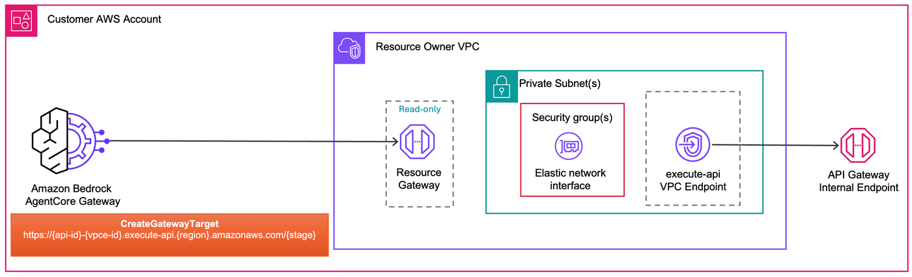

# Getting Started: Private API Gateway with Managed VPC Lattice

This lab deploys a private [Amazon API Gateway](https://docs.aws.amazon.com/apigateway/latest/developerguide/apigateway-private-apis.html) with mock integrations, then connects it to [Amazon Bedrock AgentCore Gateway](https://docs.aws.amazon.com/bedrock-agentcore/latest/devguide/gateway.html) using managed VPC egress.

The [API-VPCE DNS format](https://docs.aws.amazon.com/apigateway/latest/developerguide/apigateway-private-api-create.html) (`{api-id}-{vpce-id}.execute-api.{region}.amazonaws.com`) is publicly resolvable with a valid AWS-managed TLS certificate.

For background on VPC egress and managed VPC resource, see the [project README](../README.md) and [Managed VPC Resource](./README.md).

## Architecture



## Prerequisites

- Completed [Lab 0](../00-prerequisites/00-vpc-gateway-setup.ipynb) (VPC + AgentCore Gateway deployed)

No domain name or ACM certificate is needed for this lab.

## Step 1: Install dependencies and import libraries

```python
import os
from pathlib import Path

# Change to project root
cwd = Path.cwd()
while cwd != cwd.parent:
    if (cwd / "cdk.json").exists():
        break
    cwd = cwd.parent
os.chdir(cwd)
print(f"Working directory: {os.getcwd()}")

!pip install --force-reinstall -q -r requirements.txt
```

```python
import json
import os
import time

import boto3
from utils.utils import get_token

# Restore variables from Lab 0
%store -r ACCOUNT_A_ID
%store -r ACCOUNT_A_PROFILE
%store -r GATEWAY_ID
%store -r GATEWAY_URL
%store -r USER_POOL_ID
%store -r USER_POOL_CLIENT_ID
%store -r TOKEN_ENDPOINT_URL
%store -r OAUTH_SCOPES
%store -r VPC_USW2_ID
%store -r VPC_USW2_PRIVATE_SUBNETS

os.environ["ACCOUNT_A_ID"] = ACCOUNT_A_ID

REGION = "us-west-2"
session = boto3.Session(profile_name=ACCOUNT_A_PROFILE, region_name=REGION)
agentcore = session.client("bedrock-agentcore-control")

# Get Cognito client secret
cognito = session.client("cognito-idp")
client_desc = cognito.describe_user_pool_client(UserPoolId=USER_POOL_ID, ClientId=USER_POOL_CLIENT_ID)
CLIENT_SECRET = client_desc["UserPoolClient"]["ClientSecret"]

print(f"Account:    {ACCOUNT_A_ID}")
print(f"Region:     {REGION}")
print(f"Gateway ID: {GATEWAY_ID}")
print(f"VPC ID:     {VPC_USW2_ID}")
```

## Step 2: Deploy Private API Gateway

This CDK stack deploys:
- **Private API Gateway** with mock integrations (`/health` GET, `/items` GET/POST)
- **VPC Endpoint** for `execute-api` in private subnets with private DNS enabled
- **Security group** allowing inbound HTTPS (443) from the VPC CIDR

When a VPC endpoint is associated with a private API, API Gateway generates a special DNS name:
```
https://{api-id}-{vpce-id}.execute-api.{region}.amazonaws.com/{stage}
```

This DNS name is **publicly resolvable** (resolves to VPCE private IPs) and uses a valid AWS-managed TLS certificate.

```python
!cdk deploy PrivateApigw --profile {ACCOUNT_A_PROFILE} --require-approval never --outputs-file apigw-outputs.json
```

```python
with open("apigw-outputs.json") as f:
    apigw_outputs = json.load(f)["PrivateApigw"]

API_ID = apigw_outputs["ApiId"]
API_KEY_ID = apigw_outputs["ApiKeyId"]
VPCE_ID = apigw_outputs["VpceId"]
VPCE_SG_ID = apigw_outputs["VpceSgId"]

# Use the API-VPCE DNS format: publicly resolvable, resolves to VPCE private IPs
API_VPCE_DNS = f"{API_ID}-{VPCE_ID}.execute-api.{REGION}.amazonaws.com"

# Get the API key value
apigw_client = session.client("apigateway")
api_key_response = apigw_client.get_api_key(apiKey=API_KEY_ID, includeValue=True)
API_KEY_VALUE = api_key_response["value"]

print(f"API ID:       {API_ID}")
print(f"API Key ID:   {API_KEY_ID}")
print(f"VPCE ID:      {VPCE_ID}")
print(f"API-VPCE DNS: {API_VPCE_DNS}")
print(f"VPCE SG:      {VPCE_SG_ID}")
```

## Step 3: Create API Key Credential Provider

AgentCore Gateway needs to authenticate to the API Gateway using an API key. We create an [API key credential provider](https://docs.aws.amazon.com/bedrock-agentcore/latest/devguide/gateway-identity.html) that stores the API key and tells AgentCore which header to send it in.

API Gateway expects the key in the `x-api-key` header.

```python
# Create an API key credential provider in AgentCore
cred_response = agentcore.create_api_key_credential_provider(
    name="private-apigw-api-key",
    apiKey=API_KEY_VALUE,
)
CRED_PROVIDER_ARN = cred_response["credentialProviderArn"]
print(f"Credential provider ARN: {CRED_PROVIDER_ARN}")
```

## Step 4: Create AgentCore Gateway Target

Create a gateway target using [managed VPC resource](./README.md). The endpoint uses the API-VPCE DNS format which is publicly resolvable.

The `credentialProviderConfigurations` parameter tells AgentCore to use the API key credential provider to authenticate to the API Gateway.

> **Security group:** We pass the VPCE security group to `securityGroupIds` so the Resource Gateway ENIs can reach the VPCE on port 443. See [Security group considerations](./README.md#security-group-considerations).

```python
# Load the OpenAPI schema and inject the server URL
with open("01-managed-vpc-resource/openapi-private-apigw.json") as f:
    openapi_schema = json.load(f)

# Set the server URL to the actual API-VPCE DNS endpoint
TARGET_ENDPOINT = f"https://{API_VPCE_DNS}/prod"
openapi_schema["servers"] = [{"url": TARGET_ENDPOINT}]

OPENAPI_SCHEMA = json.dumps(openapi_schema)
print(f"Loaded OpenAPI schema: {openapi_schema['info']['title']} v{openapi_schema['info']['version']}")
print(f"Server URL: {TARGET_ENDPOINT}")
print(f"Endpoints: {list(openapi_schema['paths'].keys())}")

print(f"\nTarget endpoint: {TARGET_ENDPOINT}")

response = agentcore.create_gateway_target(
    gatewayIdentifier=GATEWAY_ID,
    name="private-apigw",
    description="Private API Gateway via VPCE and managed VPC egress",
    targetConfiguration={
        "mcp": {
            "openApiSchema": {
                "inlinePayload": OPENAPI_SCHEMA,
            }
        }
    },
    credentialProviderConfigurations=[
        {
            "credentialProviderType": "API_KEY",
            "credentialProvider": {
                "apiKeyCredentialProvider": {
                    "providerArn": CRED_PROVIDER_ARN,
                    "credentialParameterName": "x-api-key",
                    "credentialLocation": "HEADER",
                }
            },
        }
    ],
    privateEndpoint={
        "managedVpcResource": {
            "vpcIdentifier": VPC_USW2_ID,
            "subnetIds": VPC_USW2_PRIVATE_SUBNETS,
            "endpointIpAddressType": "IPV4",
            "securityGroupIds": [VPCE_SG_ID],
        }
    },
)

TARGET_ID = response["targetId"]
print(f"\nTarget ID: {TARGET_ID}")
print(f"Status:    {response['status']}")
```

```python
while True:
    target = agentcore.get_gateway_target(gatewayIdentifier=GATEWAY_ID, targetId=TARGET_ID)
    status = target["status"]
    print(f"Status: {status}")
    if status == "READY":
        print("\nTarget is active!")
        print(f"  Managed resources: {target.get('privateEndpointManagedResources', {})}")
        break
    if status == "FAILED":
        print(f"\nTarget creation failed: {target.get('statusReasons', [])}")
        break
    time.sleep(30)
```

## Step 5: Invoke the API through AgentCore Gateway

Get an access token from Cognito, then invoke the private API Gateway's operations through the gateway as MCP tools.

```python
token_response = get_token(
    token_endpoint_url=TOKEN_ENDPOINT_URL,
    client_id=USER_POOL_CLIENT_ID,
    client_secret=CLIENT_SECRET,
    scope_string=OAUTH_SCOPES.replace(",", " "),
)
ACCESS_TOKEN = token_response["access_token"]
print(f"Access token obtained (expires in {token_response['expires_in']}s)")
```

```python
import requests

headers = {
    "Authorization": f"Bearer {ACCESS_TOKEN}",
    "Content-Type": "application/json",
}

# List available tools (API operations exposed as MCP tools)
response = requests.post(
    GATEWAY_URL,
    headers=headers,
    json={"jsonrpc": "2.0", "method": "tools/list", "id": 1},
)
print("Available tools:")
print(json.dumps(response.json(), indent=2))
```

```python
# Health check
response = requests.post(
    GATEWAY_URL,
    headers=headers,
    json={
        "jsonrpc": "2.0",
        "method": "tools/call",
        "params": {"name": "private-apigw___healthCheck", "arguments": {}},
        "id": 2,
    },
)
print("Health check:")
print(json.dumps(response.json(), indent=2))
```

```python
# List items
response = requests.post(
    GATEWAY_URL,
    headers=headers,
    json={
        "jsonrpc": "2.0",
        "method": "tools/call",
        "params": {"name": "private-apigw___listItems", "arguments": {}},
        "id": 3,
    },
)
print("Items:")
print(json.dumps(response.json(), indent=2))
```

## Cleanup

1. Delete the gateway target
2. Delete the API key credential provider
3. Destroy the API Gateway CDK stack
4. Delete the VPCE security group (retained by CDK because VPC Lattice ENIs may still reference it)

> **Note:** The VPCE security group is retained during stack deletion because AgentCore's managed Resource Gateway ENIs may still reference it. Delete it manually after the gateway target is fully removed.

```python
# # Step 1: Delete gateway target
# agentcore.delete_gateway_target(gatewayIdentifier=GATEWAY_ID, targetId=TARGET_ID)
# print(f"Deleting target: {TARGET_ID}")
# while True:
#     try:
#         t = agentcore.get_gateway_target(gatewayIdentifier=GATEWAY_ID, targetId=TARGET_ID)
#         print(f"  Status: {t['status']}")
#         time.sleep(15)
#     except agentcore.exceptions.ResourceNotFoundException:
#         print("  Target deleted.")
#         break

# # Step 2: Delete credential provider
# agentcore.delete_api_key_credential_provider(name="private-apigw-api-key")
# print("Deleted credential provider: private-apigw-api-key")
```

```python
# # Step 3: Destroy the stack (SG is retained, deleted in next cell)
# !cdk destroy PrivateApigw --profile {ACCOUNT_A_PROFILE} --force
```

```python
# # Step 4: Delete the retained VPCE security group
# # If this fails with "DependencyViolation", wait a few minutes for ENIs to be released
# ec2_client = session.client("ec2")
# try:
#     ec2_client.delete_security_group(GroupId=VPCE_SG_ID)
#     print(f"Deleted security group: {VPCE_SG_ID}")
# except ec2_client.exceptions.ClientError as e:
#     if "DependencyViolation" in str(e):
#         print(f"SG {VPCE_SG_ID} still has dependencies. Wait a few minutes and retry.")
#     else:
#         raise
```
