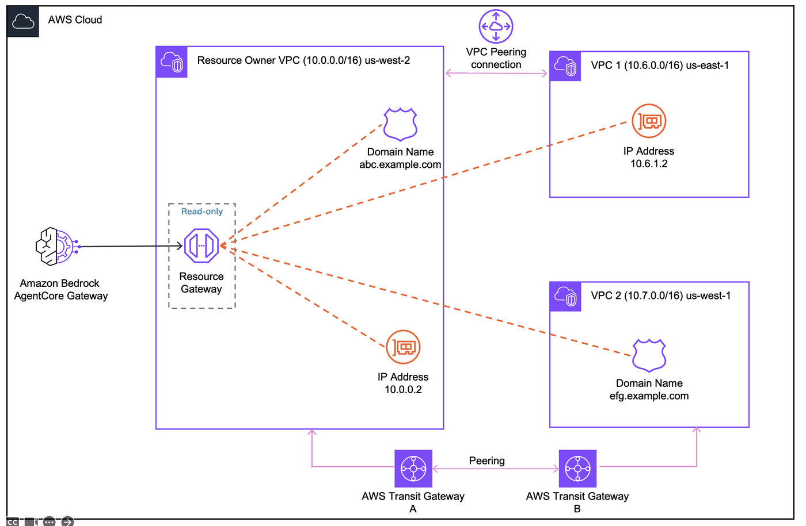

# VPC Peering: Connect to a Private API in Another Region

This lab connects Amazon Bedrock AgentCore Gateway to a **Private API Gateway in a peered VPC** in a different region. This is a common enterprise pattern where services are deployed across multiple regions or VPCs for isolation, compliance, or proximity.

## Architecture



## How it works

1. A **Private API Gateway** with a VPC Endpoint runs in the peered VPC (us-east-1, 10.1.0.0/16)
2. A **VPC Peering connection** links the two VPCs across regions (us-west-2 <-> us-east-1)
3. Route table entries in both VPCs direct cross-VPC traffic through the peering connection
4. AgentCore Gateway creates a **managed Resource Gateway** in the owner VPC (us-west-2, 10.0.0.0/16)
5. The Resource Gateway ENI resolves the API-VPCE DNS to the VPCE's private IPs (10.1.x.x) and routes traffic through the peering connection

The API-VPCE DNS format (`{api-id}-{vpce-id}.execute-api.us-east-1.amazonaws.com`) is **publicly resolvable** — it resolves to the VPCE's private IPs.

> **Why does this work?** Interface VPC Endpoints (powered by AWS PrivateLink) create ENIs with private IP addresses. These IPs are routable through VPC peering connections, unlike Gateway VPC Endpoints (S3/DynamoDB) which are route-table-based and not accessible through peering.

For background on VPC egress and managed VPC resource, see the [project README](../README.md) and [Managed VPC Resource README](./README.md).

## Prerequisites

- Completed [Lab 0](../00-prerequisites/00-vpc-gateway-setup.ipynb) (VPC us-west-2 + AgentCore Gateway deployed)
- **Bootstrap us-east-1**: In Lab 0, uncomment and run the us-east-1 bootstrap cell
- **Deploy us-east-1 stacks**: In Lab 0, uncomment and run the us-east-1 VPC + API Gateway deployment cell

## Step 1: Install dependencies and import libraries

```python
import os
from pathlib import Path

# Change to project root
cwd = Path.cwd()
while cwd != cwd.parent:
    if (cwd / "cdk.json").exists():
        break
    cwd = cwd.parent
os.chdir(cwd)
print(f"Working directory: {os.getcwd()}")

!pip install --force-reinstall -q -r requirements.txt
```

```python
import json
import os
import time

import boto3
from utils.utils import get_token

# Restore variables from Lab 0
%store -r ACCOUNT_A_ID
%store -r ACCOUNT_A_PROFILE
%store -r GATEWAY_ID
%store -r GATEWAY_URL
%store -r USER_POOL_ID
%store -r USER_POOL_CLIENT_ID
%store -r TOKEN_ENDPOINT_URL
%store -r OAUTH_SCOPES
%store -r VPC_USW2_ID
%store -r VPC_USW2_PRIVATE_SUBNETS

# Restore us-east-1 variables (deployed in Lab 0)
%store -r VPC_USE1_ID
%store -r PEERING_API_ID
%store -r PEERING_API_KEY_ID
%store -r PEERING_VPCE_ID

os.environ["ACCOUNT_A_ID"] = ACCOUNT_A_ID

REGION_W = "us-west-2"
REGION_E = "us-east-1"

session_w = boto3.Session(profile_name=ACCOUNT_A_PROFILE, region_name=REGION_W)
session_e = boto3.Session(profile_name=ACCOUNT_A_PROFILE, region_name=REGION_E)

agentcore = session_w.client("bedrock-agentcore-control")
ec2_w = session_w.client("ec2")

# Get Cognito client secret
cognito = session_w.client("cognito-idp")
client_desc = cognito.describe_user_pool_client(UserPoolId=USER_POOL_ID, ClientId=USER_POOL_CLIENT_ID)
CLIENT_SECRET = client_desc["UserPoolClient"]["ClientSecret"]

print(f"Account:    {ACCOUNT_A_ID}")
print(f"Gateway ID: {GATEWAY_ID}")
print(f"VPC (west): {VPC_USW2_ID}")
print(f"VPC (east): {VPC_USE1_ID}")
```

## Step 2: Verify us-east-1 infrastructure

The following stacks were deployed in [Lab 0](../00-prerequisites/00-vpc-gateway-setup.ipynb):

| Stack | Description |
|-------|-------------|
| `VpcegressStack-USEast1` | VPC (10.1.0.0/16) with public, private, and isolated subnets |
| `PeeringApigw-USEast1` | Private API Gateway with mock integrations + execute-api VPC Endpoint |

The Private API Gateway uses the same pattern as [Lab 01](./01-getting-started.ipynb) — mock `/health` and `/items` endpoints behind an API key.

```python
# API-VPCE DNS: publicly resolvable, resolves to VPCE private IPs in us-east-1
API_VPCE_DNS = f"{PEERING_API_ID}-{PEERING_VPCE_ID}.execute-api.{REGION_E}.amazonaws.com"

# Get the API key value
apigw_client = session_e.client("apigateway")
api_key_response = apigw_client.get_api_key(apiKey=PEERING_API_KEY_ID, includeValue=True)
API_KEY_VALUE = api_key_response["value"]

print("=== us-east-1 VPC ===")
print(f"VPC ID:          {VPC_USE1_ID}")
print("\n=== Private API Gateway ===")
print(f"API ID:          {PEERING_API_ID}")
print(f"VPCE ID:         {PEERING_VPCE_ID}")
print(f"API-VPCE DNS:    {API_VPCE_DNS}")
```

## Step 3: Create AgentCore Gateway target

The VPC peering connection, routes, and security group rules were all deployed via CDK in [Lab 0](../00-prerequisites/00-vpc-gateway-setup.ipynb):
- **`VpcPeeringStack`** created the peering connection, accepted it via a custom resource, and added routes in both VPCs
- **`PeeringApigw-USEast1`** created the VPCE security group with inbound rules for both VPC CIDRs (10.0.0.0/16 and 10.1.0.0/16)

Now create a gateway target using managed VPC resource. The Resource Gateway is placed in the **us-west-2 VPC** (owner VPC), and the target endpoint is the API-VPCE DNS in **us-east-1** (peered VPC).

Traffic flow:
```
AgentCore Gateway -> VPC Lattice -> Resource Gateway ENI (us-west-2)
    -> VPC Peering -> VPCE ENI (us-east-1) -> Private API Gateway
```

```python
# Create a security group in us-west-2 for the Resource Gateway ENIs
# New security groups allow all outbound by default
sg = ec2_w.create_security_group(
    GroupName=f"peering-rg-sg-{int(time.time())}",
    Description="Resource Gateway SG for peering lab - allows outbound HTTPS",
    VpcId=VPC_USW2_ID,
)
RG_SG_ID = sg["GroupId"]
print(f"Resource Gateway SG (us-west-2): {RG_SG_ID}")
```

```python
# Create an API key credential provider in AgentCore
cred_response = agentcore.create_api_key_credential_provider(
    name="peering-apigw-api-key",
    apiKey=API_KEY_VALUE,
)
CRED_PROVIDER_ARN = cred_response["credentialProviderArn"]
print(f"Credential provider ARN: {CRED_PROVIDER_ARN}")
```

```python
# Load the OpenAPI schema and set the server URL to the peered API-VPCE DNS
with open("01-managed-vpc-resource/openapi-private-apigw.json") as f:
    openapi_schema = json.load(f)

TARGET_ENDPOINT = f"https://{API_VPCE_DNS}/prod"
openapi_schema["servers"] = [{"url": TARGET_ENDPOINT}]
OPENAPI_SCHEMA = json.dumps(openapi_schema)

print(f"Target endpoint: {TARGET_ENDPOINT}")
print(f"Resource Gateway VPC: {VPC_USW2_ID} (us-west-2)")
print(f"API Gateway VPC:      {VPC_USE1_ID} (us-east-1)")

response = agentcore.create_gateway_target(
    gatewayIdentifier=GATEWAY_ID,
    name="peering-apigw",
    description="Private API Gateway in peered VPC (us-east-1) via VPC peering",
    targetConfiguration={
        "mcp": {
            "openApiSchema": {
                "inlinePayload": OPENAPI_SCHEMA,
            }
        }
    },
    credentialProviderConfigurations=[
        {
            "credentialProviderType": "API_KEY",
            "credentialProvider": {
                "apiKeyCredentialProvider": {
                    "providerArn": CRED_PROVIDER_ARN,
                    "credentialParameterName": "x-api-key",
                    "credentialLocation": "HEADER",
                }
            },
        }
    ],
    privateEndpoint={
        "managedVpcResource": {
            "vpcIdentifier": VPC_USW2_ID,
            "subnetIds": VPC_USW2_PRIVATE_SUBNETS,
            "endpointIpAddressType": "IPV4",
            "securityGroupIds": [RG_SG_ID],
        }
    },
)

TARGET_ID = response["targetId"]
print(f"\nTarget ID: {TARGET_ID}")
print(f"Status:    {response['status']}")
```

```python
while True:
    target = agentcore.get_gateway_target(gatewayIdentifier=GATEWAY_ID, targetId=TARGET_ID)
    status = target["status"]
    print(f"Status: {status}")
    if status == "READY":
        print("\nTarget is active!")
        print(f"  Managed resources: {target.get('privateEndpoint', {})}")
        break
    if status == "FAILED":
        print(f"\nTarget creation failed: {target.get('statusReasons', [])}")
        break
    time.sleep(30)
```

## Step 4: Invoke the API through AgentCore Gateway

Get an access token from Cognito, then invoke the Private API Gateway in us-east-1 through AgentCore Gateway. The traffic flows from us-west-2 through the VPC peering connection to the VPCE in us-east-1.

```python
token_response = get_token(
    token_endpoint_url=TOKEN_ENDPOINT_URL,
    client_id=USER_POOL_CLIENT_ID,
    client_secret=CLIENT_SECRET,
    scope_string=OAUTH_SCOPES.replace(",", " "),
)
ACCESS_TOKEN = token_response["access_token"]
print(f"Access token obtained (expires in {token_response['expires_in']}s)")
```

```python
import requests

headers = {
    "Authorization": f"Bearer {ACCESS_TOKEN}",
    "Content-Type": "application/json",
}

# List available tools
response = requests.post(
    GATEWAY_URL,
    headers=headers,
    json={"jsonrpc": "2.0", "method": "tools/list", "id": 1},
)
print("Available tools:")
print(json.dumps(response.json(), indent=2))
```

```python
# Health check - invokes GET /health on the Private API Gateway in us-east-1
response = requests.post(
    GATEWAY_URL,
    headers=headers,
    json={
        "jsonrpc": "2.0",
        "method": "tools/call",
        "params": {"name": "peering-apigw___healthCheck", "arguments": {}},
        "id": 2,
    },
)
print("Health check (us-east-1 Private API Gateway via VPC peering):")
print(json.dumps(response.json(), indent=2))
```

```python
# List items
response = requests.post(
    GATEWAY_URL,
    headers=headers,
    json={
        "jsonrpc": "2.0",
        "method": "tools/call",
        "params": {"name": "peering-apigw___listItems", "arguments": {}},
        "id": 3,
    },
)
print("Items (from peered VPC):")
print(json.dumps(response.json(), indent=2))
```

## Cleanup

1. Delete the gateway target and credential provider
2. Delete the Resource Gateway security group

> **Note:** The VPC peering connection, routes, security groups, and CDK stacks are destroyed in [Lab 0](../00-prerequisites/00-vpc-gateway-setup.ipynb) cleanup via `cdk destroy VpcPeeringStack PeeringApigw-USEast1 VpcegressStack-USEast1`.

```python
# # Step 1: Delete gateway target
# agentcore.delete_gateway_target(gatewayIdentifier=GATEWAY_ID, targetId=TARGET_ID)
# print(f"Deleting target: {TARGET_ID}")
# while True:
#     try:
#         t = agentcore.get_gateway_target(gatewayIdentifier=GATEWAY_ID, targetId=TARGET_ID)
#         print(f"  Status: {t['status']}")
#         time.sleep(15)
#     except agentcore.exceptions.ResourceNotFoundException:
#         print("  Target deleted.")
#         break

# # Delete credential provider
# agentcore.delete_api_key_credential_provider(name="peering-apigw-api-key")
# print("Deleted credential provider: peering-apigw-api-key")
```

```python
# # Step 2: Delete the Resource Gateway security group
# try:
#     ec2_w.delete_security_group(GroupId=RG_SG_ID)
#     print(f"Deleted security group: {RG_SG_ID}")
# except ec2_w.exceptions.ClientError as e:
#     if "DependencyViolation" in str(e):
#         print(f"SG {RG_SG_ID} still has dependencies. Wait a few minutes and retry.")
#     else:
#         raise
```
