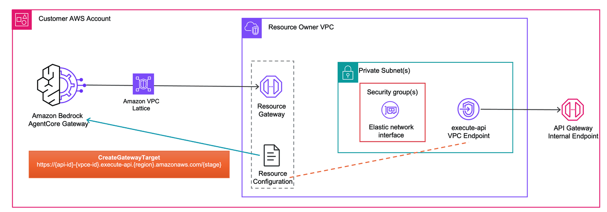
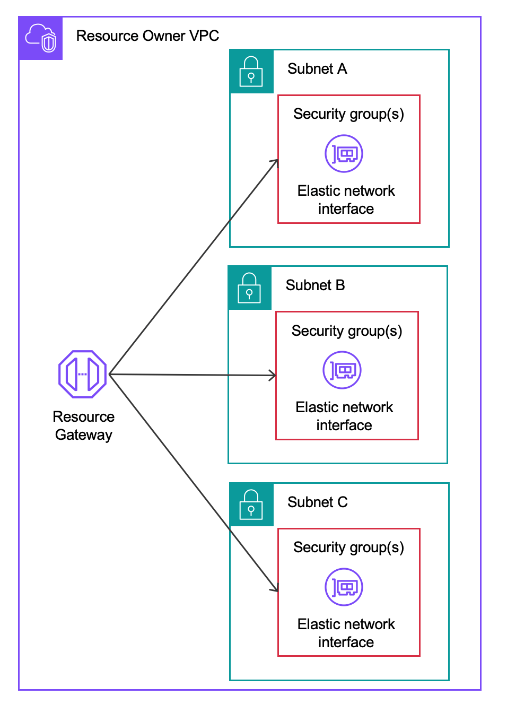
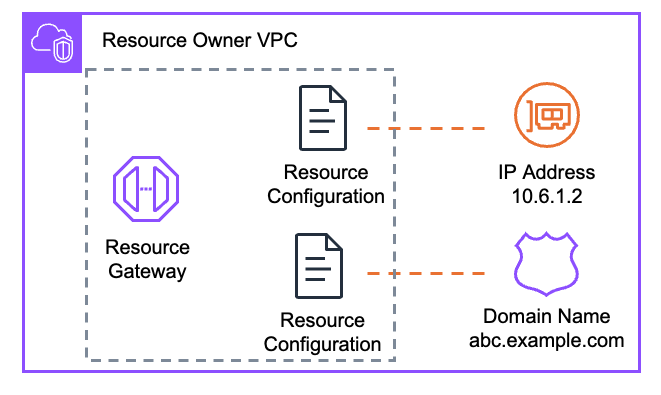

# Getting Started: Private API Gateway with Self-Managed VPC Lattice

This lab deploys the same private [Amazon API Gateway](https://docs.aws.amazon.com/apigateway/latest/developerguide/apigateway-private-apis.html) with mock integrations as the [managed VPC resource lab](../01-managed-vpc-resource/01-getting-started.ipynb), but instead of letting AgentCore manage the VPC Lattice resources, **you create and manage the Resource Gateway and Resource Configuration yourself** using boto3.

### What's different from the managed VPC resource lab?

| | Managed | Self-Managed (this lab) |
|---|---------|----------------------|
| **Resource Gateway** | Created by AgentCore | You create it via `create_resource_gateway` |
| **Resource Configuration** | Created by AgentCore | You create it via `create_resource_configuration` |
| **CreateGatewayTarget** | `managedVpcResource` (VPC, subnets, SGs) | `selfManagedLatticeResource` (just the RC ARN) |
| **Cleanup** | Delete target only | Delete target, Resource Configuration, and Resource Gateway |
| **Control** | AgentCore manages lifecycle | You control subnet placement, SGs, IPs per ENI |

For background on self-managed Lattice, see the [Self-Managed Lattice README](./README.md).

## Architecture



## Prerequisites

- Completed [Lab 0](../00-prerequisites/00-vpc-gateway-setup.ipynb) (VPC + AgentCore Gateway deployed)

No domain name or ACM certificate is needed for this lab.

## Step 1: Install dependencies and import libraries

```python
import os
from pathlib import Path

# Change to project root
cwd = Path.cwd()
while cwd != cwd.parent:
    if (cwd / "cdk.json").exists():
        break
    cwd = cwd.parent
os.chdir(cwd)
print(f"Working directory: {os.getcwd()}")

!pip install --force-reinstall -q -r requirements.txt
```

```python
import json
import os
import time

import boto3
from utils.utils import get_token

# Restore variables from Lab 0
%store -r ACCOUNT_A_ID
%store -r ACCOUNT_A_PROFILE
%store -r GATEWAY_ID
%store -r GATEWAY_URL
%store -r USER_POOL_ID
%store -r USER_POOL_CLIENT_ID
%store -r TOKEN_ENDPOINT_URL
%store -r OAUTH_SCOPES
%store -r VPC_USW2_ID
%store -r VPC_USW2_PRIVATE_SUBNETS

os.environ["ACCOUNT_A_ID"] = ACCOUNT_A_ID

REGION = "us-west-2"
session = boto3.Session(profile_name=ACCOUNT_A_PROFILE, region_name=REGION)
agentcore = session.client("bedrock-agentcore-control")
lattice = session.client("vpc-lattice")

# Get Cognito client secret
cognito = session.client("cognito-idp")
client_desc = cognito.describe_user_pool_client(UserPoolId=USER_POOL_ID, ClientId=USER_POOL_CLIENT_ID)
CLIENT_SECRET = client_desc["UserPoolClient"]["ClientSecret"]

print(f"Account:    {ACCOUNT_A_ID}")
print(f"Region:     {REGION}")
print(f"Gateway ID: {GATEWAY_ID}")
print(f"VPC ID:     {VPC_USW2_ID}")
```

## Step 2: Deploy Private API Gateway

This CDK stack deploys:
- **Private API Gateway** with mock integrations (`/health` GET, `/items` GET/POST) protected by an API key
- **VPC Endpoint** for `execute-api` in private subnets with private DNS enabled
- **Security group** allowing inbound HTTPS (443) from the VPC CIDR

When a VPC endpoint is associated with a private API, API Gateway generates a special DNS name:
```
https://{api-id}-{vpce-id}.execute-api.{region}.amazonaws.com/{stage}
```

This DNS name is **publicly resolvable** (resolves to VPCE private IPs) and uses a valid AWS-managed TLS certificate. No custom domain or ACM cert needed.

> This is the same stack used in the [managed VPC resource lab](../01-managed-vpc-resource/01-getting-started.ipynb). If you already deployed it, this step will show "no changes".

```python
!cdk deploy PrivateApigw --profile {ACCOUNT_A_PROFILE} --require-approval never --outputs-file apigw-outputs.json
```

```python
with open("apigw-outputs.json") as f:
    apigw_outputs = json.load(f)["PrivateApigw"]

API_ID = apigw_outputs["ApiId"]
API_KEY_ID = apigw_outputs["ApiKeyId"]
VPCE_ID = apigw_outputs["VpceId"]
VPCE_SG_ID = apigw_outputs["VpceSgId"]

API_VPCE_DNS = f"{API_ID}-{VPCE_ID}.execute-api.{REGION}.amazonaws.com"

# Get the API key value
apigw_client = session.client("apigateway")
api_key_response = apigw_client.get_api_key(apiKey=API_KEY_ID, includeValue=True)
API_KEY_VALUE = api_key_response["value"]

print(f"API ID:       {API_ID}")
print(f"VPCE ID:      {VPCE_ID}")
print(f"API-VPCE DNS: {API_VPCE_DNS}")
print(f"VPCE SG:      {VPCE_SG_ID}")
```

## Step 3: Create VPC Lattice Resource Gateway

In self-managed mode, **you** create the Resource Gateway. This provisions ENIs in the subnets you specify, which serve as the entry point for AgentCore traffic into your VPC.



You control:
- Which subnets the ENIs are placed in
- Which security groups govern the ENIs
- The number of IPs per ENI (default 1, up to 62)

```python
# Create the Resource Gateway
rg_response = lattice.create_resource_gateway(
    name="self-managed-apigw-rg",
    vpcIdentifier=VPC_USW2_ID,
    subnetIds=VPC_USW2_PRIVATE_SUBNETS,
    securityGroupIds=[VPCE_SG_ID],
    ipAddressType="IPV4",
)

RESOURCE_GATEWAY_ID = rg_response["id"]
print(f"Resource Gateway ID:  {RESOURCE_GATEWAY_ID}")
print(f"Resource Gateway ARN: {rg_response['arn']}")
print(f"Status:               {rg_response['status']}")
```

```python
# Wait for the Resource Gateway to become ACTIVE
while True:
    rg = lattice.get_resource_gateway(resourceGatewayIdentifier=RESOURCE_GATEWAY_ID)
    status = rg["status"]
    print(f"Status: {status}")
    if status == "ACTIVE":
        print("\nResource Gateway is active!")
        break
    if status == "CREATE_FAILED":
        print(f"\nFailed: {rg}")
        break
    time.sleep(15)
```

## Step 4: Create Resource Configuration

The Resource Configuration defines **what** AgentCore is allowed to reach through the Resource Gateway. Rather than granting access to your entire VPC, it scopes connectivity to a single endpoint.



We use a DNS-based resource configuration pointing to the API-VPCE DNS name.

```python
# Create the Resource Configuration
rc_response = lattice.create_resource_configuration(
    name="self-managed-apigw-rc",
    type="SINGLE",
    resourceGatewayIdentifier=RESOURCE_GATEWAY_ID,
    resourceConfigurationDefinition={
        "dnsResource": {
            "domainName": API_VPCE_DNS,
            "ipAddressType": "IPV4",
        }
    },
    portRanges=["443"],
)

RESOURCE_CONFIG_ARN = rc_response["arn"]
RESOURCE_CONFIG_ID = rc_response["id"]
print(f"Resource Configuration ID:  {RESOURCE_CONFIG_ID}")
print(f"Resource Configuration ARN: {RESOURCE_CONFIG_ARN}")
print(f"Status:                     {rc_response['status']}")
```

```python
# Wait for the Resource Configuration to become ACTIVE
while True:
    rc = lattice.get_resource_configuration(resourceConfigurationIdentifier=RESOURCE_CONFIG_ID)
    status = rc["status"]
    print(f"Status: {status}")
    if status == "ACTIVE":
        print("\nResource Configuration is active!")
        break
    if status == "CREATE_FAILED":
        print(f"\nFailed: {rc}")
        break
    time.sleep(15)
```

## Step 5: Create API Key Credential Provider

Same as the managed VPC resource lab — AgentCore needs an API key credential provider to authenticate to the API Gateway.

```python
cred_response = agentcore.create_api_key_credential_provider(
    name="self-managed-apigw-api-key",
    apiKey=API_KEY_VALUE,
)
CRED_PROVIDER_ARN = cred_response["credentialProviderArn"]
print(f"Credential provider ARN: {CRED_PROVIDER_ARN}")
```

## Step 6: Create AgentCore Gateway Target

Now create the gateway target using `selfManagedLatticeResource`. Instead of providing VPC/subnet/SG details (which you already configured in the Resource Gateway), you just provide the **Resource Configuration identifier**.


AgentCore associates the Resource Configuration with its service network, completing the end-to-end connectivity.

```python
# Load the OpenAPI schema and inject the server URL
with open("02-self-managed-lattice/openapi-private-apigw.json") as f:
    openapi_schema = json.load(f)

TARGET_ENDPOINT = f"https://{API_VPCE_DNS}/prod"
openapi_schema["servers"] = [{"url": TARGET_ENDPOINT}]

OPENAPI_SCHEMA = json.dumps(openapi_schema)
print(f"Target endpoint: {TARGET_ENDPOINT}")
```

```python
response = agentcore.create_gateway_target(
    gatewayIdentifier=GATEWAY_ID,
    name="self-managed-apigw",
    description="Private API Gateway via self-managed VPC Lattice",
    targetConfiguration={
        "mcp": {
            "openApiSchema": {
                "inlinePayload": OPENAPI_SCHEMA,
            }
        }
    },
    credentialProviderConfigurations=[
        {
            "credentialProviderType": "API_KEY",
            "credentialProvider": {
                "apiKeyCredentialProvider": {
                    "providerArn": CRED_PROVIDER_ARN,
                    "credentialParameterName": "x-api-key",
                    "credentialLocation": "HEADER",
                }
            },
        }
    ],
    privateEndpoint={
        "selfManagedLatticeResource": {
            "resourceConfigurationIdentifier": RESOURCE_CONFIG_ARN,
        }
    },
)

TARGET_ID = response["targetId"]
print(f"\nTarget ID: {TARGET_ID}")
print(f"Status:    {response['status']}")
```

```python
while True:
    target = agentcore.get_gateway_target(gatewayIdentifier=GATEWAY_ID, targetId=TARGET_ID)
    status = target["status"]
    print(f"Status: {status}")
    if status == "READY":
        print("\nTarget is active!")
        print(f"  Resource association: {target.get('privateEndpointManagedResources', {})}")
        break
    if status == "FAILED":
        print(f"\nTarget creation failed: {target.get('statusReasons', [])}")
        break
    time.sleep(30)
```

## Step 7: Invoke the API through AgentCore Gateway

Get an access token from Cognito, then invoke the private API Gateway's operations through the gateway.

```python
token_response = get_token(
    token_endpoint_url=TOKEN_ENDPOINT_URL,
    client_id=USER_POOL_CLIENT_ID,
    client_secret=CLIENT_SECRET,
    scope_string=OAUTH_SCOPES.replace(",", " "),
)
ACCESS_TOKEN = token_response["access_token"]
print(f"Access token obtained (expires in {token_response['expires_in']}s)")
```

```python
import requests

headers = {
    "Authorization": f"Bearer {ACCESS_TOKEN}",
    "Content-Type": "application/json",
}

response = requests.post(
    GATEWAY_URL,
    headers=headers,
    json={"jsonrpc": "2.0", "method": "tools/list", "id": 1},
)
print("Available tools:")
print(json.dumps(response.json(), indent=2))
```

```python
response = requests.post(
    GATEWAY_URL,
    headers=headers,
    json={
        "jsonrpc": "2.0",
        "method": "tools/call",
        "params": {"name": "self-managed-apigw___healthCheck", "arguments": {}},
        "id": 2,
    },
)
print("Health check:")
print(json.dumps(response.json(), indent=2))
```

```python
response = requests.post(
    GATEWAY_URL,
    headers=headers,
    json={
        "jsonrpc": "2.0",
        "method": "tools/call",
        "params": {"name": "self-managed-apigw___listItems", "arguments": {}},
        "id": 3,
    },
)
print("Items:")
print(json.dumps(response.json(), indent=2))
```

## Cleanup

In self-managed mode, you must delete the VPC Lattice resources yourself (in reverse order):
1. Delete the gateway target
2. Delete the credential provider
3. Delete the service network resource association (created by AgentCore, may take a few minutes to become deletable)
4. Delete the Resource Configuration
5. Delete the Resource Gateway
6. Destroy the API Gateway CDK stack

> **Note:** When you delete the gateway target, AgentCore asynchronously removes the service network resource association. This can take a few minutes. If deleting the Resource Configuration fails with "has existing association with service networks", wait and retry.

```python
# # Step 1: Delete gateway target
# agentcore.delete_gateway_target(gatewayIdentifier=GATEWAY_ID, targetId=TARGET_ID)
# print(f"Deleting target: {TARGET_ID}")
# while True:
#     try:
#         t = agentcore.get_gateway_target(gatewayIdentifier=GATEWAY_ID, targetId=TARGET_ID)
#         print(f"  Status: {t['status']}")
#         time.sleep(15)
#     except agentcore.exceptions.ResourceNotFoundException:
#         print("  Target deleted.")
#         break

# # Step 2: Delete credential provider
# agentcore.delete_api_key_credential_provider(name="self-managed-apigw-api-key")
# print("Deleted credential provider")

# # Step 3: Delete Resource Configuration
# # If this fails with "has existing association", wait a few minutes and retry.
# # AgentCore asynchronously removes the service network association after target deletion.
# lattice.delete_resource_configuration(resourceConfigurationIdentifier=RESOURCE_CONFIG_ID)
# print(f"Deleted Resource Configuration: {RESOURCE_CONFIG_ID}")

# # Step 4: Delete Resource Gateway
# lattice.delete_resource_gateway(resourceGatewayIdentifier=RESOURCE_GATEWAY_ID)
# print(f"Deleted Resource Gateway: {RESOURCE_GATEWAY_ID}")
```

```python
# Step 5: Destroy the stack (SG is retained, deleted in next cell)
# !cdk destroy PrivateApigw --profile {ACCOUNT_A_PROFILE} --force
```

```python
# # Step 6: Delete the retained VPCE security group
# # If this fails with "DependencyViolation", wait a few minutes for ENIs to be released
# ec2_client = session.client("ec2")
# try:
#     ec2_client.delete_security_group(GroupId=VPCE_SG_ID)
#     print(f"Deleted security group: {VPCE_SG_ID}")
# except ec2_client.exceptions.ClientError as e:
#     if "DependencyViolation" in str(e):
#         print(f"SG {VPCE_SG_ID} still has dependencies. Wait a few minutes and retry.")
#     else:
#         raise
```
