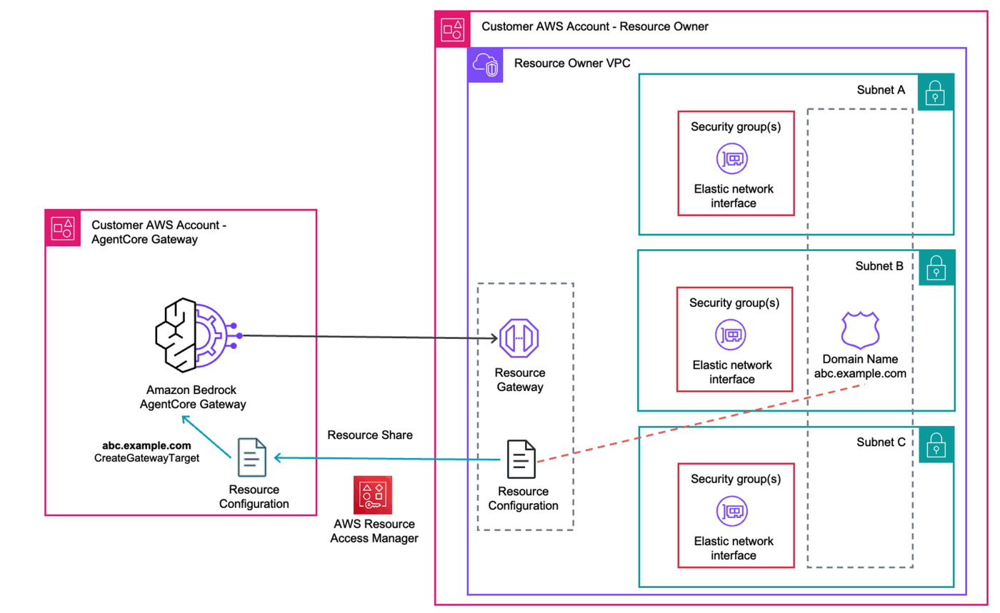
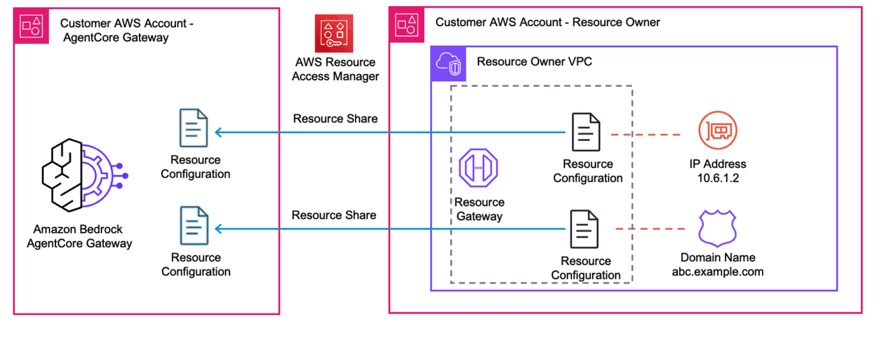

# Cross-Account: Share a Private API via AWS RAM

This lab connects Amazon Bedrock AgentCore Gateway in **Account A** to a **Private API Gateway in Account B** using self-managed VPC Lattice and [AWS Resource Access Manager (RAM)](https://docs.aws.amazon.com/ram/latest/userguide/what-is.html).

This is the standard enterprise pattern for cross-account connectivity: the resource owner (Account B) creates the VPC Lattice resources and shares them with the gateway owner (Account A) via RAM.

## Architecture



## How it works

1. **Account B** (resource owner): Private API Gateway + VPCE + VPC Lattice Resource Gateway + Resource Configuration
2. **Account B** shares the Resource Configuration with **Account A** via AWS RAM
3. **Account A** accepts the RAM share and sees the shared Resource Configuration ARN
4. **Account A** creates a gateway target with `selfManagedLatticeResource` pointing to the shared Resource Configuration ARN
5. AgentCore associates the Resource Configuration with its service network, completing cross-account connectivity



For background on self-managed Lattice, see the [Self-Managed Lattice README](./README.md).

## Prerequisites

- Completed [Lab 0](../00-prerequisites/00-vpc-gateway-setup.ipynb) (VPC us-west-2 + AgentCore Gateway deployed)
- **Account B configured**: In Lab 0, uncomment and run the Account B setup (credentials, bootstrap, VPC deployment) cells

## Step 1: Install dependencies and import libraries

```python
import os
from pathlib import Path

# Change to project root
cwd = Path.cwd()
while cwd != cwd.parent:
    if (cwd / "cdk.json").exists():
        break
    cwd = cwd.parent
os.chdir(cwd)
print(f"Working directory: {os.getcwd()}")

!pip install --force-reinstall -q -r requirements.txt
```

```python
import json
import os
import time

import boto3
from utils.utils import get_token

# Restore Account A variables from Lab 0
%store -r ACCOUNT_A_ID
%store -r ACCOUNT_A_PROFILE
%store -r GATEWAY_ID
%store -r GATEWAY_URL
%store -r USER_POOL_ID
%store -r USER_POOL_CLIENT_ID
%store -r TOKEN_ENDPOINT_URL
%store -r OAUTH_SCOPES

# Restore Account B variables from Lab 0
%store -r ACCOUNT_B_ID
%store -r ACCOUNT_B_PROFILE
%store -r VPC_ACCB_USW2_ID
%store -r VPC_ACCB_USW2_PRIVATE_SUBNETS

os.environ["ACCOUNT_A_ID"] = ACCOUNT_A_ID
os.environ["ACCOUNT_B_ID"] = ACCOUNT_B_ID

REGION = "us-west-2"
session_a = boto3.Session(profile_name=ACCOUNT_A_PROFILE, region_name=REGION)
session_b = boto3.Session(profile_name=ACCOUNT_B_PROFILE, region_name=REGION)

agentcore = session_a.client("bedrock-agentcore-control")
lattice_b = session_b.client("vpc-lattice")
ram_a = session_a.client("ram")
ram_b = session_b.client("ram")

# Get Cognito client secret
cognito = session_a.client("cognito-idp")
client_desc = cognito.describe_user_pool_client(UserPoolId=USER_POOL_ID, ClientId=USER_POOL_CLIENT_ID)
CLIENT_SECRET = client_desc["UserPoolClient"]["ClientSecret"]

print(f"Account A: {ACCOUNT_A_ID} (gateway owner)")
print(f"Account B: {ACCOUNT_B_ID} (resource owner)")
print(f"Gateway:   {GATEWAY_ID}")
print(f"VPC (B):   {VPC_ACCB_USW2_ID}")
```

## Step 2: Deploy Private API Gateway in Account B

Deploy a Private API Gateway with mock integrations in Account B's VPC. This is the same `PrivateApigwStack` pattern used in other labs — mock `/health` and `/items` endpoints behind an API key.

```python
!ACCOUNT_B_ID={ACCOUNT_B_ID} cdk deploy CrossAccountApigw-AccountB \
    --profile {ACCOUNT_B_PROFILE} \
    --require-approval never \
    --outputs-file cross-account-outputs.json
```

```python
with open("cross-account-outputs.json") as f:
    outputs = json.load(f)

apigw_b = outputs["CrossAccountApigw-AccountB"]
CROSSACCT_API_ID = apigw_b["ApiId"]
CROSSACCT_API_KEY_ID = apigw_b["ApiKeyId"]
CROSSACCT_VPCE_ID = apigw_b["VpceId"]
CROSSACCT_VPCE_SG_ID = apigw_b["VpceSgId"]

# API-VPCE DNS in Account B
API_VPCE_DNS = f"{CROSSACCT_API_ID}-{CROSSACCT_VPCE_ID}.execute-api.{REGION}.amazonaws.com"

# Get the API key value from Account B
apigw_client_b = session_b.client("apigateway")
api_key_response = apigw_client_b.get_api_key(apiKey=CROSSACCT_API_KEY_ID, includeValue=True)
API_KEY_VALUE = api_key_response["value"]

print("=== Account B Private API Gateway ===")
print(f"VPC ID:       {VPC_ACCB_USW2_ID}")
print(f"API ID:       {CROSSACCT_API_ID}")
print(f"VPCE ID:      {CROSSACCT_VPCE_ID}")
print(f"API-VPCE DNS: {API_VPCE_DNS}")
print(f"VPCE SG:      {CROSSACCT_VPCE_SG_ID}")
```

## Step 3: Create VPC Lattice resources in Account B

In Account B (resource owner), create:
1. **Resource Gateway** — provisions ENIs in Account B's VPC
2. **Resource Configuration** — defines the endpoint (API-VPCE DNS) that AgentCore can reach


```python
# Create Resource Gateway in Account B
rg_response = lattice_b.create_resource_gateway(
    name="cross-account-rg",
    vpcIdentifier=VPC_ACCB_USW2_ID,
    subnetIds=VPC_ACCB_USW2_PRIVATE_SUBNETS,
    securityGroupIds=[CROSSACCT_VPCE_SG_ID],
    ipAddressType="IPV4",
)

RESOURCE_GATEWAY_ID = rg_response["id"]
print(f"Resource Gateway ID:  {RESOURCE_GATEWAY_ID}")
print(f"Status:               {rg_response['status']}")
```

```python
# Wait for Resource Gateway to become ACTIVE
while True:
    rg = lattice_b.get_resource_gateway(resourceGatewayIdentifier=RESOURCE_GATEWAY_ID)
    status = rg["status"]
    print(f"Status: {status}")
    if status == "ACTIVE":
        print("\nResource Gateway is active!")
        break
    if status == "CREATE_FAILED":
        print(f"\nFailed: {rg}")
        break
    time.sleep(15)
```

```python
# Create Resource Configuration in Account B
rc_response = lattice_b.create_resource_configuration(
    name="cross-account-rc",
    type="SINGLE",
    resourceGatewayIdentifier=RESOURCE_GATEWAY_ID,
    resourceConfigurationDefinition={
        "dnsResource": {
            "domainName": API_VPCE_DNS,
            "ipAddressType": "IPV4",
        }
    },
    portRanges=["443"],
)

RESOURCE_CONFIG_ARN = rc_response["arn"]
RESOURCE_CONFIG_ID = rc_response["id"]
print(f"Resource Configuration ID:  {RESOURCE_CONFIG_ID}")
print(f"Resource Configuration ARN: {RESOURCE_CONFIG_ARN}")
print(f"Status:                     {rc_response['status']}")
```

```python
# Wait for Resource Configuration to become ACTIVE
while True:
    rc = lattice_b.get_resource_configuration(resourceConfigurationIdentifier=RESOURCE_CONFIG_ID)
    status = rc["status"]
    print(f"Status: {status}")
    if status == "ACTIVE":
        print("\nResource Configuration is active!")
        break
    if status == "CREATE_FAILED":
        print(f"\nFailed: {rc}")
        break
    time.sleep(15)
```

## Step 4: Share Resource Configuration via AWS RAM

Account B shares the Resource Configuration with Account A using AWS RAM. Account A then accepts the share, making the Resource Configuration ARN visible in Account A.


```python
# Account B: Create RAM resource share
share_response = ram_b.create_resource_share(
    name="cross-account-rc-share",
    resourceArns=[RESOURCE_CONFIG_ARN],
    principals=[ACCOUNT_A_ID],
)

RAM_SHARE_ARN = share_response["resourceShare"]["resourceShareArn"]
print(f"RAM Share ARN: {RAM_SHARE_ARN}")
print(f"Status:        {share_response['resourceShare']['status']}")
```

```python
# Account A: Find and accept the RAM share invitation
time.sleep(5)  # Brief wait for invitation to propagate

invitations = ram_a.get_resource_share_invitations()["resourceShareInvitations"]

# Find the invitation for our share
invitation_arn = None
for inv in invitations:
    if inv["resourceShareArn"] == RAM_SHARE_ARN and inv["status"] == "PENDING":
        invitation_arn = inv["resourceShareInvitationArn"]
        break

if invitation_arn:
    accept = ram_a.accept_resource_share_invitation(resourceShareInvitationArn=invitation_arn)
    print("Accepted RAM share invitation")
    print(f"Status: {accept['resourceShareInvitation']['status']}")
else:
    print("No pending invitation found. It may have been auto-accepted (same org).")

print(f"\nResource Configuration ARN (shared): {RESOURCE_CONFIG_ARN}")
print("This ARN is now visible in Account A.")
```

## Step 5: Create AgentCore Gateway target in Account A

Now in Account A, create the gateway target using `selfManagedLatticeResource`. Pass the **shared Resource Configuration ARN** from Account B.

```python
# Create an API key credential provider in Account A
cred_response = agentcore.create_api_key_credential_provider(
    name="cross-account-apigw-api-key",
    apiKey=API_KEY_VALUE,
)
CRED_PROVIDER_ARN = cred_response["credentialProviderArn"]
print(f"Credential provider ARN: {CRED_PROVIDER_ARN}")
```

```python
# Load the OpenAPI schema and set the server URL
with open("02-self-managed-lattice/openapi-private-apigw.json") as f:
    openapi_schema = json.load(f)

TARGET_ENDPOINT = f"https://{API_VPCE_DNS}/prod"
openapi_schema["servers"] = [{"url": TARGET_ENDPOINT}]
OPENAPI_SCHEMA = json.dumps(openapi_schema)

print(f"Target endpoint:      {TARGET_ENDPOINT}")
print(f"Resource Config ARN:  {RESOURCE_CONFIG_ARN} (from Account B)")

response = agentcore.create_gateway_target(
    gatewayIdentifier=GATEWAY_ID,
    name="cross-account-apigw",
    description="Private API Gateway in Account B via self-managed VPC Lattice + RAM",
    targetConfiguration={
        "mcp": {
            "openApiSchema": {
                "inlinePayload": OPENAPI_SCHEMA,
            }
        }
    },
    credentialProviderConfigurations=[
        {
            "credentialProviderType": "API_KEY",
            "credentialProvider": {
                "apiKeyCredentialProvider": {
                    "providerArn": CRED_PROVIDER_ARN,
                    "credentialParameterName": "x-api-key",
                    "credentialLocation": "HEADER",
                }
            },
        }
    ],
    privateEndpoint={
        "selfManagedLatticeResource": {
            "resourceConfigurationIdentifier": RESOURCE_CONFIG_ARN,
        }
    },
)

TARGET_ID = response["targetId"]
print(f"\nTarget ID: {TARGET_ID}")
print(f"Status:    {response['status']}")
```

```python
while True:
    target = agentcore.get_gateway_target(gatewayIdentifier=GATEWAY_ID, targetId=TARGET_ID)
    status = target["status"]
    print(f"Status: {status}")
    if status == "READY":
        print("\nTarget is active!")
        print(f"  Resource association: {target.get('privateEndpoint', {})}")
        break
    if status == "FAILED":
        print(f"\nTarget creation failed: {target.get('statusReasons', [])}")
        break
    time.sleep(30)
```

## Step 6: Invoke the API through AgentCore Gateway

Get an access token from Cognito, then invoke the Private API Gateway in Account B through AgentCore Gateway in Account A.

```python
token_response = get_token(
    token_endpoint_url=TOKEN_ENDPOINT_URL,
    client_id=USER_POOL_CLIENT_ID,
    client_secret=CLIENT_SECRET,
    scope_string=OAUTH_SCOPES.replace(",", " "),
)
ACCESS_TOKEN = token_response["access_token"]
print(f"Access token obtained (expires in {token_response['expires_in']}s)")
```

```python
import requests

headers = {
    "Authorization": f"Bearer {ACCESS_TOKEN}",
    "Content-Type": "application/json",
}

# Health check - invokes GET /health on the Private API Gateway in Account B
response = requests.post(
    GATEWAY_URL,
    headers=headers,
    json={
        "jsonrpc": "2.0",
        "method": "tools/call",
        "params": {"name": "cross-account-apigw___healthCheck", "arguments": {}},
        "id": 1,
    },
)
print("Health check (Account B Private API Gateway via cross-account Lattice):")
print(json.dumps(response.json(), indent=2))
```

```python
# List items
response = requests.post(
    GATEWAY_URL,
    headers=headers,
    json={
        "jsonrpc": "2.0",
        "method": "tools/call",
        "params": {"name": "cross-account-apigw___listItems", "arguments": {}},
        "id": 2,
    },
)
print("Items (from Account B):")
print(json.dumps(response.json(), indent=2))
```

## Cleanup

Clean up in reverse order across both accounts:

1. **Account A**: Delete gateway target and credential provider
2. **Account B**: Delete RAM share
3. **Account B**: Delete Resource Configuration and Resource Gateway
4. **Account B**: Destroy CDK stack and delete retained VPCE security group

> **Note:** When you delete the gateway target, AgentCore asynchronously removes the service network resource association. If deleting the Resource Configuration fails with "has existing association with service networks", wait a few minutes and retry.

```python
# # Step 1 (Account A): Delete gateway target
# agentcore.delete_gateway_target(gatewayIdentifier=GATEWAY_ID, targetId=TARGET_ID)
# print(f"Deleting target: {TARGET_ID}")
# while True:
#     try:
#         t = agentcore.get_gateway_target(gatewayIdentifier=GATEWAY_ID, targetId=TARGET_ID)
#         print(f"  Status: {t['status']}")
#         time.sleep(15)
#     except agentcore.exceptions.ResourceNotFoundException:
#         print("  Target deleted.")
#         break

# # Delete credential provider
# agentcore.delete_api_key_credential_provider(name="cross-account-apigw-api-key")
# print("Deleted credential provider")
```

```python
# # Step 2 (Account B): Delete RAM share
# ram_b.delete_resource_share(resourceShareArn=RAM_SHARE_ARN)
# print(f"Deleted RAM share: {RAM_SHARE_ARN}")
```

```python
# # Step 3 (Account B): Delete Resource Configuration and Resource Gateway
# # If RC deletion fails with "existing association", wait a few minutes and retry this cell.
# try:
#     lattice_b.delete_resource_configuration(resourceConfigurationIdentifier=RESOURCE_CONFIG_ID)
#     print(f"Deleted Resource Configuration: {RESOURCE_CONFIG_ID}")

#     lattice_b.delete_resource_gateway(resourceG`atewayIdentifier=RESOURCE_GATEWAY_ID)
#     print(f"Deleted Resource Gateway: {RESOURCE_GATEWAY_ID}")`
# except lattice_b.exceptions.ClientError as e:
#     if "existing association with service networks" in str(e):
#         print(f"RC still associated with service network. Wait a few minutes and re-run this cell.")
#     else:
#         raise
```

```python
# # Step 4 (Account B): Destroy CDK stack and delete retained VPCE security group
# !ACCOUNT_B_ID={ACCOUNT_B_ID} cdk destroy CrossAccountApigw-AccountB --profile {ACCOUNT_B_PROFILE} --force

# # Delete the retained VPCE security group
# ec2_b = session_b.client("ec2")
# try:
#     ec2_b.delete_security_group(GroupId=CROSSACCT_VPCE_SG_ID)
#     print(f"Deleted VPCE security group: {CROSSACCT_VPCE_SG_ID}")
# except ec2_b.exceptions.ClientError as e:
#     if "DependencyViolation" in str(e):
#         print(f"SG {CROSSACCT_VPCE_SG_ID} still has dependencies. Wait a few minutes and retry.")
#     else:
#         raise
```
